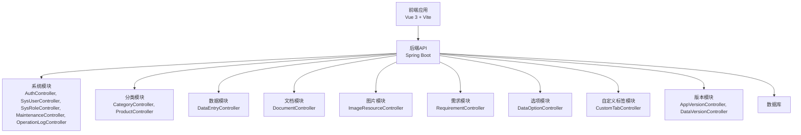
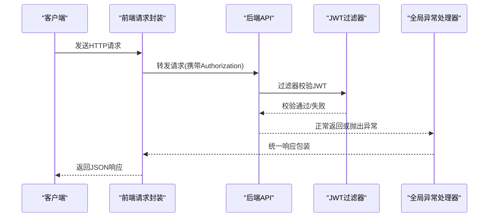
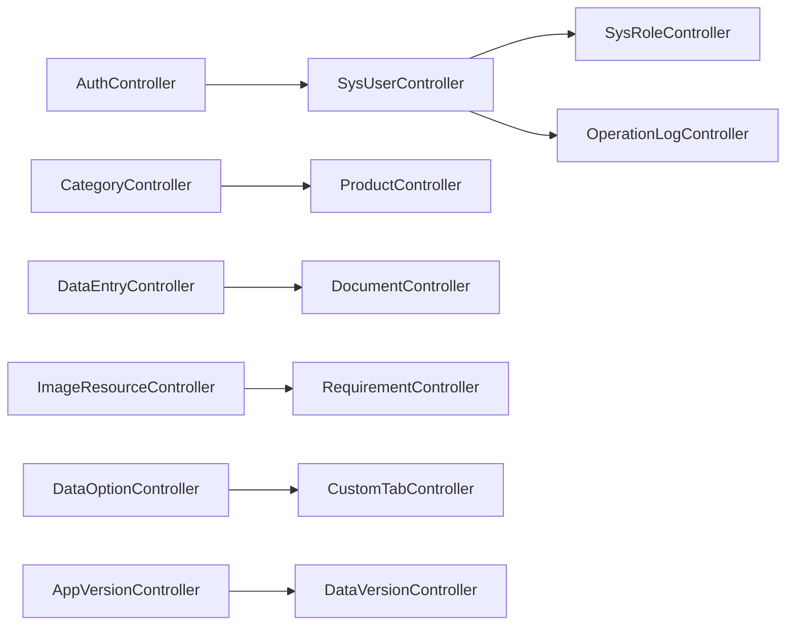

# API接口文档

<cite>
**本文档引用的文件**
- [AuthController.java](file://src/main/java/com/superpower/modules/system/controller/AuthController.java)
- [SysUserController.java](file://src/main/java/com/superpower/modules/system/controller/SysUserController.java)
- [SysRoleController.java](file://src/main/java/com/superpower/modules/system/controller/SysRoleController.java)
- [MaintenanceController.java](file://src/main/java/com/superpower/modules/system/controller/MaintenanceController.java)
- [OperationLogController.java](file://src/main/java/com/superpower/modules/system/controller/OperationLogController.java)
- [CategoryController.java](file://src/main/java/com/superpower/modules/category/controller/CategoryController.java)
- [ProductController.java](file://src/main/java/com/superpower/modules/category/controller/ProductController.java)
- [DataEntryController.java](file://src/main/java/com/superpower/modules/data/controller/DataEntryController.java)
- [DocumentController.java](file://src/main/java/com/superpower/modules/document/controller/DocumentController.java)
- [ImageResourceController.java](file://src/main/java/com/superpower/modules/image/controller/ImageResourceController.java)
- [RequirementController.java](file://src/main/java/com/superpower/modules/requirement/controller/RequirementController.java)
- [DataOptionController.java](file://src/main/java/com/superpower/modules/option/controller/DataOptionController.java)
- [CustomTabController.java](file://src/main/java/com/superpower/modules/customtab/controller/CustomTabController.java)
- [AppVersionController.java](file://src/main/java/com/superpower/modules/version/controller/AppVersionController.java)
- [DataVersionController.java](file://src/main/java/com/superpower/modules/version/controller/DataVersionController.java)
- [auth.js](file://frontend/src/api/auth.js)
- [user.js](file://frontend/src/api/user.js)
- [category.js](file://frontend/src/api/category.js)
- [product.js](file://frontend/src/api/product.js)
- [data.js](file://frontend/src/api/data.js)
- [document.js](file://frontend/src/api/document.js)
- [image.js](file://frontend/src/api/image.js)
- [requirement.js](file://frontend/src/api/requirement.js)
- [option.js](file://frontend/src/api/option.js)
- [customTab.js](file://frontend/src/api/customTab.js)
- [version.js](file://frontend/src/api/version.js)
- [request.js](file://frontend/src/utils/request.js)
- [application.yml](file://src/main/resources/application.yml)
- [SecurityConfig.java](file://src/main/java/com/superpower/config/SecurityConfig.java)
- [JwtAuthenticationFilter.java](file://src/main/java/com/superpower/security/JwtAuthenticationFilter.java)
- [GlobalExceptionHandler.java](file://src/main/java/com/superpower/common/GlobalExceptionHandler.java)
- [Result.java](file://src/main/java/com/superpower/common/Result.java)
- [ResultCode.java](file://src/main/java/com/superpower/common/ResultCode.java)
</cite>

## 目录
1. [简介](#简介)
2. [项目结构](#项目结构)
3. [核心组件](#核心组件)
4. [架构总览](#架构总览)
5. [详细组件分析](#详细组件分析)
6. [依赖关系分析](#依赖关系分析)
7. [性能考虑](#性能考虑)
8. [故障排除指南](#故障排除指南)
9. [结论](#结论)
10. [附录](#附录)

## 简介
本API接口文档面向产品清单管理系统，覆盖用户认证、系统管理、产品分类与管理、数据操作、文档生成、图片资源、需求管理、选项配置、自定义标签、版本控制等模块。文档提供各RESTful端点的HTTP方法、URL模式、请求参数、响应格式、请求/响应示例及错误码说明，并给出最佳实践、安全注意事项与性能优化建议。

## 项目结构
后端采用Spring Boot架构，按功能域划分模块（system、category、data、document、image、requirement、option、customtab、version等），每个模块包含controller/dto/entity/repository/service层。前端基于Vue 3 + Vite，通过统一请求工具封装调用后端API。

图表来源
- [AuthController.java:1-200](file://src/main/java/com/superpower/modules/system/controller/AuthController.java#L1-L200)
- [CategoryController.java:1-200](file://src/main/java/com/superpower/modules/category/controller/CategoryController.java#L1-L200)
- [DataEntryController.java:1-200](file://src/main/java/com/superpower/modules/data/controller/DataEntryController.java#L1-L200)
- [DocumentController.java:1-200](file://src/main/java/com/superpower/modules/document/controller/DocumentController.java#L1-L200)
- [ImageResourceController.java:1-200](file://src/main/java/com/superpower/modules/image/controller/ImageResourceController.java#L1-L200)
- [RequirementController.java:1-200](file://src/main/java/com/superpower/modules/requirement/controller/RequirementController.java#L1-L200)
- [DataOptionController.java:1-200](file://src/main/java/com/superpower/modules/option/controller/DataOptionController.java#L1-L200)
- [CustomTabController.java:1-200](file://src/main/java/com/superpower/modules/customtab/controller/CustomTabController.java#L1-L200)
- [AppVersionController.java:1-200](file://src/main/java/com/superpower/modules/version/controller/AppVersionController.java#L1-L200)
- [DataVersionController.java:1-200](file://src/main/java/com/superpower/modules/version/controller/DataVersionController.java#L1-L200)

章节来源
- [application.yml:1-200](file://src/main/resources/application.yml#L1-L200)
- [SecurityConfig.java:1-200](file://src/main/java/com/superpower/config/SecurityConfig.java#L1-L200)

## 核心组件
- 统一响应包装：所有接口返回统一结构，包含状态码、消息与数据体，便于前端处理与错误识别。
- 全局异常处理：集中捕获业务异常与运行时异常，标准化错误输出。
- 安全过滤：基于JWT的认证过滤器，拦截未授权访问并校验令牌有效性。
- 前端请求封装：统一的HTTP客户端，自动注入认证头、错误处理与重试策略。

章节来源
- [Result.java:1-200](file://src/main/java/com/superpower/common/Result.java#L1-L200)
- [ResultCode.java:1-200](file://src/main/java/com/superpower/common/ResultCode.java#L1-L200)
- [GlobalExceptionHandler.java:1-200](file://src/main/java/com/superpower/common/GlobalExceptionHandler.java#L1-L200)
- [JwtAuthenticationFilter.java:1-200](file://src/main/java/com/superpower/security/JwtAuthenticationFilter.java#L1-L200)
- [request.js:1-200](file://frontend/src/utils/request.js#L1-L200)

## 架构总览
系统采用前后端分离架构，前端通过Axios封装的HTTP客户端调用后端REST API；后端通过Spring MVC暴露REST端点，使用Spring Security进行鉴权，JWT作为认证载体，全局异常处理器统一返回结果。

图表来源
- [request.js:1-200](file://frontend/src/utils/request.js#L1-L200)
- [JwtAuthenticationFilter.java:1-200](file://src/main/java/com/superpower/security/JwtAuthenticationFilter.java#L1-L200)
- [GlobalExceptionHandler.java:1-200](file://src/main/java/com/superpower/common/GlobalExceptionHandler.java#L1-L200)

## 详细组件分析

### 用户认证接口
- 登录
  - 方法与路径：POST /api/auth/login
  - 请求体：用户名、密码
  - 成功响应：返回JWT令牌与用户信息
  - 失败响应：返回错误码与提示
  - 示例请求：见[auth.js:1-200](file://frontend/src/api/auth.js#L1-L200)
  - 示例响应：见[auth.js:1-200](file://frontend/src/api/auth.js#L1-L200)
- 登出
  - 方法与路径：POST /api/auth/logout
  - 请求体：空
  - 成功响应：返回成功状态
  - 失败响应：返回错误码与提示
  - 示例请求：见[auth.js:1-200](file://frontend/src/api/auth.js#L1-L200)
  - 示例响应：见[auth.js:1-200](file://frontend/src/api/auth.js#L1-L200)

章节来源
- [AuthController.java:1-200](file://src/main/java/com/superpower/modules/system/controller/AuthController.java#L1-L200)
- [auth.js:1-200](file://frontend/src/api/auth.js#L1-L200)

### 系统管理接口
- 用户管理
  - 查询用户列表：GET /api/sys/user
  - 创建用户：POST /api/sys/user
  - 更新用户：PUT /api/sys/user/{id}
  - 删除用户：DELETE /api/sys/user/{id}
  - 重置密码：POST /api/sys/user/reset-password
  - 示例请求/响应：见[user.js:1-200](file://frontend/src/api/user.js#L1-L200)
- 角色管理
  - 查询角色列表：GET /api/sys/role
  - 创建角色：POST /api/sys/role
  - 更新角色：PUT /api/sys/role/{id}
  - 删除角色：DELETE /api/sys/role/{id}
  - 分配权限：POST /api/sys/role/{id}/permissions
  - 示例请求/响应：见[user.js:1-200](file://frontend/src/api/user.js#L1-L200)
- 运维维护
  - 数据库备份：POST /api/sys/maintenance/backup
  - 清理缓存：POST /api/sys/maintenance/clear-cache
  - 执行SQL：POST /api/sys/maintenance/sql
  - 示例请求/响应：见[MaintenanceController.java:1-200](file://src/main/java/com/superpower/modules/system/controller/MaintenanceController.java#L1-L200)
- 操作日志
  - 查询日志：GET /api/sys/log
  - 导出日志：POST /api/sys/log/export
  - 示例请求/响应：见[OperationLogController.java:1-200](file://src/main/java/com/superpower/modules/system/controller/OperationLogController.java#L1-L200)

章节来源
- [SysUserController.java:1-200](file://src/main/java/com/superpower/modules/system/controller/SysUserController.java#L1-L200)
- [SysRoleController.java:1-200](file://src/main/java/com/superpower/modules/system/controller/SysRoleController.java#L1-L200)
- [MaintenanceController.java:1-200](file://src/main/java/com/superpower/modules/system/controller/MaintenanceController.java#L1-L200)
- [OperationLogController.java:1-200](file://src/main/java/com/superpower/modules/system/controller/OperationLogController.java#L1-L200)
- [user.js:1-200](file://frontend/src/api/user.js#L1-L200)

### 产品分类与产品管理接口
- 产品分类
  - 查询分类树：GET /api/category/tree
  - 新增分类：POST /api/category
  - 修改分类：PUT /api/category/{id}
  - 删除分类：DELETE /api/category/{id}
  - 示例请求/响应：见[category.js:1-200](file://frontend/src/api/category.js#L1-L200)
- 产品管理
  - 查询产品分页：GET /api/product
  - 新增产品：POST /api/product
  - 修改产品：PUT /api/product/{id}
  - 删除产品：DELETE /api/product/{id}
  - 产品详情：GET /api/product/{id}
  - 示例请求/响应：见[product.js:1-200](file://frontend/src/api/product.js#L1-L200)

章节来源
- [CategoryController.java:1-200](file://src/main/java/com/superpower/modules/category/controller/CategoryController.java#L1-L200)
- [ProductController.java:1-200](file://src/main/java/com/superpower/modules/category/controller/ProductController.java#L1-L200)
- [category.js:1-200](file://frontend/src/api/category.js#L1-L200)
- [product.js:1-200](file://frontend/src/api/product.js#L1-L200)

### 数据操作接口
- 数据条目
  - 查询条目：GET /api/data-entry
  - 新增条目：POST /api/data-entry
  - 修改条目：PUT /api/data-entry/{id}
  - 删除条目：DELETE /api/data-entry/{id}
  - 导入Excel：POST /api/data-entry/import
  - 导出Excel：POST /api/data-entry/export
  - 重新编号：POST /api/data-entry/reindex
  - 示例请求/响应：见[data.js:1-200](file://frontend/src/api/data.js#L1-L200)

章节来源
- [DataEntryController.java:1-200](file://src/main/java/com/superpower/modules/data/controller/DataEntryController.java#L1-L200)
- [data.js:1-200](file://frontend/src/api/data.js#L1-L200)

### 文档生成接口
- 生成Word文档
  - 提交生成任务：POST /api/document/generate
  - 查询生成进度：GET /api/document/status/{taskId}
  - 下载生成结果：GET /api/document/download/{taskId}
  - 示例请求/响应：见[document.js:1-200](file://frontend/src/api/document.js#L1-L200)

章节来源
- [DocumentController.java:1-200](file://src/main/java/com/superpower/modules/document/controller/DocumentController.java#L1-L200)
- [document.js:1-200](file://frontend/src/api/document.js#L1-L200)

### 图片资源接口
- 图片上传
  - 上传单张图片：POST /api/image/upload
  - 批量上传：POST /api/image/batch-upload
- 图片目录树
  - 获取目录树：GET /api/image/directory/tree
- 图片迁移
  - 启动迁移：POST /api/image/migrate/start
  - 查询进度：GET /api/image/migrate/status
  - 示例请求/响应：见[image.js:1-200](file://frontend/src/api/image.js#L1-L200)

章节来源
- [ImageResourceController.java:1-200](file://src/main/java/com/superpower/modules/image/controller/ImageResourceController.java#L1-L200)
- [image.js:1-200](file://frontend/src/api/image.js#L1-L200)

### 需求管理接口
- 需求项
  - 查询需求：GET /api/requirement
  - 新增需求：POST /api/requirement
  - 更新需求：PUT /api/requirement/{id}
  - 删除需求：DELETE /api/requirement/{id}
  - 示例请求/响应：见[requirement.js:1-200](file://frontend/src/api/requirement.js#L1-L200)

章节来源
- [RequirementController.java:1-200](file://src/main/java/com/superpower/modules/requirement/controller/RequirementController.java#L1-L200)
- [requirement.js:1-200](file://frontend/src/api/requirement.js#L1-L200)

### 选项配置接口
- 数据选项
  - 查询选项：GET /api/option
  - 新增选项：POST /api/option
  - 更新选项：PUT /api/option/{id}
  - 删除选项：DELETE /api/option/{id}
  - 示例请求/响应：见[option.js:1-200](file://frontend/src/api/option.js#L1-L200)

章节来源
- [DataOptionController.java:1-200](file://src/main/java/com/superpower/modules/option/controller/DataOptionController.java#L1-L200)
- [option.js:1-200](file://frontend/src/api/option.js#L1-L200)

### 自定义标签接口
- 自定义标签
  - 查询标签：GET /api/custom-tab
  - 新增标签：POST /api/custom-tab
  - 更新标签：PUT /api/custom-tab/{id}
  - 删除标签：DELETE /api/custom-tab/{id}
  - 示例请求/响应：见[customTab.js:1-200](file://frontend/src/api/customTab.js#L1-L200)

章节来源
- [CustomTabController.java:1-200](file://src/main/java/com/superpower/modules/customtab/controller/CustomTabController.java#L1-L200)
- [customTab.js:1-200](file://frontend/src/api/customTab.js#L1-L200)

### 版本控制接口
- 应用版本
  - 查询版本：GET /api/version/app
  - 新增版本：POST /api/version/app
  - 删除版本：DELETE /api/version/app/{id}
  - 示例请求/响应：见[version.js:1-200](file://frontend/src/api/version.js#L1-L200)
- 数据版本
  - 查询版本：GET /api/version/data
  - 新增版本：POST /api/version/data
  - 回滚版本：POST /api/version/data/rollback
  - 示例请求/响应：见[version.js:1-200](file://frontend/src/api/version.js#L1-L200)

章节来源
- [AppVersionController.java:1-200](file://src/main/java/com/superpower/modules/version/controller/AppVersionController.java#L1-L200)
- [DataVersionController.java:1-200](file://src/main/java/com/superpower/modules/version/controller/DataVersionController.java#L1-L200)
- [version.js:1-200](file://frontend/src/api/version.js#L1-L200)

## 依赖关系分析
后端模块间通过服务层解耦，控制器仅负责路由与参数绑定，服务层协调仓储与领域逻辑。前端通过API模块化封装，统一调用后端REST端点。

图表来源
- [AuthController.java:1-200](file://src/main/java/com/superpower/modules/system/controller/AuthController.java#L1-L200)
- [SysUserController.java:1-200](file://src/main/java/com/superpower/modules/system/controller/SysUserController.java#L1-L200)
- [SysRoleController.java:1-200](file://src/main/java/com/superpower/modules/system/controller/SysRoleController.java#L1-L200)
- [OperationLogController.java:1-200](file://src/main/java/com/superpower/modules/system/controller/OperationLogController.java#L1-L200)
- [CategoryController.java:1-200](file://src/main/java/com/superpower/modules/category/controller/CategoryController.java#L1-L200)
- [ProductController.java:1-200](file://src/main/java/com/superpower/modules/category/controller/ProductController.java#L1-L200)
- [DataEntryController.java:1-200](file://src/main/java/com/superpower/modules/data/controller/DataEntryController.java#L1-L200)
- [DocumentController.java:1-200](file://src/main/java/com/superpower/modules/document/controller/DocumentController.java#L1-L200)
- [ImageResourceController.java:1-200](file://src/main/java/com/superpower/modules/image/controller/ImageResourceController.java#L1-L200)
- [RequirementController.java:1-200](file://src/main/java/com/superpower/modules/requirement/controller/RequirementController.java#L1-L200)
- [DataOptionController.java:1-200](file://src/main/java/com/superpower/modules/option/controller/DataOptionController.java#L1-L200)
- [CustomTabController.java:1-200](file://src/main/java/com/superpower/modules/customtab/controller/CustomTabController.java#L1-L200)
- [AppVersionController.java:1-200](file://src/main/java/com/superpower/modules/version/controller/AppVersionController.java#L1-L200)
- [DataVersionController.java:1-200](file://src/main/java/com/superpower/modules/version/controller/DataVersionController.java#L1-L200)

## 性能考虑
- 前端
  - 使用分页查询避免一次性加载大量数据
  - 对高频接口启用缓存策略
  - 异步加载非关键资源，提升首屏渲染速度
- 后端
  - 对复杂查询添加索引与分页参数
  - 使用批量接口减少网络往返
  - 控制响应体大小，避免传输冗余字段
  - 对耗时操作异步化，结合任务队列与进度查询

## 故障排除指南
- 认证失败
  - 检查JWT是否过期或格式错误
  - 确认用户状态正常且具备访问权限
- 参数错误
  - 核对必填字段与数据类型
  - 查看后端返回的具体字段校验信息
- 业务异常
  - 查看统一异常处理器返回的错误码与消息
  - 结合操作日志定位问题根因
- 响应超时
  - 检查后端线程池与数据库连接池配置
  - 优化慢查询与IO密集型操作

章节来源
- [GlobalExceptionHandler.java:1-200](file://src/main/java/com/superpower/common/GlobalExceptionHandler.java#L1-L200)
- [ResultCode.java:1-200](file://src/main/java/com/superpower/common/ResultCode.java#L1-L200)

## 结论
本API文档提供了产品清单管理系统各模块的完整接口规范，配合统一的响应与异常处理机制，可帮助开发者快速集成与扩展功能。建议在生产环境中严格遵循安全与性能最佳实践，持续监控与优化接口表现。

## 附录
- 统一响应结构
  - 字段：code、message、data
  - 错误码：参考[ResultCode.java:1-200](file://src/main/java/com/superpower/common/ResultCode.java#L1-L200)
- 安全配置
  - JWT过滤器与安全策略参考[SecurityConfig.java:1-200](file://src/main/java/com/superpower/config/SecurityConfig.java#L1-L200)与[JwtAuthenticationFilter.java:1-200](file://src/main/java/com/superpower/security/JwtAuthenticationFilter.java#L1-L200)
- 前端调用示例
  - 参考各模块API文件：[auth.js:1-200](file://frontend/src/api/auth.js#L1-L200)、[user.js:1-200](file://frontend/src/api/user.js#L1-L200)、[category.js:1-200](file://frontend/src/api/category.js#L1-L200)、[product.js:1-200](file://frontend/src/api/product.js#L1-L200)、[data.js:1-200](file://frontend/src/api/data.js#L1-L200)、[document.js:1-200](file://frontend/src/api/document.js#L1-L200)、[image.js:1-200](file://frontend/src/api/image.js#L1-L200)、[requirement.js:1-200](file://frontend/src/api/requirement.js#L1-L200)、[option.js:1-200](file://frontend/src/api/option.js#L1-L200)、[customTab.js:1-200](file://frontend/src/api/customTab.js#L1-L200)、[version.js:1-200](file://frontend/src/api/version.js#L1-L200)