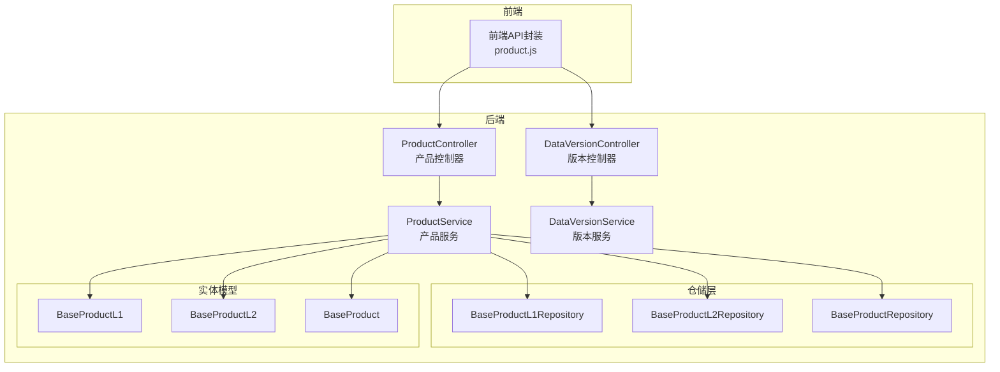
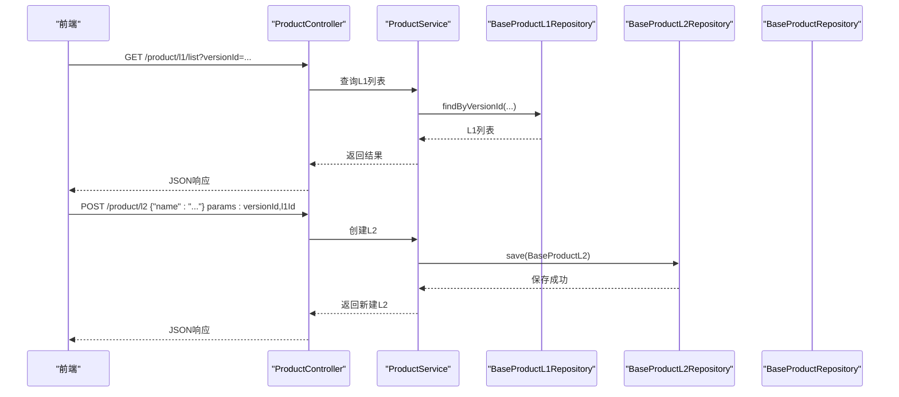
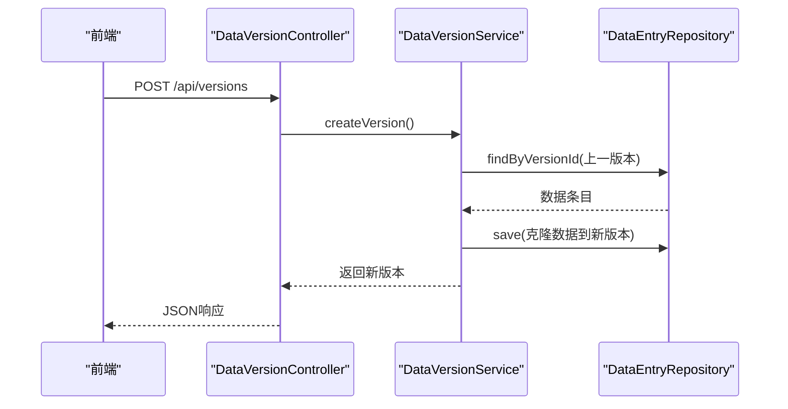
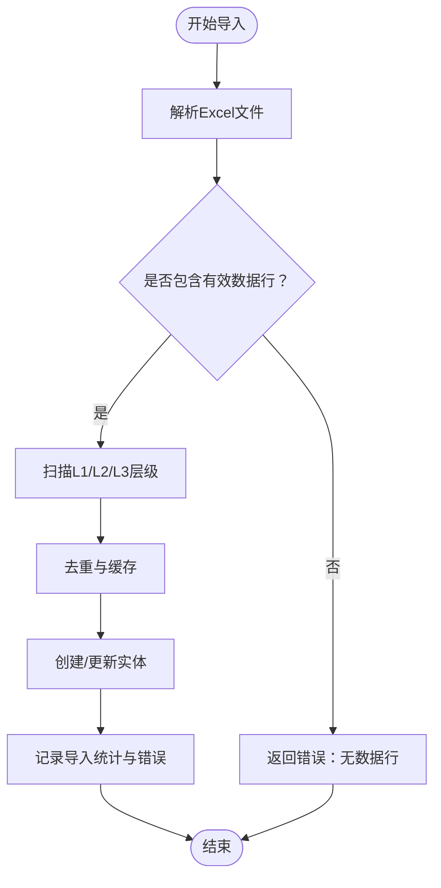
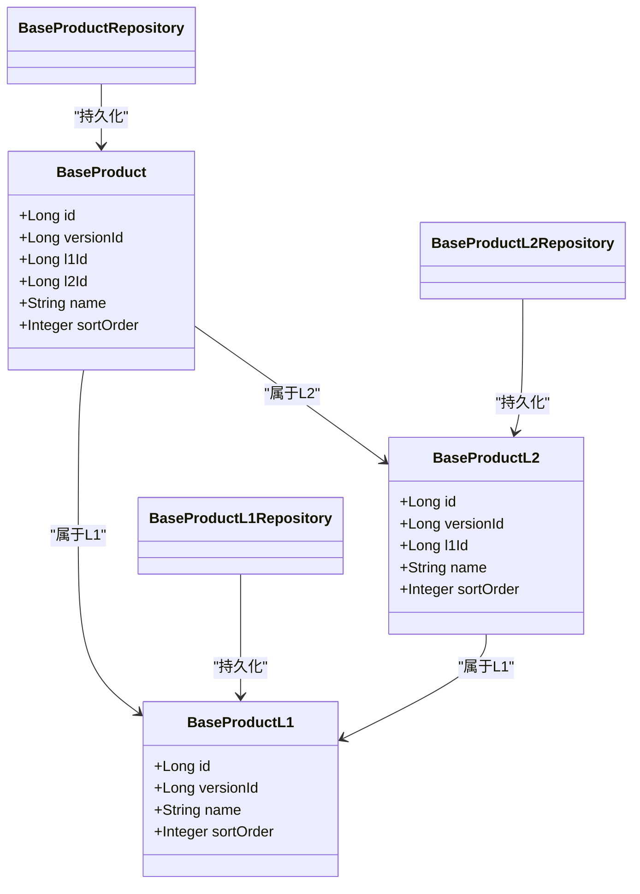
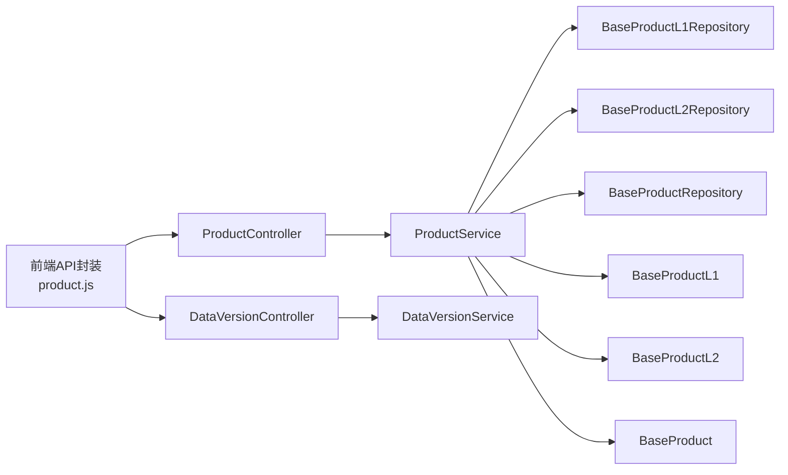

# 产品信息API

<cite>
**本文引用的文件**
- [ProductController.java](file://src/main/java/com/superpower/modules/category/controller/ProductController.java)
- [ProductService.java](file://src/main/java/com/superpower/modules/category/service/ProductService.java)
- [BaseProduct.java](file://src/main/java/com/superpower/modules/category/entity/BaseProduct.java)
- [BaseProductL1.java](file://src/main/java/com/superpower/modules/category/entity/BaseProductL1.java)
- [BaseProductL2.java](file://src/main/java/com/superpower/modules/category/entity/BaseProductL2.java)
- [BaseProductL1Repository.java](file://src/main/java/com/superpower/modules/category/repository/BaseProductL1Repository.java)
- [BaseProductL2Repository.java](file://src/main/java/com/superpower/modules/category/repository/BaseProductL2Repository.java)
- [BaseProductRepository.java](file://src/main/java/com/superpower/modules/category/repository/BaseProductRepository.java)
- [product.js](file://frontend/src/api/product.js)
- [DataVersionService.java](file://src/main/java/com/superpower/modules/version/service/DataVersionService.java)
- [DataVersionController.java](file://src/main/java/com/superpower/modules/version/controller/DataVersionController.java)
- [ExcelImportResult.java](file://src/main/java/com/superpower/modules/data/dto/ExcelImportResult.java)
- [DataEntryService.java](file://src/main/java/com/superpower/modules/data/service/DataEntryService.java)
- [import_excel.py](file://import_excel.py)
- [import_shuzhidi.py](file://import_shuzhidi.py)
- [VERSION.md](file://VERSION.md)
</cite>

## 目录
1. [简介](#简介)
2. [项目结构](#项目结构)
3. [核心组件](#核心组件)
4. [架构总览](#架构总览)
5. [详细组件分析](#详细组件分析)
6. [依赖关系分析](#依赖关系分析)
7. [性能考虑](#性能考虑)
8. [故障排查指南](#故障排查指南)
9. [结论](#结论)
10. [附录](#附录)

## 简介
本文件为产品信息管理模块的API接口文档，覆盖L1/L2产品层级的完整CRUD操作，以及L3产品实体的查询能力。文档同时说明版本控制下的产品数据管理策略，并提供Excel导入导出接口说明（含文件格式要求、导入结果反馈与错误处理机制）。内容面向前后端开发者与测试人员，兼顾可读性与技术深度。

## 项目结构
产品相关API主要由后端控制器、服务层、仓储层与前端API封装组成；版本控制由独立的版本模块提供支持。

图表来源
- [ProductController.java:40-72](file://src/main/java/com/superpower/modules/category/controller/ProductController.java#L40-L72)
- [ProductService.java:203-323](file://src/main/java/com/superpower/modules/category/service/ProductService.java#L203-L323)
- [BaseProductL1Repository.java](file://src/main/java/com/superpower/modules/category/repository/BaseProductL1Repository.java)
- [BaseProductL2Repository.java](file://src/main/java/com/superpower/modules/category/repository/BaseProductL2Repository.java)
- [BaseProductRepository.java](file://src/main/java/com/superpower/modules/category/repository/BaseProductRepository.java)
- [BaseProductL1.java](file://src/main/java/com/superpower/modules/category/entity/BaseProductL1.java)
- [BaseProductL2.java](file://src/main/java/com/superpower/modules/category/entity/BaseProductL2.java)
- [BaseProduct.java](file://src/main/java/com/superpower/modules/category/entity/BaseProduct.java)
- [DataVersionController.java:1478-1520](file://src/main/java/com/superpower/modules/version/controller/DataVersionController.java#L1478-L1520)
- [DataVersionService.java:1394-1474](file://src/main/java/com/superpower/modules/version/service/DataVersionService.java#L1394-L1474)

章节来源
- [ProductController.java:40-72](file://src/main/java/com/superpower/modules/category/controller/ProductController.java#L40-L72)
- [product.js:1-48](file://frontend/src/api/product.js#L1-L48)

## 核心组件
- 产品控制器：提供L1/L2产品层级的查询、创建、更新、删除与排序接口。
- 产品服务：实现业务逻辑，包括Excel导入、版本复制、L1/L2/L3数据一致性校验与排序维护。
- 仓储层：负责持久化访问，提供按版本与层级的查询、保存与删除。
- 实体模型：定义L1/L2/L3产品实体结构及字段约束。
- 版本模块：提供版本创建、发布、复制与删除能力，支撑产品数据在版本间的隔离与演进。

章节来源
- [ProductController.java:40-72](file://src/main/java/com/superpower/modules/category/controller/ProductController.java#L40-L72)
- [ProductService.java:203-323](file://src/main/java/com/superpower/modules/category/service/ProductService.java#L203-L323)
- [BaseProductL1.java](file://src/main/java/com/superpower/modules/category/entity/BaseProductL1.java)
- [BaseProductL2.java](file://src/main/java/com/superpower/modules/category/entity/BaseProductL2.java)
- [BaseProduct.java](file://src/main/java/com/superpower/modules/category/entity/BaseProduct.java)
- [DataVersionService.java:1394-1474](file://src/main/java/com/superpower/modules/version/service/DataVersionService.java#L1394-L1474)

## 架构总览
产品信息API采用经典的三层架构：前端通过HTTP请求调用后端REST接口；控制器接收请求并校验参数；服务层编排业务规则；仓储层完成数据持久化；版本模块贯穿数据生命周期管理。

图表来源
- [ProductController.java:40-72](file://src/main/java/com/superpower/modules/category/controller/ProductController.java#L40-L72)
- [ProductService.java:203-323](file://src/main/java/com/superpower/modules/category/service/ProductService.java#L203-L323)
- [BaseProductL1Repository.java](file://src/main/java/com/superpower/modules/category/repository/BaseProductL1Repository.java)
- [BaseProductL2Repository.java](file://src/main/java/com/superpower/modules/category/repository/BaseProductL2Repository.java)

## 详细组件分析

### L1 产品层级（统计分类）
- 功能概述：支持查询L1列表、创建L1、更新L1名称、删除L1、批量更新L1排序。
- 关键接口
  - 查询L1列表：GET /product/l1/list?versionId={id}
  - 创建L1：POST /product/l1?versionId={id}&name={name}
  - 更新L1：PUT /product/l1/{id}?name={name}
  - 删除L1：DELETE /product/l1/{id}
  - 批量更新L1排序：PUT /product/l1/sort?versionId={id} (请求体为排序数组)
- 前端封装：见 [product.js:4-22](file://frontend/src/api/product.js#L4-L22)

章节来源
- [ProductController.java:40-50](file://src/main/java/com/superpower/modules/category/controller/ProductController.java#L40-L50)
- [product.js:4-22](file://frontend/src/api/product.js#L4-L22)

### L2 产品层级（核心业务方向）
- 功能概述：支持查询L2列表、创建L2、更新L2名称、删除L2、批量更新L2排序。
- 关键接口
  - 查询L2列表：GET /product/l2/list?versionId={id}&l1Id={id}
  - 创建L2：POST /product/l2?versionId={id}&l1Id={id}&name={name}
  - 更新L2：PUT /product/l2/{id}?name={name}
  - 删除L2：DELETE /product/l2/{id}
  - 批量更新L2排序：PUT /product/l2/sort?versionId={id} (请求体为排序数组)
- 前端封装：见 [product.js:24-43](file://frontend/src/api/product.js#L24-L43)

章节来源
- [ProductController.java:52-72](file://src/main/java/com/superpower/modules/category/controller/ProductController.java#L52-L72)
- [product.js:24-43](file://frontend/src/api/product.js#L24-L43)

### L3 产品实体（核心业务产品）
- 功能概述：提供L3产品查询能力，用于展示具体产品项。
- 关键接口
  - 查询L3列表：GET /product/l3/list?versionId={id}&l2Id={id}
- 前端封装：见 [product.js:45-48](file://frontend/src/api/product.js#L45-L48)

章节来源
- [product.js:45-48](file://frontend/src/api/product.js#L45-L48)

### 版本控制下的产品数据管理
- 版本创建：服务根据最新已发布版本复制数据，生成新的草稿版本。
- 版本发布：将草稿版本标记为已发布，冻结后续变更。
- 版本删除：仅允许删除草稿状态版本，删除前进行风险提示与分步清理。
- 产品数据复制：L1/L2/L3产品数据按版本复制，保持层级关系与排序。

图表来源
- [DataVersionController.java:1478-1520](file://src/main/java/com/superpower/modules/version/controller/DataVersionController.java#L1478-L1520)
- [DataVersionService.java:1433-1460](file://src/main/java/com/superpower/modules/version/service/DataVersionService.java#L1433-L1460)

章节来源
- [DataVersionService.java:1394-1474](file://src/main/java/com/superpower/modules/version/service/DataVersionService.java#L1394-L1474)
- [VERSION.md:106-120](file://VERSION.md#L106-L120)

### Excel 导入与导出
- 导入接口
  - 后端：/data/import-excel（multipart/form-data，包含file与versionId）
  - 前端：见 [data.js:75-83](file://frontend/src/api/data.js#L75-L83)
  - 导入逻辑：解析Excel，扫描L1/L2/L3层级，去重并按顺序创建或更新实体，记录总数、成功数、失败数与错误列表。
  - 结果对象：参见 [ExcelImportResult.java:1-14](file://src/main/java/com/superpower/modules/data/dto/ExcelImportResult.java#L1-L14)
- 导出接口
  - 后端：/data/export-excel（返回Excel文件流）
  - 前端：见 [data.js:75-83](file://frontend/src/api/data.js#L75-L83)
  - 文件格式：包含产品系统、应用角色、功能说明、状态、业务分类、业务域、版本划分、交付工作量、控标点、软著、备注、智能化、年度销量、研发成本等字段。
  - 字段映射参考：参见 [import_excel.py:10-57](file://import_excel.py#L10-L57) 与 [import_shuzhidi.py:31-52](file://import_shuzhidi.py#L31-L52)
- 错误处理
  - 导入空文件或无有效数据行时返回错误。
  - 导入过程中遇到异常会记录到错误列表，不影响其他行的处理。
  - 建议前端显示“导入结果”面板，汇总总数、成功、失败与错误明细。

图表来源
- [ProductService.java:234-264](file://src/main/java/com/superpower/modules/category/service/ProductService.java#L234-L264)
- [ExcelImportResult.java:1-14](file://src/main/java/com/superpower/modules/data/dto/ExcelImportResult.java#L1-L14)
- [import_excel.py:10-57](file://import_excel.py#L10-L57)
- [import_shuzhidi.py:31-52](file://import_shuzhidi.py#L31-L52)

章节来源
- [ProductService.java:234-264](file://src/main/java/com/superpower/modules/category/service/ProductService.java#L234-L264)
- [ExcelImportResult.java:1-14](file://src/main/java/com/superpower/modules/data/dto/ExcelImportResult.java#L1-L14)
- [import_excel.py:1-57](file://import_excel.py#L1-L57)
- [import_shuzhidi.py:28-59](file://import_shuzhidi.py#L28-L59)

### 数据模型与仓储

图表来源
- [BaseProductL1.java](file://src/main/java/com/superpower/modules/category/entity/BaseProductL1.java)
- [BaseProductL2.java](file://src/main/java/com/superpower/modules/category/entity/BaseProductL2.java)
- [BaseProduct.java](file://src/main/java/com/superpower/modules/category/entity/BaseProduct.java)
- [BaseProductL1Repository.java](file://src/main/java/com/superpower/modules/category/repository/BaseProductL1Repository.java)
- [BaseProductL2Repository.java](file://src/main/java/com/superpower/modules/category/repository/BaseProductL2Repository.java)
- [BaseProductRepository.java](file://src/main/java/com/superpower/modules/category/repository/BaseProductRepository.java)

章节来源
- [BaseProductL1.java](file://src/main/java/com/superpower/modules/category/entity/BaseProductL1.java)
- [BaseProductL2.java](file://src/main/java/com/superpower/modules/category/entity/BaseProductL2.java)
- [BaseProduct.java](file://src/main/java/com/superpower/modules/category/entity/BaseProduct.java)

## 依赖关系分析
- 控制器依赖服务层，服务层依赖仓储层与实体模型。
- 版本模块与产品模块通过版本ID解耦，产品数据按版本隔离。
- 前端API封装统一调用后端REST接口，便于跨端复用。

图表来源
- [product.js:1-48](file://frontend/src/api/product.js#L1-L48)
- [ProductController.java:40-72](file://src/main/java/com/superpower/modules/category/controller/ProductController.java#L40-L72)
- [ProductService.java:203-323](file://src/main/java/com/superpower/modules/category/service/ProductService.java#L203-L323)
- [DataVersionController.java:1478-1520](file://src/main/java/com/superpower/modules/version/controller/DataVersionController.java#L1478-L1520)
- [DataVersionService.java:1394-1474](file://src/main/java/com/superpower/modules/version/service/DataVersionService.java#L1394-L1474)

章节来源
- [product.js:1-48](file://frontend/src/api/product.js#L1-L48)
- [ProductController.java:40-72](file://src/main/java/com/superpower/modules/category/controller/ProductController.java#L40-L72)
- [DataVersionController.java:1478-1520](file://src/main/java/com/superpower/modules/version/controller/DataVersionController.java#L1478-L1520)

## 性能考虑
- 批量排序：前端一次性提交排序数组，后端按批次更新，减少往返次数。
- 导入优化：Excel解析采用流式处理，避免大文件内存溢出；导入过程分步记录统计与错误，便于前端快速反馈。
- 版本复制：仅对已发布的版本进行数据复制，降低重复计算；复制时建立ID映射表，保证层级关系与排序一致。
- 建议
  - 对于超大Excel文件，建议拆分批次导入并设置合理的超时时间。
  - 前端在导入期间禁用交互按钮，防止重复提交。

## 故障排查指南
- 导入失败
  - 检查Excel文件是否包含有效数据行；若为空则返回“无数据行”错误。
  - 查看错误列表，定位具体行与原因；修复后重新导入。
- 排序异常
  - 确认排序数组中的ID与版本匹配；检查是否存在重复ID或缺失ID。
- 版本状态不符
  - 仅草稿版本可删除；已发布版本需先回滚或创建新版本再删除。
- 前端调用异常
  - 确认请求头Content-Type为multipart/form-data；检查versionId参数是否正确传递。

章节来源
- [ExcelImportResult.java:1-14](file://src/main/java/com/superpower/modules/data/dto/ExcelImportResult.java#L1-L14)
- [DataVersionService.java:1462-1472](file://src/main/java/com/superpower/modules/version/service/DataVersionService.java#L1462-L1472)
- [DataEntryService.java:658-702](file://src/main/java/com/superpower/modules/data/service/DataEntryService.java#L658-L702)

## 结论
产品信息API围绕L1/L2/L3三层结构提供了完整的CRUD与排序能力，并通过版本模块实现了数据的生命周期管理。Excel导入导出接口满足批量数据处理需求，配合完善的错误反馈机制提升用户体验。建议在生产环境中结合前端交互与后端事务控制，确保数据一致性与性能表现。

## 附录
- 常用字段说明
  - versionId：版本标识，决定数据归属与可见范围。
  - l1Id/l2Id：层级父子关系标识，L2属于L1，L3属于L2。
  - name：产品名称，支持更新。
  - sortOrder：排序值，用于维护层级内顺序。
- 参考实现路径
  - L1/L2接口：[ProductController.java:40-72](file://src/main/java/com/superpower/modules/category/controller/ProductController.java#L40-L72)
  - L3查询：[product.js:45-48](file://frontend/src/api/product.js#L45-L48)
  - 版本管理：[DataVersionController.java:1478-1520](file://src/main/java/com/superpower/modules/version/controller/DataVersionController.java#L1478-L1520)
  - Excel导入：[ProductService.java:234-264](file://src/main/java/com/superpower/modules/category/service/ProductService.java#L234-L264)