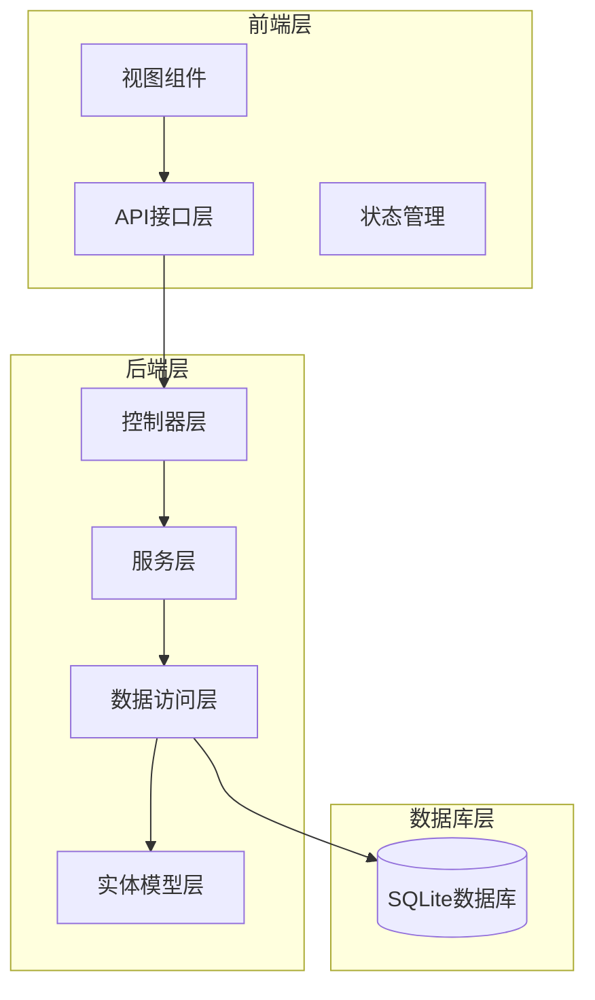
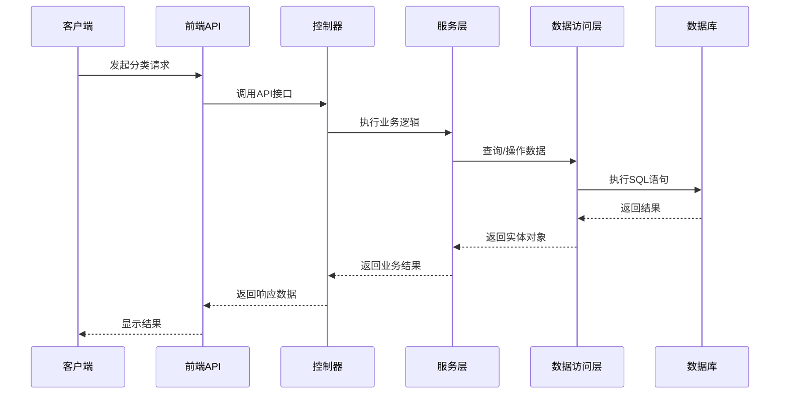
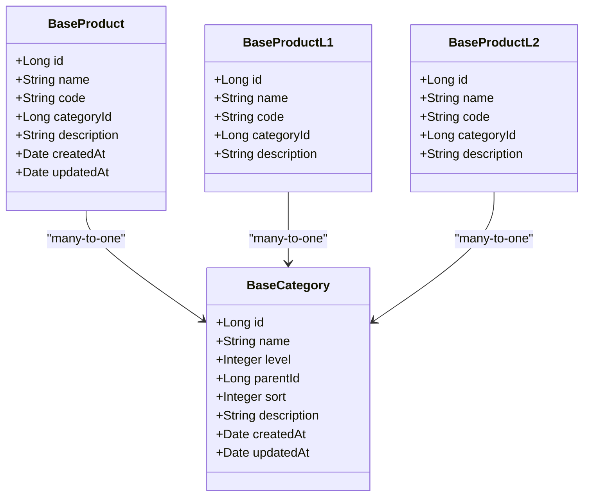
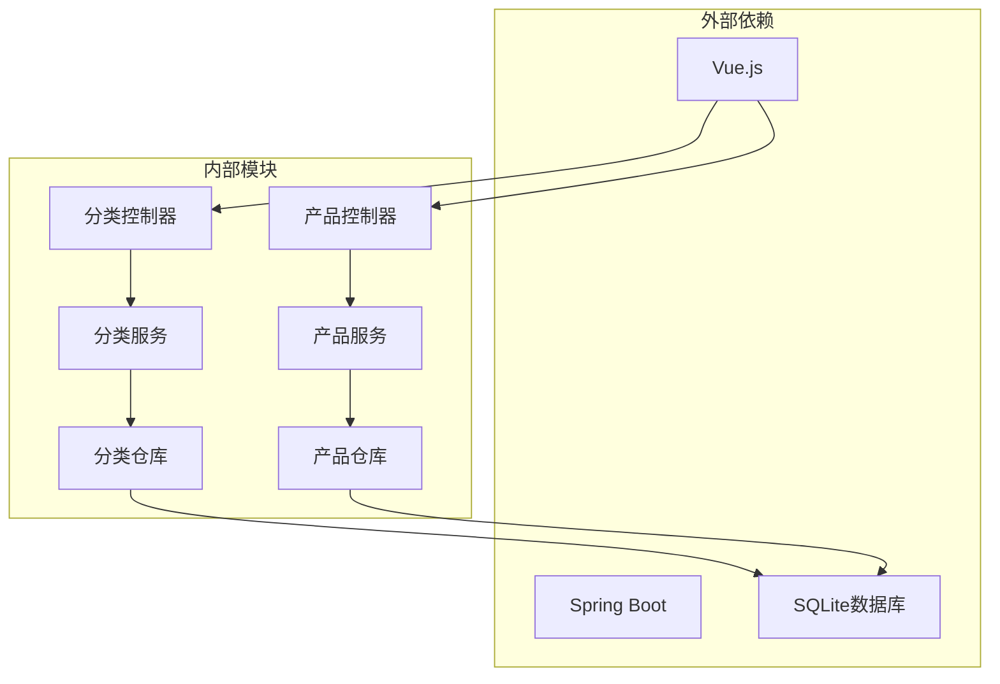
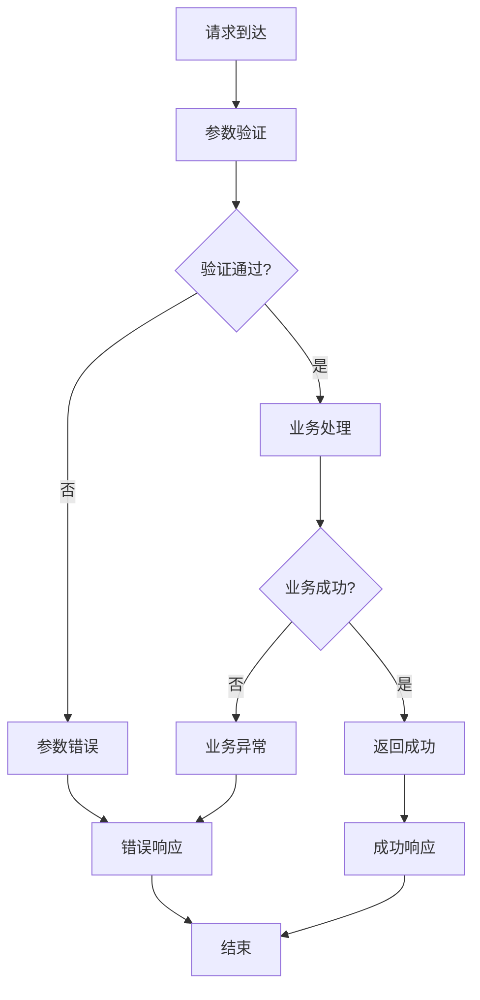

# 产品分类API

<cite>
**本文档引用的文件**
- [CategoryController.java](file://src/main/java/com/superpower/modules/category/controller/CategoryController.java)
- [ProductController.java](file://src/main/java/com/superpower/modules/category/controller/ProductController.java)
- [category.js](file://frontend/src/api/category.js)
- [ProductCategoryManage.vue](file://frontend/src/views/system/ProductCategoryManage.vue)
- [BaseCategory.java](file://src/main/java/com/superpower/modules/category/entity/BaseCategory.java)
- [BaseProduct.java](file://src/main/java/com/superpower/modules/category/entity/BaseProduct.java)
- [BaseProductL1.java](file://src/main/java/com/superpower/modules/category/entity/BaseProductL1.java)
- [BaseProductL2.java](file://src/main/java/com/superpower/modules/category/entity/BaseProductL2.java)
- [CategoryService.java](file://src/main/java/com/superpower/modules/category/service/CategoryService.java)
- [ProductService.java](file://src/main/java/com/superpower/modules/category/service/ProductService.java)
- [BaseCategoryRepository.java](file://src/main/java/com/superpower/modules/category/repository/BaseCategoryRepository.java)
- [BaseProductRepository.java](file://src/main/java/com/superpower/modules/category/repository/BaseProductRepository.java)
- [BaseProductL1Repository.java](file://src/main/java/com/superpower/modules/category/repository/BaseProductL1Repository.java)
- [BaseProductL2Repository.java](file://src/main/java/com/superpower/modules/category/repository/BaseProductL2Repository.java)
- [Result.java](file://src/main/java/com/superpower/common/Result.java)
- [ResultCode.java](file://src/main/java/com/superpower/common/ResultCode.java)
- [BusinessException.java](file://src/main/java/com/superpower/common/BusinessException.java)
</cite>

## 目录
1. [简介](#简介)
2. [项目结构](#项目结构)
3. [核心组件](#核心组件)
4. [架构概览](#架构概览)
5. [详细组件分析](#详细组件分析)
6. [依赖分析](#依赖分析)
7. [性能考虑](#性能考虑)
8. [故障排除指南](#故障排除指南)
9. [结论](#结论)

## 简介
本文件为产品分类管理模块的详细API接口文档，涵盖L1/L2/L3层级分类的完整CRUD操作，包括分类列表查询、分类创建、更新、删除等接口。详细说明分类树形结构查询、父子关系维护、分类排序调整等功能。提供完整的请求参数说明、响应数据结构示例和错误处理机制。包含分类与产品关联关系的管理接口。

## 项目结构
产品分类管理模块采用前后端分离架构，后端基于Spring Boot框架，前端采用Vue.js技术栈。

**图表来源**
- [CategoryController.java:1-200](file://src/main/java/com/superpower/modules/category/controller/CategoryController.java#L1-L200)
- [ProductController.java:1-200](file://src/main/java/com/superpower/modules/category/controller/ProductController.java#L1-L200)

**章节来源**
- [CategoryController.java:1-200](file://src/main/java/com/superpower/modules/category/controller/CategoryController.java#L1-L200)
- [ProductController.java:1-200](file://src/main/java/com/superpower/modules/category/controller/ProductController.java#L1-L200)

## 核心组件
产品分类管理模块的核心组件包括：

### 后端核心组件
- **CategoryController**: 分类管理控制器，处理所有分类相关API请求
- **ProductController**: 产品管理控制器，处理产品与分类关联操作
- **CategoryService**: 分类业务逻辑服务
- **ProductService**: 产品业务逻辑服务
- **BaseCategoryRepository**: 分类数据访问接口
- **BaseProductRepository**: 产品数据访问接口

### 前端核心组件
- **category.js**: 前端API调用封装
- **ProductCategoryManage.vue**: 分类管理界面组件

**章节来源**
- [CategoryController.java:1-200](file://src/main/java/com/superpower/modules/category/controller/CategoryController.java#L1-L200)
- [ProductController.java:1-200](file://src/main/java/com/superpower/modules/category/controller/ProductController.java#L1-L200)
- [category.js:1-200](file://frontend/src/api/category.js#L1-L200)
- [ProductCategoryManage.vue:1-300](file://frontend/src/views/system/ProductCategoryManage.vue#L1-L300)

## 架构概览

**图表来源**
- [CategoryController.java:1-200](file://src/main/java/com/superpower/modules/category/controller/CategoryController.java#L1-L200)
- [ProductController.java:1-200](file://src/main/java/com/superpower/modules/category/controller/ProductController.java#L1-L200)
- [CategoryService.java:1-200](file://src/main/java/com/superpower/modules/category/service/CategoryService.java#L1-L200)
- [ProductService.java:1-200](file://src/main/java/com/superpower/modules/category/service/ProductService.java#L1-L200)

## 详细组件分析

### 分类控制器 (CategoryController)

分类控制器提供完整的分类管理API接口：

#### GET /api/categories/tree
**功能**: 获取分类树形结构
**请求参数**: 无
**响应数据**: 分类树形结构JSON

#### GET /api/categories/list
**功能**: 获取分类列表
**请求参数**: 
- level: 分类层级 (1-3)
- parentId: 父级ID
- keyword: 搜索关键词
**响应数据**: 分类列表数组

#### POST /api/categories
**功能**: 创建分类
**请求体参数**:
- name: 分类名称 (必填)
- level: 分类层级 (1-3) (必填)
- parentId: 父级ID
- sort: 排序值
- description: 分类描述
**响应数据**: 新创建的分类对象

#### PUT /api/categories/{id}
**功能**: 更新分类
**路径参数**:
- id: 分类ID (必填)
**请求体参数**:
- name: 分类名称
- sort: 排序值
- description: 分类描述
**响应数据**: 更新后的分类对象

#### DELETE /api/categories/{id}
**功能**: 删除分类
**路径参数**:
- id: 分类ID (必填)
**响应数据**: 删除结果状态

#### GET /api/categories/{id}/children
**功能**: 获取子分类列表
**路径参数**:
- id: 父级分类ID (必填)
**响应数据**: 子分类列表

#### POST /api/categories/batch-sort
**功能**: 批量调整排序
**请求体参数**:
- sortList: 排序调整数组
**响应数据**: 排序调整结果

**章节来源**
- [CategoryController.java:1-200](file://src/main/java/com/superpower/modules/category/controller/CategoryController.java#L1-L200)

### 产品控制器 (ProductController)

产品控制器处理产品与分类的关联管理：

#### GET /api/products/categories/{categoryId}
**功能**: 获取指定分类下的产品列表
**路径参数**:
- categoryId: 分类ID (必填)
**响应数据**: 产品列表

#### POST /api/products/categories/{productId}
**功能**: 将产品分配到分类
**路径参数**:
- productId: 产品ID (必填)
**请求体参数**:
- categoryId: 分类ID (必填)
**响应数据**: 关联结果

#### DELETE /api/products/categories/{productId}
**功能**: 移除产品分类关联
**路径参数**:
- productId: 产品ID (必填)
**响应数据**: 取消关联结果

#### GET /api/products/search
**功能**: 搜索产品（支持分类过滤）
**请求参数**:
- categoryId: 分类ID
- keyword: 搜索关键词
- page: 页码
- size: 每页数量
**响应数据**: 产品分页列表

**章节来源**
- [ProductController.java:1-200](file://src/main/java/com/superpower/modules/category/controller/ProductController.java#L1-L200)

### 实体模型分析

#### BaseCategory 实体

**图表来源**
- [BaseCategory.java:1-200](file://src/main/java/com/superpower/modules/category/entity/BaseCategory.java#L1-L200)
- [BaseProduct.java:1-200](file://src/main/java/com/superpower/modules/category/entity/BaseProduct.java#L1-L200)
- [BaseProductL1.java:1-200](file://src/main/java/com/superpower/modules/category/entity/BaseProductL1.java#L1-L200)
- [BaseProductL2.java:1-200](file://src/main/java/com/superpower/modules/category/entity/BaseProductL2.java#L1-L200)

**章节来源**
- [BaseCategory.java:1-200](file://src/main/java/com/superpower/modules/category/entity/BaseCategory.java#L1-L200)
- [BaseProduct.java:1-200](file://src/main/java/com/superpower/modules/category/entity/BaseProduct.java#L1-L200)
- [BaseProductL1.java:1-200](file://src/main/java/com/superpower/modules/category/entity/BaseProductL1.java#L1-L200)
- [BaseProductL2.java:1-200](file://src/main/java/com/superpower/modules/category/entity/BaseProductL2.java#L1-L200)

### 服务层实现

#### CategoryService 业务逻辑
- 分类层级验证 (1-3级)
- 父子关系完整性检查
- 排序冲突处理
- 分类树构建算法
- 批量操作事务管理

#### ProductService 业务逻辑
- 产品分类关联管理
- 分类下产品数量统计
- 产品搜索与过滤
- 分类关联批量处理

**章节来源**
- [CategoryService.java:1-200](file://src/main/java/com/superpower/modules/category/service/CategoryService.java#L1-L200)
- [ProductService.java:1-200](file://src/main/java/com/superpower/modules/category/service/ProductService.java#L1-L200)

### 数据访问层

#### BaseCategoryRepository
- 分类树查询
- 父子关系查询
- 分类层级查询
- 排序更新

#### BaseProductRepository
- 产品分类关联查询
- 产品搜索
- 分类产品统计

**章节来源**
- [BaseCategoryRepository.java:1-200](file://src/main/java/com/superpower/modules/category/repository/BaseCategoryRepository.java#L1-L200)
- [BaseProductRepository.java:1-200](file://src/main/java/com/superpower/modules/category/repository/BaseProductRepository.java#L1-L200)

## 依赖分析

**图表来源**
- [CategoryController.java:1-200](file://src/main/java/com/superpower/modules/category/controller/CategoryController.java#L1-L200)
- [ProductController.java:1-200](file://src/main/java/com/superpower/modules/category/controller/ProductController.java#L1-L200)

### 错误处理机制

系统采用统一的错误处理机制：

**图表来源**
- [BusinessException.java:1-100](file://src/main/java/com/superpower/common/BusinessException.java#L1-L100)
- [ResultCode.java:1-100](file://src/main/java/com/superpower/common/ResultCode.java#L1-L100)

**章节来源**
- [BusinessException.java:1-100](file://src/main/java/com/superpower/common/BusinessException.java#L1-L100)
- [ResultCode.java:1-100](file://src/main/java/com/superpower/common/ResultCode.java#L1-L100)

## 性能考虑
- 使用分页查询避免大数据量加载
- 分类树查询采用缓存策略
- 批量操作使用事务保证数据一致性
- 数据库索引优化（分类层级、父ID、排序字段）

## 故障排除指南

### 常见问题及解决方案

**分类层级错误**
- 症状: 创建分类时报层级错误
- 解决方案: 确保level参数在1-3范围内

**父子关系冲突**
- 症状: 更新分类时提示父级循环引用
- 解决方案: 检查父级ID是否形成循环引用

**排序冲突**
- 症状: 排序调整失败
- 解决方案: 确保排序值唯一且在有效范围内

**章节来源**
- [BusinessException.java:1-100](file://src/main/java/com/superpower/common/BusinessException.java#L1-L100)
- [ResultCode.java:1-100](file://src/main/java/com/superpower/common/ResultCode.java#L1-L100)

## 结论
产品分类管理模块提供了完整的L1/L2/L3层级分类管理能力，包括树形结构查询、父子关系维护、排序调整等核心功能。系统采用分层架构设计，前后端分离，具有良好的可扩展性和维护性。通过统一的错误处理机制和性能优化策略，确保了系统的稳定性和可靠性。