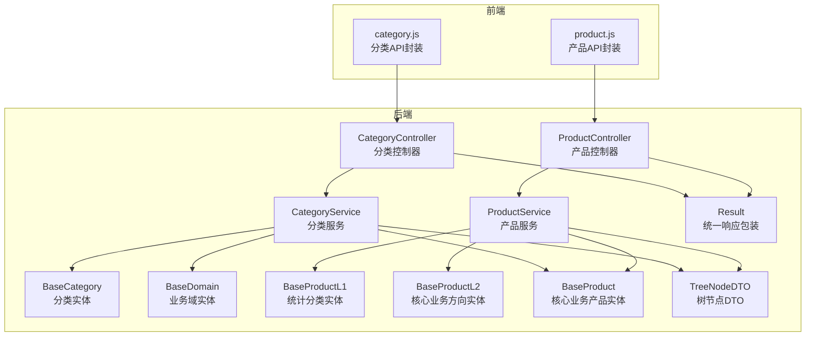
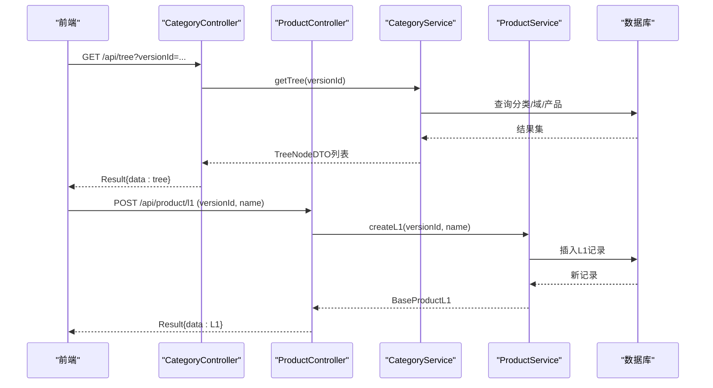
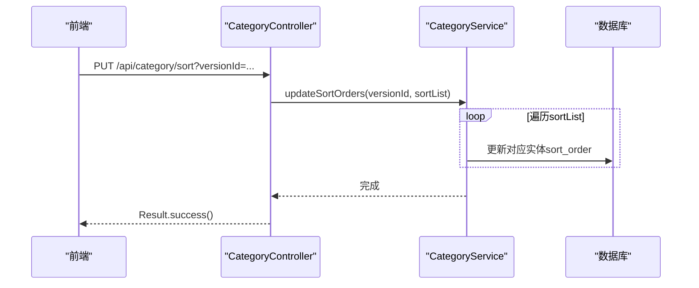
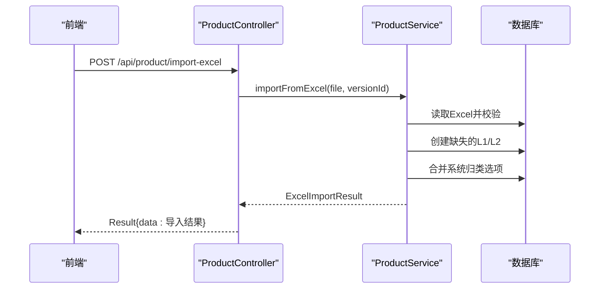
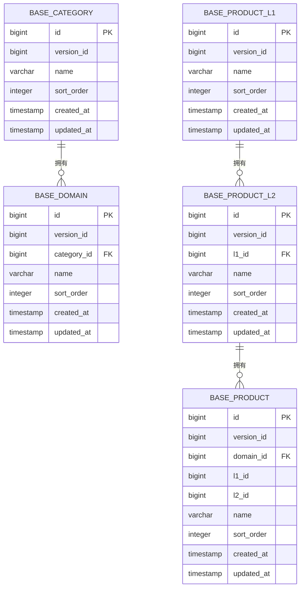
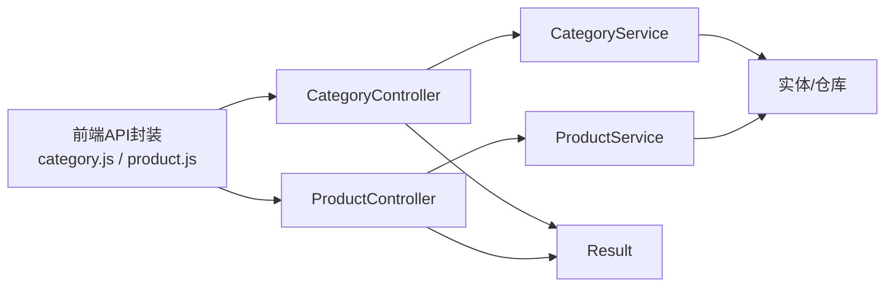

# 产品管理API

<cite>
**本文档引用的文件**
- [CategoryController.java](file://src/main/java/com/superpower/modules/category/controller/CategoryController.java)
- [ProductController.java](file://src/main/java/com/superpower/modules/category/controller/ProductController.java)
- [CategoryService.java](file://src/main/java/com/superpower/modules/category/service/CategoryService.java)
- [ProductService.java](file://src/main/java/com/superpower/modules/category/service/ProductService.java)
- [BaseCategory.java](file://src/main/java/com/superpower/modules/category/entity/BaseCategory.java)
- [BaseDomain.java](file://src/main/java/com/superpower/modules/category/entity/BaseDomain.java)
- [BaseProductL1.java](file://src/main/java/com/superpower/modules/category/entity/BaseProductL1.java)
- [BaseProductL2.java](file://src/main/java/com/superpower/modules/category/entity/BaseProductL2.java)
- [BaseProduct.java](file://src/main/java/com/superpower/modules/category/entity/BaseProduct.java)
- [TreeNodeDTO.java](file://src/main/java/com/superpower/modules/data/dto/TreeNodeDTO.java)
- [Result.java](file://src/main/java/com/superpower/common/Result.java)
- [BusinessException.java](file://src/main/java/com/superpower/common/BusinessException.java)
- [category.js](file://frontend/src/api/category.js)
- [product.js](file://frontend/src/api/product.js)
- [application.yml](file://src/main/resources/application.yml)
- [init.sql](file://src/main/resources/db/init.sql)
</cite>

## 目录
1. [简介](#简介)
2. [项目结构](#项目结构)
3. [核心组件](#核心组件)
4. [架构总览](#架构总览)
5. [详细组件分析](#详细组件分析)
6. [依赖关系分析](#依赖关系分析)
7. [性能考虑](#性能考虑)
8. [故障排除指南](#故障排除指南)
9. [结论](#结论)
10. [附录](#附录)

## 简介
本文件为产品管理模块的API接口文档，覆盖产品分类管理（L1/L2/L3层级）、产品信息维护、树形结构查询、批量排序调整、Excel导入等能力。文档面向前后端开发者与测试人员，提供接口定义、请求参数、响应结构、错误处理及最佳实践。

## 项目结构
后端采用Spring Boot + JPA架构，按模块组织控制器、服务层、实体与仓库层；前端通过统一请求封装调用后端API。

**图表来源**
- [CategoryController.java:1-66](file://src/main/java/com/superpower/modules/category/controller/CategoryController.java#L1-L66)
- [ProductController.java:1-88](file://src/main/java/com/superpower/modules/category/controller/ProductController.java#L1-L88)
- [CategoryService.java:1-273](file://src/main/java/com/superpower/modules/category/service/CategoryService.java#L1-L273)
- [ProductService.java:1-356](file://src/main/java/com/superpower/modules/category/service/ProductService.java#L1-L356)
- [BaseCategory.java:1-30](file://src/main/java/com/superpower/modules/category/entity/BaseCategory.java#L1-L30)
- [BaseDomain.java:1-33](file://src/main/java/com/superpower/modules/category/entity/BaseDomain.java#L1-L33)
- [BaseProductL1.java:1-30](file://src/main/java/com/superpower/modules/category/entity/BaseProductL1.java#L1-L30)
- [BaseProductL2.java:1-33](file://src/main/java/com/superpower/modules/category/entity/BaseProductL2.java#L1-L33)
- [BaseProduct.java:1-39](file://src/main/java/com/superpower/modules/category/entity/BaseProduct.java#L1-L39)
- [TreeNodeDTO.java:1-16](file://src/main/java/com/superpower/modules/data/dto/TreeNodeDTO.java#L1-L16)
- [Result.java:1-41](file://src/main/java/com/superpower/common/Result.java#L1-L41)

**章节来源**
- [CategoryController.java:1-66](file://src/main/java/com/superpower/modules/category/controller/CategoryController.java#L1-L66)
- [ProductController.java:1-88](file://src/main/java/com/superpower/modules/category/controller/ProductController.java#L1-L88)
- [category.js:1-34](file://frontend/src/api/category.js#L1-L34)
- [product.js:1-65](file://frontend/src/api/product.js#L1-L65)

## 核心组件
- 控制器层：提供REST接口，负责接收请求参数、调用服务层并返回统一响应包装。
- 服务层：实现业务逻辑，包括树形结构构建、排序更新、跨版本复制、Excel导入等。
- 实体层：映射数据库表结构，支持L1/L2/L3层级与基础分类/域/产品。
- DTO层：树节点数据传输对象，用于序列化树形结果。
- 统一响应：Result包装器，规范成功/失败响应格式。

**章节来源**
- [CategoryService.java:1-273](file://src/main/java/com/superpower/modules/category/service/CategoryService.java#L1-L273)
- [ProductService.java:1-356](file://src/main/java/com/superpower/modules/category/service/ProductService.java#L1-L356)
- [TreeNodeDTO.java:1-16](file://src/main/java/com/superpower/modules/data/dto/TreeNodeDTO.java#L1-L16)
- [Result.java:1-41](file://src/main/java/com/superpower/common/Result.java#L1-L41)

## 架构总览
后端通过控制器暴露HTTP接口，服务层协调实体与仓库进行数据持久化，前端通过封装的API函数调用后端接口。

**图表来源**
- [CategoryController.java:23-26](file://src/main/java/com/superpower/modules/category/controller/CategoryController.java#L23-L26)
- [ProductController.java:30-33](file://src/main/java/com/superpower/modules/category/controller/ProductController.java#L30-L33)
- [CategoryService.java:36-78](file://src/main/java/com/superpower/modules/category/service/CategoryService.java#L36-L78)
- [ProductService.java:50-58](file://src/main/java/com/superpower/modules/category/service/ProductService.java#L50-L58)

## 详细组件分析

### 分类管理API（L1/L2/L3）
- 获取树形结构
  - 方法：GET
  - 路径：/api/tree
  - 参数：versionId（路径参数）
  - 响应：Result<List<TreeNodeDTO>>
  - 说明：返回L1分类及其子树（L2业务域、L3产品）的层级结构，按sort_order升序排列。
- 更新排序
  - 方法：PUT
  - 路径：/api/category/sort
  - 参数：versionId（路径参数），请求体为排序数组（包含type/id/sortOrder）
  - 响应：Result<Void>
  - 说明：支持对分类、业务域、产品分别排序，type可为category/domain/product。
- 创建分类
  - 方法：POST
  - 路径：/api/category
  - 参数：versionId（路径参数），name（请求体JSON字段）
  - 响应：Result<BaseCategory>
- 更新分类
  - 方法：PUT
  - 路径：/api/category/{id}
  - 参数：id（路径参数），name（请求体JSON字段）
  - 响应：Result<BaseCategory>
- 删除分类
  - 方法：DELETE
  - 路径：/api/category/{id}
  - 参数：id（路径参数）
  - 响应：Result<Void>
  - 说明：若分类下存在业务域则禁止删除。
- 创建业务域
  - 方法：POST
  - 路径：/api/domain
  - 参数：versionId（路径参数），categoryId（路径参数），name（请求体JSON字段）
  - 响应：Result<BaseDomain>
- 更新业务域
  - 方法：PUT
  - 路径：/api/domain/{id}
  - 参数：id（路径参数），name（请求体JSON字段）
  - 响应：Result<BaseDomain>
- 删除业务域
  - 方法：DELETE
  - 路径：/api/domain/{id}
  - 参数：id（路径参数）
  - 响应：Result<Void>
  - 说明：若业务域下存在子级条目则禁止删除。

**图表来源**
- [CategoryController.java:28-32](file://src/main/java/com/superpower/modules/category/controller/CategoryController.java#L28-L32)
- [CategoryService.java:80-103](file://src/main/java/com/superpower/modules/category/service/CategoryService.java#L80-L103)

**章节来源**
- [CategoryController.java:23-64](file://src/main/java/com/superpower/modules/category/controller/CategoryController.java#L23-L64)
- [CategoryService.java:36-164](file://src/main/java/com/superpower/modules/category/service/CategoryService.java#L36-L164)

### 产品信息管理API（L1/L2/L3）
- L1（统计分类）
  - 列表：GET /api/product/l1/list?versionId=...
  - 创建：POST /api/product/l1?versionId=...&name=...
  - 更新：PUT /api/product/l1/{id}?name=...
  - 删除：DELETE /api/product/l1/{id}
  - 排序：PUT /api/product/l1/sort?versionId=...&sortList=...
- L2（核心业务方向）
  - 列表：GET /api/product/l2/list?versionId=...&l1Id=...
  - 创建：POST /api/product/l2?versionId=...&l1Id=...&name=...
  - 更新：PUT /api/product/l2/{id}?name=...
  - 删除：DELETE /api/product/l2/{id}
  - 排序：PUT /api/product/l2/sort?versionId=...&sortList=...
- L3（核心业务产品）
  - 列表：GET /api/product/l3/list?versionId=...&l2Id=...
  - 创建：POST /api/product/l3?versionId=...&l2Id=...&name=...
  - 更新：PUT /api/product/l3/{id}?name=...
  - 删除：DELETE /api/product/l3/{id}
  - 排序：PUT /api/product/l3/sort?versionId=...&sortList=...
- Excel导入
  - 方法：POST /api/product/import-excel
  - 参数：file（Excel文件），versionId（表单字段）
  - 响应：Result<ExcelImportResult>
  - 说明：导入第一列为统计分类，第三列为L2核心业务产品，第四列为系统归类；自动去重并智能合并系统归类选项。

**图表来源**
- [ProductController.java:81-86](file://src/main/java/com/superpower/modules/category/controller/ProductController.java#L81-L86)
- [ProductService.java:235-348](file://src/main/java/com/superpower/modules/category/service/ProductService.java#L235-L348)

**章节来源**
- [ProductController.java:24-86](file://src/main/java/com/superpower/modules/category/controller/ProductController.java#L24-L86)
- [ProductService.java:40-232](file://src/main/java/com/superpower/modules/category/service/ProductService.java#L40-L232)

### 数据模型与关系

**图表来源**
- [BaseCategory.java:1-30](file://src/main/java/com/superpower/modules/category/entity/BaseCategory.java#L1-L30)
- [BaseDomain.java:1-33](file://src/main/java/com/superpower/modules/category/entity/BaseDomain.java#L1-L33)
- [BaseProductL1.java:1-30](file://src/main/java/com/superpower/modules/category/entity/BaseProductL1.java#L1-L30)
- [BaseProductL2.java:1-33](file://src/main/java/com/superpower/modules/category/entity/BaseProductL2.java#L1-L33)
- [BaseProduct.java:1-39](file://src/main/java/com/superpower/modules/category/entity/BaseProduct.java#L1-L39)

## 依赖关系分析
- 控制器依赖服务层，服务层依赖实体与仓库，统一响应包装Result贯穿各层。
- 前端通过category.js与product.js封装调用后端接口。
- 应用配置文件定义了数据库连接、JPA方言与日志级别。

**图表来源**
- [category.js:1-34](file://frontend/src/api/category.js#L1-L34)
- [product.js:1-65](file://frontend/src/api/product.js#L1-L65)
- [CategoryController.java:1-66](file://src/main/java/com/superpower/modules/category/controller/CategoryController.java#L1-L66)
- [ProductController.java:1-88](file://src/main/java/com/superpower/modules/category/controller/ProductController.java#L1-L88)
- [Result.java:1-41](file://src/main/java/com/superpower/common/Result.java#L1-L41)

**章节来源**
- [application.yml:1-40](file://src/main/resources/application.yml#L1-L40)

## 性能考虑
- 排序更新采用批量处理，建议前端传入最小必要变更集合以减少数据库往返。
- 树形查询按sort_order升序加载，避免额外排序开销。
- Excel导入分两阶段：先收集再写入，使用事务保证一致性。
- SQLite连接池较小，生产环境建议切换至PostgreSQL并优化连接参数。

[本节为通用指导，无需具体文件分析]

## 故障排除指南
- 常见错误码
  - 成功：200，消息："成功"
  - 失败：500，消息："失败"
  - 权限不足：403，消息："权限不足"
  - 未授权：401，消息："未授权"
- 业务异常
  - 删除受保护实体时抛出业务异常，例如分类下存在业务域、业务域下存在子级条目、L1/L2/L3存在子项时禁止删除。
- 建议排查步骤
  - 检查versionId是否正确且存在有效版本。
  - 确认排序数组中的type与id匹配实际实体类型。
  - 导入Excel时检查文件格式与列内容是否符合要求。
  - 查看后端日志定位异常堆栈。

**章节来源**
- [Result.java:17-39](file://src/main/java/com/superpower/common/Result.java#L17-L39)
- [BusinessException.java:1-24](file://src/main/java/com/superpower/common/BusinessException.java#L1-L24)
- [CategoryService.java:154-164](file://src/main/java/com/superpower/modules/category/service/CategoryService.java#L154-L164)
- [ProductService.java:67-75](file://src/main/java/com/superpower/modules/category/service/ProductService.java#L67-L75)

## 结论
本API体系提供了完整的L1/L2/L3产品分类与产品信息管理能力，支持树形查询、批量排序、Excel导入与跨版本复制。通过统一响应包装与清晰的错误处理，便于前后端协作与系统集成。

[本节为总结性内容，无需具体文件分析]

## 附录

### 统一响应结构
- 字段：code（状态码）、message（消息）、data（数据）
- 成功示例：code=200，message="成功"，data=具体数据
- 失败示例：code=500，message="失败"，data=null

**章节来源**
- [Result.java:1-41](file://src/main/java/com/superpower/common/Result.java#L1-L41)

### 树节点DTO结构
- 字段：id、parentId、level、label、sortOrder、isLeaf、children
- 用途：用于序列化分类树形结构

**章节来源**
- [TreeNodeDTO.java:1-16](file://src/main/java/com/superpower/modules/data/dto/TreeNodeDTO.java#L1-L16)

### 数据库初始化脚本要点
- 初始化表：sys_user、sys_role、sys_menu、data_version、data_entry等
- 建议在执行DDL前创建数据库并确保用户具备相应权限

**章节来源**
- [init.sql:1-126](file://src/main/resources/db/init.sql#L1-L126)