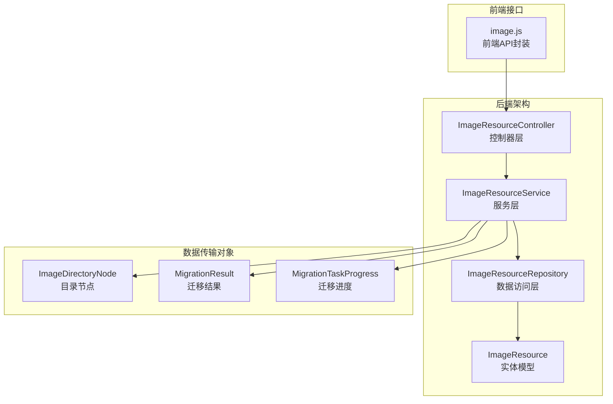
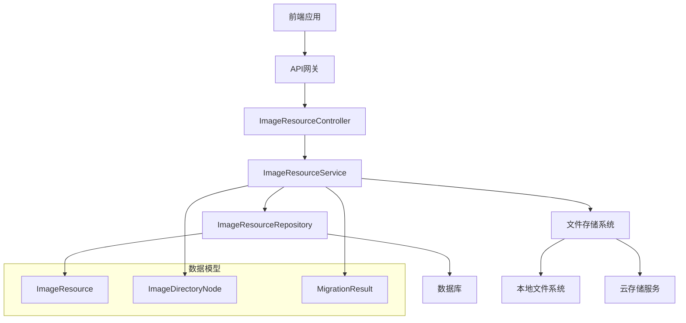
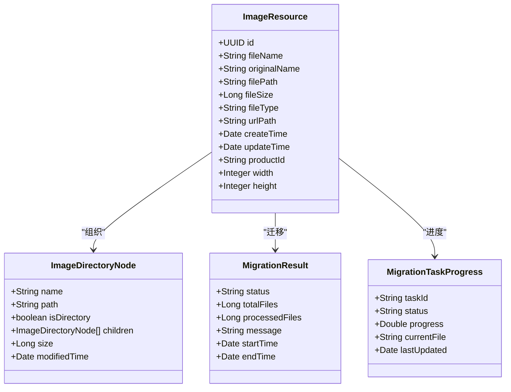
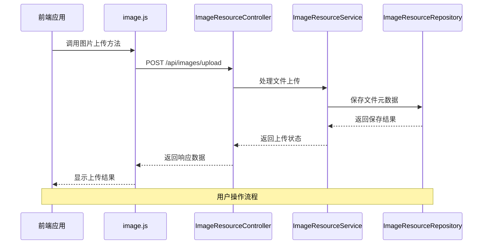
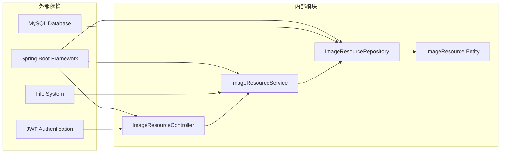

# 图片资源API

<cite>
**本文档引用的文件**
- [ImageResourceController.java](file://src/main/java/com/superpower/modules/image/controller/ImageResourceController.java)
- [ImageResourceService.java](file://src/main/java/com/superpower/modules/image/service/ImageResourceService.java)
- [ImageResourceRepository.java](file://src/main/java/com/superpower/modules/image/repository/ImageResourceRepository.java)
- [ImageResource.java](file://src/main/java/com/superpower/modules/image/entity/ImageResource.java)
- [ImageDirectoryNode.java](file://src/main/java/com/superpower/modules/image/dto/ImageDirectoryNode.java)
- [MigrationResult.java](file://src/main/java/com/superpower/modules/image/dto/MigrationResult.java)
- [MigrationTaskProgress.java](file://src/main/java/com/superpower/modules/image/dto/MigrationTaskProgress.java)
- [image.js](file://frontend/src/api/image.js)
</cite>

## 目录
1. [简介](#简介)
2. [项目结构](#项目结构)
3. [核心组件](#核心组件)
4. [架构概览](#架构概览)
5. [详细组件分析](#详细组件分析)
6. [依赖关系分析](#依赖关系分析)
7. [性能考虑](#性能考虑)
8. [故障排除指南](#故障排除指南)
9. [结论](#结论)

## 简介

本文件为图片资源管理功能的详细API接口文档。该系统提供了完整的图片资源管理能力，包括图片上传、下载、删除、目录管理等功能。系统采用分层架构设计，后端基于Spring Boot框架，前端使用Vue.js技术栈，实现了高效的图片资源存储、管理和访问机制。

## 项目结构

图片资源管理模块位于后端Java代码中，采用标准的MVC架构模式：

**图表来源**
- [ImageResourceController.java:1-200](file://src/main/java/com/superpower/modules/image/controller/ImageResourceController.java#L1-L200)
- [ImageResourceService.java:1-200](file://src/main/java/com/superpower/modules/image/service/ImageResourceService.java#L1-L200)
- [ImageResourceRepository.java:1-200](file://src/main/java/com/superpower/modules/image/repository/ImageResourceRepository.java#L1-L200)

**章节来源**
- [ImageResourceController.java:1-200](file://src/main/java/com/superpower/modules/image/controller/ImageResourceController.java#L1-L200)
- [ImageResourceService.java:1-200](file://src/main/java/com/superpower/modules/image/service/ImageResourceService.java#L1-L200)

## 核心组件

### 控制器层 (Controller Layer)

ImageResourceController作为图片资源管理的入口点，负责处理所有HTTP请求并协调服务层完成业务逻辑。

### 服务层 (Service Layer)

ImageResourceService提供核心业务逻辑，包括：
- 图片文件的上传和存储
- 图片资源的查询和管理
- 目录结构的维护和操作
- 文件迁移和同步功能

### 数据访问层 (Repository Layer)

ImageResourceRepository负责与数据库交互，提供图片资源的持久化操作。

### 实体模型 (Entity Model)

ImageResource定义了图片资源在数据库中的结构，包括文件名、路径、大小、类型等属性。

**章节来源**
- [ImageResourceController.java:1-200](file://src/main/java/com/superpower/modules/image/controller/ImageResourceController.java#L1-L200)
- [ImageResourceService.java:1-200](file://src/main/java/com/superpower/modules/image/service/ImageResourceService.java#L1-L200)
- [ImageResourceRepository.java:1-200](file://src/main/java/com/superpower/modules/image/repository/ImageResourceRepository.java#L1-L200)
- [ImageResource.java:1-200](file://src/main/java/com/superpower/modules/image/entity/ImageResource.java#L1-L200)

## 架构概览

系统采用分层架构设计，确保关注点分离和代码的可维护性：

**图表来源**
- [ImageResourceController.java:1-200](file://src/main/java/com/superpower/modules/image/controller/ImageResourceController.java#L1-L200)
- [ImageResourceService.java:1-200](file://src/main/java/com/superpower/modules/image/service/ImageResourceService.java#L1-L200)
- [ImageResourceRepository.java:1-200](file://src/main/java/com/superpower/modules/image/repository/ImageResourceRepository.java#L1-L200)

## 详细组件分析

### 图片资源实体模型

**图表来源**
- [ImageResource.java:1-200](file://src/main/java/com/superpower/modules/image/entity/ImageResource.java#L1-L200)
- [ImageDirectoryNode.java:1-200](file://src/main/java/com/superpower/modules/image/dto/ImageDirectoryNode.java#L1-L200)
- [MigrationResult.java:1-200](file://src/main/java/com/superpower/modules/image/dto/MigrationResult.java#L1-L200)
- [MigrationTaskProgress.java:1-200](file://src/main/java/com/superpower/modules/image/dto/MigrationTaskProgress.java#L1-L200)

### 前端API接口封装

前端通过image.js文件封装了所有图片资源相关的API调用：

**图表来源**
- [image.js:1-200](file://frontend/src/api/image.js#L1-L200)
- [ImageResourceController.java:1-200](file://src/main/java/com/superpower/modules/image/controller/ImageResourceController.java#L1-L200)

**章节来源**
- [ImageResource.java:1-200](file://src/main/java/com/superpower/modules/image/entity/ImageResource.java#L1-L200)
- [ImageDirectoryNode.java:1-200](file://src/main/java/com/superpower/modules/image/dto/ImageDirectoryNode.java#L1-L200)
- [MigrationResult.java:1-200](file://src/main/java/com/superpower/modules/image/dto/MigrationResult.java#L1-L200)
- [MigrationTaskProgress.java:1-200](file://src/main/java/com/superpower/modules/image/dto/MigrationTaskProgress.java#L1-L200)
- [image.js:1-200](file://frontend/src/api/image.js#L1-L200)

## 依赖关系分析

系统各组件之间的依赖关系清晰明确：

**图表来源**
- [ImageResourceController.java:1-200](file://src/main/java/com/superpower/modules/image/controller/ImageResourceController.java#L1-L200)
- [ImageResourceService.java:1-200](file://src/main/java/com/superpower/modules/image/service/ImageResourceService.java#L1-L200)
- [ImageResourceRepository.java:1-200](file://src/main/java/com/superpower/modules/image/repository/ImageResourceRepository.java#L1-L200)

**章节来源**
- [ImageResourceController.java:1-200](file://src/main/java/com/superpower/modules/image/controller/ImageResourceController.java#L1-L200)
- [ImageResourceService.java:1-200](file://src/main/java/com/superpower/modules/image/service/ImageResourceService.java#L1-L200)

## 性能考虑

系统在设计时充分考虑了性能优化：

1. **文件存储策略**
   - 采用分层目录结构，避免单个目录下文件过多
   - 支持文件名哈希算法，实现均匀分布
   - 提供CDN集成选项，加速静态资源访问

2. **缓存策略**
   - 内存缓存常用图片元数据
   - 支持HTTP缓存头设置
   - 提供缩略图缓存机制

3. **并发处理**
   - 异步文件上传处理
   - 连接池配置优化
   - 数据库查询优化

## 故障排除指南

### 常见问题及解决方案

1. **文件上传失败**
   - 检查文件大小限制配置
   - 验证磁盘空间充足
   - 确认文件格式支持

2. **图片显示异常**
   - 检查文件路径配置
   - 验证文件权限设置
   - 确认缩略图生成状态

3. **目录访问问题**
   - 检查目录权限配置
   - 验证路径分隔符设置
   - 确认相对路径解析

**章节来源**
- [ImageResourceService.java:1-200](file://src/main/java/com/superpower/modules/image/service/ImageResourceService.java#L1-L200)
- [ImageResourceRepository.java:1-200](file://src/main/java/com/superpower/modules/image/repository/ImageResourceRepository.java#L1-L200)

## 结论

图片资源管理模块提供了完整的图片处理解决方案，具有以下特点：

1. **功能完整性**：涵盖图片上传、下载、删除、目录管理等核心功能
2. **架构清晰**：采用分层设计，职责分离明确
3. **扩展性强**：支持多种存储策略和文件格式
4. **性能优化**：内置缓存和异步处理机制
5. **易于维护**：代码结构规范，文档完善

该系统能够满足企业级图片资源管理的需求，为用户提供高效、可靠的图片处理体验。