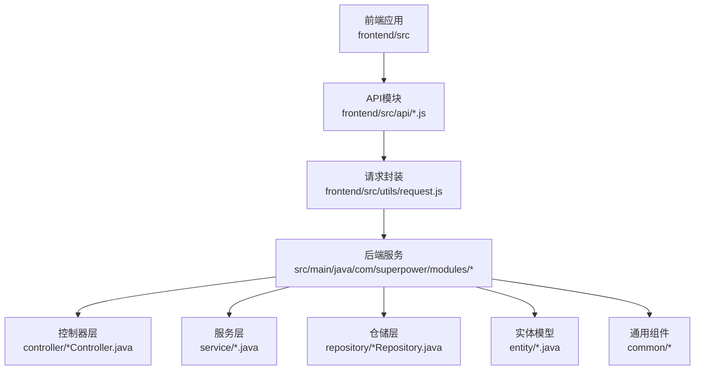
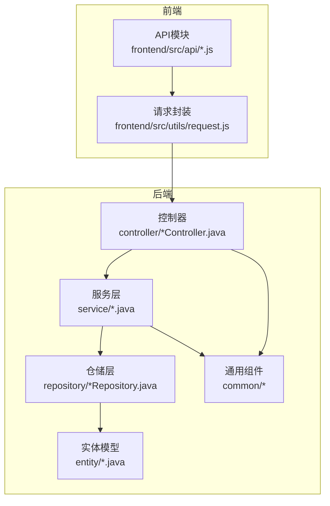
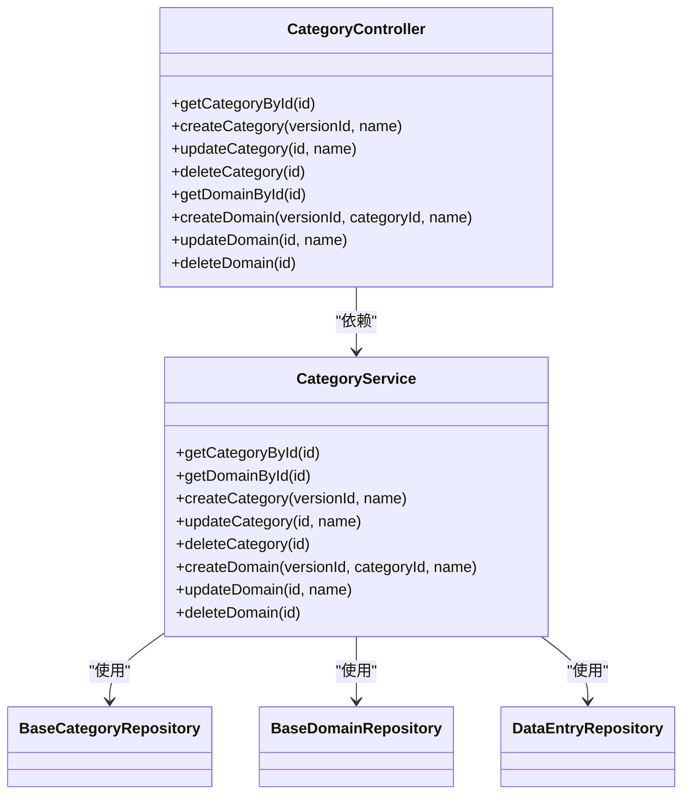
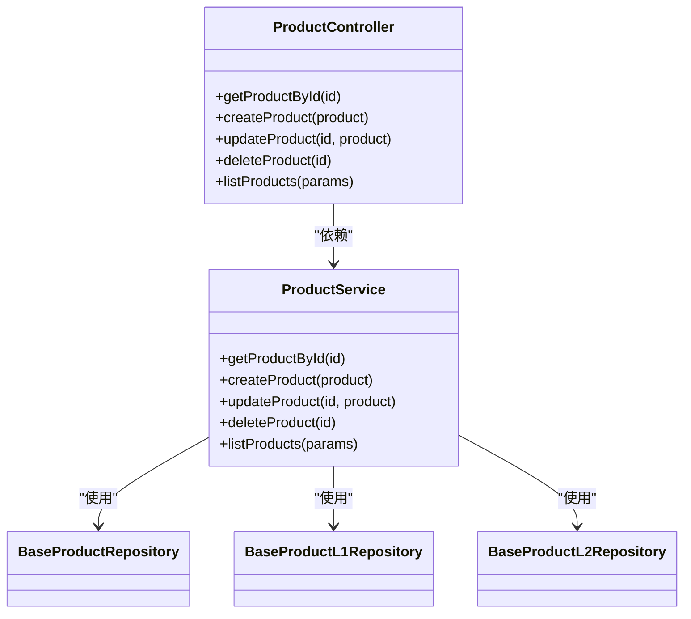
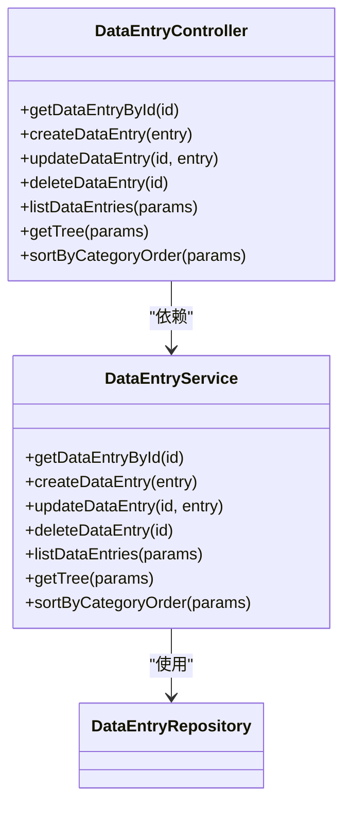
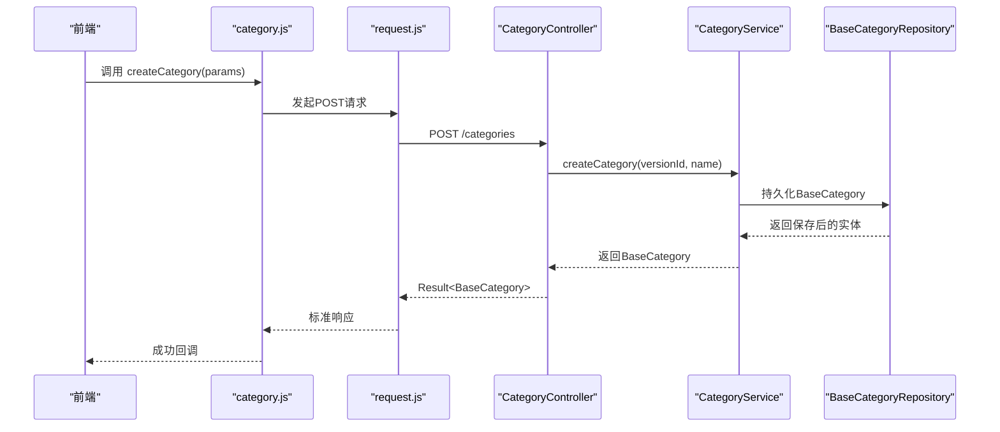
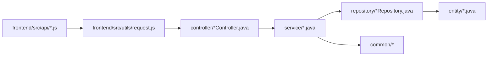

# 基础CRUD操作

<cite>
**本文档引用的文件**
- [CategoryController.java](file://src/main/java/com/superpower/modules/category/controller/CategoryController.java)
- [ProductController.java](file://src/main/java/com/superpower/modules/category/controller/ProductController.java)
- [DataEntryController.java](file://src/main/java/com/superpower/modules/data/controller/DataEntryController.java)
- [CategoryService.java](file://src/main/java/com/superpower/modules/category/service/CategoryService.java)
- [ProductService.java](file://src/main/java/com/superpower/modules/category/service/ProductService.java)
- [DataEntryService.java](file://src/main/java/com/superpower/modules/data/service/DataEntryService.java)
- [BaseCategoryRepository.java](file://src/main/java/com/superpower/modules/category/repository/BaseCategoryRepository.java)
- [BaseDomainRepository.java](file://src/main/java/com/superpower/modules/category/repository/BaseDomainRepository.java)
- [BaseProductRepository.java](file://src/main/java/com/superpower/modules/category/repository/BaseProductRepository.java)
- [BaseProductL1Repository.java](file://src/main/java/com/superpower/modules/category/repository/BaseProductL1Repository.java)
- [BaseProductL2Repository.java](file://src/main/java/com/superpower/modules/category/repository/BaseProductL2Repository.java)
- [BaseProductRepository.java](file://src/main/java/com/superpower/modules/category/repository/BaseProductRepository.java)
- [DataEntryRepository.java](file://src/main/java/com/superpower/modules/data/repository/DataEntryRepository.java)
- [BaseCategory.java](file://src/main/java/com/superpower/modules/category/entity/BaseCategory.java)
- [BaseDomain.java](file://src/main/java/com/superpower/modules/category/entity/BaseDomain.java)
- [BaseProduct.java](file://src/main/java/com/superpower/modules/category/entity/BaseProduct.java)
- [BaseProductL1.java](file://src/main/java/com/superpower/modules/category/entity/BaseProductL1.java)
- [BaseProductL2.java](file://src/main/java/com/superpower/modules/category/entity/BaseProductL2.java)
- [BaseProduct.java](file://src/main/java/com/superpower/modules/category/entity/BaseProduct.java)
- [DataEntry.java](file://src/main/java/com/superpower/modules/data/entity/DataEntry.java)
- [Result.java](file://src/main/java/com/superpower/common/Result.java)
- [ResultCode.java](file://src/main/java/com/superpower/common/ResultCode.java)
- [PageResult.java](file://src/main/java/com/superpower/common/PageResult.java)
- [GlobalExceptionHandler.java](file://src/main/java/com/superpower/common/GlobalExceptionHandler.java)
- [BusinessException.java](file://src/main/java/com/superpower/common/BusinessException.java)
- [request.js](file://frontend/src/utils/request.js)
- [category.js](file://frontend/src/api/category.js)
- [product.js](file://frontend/src/api/product.js)
- [data.js](file://frontend/src/api/data.js)
</cite>

## 目录
1. [简介](#简介)
2. [项目结构](#项目结构)
3. [核心组件](#核心组件)
4. [架构总览](#架构总览)
5. [详细组件分析](#详细组件分析)
6. [依赖关系分析](#依赖关系分析)
7. [性能考虑](#性能考虑)
8. [故障排除指南](#故障排除指南)
9. [结论](#结论)
10. [附录](#附录)

## 简介
本文件面向基础CRUD（创建、读取、更新、删除）操作，系统性梳理后端控制器、服务层、仓储层及前端API调用的完整链路，覆盖HTTP方法、URL路径、请求参数、响应格式、错误处理、数据验证规则、字段约束与业务逻辑，并提供分页查询、排序与过滤的使用说明。目标是帮助开发者快速理解并正确使用相关接口。

## 项目结构
后端采用Spring Boot分层架构：controller（控制器）、service（服务）、repository（仓储）、entity（实体），配合统一响应包装与异常处理；前端通过封装的请求工具与API模块进行调用。

图表来源
- [CategoryController.java](file://src/main/java/com/superpower/modules/category/controller/CategoryController.java)
- [CategoryService.java](file://src/main/java/com/superpower/modules/category/service/CategoryService.java)
- [BaseCategoryRepository.java](file://src/main/java/com/superpower/modules/category/repository/BaseCategoryRepository.java)
- [BaseCategory.java](file://src/main/java/com/superpower/modules/category/entity/BaseCategory.java)
- [Result.java](file://src/main/java/com/superpower/common/Result.java)
- [request.js](file://frontend/src/utils/request.js)
- [category.js](file://frontend/src/api/category.js)

章节来源
- [CategoryController.java](file://src/main/java/com/superpower/modules/category/controller/CategoryController.java)
- [CategoryService.java](file://src/main/java/com/superpower/modules/category/service/CategoryService.java)
- [BaseCategoryRepository.java](file://src/main/java/com/superpower/modules/category/repository/BaseCategoryRepository.java)
- [BaseCategory.java](file://src/main/java/com/superpower/modules/category/entity/BaseCategory.java)
- [Result.java](file://src/main/java/com/superpower/common/Result.java)
- [request.js](file://frontend/src/utils/request.js)
- [category.js](file://frontend/src/api/category.js)

## 核心组件
- 统一响应包装：Result<ResultCode> 提供成功/失败的标准化返回。
- 分页结果：PageResult<T> 封装分页数据。
- 全局异常处理：GlobalExceptionHandler 将业务异常转换为标准响应。
- 业务异常：BusinessException 用于抛出业务规则相关的错误。
- 控制器：各模块的Controller负责接收HTTP请求，校验参数，调用服务层并返回Result。
- 服务层：实现业务逻辑，包含数据验证、约束检查与跨表同步。
- 仓储层：基于JPA Repository访问数据库，提供查询与持久化能力。
- 实体模型：映射数据库表结构，定义字段与关系。

章节来源
- [Result.java](file://src/main/java/com/superpower/common/Result.java)
- [ResultCode.java](file://src/main/java/com/superpower/common/ResultCode.java)
- [PageResult.java](file://src/main/java/com/superpower/common/PageResult.java)
- [GlobalExceptionHandler.java](file://src/main/java/com/superpower/common/GlobalExceptionHandler.java)
- [BusinessException.java](file://src/main/java/com/superpower/common/BusinessException.java)

## 架构总览
后端遵循MVC模式，前端通过API模块与后端交互，统一通过Result包装响应。服务层承担业务规则与数据一致性，仓储层负责数据存取。

图表来源
- [CategoryController.java](file://src/main/java/com/superpower/modules/category/controller/CategoryController.java)
- [CategoryService.java](file://src/main/java/com/superpower/modules/category/service/CategoryService.java)
- [BaseCategoryRepository.java](file://src/main/java/com/superpower/modules/category/repository/BaseCategoryRepository.java)
- [BaseCategory.java](file://src/main/java/com/superpower/modules/category/entity/BaseCategory.java)
- [Result.java](file://src/main/java/com/superpower/common/Result.java)
- [request.js](file://frontend/src/utils/request.js)
- [category.js](file://frontend/src/api/category.js)

## 详细组件分析

### 类别管理（Category）CRUD
类别管理涉及两类实体：BaseCategory（一级分类）与BaseDomain（二级业务域）。服务层提供创建、读取、更新、删除等方法，并在更新名称时同步更新数据条目中的冗余字段，保证维度表与数据表的一致性。

图表来源
- [CategoryController.java](file://src/main/java/com/superpower/modules/category/controller/CategoryController.java)
- [CategoryService.java](file://src/main/java/com/superpower/modules/category/service/CategoryService.java)
- [BaseCategoryRepository.java](file://src/main/java/com/superpower/modules/category/repository/BaseCategoryRepository.java)
- [BaseDomainRepository.java](file://src/main/java/com/superpower/modules/category/repository/BaseDomainRepository.java)
- [DataEntryRepository.java](file://src/main/java/com/superpower/modules/data/repository/DataEntryRepository.java)

- 接口清单（类别）
  - GET /categories/{id}：读取指定类别详情
    - 请求参数：路径参数 id（Long）
    - 成功响应：Result<BaseCategory>
    - 错误处理：若类别不存在，抛出业务异常
  - POST /categories：创建类别
    - 请求体：versionId（Long）、name（String）
    - 成功响应：Result<BaseCategory>
    - 错误处理：版本或名称非法时抛出业务异常
  - PUT /categories/{id}：更新类别
    - 请求参数：路径参数 id（Long）
    - 请求体：name（String）
    - 成功响应：Result<BaseCategory>
    - 业务逻辑：更新名称后同步更新数据条目中对应字段
    - 错误处理：若类别不存在或名称冲突，抛出业务异常
  - DELETE /categories/{id}：删除类别
    - 请求参数：路径参数 id（Long）
    - 成功响应：Result<Void>
    - 业务逻辑：若类别下存在业务域则禁止删除；同时清理数据条目中对应的level=1记录
    - 错误处理：若存在子项或删除失败，抛出业务异常

- 接口清单（业务域）
  - GET /domains/{id}：读取指定业务域详情
    - 请求参数：路径参数 id（Long）
    - 成功响应：Result<BaseDomain>
    - 错误处理：若业务域不存在，抛出业务异常
  - POST /domains：创建业务域
    - 请求体：versionId（Long）、categoryId（Long）、name（String）
    - 成功响应：Result<BaseDomain>
    - 业务逻辑：创建业务域的同时，在数据条目中创建对应的level=2记录
    - 错误处理：若类别不存在或名称冲突，抛出业务异常
  - PUT /domains/{id}：更新业务域
    - 请求参数：路径参数 id（Long）
    - 请求体：name（String）
    - 成功响应：Result<BaseDomain>
    - 业务逻辑：更新名称后同步更新数据条目中对应字段
    - 错误处理：若业务域不存在或名称冲突，抛出业务异常
  - DELETE /domains/{id}：删除业务域
    - 请求参数：路径参数 id（Long）
    - 成功响应：Result<Void>
    - 业务逻辑：同时清理数据条目中对应的level=2记录
    - 错误处理：若删除失败，抛出业务异常

- 数据验证与字段约束
  - name 字段非空且长度限制由服务层校验
  - 创建时按sortOrder递增排列，避免重复
  - 更新时触发跨表同步，确保维度表与数据表一致性
  - 删除前检查是否存在子项，防止破坏数据完整性

- 错误处理示例
  - 业务异常：如“分类不存在”、“该分类下存在业务域，不可删除”
  - 全局异常处理器将业务异常转换为标准Result结构

章节来源
- [CategoryController.java](file://src/main/java/com/superpower/modules/category/controller/CategoryController.java)
- [CategoryService.java](file://src/main/java/com/superpower/modules/category/service/CategoryService.java)
- [BaseCategoryRepository.java](file://src/main/java/com/superpower/modules/category/repository/BaseCategoryRepository.java)
- [BaseDomainRepository.java](file://src/main/java/com/superpower/modules/category/repository/BaseDomainRepository.java)
- [DataEntryRepository.java](file://src/main/java/com/superpower/modules/data/repository/DataEntryRepository.java)
- [BusinessException.java](file://src/main/java/com/superpower/common/BusinessException.java)
- [GlobalExceptionHandler.java](file://src/main/java/com/superpower/common/GlobalExceptionHandler.java)

### 产品管理（Product）CRUD
产品管理涉及多层级实体：BaseProduct、BaseProductL1、BaseProductL2以及对应的仓储。控制器提供标准CRUD接口，服务层负责业务规则与数据一致性。

图表来源
- [ProductController.java](file://src/main/java/com/superpower/modules/category/controller/ProductController.java)
- [ProductService.java](file://src/main/java/com/superpower/modules/category/service/ProductService.java)
- [BaseProductRepository.java](file://src/main/java/com/superpower/modules/category/repository/BaseProductRepository.java)
- [BaseProductL1Repository.java](file://src/main/java/com/superpower/modules/category/repository/BaseProductL1Repository.java)
- [BaseProductL2Repository.java](file://src/main/java/com/superpower/modules/category/repository/BaseProductL2Repository.java)

- 接口清单（产品）
  - GET /products/{id}：读取指定产品详情
    - 请求参数：路径参数 id（Long）
    - 成功响应：Result<BaseProduct>
  - POST /products：创建产品
    - 请求体：产品对象（含层级信息）
    - 成功响应：Result<BaseProduct>
  - PUT /products/{id}：更新产品
    - 请求参数：路径参数 id（Long）
    - 请求体：产品对象
    - 成功响应：Result<BaseProduct>
  - DELETE /products/{id}：删除产品
    - 请求参数：路径参数 id（Long）
    - 成功响应：Result<Void>
  - GET /products：分页列表
    - 查询参数：page（页码）、size（每页大小）、sort（排序字段）、order（asc/desc）、filter（过滤条件）
    - 成功响应：PageResult<BaseProduct>

- 数据验证与字段约束
  - 产品名称、编码等字段需满足唯一性与长度限制
  - 层级关系（L1/L2）需符合业务规则
  - 分页参数默认值与边界检查由服务层处理

- 错误处理示例
  - 业务异常：如“产品不存在”、“层级关系不合法”
  - 全局异常处理器统一转换为标准响应

章节来源
- [ProductController.java](file://src/main/java/com/superpower/modules/category/controller/ProductController.java)
- [ProductService.java](file://src/main/java/com/superpower/modules/category/service/ProductService.java)
- [BaseProductRepository.java](file://src/main/java/com/superpower/modules/category/repository/BaseProductRepository.java)
- [BaseProductL1Repository.java](file://src/main/java/com/superpower/modules/category/repository/BaseProductL1Repository.java)
- [BaseProductL2Repository.java](file://src/main/java/com/superpower/modules/category/repository/BaseProductL2Repository.java)
- [BusinessException.java](file://src/main/java/com/superpower/common/BusinessException.java)
- [GlobalExceptionHandler.java](file://src/main/java/com/superpower/common/GlobalExceptionHandler.java)

### 数据条目（DataEntry）CRUD
数据条目作为核心数据载体，支持树形结构查询、排序与过滤，同时提供标准CRUD接口。

图表来源
- [DataEntryController.java](file://src/main/java/com/superpower/modules/data/controller/DataEntryController.java)
- [DataEntryService.java](file://src/main/java/com/superpower/modules/data/service/DataEntryService.java)
- [DataEntryRepository.java](file://src/main/java/com/superpower/modules/data/repository/DataEntryRepository.java)

- 接口清单（数据条目）
  - GET /data/{id}：读取指定数据条目
    - 请求参数：路径参数 id（Long）
    - 成功响应：Result<DataEntry>
  - POST /data：创建数据条目
    - 请求体：DataEntry对象
    - 成功响应：Result<DataEntry>
  - PUT /data/{id}：更新数据条目
    - 请求参数：路径参数 id（Long）
    - 请求体：DataEntry对象
    - 成功响应：Result<DataEntry>
  - DELETE /data/{id}：删除数据条目
    - 请求参数：路径参数 id（Long）
    - 成功响应：Result<Void>
  - GET /data：分页列表
    - 查询参数：page、size、sort、order、filter
    - 成功响应：PageResult<DataEntry>
  - GET /data/tree：树形结构
    - 查询参数：versionId、includeLeaf
    - 成功响应：Result<TreeNodeDTO[]>
  - GET /data/sort：按分类顺序排序
    - 查询参数：versionId、categoryId
    - 成功响应：Result<DataEntry[]>

- 数据验证与字段约束
  - 版本号、层级、父子关系需满足业务规则
  - 过滤参数支持多字段组合过滤
  - 排序支持多字段组合排序

- 错误处理示例
  - 业务异常：如“数据条目不存在”、“父节点不存在”
  - 全局异常处理器统一转换为标准响应

章节来源
- [DataEntryController.java](file://src/main/java/com/superpower/modules/data/controller/DataEntryController.java)
- [DataEntryService.java](file://src/main/java/com/superpower/modules/data/service/DataEntryService.java)
- [DataEntryRepository.java](file://src/main/java/com/superpower/modules/data/repository/DataEntryRepository.java)
- [BusinessException.java](file://src/main/java/com/superpower/common/BusinessException.java)
- [GlobalExceptionHandler.java](file://src/main/java/com/superpower/common/GlobalExceptionHandler.java)

### API调用流程（以类别创建为例）

图表来源
- [category.js](file://frontend/src/api/category.js)
- [request.js](file://frontend/src/utils/request.js)
- [CategoryController.java](file://src/main/java/com/superpower/modules/category/controller/CategoryController.java)
- [CategoryService.java](file://src/main/java/com/superpower/modules/category/service/CategoryService.java)
- [BaseCategoryRepository.java](file://src/main/java/com/superpower/modules/category/repository/BaseCategoryRepository.java)

## 依赖关系分析
- 控制器依赖服务层，服务层依赖仓储层与实体模型。
- 统一响应与异常处理贯穿整个调用链。
- 前端通过API模块与请求封装与后端交互。

图表来源
- [category.js](file://frontend/src/api/category.js)
- [request.js](file://frontend/src/utils/request.js)
- [CategoryController.java](file://src/main/java/com/superpower/modules/category/controller/CategoryController.java)
- [CategoryService.java](file://src/main/java/com/superpower/modules/category/service/CategoryService.java)
- [BaseCategoryRepository.java](file://src/main/java/com/superpower/modules/category/repository/BaseCategoryRepository.java)
- [Result.java](file://src/main/java/com/superpower/common/Result.java)

章节来源
- [category.js](file://frontend/src/api/category.js)
- [request.js](file://frontend/src/utils/request.js)
- [CategoryController.java](file://src/main/java/com/superpower/modules/category/controller/CategoryController.java)
- [CategoryService.java](file://src/main/java/com/superpower/modules/category/service/CategoryService.java)
- [BaseCategoryRepository.java](file://src/main/java/com/superpower/modules/category/repository/BaseCategoryRepository.java)
- [Result.java](file://src/main/java/com/superpower/common/Result.java)

## 性能考虑
- 分页查询：合理设置page与size，避免一次性加载过多数据。
- 排序与过滤：尽量使用索引字段进行排序与过滤，减少全表扫描。
- 批量操作：对于批量更新/删除，建议在服务层进行事务控制与批量提交。
- 缓存策略：对只读数据（如字典类数据）可引入缓存减少数据库压力。
- 异步处理：对耗时操作（如导入、导出）可采用异步任务队列。

## 故障排除指南
- 常见错误类型
  - 参数缺失或格式错误：检查请求体与查询参数是否符合接口定义。
  - 业务规则违反：如删除时存在子项、名称冲突等，需根据提示修正。
  - 数据不存在：确认主键或唯一标识是否正确。
- 统一错误响应
  - 所有异常最终由全局异常处理器转换为Result结构，前端可根据状态码与消息进行处理。
- 建议排查步骤
  - 查看后端日志定位异常堆栈
  - 使用Swagger或Postman验证接口签名与参数
  - 检查数据库约束与索引是否完善
  - 对比前后端字段映射与命名规范

章节来源
- [GlobalExceptionHandler.java](file://src/main/java/com/superpower/common/GlobalExceptionHandler.java)
- [BusinessException.java](file://src/main/java/com/superpower/common/BusinessException.java)

## 结论
本文档系统梳理了类别、产品与数据条目的基础CRUD接口，明确了HTTP方法、URL路径、请求参数、响应格式与错误处理机制，并结合服务层的业务规则与数据一致性要求，提供了前端调用参考与故障排除建议。建议在实际开发中严格遵循接口规范与数据验证规则，确保系统的稳定性与一致性。

## 附录
- 前端API模块
  - 类别管理：frontend/src/api/category.js
  - 产品管理：frontend/src/api/product.js
  - 数据条目：frontend/src/api/data.js
  - 请求封装：frontend/src/utils/request.js
- 后端通用组件
  - 统一响应：src/main/java/com/superpower/common/Result.java
  - 分页结果：src/main/java/com/superpower/common/PageResult.java
  - 全局异常处理：src/main/java/com/superpower/common/GlobalExceptionHandler.java
  - 业务异常：src/main/java/com/superpower/common/BusinessException.java