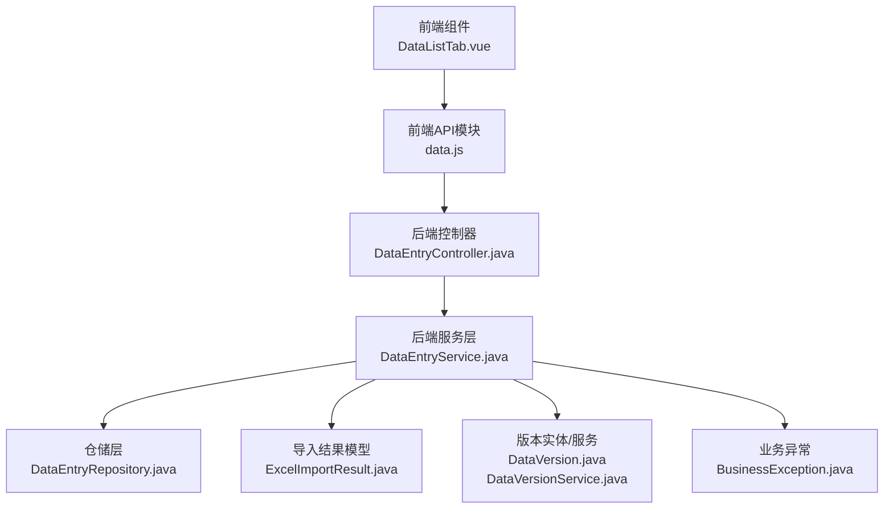
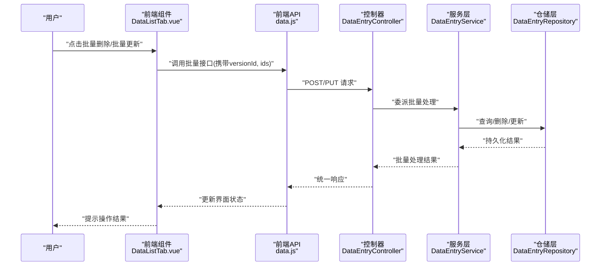
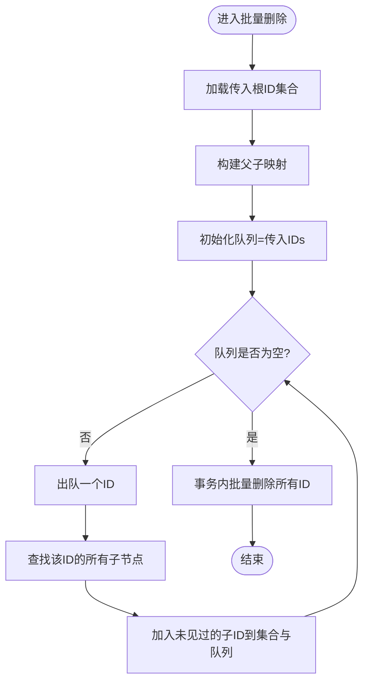
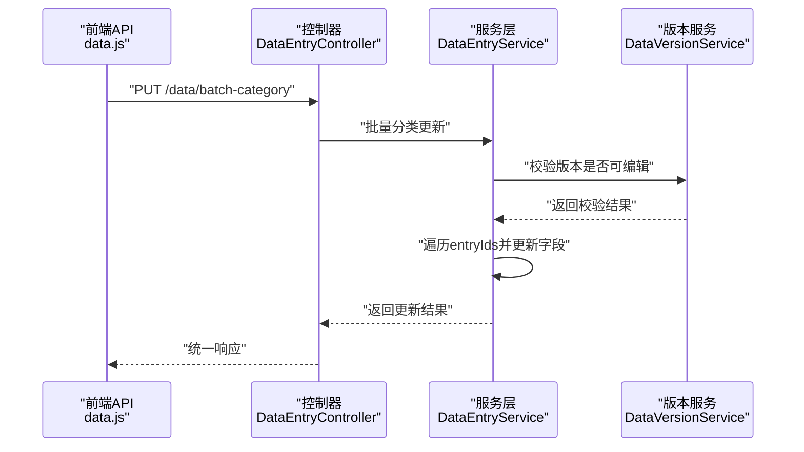
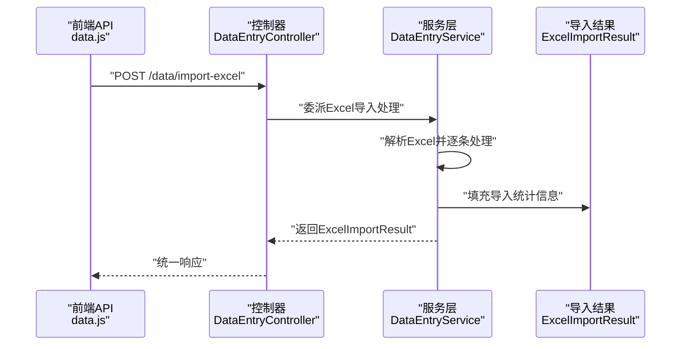
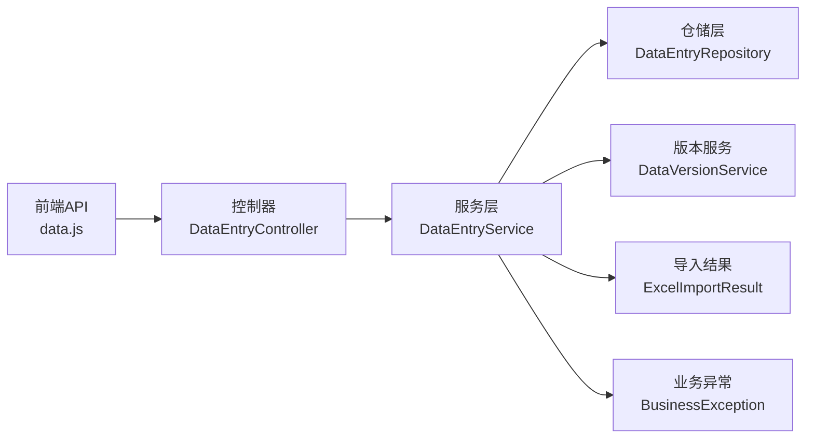

# 批量操作接口

<cite>
**本文引用的文件**
- [frontend/src/api/data.js](file://frontend/src/api/data.js)
- [frontend/src/components/DataListTab.vue](file://frontend/src/components/DataListTab.vue)
- [src/main/java/com/superpower/modules/data/controller/DataEntryController.java](file://src/main/java/com/superpower/modules/data/controller/DataEntryController.java)
- [src/main/java/com/superpower/modules/data/service/DataEntryService.java](file://src/main/java/com/superpower/modules/data/service/DataEntryService.java)
- [src/main/java/com/superpower/modules/data/dto/ExcelImportResult.java](file://src/main/java/com/superpower/modules/data/dto/ExcelImportResult.java)
- [src/main/java/com/superpower/common/BusinessException.java](file://src/main/java/com/superpower/common/BusinessException.java)
- [src/main/java/com/superpower/modules/data/repository/DataEntryRepository.java](file://src/main/java/com/superpower/modules/data/repository/DataEntryRepository.java)
- [src/main/java/com/superpower/modules/version/entity/DataVersion.java](file://src/main/java/com/superpower/modules/version/entity/DataVersion.java)
- [src/main/java/com/superpower/modules/version/service/DataVersionService.java](file://src/main/java/com/superpower/modules/version/service/DataVersionService.java)
</cite>

## 目录
1. [简介](#简介)
2. [项目结构](#项目结构)
3. [核心组件](#核心组件)
4. [架构总览](#架构总览)
5. [详细组件分析](#详细组件分析)
6. [依赖关系分析](#依赖关系分析)
7. [性能考量](#性能考量)
8. [故障排查指南](#故障排查指南)
9. [结论](#结论)
10. [附录](#附录)

## 简介
本文件聚焦于系统中的批量操作接口，涵盖批量删除、批量更新（业务分类/业务域/父节点）、批量导入（Excel）等能力。文档从接口定义、请求与响应格式、数据结构、事务性保证、错误处理策略、性能优化与最佳实践等方面进行系统化说明，并通过图示展示前后端交互流程与后端处理逻辑。

## 项目结构
批量操作相关能力由前端 API 模块与后端控制器/服务层共同实现：
- 前端：在数据工作台页面提供批量操作入口，调用后端批量接口。
- 后端：控制器接收批量请求，服务层执行批量逻辑，仓储层访问数据库。

**图表来源**
- [frontend/src/components/DataListTab.vue](file://frontend/src/components/DataListTab.vue)
- [frontend/src/api/data.js](file://frontend/src/api/data.js)
- [src/main/java/com/superpower/modules/data/controller/DataEntryController.java](file://src/main/java/com/superpower/modules/data/controller/DataEntryController.java)
- [src/main/java/com/superpower/modules/data/service/DataEntryService.java](file://src/main/java/com/superpower/modules/data/service/DataEntryService.java)
- [src/main/java/com/superpower/modules/data/repository/DataEntryRepository.java](file://src/main/java/com/superpower/modules/data/repository/DataEntryRepository.java)
- [src/main/java/com/superpower/modules/data/dto/ExcelImportResult.java](file://src/main/java/com/superpower/modules/data/dto/ExcelImportResult.java)
- [src/main/java/com/superpower/modules/version/entity/DataVersion.java](file://src/main/java/com/superpower/modules/version/entity/DataVersion.java)
- [src/main/java/com/superpower/modules/version/service/DataVersionService.java](file://src/main/java/com/superpower/modules/version/service/DataVersionService.java)
- [src/main/java/com/superpower/common/BusinessException.java](file://src/main/java/com/superpower/common/BusinessException.java)

**章节来源**
- [frontend/src/components/DataListTab.vue](file://frontend/src/components/DataListTab.vue)
- [frontend/src/api/data.js](file://frontend/src/api/data.js)
- [src/main/java/com/superpower/modules/data/controller/DataEntryController.java](file://src/main/java/com/superpower/modules/data/controller/DataEntryController.java)
- [src/main/java/com/superpower/modules/data/service/DataEntryService.java](file://src/main/java/com/superpower/modules/data/service/DataEntryService.java)

## 核心组件
- 前端批量接口封装：提供批量删除、批量更新分类、Excel 导入等方法，统一通过 axios 发起请求。
- 后端控制器：暴露批量删除、批量分类更新、Excel 导入等 REST 接口。
- 服务层批量逻辑：实现批量删除（含树形子节点扩展）、批量分类更新（校验版本可编辑性）、Excel 导入结果统计。
- 数据模型：包含导入结果 DTO，用于返回导入统计信息。
- 版本控制：批量更新前检查版本状态，确保仅对草稿版本执行变更。

**章节来源**
- [frontend/src/api/data.js](file://frontend/src/api/data.js)
- [src/main/java/com/superpower/modules/data/controller/DataEntryController.java](file://src/main/java/com/superpower/modules/data/controller/DataEntryController.java)
- [src/main/java/com/superpower/modules/data/service/DataEntryService.java](file://src/main/java/com/superpower/modules/data/service/DataEntryService.java)
- [src/main/java/com/superpower/modules/data/dto/ExcelImportResult.java](file://src/main/java/com/superpower/modules/data/dto/ExcelImportResult.java)
- [src/main/java/com/superpower/modules/version/entity/DataVersion.java](file://src/main/java/com/superpower/modules/version/entity/DataVersion.java)

## 架构总览
批量操作的端到端流程如下：
- 前端用户在数据工作台选择多条记录，触发批量操作。
- 前端调用对应批量 API，携带版本 ID 与目标 ID 列表。
- 控制器接收请求，调用服务层执行批量处理。
- 服务层执行业务规则（如版本状态校验、树形删除扩展），提交事务。
- 返回统一结果对象，前端更新界面状态。

**图表来源**
- [frontend/src/components/DataListTab.vue](file://frontend/src/components/DataListTab.vue)
- [frontend/src/api/data.js](file://frontend/src/api/data.js)
- [src/main/java/com/superpower/modules/data/controller/DataEntryController.java](file://src/main/java/com/superpower/modules/data/controller/DataEntryController.java)
- [src/main/java/com/superpower/modules/data/service/DataEntryService.java](file://src/main/java/com/superpower/modules/data/service/DataEntryService.java)
- [src/main/java/com/superpower/modules/data/repository/DataEntryRepository.java](file://src/main/java/com/superpower/modules/data/repository/DataEntryRepository.java)

## 详细组件分析

### 批量删除接口
- 接口位置：前端通过 POST /data/batch-delete 调用；后端控制器映射至批量删除方法。
- 请求参数：
  - 查询参数：versionId（版本 ID）
  - 请求体：数组 ids（待删除条目的主键列表）
- 处理机制：
  - 服务层根据传入的根 ID 集合，构建父子关系映射，使用广度优先扩展所有子孙 ID，形成完整删除集合。
  - 在同一事务中执行批量删除，确保原子性。
- 错误处理：
  - 若传入 ID 为空或无匹配记录，直接返回空结果。
  - 业务异常将被全局异常处理器捕获并返回标准错误码。
- 性能优化：
  - 使用一次性批量删除接口，避免逐条删除带来的 N+1 开销。
  - 删除前扩展子节点集合，减少后续查询次数。

**图表来源**
- [src/main/java/com/superpower/modules/data/service/DataEntryService.java](file://src/main/java/com/superpower/modules/data/service/DataEntryService.java)

**章节来源**
- [frontend/src/api/data.js](file://frontend/src/api/data.js)
- [frontend/src/components/DataListTab.vue](file://frontend/src/components/DataListTab.vue)
- [src/main/java/com/superpower/modules/data/service/DataEntryService.java](file://src/main/java/com/superpower/modules/data/service/DataEntryService.java)
- [src/main/java/com/superpower/common/BusinessException.java](file://src/main/java/com/superpower/common/BusinessException.java)

### 批量更新分类接口
- 接口位置：前端通过 PUT /data/batch-category 调用；后端控制器映射至批量分类更新方法。
- 请求参数：
  - 请求体：versionId（版本 ID）、entryIds（条目 ID 数组）、categoryId（业务分类 ID）、domainId（业务域 ID）、parentId（可选，父节点 ID）。
- 处理机制：
  - 更新前检查版本状态，仅允许对草稿版本执行批量更新。
  - 对每个条目设置新的分类、域、父节点（若提供），并保存。
- 错误处理：
  - 版本处于发布态时拒绝更新，抛出业务异常。
  - 其他异常按全局异常处理返回。
- 性能优化：
  - 单次请求批量更新多个条目，减少往返次数。
  - 服务层在事务内统一提交，避免重复写入。

**图表来源**
- [frontend/src/api/data.js](file://frontend/src/api/data.js)
- [src/main/java/com/superpower/modules/data/controller/DataEntryController.java](file://src/main/java/com/superpower/modules/data/controller/DataEntryController.java)
- [src/main/java/com/superpower/modules/data/service/DataEntryService.java](file://src/main/java/com/superpower/modules/data/service/DataEntryService.java)
- [src/main/java/com/superpower/modules/version/service/DataVersionService.java](file://src/main/java/com/superpower/modules/version/service/DataVersionService.java)

**章节来源**
- [frontend/src/api/data.js](file://frontend/src/api/data.js)
- [src/main/java/com/superpower/modules/data/service/DataEntryService.java](file://src/main/java/com/superpower/modules/data/service/DataEntryService.java)
- [src/main/java/com/superpower/modules/version/entity/DataVersion.java](file://src/main/java/com/superpower/modules/version/entity/DataVersion.java)

### 批量导入接口（Excel）
- 接口位置：前端通过 POST /data/import-excel 调用；后端控制器映射至导入方法。
- 请求参数：
  - 表单字段：file（Excel 文件）、versionId（版本 ID）。
  - 超时时间：120 秒。
- 处理机制：
  - 服务层解析 Excel 并逐条处理，统计总数、成功数、更新数、失败数及错误明细。
  - 返回导入结果 DTO，包含上述统计信息。
- 错误处理：
  - 解析异常、业务异常均会被捕获并汇总到错误列表。
- 性能优化：
  - 使用流式处理与分批提交，避免一次性加载全部数据导致内存压力。
  - 统一事务边界，失败时整体回滚。

**图表来源**
- [frontend/src/api/data.js](file://frontend/src/api/data.js)
- [src/main/java/com/superpower/modules/data/controller/DataEntryController.java](file://src/main/java/com/superpower/modules/data/controller/DataEntryController.java)
- [src/main/java/com/superpower/modules/data/service/DataEntryService.java](file://src/main/java/com/superpower/modules/data/service/DataEntryService.java)
- [src/main/java/com/superpower/modules/data/dto/ExcelImportResult.java](file://src/main/java/com/superpower/modules/data/dto/ExcelImportResult.java)

**章节来源**
- [frontend/src/api/data.js](file://frontend/src/api/data.js)
- [src/main/java/com/superpower/modules/data/dto/ExcelImportResult.java](file://src/main/java/com/superpower/modules/data/dto/ExcelImportResult.java)

## 依赖关系分析
- 前端依赖 axios 进行 HTTP 通信，批量接口通过统一的 API 模块封装。
- 控制器依赖服务层完成业务处理，服务层依赖仓储层访问数据库。
- 批量更新依赖版本服务进行状态校验，确保只在草稿版本上执行变更。
- 批量删除依赖父子映射与队列扩展算法，确保删除完整性。

**图表来源**
- [frontend/src/api/data.js](file://frontend/src/api/data.js)
- [src/main/java/com/superpower/modules/data/controller/DataEntryController.java](file://src/main/java/com/superpower/modules/data/controller/DataEntryController.java)
- [src/main/java/com/superpower/modules/data/service/DataEntryService.java](file://src/main/java/com/superpower/modules/data/service/DataEntryService.java)
- [src/main/java/com/superpower/modules/data/repository/DataEntryRepository.java](file://src/main/java/com/superpower/modules/data/repository/DataEntryRepository.java)
- [src/main/java/com/superpower/modules/version/service/DataVersionService.java](file://src/main/java/com/superpower/modules/version/service/DataVersionService.java)
- [src/main/java/com/superpower/modules/data/dto/ExcelImportResult.java](file://src/main/java/com/superpower/modules/data/dto/ExcelImportResult.java)
- [src/main/java/com/superpower/common/BusinessException.java](file://src/main/java/com/superpower/common/BusinessException.java)

**章节来源**
- [frontend/src/api/data.js](file://frontend/src/api/data.js)
- [src/main/java/com/superpower/modules/data/service/DataEntryService.java](file://src/main/java/com/superpower/modules/data/service/DataEntryService.java)

## 性能考量
- 批量删除：通过一次性扩展子节点集合并批量删除，避免多次往返与逐条删除的开销。
- 批量更新：单次请求处理多个条目，减少网络与事务开销。
- Excel 导入：采用分批处理与统一事务，避免大文件一次性加载导致内存溢出。
- 版本控制：批量更新前进行版本状态校验，避免无效写入与后续回滚成本。
- 超时配置：Excel 导入设置较长超时时间，适应大数据量场景。

[本节为通用性能建议，无需特定文件引用]

## 故障排查指南
- 批量删除无效果
  - 检查传入的 versionId 是否正确，以及 ids 是否包含有效 ID。
  - 确认是否存在子节点未被删除（服务层会自动扩展）。
- 批量更新失败
  - 确认版本状态为草稿，否则会拒绝更新。
  - 检查请求体字段是否齐全（versionId、entryIds、categoryId、domainId）。
- Excel 导入报错
  - 检查文件格式与大小限制，关注错误列表中的具体行号与原因。
  - 关注导入超时问题，必要时拆分文件或优化服务器资源。
- 全局异常
  - 业务异常会被统一捕获并返回标准错误码，前端应根据 code 与 message 提示用户。

**章节来源**
- [src/main/java/com/superpower/common/BusinessException.java](file://src/main/java/com/superpower/common/BusinessException.java)
- [src/main/java/com/superpower/modules/data/service/DataEntryService.java](file://src/main/java/com/superpower/modules/data/service/DataEntryService.java)
- [frontend/src/api/data.js](file://frontend/src/api/data.js)

## 结论
批量操作接口通过前后端协同，提供了高效、可靠的批量删除、批量分类更新与 Excel 导入能力。服务层在事务内执行批量逻辑，并结合版本状态校验与树形扩展算法，确保操作的正确性与一致性。配合合理的超时与分批策略，可在大规模数据场景下保持良好性能与稳定性。

[本节为总结性内容，无需特定文件引用]

## 附录

### 接口一览与规范
- 批量删除
  - 方法：POST
  - 路径：/data/batch-delete
  - 查询参数：versionId（必须）
  - 请求体：数组 ids（必须）
  - 响应：统一结果对象
- 批量更新分类
  - 方法：PUT
  - 路径：/data/batch-category
  - 请求体：versionId（必须）、entryIds（必须）、categoryId（必须）、domainId（必须）、parentId（可选）
  - 响应：统一结果对象
- Excel 导入
  - 方法：POST
  - 路径：/data/import-excel
  - 表单字段：file（必须）、versionId（必须）
  - 响应：ExcelImportResult（包含 totalRows、successRows、updateRows、failRows、errors）

**章节来源**
- [frontend/src/api/data.js](file://frontend/src/api/data.js)
- [src/main/java/com/superpower/modules/data/dto/ExcelImportResult.java](file://src/main/java/com/superpower/modules/data/dto/ExcelImportResult.java)