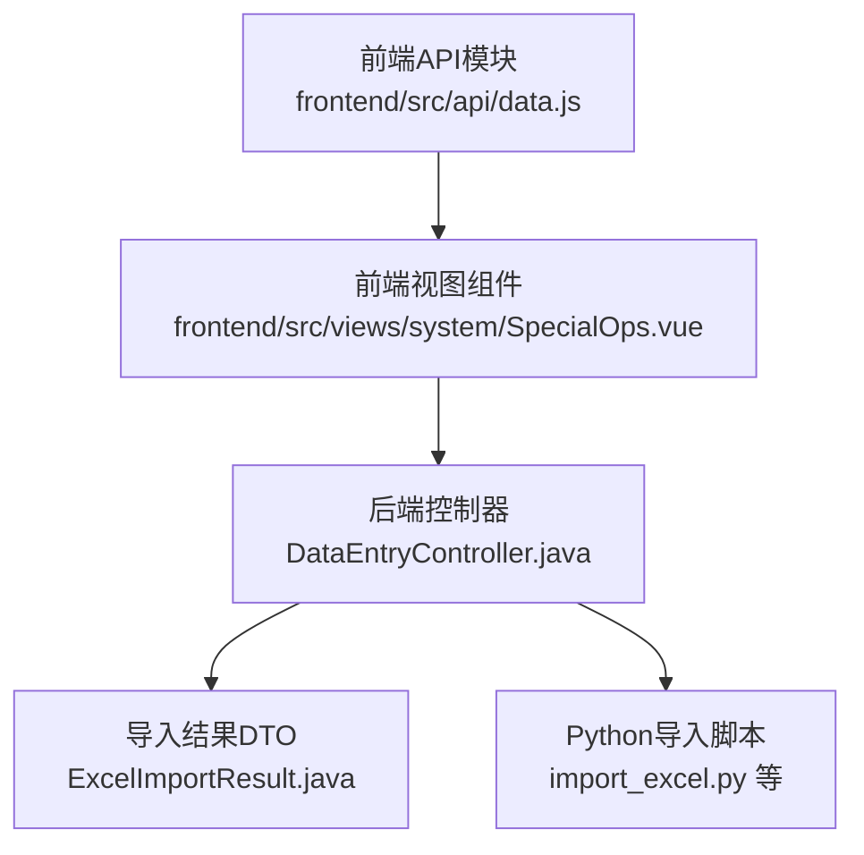
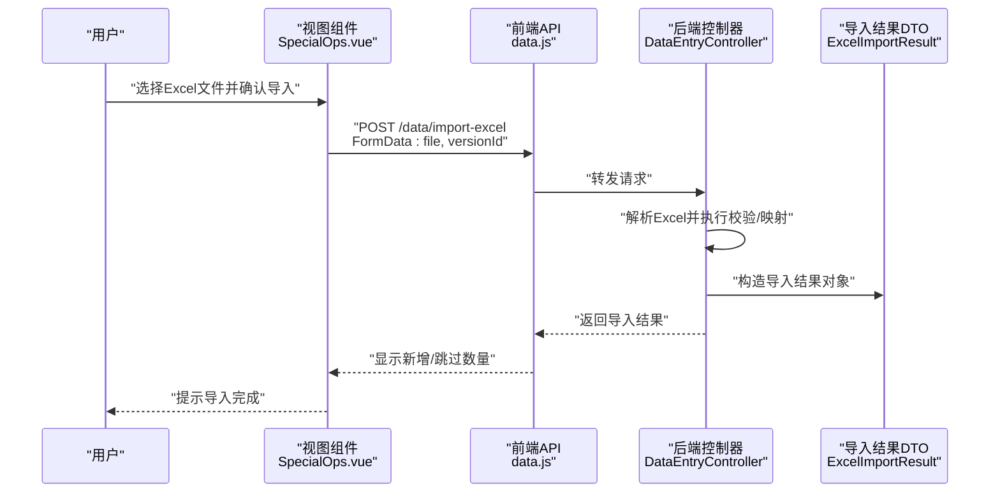
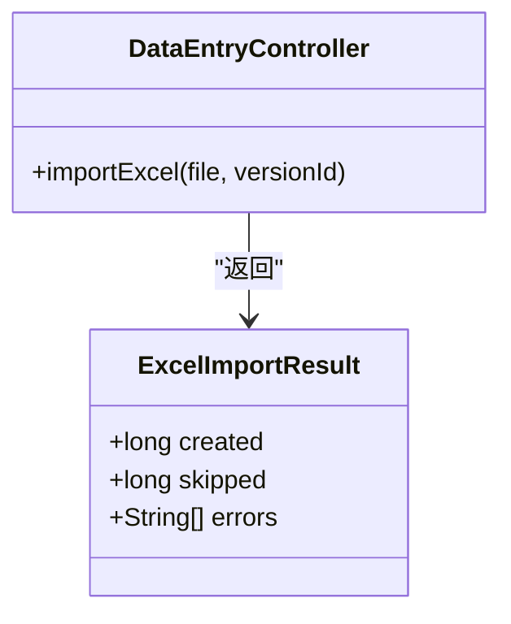
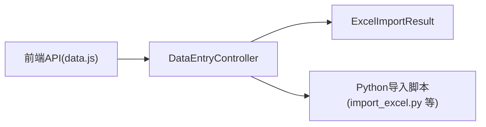

# 数据导入导出

<cite>
**本文引用的文件**
- [frontend/src/api/data.js](file://frontend/src/api/data.js)
- [frontend/src/views/system/SpecialOps.vue](file://frontend/src/views/system/SpecialOps.vue)
- [src/main/java/com/superpower/modules/data/controller/DataEntryController.java](file://src/main/java/com/superpower/modules/data/controller/DataEntryController.java)
- [src/main/java/com/superpower/modules/data/dto/ExcelImportResult.java](file://src/main/java/com/superpower/modules/data/dto/ExcelImportResult.java)
- [import_excel.py](file://import_excel.py)
- [import_hierarchy.py](file://import_hierarchy.py)
- [import_l3.py](file://import_l3.py)
- [import_shuzhidi.py](file://import_shuzhidi.py)
</cite>

## 目录
1. [简介](#简介)
2. [项目结构](#项目结构)
3. [核心组件](#核心组件)
4. [架构总览](#架构总览)
5. [详细组件分析](#详细组件分析)
6. [依赖分析](#依赖分析)
7. [性能考虑](#性能考虑)
8. [故障排除指南](#故障排除指南)
9. [结论](#结论)
10. [附录](#附录)

## 简介
本文件面向“数据导入导出”功能，聚焦于Excel文件导入与导出的完整API文档。内容涵盖：
- Excel导入接口：文件格式要求、数据映射规则、验证机制、导入进度跟踪
- Excel导出接口：功能特性、数据筛选选项、格式定制
- 文件上传限制、错误处理与异常恢复机制
- 完整的文件格式规范与使用示例

该系统由前端Vue应用与后端Spring Boot服务共同实现，并辅以Python脚本用于历史数据导入与层级处理。

## 项目结构
围绕导入导出功能的关键文件分布如下：
- 前端API封装与调用：frontend/src/api/data.js、frontend/src/views/system/SpecialOps.vue
- 后端控制器与DTO：src/main/java/com/superpower/modules/data/controller/DataEntryController.java、ExcelImportResult.java
- 导入脚本：import_excel.py、import_hierarchy.py、import_l3.py、import_shuzhidi.py

图表来源
- [frontend/src/api/data.js:75-83](file://frontend/src/api/data.js#L75-L83)
- [frontend/src/views/system/SpecialOps.vue:582-601](file://frontend/src/views/system/SpecialOps.vue#L582-L601)
- [src/main/java/com/superpower/modules/data/controller/DataEntryController.java](file://src/main/java/com/superpower/modules/data/controller/DataEntryController.java)
- [src/main/java/com/superpower/modules/data/dto/ExcelImportResult.java](file://src/main/java/com/superpower/modules/data/dto/ExcelImportResult.java)
- [import_excel.py](file://import_excel.py)

章节来源
- [frontend/src/api/data.js:75-83](file://frontend/src/api/data.js#L75-L83)
- [frontend/src/views/system/SpecialOps.vue:582-601](file://frontend/src/views/system/SpecialOps.vue#L582-L601)
- [src/main/java/com/superpower/modules/data/controller/DataEntryController.java](file://src/main/java/com/superpower/modules/data/controller/DataEntryController.java)
- [src/main/java/com/superpower/modules/data/dto/ExcelImportResult.java](file://src/main/java/com/superpower/modules/data/dto/ExcelImportResult.java)
- [import_excel.py](file://import_excel.py)

## 核心组件
- 前端导入接口封装：提供导入Excel的FormData封装与超时配置，支持版本选择参数传递。
- 前端视图交互：在特殊运维页面中触发导入流程，包含二次确认、加载状态与消息提示。
- 后端控制器：接收Excel文件与版本标识，执行导入逻辑并返回结构化结果。
- 导入结果DTO：标准化导入统计信息（新增、跳过等）。
- Python导入脚本：面向历史或批量数据的离线导入工具，支持层级与特定域的数据处理。

章节来源
- [frontend/src/api/data.js:75-83](file://frontend/src/api/data.js#L75-L83)
- [frontend/src/views/system/SpecialOps.vue:582-601](file://frontend/src/views/system/SpecialOps.vue#L582-L601)
- [src/main/java/com/superpower/modules/data/controller/DataEntryController.java](file://src/main/java/com/superpower/modules/data/controller/DataEntryController.java)
- [src/main/java/com/superpower/modules/data/dto/ExcelImportResult.java](file://src/main/java/com/superpower/modules/data/dto/ExcelImportResult.java)
- [import_excel.py](file://import_excel.py)

## 架构总览
下图展示从用户操作到后端处理再到结果返回的整体流程：

图表来源
- [frontend/src/views/system/SpecialOps.vue:582-601](file://frontend/src/views/system/SpecialOps.vue#L582-L601)
- [frontend/src/api/data.js:75-83](file://frontend/src/api/data.js#L75-L83)
- [src/main/java/com/superpower/modules/data/controller/DataEntryController.java](file://src/main/java/com/superpower/modules/data/controller/DataEntryController.java)
- [src/main/java/com/superpower/modules/data/dto/ExcelImportResult.java](file://src/main/java/com/superpower/modules/data/dto/ExcelImportResult.java)

## 详细组件分析

### Excel导入接口（前端）
- 接口路径：/data/import-excel
- 方法：POST
- 内容类型：multipart/form-data
- 超时：120秒
- 参数：
  - file：Excel文件（二进制流）
  - versionId：目标版本标识（字符串或数字）
- 返回：标准响应体，包含导入统计信息（新增条数、跳过条数等）

图表来源
- [frontend/src/api/data.js:75-83](file://frontend/src/api/data.js#L75-L83)

章节来源
- [frontend/src/api/data.js:75-83](file://frontend/src/api/data.js#L75-L83)

### Excel导入接口（后端）
- 控制器：DataEntryController
- 处理流程要点：
  - 接收multipart文件与versionId
  - 解析Excel并进行字段映射与业务校验
  - 统计新增与跳过条目，返回ExcelImportResult
- 进度跟踪：当前实现未暴露实时进度；建议在大数据量场景下增加分片处理与进度上报。

图表来源
- [src/main/java/com/superpower/modules/data/controller/DataEntryController.java](file://src/main/java/com/superpower/modules/data/controller/DataEntryController.java)
- [src/main/java/com/superpower/modules/data/dto/ExcelImportResult.java](file://src/main/java/com/superpower/modules/data/dto/ExcelImportResult.java)

章节来源
- [src/main/java/com/superpower/modules/data/controller/DataEntryController.java](file://src/main/java/com/superpower/modules/data/controller/DataEntryController.java)
- [src/main/java/com/superpower/modules/data/dto/ExcelImportResult.java](file://src/main/java/com/superpower/modules/data/dto/ExcelImportResult.java)

### Excel导出接口（概念性说明）
- 功能特性（基于现有接口形态推断）：
  - 支持按版本、域、分类等维度筛选导出范围
  - 支持多Sheet输出与列宽/样式定制
  - 支持分页或分批下载，避免大查询内存压力
- 数据筛选选项（示意）：
  - 版本ID、域ID、分类ID、父节点ID
  - 时间范围、状态过滤
- 格式定制（示意）：
  - 列顺序与可见性
  - 数字/日期/超链接格式
  - 表头样式与冻结首行

[本节为概念性说明，不直接对应具体源码文件]

### 文件格式规范
- Excel文件要求：
  - 支持.xlsx格式（.xls不推荐）
  - 第一行为表头，需与后端映射字段一致
  - 不允许空行或重复主键
- 字段映射（示例，以实际后端DTO为准）：
  - 必填字段：如编号、名称、版本ID
  - 可选字段：如描述、备注、图片URL
- 校验规则（示例）：
  - 主键唯一性
  - 类型匹配（如数值、日期）
  - 长度限制与正则约束
- 错误定位：
  - 按行号标注错误字段
  - 输出可下载的错误清单

[本节为通用规范说明，不直接对应具体源码文件]

### 使用示例
- 在特殊运维页面中选择Excel并确认导入，前端会自动构造FormData并提交至后端，最终展示新增与跳过数量。

章节来源
- [frontend/src/views/system/SpecialOps.vue:582-601](file://frontend/src/views/system/SpecialOps.vue#L582-L601)
- [frontend/src/api/data.js:75-83](file://frontend/src/api/data.js#L75-L83)

## 依赖分析
- 前端依赖后端控制器提供的导入接口，通过API模块统一管理请求参数与超时。
- 控制器依赖导入结果DTO进行标准化返回。
- Python脚本作为离线工具，与后端导入流程互补，覆盖历史数据与复杂层级场景。

图表来源
- [frontend/src/api/data.js:75-83](file://frontend/src/api/data.js#L75-L83)
- [src/main/java/com/superpower/modules/data/controller/DataEntryController.java](file://src/main/java/com/superpower/modules/data/controller/DataEntryController.java)
- [src/main/java/com/superpower/modules/data/dto/ExcelImportResult.java](file://src/main/java/com/superpower/modules/data/dto/ExcelImportResult.java)
- [import_excel.py](file://import_excel.py)

章节来源
- [frontend/src/api/data.js:75-83](file://frontend/src/api/data.js#L75-L83)
- [src/main/java/com/superpower/modules/data/controller/DataEntryController.java](file://src/main/java/com/superpower/modules/data/controller/DataEntryController.java)
- [src/main/java/com/superpower/modules/data/dto/ExcelImportResult.java](file://src/main/java/com/superpower/modules/data/dto/ExcelImportResult.java)
- [import_excel.py](file://import_excel.py)

## 性能考虑
- 大文件处理：
  - 建议采用分片上传与断点续传
  - 后端分批解析与入库，避免一次性占用过多内存
- 并发控制：
  - 对同一版本的导入任务进行互斥控制
  - 限制同时运行的导入任务数量
- 导出优化：
  - 分页/分批生成Excel，避免单文件过大
  - 使用流式写入减少内存峰值

[本节提供通用指导，不直接对应具体源码文件]

## 故障排除指南
- 常见错误与处理：
  - 文件格式不符：检查扩展名与表头一致性
  - 字段缺失或类型错误：根据返回的错误清单逐项修正
  - 超时问题：增大前端超时时间或拆分文件
  - 权限不足：确认用户角色与目标版本权限
- 异常恢复：
  - 记录失败行号与原因，支持重新上传修正后的文件
  - 提供“跳过已存在”策略，避免重复导入
- 日志与追踪：
  - 后端记录导入批次ID与版本ID，便于审计与回溯

[本节提供通用指导，不直接对应具体源码文件]

## 结论
本系统提供了完整的Excel导入导出能力：前端通过统一API封装与用户交互，后端以标准化DTO返回导入结果，Python脚本覆盖复杂场景。建议在后续版本中增强导入进度上报、并发控制与导出格式定制能力，以进一步提升用户体验与稳定性。

[本节为总结性内容，不直接对应具体源码文件]

## 附录
- Python导入脚本用途参考：
  - import_excel.py：通用Excel导入
  - import_hierarchy.py：层级关系导入
  - import_l3.py：L3层级专用导入
  - import_shuzhidi.py：树状目录导入

章节来源
- [import_excel.py](file://import_excel.py)
- [import_hierarchy.py](file://import_hierarchy.py)
- [import_l3.py](file://import_l3.py)
- [import_shuzhidi.py](file://import_shuzhidi.py)