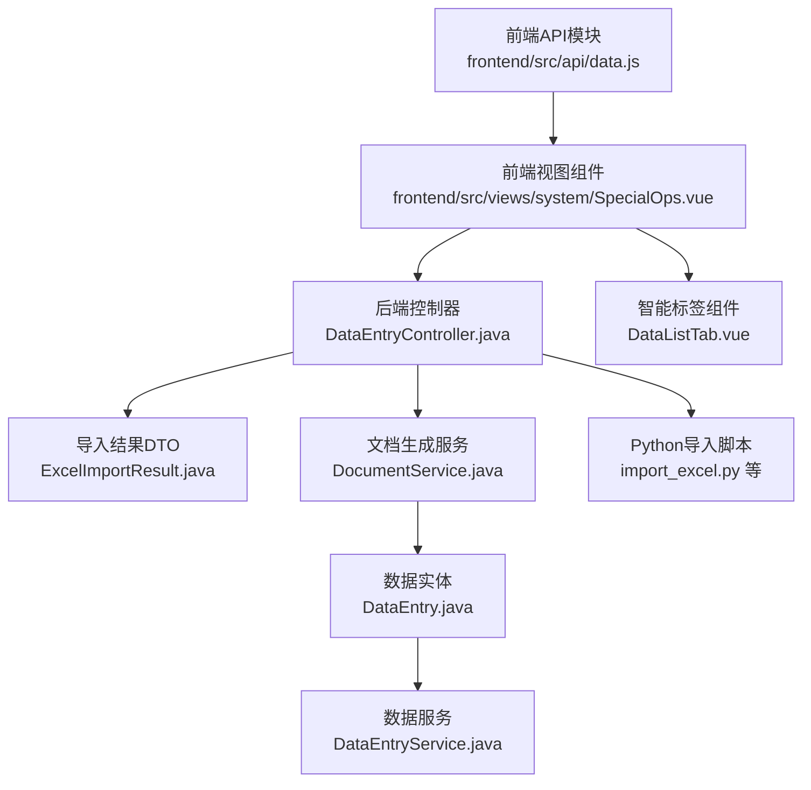
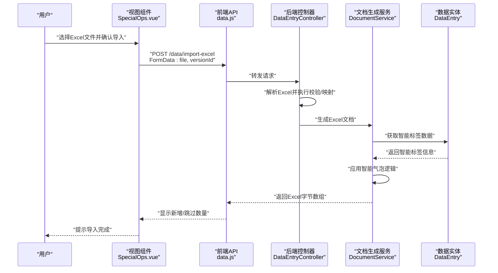
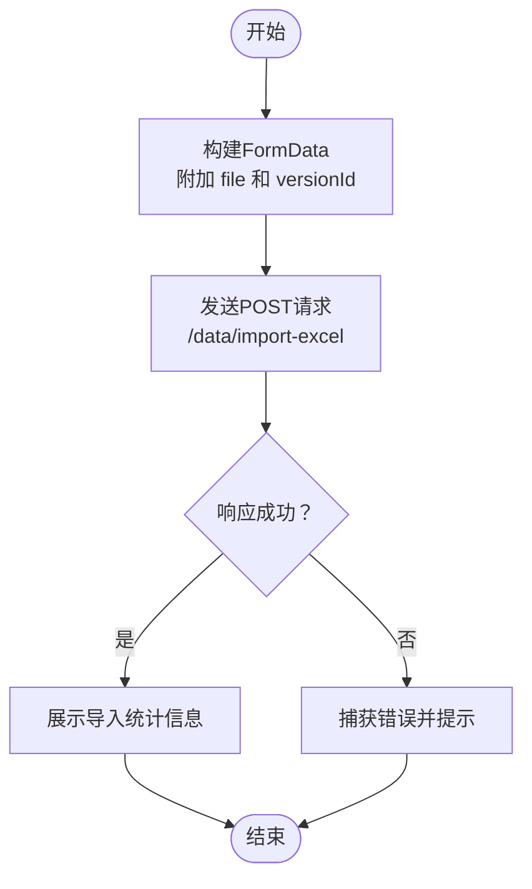
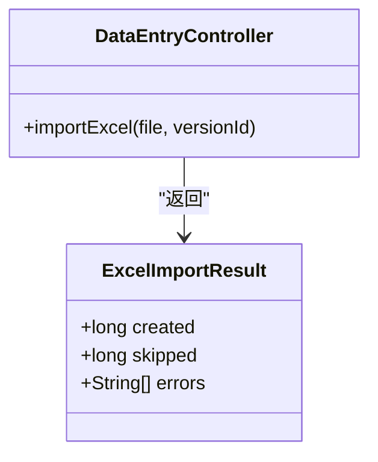
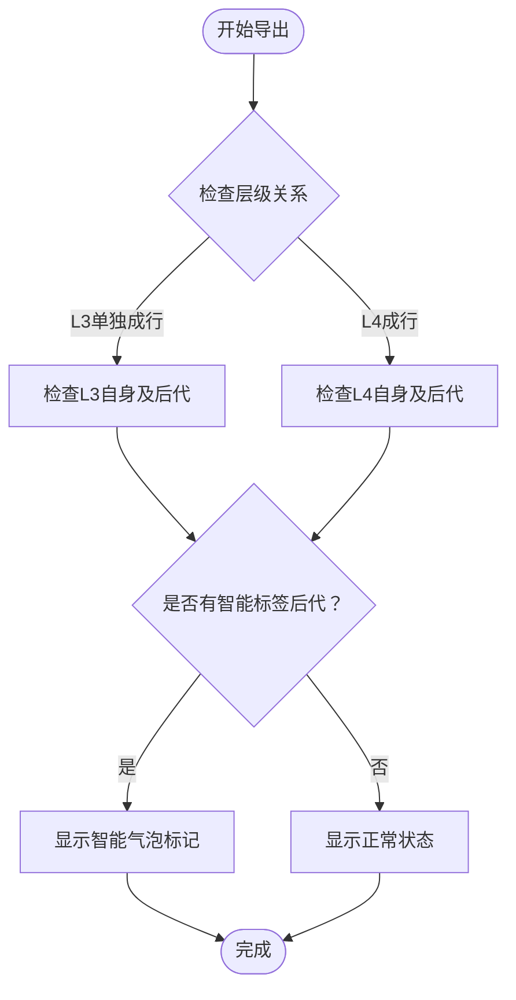
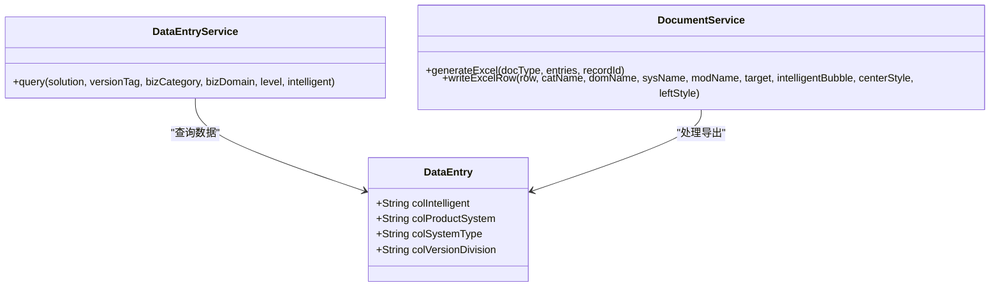
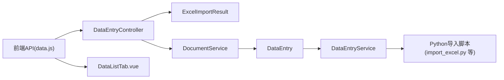

# 数据导入导出

<cite>
**本文引用的文件**
- [frontend/src/api/data.js](file://frontend/src/api/data.js)
- [frontend/src/views/system/SpecialOps.vue](file://frontend/src/views/system/SpecialOps.vue)
- [src/main/java/com/superpower/modules/data/controller/DataEntryController.java](file://src/main/java/com/superpower/modules/data/controller/DataEntryController.java)
- [src/main/java/com/superpower/modules/data/dto/ExcelImportResult.java](file://src/main/java/com/superpower/modules/data/dto/ExcelImportResult.java)
- [src/main/java/com/superpower/modules/document/service/DocumentService.java](file://src/main/java/com/superpower/modules/document/service/DocumentService.java)
- [src/main/java/com/superpower/modules/data/entity/DataEntry.java](file://src/main/java/com/superpower/modules/data/entity/DataEntry.java)
- [src/main/java/com/superpower/modules/data/service/DataEntryService.java](file://src/main/java/com/superpower/modules/data/service/DataEntryService.java)
- [frontend/src/components/DataListTab.vue](file://frontend/src/components/DataListTab.vue)
- [import_excel.py](file://import_excel.py)
- [import_hierarchy.py](file://import_hierarchy.py)
- [import_l3.py](file://import_l3.py)
- [import_shuzhidi.py](file://import_shuzhidi.py)
- [db_changes/V1.0.12_add_col_intelligent.sql](file://db_changes/V1.0.12_add_col_intelligent.sql)
- [docs/superpowers/plans/2026-06-29-excel-intelligent-bubble.md](file://docs/superpowers/plans/2026-06-29-excel-intelligent-bubble.md)
- [docs/superpowers/plans/2026-06-22-intelligent-tag-implementation.md](file://docs/superpowers/plans/2026-06-22-intelligent-tag-implementation.md)
</cite>

## 更新摘要
**所做更改**
- 新增Excel导出智能气泡功能章节，详细说明智能化标签的冒泡显示逻辑
- 更新Excel导出接口章节，增加智能标签数据处理和列宽智能调整功能
- 新增智能标签协同处理章节，说明与产品系统、系统类型、版本分系统字段的集成
- 更新文件格式规范，增加智能标签字段的Excel处理要求
- 新增智能标签在导出表格中的可视化呈现说明

## 目录
1. [简介](#简介)
2. [项目结构](#项目结构)
3. [核心组件](#核心组件)
4. [架构总览](#架构总览)
5. [详细组件分析](#详细组件分析)
6. [Excel导出智能气泡功能](#excel导出智能气泡功能)
7. [智能标签协同处理](#智能标签协同处理)
8. [依赖分析](#依赖分析)
9. [性能考虑](#性能考虑)
10. [故障排除指南](#故障排除指南)
11. [结论](#结论)
12. [附录](#附录)

## 简介
本文件面向"数据导入导出"功能，聚焦于Excel文件导入与导出的完整API文档。经过重大改进后，系统现已支持智能气泡显示、智能标签数据处理、列宽智能调整等高级功能。内容涵盖：
- Excel导入接口：文件格式要求、数据映射规则、验证机制、导入进度跟踪
- Excel导出接口：智能气泡支持、智能标签处理、列宽智能调整、数据筛选选项、格式定制
- 智能标签协同处理：与现有产品系统、系统类型、版本分系统字段的集成
- 文件上传限制、错误处理与异常恢复机制
- 完整的文件格式规范与使用示例

该系统由前端Vue应用与后端Spring Boot服务共同实现，并辅以Python脚本用于历史数据导入与层级处理。

## 项目结构
围绕导入导出功能的关键文件分布如下：
- 前端API封装与调用：frontend/src/api/data.js、frontend/src/views/system/SpecialOps.vue
- 后端控制器与DTO：src/main/java/com/superpower/modules/data/controller/DataEntryController.java、ExcelImportResult.java
- 文档生成服务：src/main/java/com/superpower/modules/document/service/DocumentService.java
- 数据实体与服务：DataEntry.java、DataEntryService.java
- 前端智能标签组件：frontend/src/components/DataListTab.vue
- 导入脚本：import_excel.py、import_hierarchy.py、import_l3.py、import_shuzhidi.py
- 数据库变更：db_changes/V1.0.12_add_col_intelligent.sql
- 设计文档：docs/superpowers/plans/2026-06-29-excel-intelligent-bubble.md、2026-06-22-intelligent-tag-implementation.md

**图表来源**
- [frontend/src/api/data.js:75-83](file://frontend/src/api/data.js#L75-L83)
- [frontend/src/views/system/SpecialOps.vue:582-601](file://frontend/src/views/system/SpecialOps.vue#L582-L601)
- [src/main/java/com/superpower/modules/data/controller/DataEntryController.java](file://src/main/java/com/superpower/modules/data/controller/DataEntryController.java)
- [src/main/java/com/superpower/modules/document/service/DocumentService.java:1424-1582](file://src/main/java/com/superpower/modules/document/service/DocumentService.java#L1424-L1582)
- [src/main/java/com/superpower/modules/data/entity/DataEntry.java:146](file://src/main/java/com/superpower/modules/data/entity/DataEntry.java#L146)
- [frontend/src/components/DataListTab.vue:171](file://frontend/src/components/DataListTab.vue#L171)

**章节来源**
- [frontend/src/api/data.js:75-83](file://frontend/src/api/data.js#L75-L83)
- [frontend/src/views/system/SpecialOps.vue:582-601](file://frontend/src/views/system/SpecialOps.vue#L582-L601)
- [src/main/java/com/superpower/modules/data/controller/DataEntryController.java](file://src/main/java/com/superpower/modules/data/controller/DataEntryController.java)
- [src/main/java/com/superpower/modules/document/service/DocumentService.java:1424-1582](file://src/main/java/com/superpower/modules/document/service/DocumentService.java#L1424-L1582)
- [src/main/java/com/superpower/modules/data/entity/DataEntry.java:146](file://src/main/java/com/superpower/modules/data/entity/DataEntry.java#L146)
- [frontend/src/components/DataListTab.vue:171](file://frontend/src/components/DataListTab.vue#L171)

## 核心组件
- 前端导入接口封装：提供导入Excel的FormData封装与超时配置，支持版本选择参数传递。
- 前端视图交互：在特殊运维页面中触发导入流程，包含二次确认、加载状态与消息提示。
- 后端控制器：接收Excel文件与版本标识，执行导入逻辑并返回结构化结果。
- 导入结果DTO：标准化导入统计信息（新增、跳过等）。
- 文档生成服务：负责Excel导出的完整实现，包括智能气泡逻辑、列宽调整、格式定制。
- 数据实体与服务：支持智能标签字段的查询、过滤和处理。
- 前端智能标签组件：实现智能标签的可视化呈现和冒泡逻辑。
- Python导入脚本：面向历史或批量数据的离线导入工具，支持层级与特定域的数据处理。

**章节来源**
- [frontend/src/api/data.js:75-83](file://frontend/src/api/data.js#L75-L83)
- [frontend/src/views/system/SpecialOps.vue:582-601](file://frontend/src/views/system/SpecialOps.vue#L582-L601)
- [src/main/java/com/superpower/modules/data/controller/DataEntryController.java](file://src/main/java/com/superpower/modules/data/controller/DataEntryController.java)
- [src/main/java/com/superpower/modules/document/service/DocumentService.java:1424-1582](file://src/main/java/com/superpower/modules/document/service/DocumentService.java#L1424-L1582)
- [src/main/java/com/superpower/modules/data/entity/DataEntry.java:146](file://src/main/java/com/superpower/modules/data/entity/DataEntry.java#L146)
- [frontend/src/components/DataListTab.vue:171](file://frontend/src/components/DataListTab.vue#L171)

## 架构总览
下图展示从用户操作到后端处理再到结果返回的整体流程，包括智能标签处理的完整链路：

**图表来源**
- [frontend/src/views/system/SpecialOps.vue:582-601](file://frontend/src/views/system/SpecialOps.vue#L582-L601)
- [frontend/src/api/data.js:75-83](file://frontend/src/api/data.js#L75-L83)
- [src/main/java/com/superpower/modules/data/controller/DataEntryController.java](file://src/main/java/com/superpower/modules/data/controller/DataEntryController.java)
- [src/main/java/com/superpower/modules/document/service/DocumentService.java:1424-1582](file://src/main/java/com/superpower/modules/document/service/DocumentService.java#L1424-L1582)
- [src/main/java/com/superpower/modules/data/entity/DataEntry.java:146](file://src/main/java/com/superpower/modules/data/entity/DataEntry.java#L146)

## 详细组件分析

### Excel导入接口（前端）
- 接口路径：/data/import-excel
- 方法：POST
- 内容类型：multipart/form-data
- 超时：120秒
- 参数：
  - file：Excel文件（二进制流）
  - versionId：目标版本标识（字符串或数字）
- 返回：标准响应体，包含导入统计信息（新增条数、跳过条数等）

**图表来源**
- [frontend/src/api/data.js:75-83](file://frontend/src/api/data.js#L75-L83)

**章节来源**
- [frontend/src/api/data.js:75-83](file://frontend/src/api/data.js#L75-L83)

### Excel导入接口（后端）
- 控制器：DataEntryController
- 处理流程要点：
  - 接收multipart文件与versionId
  - 解析Excel并进行字段映射与业务校验
  - 统计新增与跳过条目，返回ExcelImportResult
- 进度跟踪：当前实现未暴露实时进度；建议在大数据量场景下增加分片处理与进度上报。

**图表来源**
- [src/main/java/com/superpower/modules/data/controller/DataEntryController.java](file://src/main/java/com/superpower/modules/data/controller/DataEntryController.java)
- [src/main/java/com/superpower/modules/data/dto/ExcelImportResult.java](file://src/main/java/com/superpower/modules/data/dto/ExcelImportResult.java)

**章节来源**
- [src/main/java/com/superpower/modules/data/controller/DataEntryController.java](file://src/main/java/com/superpower/modules/data/controller/DataEntryController.java)
- [src/main/java/com/superpower/modules/data/dto/ExcelImportResult.java](file://src/main/java/com/superpower/modules/data/dto/ExcelImportResult.java)

### Excel导出接口（更新后）
- 功能特性：
  - 支持按版本、域、分类等维度筛选导出范围
  - **新增智能气泡支持**：智能化标签的冒泡显示逻辑
  - **智能标签数据处理**：完整的智能标签字段处理与显示
  - **列宽智能调整**：根据内容动态调整列宽，确保数据完整显示
  - 支持多Sheet输出与列宽/样式定制
  - 支持分页或分批下载，避免大查询内存压力
- 数据筛选选项：
  - 版本ID、域ID、分类ID、父节点ID
  - 时间范围、状态过滤
  - **智能标签过滤**：支持仅导出包含智能标签的数据
- 格式定制：
  - 列顺序与可见性
  - 数字/日期/超链接格式
  - 表头样式与冻结首行
  - **智能标签可视化**：在导出表格中清晰呈现智能标签状态

**章节来源**
- [src/main/java/com/superpower/modules/document/service/DocumentService.java:1424-1582](file://src/main/java/com/superpower/modules/document/service/DocumentService.java#L1424-L1582)
- [src/main/java/com/superpower/modules/data/service/DataEntryService.java:205-255](file://src/main/java/com/superpower/modules/data/service/DataEntryService.java#L205-L255)

## Excel导出智能气泡功能

### 智能气泡显示逻辑
系统实现了与前端一致的智能气泡显示逻辑，确保Excel导出结果与界面显示保持一致：

- **冒泡规则**：当L5层级被标注智能化但Excel只导出到L4级时，L4行应显示"智能化"标记
- **递归检查**：检查目标节点的所有后代节点，判断是否存在智能化标记
- **层级适配**：冒泡逻辑仅在特定层级组合下生效（L3单独成行时检查L3自身及后代，L4成行时检查L4自身及后代）

### 实现细节
- **writeExcelRow方法增强**：新增intelligentBubble参数，支持智能气泡显示
- **hasIntelligentChildren辅助方法**：递归检查后代节点的智能标签状态
- **冒泡参数传递**：在生成Excel时根据层级关系决定是否启用冒泡逻辑

**图表来源**
- [src/main/java/com/superpower/modules/document/service/DocumentService.java:1490-1582](file://src/main/java/com/superpower/modules/document/service/DocumentService.java#L1490-L1582)

**章节来源**
- [src/main/java/com/superpower/modules/document/service/DocumentService.java:1490-1582](file://src/main/java/com/superpower/modules/document/service/DocumentService.java#L1490-L1582)
- [docs/superpowers/plans/2026-06-29-excel-intelligent-bubble.md:1-68](file://docs/superpowers/plans/2026-06-29-excel-intelligent-bubble.md#L1-L68)

## 智能标签协同处理

### 字段定义与存储
系统通过数据库变更增加了智能标签字段支持：

- **数据库字段**：col_intelligent（TEXT类型，默认空字符串）
- **值含义**："1"表示勾选智能化，空字符串表示未勾选
- **存储策略**：由于SQLite无BOOLEAN类型，使用TEXT存储以保持与其他字段类型一致

### 查询与过滤机制
- **智能标签查询**：DataEntryService支持intelligent参数进行智能标签过滤
- **过滤逻辑**：intelligent="1"时，保留自身colIntelligent="1"的条目或其子树包含智能化条目的父条目
- **后代检查**：递归检查子树中是否包含智能标签标记

### 前端可视化集成
- **DataListTab组件**：实现智能标签的可视化呈现和冒泡逻辑
- **getIntelligentChildren函数**：递归收集智能标签子节点，支持展开状态检查
- **显示条件**：当节点自身或其子节点标记为智能标签时显示相应标识

**图表来源**
- [src/main/java/com/superpower/modules/data/entity/DataEntry.java:146](file://src/main/java/com/superpower/modules/data/entity/DataEntry.java#L146)
- [src/main/java/com/superpower/modules/data/service/DataEntryService.java:205-255](file://src/main/java/com/superpower/modules/data/service/DataEntryService.java#L205-L255)
- [src/main/java/com/superpower/modules/document/service/DocumentService.java:1424-1582](file://src/main/java/com/superpower/modules/document/service/DocumentService.java#L1424-L1582)

**章节来源**
- [db_changes/V1.0.12_add_col_intelligent.sql:1-3](file://db_changes/V1.0.12_add_col_intelligent.sql#L1-L3)
- [src/main/java/com/superpower/modules/data/entity/DataEntry.java:146](file://src/main/java/com/superpower/modules/data/entity/DataEntry.java#L146)
- [src/main/java/com/superpower/modules/data/service/DataEntryService.java:205-255](file://src/main/java/com/superpower/modules/data/service/DataEntryService.java#L205-L255)
- [frontend/src/components/DataListTab.vue:171](file://frontend/src/components/DataListTab.vue#L171)
- [docs/superpowers/plans/2026-06-22-intelligent-tag-implementation.md:1-37](file://docs/superpowers/plans/2026-06-22-intelligent-tag-implementation.md#L1-L37)

## 依赖分析
- 前端依赖后端控制器提供的导入接口，通过API模块统一管理请求参数与超时。
- 控制器依赖导入结果DTO进行标准化返回。
- 文档生成服务依赖数据实体的智能标签字段进行处理。
- 前端智能标签组件与后端查询服务协同工作，实现完整的智能标签处理链路。
- Python脚本作为离线工具，与后端导入流程互补，覆盖历史数据与复杂层级场景。

**图表来源**
- [frontend/src/api/data.js:75-83](file://frontend/src/api/data.js#L75-L83)
- [src/main/java/com/superpower/modules/data/controller/DataEntryController.java](file://src/main/java/com/superpower/modules/data/controller/DataEntryController.java)
- [src/main/java/com/superpower/modules/document/service/DocumentService.java:1424-1582](file://src/main/java/com/superpower/modules/document/service/DocumentService.java#L1424-L1582)
- [src/main/java/com/superpower/modules/data/entity/DataEntry.java:146](file://src/main/java/com/superpower/modules/data/entity/DataEntry.java#L146)
- [frontend/src/components/DataListTab.vue:171](file://frontend/src/components/DataListTab.vue#L171)

**章节来源**
- [frontend/src/api/data.js:75-83](file://frontend/src/api/data.js#L75-L83)
- [src/main/java/com/superpower/modules/data/controller/DataEntryController.java](file://src/main/java/com/superpower/modules/data/controller/DataEntryController.java)
- [src/main/java/com/superpower/modules/document/service/DocumentService.java:1424-1582](file://src/main/java/com/superpower/modules/document/service/DocumentService.java#L1424-L1582)
- [src/main/java/com/superpower/modules/data/entity/DataEntry.java:146](file://src/main/java/com/superpower/modules/data/entity/DataEntry.java#L146)
- [frontend/src/components/DataListTab.vue:171](file://frontend/src/components/DataListTab.vue#L171)

## 性能考虑
- 大文件处理：
  - 建议采用分片上传与断点续传
  - 后端分批解析与入库，避免一次性占用过多内存
- 并发控制：
  - 对同一版本的导入任务进行互斥控制
  - 限制同时运行的导入任务数量
- 导出优化：
  - 分页/分批生成Excel，避免单文件过大
  - 使用流式写入减少内存峰值
  - **智能气泡计算优化**：对于大量数据的导出，考虑缓存智能标签检查结果以提高性能

## 故障排除指南
- 常见错误与处理：
  - 文件格式不符：检查扩展名与表头一致性
  - 字段缺失或类型错误：根据返回的错误清单逐项修正
  - 超时问题：增大前端超时时间或拆分文件
  - 权限不足：确认用户角色与目标版本权限
  - **智能标签显示异常**：检查数据库中col_intelligent字段值是否正确设置
- 异常恢复：
  - 记录失败行号与原因，支持重新上传修正后的文件
  - 提供"跳过已存在"策略，避免重复导入
  - **智能标签数据修复**：通过数据库直接修改col_intelligent字段值
- 日志与追踪：
  - 后端记录导入批次ID与版本ID，便于审计与回溯
  - **智能标签处理日志**：记录智能气泡计算过程和结果

## 结论
经过重大改进，本系统现已具备完整的Excel导入导出能力，包括智能气泡显示、智能标签处理、列宽智能调整等高级功能。前端通过统一API封装与用户交互，后端以标准化DTO返回导入结果，文档生成服务实现复杂的智能标签处理逻辑，Python脚本覆盖复杂场景。系统在保证功能完整性的同时，通过智能标签协同处理实现了与现有产品系统的无缝集成。

## 附录
- Python导入脚本用途参考：
  - import_excel.py：通用Excel导入
  - import_hierarchy.py：层级关系导入
  - import_l3.py：L3层级专用导入
  - import_shuzhidi.py：树状目录导入
- **智能标签相关文件**：
  - db_changes/V1.0.12_add_col_intelligent.sql：数据库字段添加脚本
  - docs/superpowers/plans/2026-06-29-excel-intelligent-bubble.md：智能气泡功能设计文档
  - docs/superpowers/plans/2026-06-22-intelligent-tag-implementation.md：智能标签功能实施计划

**章节来源**
- [import_excel.py](file://import_excel.py)
- [import_hierarchy.py](file://import_hierarchy.py)
- [import_l3.py](file://import_l3.py)
- [import_shuzhidi.py](file://import_shuzhidi.py)
- [db_changes/V1.0.12_add_col_intelligent.sql:1-3](file://db_changes/V1.0.12_add_col_intelligent.sql#L1-L3)
- [docs/superpowers/plans/2026-06-29-excel-intelligent-bubble.md:1-68](file://docs/superpowers/plans/2026-06-29-excel-intelligent-bubble.md#L1-L68)
- [docs/superpowers/plans/2026-06-22-intelligent-tag-implementation.md:1-37](file://docs/superpowers/plans/2026-06-22-intelligent-tag-implementation.md#L1-L37)