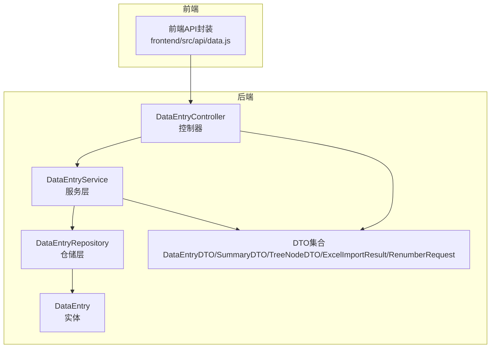
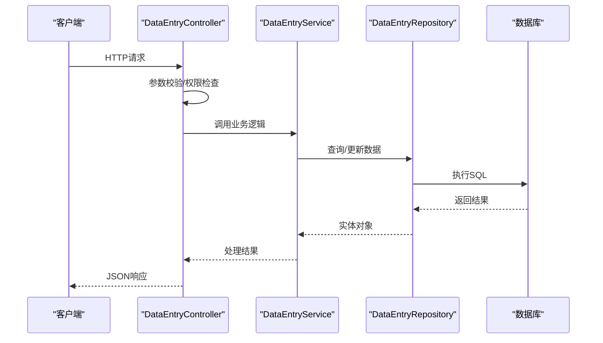
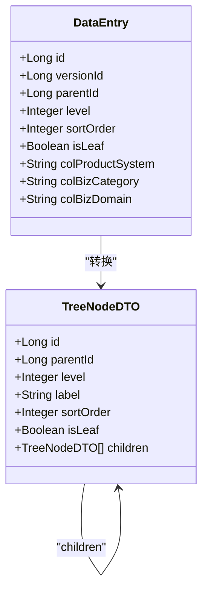
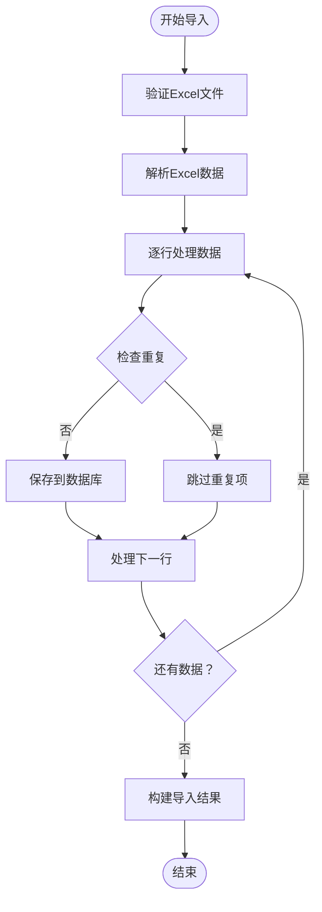
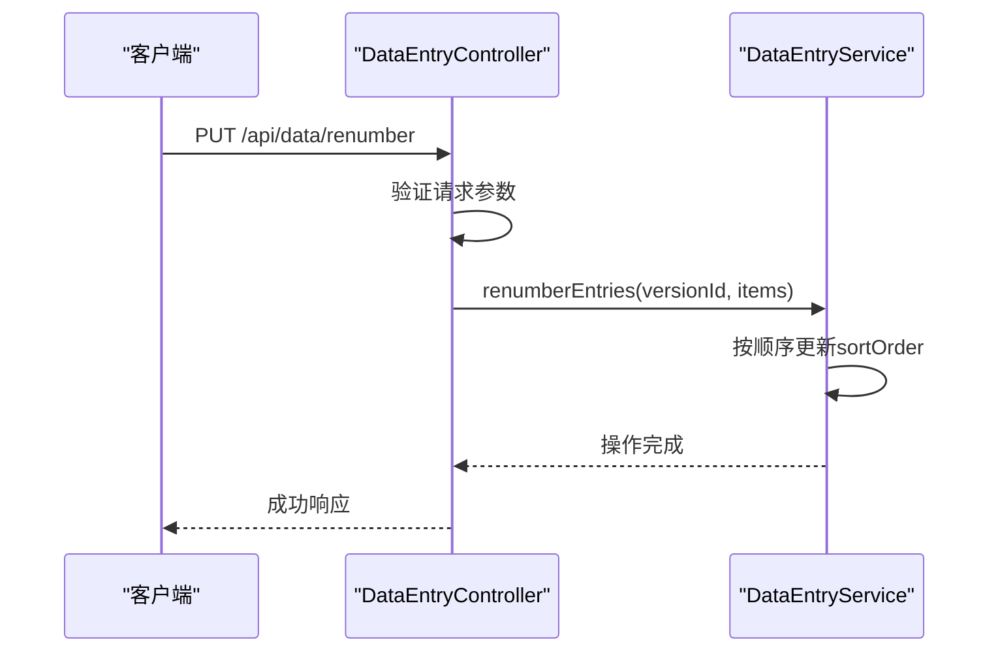
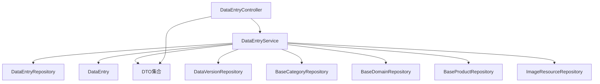

# 数据操作API

<cite>
**本文档引用的文件**
- [DataEntryController.java](file://src/main/java/com/superpower/modules/data/controller/DataEntryController.java)
- [DataEntryService.java](file://src/main/java/com/superpower/modules/data/service/DataEntryService.java)
- [DataEntry.java](file://src/main/java/com/superpower/modules/data/entity/DataEntry.java)
- [DataEntryDTO.java](file://src/main/java/com/superpower/modules/data/dto/DataEntryDTO.java)
- [DataEntrySummaryDTO.java](file://src/main/java/com/superpower/modules/data/dto/DataEntrySummaryDTO.java)
- [TreeNodeDTO.java](file://src/main/java/com/superpower/modules/data/dto/TreeNodeDTO.java)
- [ExcelImportResult.java](file://src/main/java/com/superpower/modules/data/dto/ExcelImportResult.java)
- [RenumberRequest.java](file://src/main/java/com/superpower/modules/data/dto/RenumberRequest.java)
- [DataEntryRepository.java](file://src/main/java/com/superpower/modules/data/repository/DataEntryRepository.java)
- [PageResult.java](file://src/main/java/com/superpower/common/PageResult.java)
- [data.js](file://frontend/src/api/data.js)
</cite>

## 目录
1. [简介](#简介)
2. [项目结构](#项目结构)
3. [核心组件](#核心组件)
4. [架构概览](#架构概览)
5. [详细组件分析](#详细组件分析)
6. [依赖分析](#依赖分析)
7. [性能考虑](#性能考虑)
8. [故障排除指南](#故障排除指南)
9. [结论](#结论)

## 简介
本文件为数据操作模块的详细API接口文档，涵盖核心数据实体的完整CRUD操作、批量操作、数据导入导出、树形节点操作、数据重编号、数据统计汇总以及Excel导入、Word导出等高级功能。文档提供了完整的请求参数格式、响应数据结构、分页查询机制和数据验证规则，并通过图示展示关键流程。

## 项目结构
数据操作模块位于后端Java Spring Boot项目中，采用经典的三层架构：
- 控制器层（Controller）：处理HTTP请求，调用服务层逻辑
- 服务层（Service）：实现业务逻辑，协调仓储层和外部服务
- 仓储层（Repository）：访问数据库，执行数据持久化操作
- 实体与DTO：定义数据模型和传输对象
- 前端API封装：提供统一的HTTP请求封装

**图表来源**
- [DataEntryController.java:27-412](file://src/main/java/com/superpower/modules/data/controller/DataEntryController.java#L27-L412)
- [DataEntryService.java:44-74](file://src/main/java/com/superpower/modules/data/service/DataEntryService.java#L44-L74)
- [DataEntryRepository.java:11-151](file://src/main/java/com/superpower/modules/data/repository/DataEntryRepository.java#L11-L151)
- [DataEntry.java:12-266](file://src/main/java/com/superpower/modules/data/entity/DataEntry.java#L12-L266)
- [DataEntryDTO.java:6-64](file://src/main/java/com/superpower/modules/data/dto/DataEntryDTO.java#L6-L64)
- [data.js:1-128](file://frontend/src/api/data.js#L1-L128)

**章节来源**
- [DataEntryController.java:27-412](file://src/main/java/com/superpower/modules/data/controller/DataEntryController.java#L27-L412)
- [DataEntryService.java:44-74](file://src/main/java/com/superpower/modules/data/service/DataEntryService.java#L44-L74)
- [DataEntryRepository.java:11-151](file://src/main/java/com/superpower/modules/data/repository/DataEntryRepository.java#L11-L151)
- [data.js:1-128](file://frontend/src/api/data.js#L1-L128)

## 核心组件
- DataEntryController：RESTful API入口，负责接收请求、参数校验、权限检查和调用服务层
- DataEntryService：核心业务逻辑实现，包括树形结构构建、查询过滤、批量操作、导入导出等
- DataEntryRepository：JPA仓储接口，提供数据访问方法
- DataEntry实体：数据库表映射，包含丰富的字段用于产品清单管理
- DTO集合：用于请求和响应的数据传输对象，确保前后端数据契约清晰

**章节来源**
- [DataEntryController.java:27-412](file://src/main/java/com/superpower/modules/data/controller/DataEntryController.java#L27-L412)
- [DataEntryService.java:44-74](file://src/main/java/com/superpower/modules/data/service/DataEntryService.java#L44-L74)
- [DataEntryRepository.java:11-151](file://src/main/java/com/superpower/modules/data/repository/DataEntryRepository.java#L11-L151)
- [DataEntry.java:12-266](file://src/main/java/com/superpower/modules/data/entity/DataEntry.java#L12-L266)
- [DataEntryDTO.java:6-64](file://src/main/java/com/superpower/modules/data/dto/DataEntryDTO.java#L6-L64)

## 架构概览
数据操作API采用标准的MVC架构模式，结合Spring Security进行权限控制，使用JPA进行数据持久化，支持事务管理和批量操作。

**图表来源**
- [DataEntryController.java:133-140](file://src/main/java/com/superpower/modules/data/controller/DataEntryController.java#L133-L140)
- [DataEntryService.java:287-316](file://src/main/java/com/superpower/modules/data/service/DataEntryService.java#L287-L316)
- [DataEntryRepository.java:14-151](file://src/main/java/com/superpower/modules/data/repository/DataEntryRepository.java#L14-L151)

## 详细组件分析

### CRUD基础操作

#### 获取单个数据条目
- 请求方式：GET
- 路径：`/api/data/{id}`
- 认证：需要登录
- 响应：DataEntry实体对象
- 特殊说明：自动同步图片卡片文件名

#### 创建数据条目
- 请求方式：POST
- 路径：`/api/data`
- 请求体：DataEntryDTO
- 认证：需要登录
- 权限：版本必须处于草稿状态
- 响应：创建后的DataEntry对象
- 特殊处理：自动设置排序号、更新父节点叶子状态

#### 更新数据条目
- 请求方式：PUT
- 路径：`/api/data/{id}`
- 请求体：DataEntryDTO
- 认证：需要登录
- 权限：版本必须处于草稿状态
- 响应：更新后的DataEntry对象
- 特殊处理：级联标签更新、图片卡片文件名同步

#### 删除数据条目
- 请求方式：DELETE
- 路径：`/api/data/{id}`
- 认证：需要登录
- 权限：版本必须处于草稿状态
- 特殊处理：递归删除子节点

**章节来源**
- [DataEntryController.java:81-105](file://src/main/java/com/superpower/modules/data/controller/DataEntryController.java#L81-L105)
- [DataEntryController.java:133-140](file://src/main/java/com/superpower/modules/data/controller/DataEntryController.java#L133-L140)
- [DataEntryController.java:153-166](file://src/main/java/com/superpower/modules/data/controller/DataEntryController.java#L153-L166)
- [DataEntryController.java:292-306](file://src/main/java/com/superpower/modules/data/controller/DataEntryController.java#L292-L306)
- [DataEntryService.java:197-202](file://src/main/java/com/superpower/modules/data/service/DataEntryService.java#L197-L202)
- [DataEntryService.java:287-334](file://src/main/java/com/superpower/modules/data/service/DataEntryService.java#L287-L334)

### 树形节点操作

#### 获取树形结构
- 请求方式：GET
- 路径：`/api/data/tree/{versionId}`
- 查询参数：
  - name：名称过滤
  - status：状态数组过滤
  - productManager：产品经理过滤
  - solution：解决方案过滤
  - versionTag：版本标签过滤
- 响应：TreeNodeDTO列表
- 特殊处理：按业务分类和域排序

#### 获取子节点
- 请求方式：GET
- 路径：`/api/data/children/{versionId}/{parentId}`
- 查询参数：同树形结构接口
- 响应：DataEntry列表

#### 获取域树
- 请求方式：GET
- 路径：`/api/data/domain-tree/{versionId}`
- 查询参数：domainId, categoryId
- 响应：TreeNodeDTO列表

#### 获取子树
- 请求方式：GET
- 路径：`/api/data/sub-tree/{versionId}/{parentId}`
- 响应：简化版TreeNodeDTO列表

**图表来源**
- [TreeNodeDTO.java:7-15](file://src/main/java/com/superpower/modules/data/dto/TreeNodeDTO.java#L7-L15)
- [DataEntry.java:15-81](file://src/main/java/com/superpower/modules/data/entity/DataEntry.java#L15-L81)

**章节来源**
- [DataEntryController.java:58-79](file://src/main/java/com/superpower/modules/data/controller/DataEntryController.java#L58-L79)
- [DataEntryController.java:317-330](file://src/main/java/com/superpower/modules/data/controller/DataEntryController.java#L317-L330)
- [DataEntryService.java:85-138](file://src/main/java/com/superpower/modules/data/service/DataEntryService.java#L85-L138)
- [DataEntryService.java:148-195](file://src/main/java/com/superpower/modules/data/service/DataEntryService.java#L148-L195)

### 批量操作

#### 批量删除
- 请求方式：POST
- 路径：`/api/data/batch-delete`
- 查询参数：versionId
- 请求体：ID数组
- 响应：无内容
- 特殊处理：递归收集所有子节点进行删除

#### 批量修改分类/域
- 请求方式：PUT
- 路径：`/api/data/batch-category`
- 请求体：
  - versionId：版本ID
  - entryIds：条目ID数组
  - categoryId：业务分类ID
  - domainId：业务域ID
  - productId：产品ID
  - parentId：父节点ID
- 响应：影响的条目数量

#### 固定层级结构
- 请求方式：PUT
- 路径：`/api/data/fix-hierarchy/{versionId}`
- 响应：修复结果映射
- 特殊处理：自动修复层级不正确的问题

**章节来源**
- [DataEntryController.java:308-315](file://src/main/java/com/superpower/modules/data/controller/DataEntryController.java#L308-L315)
- [DataEntryController.java:332-344](file://src/main/java/com/superpower/modules/data/controller/DataEntryController.java#L332-L344)
- [DataEntryController.java:347-354](file://src/main/java/com/superpower/modules/data/controller/DataEntryController.java#L347-L354)
- [DataEntryService.java:511-537](file://src/main/java/com/superpower/modules/data/service/DataEntryService.java#L511-L537)
- [DataEntryService.java:539-640](file://src/main/java/com/superpower/modules/data/service/DataEntryService.java#L539-L640)

### 数据导入导出

#### Excel导入
- 请求方式：POST
- 路径：`/api/data/import-excel`
- 表单参数：
  - file：Excel文件
  - versionId：版本ID
- 响应：ExcelImportResult
- 特殊处理：支持重复数据检测、错误记录

#### Word导出
- 请求方式：GET
- 路径：`/api/data/{id}/preview-download`
- 查询参数：
  - mode：模式（默认feature）
  - includeImages：是否包含图片（默认true）
- 响应：application/octet-stream
- 特殊处理：生成Word文档，支持不同模式

**图表来源**
- [DataEntryController.java:142-151](file://src/main/java/com/superpower/modules/data/controller/DataEntryController.java#L142-L151)
- [DataEntryService.java:287-316](file://src/main/java/com/superpower/modules/data/service/DataEntryService.java#L287-L316)

**章节来源**
- [DataEntryController.java:142-151](file://src/main/java/com/superpower/modules/data/controller/DataEntryController.java#L142-L151)
- [ExcelImportResult.java:8-14](file://src/main/java/com/superpower/modules/data/dto/ExcelImportResult.java#L8-L14)

### 数据重编号

#### 重编号接口
- 请求方式：PUT
- 路径：`/api/data/renumber`
- 请求体：RenumberRequest
- 响应：无内容
- 特殊处理：按指定顺序重新排列条目

**图表来源**
- [DataEntryController.java:356-371](file://src/main/java/com/superpower/modules/data/controller/DataEntryController.java#L356-L371)
- [RenumberRequest.java:7-9](file://src/main/java/com/superpower/modules/data/dto/RenumberRequest.java#L7-L9)

**章节来源**
- [DataEntryController.java:356-371](file://src/main/java/com/superpower/modules/data/controller/DataEntryController.java#L356-L371)
- [RenumberRequest.java:7-9](file://src/main/java/com/superpower/modules/data/dto/RenumberRequest.java#L7-L9)

### 数据统计汇总

#### 查询接口
- 请求方式：GET
- 路径：`/api/data/query/{versionId}`
- 查询参数：
  - customTabId：自定义标签ID
  - name：名称过滤
  - status：状态数组过滤
  - productManager：产品经理过滤
  - solution：解决方案过滤
  - versionTag：版本标签过滤
  - bizCategory：业务分类
  - bizDomain：业务域
  - level：层级过滤
  - intelligent：智能化过滤（1表示启用）
- 响应：DataEntrySummaryDTO列表

**章节来源**
- [DataEntryController.java:115-131](file://src/main/java/com/superpower/modules/data/controller/DataEntryController.java#L115-L131)
- [DataEntryService.java:204-240](file://src/main/java/com/superpower/modules/data/service/DataEntryService.java#L204-L240)
- [DataEntrySummaryDTO.java:65-121](file://src/main/java/com/superpower/modules/data/dto/DataEntrySummaryDTO.java#L65-L121)

### 文件操作接口

#### 预览生成
- 请求方式：GET
- 路径：`/api/data/{id}/preview`
- 查询参数：mode（默认feature）
- 响应：text/html

#### 批量预览
- 请求方式：GET
- 路径：`/api/data/preview-batch`
- 查询参数：entryIds（逗号分隔）、mode
- 响应：text/html

**章节来源**
- [DataEntryController.java:86-113](file://src/main/java/com/superpower/modules/data/controller/DataEntryController.java#L86-L113)

### 排序和层级操作

#### 批量排序
- 请求方式：PUT
- 路径：`/api/data/sort`
- 请求体：排序列表
- 响应：无内容

#### 全量重排序
- 请求方式：PUT
- 路径：`/api/data/reorder/{versionId}`
- 响应：无内容

#### 去重操作
- 请求方式：DELETE
- 路径：`/api/data/dedup/{versionId}` 和 `/api/data/dedup-deep/{versionId}`
- 响应：删除数量

#### 层级升降级
- 请求方式：PUT
- 路径：`/api/data/{id}/level-up` 和 `/api/data/{id}/level-down`
- 响应：无内容

#### 上下移动
- 请求方式：PUT
- 路径：`/api/data/{id}/move-up` 和 `/api/data/{id}/move-down`
- 响应：无内容

#### 移动操作
- 请求方式：PUT
- 路径：`/api/data/{id}/move-to-parent` 和 `/api/data/{id}/move-to-sibling`
- 请求体：目标ID
- 响应：无内容

**章节来源**
- [DataEntryController.java:168-190](file://src/main/java/com/superpower/modules/data/controller/DataEntryController.java#L168-L190)
- [DataEntryController.java:192-208](file://src/main/java/com/superpower/modules/data/controller/DataEntryController.java#L192-L208)
- [DataEntryController.java:210-240](file://src/main/java/com/superpower/modules/data/controller/DataEntryController.java#L210-L240)
- [DataEntryController.java:242-290](file://src/main/java/com/superpower/modules/data/controller/DataEntryController.java#L242-L290)

### 复制和移动操作

#### 复制条目
- 请求方式：POST
- 路径：`/api/data/entries/copy`
- 请求体：
  - sourceIds：源ID数组
  - targetId：目标ID
  - mode：模式（child/下方）
  - customTabId：自定义标签ID
- 响应：无内容

#### 移动条目
- 请求方式：PUT
- 路径：`/api/data/entries/move`
- 请求体：同复制接口
- 响应：无内容

**章节来源**
- [DataEntryController.java:373-391](file://src/main/java/com/superpower/modules/data/controller/DataEntryController.java#L373-L391)
- [DataEntryController.java:393-411](file://src/main/java/com/superpower/modules/data/controller/DataEntryController.java#L393-L411)

## 依赖分析

**图表来源**
- [DataEntryController.java:31-45](file://src/main/java/com/superpower/modules/data/controller/DataEntryController.java#L31-L45)
- [DataEntryService.java:47-74](file://src/main/java/com/superpower/modules/data/service/DataEntryService.java#L47-L74)

### 组件耦合度
- 控制器层与服务层：松耦合，通过接口调用
- 服务层与仓储层：中等耦合，使用JPA仓库接口
- 实体与DTO：弱耦合，通过映射方法转换
- 外部依赖：Spring Security、JPA、Apache POI

**章节来源**
- [DataEntryService.java:47-74](file://src/main/java/com/superpower/modules/data/service/DataEntryService.java#L47-L74)

## 性能考虑
- 数据库索引：建议在version_id、parent_id、level等常用查询字段建立索引
- 分页查询：对于大量数据的查询，建议使用分页机制
- 批量操作：批量删除和更新使用JPA的批量操作以提高性能
- 缓存策略：对于频繁访问的配置信息（如业务分类、域）可考虑缓存
- 图片资源：图片卡片文件名同步避免了重复查询，但需注意正则表达式的性能

## 故障排除指南

### 常见错误及解决方案
- 版本状态错误：已发版版本不允许修改，需切换到草稿状态
- 权限不足：需要相应角色权限才能执行某些操作
- 数据不存在：操作前需确认数据ID的有效性
- Excel导入失败：检查文件格式和必填字段

### 日志记录
系统会自动记录重要操作的日志，包括：
- 创建、更新、删除操作
- 导入、导出操作
- 排序、重编号操作
- 复制、移动操作

**章节来源**
- [DataEntryController.java:47-51](file://src/main/java/com/superpower/modules/data/controller/DataEntryController.java#L47-L51)
- [DataEntryService.java:650-656](file://src/main/java/com/superpower/modules/data/service/DataEntryService.java#L650-L656)

## 结论
数据操作API提供了完整的产品清单管理能力，包括基础CRUD、树形结构管理、批量操作、数据导入导出、重编号和复制移动等高级功能。通过清晰的DTO设计和严格的权限控制，确保了系统的安全性和易用性。建议在生产环境中配合适当的缓存策略和数据库优化措施，以获得更好的性能表现。