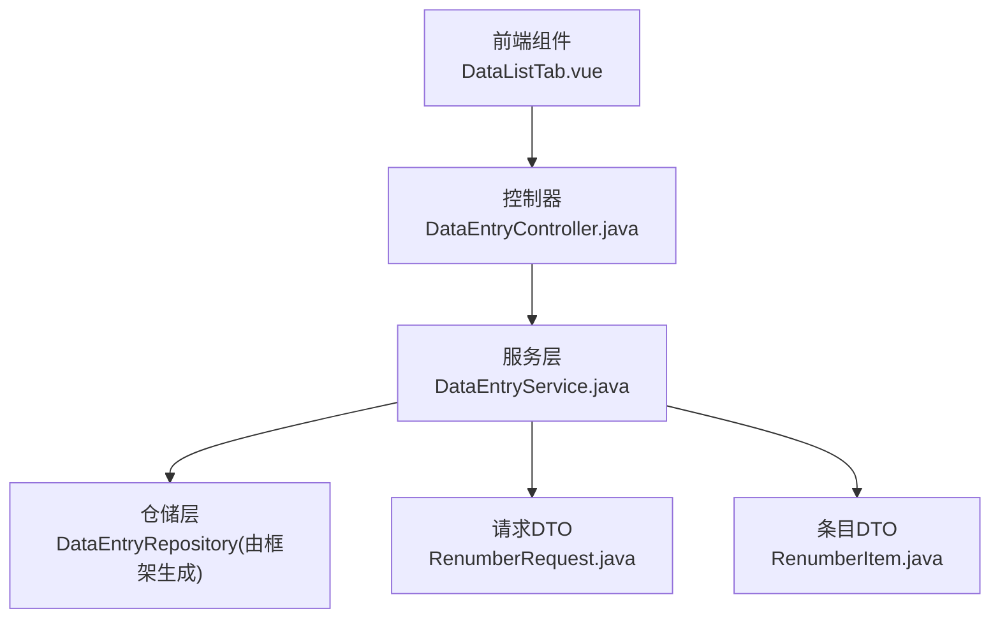
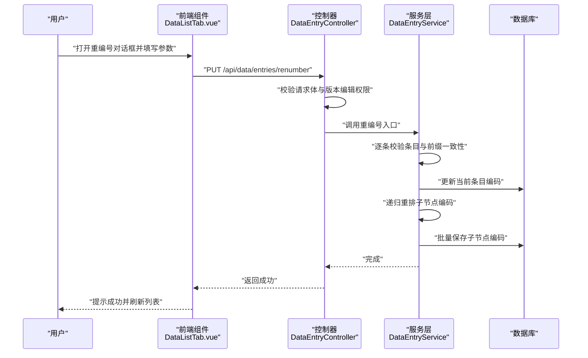
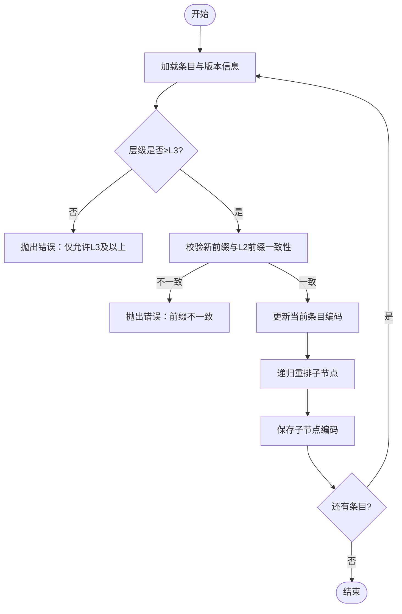
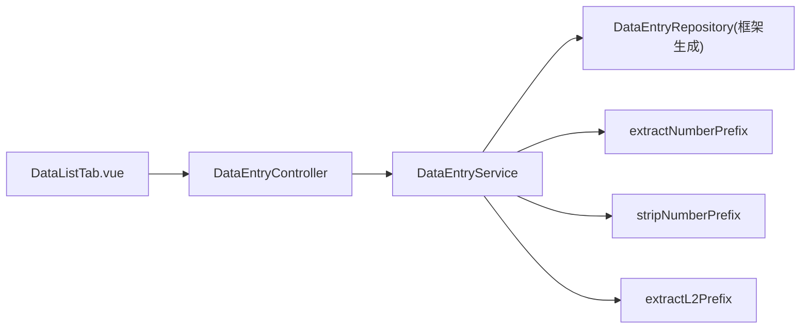

# 数据重编号

<cite>
**本文引用的文件**
- [DataEntryController.java](file://src/main/java/com/superpower/modules/data/controller/DataEntryController.java)
- [DataEntryService.java](file://src/main/java/com/superpower/modules/data/service/DataEntryService.java)
- [RenumberRequest.java](file://src/main/java/com/superpower/modules/data/dto/RenumberRequest.java)
- [RenumberItem.java](file://src/main/java/com/superpower/modules/data/dto/RenumberItem.java)
- [DataListTab.vue](file://frontend/src/components/DataListTab.vue)
</cite>

## 目录
1. [简介](#简介)
2. [项目结构](#项目结构)
3. [核心组件](#核心组件)
4. [架构总览](#架构总览)
5. [详细组件分析](#详细组件分析)
6. [依赖分析](#依赖分析)
7. [性能考虑](#性能考虑)
8. [故障排除指南](#故障排除指南)
9. [结论](#结论)
10. [附录](#附录)

## 简介
本文件为“数据重编号”功能的详细API文档，覆盖接口工作原理、算法实现、业务规则、数据一致性与回滚机制、错误处理策略，并提供最佳实践与性能建议。该功能允许用户对指定条目（通常为产品层级L3及以上）进行统一的编码重排，同时递归更新其所有子节点的编码，确保层级编码的连续性与规范性。

## 项目结构
- 后端采用Spring Boot，控制器位于模块data的controller包，服务层位于service包，数据传输对象位于dto包。
- 前端Vue组件负责收集用户输入、校验并调用后端接口。

图表来源
- [DataEntryController.java:356-371](file://src/main/java/com/superpower/modules/data/controller/DataEntryController.java#L356-L371)
- [DataEntryService.java:2778-2831](file://src/main/java/com/superpower/modules/data/service/DataEntryService.java#L2778-L2831)
- [RenumberRequest.java:1-10](file://src/main/java/com/superpower/modules/data/dto/RenumberRequest.java#L1-L10)
- [RenumberItem.java:1-11](file://src/main/java/com/superpower/modules/data/dto/RenumberItem.java#L1-L11)

章节来源
- [DataEntryController.java:356-371](file://src/main/java/com/superpower/modules/data/controller/DataEntryController.java#L356-L371)
- [DataEntryService.java:2778-2831](file://src/main/java/com/superpower/modules/data/service/DataEntryService.java#L2778-L2831)
- [RenumberRequest.java:1-10](file://src/main/java/com/superpower/modules/data/dto/RenumberRequest.java#L1-L10)
- [RenumberItem.java:1-11](file://src/main/java/com/superpower/modules/data/dto/RenumberItem.java#L1-L11)

## 核心组件
- 控制器接口：提供REST端点用于接收重编号请求并执行权限校验与日志记录。
- 服务层算法：负责版本编辑权限校验、条目合法性校验、前缀一致性校验、编码更新与递归重排。
- DTO模型：封装请求体与单个条目的重编号参数。
- 前端组件：负责选择L3条目、提取与校验前缀、发起重编号请求并提示结果。

章节来源
- [DataEntryController.java:356-371](file://src/main/java/com/superpower/modules/data/controller/DataEntryController.java#L356-L371)
- [DataEntryService.java:2778-2831](file://src/main/java/com/superpower/modules/data/service/DataEntryService.java#L2778-L2831)
- [RenumberRequest.java:1-10](file://src/main/java/com/superpower/modules/data/dto/RenumberRequest.java#L1-L10)
- [RenumberItem.java:1-11](file://src/main/java/com/superpower/modules/data/dto/RenumberItem.java#L1-L11)
- [DataListTab.vue:2477-2542](file://frontend/src/components/DataListTab.vue#L2477-L2542)

## 架构总览
重编号流程从前端发起，经控制器进入服务层，服务层执行业务规则与递归重排，最终持久化到数据库。

图表来源
- [DataEntryController.java:356-371](file://src/main/java/com/superpower/modules/data/controller/DataEntryController.java#L356-L371)
- [DataEntryService.java:2778-2831](file://src/main/java/com/superpower/modules/data/service/DataEntryService.java#L2778-L2831)
- [DataListTab.vue:2508-2542](file://frontend/src/components/DataListTab.vue#L2508-L2542)

## 详细组件分析

### 接口定义与请求体
- 端点：PUT /api/data/entries/renumber
- 请求体：包含若干重编号条目，每个条目包含条目ID、新前缀、新名称。
- 响应：成功返回空结果，失败返回错误信息。

章节来源
- [DataEntryController.java:356-371](file://src/main/java/com/superpower/modules/data/controller/DataEntryController.java#L356-L371)
- [RenumberRequest.java:1-10](file://src/main/java/com/superpower/modules/data/dto/RenumberRequest.java#L1-L10)
- [RenumberItem.java:1-11](file://src/main/java/com/superpower/modules/data/dto/RenumberItem.java#L1-L11)

### 业务规则与数据结构
- 可重编号层级：仅产品层级L3及以上条目允许重编号。
- 版本编辑权限：仅草稿版本可修改；控制器与服务层均进行权限校验。
- 前缀一致性：新编码前缀必须与所属L2域的前两段一致，否则拒绝。
- 名称处理：新名称为空时保留原名称的非数字前缀部分；编码格式为“前缀 空格 名称”。

章节来源
- [DataEntryController.java:356-371](file://src/main/java/com/superpower/modules/data/controller/DataEntryController.java#L356-L371)
- [DataEntryService.java:2778-2806](file://src/main/java/com/superpower/modules/data/service/DataEntryService.java#L2778-L2806)

### 算法实现与执行策略
- 单条更新：定位条目，校验版本归属与层级，校验前缀一致性，更新条目编码。
- 递归重排：对每个条目的子节点按排序字段顺序遍历，生成新的层级编码（父前缀.序号），并递归处理其子树。
- 编码提取与剥离：支持从字符串中提取数字前缀与剥离前缀，保证编码格式稳定。

图表来源
- [DataEntryService.java:2778-2831](file://src/main/java/com/superpower/modules/data/service/DataEntryService.java#L2778-L2831)

章节来源
- [DataEntryService.java:2778-2831](file://src/main/java/com/superpower/modules/data/service/DataEntryService.java#L2778-L2831)

### 前端交互与校验
- 选择与过滤：仅允许选择L3条目；自动提取当前编码的数字前缀与名称。
- 前缀校验：新前缀必须以L2前缀开头，否则显示错误。
- 提交流程：二次确认后发起请求，成功后刷新列表并提示完成。

章节来源
- [DataListTab.vue:2477-2542](file://frontend/src/components/DataListTab.vue#L2477-L2542)

### 数据一致性与事务
- 事务边界：服务层入口标注事务注解，确保单次重编号请求内的多条更新在一个事务中执行。
- 失败回滚：任一环节抛出异常将触发回滚，避免部分更新导致的数据不一致。
- 并发控制：未见显式锁或乐观并发控制，建议在高并发场景下结合业务限制（如单人操作、版本锁定）降低冲突风险。

章节来源
- [DataEntryService.java:2778](file://src/main/java/com/superpower/modules/data/service/DataEntryService.java#L2778)

### 错误处理
- 请求校验：空列表、条目不存在、目标条目不属于当前版本等将直接返回错误。
- 权限校验：非草稿版本禁止修改，控制器与服务层双重校验。
- 前缀校验：新前缀与L2前缀不一致将被拒绝。
- 异常传播：服务层抛出业务异常，控制器包装为标准响应返回。

章节来源
- [DataEntryController.java:356-371](file://src/main/java/com/superpower/modules/data/controller/DataEntryController.java#L356-L371)
- [DataEntryService.java:2778-2806](file://src/main/java/com/superpower/modules/data/service/DataEntryService.java#L2778-L2806)

## 依赖分析
- 控制器依赖服务层；服务层依赖仓储层（由框架生成）与工具方法（前缀提取/剥离）。
- DTO作为纯数据载体，无额外依赖。
- 前端组件依赖后端接口与本地工具函数（前缀提取/剥离）。

图表来源
- [DataEntryController.java:356-371](file://src/main/java/com/superpower/modules/data/controller/DataEntryController.java#L356-L371)
- [DataEntryService.java:2778-2831](file://src/main/java/com/superpower/modules/data/service/DataEntryService.java#L2778-L2831)
- [DataListTab.vue:2457-2466](file://frontend/src/components/DataListTab.vue#L2457-L2466)

章节来源
- [DataEntryController.java:356-371](file://src/main/java/com/superpower/modules/data/controller/DataEntryController.java#L356-L371)
- [DataEntryService.java:2778-2831](file://src/main/java/com/superpower/modules/data/service/DataEntryService.java#L2778-L2831)
- [DataListTab.vue:2457-2466](file://frontend/src/components/DataListTab.vue#L2457-L2466)

## 性能考虑
- 递归深度：子节点数量越多，递归层数越深，建议控制单次重编号的条目数量，避免过深递归引发性能问题。
- 批量更新：每次递归内对子节点逐一保存，建议在大规模重排时评估数据库写入压力，必要时分批提交或优化排序字段访问。
- 前缀计算：L2前缀提取与校验为O(k)（k为前缀长度），整体复杂度主要受子树规模影响。
- 建议：在高并发或大数据量场景下，结合版本锁定与分批重排策略，减少长事务占用与锁竞争。

## 故障排除指南
- “重编号列表不能为空”：检查前端是否正确收集L3条目并传入请求体。
- “条目不存在”：确认条目ID有效且属于当前版本。
- “只能对产品级别(L3)及以上的条目进行编码重排序”：仅允许L3及以上层级条目参与重排。
- “新编码前缀...与所属L2不一致”：确保新前缀以L2前缀开头，例如L2前缀为“1.2”，新前缀必须以“1.2”起始。
- “已发布版本不可修改”：仅草稿版本可执行重排，切换至草稿版本后重试。
- 前端提示失败：查看消息提示中的具体错误信息，确认网络与后端服务状态。

章节来源
- [DataEntryController.java:356-371](file://src/main/java/com/superpower/modules/data/controller/DataEntryController.java#L356-L371)
- [DataEntryService.java:2778-2806](file://src/main/java/com/superpower/modules/data/service/DataEntryService.java#L2778-L2806)
- [DataListTab.vue:2508-2542](file://frontend/src/components/DataListTab.vue#L2508-L2542)

## 结论
数据重编号功能通过严格的层级与前缀校验、事务化的批量更新以及递归重排策略，实现了对产品层级编码的规范化与一致性维护。结合版本权限控制与前端交互校验，能够在保证安全性的前提下高效完成重排任务。建议在生产环境中配合版本锁定与分批策略，确保大范围重排的稳定性与性能。

## 附录

### API定义
- 方法：PUT
- 路径：/api/data/entries/renumber
- 请求体：RenumberRequest
  - items: List<RenumberItem>
- 响应：Result<Void>

章节来源
- [DataEntryController.java:356-371](file://src/main/java/com/superpower/modules/data/controller/DataEntryController.java#L356-L371)
- [RenumberRequest.java:1-10](file://src/main/java/com/superpower/modules/data/dto/RenumberRequest.java#L1-L10)

### 请求体与字段说明
- RenumberRequest
  - items: 重编号条目列表
- RenumberItem
  - entryId: 条目ID
  - newPrefix: 新编码前缀
  - newName: 新名称（可空，为空时保留原名称的非数字部分）

章节来源
- [RenumberRequest.java:1-10](file://src/main/java/com/superpower/modules/data/dto/RenumberRequest.java#L1-L10)
- [RenumberItem.java:1-11](file://src/main/java/com/superpower/modules/data/dto/RenumberItem.java#L1-L11)

### 编码规则与示例
- 编码格式：前缀 + 空格 + 名称
- 前缀提取：从字符串开头提取连续的数字与点号组成的序列，并去除末尾的点号
- 名称剥离：去除前缀部分，保留剩余文本
- L2前缀提取：从所属域名称中提取前缀，并取前两段作为L2前缀

章节来源
- [DataEntryService.java:770-791](file://src/main/java/com/superpower/modules/data/service/DataEntryService.java#L770-L791)
- [DataEntryService.java:2808-2819](file://src/main/java/com/superpower/modules/data/service/DataEntryService.java#L2808-L2819)
- [DataListTab.vue:2457-2473](file://frontend/src/components/DataListTab.vue#L2457-L2473)