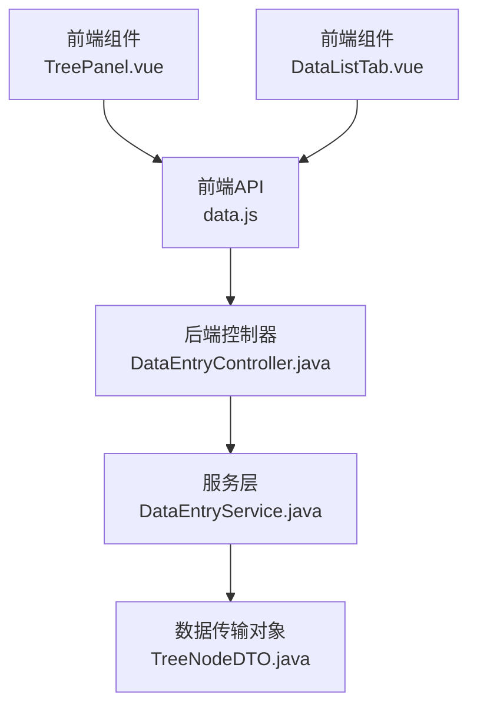
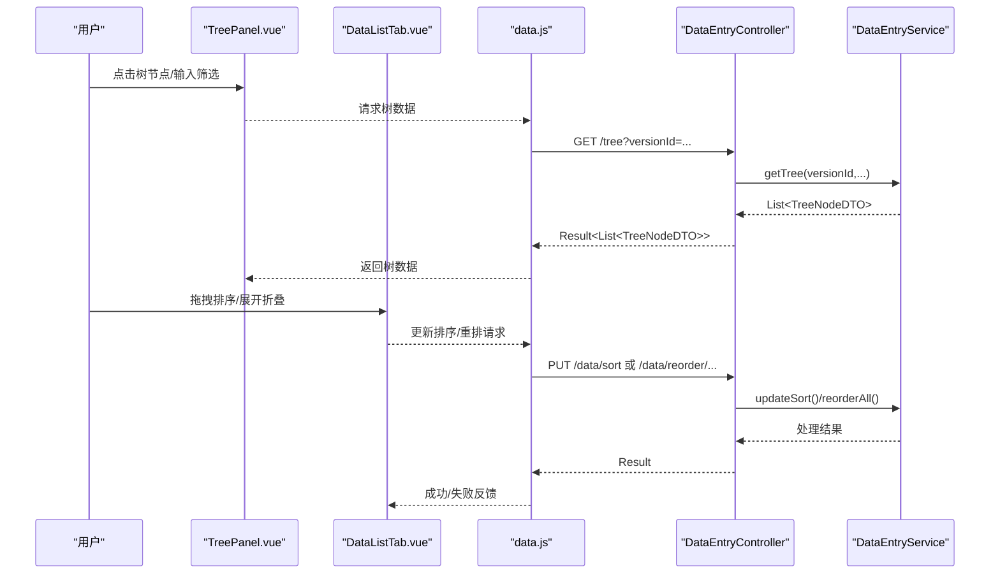
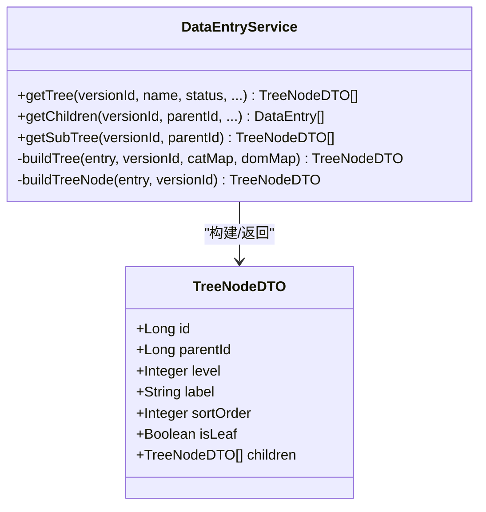
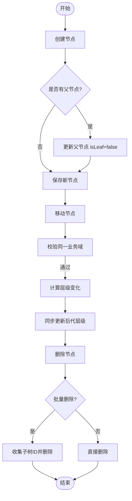
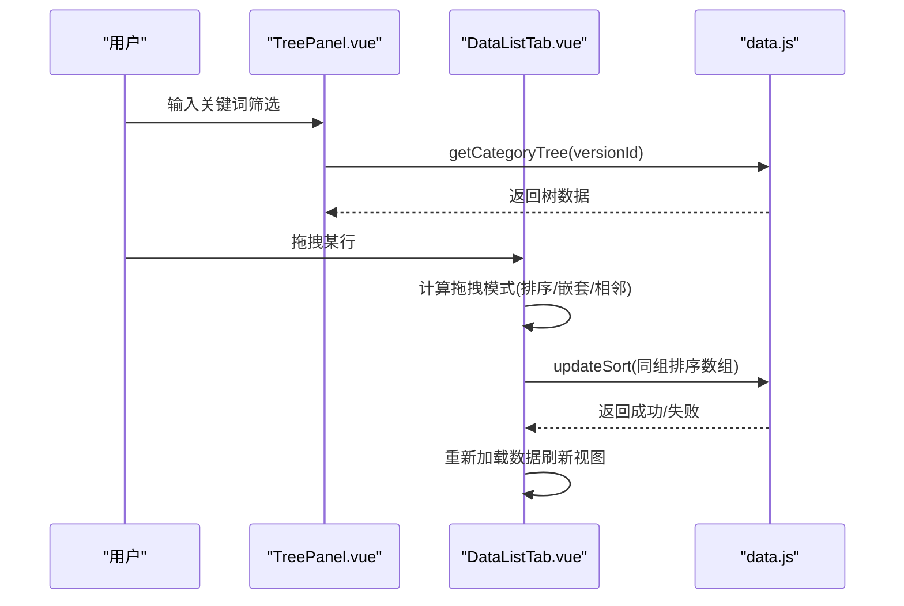
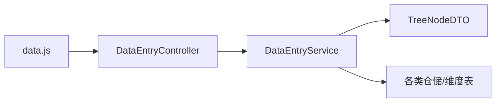

# 树形节点操作

<cite>
**本文引用的文件**
- [frontend/src/components/TreePanel.vue](file://frontend/src/components/TreePanel.vue)
- [frontend/src/api/data.js](file://frontend/src/api/data.js)
- [frontend/src/views/dashboard/DataWorkbench.vue](file://frontend/src/views/dashboard/DataWorkbench.vue)
- [frontend/src/components/DataListTab.vue](file://frontend/src/components/DataListTab.vue)
- [src/main/java/com/superpower/modules/data/dto/TreeNodeDTO.java](file://src/main/java/com/superpower/modules/data/dto/TreeNodeDTO.java)
- [src/main/java/com/superpower/modules/data/service/DataEntryService.java](file://src/main/java/com/superpower/modules/data/service/DataEntryService.java)
- [src/main/java/com/superpower/modules/data/controller/DataEntryController.java](file://src/main/java/com/superpower/modules/data/controller/DataEntryController.java)
- [docs/superpowers/plans/2026-05-26-static-tree-design.md](file://docs/superpowers/plans/2026-05-26-static-tree-design.md)
- [docs/superpowers/plans/2026-05-29-unify-category-datasource.md](file://docs/superpowers/plans/2026-05-29-unify-category-datasource.md)
- [docs/superpowers/plans/2026-05-25-tianyi-data-tool-phase1.md](file://docs/superpowers/plans/2026-05-25-tianyi-data-tool-phase1.md)
- [import_excel.py](file://import_excel.py)
</cite>

## 目录
1. [简介](#简介)
2. [项目结构](#项目结构)
3. [核心组件](#核心组件)
4. [架构总览](#架构总览)
5. [详细组件分析](#详细组件分析)
6. [依赖分析](#依赖分析)
7. [性能考虑](#性能考虑)
8. [故障排查指南](#故障排查指南)
9. [结论](#结论)
10. [附录](#附录)

## 简介
本文件面向“树形节点操作”的API与交互实现，覆盖树形数据结构的节点创建、移动、删除与查询；阐述节点层级关系与遍历算法；说明前端拖拽、展开折叠等交互机制；并给出缓存策略、性能优化与并发控制建议。文档以仓库中的实际代码为依据，确保技术细节准确可追溯。

## 项目结构
围绕树形节点操作的关键模块分布如下：
- 前端
  - TreePanel 树面板组件：负责树渲染、筛选、高亮与节点选择事件
  - DataListTab 列表组件：负责树形数据的拖拽排序、展开/折叠、分组渲染
  - API 层：封装树形查询、节点操作、排序与重排等HTTP接口
- 后端
  - DTO：TreeNodeDTO 定义树节点对外传输结构
  - Service：DataEntryService 实现树构建、查询、节点操作与重排
  - Controller：DataEntryController 对外暴露树形API端点

图表来源
- [frontend/src/components/TreePanel.vue:1-200](file://frontend/src/components/TreePanel.vue#L1-L200)
- [frontend/src/components/DataListTab.vue:819-1104](file://frontend/src/components/DataListTab.vue#L819-L1104)
- [frontend/src/api/data.js:1-128](file://frontend/src/api/data.js#L1-L128)
- [src/main/java/com/superpower/modules/data/controller/DataEntryController.java:58-67](file://src/main/java/com/superpower/modules/data/controller/DataEntryController.java#L58-L67)
- [src/main/java/com/superpower/modules/data/service/DataEntryService.java:85-138](file://src/main/java/com/superpower/modules/data/service/DataEntryService.java#L85-L138)
- [src/main/java/com/superpower/modules/data/dto/TreeNodeDTO.java:1-16](file://src/main/java/com/superpower/modules/data/dto/TreeNodeDTO.java#L1-L16)

章节来源
- [frontend/src/components/TreePanel.vue:1-200](file://frontend/src/components/TreePanel.vue#L1-L200)
- [frontend/src/components/DataListTab.vue:819-1104](file://frontend/src/components/DataListTab.vue#L819-L1104)
- [frontend/src/api/data.js:1-128](file://frontend/src/api/data.js#L1-L128)
- [src/main/java/com/superpower/modules/data/controller/DataEntryController.java:58-67](file://src/main/java/com/superpower/modules/data/controller/DataEntryController.java#L58-L67)
- [src/main/java/com/superpower/modules/data/service/DataEntryService.java:85-138](file://src/main/java/com/superpower/modules/data/service/DataEntryService.java#L85-L138)
- [src/main/java/com/superpower/modules/data/dto/TreeNodeDTO.java:1-16](file://src/main/java/com/superpower/modules/data/dto/TreeNodeDTO.java#L1-L16)

## 核心组件
- 树节点数据结构
  - TreeNodeDTO：包含 id、parentId、level、label、sortOrder、isLeaf、children 等字段，用于前后端树形数据传输
- 树构建与查询
  - DataEntryService.getTree：按版本与过滤条件构建树，支持按业务分类/域排序
  - DataEntryService.getChildren：按父节点查询子节点列表
  - DataEntryService.getSubTree：按父节点查询子树简版
- 节点操作
  - create/update/delete：节点创建、更新、删除（含级联删除）
  - updateSort/reorderAll：批量更新排序、按编号重排
  - 移动节点：支持同域内父子移动、兄弟移动、层级提升/下降
- 前端交互
  - TreePanel：树渲染、筛选、点击选中、高亮定位
  - DataListTab：拖拽排序、展开/折叠、分组渲染

章节来源
- [src/main/java/com/superpower/modules/data/dto/TreeNodeDTO.java:1-16](file://src/main/java/com/superpower/modules/data/dto/TreeNodeDTO.java#L1-L16)
- [src/main/java/com/superpower/modules/data/service/DataEntryService.java:85-138](file://src/main/java/com/superpower/modules/data/service/DataEntryService.java#L85-L138)
- [src/main/java/com/superpower/modules/data/service/DataEntryService.java:287-334](file://src/main/java/com/superpower/modules/data/service/DataEntryService.java#L287-L334)
- [src/main/java/com/superpower/modules/data/service/DataEntryService.java:501-537](file://src/main/java/com/superpower/modules/data/service/DataEntryService.java#L501-L537)
- [src/main/java/com/superpower/modules/data/service/DataEntryService.java:730-768](file://src/main/java/com/superpower/modules/data/service/DataEntryService.java#L730-L768)
- [frontend/src/components/TreePanel.vue:1-200](file://frontend/src/components/TreePanel.vue#L1-L200)
- [frontend/src/components/DataListTab.vue:819-1104](file://frontend/src/components/DataListTab.vue#L819-L1104)

## 架构总览
树形节点操作采用典型的前后端分离架构：
- 前端通过API层调用后端控制器，控制器委托服务层执行业务逻辑
- 服务层基于数据实体与维度表（分类/域）构建树结构，并处理节点的创建、移动、删除与排序
- 前端组件负责用户交互与视图渲染，包括树面板与列表拖拽

图表来源
- [frontend/src/components/TreePanel.vue:59-67](file://frontend/src/components/TreePanel.vue#L59-L67)
- [frontend/src/api/data.js:3-41](file://frontend/src/api/data.js#L3-L41)
- [src/main/java/com/superpower/modules/data/controller/DataEntryController.java:58-67](file://src/main/java/com/superpower/modules/data/controller/DataEntryController.java#L58-L67)
- [src/main/java/com/superpower/modules/data/service/DataEntryService.java:730-768](file://src/main/java/com/superpower/modules/data/service/DataEntryService.java#L730-L768)

## 详细组件分析

### 树节点数据结构与遍历
- TreeNodeDTO 字段定义了树节点的核心属性，支持递归子树结构
- 服务层通过递归构建树：当 level < 2 时设置为非叶子，查询子节点并递归构建；否则标记为叶子
- 子树查询与子节点列表查询分别用于不同场景（完整树 vs 单个父节点下的子节点）

图表来源
- [src/main/java/com/superpower/modules/data/dto/TreeNodeDTO.java:1-16](file://src/main/java/com/superpower/modules/data/dto/TreeNodeDTO.java#L1-L16)
- [src/main/java/com/superpower/modules/data/service/DataEntryService.java:85-138](file://src/main/java/com/superpower/modules/data/service/DataEntryService.java#L85-L138)
- [src/main/java/com/superpower/modules/data/service/DataEntryService.java:167-180](file://src/main/java/com/superpower/modules/data/service/DataEntryService.java#L167-L180)

章节来源
- [src/main/java/com/superpower/modules/data/dto/TreeNodeDTO.java:1-16](file://src/main/java/com/superpower/modules/data/dto/TreeNodeDTO.java#L1-L16)
- [src/main/java/com/superpower/modules/data/service/DataEntryService.java:85-138](file://src/main/java/com/superpower/modules/data/service/DataEntryService.java#L85-L138)
- [src/main/java/com/superpower/modules/data/service/DataEntryService.java:167-180](file://src/main/java/com/superpower/modules/data/service/DataEntryService.java#L167-L180)

### 节点创建、移动、删除与查询接口
- 创建节点
  - 服务层根据父节点自动更新 isLeaf 标记，保证父子关系一致性
  - 若未指定排序，按同级最大排序+1生成
- 移动节点
  - 限制在同一业务域内移动，禁止移动到自身子树下
  - 计算层级变化并同步更新后代节点层级
- 删除节点
  - 支持单节点与批量删除，批量删除会收集整棵子树ID并一次性删除
- 查询接口
  - 树根查询、子节点查询、子树查询、按域查询等

图表来源
- [src/main/java/com/superpower/modules/data/service/DataEntryService.java:287-334](file://src/main/java/com/superpower/modules/data/service/DataEntryService.java#L287-L334)
- [src/main/java/com/superpower/modules/data/service/DataEntryService.java:876-909](file://src/main/java/com/superpower/modules/data/service/DataEntryService.java#L876-L909)
- [src/main/java/com/superpower/modules/data/service/DataEntryService.java:501-537](file://src/main/java/com/superpower/modules/data/service/DataEntryService.java#L501-L537)

章节来源
- [src/main/java/com/superpower/modules/data/service/DataEntryService.java:287-334](file://src/main/java/com/superpower/modules/data/service/DataEntryService.java#L287-L334)
- [src/main/java/com/superpower/modules/data/service/DataEntryService.java:876-909](file://src/main/java/com/superpower/modules/data/service/DataEntryService.java#L876-L909)
- [src/main/java/com/superpower/modules/data/service/DataEntryService.java:501-537](file://src/main/java/com/superpower/modules/data/service/DataEntryService.java#L501-L537)

### 前端交互：树面板与拖拽排序
- 树面板 TreePanel
  - 使用 Element Plus Tree 组件渲染树，支持筛选、默认展开、高亮当前节点
  - 通过 nodeMap 构建节点索引，支持按标签快速定位 L1/L2 节点
- 列表拖拽 DataListTab
  - 支持三种模式：排序（sort）、嵌套（nest）、相邻（sibling）
  - 通过鼠标相对位置判断拖拽意图，动态绘制指示线
  - 应用阶段调用 updateSort 进行批量排序持久化

图表来源
- [frontend/src/components/TreePanel.vue:55-81](file://frontend/src/components/TreePanel.vue#L55-L81)
- [frontend/src/components/DataListTab.vue:841-957](file://frontend/src/components/DataListTab.vue#L841-L957)
- [frontend/src/api/data.js:35-41](file://frontend/src/api/data.js#L35-L41)

章节来源
- [frontend/src/components/TreePanel.vue:1-200](file://frontend/src/components/TreePanel.vue#L1-L200)
- [frontend/src/components/DataListTab.vue:819-1104](file://frontend/src/components/DataListTab.vue#L819-L1104)
- [frontend/src/api/data.js:1-128](file://frontend/src/api/data.js#L1-L128)

### 展开/折叠与层级关系
- 展开/折叠
  - DataListTab 维护 collapsedDomains 与 expandedNodeIds，控制域分组与节点展开状态
  - 支持全展开/全折叠，以及按节点点击切换
- 层级关系
  - 服务层在构建树时依据 level 与 parentId 维护层级与父子关系
  - 导入脚本 import_excel.py 通过栈结构与排序键维护层级顺序

章节来源
- [frontend/src/components/DataListTab.vue:1095-1168](file://frontend/src/components/DataListTab.vue#L1095-L1168)
- [src/main/java/com/superpower/modules/data/service/DataEntryService.java:107-138](file://src/main/java/com/superpower/modules/data/service/DataEntryService.java#L107-L138)
- [import_excel.py:176-214](file://import_excel.py#L176-L214)

## 依赖分析
- 前端依赖
  - TreePanel 依赖 API 层的树查询接口
  - DataListTab 依赖 API 层的排序与重排接口
- 后端依赖
  - DataEntryController 依赖 DataEntryService
  - DataEntryService 依赖多个仓储与维度表（分类/域/产品），并使用事务保障一致性

图表来源
- [frontend/src/api/data.js:1-128](file://frontend/src/api/data.js#L1-L128)
- [src/main/java/com/superpower/modules/data/controller/DataEntryController.java:58-67](file://src/main/java/com/superpower/modules/data/controller/DataEntryController.java#L58-L67)
- [src/main/java/com/superpower/modules/data/service/DataEntryService.java:45-74](file://src/main/java/com/superpower/modules/data/service/DataEntryService.java#L45-L74)

章节来源
- [frontend/src/api/data.js:1-128](file://frontend/src/api/data.js#L1-L128)
- [src/main/java/com/superpower/modules/data/controller/DataEntryController.java:58-67](file://src/main/java/com/superpower/modules/data/controller/DataEntryController.java#L58-L67)
- [src/main/java/com/superpower/modules/data/service/DataEntryService.java:45-74](file://src/main/java/com/superpower/modules/data/service/DataEntryService.java#L45-L74)

## 性能考虑
- 树构建与排序
  - 服务层在构建树时对子节点按业务域排序，避免前端重复计算
  - 排序采用批量更新，减少数据库往返次数
- 前端渲染
  - TreePanel 使用节点映射 nodeMap 快速定位节点，提高筛选与高亮效率
  - DataListTab 使用虚拟滚动与分组渲染，降低大列表渲染压力
- 并发控制
  - 服务层使用事务注解保证节点操作的原子性
  - 版本状态检查防止对已发布版本进行修改
- 缓存策略
  - 可在前端对树数据进行本地缓存，结合版本号与筛选条件作为缓存键
  - 对于频繁访问的子树，可在服务层引入轻量缓存（如基于版本+父节点ID的Map缓存）

## 故障排查指南
- 删除失败
  - 若提示“该节点下有子节点，无法删除”，请先删除子节点或使用批量删除
- 移动失败
  - 若提示“只能在同一业务域内移动”或“不能移动到自己的子节点下”，请检查目标节点与域归属
- 排序异常
  - 若排序保存失败，请检查同组排序数组是否正确生成，以及版本状态是否为草稿
- 树渲染异常
  - 若筛选无效或高亮不生效，检查 nodeMap 是否重建、标签匹配逻辑是否正确

章节来源
- [src/main/java/com/superpower/modules/data/service/DataEntryService.java:276-285](file://src/main/java/com/superpower/modules/data/service/DataEntryService.java#L276-L285)
- [src/main/java/com/superpower/modules/data/service/DataEntryService.java:876-909](file://src/main/java/com/superpower/modules/data/service/DataEntryService.java#L876-L909)
- [frontend/src/components/TreePanel.vue:114-117](file://frontend/src/components/TreePanel.vue#L114-L117)

## 结论
本项目通过清晰的前后端职责划分与完善的树形节点操作能力，实现了从数据构建、查询、排序到交互拖拽的完整闭环。服务层以事务与版本状态控制保障数据一致性，前端以组件化与虚拟化提升交互体验。建议在生产环境中进一步引入缓存与并行化策略，持续优化大规模树形数据的渲染与交互性能。

## 附录
- 设计文档参考
  - 静态树设计方案：定义了业务分类与业务域两级结构及版本隔离
  - 统一分类数据源：统一从维度表获取名称，增强树节点 label 的一致性
  - 天一数据工具（第一阶段）：早期树形节点模型与基础API设计

章节来源
- [docs/superpowers/plans/2026-05-26-static-tree-design.md:1-52](file://docs/superpowers/plans/2026-05-26-static-tree-design.md#L1-L52)
- [docs/superpowers/plans/2026-05-29-unify-category-datasource.md:281-315](file://docs/superpowers/plans/2026-05-29-unify-category-datasource.md#L281-L315)
- [docs/superpowers/plans/2026-05-25-tianyi-data-tool-phase1.md:1875-1895](file://docs/superpowers/plans/2026-05-25-tianyi-data-tool-phase1.md#L1875-L1895)