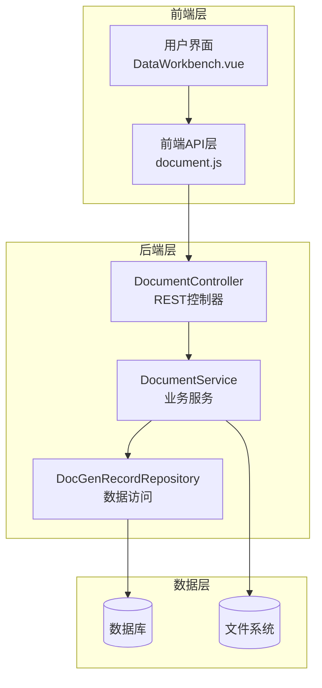
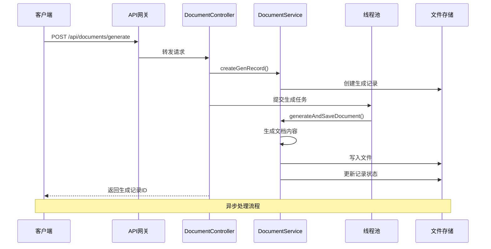
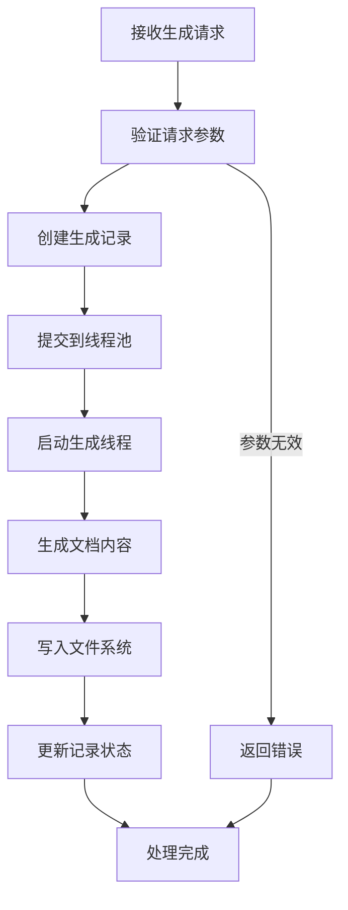
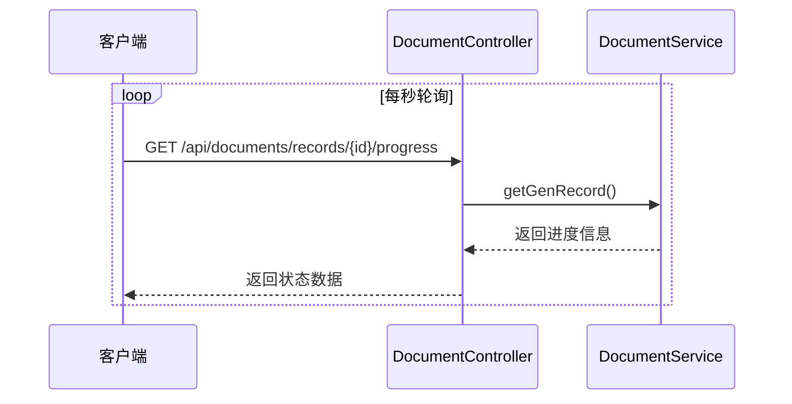
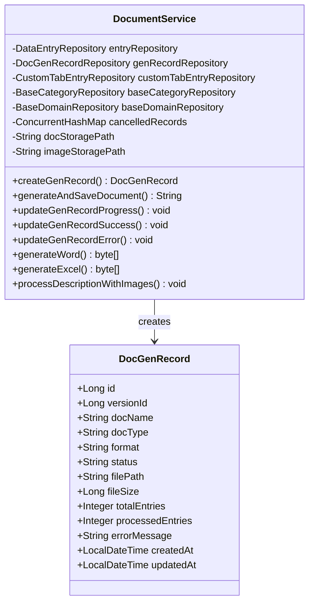
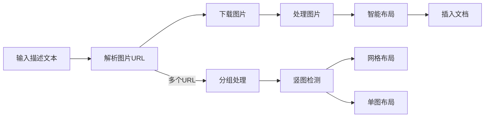
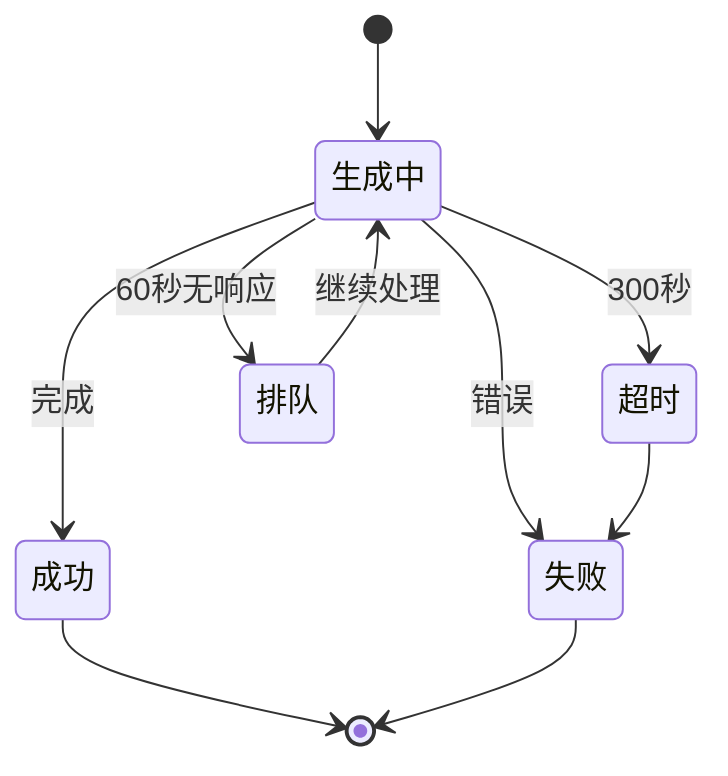
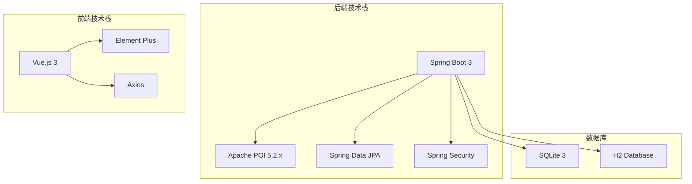

# 文档生成API

<cite>
**本文档引用的文件**
- [DocumentController.java](file://src/main/java/com/superpower/modules/document/controller/DocumentController.java)
- [DocumentService.java](file://src/main/java/com/superpower/modules/document/service/DocumentService.java)
- [DocGenerateRequest.java](file://src/main/java/com/superpower/modules/document/dto/DocGenerateRequest.java)
- [DocGenRecord.java](file://src/main/java/com/superpower/modules/document/entity/DocGenRecord.java)
- [document.js](file://frontend/src/api/document.js)
- [DataWorkbench.vue](file://frontend/src/views/dashboard/DataWorkbench.vue)
- [2026-05-25-word-document-generation.md](file://docs/superpowers/plans/2026-05-25-word-document-generation.md)
- [VERSION.md](file://VERSION.md)
</cite>

## 目录
1. [简介](#简介)
2. [项目结构](#项目结构)
3. [核心组件](#核心组件)
4. [架构概览](#架构概览)
5. [详细组件分析](#详细组件分析)
6. [依赖分析](#依赖分析)
7. [性能考虑](#性能考虑)
8. [故障排除指南](#故障排除指南)
9. [结论](#结论)

## 简介
本文档详细描述了系统中的文档生成功能API，包括Word文档生成、Excel数据导出、批量文档处理等接口规范。该功能支持将选中的数据导出为招标参数（Word/Excel）和功能说明（Word/Excel），并提供完整的异步处理机制、进度查询和错误处理流程。

## 项目结构
文档生成功能采用前后端分离架构，后端使用Spring Boot框架，前端使用Vue.js技术栈。

**图表来源**
- [DocumentController.java:31-51](file://src/main/java/com/superpower/modules/document/controller/DocumentController.java#L31-L51)
- [DocumentService.java:45-89](file://src/main/java/com/superpower/modules/document/service/DocumentService.java#L45-L89)

**章节来源**
- [DocumentController.java:31-51](file://src/main/java/com/superpower/modules/document/controller/DocumentController.java#L31-L51)
- [DocumentService.java:45-89](file://src/main/java/com/superpower/modules/document/service/DocumentService.java#L45-L89)

## 核心组件

### 接口概述
系统提供以下核心API接口：

1. **文档生成接口** - 异步生成Word/Excel文档
2. **进度查询接口** - 查询生成进度状态
3. **记录查询接口** - 获取生成历史记录
4. **文件下载接口** - 下载已完成的文档
5. **记录删除接口** - 删除生成记录（管理员权限）

### 请求参数规范

#### 文档生成请求参数
| 参数名 | 类型 | 必填 | 默认值 | 描述 |
|--------|------|------|--------|------|
| versionId | Long | 是 | - | 版本ID |
| docName | String | 是 | - | 文档名称 |
| docType | String | 是 | - | 文档类型（bid/feature） |
| format | String | 是 | - | 输出格式（word/excel） |
| dataScope | String | 否 | "all" | 数据范围（all/selected） |
| entryIds | List<Long> | 否 | [] | 选中的数据项ID列表 |
| customTabId | Long | 否 | null | 自定义清单ID |
| includeImages | Boolean | 否 | true | 是否包含图片 |
| compressImages | Boolean | 否 | false | 是否压缩图片 |

#### 响应参数规范
| 字段名 | 类型 | 描述 |
|--------|------|------|
| id | Long | 生成记录ID |
| versionId | Long | 版本ID |
| docName | String | 文档名称 |
| docType | String | 文档类型 |
| format | String | 输出格式 |
| status | String | 状态（generating/completed/error） |
| filePath | String | 文件路径 |
| fileSize | Long | 文件大小 |
| totalEntries | Integer | 总数据量 |
| processedEntries | Integer | 已处理数据量 |
| errorMessage | String | 错误信息 |
| createdAt | LocalDateTime | 创建时间 |
| updatedAt | LocalDateTime | 更新时间 |

**章节来源**
- [DocGenerateRequest.java:7-17](file://src/main/java/com/superpower/modules/document/dto/DocGenerateRequest.java#L7-L17)
- [DocGenRecord.java:10-62](file://src/main/java/com/superpower/modules/document/entity/DocGenRecord.java#L10-L62)

## 架构概览

**图表来源**
- [DocumentController.java:53-121](file://src/main/java/com/superpower/modules/document/controller/DocumentController.java#L53-L121)
- [DocumentService.java:246-305](file://src/main/java/com/superpower/modules/document/service/DocumentService.java#L246-L305)

## 详细组件分析

### 文档控制器（DocumentController）

#### 生成接口
负责接收文档生成请求并启动异步处理流程。

**图表来源**
- [DocumentController.java:53-121](file://src/main/java/com/superpower/modules/document/controller/DocumentController.java#L53-L121)

#### 进度查询接口
提供实时的生成进度查询功能。

**图表来源**
- [DocumentController.java:123-126](file://src/main/java/com/superpower/modules/document/controller/DocumentController.java#L123-L126)

**章节来源**
- [DocumentController.java:53-162](file://src/main/java/com/superpower/modules/document/controller/DocumentController.java#L53-L162)

### 文档服务（DocumentService）

#### 生成流程
文档服务实现了完整的文档生成逻辑，包括Word和Excel两种格式的支持。

**图表来源**
- [DocumentService.java:45-89](file://src/main/java/com/superpower/modules/document/service/DocumentService.java#L45-L89)
- [DocGenRecord.java:10-62](file://src/main/java/com/superpower/modules/document/entity/DocGenRecord.java#L10-L62)

#### 图片处理机制
支持从网络和本地存储中提取图片，并进行智能布局处理。

**图表来源**
- [DocumentService.java:546-669](file://src/main/java/com/superpower/modules/document/service/DocumentService.java#L546-L669)

**章节来源**
- [DocumentService.java:246-800](file://src/main/java/com/superpower/modules/document/service/DocumentService.java#L246-L800)

### 前端集成

#### 进度监控机制
前端实现了完整的进度监控和错误处理机制。

**图表来源**
- [DataWorkbench.vue:407-439](file://frontend/src/views/dashboard/DataWorkbench.vue#L407-L439)

**章节来源**
- [document.js:1-31](file://frontend/src/api/document.js#L1-L31)
- [DataWorkbench.vue:332-439](file://frontend/src/views/dashboard/DataWorkbench.vue#L332-L439)

## 依赖分析

### 技术栈依赖
系统采用现代化的技术栈组合：

### 外部依赖
- **Apache POI**: 用于生成Word和Excel文档
- **Spring Security**: 提供身份认证和授权
- **H2 Database**: 开发环境下的内存数据库
- **Element Plus**: 前端UI组件库

**章节来源**
- [2026-05-25-word-document-generation.md:7-9](file://docs/superpowers/plans/2026-05-25-word-document-generation.md#L7-L9)

## 性能考虑

### 线程池配置
系统使用固定大小的线程池来处理文档生成任务，避免资源耗尽问题。

| 配置项 | 值 | 说明 |
|--------|-----|------|
| 线程数 | 3 | 并发生成文档的最大数量 |
| 线程命名 | doc-gen-{id} | 便于调试和监控 |
| 守护线程 | 是 | 应用关闭时自动清理 |

### 存储策略
- **文档存储**: 使用配置化的存储路径，默认为`./generated-docs`
- **图片缓存**: 支持本地图片和远程图片的混合处理
- **文件清理**: 自动生成完成后自动清理临时文件

### 性能优化
- **进度批处理**: 进度更新采用批量保存策略，减少数据库压力
- **超时控制**: 生成任务超时时间为10分钟，避免长时间占用资源
- **内存管理**: 大文档生成时启用Zip压缩配置，优化内存使用

## 故障排除指南

### 常见问题及解决方案

#### 生成任务超时
**现象**: 文档生成超过10分钟后仍未完成
**原因**: 数据量过大或网络延迟
**解决方案**: 
1. 检查数据量大小，考虑分批处理
2. 优化网络连接，确保图片可访问
3. 调整超时时间配置

#### 进度卡住
**现象**: 进度达到100%但长时间未完成
**原因**: 文件写入或数据库更新异常
**解决方案**:
1. 检查磁盘空间和权限
2. 查看应用日志获取详细错误信息
3. 重启应用服务

#### 图片加载失败
**现象**: 文档中缺少图片或显示占位符
**原因**: 图片URL不可访问或格式不支持
**解决方案**:
1. 验证图片URL的有效性
2. 检查图片格式是否为支持的类型
3. 确认网络连接正常

**章节来源**
- [VERSION.md:69-78](file://VERSION.md#L69-L78)

## 结论
文档生成功能提供了完整的企业级文档自动化解决方案，具有以下特点：

1. **异步处理**: 采用线程池异步处理，提升用户体验
2. **多种格式**: 支持Word和Excel两种主流格式
3. **智能布局**: 自动处理图片布局和编号系统
4. **进度监控**: 实时进度查询和状态反馈
5. **错误处理**: 完善的错误捕获和恢复机制

该功能为企业提供了高效、可靠的文档生成能力，支持批量处理和自定义配置，满足不同场景下的文档需求。