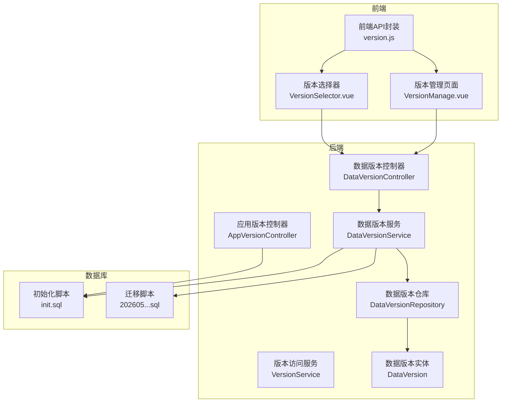
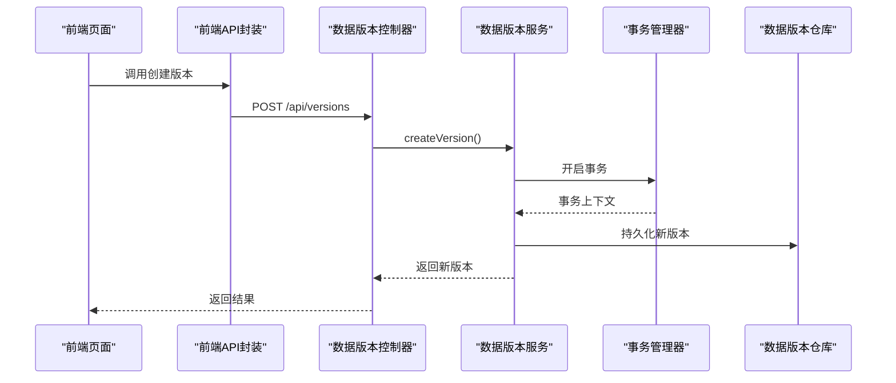
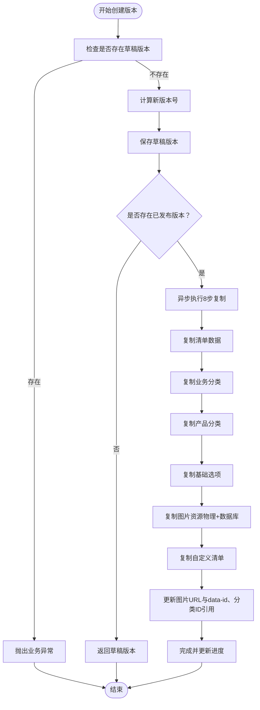
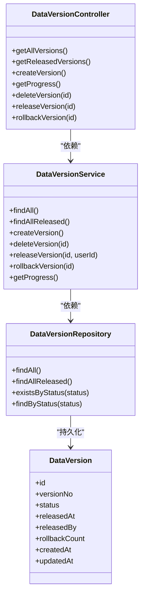
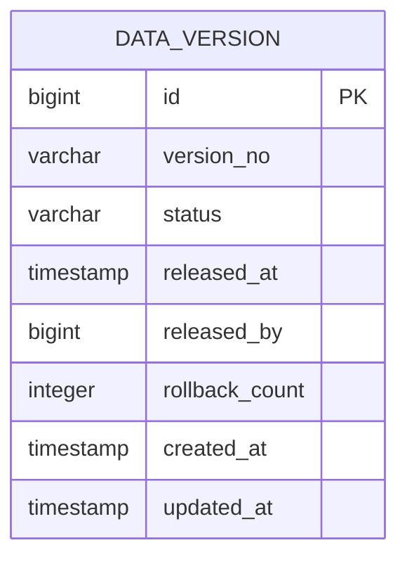

# 版本控制API

<cite>
**本文档引用的文件**
- [AppVersionController.java](file://src/main/java/com/superpower/modules/version/controller/AppVersionController.java)
- [DataVersionController.java](file://src/main/java/com/superpower/modules/version/controller/DataVersionController.java)
- [DataVersion.java](file://src/main/java/com/superpower/modules/version/entity/DataVersion.java)
- [DataVersionService.java](file://src/main/java/com/superpower/modules/version/service/DataVersionService.java)
- [VersionService.java](file://src/main/java/com/superpower/modules/version/service/VersionService.java)
- [DataVersionRepository.java](file://src/main/java/com/superpower/modules/version/repository/DataVersionRepository.java)
- [version.js](file://frontend/src/api/version.js)
- [VersionManage.vue](file://frontend/src/views/system/VersionManage.vue)
- [VersionSelector.vue](file://frontend/src/components/VersionSelector.vue)
- [20260531_add_version_rollback_and_req_domain.sql](file://db_changes/20260531_add_version_rollback_and_req_domain.sql)
- [20260531_historical_schema_changes.sql](file://db_changes/20260531_historical_schema_changes.sql)
- [init.sql](file://src/main/resources/db/init.sql)
</cite>

## 目录
1. [简介](#简介)
2. [项目结构](#项目结构)
3. [核心组件](#核心组件)
4. [架构总览](#架构总览)
5. [详细组件分析](#详细组件分析)
6. [依赖关系分析](#依赖关系分析)
7. [性能考虑](#性能考虑)
8. [故障排除指南](#故障排除指南)
9. [结论](#结论)
10. [附录](#附录)

## 简介
本文件为版本控制功能的详细API接口文档，覆盖应用版本与数据版本的管理能力。数据版本支持创建、封板发布、退回、删除、进度查询等操作；应用版本用于获取当前应用版本号。系统通过事务保证操作原子性，并提供版本进度轮询、版本历史记录、版本冲突处理（退回计数与版本号升级策略）、快照式增量复制、以及版本备份与清理的完整流程。

## 项目结构
版本控制功能由后端控制器、服务层、实体与仓库层组成，并配套前端API封装与页面组件。数据库层面通过迁移脚本引入版本相关字段与历史表结构。

图表来源
- [DataVersionController.java:1-106](file://src/main/java/com/superpower/modules/version/controller/DataVersionController.java#L1-L106)
- [DataVersionService.java:1-721](file://src/main/java/com/superpower/modules/version/service/DataVersionService.java#L1-L721)
- [DataVersionRepository.java:1-20](file://src/main/java/com/superpower/modules/version/repository/DataVersionRepository.java#L1-L20)
- [DataVersion.java:1-36](file://src/main/java/com/superpower/modules/version/entity/DataVersion.java#L1-L36)
- [version.js:1-34](file://frontend/src/api/version.js#L1-L34)
- [VersionManage.vue:1-259](file://frontend/src/views/system/VersionManage.vue#L1-L259)
- [VersionSelector.vue:1-56](file://frontend/src/components/VersionSelector.vue#L1-L56)
- [init.sql](file://src/main/resources/db/init.sql)
- [20260531_add_version_rollback_and_req_domain.sql:1-6](file://db_changes/20260531_add_version_rollback_and_req_domain.sql#L1-L6)

章节来源
- [DataVersionController.java:1-106](file://src/main/java/com/superpower/modules/version/controller/DataVersionController.java#L1-L106)
- [DataVersionService.java:1-721](file://src/main/java/com/superpower/modules/version/service/DataVersionService.java#L1-L721)
- [DataVersionRepository.java:1-20](file://src/main/java/com/superpower/modules/version/repository/DataVersionRepository.java#L1-L20)
- [DataVersion.java:1-36](file://src/main/java/com/superpower/modules/version/entity/DataVersion.java#L1-L36)
- [version.js:1-34](file://frontend/src/api/version.js#L1-L34)
- [VersionManage.vue:1-259](file://frontend/src/views/system/VersionManage.vue#L1-L259)
- [VersionSelector.vue:1-56](file://frontend/src/components/VersionSelector.vue#L1-L56)
- [init.sql](file://src/main/resources/db/init.sql)
- [20260531_add_version_rollback_and_req_domain.sql:1-6](file://db_changes/20260531_add_version_rollback_and_req_domain.sql#L1-L6)

## 核心组件
- 应用版本接口：提供当前应用版本号查询，读取VERSION.md文件首行作为版本标识。
- 数据版本接口：提供版本列表、创建、封板发布、退回、删除、进度查询等REST接口。
- 服务层：实现版本生命周期管理、快照式增量复制、图片资源迁移、引用更新、事务与进度上报。
- 实体与仓库：维护版本元数据、状态与时间戳，提供按状态查询与排序。
- 前端集成：封装API调用、进度轮询、版本选择与操作确认。

章节来源
- [AppVersionController.java:1-35](file://src/main/java/com/superpower/modules/version/controller/AppVersionController.java#L1-L35)
- [DataVersionController.java:1-106](file://src/main/java/com/superpower/modules/version/controller/DataVersionController.java#L1-L106)
- [DataVersionService.java:1-721](file://src/main/java/com/superpower/modules/version/service/DataVersionService.java#L1-L721)
- [DataVersionRepository.java:1-20](file://src/main/java/com/superpower/modules/version/repository/DataVersionRepository.java#L1-L20)
- [DataVersion.java:1-36](file://src/main/java/com/superpower/modules/version/entity/DataVersion.java#L1-L36)
- [version.js:1-34](file://frontend/src/api/version.js#L1-L34)
- [VersionManage.vue:1-259](file://frontend/src/views/system/VersionManage.vue#L1-L259)
- [VersionSelector.vue:1-56](file://frontend/src/components/VersionSelector.vue#L1-L56)

## 架构总览
版本控制采用前后端分离架构，后端以Spring MVC提供REST接口，使用JPA与事务模板保证原子性，服务层负责复杂的数据复制与引用修复逻辑。前端通过统一API封装与页面组件实现版本管理与进度展示。

图表来源
- [DataVersionController.java:66-72](file://src/main/java/com/superpower/modules/version/controller/DataVersionController.java#L66-L72)
- [DataVersionService.java:152-203](file://src/main/java/com/superpower/modules/version/service/DataVersionService.java#L152-L203)
- [DataVersionRepository.java:1-20](file://src/main/java/com/superpower/modules/version/repository/DataVersionRepository.java#L1-L20)

## 详细组件分析

### 应用版本接口
- 接口路径：GET /api/app-version
- 功能：读取VERSION.md文件首行作为应用版本号，过滤标题语法与研发版本前缀，返回字符串版本号或unknown。
- 错误处理：文件不存在或IO异常时返回unknown。

章节来源
- [AppVersionController.java:15-35](file://src/main/java/com/superpower/modules/version/controller/AppVersionController.java#L15-L35)

### 数据版本接口
- GET /api/versions：获取所有版本列表，包含版本号、状态、发布时间、发布人、退回次数、创建与更新时间。
- GET /api/versions/released：获取已发布版本列表。
- POST /api/versions：创建新版本，若存在已发布版本则异步克隆数据。
- GET /api/versions/progress：获取版本操作进度。
- DELETE /api/versions/{id}：删除指定版本，异步清理数据与物理文件。
- POST /api/versions/{id}/release：封板发布版本，必要时升级版本号。
- POST /api/versions/{id}/rollback：退回版本至编辑中，增加退回次数并清空发布信息。

章节来源
- [DataVersionController.java:36-104](file://src/main/java/com/superpower/modules/version/controller/DataVersionController.java#L36-L104)

### 数据版本实体与仓库
- 实体字段：主键、版本号、状态、发布人、发布时间、退回次数、创建与更新时间。
- 仓库方法：按创建时间倒序查询、查询已发布版本、按状态存在性检查、按状态查询。

章节来源
- [DataVersion.java:10-35](file://src/main/java/com/superpower/modules/version/entity/DataVersion.java#L10-L35)
- [DataVersionRepository.java:10-19](file://src/main/java/com/superpower/modules/version/repository/DataVersionRepository.java#L10-L19)

### 数据版本服务（核心）
- 进度模型：VersionProgress与StepStatus，支持运行状态、消息与计数上报。
- 创建版本：
  - 若存在草稿版本则拒绝重复创建。
  - 计算新版本号（基于最新版本号递增）。
  - 保存草稿版本后，如存在已发布版本，则异步执行8步复制流程。
- 删除版本：
  - 异步执行9步清理流程，包括自定义清单、清单数据、分类、产品分类、基础选项、图片资源、文档生成记录、版本记录。
  - 事务提交后安全删除物理图片文件与目录。
- 发布版本：
  - 校验状态为草稿，必要时升级版本号（含退回场景的补丁号递增）。
  - 设置发布人与发布时间，保存。
- 回退版本：
  - 仅允许已发布版本回退，校验无草稿版本存在。
  - 将状态置为草稿，增加退回次数，清空发布信息。
- 快照式增量复制：
  - 清单数据：克隆并重建父子关系映射。
  - 业务分类与产品分类：通过服务层复制并返回ID映射。
  - 基础选项：复制通用选项集。
  - 图片资源：物理目录整体复制+数据库记录复制，修复URL前缀与data-id引用。
  - 自定义清单：复制清单与关联条目，修正条目ID映射。
  - 引用更新：批量替换描述文本中的旧URL前缀为新版本URL前缀，修复data-id与分类ID引用。
- 原子性与一致性：
  - 使用事务模板包裹复制与删除流程，确保单步失败可回滚。
  - 单线程执行器串行化版本操作，避免并发冲突。
  - 进度状态在内存中维护，轮询接口返回实时状态。

图表来源
- [DataVersionService.java:152-203](file://src/main/java/com/superpower/modules/version/service/DataVersionService.java#L152-L203)
- [DataVersionService.java:205-474](file://src/main/java/com/superpower/modules/version/service/DataVersionService.java#L205-L474)

章节来源
- [DataVersionService.java:117-151](file://src/main/java/com/superpower/modules/version/service/DataVersionService.java#L117-L151)
- [DataVersionService.java:152-203](file://src/main/java/com/superpower/modules/version/service/DataVersionService.java#L152-L203)
- [DataVersionService.java:205-474](file://src/main/java/com/superpower/modules/version/service/DataVersionService.java#L205-L474)
- [DataVersionService.java:476-542](file://src/main/java/com/superpower/modules/version/service/DataVersionService.java#L476-L542)
- [DataVersionService.java:544-645](file://src/main/java/com/superpower/modules/version/service/DataVersionService.java#L544-L645)
- [DataVersionService.java:647-689](file://src/main/java/com/superpower/modules/version/service/DataVersionService.java#L647-L689)

### 版本访问服务
- 提供版本访问状态查询与可编辑性判断，便于前端控制UI交互。

章节来源
- [VersionService.java:13-22](file://src/main/java/com/superpower/modules/version/service/VersionService.java#L13-L22)

### 前端集成
- API封装：提供获取应用版本、版本列表、已发布版本、创建、进度、删除、发布、退回等方法。
- 版本管理页面：展示版本列表、状态、发布人与日期，提供创建、发布、退回、删除操作按钮与进度对话框。
- 版本选择器：弹窗展示版本列表，支持选择与确认回调。

章节来源
- [version.js:1-34](file://frontend/src/api/version.js#L1-L34)
- [VersionManage.vue:82-239](file://frontend/src/views/system/VersionManage.vue#L82-L239)
- [VersionSelector.vue:29-55](file://frontend/src/components/VersionSelector.vue#L29-L55)

## 依赖关系分析
- 控制器依赖服务层与日志服务，服务层依赖多个仓库与事务管理器。
- 实体与仓库遵循JPA规范，提供按状态与时间排序查询。
- 前端通过统一API封装与控制器交互，页面组件负责进度轮询与用户交互。

图表来源
- [DataVersionController.java:21-105](file://src/main/java/com/superpower/modules/version/controller/DataVersionController.java#L21-L105)
- [DataVersionService.java:108-110](file://src/main/java/com/superpower/modules/version/service/DataVersionService.java#L108-L110)
- [DataVersionRepository.java:10-19](file://src/main/java/com/superpower/modules/version/repository/DataVersionRepository.java#L10-L19)
- [DataVersion.java:10-35](file://src/main/java/com/superpower/modules/version/entity/DataVersion.java#L10-L35)

章节来源
- [DataVersionController.java:21-105](file://src/main/java/com/superpower/modules/version/controller/DataVersionController.java#L21-L105)
- [DataVersionService.java:108-110](file://src/main/java/com/superpower/modules/version/service/DataVersionService.java#L108-L110)
- [DataVersionRepository.java:10-19](file://src/main/java/com/superpower/modules/version/repository/DataVersionRepository.java#L10-L19)
- [DataVersion.java:10-35](file://src/main/java/com/superpower/modules/version/entity/DataVersion.java#L10-L35)

## 性能考虑
- 异步复制：创建与删除版本采用单线程执行器异步执行，避免阻塞主线程。
- 事务批处理：复制过程分步提交，每步更新进度，便于监控与重试。
- 文件复制优化：图片资源物理目录整体复制，减少IO次数；数据库记录批量保存。
- 索引支持：数据库脚本包含版本字段索引，提升查询效率。
- 前端轮询：进度轮询间隔1秒，避免频繁请求；完成后自动停止轮询。

## 故障排除指南
- 创建版本失败：检查是否存在草稿版本；查看进度状态是否显示FAILED；根据错误消息定位具体步骤。
- 删除版本失败：确认版本非唯一版本；检查物理文件删除权限；查看日志中的删除异常。
- 发布版本失败：确认版本状态为草稿；退回场景下版本号升级规则是否符合预期。
- 回退版本失败：确认无草稿版本存在；退回次数是否正确累加。
- 进度未更新：检查轮询逻辑与网络连接；确认服务端进度状态是否被正确更新。

章节来源
- [DataVersionService.java:153-155](file://src/main/java/com/superpower/modules/version/service/DataVersionService.java#L153-L155)
- [DataVersionService.java:506-542](file://src/main/java/com/superpower/modules/version/service/DataVersionService.java#L506-L542)
- [DataVersionService.java:647-689](file://src/main/java/com/superpower/modules/version/service/DataVersionService.java#L647-L689)
- [VersionManage.vue:115-139](file://frontend/src/views/system/VersionManage.vue#L115-L139)

## 结论
版本控制API提供了完整的数据版本生命周期管理能力，涵盖创建、发布、退回、删除与进度跟踪。通过事务与异步执行器保证操作的原子性与一致性，快照式增量复制策略确保数据完整性与引用修复。前端提供直观的操作界面与进度反馈，满足日常版本管理需求。

## 附录

### 数据模型图

图表来源
- [DataVersion.java:10-35](file://src/main/java/com/superpower/modules/version/entity/DataVersion.java#L10-L35)

### 数据库迁移要点
- 版本表新增退回次数字段，支持退回计数统计。
- 历史表结构包含业务分类、业务域、通用选项、自定义清单、审批日志、文档生成记录与图片资源等。
- 初始化脚本定义基础表结构，迁移脚本补充版本相关字段与索引。

章节来源
- [20260531_add_version_rollback_and_req_domain.sql:1-6](file://db_changes/20260531_add_version_rollback_and_req_domain.sql#L1-L6)
- [20260531_historical_schema_changes.sql:1-91](file://db_changes/20260531_historical_schema_changes.sql#L1-L91)
- [init.sql](file://src/main/resources/db/init.sql)