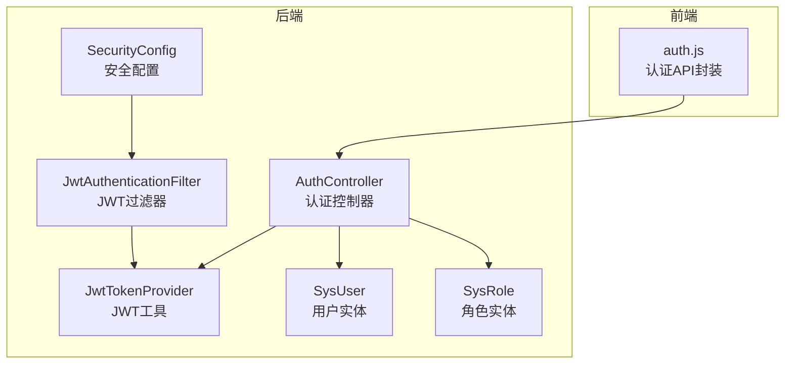
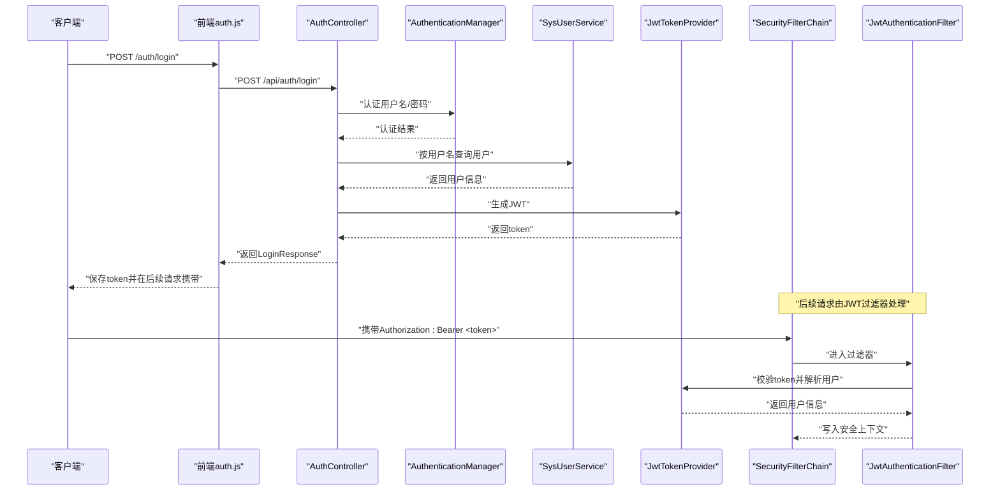
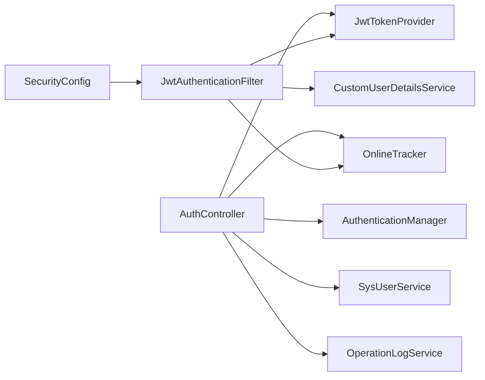
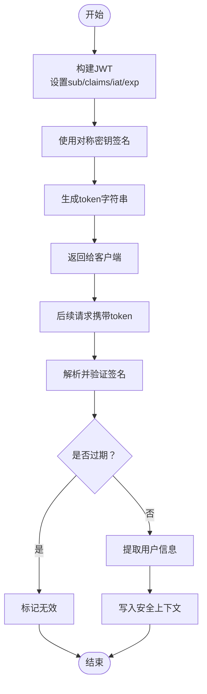
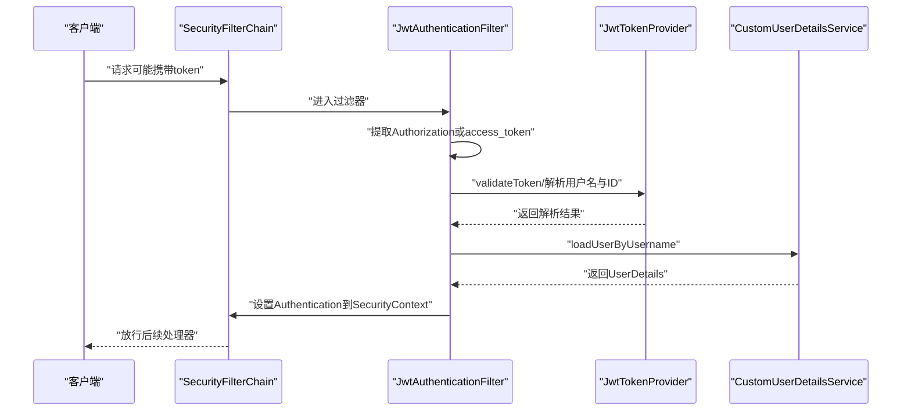

# 用户认证API

<cite>
**本文引用的文件**
- [AuthController.java](file://src/main/java/com/superpower/modules/system/controller/AuthController.java)
- [JwtTokenProvider.java](file://src/main/java/com/superpower/security/JwtTokenProvider.java)
- [JwtAuthenticationFilter.java](file://src/main/java/com/superpower/security/JwtAuthenticationFilter.java)
- [SecurityConfig.java](file://src/main/java/com/superpower/config/SecurityConfig.java)
- [LoginRequest.java](file://src/main/java/com/superpower/modules/system/dto/LoginRequest.java)
- [LoginResponse.java](file://src/main/java/com/superpower/modules/system/dto/LoginResponse.java)
- [SysUser.java](file://src/main/java/com/superpower/modules/system/entity/SysUser.java)
- [SysRole.java](file://src/main/java/com/superpower/modules/system/entity/SysRole.java)
- [application.yml](file://src/main/resources/application.yml)
- [auth.js](file://frontend/src/api/auth.js)
</cite>

## 目录
1. [简介](#简介)
2. [项目结构](#项目结构)
3. [核心组件](#核心组件)
4. [架构总览](#架构总览)
5. [详细组件分析](#详细组件分析)
6. [依赖分析](#依赖分析)
7. [性能考虑](#性能考虑)
8. [故障排查指南](#故障排查指南)
9. [结论](#结论)
10. [附录](#附录)

## 简介
本文件为用户认证模块的完整API接口文档，覆盖登录、登出（通过令牌失效实现）、令牌刷新（建议方案）等认证相关接口规范；详细说明JWT令牌的生成、验证与刷新机制；提供请求与响应示例场景（成功登录、密码错误、账户锁定等）；解释认证中间件工作原理与安全注意事项。

## 项目结构
后端采用Spring Boot + Spring Security + JWT实现认证授权；前端通过统一请求封装调用后端认证接口。

图表来源
- [AuthController.java:22-42](file://src/main/java/com/superpower/modules/system/controller/AuthController.java#L22-L42)
- [SecurityConfig.java:27-45](file://src/main/java/com/superpower/config/SecurityConfig.java#L27-L45)
- [JwtAuthenticationFilter.java:17-30](file://src/main/java/com/superpower/security/JwtAuthenticationFilter.java#L17-L30)
- [JwtTokenProvider.java:12-23](file://src/main/java/com/superpower/security/JwtTokenProvider.java#L12-L23)
- [SysUser.java:10-39](file://src/main/java/com/superpower/modules/system/entity/SysUser.java#L10-L39)
- [SysRole.java:10-26](file://src/main/java/com/superpower/modules/system/entity/SysRole.java#L10-L26)
- [auth.js:1-22](file://frontend/src/api/auth.js#L1-L22)

章节来源
- [AuthController.java:22-42](file://src/main/java/com/superpower/modules/system/controller/AuthController.java#L22-L42)
- [SecurityConfig.java:27-45](file://src/main/java/com/superpower/config/SecurityConfig.java#L27-L45)
- [JwtAuthenticationFilter.java:17-30](file://src/main/java/com/superpower/security/JwtAuthenticationFilter.java#L17-L30)
- [JwtTokenProvider.java:12-23](file://src/main/java/com/superpower/security/JwtTokenProvider.java#L12-L23)
- [SysUser.java:10-39](file://src/main/java/com/superpower/modules/system/entity/SysUser.java#L10-L39)
- [SysRole.java:10-26](file://src/main/java/com/superpower/modules/system/entity/SysRole.java#L10-L26)
- [auth.js:1-22](file://frontend/src/api/auth.js#L1-L22)

## 核心组件
- 认证控制器：提供登录、查询当前用户、注册、修改密码、修改昵称等接口。
- 安全配置：禁用CSRF、设置会话策略为无状态、放行认证相关路径、在过滤器链中插入JWT过滤器。
- JWT过滤器：从请求头或查询参数提取JWT，校验有效性，解析用户信息并写入安全上下文。
- JWT工具：生成与解析JWT，校验签名与过期时间，提取用户标识与角色信息。
- 用户与角色实体：承载用户基本信息、角色关联及状态字段。

章节来源
- [AuthController.java:44-66](file://src/main/java/com/superpower/modules/system/controller/AuthController.java#L44-L66)
- [SecurityConfig.java:27-45](file://src/main/java/com/superpower/config/SecurityConfig.java#L27-L45)
- [JwtAuthenticationFilter.java:32-48](file://src/main/java/com/superpower/security/JwtAuthenticationFilter.java#L32-L48)
- [JwtTokenProvider.java:25-64](file://src/main/java/com/superpower/security/JwtTokenProvider.java#L25-L64)
- [SysUser.java:10-39](file://src/main/java/com/superpower/modules/system/entity/SysUser.java#L10-L39)
- [SysRole.java:10-26](file://src/main/java/com/superpower/modules/system/entity/SysRole.java#L10-L26)

## 架构总览
下图展示认证流程与组件交互：

图表来源
- [auth.js:3-5](file://frontend/src/api/auth.js#L3-L5)
- [AuthController.java:44-60](file://src/main/java/com/superpower/modules/system/controller/AuthController.java#L44-L60)
- [JwtAuthenticationFilter.java:32-48](file://src/main/java/com/superpower/security/JwtAuthenticationFilter.java#L32-L48)
- [JwtTokenProvider.java:25-43](file://src/main/java/com/superpower/security/JwtTokenProvider.java#L25-L43)
- [SecurityConfig.java:27-45](file://src/main/java/com/superpower/config/SecurityConfig.java#L27-L45)

## 详细组件分析

### 认证控制器（AuthController）
- 路径前缀：/api/auth
- 主要接口：
  - POST /login：用户名+密码登录，成功返回token与用户基础信息
  - GET /me：获取当前登录用户信息
  - POST /register：注册新用户（用户名、密码、昵称）
  - PUT /password：修改密码（旧密码、新密码）
  - PUT /nickname：修改昵称

请求与响应要点
- 登录接口使用LoginRequest DTO进行参数校验
- 登录成功返回LoginResponse，包含token、用户名、用户ID、昵称、角色编码与名称
- 查询当前用户接口直接从认证上下文中读取用户名并返回用户对象

章节来源
- [AuthController.java:44-66](file://src/main/java/com/superpower/modules/system/controller/AuthController.java#L44-L66)
- [AuthController.java:68-96](file://src/main/java/com/superpower/modules/system/controller/AuthController.java#L68-L96)
- [LoginRequest.java:1-14](file://src/main/java/com/superpower/modules/system/dto/LoginRequest.java#L1-L14)
- [LoginResponse.java:1-16](file://src/main/java/com/superpower/modules/system/dto/LoginResponse.java#L1-L16)

### JWT工具（JwtTokenProvider）
- 生成token：包含sub（用户名）、自定义声明（userId、role）、签发时间、过期时间，并使用对称密钥签名
- 解析与校验：验证签名与过期时间，失败抛出异常
- 提供方法：获取用户名、用户ID、角色、校验token有效性

章节来源
- [JwtTokenProvider.java:18-23](file://src/main/java/com/superpower/security/JwtTokenProvider.java#L18-L23)
- [JwtTokenProvider.java:25-35](file://src/main/java/com/superpower/security/JwtTokenProvider.java#L25-L35)
- [JwtTokenProvider.java:37-64](file://src/main/java/com/superpower/security/JwtTokenProvider.java#L37-L64)

### JWT认证过滤器（JwtAuthenticationFilter）
- 从请求头Authorization中提取Bearer token，或从查询参数access_token提取
- 校验token有效性，解析用户名与用户ID
- 加载用户详情并构建认证对象写入SecurityContextHolder
- 触达在线追踪器更新活跃状态

章节来源
- [JwtAuthenticationFilter.java:32-48](file://src/main/java/com/superpower/security/JwtAuthenticationFilter.java#L32-L48)
- [JwtAuthenticationFilter.java:50-60](file://src/main/java/com/superpower/security/JwtAuthenticationFilter.java#L50-L60)

### 安全配置（SecurityConfig）
- 禁用CSRF与Session（STATELESS）
- 放行认证相关路径与静态资源路径
- 对除认证外的API默认要求认证
- 在UsernamePasswordAuthenticationFilter之前添加JWT过滤器

章节来源
- [SecurityConfig.java:27-45](file://src/main/java/com/superpower/config/SecurityConfig.java#L27-L45)

### 数据模型（SysUser、SysRole）
- SysUser：主键、唯一用户名、密码、昵称、状态、角色关联、创建/更新/最后登录时间
- SysRole：主键、角色名、角色编码、描述、创建时间

章节来源
- [SysUser.java:10-39](file://src/main/java/com/superpower/modules/system/entity/SysUser.java#L10-L39)
- [SysRole.java:10-26](file://src/main/java/com/superpower/modules/system/entity/SysRole.java#L10-L26)

### 前端认证API封装（auth.js）
- login：POST /auth/login
- getCurrentUser：GET /auth/me
- register：POST /auth/register
- changePassword：PUT /auth/password
- changeNickname：PUT /auth/nickname

章节来源
- [auth.js:1-22](file://frontend/src/api/auth.js#L1-L22)

## 依赖分析
- 控制器依赖：AuthenticationManager（认证）、JwtTokenProvider（生成token）、SysUserService（用户服务）、OnlineTracker（在线追踪）、OperationLogService（操作日志）
- 过滤器依赖：JwtTokenProvider（校验与解析）、CustomUserDetailsService（加载用户）、OnlineTracker（在线追踪）
- 安全配置依赖：JwtAuthenticationFilter（过滤器链）

图表来源
- [AuthController.java:26-42](file://src/main/java/com/superpower/modules/system/controller/AuthController.java#L26-L42)
- [JwtAuthenticationFilter.java:20-30](file://src/main/java/com/superpower/security/JwtAuthenticationFilter.java#L20-L30)
- [SecurityConfig.java:21-25](file://src/main/java/com/superpower/config/SecurityConfig.java#L21-L25)

章节来源
- [AuthController.java:26-42](file://src/main/java/com/superpower/modules/system/controller/AuthController.java#L26-L42)
- [JwtAuthenticationFilter.java:20-30](file://src/main/java/com/superpower/security/JwtAuthenticationFilter.java#L20-L30)
- [SecurityConfig.java:21-25](file://src/main/java/com/superpower/config/SecurityConfig.java#L21-L25)

## 性能考虑
- 无状态：基于JWT的无状态认证避免服务器端会话存储，降低扩展复杂度
- 密钥与过期：对称密钥签名与固定过期时间平衡安全性与性能
- 过滤器开销：每次请求均需解析与校验token，建议合理设置过期时间与密钥强度
- 并发访问：在线追踪与操作日志写入应考虑数据库并发控制

## 故障排查指南
常见问题与定位思路
- 401 未授权
  - 检查请求是否携带有效的Authorization: Bearer <token>
  - 校验token是否过期或被篡改
  - 确认密钥与过期时间配置一致
- 403 禁止访问
  - 检查请求路径是否在安全配置中被放行或需要特定角色
- 400 参数错误
  - 登录时检查用户名与密码非空
  - 注册时检查用户名、密码长度与昵称非空
- 500 服务器错误
  - 查看后端日志中的认证与安全相关输出
  - 确认数据库连接与表结构初始化正常

章节来源
- [SecurityConfig.java:32-41](file://src/main/java/com/superpower/config/SecurityConfig.java#L32-L41)
- [application.yml:35-38](file://src/main/resources/application.yml#L35-L38)

## 结论
本认证模块以JWT为核心，结合Spring Security实现无状态认证；通过过滤器自动解析与校验token，控制器提供登录、查询当前用户、注册与修改信息等接口。建议在生产环境强化密钥管理、缩短过期时间、启用HTTPS与速率限制，并完善审计与监控。

## 附录

### 接口规范

- 登录
  - 方法与路径：POST /api/auth/login
  - 请求体：LoginRequest
    - 字段：username（必填）、password（必填）
  - 成功响应：LoginResponse
    - 字段：token、username、userId、nickname、roleCode、roleName
  - 失败响应：业务异常（如用户名或密码为空、认证失败）
  - 示例
    - 请求：{ "username": "admin", "password": "123456" }
    - 成功响应：{ "code": 200, "data": { "token": "...", "username": "admin", "userId": 1, "nickname": "管理员", "roleCode": "ADMIN", "roleName": "管理员" }, "message": "success" }

- 查询当前用户
  - 方法与路径：GET /api/auth/me
  - 需要认证：是
  - 成功响应：SysUser对象
  - 示例
    - 成功响应：{ "code": 200, "data": { "id": 1, "username": "admin", "nickname": "管理员", "status": 1, "role": { "code": "ADMIN" }, "lastLoginAt": "2026-01-01T00:00:00" }, "message": "success" }

- 注册
  - 方法与路径：POST /api/auth/register
  - 请求体：Map<String,String>
    - 字段：username（必填，非空）、password（必填，至少6位）、nickname（必填，非空）
  - 成功响应：Result<Void>
  - 示例
    - 请求：{ "username": "user01", "password": "123456", "nickname": "用户一" }
    - 成功响应：{ "code": 200, "message": "success" }

- 修改密码
  - 方法与路径：PUT /api/auth/password
  - 需要认证：是
  - 请求体：Map<String,String>
    - 字段：oldPassword（必填）、newPassword（必填，至少6位）
  - 成功响应：Result<Void>
  - 示例
    - 请求：{ "oldPassword": "123456", "newPassword": "654321" }
    - 成功响应：{ "code": 200, "message": "success" }

- 修改昵称
  - 方法与路径：PUT /api/auth/nickname
  - 需要认证：是
  - 请求体：Map<String,String>
    - 字段：nickname（必填，非空）
  - 成功响应：Result<Void>
  - 示例
    - 请求：{ "nickname": "新昵称" }
    - 成功响应：{ "code": 200, "message": "success" }

章节来源
- [AuthController.java:44-66](file://src/main/java/com/superpower/modules/system/controller/AuthController.java#L44-L66)
- [AuthController.java:68-96](file://src/main/java/com/superpower/modules/system/controller/AuthController.java#L68-L96)
- [LoginRequest.java:1-14](file://src/main/java/com/superpower/modules/system/dto/LoginRequest.java#L1-L14)
- [LoginResponse.java:1-16](file://src/main/java/com/superpower/modules/system/dto/LoginResponse.java#L1-L16)

### JWT令牌生成与验证流程

图表来源
- [JwtTokenProvider.java:25-35](file://src/main/java/com/superpower/security/JwtTokenProvider.java#L25-L35)
- [JwtTokenProvider.java:37-64](file://src/main/java/com/superpower/security/JwtTokenProvider.java#L37-L64)

### 安全配置与中间件工作原理

图表来源
- [SecurityConfig.java:27-45](file://src/main/java/com/superpower/config/SecurityConfig.java#L27-L45)
- [JwtAuthenticationFilter.java:32-48](file://src/main/java/com/superpower/security/JwtAuthenticationFilter.java#L32-L48)
- [JwtTokenProvider.java:37-55](file://src/main/java/com/superpower/security/JwtTokenProvider.java#L37-L55)

### 令牌刷新建议方案
- 当前后端未提供专门的“刷新令牌”接口。建议采用以下两种方式之一：
  - 短令牌+服务端会话：登录发放短期token，服务端维护refresh token与会话；前端轮询刷新或在token即将过期时主动刷新
  - 双token模型：登录发放短期access token与长期refresh token；access过期时用refresh token换取新的access token
- 若采用短期access token（如15-60分钟），可结合前端定时器在过期前自动刷新，提升用户体验

[本节为通用实践建议，不直接对应具体源码实现]

### 配置项参考
- JWT密钥与过期时间
  - app.jwt.secret：用于生成与验证JWT的对称密钥
  - app.jwt.expiration-ms：JWT过期毫秒数（默认一天）

章节来源
- [application.yml:35-38](file://src/main/resources/application.yml#L35-L38)