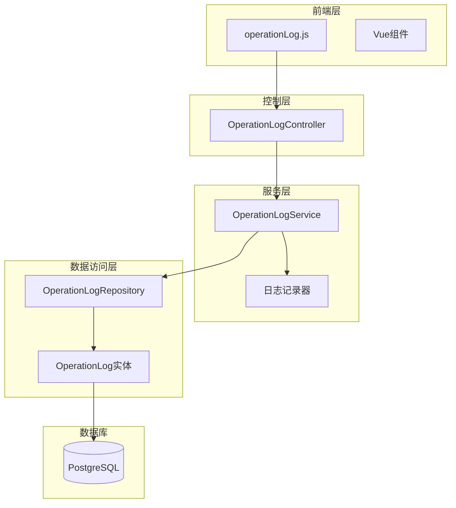
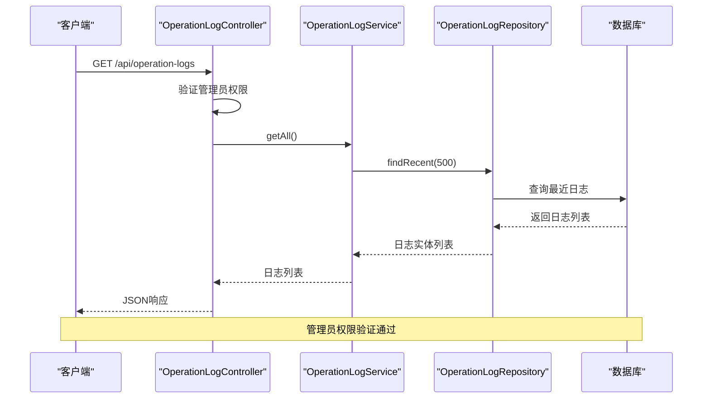
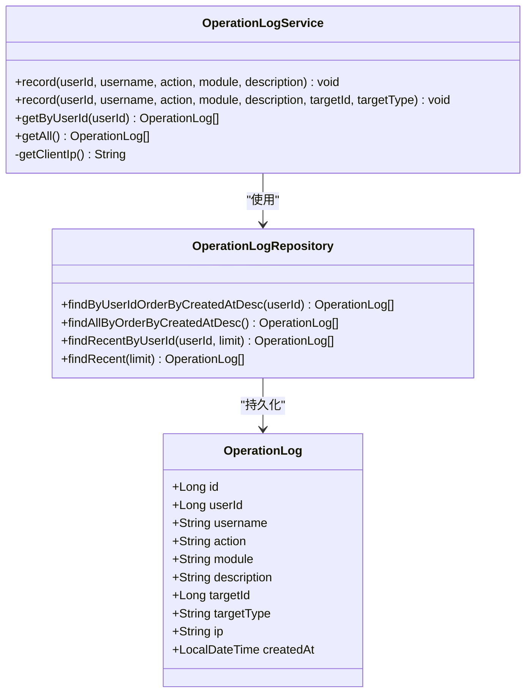
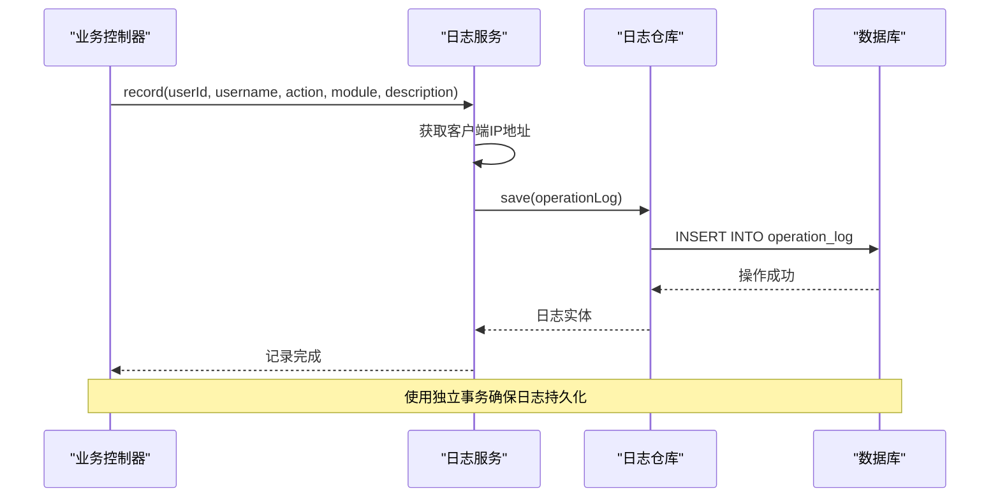
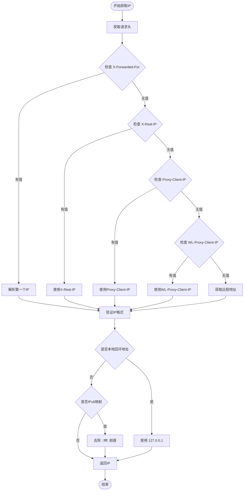
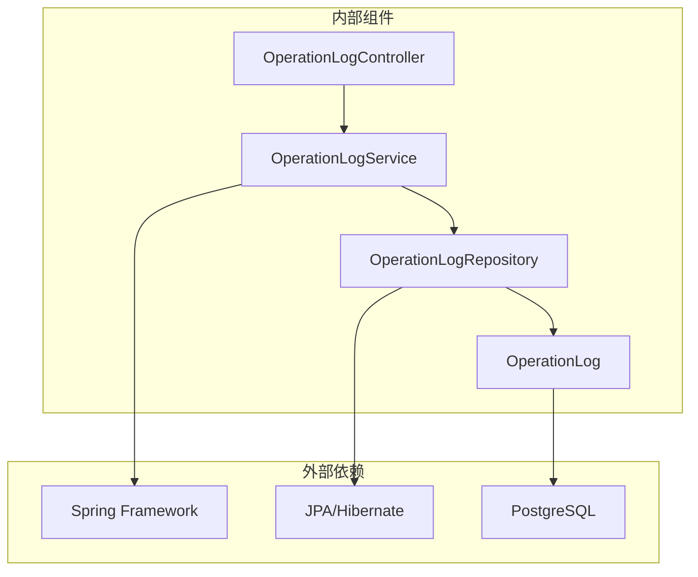

# 操作日志API

<cite>
**本文档引用的文件**
- [OperationLogController.java](file://src/main/java/com/superpower/modules/system/controller/OperationLogController.java)
- [OperationLogService.java](file://src/main/java/com/superpower/modules/system/service/OperationLogService.java)
- [OperationLogRepository.java](file://src/main/java/com/superpower/modules/system/repository/OperationLogRepository.java)
- [OperationLog.java](file://src/main/java/com/superpower/modules/system/entity/OperationLog.java)
- [operationLog.js](file://frontend/src/api/operationLog.js)
- [V1.0.6_add_last_login_at_and_operation_log.sql](file://db_changes/V1.0.6_add_last_login_at_and_operation_log.sql)
- [DataEntryController.java](file://src/main/java/com/superpower/modules/data/controller/DataEntryController.java)
- [ApprovalController.java](file://src/main/java/com/superpower/modules/approval/controller/ApprovalController.java)
</cite>

## 目录
1. [简介](#简介)
2. [项目结构](#项目结构)
3. [核心组件](#核心组件)
4. [架构概览](#架构概览)
5. [详细组件分析](#详细组件分析)
6. [依赖关系分析](#依赖关系分析)
7. [性能考虑](#性能考虑)
8. [故障排除指南](#故障排除指南)
9. [结论](#结论)
10. [附录](#附录)

## 简介
本文件为操作日志模块的全面API接口文档，涵盖系统操作日志的查询、统计、分析等功能。详细记录日志列表查询、日志详情获取、日志筛选过滤、日志统计分析等接口。包含操作类型分类、操作时间范围、操作用户筛选、操作对象查询等高级搜索功能。提供完整的日志管理接口规范，包括日志级别设置、保留策略、批量清理和导出功能。记录日志审计机制和合规性要求。

## 项目结构
操作日志模块采用经典的三层架构设计，包含控制层、服务层和数据访问层：

**图表来源**
- [OperationLogController.java:11-32](file://src/main/java/com/superpower/modules/system/controller/OperationLogController.java#L11-L32)
- [OperationLogService.java:16-76](file://src/main/java/com/superpower/modules/system/service/OperationLogService.java#L16-L76)
- [OperationLogRepository.java:9-19](file://src/main/java/com/superpower/modules/system/repository/OperationLogRepository.java#L9-L19)

**章节来源**
- [OperationLogController.java:1-33](file://src/main/java/com/superpower/modules/system/controller/OperationLogController.java#L1-L33)
- [OperationLogService.java:1-77](file://src/main/java/com/superpower/modules/system/service/OperationLogService.java#L1-L77)
- [OperationLogRepository.java:1-20](file://src/main/java/com/superpower/modules/system/repository/OperationLogRepository.java#L1-L20)

## 核心组件
操作日志模块包含以下核心组件：

### 数据模型
操作日志实体定义了完整的日志字段结构，支持详细的审计追踪需求。

### 控制器层
提供RESTful API接口，支持管理员权限访问的日志查询功能。

### 服务层
实现日志记录逻辑，包含IP地址获取、事务处理和异常处理机制。

### 数据访问层
基于Spring Data JPA提供日志查询和存储功能。

**章节来源**
- [OperationLog.java:1-42](file://src/main/java/com/superpower/modules/system/entity/OperationLog.java#L1-L42)
- [OperationLogController.java:1-33](file://src/main/java/com/superpower/modules/system/controller/OperationLogController.java#L1-L33)
- [OperationLogService.java:1-77](file://src/main/java/com/superpower/modules/system/service/OperationLogService.java#L1-L77)
- [OperationLogRepository.java:1-20](file://src/main/java/com/superpower/modules/system/repository/OperationLogRepository.java#L1-L20)

## 架构概览
操作日志模块采用分层架构设计，确保职责分离和代码可维护性：

**图表来源**
- [OperationLogController.java:27-31](file://src/main/java/com/superpower/modules/system/controller/OperationLogController.java#L27-L31)
- [OperationLogService.java:54-56](file://src/main/java/com/superpower/modules/system/service/OperationLogService.java#L54-L56)
- [OperationLogRepository.java:17-18](file://src/main/java/com/superpower/modules/system/repository/OperationLogRepository.java#L17-L18)

## 详细组件分析

### 数据模型设计
操作日志实体采用JPA注解映射，支持完整的审计追踪功能：

**图表来源**
- [OperationLog.java:10-41](file://src/main/java/com/superpower/modules/system/entity/OperationLog.java#L10-L41)
- [OperationLogRepository.java:9-19](file://src/main/java/com/superpower/modules/system/repository/OperationLogRepository.java#L9-L19)
- [OperationLogService.java:17-76](file://src/main/java/com/superpower/modules/system/service/OperationLogService.java#L17-L76)

### API接口规范

#### 日志查询接口
系统提供两种主要的日志查询接口：

**获取所有日志**
- 方法: GET
- 路径: `/api/operation-logs`
- 权限: ADMIN
- 响应: 日志列表（默认限制500条）

**按用户查询日志**
- 方法: GET
- 路径: `/api/operation-logs/user/{userId}`
- 权限: ADMIN
- 参数: userId (路径参数)
- 响应: 用户相关日志列表（默认限制200条）

**章节来源**
- [OperationLogController.java:21-31](file://src/main/java/com/superpower/modules/system/controller/OperationLogController.java#L21-L31)
- [operationLog.js:1-10](file://frontend/src/api/operationLog.js#L1-L10)

### 日志记录机制
系统在多个业务模块中集成日志记录功能，确保完整的操作审计：

**图表来源**
- [OperationLogService.java:31-48](file://src/main/java/com/superpower/modules/system/service/OperationLogService.java#L31-L48)
- [DataEntryController.java:137-138](file://src/main/java/com/superpower/modules/data/controller/DataEntryController.java#L137-L138)
- [ApprovalController.java:46-47](file://src/main/java/com/superpower/modules/approval/controller/ApprovalController.java#L46-L47)

**章节来源**
- [OperationLogService.java:27-48](file://src/main/java/com/superpower/modules/system/service/OperationLogService.java#L27-L48)
- [DataEntryController.java:133-315](file://src/main/java/com/superpower/modules/data/controller/DataEntryController.java#L133-L315)
- [ApprovalController.java:35-49](file://src/main/java/com/superpower/modules/approval/controller/ApprovalController.java#L35-L49)

### IP地址获取算法
系统实现了多层IP地址获取机制，确保准确识别客户端真实IP：

**图表来源**
- [OperationLogService.java:58-75](file://src/main/java/com/superpower/modules/system/service/OperationLogService.java#L58-L75)

**章节来源**
- [OperationLogService.java:58-75](file://src/main/java/com/superpower/modules/system/service/OperationLogService.java#L58-L75)

## 依赖关系分析

### 组件依赖图
操作日志模块的组件间依赖关系清晰明确：

**图表来源**
- [OperationLogController.java:1-33](file://src/main/java/com/superpower/modules/system/controller/OperationLogController.java#L1-L33)
- [OperationLogService.java:1-77](file://src/main/java/com/superpower/modules/system/service/OperationLogService.java#L1-L77)
- [OperationLogRepository.java:1-20](file://src/main/java/com/superpower/modules/system/repository/OperationLogRepository.java#L1-L20)

### 数据库设计
操作日志表采用优化的数据库设计，支持高效的查询和索引：

**表结构设计要点**:
- 主键自增ID确保唯一性
- user_id和created_at建立复合索引提升查询性能
- 字段长度合理配置避免存储浪费
- 默认时间戳自动记录创建时间

**章节来源**
- [V1.0.6_add_last_login_at_and_operation_log.sql:3-17](file://db_changes/V1.0.6_add_last_login_at_and_operation_log.sql#L3-L17)

## 性能考虑
操作日志模块在设计时充分考虑了性能优化：

### 查询性能优化
- 默认限制查询数量防止内存溢出
- 数据库索引优化查询性能
- 分页查询支持大数据量场景

### 存储优化
- 合理的字段长度配置
- 事务隔离级别优化
- 异步处理潜在的性能瓶颈

## 故障排除指南

### 常见问题及解决方案

**日志记录失败**
- 检查数据库连接状态
- 验证表结构完整性
- 查看应用日志获取详细错误信息

**IP地址识别异常**
- 检查代理服务器配置
- 验证请求头传递
- 确认网络环境配置

**权限访问问题**
- 确认用户角色为ADMIN
- 检查安全配置
- 验证JWT令牌有效性

**章节来源**
- [OperationLogService.java:45-47](file://src/main/java/com/superpower/modules/system/service/OperationLogService.java#L45-L47)

## 结论
操作日志模块提供了完整的审计追踪功能，支持管理员权限访问的日志查询和分析。模块采用清晰的分层架构设计，确保了良好的可维护性和扩展性。通过集成化的日志记录机制，系统能够全面追踪用户操作行为，满足审计和合规性要求。

## 附录

### API接口完整列表
- GET `/api/operation-logs` - 获取所有日志
- GET `/api/operation-logs/user/{userId}` - 按用户查询日志

### 数据库表结构
- 表名: operation_log
- 主键: id
- 关键索引: user_id, created_at
- 字段: user_id, username, action, module, description, target_id, target_type, ip, created_at

### 安全配置
- 所有接口需要ADMIN角色权限
- 基于JWT的认证机制
- 请求头IP地址自动获取

**章节来源**
- [V1.0.6_add_last_login_at_and_operation_log.sql:3-17](file://db_changes/V1.0.6_add_last_login_at_and_operation_log.sql#L3-L17)
- [OperationLogController.java:21-31](file://src/main/java/com/superpower/modules/system/controller/OperationLogController.java#L21-L31)