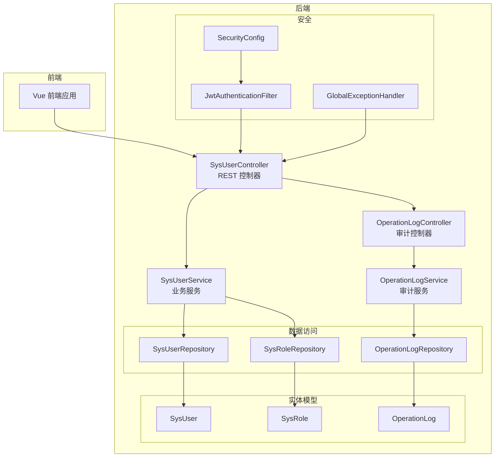
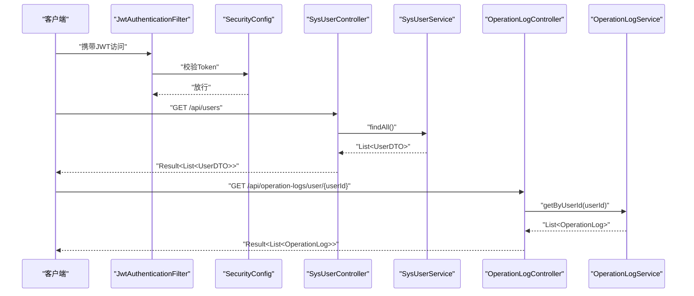
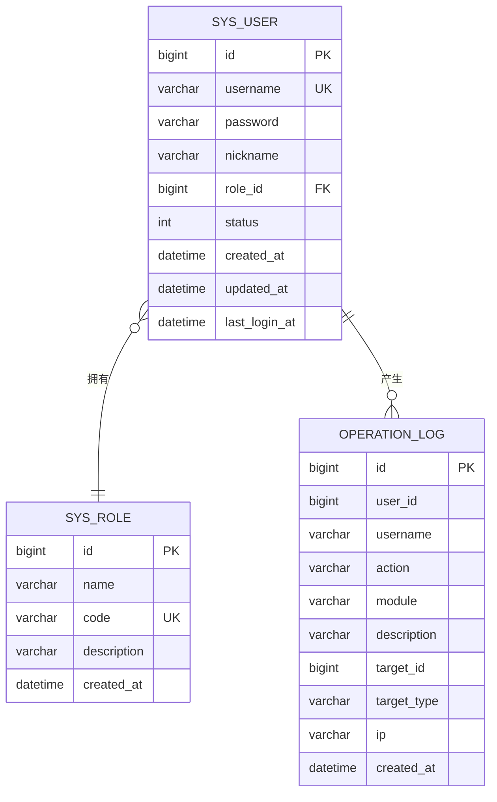
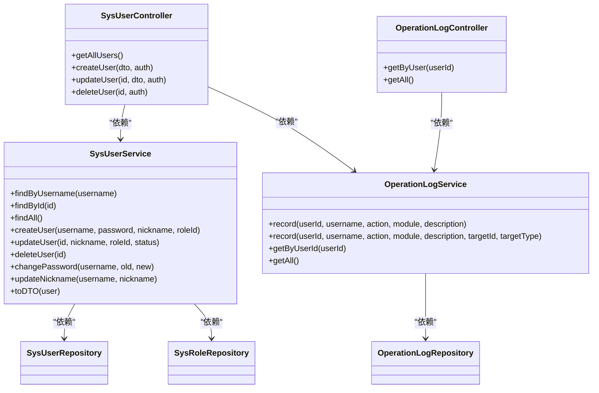

# 用户管理API

<cite>
**本文引用的文件**
- [SysUserController.java](file://src/main/java/com/superpower/modules/system/controller/SysUserController.java)
- [SysUserService.java](file://src/main/java/com/superpower/modules/system/service/SysUserService.java)
- [UserDTO.java](file://src/main/java/com/superpower/modules/system/dto/UserDTO.java)
- [SysUser.java](file://src/main/java/com/superpower/modules/system/entity/SysUser.java)
- [SysUserRepository.java](file://src/main/java/com/superpower/modules/system/repository/SysUserRepository.java)
- [OperationLogController.java](file://src/main/java/com/superpower/modules/system/controller/OperationLogController.java)
- [OperationLogService.java](file://src/main/java/com/superpower/modules/system/service/OperationLogService.java)
- [OperationLog.java](file://src/main/java/com/superpower/modules/system/entity/OperationLog.java)
- [SysRole.java](file://src/main/java/com/superpower/modules/system/entity/SysRole.java)
- [OnlineTracker.java](file://src/main/java/com/superpower/security/OnlineTracker.java)
- [SecurityConfig.java](file://src/main/java/com/superpower/config/SecurityConfig.java)
- [JwtAuthenticationFilter.java](file://src/main/java/com/superpower/security/JwtAuthenticationFilter.java)
- [GlobalExceptionHandler.java](file://src/main/java/com/superpower/common/GlobalExceptionHandler.java)
- [Result.java](file://src/main/java/com/superpower/common/Result.java)
- [ResultCode.java](file://src/main/java/com/superpower/common/ResultCode.java)
</cite>

## 目录
1. [简介](#简介)
2. [项目结构](#项目结构)
3. [核心组件](#核心组件)
4. [架构总览](#架构总览)
5. [详细组件分析](#详细组件分析)
6. [依赖关系分析](#依赖关系分析)
7. [性能考虑](#性能考虑)
8. [故障排除指南](#故障排除指南)
9. [结论](#结论)

## 简介
本文件为用户管理模块的API接口文档，覆盖用户查询、创建、更新、删除等核心CRUD操作，并详细说明用户状态管理、角色关联、权限验证与安全控制机制。同时记录操作日志与审计追踪能力，提供请求参数说明、响应数据结构、错误码定义及使用示例。

## 项目结构
用户管理模块位于后端系统中，采用分层架构：控制器层负责HTTP接口暴露，服务层处理业务逻辑，仓储层访问数据库，实体层映射表结构。安全控制通过Spring Security与JWT过滤器实现，操作日志独立模块记录审计信息。

图表来源
- [SysUserController.java:14-66](file://src/main/java/com/superpower/modules/system/controller/SysUserController.java#L14-L66)
- [SysUserService.java:15-113](file://src/main/java/com/superpower/modules/system/service/SysUserService.java#L15-L113)
- [OperationLogController.java:11-32](file://src/main/java/com/superpower/modules/system/controller/OperationLogController.java#L11-L32)
- [OperationLogService.java:16-76](file://src/main/java/com/superpower/modules/system/service/OperationLogService.java#L16-L76)
- [SysUserRepository.java:8-12](file://src/main/java/com/superpower/modules/system/repository/SysUserRepository.java#L8-L12)
- [SysRole.java:7-26](file://src/main/java/com/superpower/modules/system/entity/SysRole.java#L7-L26)
- [OperationLog.java:7-41](file://src/main/java/com/superpower/modules/system/entity/OperationLog.java#L7-L41)
- [SecurityConfig.java](file://src/main/java/com/superpower/config/SecurityConfig.java)
- [JwtAuthenticationFilter.java](file://src/main/java/com/superpower/security/JwtAuthenticationFilter.java)
- [GlobalExceptionHandler.java](file://src/main/java/com/superpower/common/GlobalExceptionHandler.java)

章节来源
- [SysUserController.java:14-66](file://src/main/java/com/superpower/modules/system/controller/SysUserController.java#L14-L66)
- [SysUserService.java:15-113](file://src/main/java/com/superpower/modules/system/service/SysUserService.java#L15-L113)
- [OperationLogController.java:11-32](file://src/main/java/com/superpower/modules/system/controller/OperationLogController.java#L11-L32)
- [OperationLogService.java:16-76](file://src/main/java/com/superpower/modules/system/service/OperationLogService.java#L16-L76)

## 核心组件
- 控制器层：SysUserController 提供用户管理的REST接口；OperationLogController 提供操作日志查询接口。
- 服务层：SysUserService 处理用户创建、更新、删除、状态变更、昵称修改、密码修改、DTO转换与在线状态计算；OperationLogService 负责记录操作日志并提取最近日志。
- 数据访问层：SysUserRepository、OperationLogRepository、SysRoleRepository 提供JPA数据访问能力。
- 实体层：SysUser、SysRole、OperationLog 映射数据库表结构。
- 安全层：SecurityConfig 配置安全策略；JwtAuthenticationFilter 进行JWT认证；GlobalExceptionHandler 统一异常处理。
- 工具类：OnlineTracker 计算用户在线状态。

章节来源
- [SysUserController.java:18-24](file://src/main/java/com/superpower/modules/system/controller/SysUserController.java#L18-L24)
- [SysUserService.java:18-31](file://src/main/java/com/superpower/modules/system/service/SysUserService.java#L18-L31)
- [OperationLogController.java:15-19](file://src/main/java/com/superpower/modules/system/controller/OperationLogController.java#L15-L19)
- [OperationLogService.java:21-25](file://src/main/java/com/superpower/modules/system/service/OperationLogService.java#L21-L25)
- [SysUserRepository.java:8-12](file://src/main/java/com/superpower/modules/system/repository/SysUserRepository.java#L8-L12)
- [SysRole.java:7-26](file://src/main/java/com/superpower/modules/system/entity/SysRole.java#L7-L26)
- [OperationLog.java:7-41](file://src/main/java/com/superpower/modules/system/entity/OperationLog.java#L7-L41)
- [SecurityConfig.java](file://src/main/java/com/superpower/config/SecurityConfig.java)
- [JwtAuthenticationFilter.java](file://src/main/java/com/superpower/security/JwtAuthenticationFilter.java)
- [GlobalExceptionHandler.java](file://src/main/java/com/superpower/common/GlobalExceptionHandler.java)
- [OnlineTracker.java:12-42](file://src/main/java/com/superpower/security/OnlineTracker.java#L12-L42)

## 架构总览
用户管理API遵循REST规范，通过JWT进行身份认证，基于Spring Security进行授权控制。所有用户相关操作均会触发操作日志记录，支持按用户或全局查询审计记录。

图表来源
- [SysUserController.java:26-30](file://src/main/java/com/superpower/modules/system/controller/SysUserController.java#L26-L30)
- [SysUserService.java:42-44](file://src/main/java/com/superpower/modules/system/service/SysUserService.java#L42-L44)
- [OperationLogController.java:21-25](file://src/main/java/com/superpower/modules/system/controller/OperationLogController.java#L21-L25)
- [OperationLogService.java:50-52](file://src/main/java/com/superpower/modules/system/service/OperationLogService.java#L50-L52)

## 详细组件分析

### 用户管理接口

#### 获取用户列表
- 方法与路径：GET /api/users
- 权限要求：需要认证（由安全配置统一拦截）
- 请求参数：无
- 响应数据：Result<List<UserDTO>>
- 业务逻辑：调用服务层查询所有用户并转换为DTO列表
- 错误处理：异常由全局处理器统一返回标准错误格式

章节来源
- [SysUserController.java:26-30](file://src/main/java/com/superpower/modules/system/controller/SysUserController.java#L26-L30)
- [SysUserService.java:42-44](file://src/main/java/com/superpower/modules/system/service/SysUserService.java#L42-L44)
- [Result.java](file://src/main/java/com/superpower/common/Result.java)
- [GlobalExceptionHandler.java](file://src/main/java/com/superpower/common/GlobalExceptionHandler.java)

#### 创建用户
- 方法与路径：POST /api/users
- 权限要求：需要认证（由安全配置统一拦截）
- 请求头：Content-Type: application/json
- 请求体字段：username, nickname, roleId
- 响应数据：Result<UserDTO>
- 业务逻辑：
  - 校验用户名唯一性
  - 校验角色存在性
  - 密码加密存储
  - 默认状态启用
  - 记录操作日志（类型：CREATE）
- 错误处理：重复用户名、角色不存在、保存异常等抛出业务异常

章节来源
- [SysUserController.java:32-39](file://src/main/java/com/superpower/modules/system/controller/SysUserController.java#L32-L39)
- [SysUserService.java:50-66](file://src/main/java/com/superpower/modules/system/service/SysUserService.java#L50-L66)
- [SysUserRepository.java:8-12](file://src/main/java/com/superpower/modules/system/repository/SysUserRepository.java#L8-L12)
- [SysRole.java:7-26](file://src/main/java/com/superpower/modules/system/entity/SysRole.java#L7-L26)
- [OperationLogService.java:27-48](file://src/main/java/com/superpower/modules/system/service/OperationLogService.java#L27-L48)

#### 更新用户
- 方法与路径：PUT /api/users/{id}
- 权限要求：需要认证
- 路径参数：id（Long）
- 请求体字段：nickname（可选）、roleId（可选）、status（可选）
- 响应数据：Result<Void>
- 业务逻辑：
  - 根据ID查找用户，不存在则抛出异常
  - 可选字段按需更新（昵称、角色、状态）
  - 记录操作日志（类型：UPDATE）
- 错误处理：用户不存在、角色不存在等

章节来源
- [SysUserController.java:41-47](file://src/main/java/com/superpower/modules/system/controller/SysUserController.java#L41-L47)
- [SysUserService.java:68-79](file://src/main/java/com/superpower/modules/system/service/SysUserService.java#L68-L79)
- [OperationLogService.java:31-48](file://src/main/java/com/superpower/modules/system/service/OperationLogService.java#L31-L48)

#### 删除用户
- 方法与路径：DELETE /api/users/{id}
- 权限要求：需要认证
- 路径参数：id（Long）
- 响应数据：Result<Void>
- 业务逻辑：
  - 先查询用户以生成描述信息（优先使用昵称）
  - 删除用户
  - 记录操作日志（类型：DELETE）
- 错误处理：删除异常

章节来源
- [SysUserController.java:49-57](file://src/main/java/com/superpower/modules/system/controller/SysUserController.java#L49-L57)
- [SysUserService.java:81-83](file://src/main/java/com/superpower/modules/system/service/SysUserService.java#L81-L83)
- [OperationLogService.java:31-48](file://src/main/java/com/superpower/modules/system/service/OperationLogService.java#L31-L48)

#### 用户状态与在线状态
- 状态字段：status（整型），默认启用
- 在线状态：通过OnlineTracker根据最近活跃时间判断是否在线
- DTO映射：toDTO时注入online标志

章节来源
- [SysUser.java:28-29](file://src/main/java/com/superpower/modules/system/entity/SysUser.java#L28-L29)
- [SysUserService.java:100-112](file://src/main/java/com/superpower/modules/system/service/SysUserService.java#L100-L112)
- [OnlineTracker.java:31-35](file://src/main/java/com/superpower/security/OnlineTracker.java#L31-L35)

#### 角色关联
- 用户与角色为多对一关系
- 创建/更新时校验角色存在性
- DTO包含角色名称与编码

章节来源
- [SysUser.java:24-26](file://src/main/java/com/superpower/modules/system/entity/SysUser.java#L24-L26)
- [SysUserService.java:54-55](file://src/main/java/com/superpower/modules/system/service/SysUserService.java#L54-L55)
- [SysUserService.java:72-75](file://src/main/java/com/superpower/modules/system/service/SysUserService.java#L72-L75)
- [SysRole.java:7-26](file://src/main/java/com/superpower/modules/system/entity/SysRole.java#L7-L26)
- [UserDTO.java:7-17](file://src/main/java/com/superpower/modules/system/dto/UserDTO.java#L7-L17)

### 操作日志与审计追踪

#### 查询用户操作日志
- 方法与路径：GET /api/operation-logs/user/{userId}
- 权限要求：ADMIN角色
- 响应数据：Result<List<OperationLog>>
- 业务逻辑：查询指定用户的最近操作日志（限制条数）

章节来源
- [OperationLogController.java:21-25](file://src/main/java/com/superpower/modules/system/controller/OperationLogController.java#L21-L25)
- [OperationLogService.java:50-52](file://src/main/java/com/superpower/modules/system/service/OperationLogService.java#L50-L52)

#### 查询全局操作日志
- 方法与路径：GET /api/operation-logs
- 权限要求：ADMIN角色
- 响应数据：Result<List<OperationLog>>
- 业务逻辑：查询最近的操作日志列表（限制条数）

章节来源
- [OperationLogController.java:27-31](file://src/main/java/com/superpower/modules/system/controller/OperationLogController.java#L27-L31)
- [OperationLogService.java:54-56](file://src/main/java/com/superpower/modules/system/service/OperationLogService.java#L54-L56)

#### 日志记录机制
- 记录内容：用户ID/名称、操作类型、模块、描述、目标ID/类型、IP地址
- 异步事务：使用REQUIRES_NEW传播级别确保日志写入独立事务
- IP解析：兼容多种代理头，处理IPv6本地回环

章节来源
- [OperationLogService.java:27-48](file://src/main/java/com/superpower/modules/system/service/OperationLogService.java#L27-L48)
- [OperationLogService.java:58-75](file://src/main/java/com/superpower/modules/system/service/OperationLogService.java#L58-L75)
- [OperationLog.java:7-41](file://src/main/java/com/superpower/modules/system/entity/OperationLog.java#L7-L41)

### 数据模型

图表来源
- [SysUser.java:10-39](file://src/main/java/com/superpower/modules/system/entity/SysUser.java#L10-L39)
- [SysRole.java:10-26](file://src/main/java/com/superpower/modules/system/entity/SysRole.java#L10-L26)
- [OperationLog.java:10-41](file://src/main/java/com/superpower/modules/system/entity/OperationLog.java#L10-L41)

## 依赖关系分析

图表来源
- [SysUserController.java:18-24](file://src/main/java/com/superpower/modules/system/controller/SysUserController.java#L18-L24)
- [SysUserService.java:18-31](file://src/main/java/com/superpower/modules/system/service/SysUserService.java#L18-L31)
- [OperationLogController.java:15-19](file://src/main/java/com/superpower/modules/system/controller/OperationLogController.java#L15-L19)
- [OperationLogService.java:21-25](file://src/main/java/com/superpower/modules/system/service/OperationLogService.java#L21-L25)

章节来源
- [SysUserController.java:18-24](file://src/main/java/com/superpower/modules/system/controller/SysUserController.java#L18-L24)
- [SysUserService.java:18-31](file://src/main/java/com/superpower/modules/system/service/SysUserService.java#L18-L31)
- [OperationLogController.java:15-19](file://src/main/java/com/superpower/modules/system/controller/OperationLogController.java#L15-L19)
- [OperationLogService.java:21-25](file://src/main/java/com/superpower/modules/system/service/OperationLogService.java#L21-L25)

## 性能考虑
- DTO转换：在查询用户列表时，服务层批量转换为DTO，避免在控制器层做复杂映射。
- 在线状态：OnlineTracker使用并发Map存储用户活跃时间，查询O(1)，定期清理过期记录。
- 日志写入：使用独立事务（REQUIRES_NEW）保证日志持久化可靠性，避免阻塞主业务。
- 分页建议：当前接口未内置分页，如用户量较大，建议在服务层增加分页查询以提升性能。

## 故障排除指南
- 通用错误响应：后端通过全局异常处理器统一返回标准错误格式，包含错误码与消息。
- 常见错误场景：
  - 用户名已存在：创建用户时用户名重复
  - 角色不存在：创建/更新用户时roleId无效
  - 用户不存在：更新/删除用户时ID无效
  - 当前密码不正确：修改密码时旧密码校验失败
- 排查步骤：
  - 检查请求参数完整性与类型
  - 确认角色是否存在且有效
  - 查看操作日志接口确认管理员权限
  - 关注服务层异常栈与日志输出

章节来源
- [GlobalExceptionHandler.java](file://src/main/java/com/superpower/common/GlobalExceptionHandler.java)
- [SysUserService.java:51-53](file://src/main/java/com/superpower/modules/system/service/SysUserService.java#L51-L53)
- [SysUserService.java:69-70](file://src/main/java/com/superpower/modules/system/service/SysUserService.java#L69-L70)
- [SysUserService.java:85-89](file://src/main/java/com/superpower/modules/system/service/SysUserService.java#L85-L89)
- [OperationLogController.java:22-29](file://src/main/java/com/superpower/modules/system/controller/OperationLogController.java#L22-L29)

## 结论
用户管理API提供了完整的CRUD能力，结合角色与状态管理、JWT认证与权限控制、以及完善的操作日志与审计追踪，满足企业级系统的用户管理需求。建议在高并发场景下引入分页与缓存策略，并持续完善异常监控与告警机制。