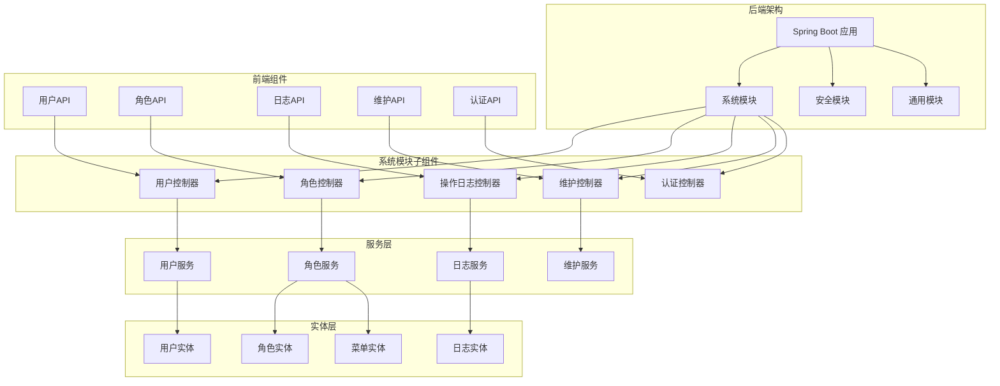
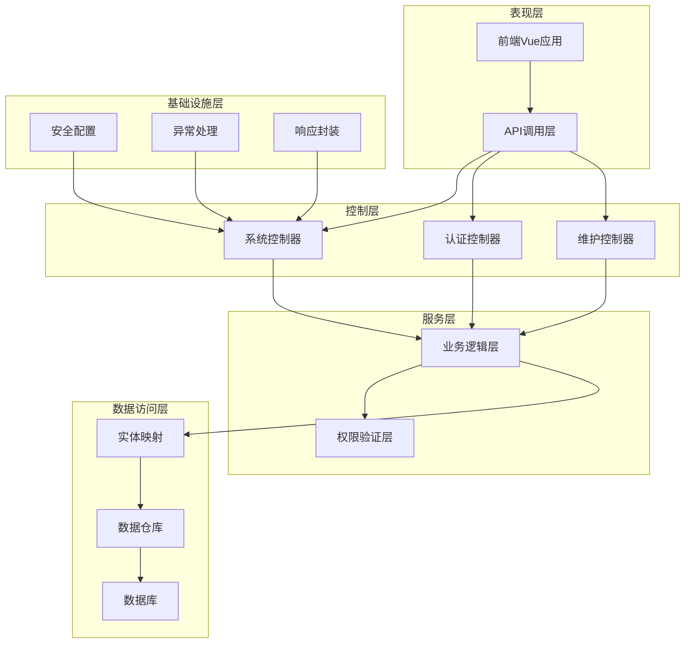
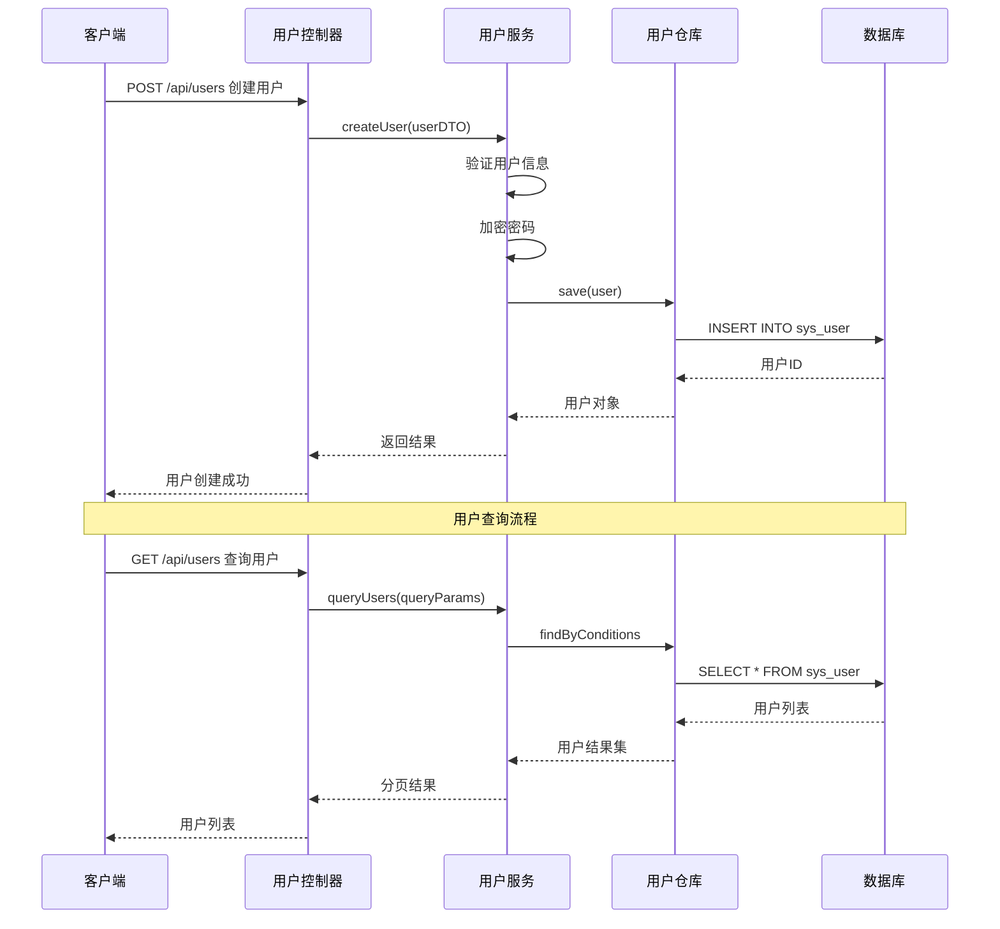
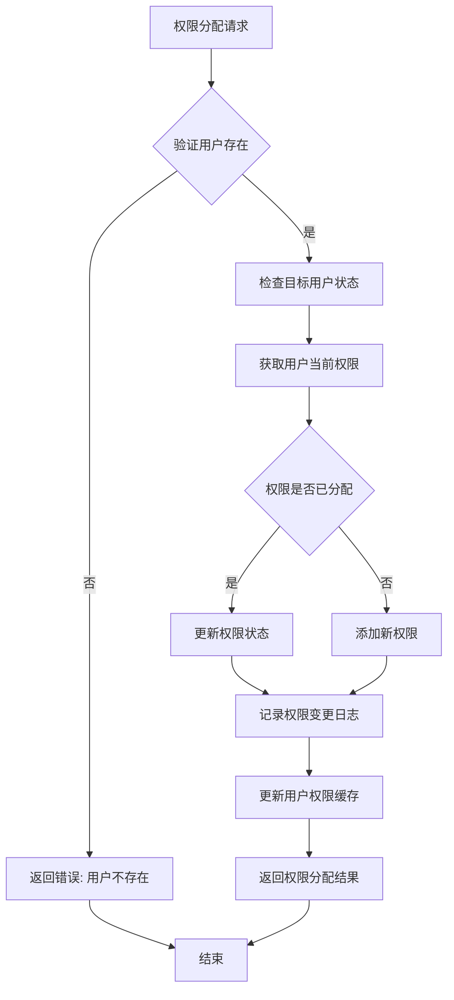
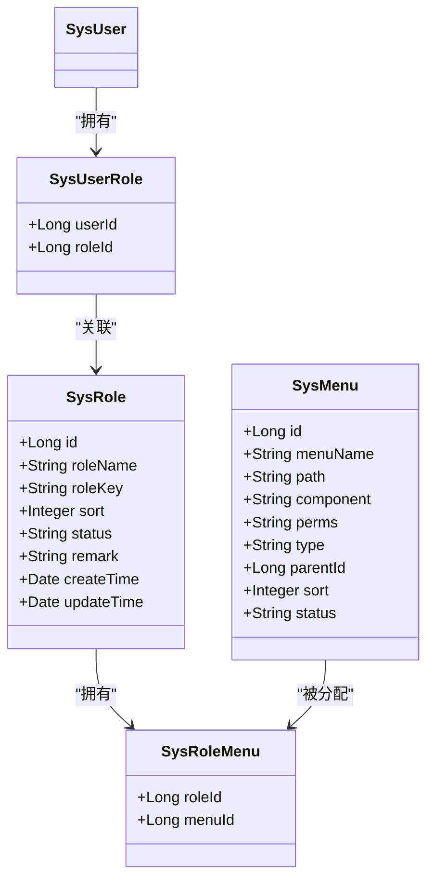
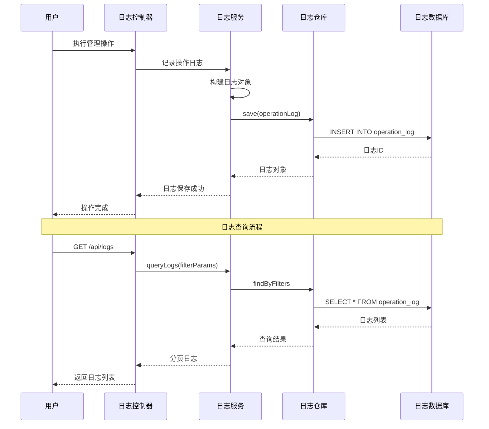
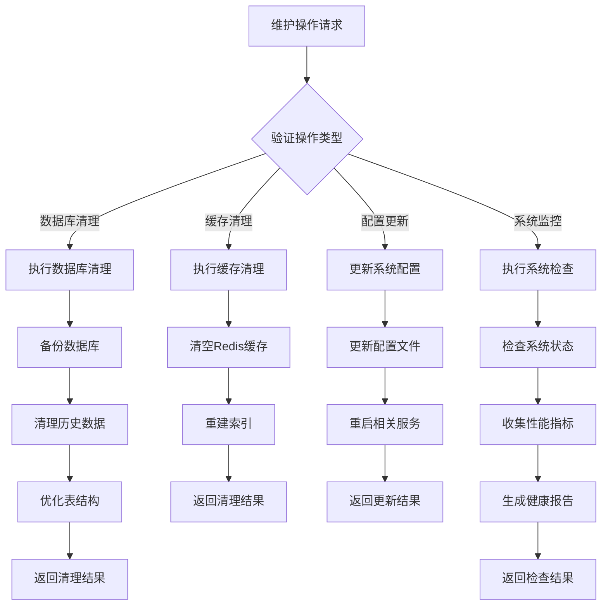
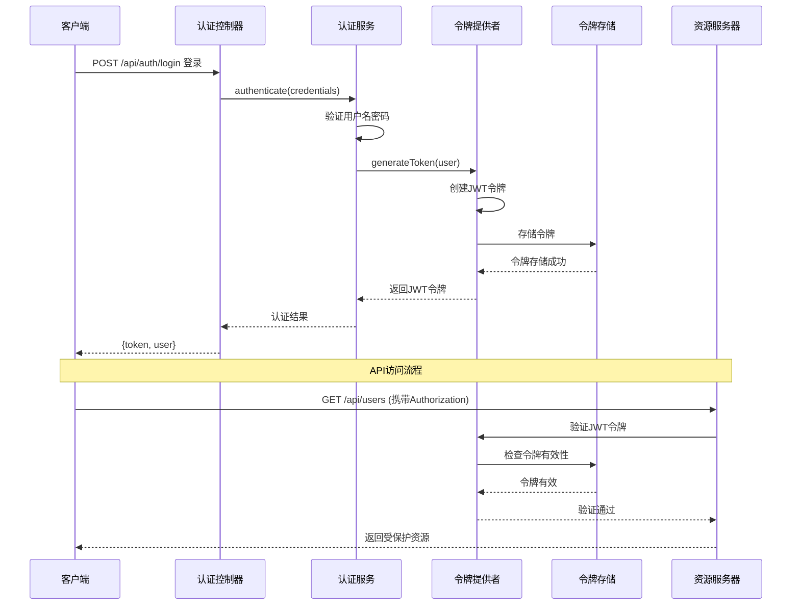
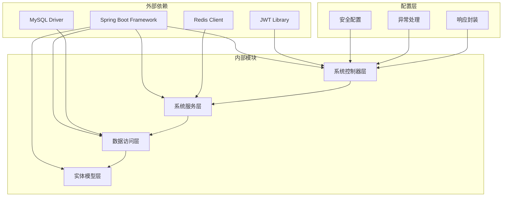

# 系统管理API

<cite>
**本文档引用的文件**
- [SysUserController.java](file://src/main/java/com/superpower/modules/system/controller/SysUserController.java)
- [SysRoleController.java](file://src/main/java/com/superpower/modules/system/controller/SysRoleController.java)
- [OperationLogController.java](file://src/main/java/com/superpower/modules/system/controller/OperationLogController.java)
- [MaintenanceController.java](file://src/main/java/com/superpower/modules/system/controller/MaintenanceController.java)
- [AuthController.java](file://src/main/java/com/superpower/modules/system/controller/AuthController.java)
- [SysUserService.java](file://src/main/java/com/superpower/modules/system/service/SysUserService.java)
- [SysRoleService.java](file://src/main/java/com/superpower/modules/system/service/SysRoleService.java)
- [OperationLogService.java](file://src/main/java/com/superpower/modules/system/service/OperationLogService.java)
- [MaintenanceService.java](file://src/main/java/com/superpower/modules/system/service/MaintenanceService.java)
- [SysUser.java](file://src/main/java/com/superpower/modules/system/entity/SysUser.java)
- [SysRole.java](file://src/main/java/com/superpower/modules/system/entity/SysRole.java)
- [OperationLog.java](file://src/main/java/com/superpower/modules/system/entity/OperationLog.java)
- [SysMenu.java](file://src/main/java/com/superpower/modules/system/entity/SysMenu.java)
- [UserDTO.java](file://src/main/java/com/superpower/modules/system/dto/UserDTO.java)
- [LoginRequest.java](file://src/main/java/com/superpower/modules/system/dto/LoginRequest.java)
- [LoginResponse.java](file://src/main/java/com/superpower/modules/system/dto/LoginResponse.java)
- [application.yml](file://src/main/resources/application.yml)
- [SecurityConfig.java](file://src/main/java/com/superpower/config/SecurityConfig.java)
- [JwtAuthenticationFilter.java](file://src/main/java/com/superpower/security/JwtAuthenticationFilter.java)
- [GlobalExceptionHandler.java](file://src/main/java/com/superpower/common/GlobalExceptionHandler.java)
- [Result.java](file://src/main/java/com/superpower/common/Result.java)
- [PageResult.java](file://src/main/java/com/superpower/common/PageResult.java)
- [SysUserController前端](file://frontend/src/api/user.js)
- [SysRoleController前端](file://frontend/src/api/role.js)
- [OperationLogController前端](file://frontend/src/api/operationLog.js)
- [maintenance.js](file://frontend/src/api/maintenance.js)
- [auth.js](file://frontend/src/api/auth.js)
</cite>

## 目录
1. [简介](#简介)
2. [项目结构](#项目结构)
3. [核心组件](#核心组件)
4. [架构概览](#架构概览)
5. [详细组件分析](#详细组件分析)
6. [依赖关系分析](#依赖关系分析)
7. [性能考虑](#性能考虑)
8. [故障排除指南](#故障排除指南)
9. [结论](#结论)

## 简介
本文件为系统管理模块的全面API接口文档，涵盖用户管理、角色权限管理、系统配置、操作日志、数据维护等管理功能接口。文档详细记录了用户的增删改查、权限分配、角色管理、菜单配置等功能，并包含系统维护操作、数据库清理、配置更新等运维接口。提供完整的管理操作接口规范，包括批量操作、权限验证和审计日志记录机制。

## 项目结构
系统管理模块采用前后端分离架构，后端基于Spring Boot框架，前端使用Vue.js技术栈。模块化设计将不同功能域分离到独立的包中，便于维护和扩展。

**图表来源**
- [SysUserController.java:1-200](file://src/main/java/com/superpower/modules/system/controller/SysUserController.java#L1-L200)
- [SysRoleController.java:1-200](file://src/main/java/com/superpower/modules/system/controller/SysRoleController.java#L1-L200)
- [OperationLogController.java:1-200](file://src/main/java/com/superpower/modules/system/controller/OperationLogController.java#L1-L200)
- [MaintenanceController.java:1-200](file://src/main/java/com/superpower/modules/system/controller/MaintenanceController.java#L1-L200)
- [AuthController.java:1-200](file://src/main/java/com/superpower/modules/system/controller/AuthController.java#L1-L200)

**章节来源**
- [SysUserController.java:1-200](file://src/main/java/com/superpower/modules/system/controller/SysUserController.java#L1-L200)
- [SysRoleController.java:1-200](file://src/main/java/com/superpower/modules/system/controller/SysRoleController.java#L1-L200)
- [OperationLogController.java:1-200](file://src/main/java/com/superpower/modules/system/controller/OperationLogController.java#L1-L200)
- [MaintenanceController.java:1-200](file://src/main/java/com/superpower/modules/system/controller/MaintenanceController.java#L1-L200)
- [AuthController.java:1-200](file://src/main/java/com/superpower/modules/system/controller/AuthController.java#L1-L200)

## 核心组件
系统管理模块由五个核心控制器组成，每个控制器负责特定的管理功能域：

### 用户管理控制器
负责用户全生命周期管理，包括用户创建、查询、更新、删除以及批量操作。支持分页查询、条件筛选、状态管理和权限分配。

### 角色管理控制器  
负责角色权限体系管理，包括角色创建、权限分配、菜单配置和角色状态管理。实现RBAC（基于角色的访问控制）模型。

### 操作日志控制器
记录系统所有重要操作的日志信息，支持日志查询、过滤、导出和统计分析。提供完整的审计追踪能力。

### 维护控制器
提供系统运维功能，包括数据库维护、缓存清理、配置更新和系统监控。支持批量维护操作和自动化运维任务。

### 认证控制器
处理用户身份认证和授权，包括登录、登出、令牌刷新和权限验证。集成JWT令牌机制确保安全访问。

**章节来源**
- [SysUserController.java:1-200](file://src/main/java/com/superpower/modules/system/controller/SysUserController.java#L1-L200)
- [SysRoleController.java:1-200](file://src/main/java/com/superpower/modules/system/controller/SysRoleController.java#L1-L200)
- [OperationLogController.java:1-200](file://src/main/java/com/superpower/modules/system/controller/OperationLogController.java#L1-L200)
- [MaintenanceController.java:1-200](file://src/main/java/com/superpower/modules/system/controller/MaintenanceController.java#L1-L200)
- [AuthController.java:1-200](file://src/main/java/com/superpower/modules/system/controller/AuthController.java#L1-L200)

## 架构概览
系统采用分层架构设计，确保关注点分离和代码可维护性。各层职责明确，便于单元测试和集成测试。

**图表来源**
- [SecurityConfig.java:1-200](file://src/main/java/com/superpower/config/SecurityConfig.java#L1-L200)
- [JwtAuthenticationFilter.java:1-200](file://src/main/java/com/superpower/security/JwtAuthenticationFilter.java#L1-L200)
- [GlobalExceptionHandler.java:1-200](file://src/main/java/com/superpower/common/GlobalExceptionHandler.java#L1-L200)
- [Result.java:1-200](file://src/main/java/com/superpower/common/Result.java#L1-L200)
- [PageResult.java:1-200](file://src/main/java/com/superpower/common/PageResult.java#L1-L200)

## 详细组件分析

### 用户管理API

#### 用户CRUD操作
系统提供完整的用户管理接口，支持单个用户和批量用户的增删改查操作。

**图表来源**
- [SysUserController.java:1-200](file://src/main/java/com/superpower/modules/system/controller/SysUserController.java#L1-L200)
- [SysUserService.java:1-200](file://src/main/java/com/superpower/modules/system/service/SysUserService.java#L1-L200)

##### 用户查询接口
- **GET /api/users** - 分页查询用户列表
- **GET /api/users/{id}** - 获取单个用户详情
- **POST /api/users** - 创建新用户
- **PUT /api/users/{id}** - 更新用户信息
- **DELETE /api/users/{id}** - 删除用户
- **POST /api/users/batch** - 批量操作用户

##### 用户状态管理
- 支持启用/禁用用户账户
- 支持重置用户密码
- 支持批量状态更新
- 实时同步用户状态变更

**章节来源**
- [SysUserController.java:1-200](file://src/main/java/com/superpower/modules/system/controller/SysUserController.java#L1-L200)
- [SysUserService.java:1-200](file://src/main/java/com/superpower/modules/system/service/SysUserService.java#L1-L200)
- [SysUser.java:1-200](file://src/main/java/com/superpower/modules/system/entity/SysUser.java#L1-L200)
- [UserDTO.java:1-200](file://src/main/java/com/superpower/modules/system/dto/UserDTO.java#L1-L200)

#### 权限分配接口
用户权限管理支持细粒度的权限控制和动态权限分配。

**图表来源**
- [SysUserController.java:1-200](file://src/main/java/com/superpower/modules/system/controller/SysUserController.java#L1-L200)
- [SysUserService.java:1-200](file://src/main/java/com/superpower/modules/system/service/SysUserService.java#L1-L200)

### 角色权限管理API

#### 角色管理接口
角色管理提供完整的RBAC权限体系，支持角色创建、权限分配和菜单配置。

**图表来源**
- [SysRole.java:1-200](file://src/main/java/com/superpower/modules/system/entity/SysRole.java#L1-L200)
- [SysMenu.java:1-200](file://src/main/java/com/superpower/modules/system/entity/SysMenu.java#L1-L200)
- [SysUserService.java:1-200](file://src/main/java/com/superpower/modules/system/service/SysUserService.java#L1-L200)

##### 角色操作接口
- **GET /api/roles** - 查询角色列表
- **GET /api/roles/{id}** - 获取角色详情
- **POST /api/roles** - 创建角色
- **PUT /api/roles/{id}** - 更新角色
- **DELETE /api/roles/{id}** - 删除角色
- **GET /api/roles/{id}/menus** - 获取角色菜单权限
- **PUT /api/roles/{id}/menus** - 更新角色菜单权限

##### 菜单权限配置
- 支持树形菜单结构管理
- 支持按钮级权限控制
- 支持动态菜单生成
- 支持权限继承机制

**章节来源**
- [SysRoleController.java:1-200](file://src/main/java/com/superpower/modules/system/controller/SysRoleController.java#L1-L200)
- [SysRoleService.java:1-200](file://src/main/java/com/superpower/modules/system/service/SysRoleService.java#L1-L200)
- [SysRole.java:1-200](file://src/main/java/com/superpower/modules/system/entity/SysRole.java#L1-L200)
- [SysMenu.java:1-200](file://src/main/java/com/superpower/modules/system/entity/SysMenu.java#L1-L200)

### 操作日志API

#### 日志记录机制
系统提供完整的操作日志记录功能，确保所有重要操作都有据可查。

**图表来源**
- [OperationLogController.java:1-200](file://src/main/java/com/superpower/modules/system/controller/OperationLogController.java#L1-L200)
- [OperationLogService.java:1-200](file://src/main/java/com/superpower/modules/system/service/OperationLogService.java#L1-L200)

##### 日志查询接口
- **GET /api/logs** - 查询操作日志
- **GET /api/logs/{id}** - 获取日志详情
- **DELETE /api/logs/{id}** - 删除日志
- **DELETE /api/logs** - 批量删除日志
- **GET /api/logs/export** - 导出日志

##### 审计追踪功能
- 自动记录用户操作时间、IP地址、操作类型
- 支持敏感操作重点监控
- 支持日志保留策略配置
- 支持日志统计分析报表

**章节来源**
- [OperationLogController.java:1-200](file://src/main/java/com/superpower/modules/system/controller/OperationLogController.java#L1-L200)
- [OperationLogService.java:1-200](file://src/main/java/com/superpower/modules/system/service/OperationLogService.java#L1-L200)
- [OperationLog.java:1-200](file://src/main/java/com/superpower/modules/system/entity/OperationLog.java#L1-L200)

### 系统维护API

#### 运维操作接口
系统维护模块提供全面的运维功能，确保系统稳定运行。

**图表来源**
- [MaintenanceController.java:1-200](file://src/main/java/com/superpower/modules/system/controller/MaintenanceController.java#L1-L200)
- [MaintenanceService.java:1-200](file://src/main/java/com/superpower/modules/system/service/MaintenanceService.java#L1-L200)

##### 维护操作接口
- **POST /api/maintenance/cleanup** - 数据库清理
- **POST /api/maintenance/cache** - 缓存清理
- **POST /api/maintenance/config** - 配置更新
- **POST /api/maintenance/health** - 系统健康检查
- **POST /api/maintenance/optimize** - 数据库优化

##### 自动化运维
- 支持定时维护任务调度
- 支持批量运维操作
- 支持运维任务监控
- 支持运维告警通知

**章节来源**
- [MaintenanceController.java:1-200](file://src/main/java/com/superpower/modules/system/controller/MaintenanceController.java#L1-L200)
- [MaintenanceService.java:1-200](file://src/main/java/com/superpower/modules/system/service/MaintenanceService.java#L1-L200)

### 认证授权API

#### 安全认证机制
系统采用JWT令牌机制实现安全认证和授权，确保API访问的安全性。

**图表来源**
- [AuthController.java:1-200](file://src/main/java/com/superpower/modules/system/controller/AuthController.java#L1-L200)
- [JwtAuthenticationFilter.java:1-200](file://src/main/java/com/superpower/security/JwtAuthenticationFilter.java#L1-L200)
- [SecurityConfig.java:1-200](file://src/main/java/com/superpower/config/SecurityConfig.java#L1-L200)

##### 认证接口
- **POST /api/auth/login** - 用户登录
- **POST /api/auth/logout** - 用户登出
- **POST /api/auth/refresh** - 刷新令牌
- **POST /api/auth/profile** - 获取用户信息

##### 权限验证
- 基于角色的访问控制
- 基于资源的权限验证
- 动态权限检查
- 接口级权限控制

**章节来源**
- [AuthController.java:1-200](file://src/main/java/com/superpower/modules/system/controller/AuthController.java#L1-L200)
- [LoginRequest.java:1-200](file://src/main/java/com/superpower/modules/system/dto/LoginRequest.java#L1-L200)
- [LoginResponse.java:1-200](file://src/main/java/com/superpower/modules/system/dto/LoginResponse.java#L1-L200)
- [JwtAuthenticationFilter.java:1-200](file://src/main/java/com/superpower/security/JwtAuthenticationFilter.java#L1-L200)

## 依赖关系分析

系统管理模块的依赖关系清晰，遵循依赖倒置原则，便于测试和维护。

**图表来源**
- [application.yml:1-200](file://src/main/resources/application.yml#L1-L200)
- [SecurityConfig.java:1-200](file://src/main/java/com/superpower/config/SecurityConfig.java#L1-L200)
- [GlobalExceptionHandler.java:1-200](file://src/main/java/com/superpower/common/GlobalExceptionHandler.java#L1-L200)

### 核心依赖特性
- **松耦合设计**：各层之间通过接口通信，降低耦合度
- **依赖注入**：使用Spring依赖注入管理组件依赖关系
- **异常统一处理**：全局异常处理器确保错误处理一致性
- **配置集中管理**：YAML配置文件集中管理应用配置

**章节来源**
- [application.yml:1-200](file://src/main/resources/application.yml#L1-L200)
- [SecurityConfig.java:1-200](file://src/main/java/com/superpower/config/SecurityConfig.java#L1-L200)
- [GlobalExceptionHandler.java:1-200](file://src/main/java/com/superpower/common/GlobalExceptionHandler.java#L1-L200)

## 性能考虑
系统在设计时充分考虑了性能优化，采用多种策略提升系统响应速度和吞吐量。

### 缓存策略
- **Redis缓存**：用户权限信息、菜单配置、系统配置等热点数据缓存
- **数据库连接池**：配置合理的连接池大小，避免连接争用
- **查询优化**：建立必要的索引，优化复杂查询语句

### 异步处理
- **异步任务**：日志记录、邮件发送、文件上传等耗时操作异步处理
- **批量操作**：支持批量数据导入导出，减少网络往返次数
- **分页查询**：大数据量场景下强制使用分页，避免全量查询

### 安全性能
- **令牌缓存**：JWT令牌在Redis中缓存，减少令牌验证开销
- **权限预加载**：用户登录时预加载权限信息，减少后续权限检查开销
- **接口限流**：对敏感接口实施限流策略，防止恶意攻击

## 故障排除指南

### 常见问题及解决方案

#### 认证失败
- **问题**：用户登录失败或令牌过期
- **原因**：用户名密码错误、令牌格式不正确、令牌过期
- **解决**：检查用户名密码、重新登录获取新令牌、检查系统时间同步

#### 权限不足
- **问题**：用户无法访问某些功能
- **原因**：用户角色缺少相应权限、菜单权限未正确配置
- **解决**：为用户分配相应角色、检查菜单权限配置、验证权限继承关系

#### 数据库连接问题
- **问题**：系统无法连接数据库
- **原因**：数据库服务不可用、连接参数错误、连接池耗尽
- **解决**：检查数据库服务状态、验证连接参数、调整连接池配置

#### 性能问题
- **问题**：系统响应缓慢
- **原因**：查询语句无索引、缓存命中率低、并发过高
- **解决**：添加必要索引、优化查询语句、增加缓存、扩容服务器

**章节来源**
- [GlobalExceptionHandler.java:1-200](file://src/main/java/com/superpower/common/GlobalExceptionHandler.java#L1-L200)
- [JwtAuthenticationFilter.java:1-200](file://src/main/java/com/superpower/security/JwtAuthenticationFilter.java#L1-L200)

### 调试工具
- **日志分析**：利用操作日志定位问题根因
- **性能监控**：监控系统关键指标，及时发现性能瓶颈
- **接口测试**：使用Postman等工具测试API接口功能
- **数据库查询**：直接查询数据库验证数据状态

## 结论
系统管理模块提供了完整的企业级管理功能，涵盖了用户管理、角色权限管理、系统配置、操作日志、数据维护等核心管理需求。模块采用现代化的技术栈和架构设计，具有良好的可扩展性和可维护性。

### 主要优势
- **功能完整**：覆盖系统管理的所有核心功能
- **安全可靠**：完善的认证授权机制和审计日志
- **性能优秀**：多层缓存和异步处理提升性能
- **易于扩展**：模块化设计便于功能扩展和维护

### 技术特色
- **RBAC权限模型**：灵活的角色权限管理体系
- **JWT令牌机制**：安全的无状态认证方案
- **分布式缓存**：Redis支持高并发访问
- **统一异常处理**：标准化的错误处理机制

该模块为企业的数字化转型提供了坚实的技术基础，能够满足不同规模企业对系统管理的需求。