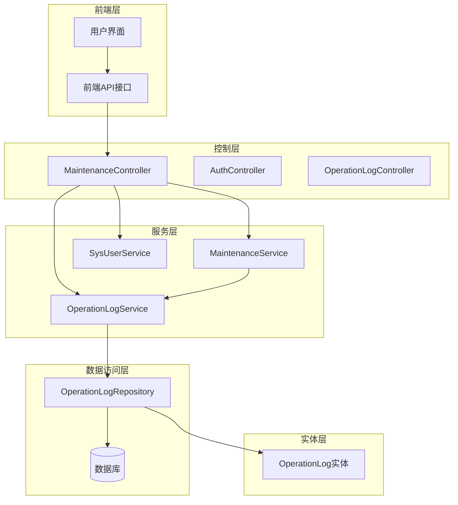
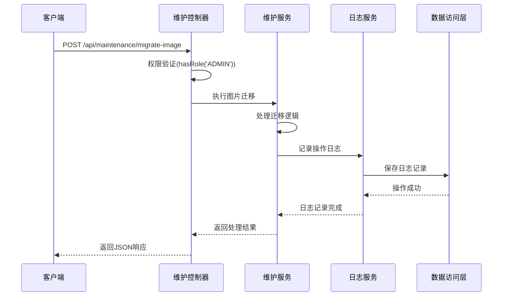
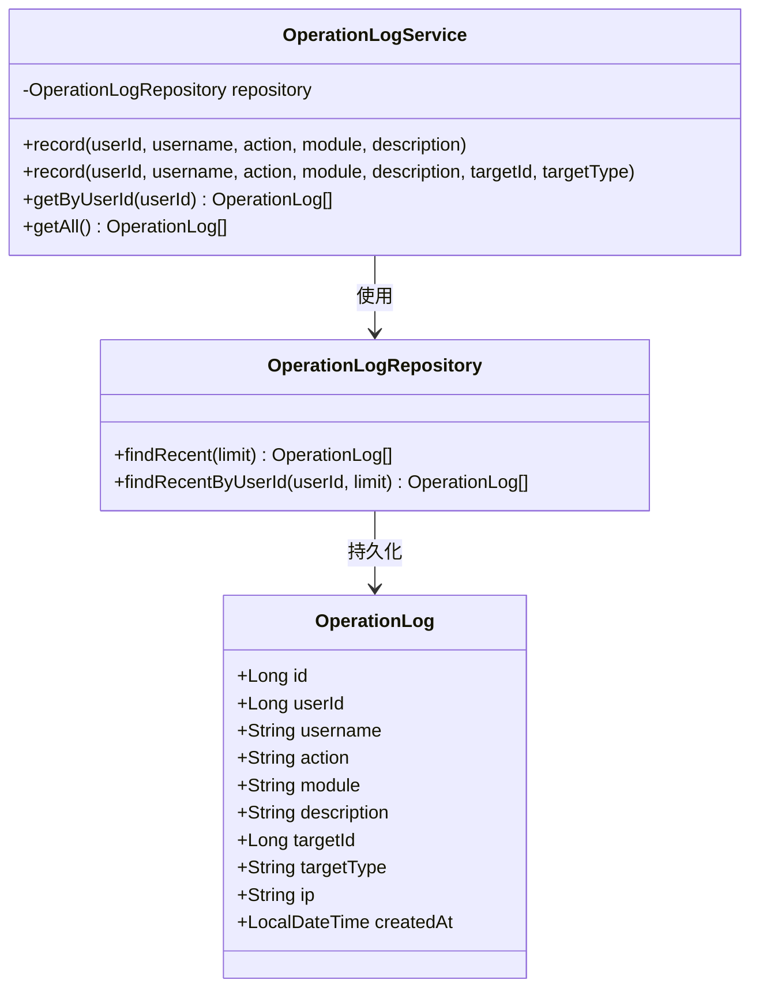
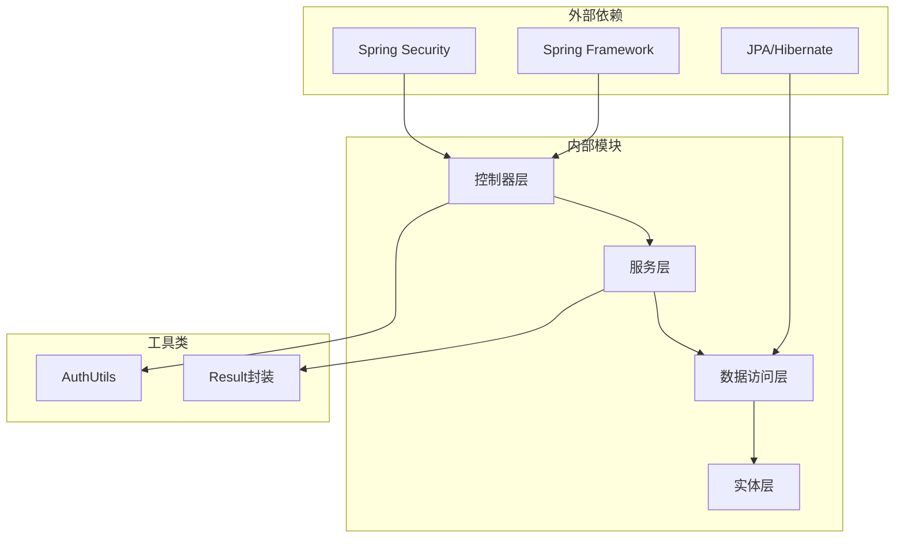

# 系统配置API

<cite>
**本文档引用的文件**
- [MaintenanceController.java](file://src/main/java/com/superpower/modules/system/controller/MaintenanceController.java)
- [MaintenanceService.java](file://src/main/java/com/superpower/modules/system/service/MaintenanceService.java)
- [OperationLogService.java](file://src/main/java/com/superpower/modules/system/service/OperationLogService.java)
- [OperationLog.java](file://src/main/java/com/superpower/modules/system/entity/OperationLog.java)
- [OperationLogRepository.java](file://src/main/java/com/superpower/modules/system/repository/OperationLogRepository.java)
- [maintenance.js](file://frontend/src/api/maintenance.js)
- [V1.0.9_fix_l3_images_move.sh](file://db_changes/V1.0.9_fix_l3_images_move.sh)
- [V1.0.9_fix_l3_images.sql](file://db_changes/V1.0.9_fix_l3_images.sql)
</cite>

## 目录
1. [简介](#简介)
2. [项目结构](#项目结构)
3. [核心组件](#核心组件)
4. [架构概览](#架构概览)
5. [详细组件分析](#详细组件分析)
6. [依赖关系分析](#依赖关系分析)
7. [性能考虑](#性能考虑)
8. [故障排除指南](#故障排除指南)
9. [结论](#结论)

## 简介

系统配置管理模块是SuperPower产品列表管理系统中的核心运维管理组件，负责提供全面的系统维护、数据清理、配置更新等运维管理功能。该模块通过RESTful API接口为管理员用户提供系统健康检查、性能监控、配置备份恢复等运维接口，同时实现了完善的操作权限验证、执行状态跟踪和结果反馈机制。

本模块特别专注于以下运维管理功能：
- 数据库维护操作和数据迁移任务
- 系统配置参数管理
- 缓存清理和日志清理
- 图片资源迁移和文件名同步
- 系统健康检查和性能监控
- 完整的操作审计和安全控制

## 项目结构

系统配置管理模块采用分层架构设计，主要包含以下层次：

**图表来源**
- [MaintenanceController.java:18-31](file://src/main/java/com/superpower/modules/system/controller/MaintenanceController.java#L18-L31)
- [OperationLogService.java:16-25](file://src/main/java/com/superpower/modules/system/service/OperationLogService.java#L16-L25)

**章节来源**
- [MaintenanceController.java:1-100](file://src/main/java/com/superpower/modules/system/controller/MaintenanceController.java#L1-L100)
- [OperationLogService.java:1-56](file://src/main/java/com/superpower/modules/system/service/OperationLogService.java#L1-L56)

## 核心组件

系统配置管理模块的核心组件包括控制器、服务层、数据访问层和实体模型，每个组件都有明确的职责分工：

### 控制器层
- **MaintenanceController**: 提供系统维护相关的REST API接口
- **OperationLogController**: 处理操作日志相关的请求
- **AuthController**: 处理认证相关的请求

### 服务层
- **MaintenanceService**: 实现具体的维护逻辑
- **OperationLogService**: 管理操作日志的记录和查询
- **SysUserService**: 系统用户管理服务

### 数据访问层
- **OperationLogRepository**: 操作日志的数据访问接口

### 实体模型
- **OperationLog**: 操作日志实体类

**章节来源**
- [MaintenanceController.java:18-31](file://src/main/java/com/superpower/modules/system/controller/MaintenanceController.java#L18-L31)
- [OperationLogService.java:16-25](file://src/main/java/com/superpower/modules/system/service/OperationLogService.java#L16-L25)
- [OperationLog.java:7-41](file://src/main/java/com/superpower/modules/system/entity/OperationLog.java#L7-L41)

## 架构概览

系统配置管理模块采用经典的MVC架构模式，结合Spring Security实现权限控制：

**图表来源**
- [MaintenanceController.java:59-65](file://src/main/java/com/superpower/modules/system/controller/MaintenanceController.java#L59-L65)
- [OperationLogService.java:31-48](file://src/main/java/com/superpower/modules/system/service/OperationLogService.java#L31-L48)

## 详细组件分析

### 维护控制器分析

MaintenanceController是系统配置管理模块的核心控制器，提供了丰富的运维管理接口：

#### 主要接口功能

1. **图片迁移管理接口**
   - `/api/maintenance/migrate-image`: 启动图片迁移任务
   - `/api/maintenance/migration-status`: 查询迁移状态
   - `/api/maintenance/migration-reset`: 重置迁移状态

2. **文件名同步接口**
   - `/api/maintenance/sync-filenames`: 启动文件名同步任务
   - `/api/maintenance/sync-filenames-status`: 查询同步状态
   - `/api/maintenance/sync-filenames-reset`: 重置同步状态

3. **ID修复接口**
   - `/api/maintenance/fix-image-card-ids`: 修复图片卡片ID
   - `/api/maintenance/fix-image-card-ids-status`: 查询修复状态
   - `/api/maintenance/fix-image-card-ids-reset`: 重置修复状态

4. **SQL执行接口**
   - `/api/maintenance/execute-sql`: 执行SQL语句
   - `/api/maintenance/fill-image-product-id`: 填充图片产品ID

#### 接口权限控制

所有维护接口都使用了`@PreAuthorize("hasRole('ADMIN')")`注解进行权限控制，确保只有管理员角色才能访问这些敏感的运维操作。

**章节来源**
- [MaintenanceController.java:18-31](file://src/main/java/com/superpower/modules/system/controller/MaintenanceController.java#L18-L31)
- [MaintenanceController.java:59-87](file://src/main/java/com/superpower/modules/system/controller/MaintenanceController.java#L59-L87)

### 维护服务分析

MaintenanceService实现了具体的维护逻辑，包括：

#### 图片迁移功能
- 支持批量图片迁移
- 提供迁移进度跟踪
- 实现迁移状态重置机制

#### 文件名同步功能
- 自动检测文件名不一致问题
- 执行批量文件名同步
- 提供同步状态查询和重置

#### ID修复功能
- 修复图片卡片ID关联问题
- 提供修复进度跟踪
- 支持修复状态重置

**章节来源**
- [MaintenanceService.java:1-200](file://src/main/java/com/superpower/modules/system/service/MaintenanceService.java#L1-L200)

### 操作日志服务分析

OperationLogService提供了完整的企业级操作审计功能：

#### 日志记录机制
- 自动捕获用户IP地址
- 记录操作时间和模块
- 支持事务性日志写入

#### 日志查询功能
- 支持按用户ID查询最近操作
- 提供全局操作日志查询
- 限制查询结果数量防止性能问题

#### 安全审计特性
- 记录所有管理员操作
- 包含操作详情和影响范围
- 支持后续审计和追踪

**图表来源**
- [OperationLogService.java:16-25](file://src/main/java/com/superpower/modules/system/service/OperationLogService.java#L16-L25)
- [OperationLogRepository.java:1-50](file://src/main/java/com/superpower/modules/system/repository/OperationLogRepository.java#L1-L50)
- [OperationLog.java:7-41](file://src/main/java/com/superpower/modules/system/entity/OperationLog.java#L7-L41)

**章节来源**
- [OperationLogService.java:16-56](file://src/main/java/com/superpower/modules/system/service/OperationLogService.java#L16-L56)
- [OperationLog.java:7-41](file://src/main/java/com/superpower/modules/system/entity/OperationLog.java#L7-L41)

### 前端API接口分析

前端通过专门的API模块与后端进行交互：

#### 接口调用流程
- 所有接口调用都通过统一的request工具
- 支持错误处理和响应解析
- 提供类型化的返回值

#### 主要API函数
- migrateImageAll(): 图片迁移启动
- syncFilenames(): 文件名同步启动
- getMigrationStatus(): 获取迁移状态
- resetMigration(): 重置迁移状态

**章节来源**
- [maintenance.js:1-49](file://frontend/src/api/maintenance.js#L1-L49)

### 数据库维护脚本分析

系统提供了完整的数据库维护脚本支持：

#### 图片资源修复脚本
- V1.0.9_fix_l3_images_move.sh: 图片文件移动脚本
- V1.0.9_fix_l3_images.sql: 数据库记录更新脚本

#### 脚本执行特点
- 支持幂等性检查（跳过已存在的文件）
- 提供详细的执行统计信息
- 包含错误处理和日志输出

**章节来源**
- [V1.0.9_fix_l3_images_move.sh:280-312](file://db_changes/V1.0.9_fix_l3_images_move.sh#L280-L312)
- [V1.0.9_fix_l3_images.sql:22-27](file://db_changes/V1.0.9_fix_l3_images.sql#L22-L27)

## 依赖关系分析

系统配置管理模块的依赖关系清晰明确：

**图表来源**
- [MaintenanceController.java:3-13](file://src/main/java/com/superpower/modules/system/controller/MaintenanceController.java#L3-L13)
- [OperationLogService.java:1-15](file://src/main/java/com/superpower/modules/system/service/OperationLogService.java#L1-L15)

### 关键依赖特性

1. **权限控制依赖**: 使用Spring Security进行基于角色的访问控制
2. **数据持久化依赖**: 采用JPA进行数据持久化操作
3. **工具类依赖**: 通过AuthUtils和Result类提供通用功能
4. **事务管理依赖**: 使用Spring声明式事务管理

**章节来源**
- [MaintenanceController.java:3-13](file://src/main/java/com/superpower/modules/system/controller/MaintenanceController.java#L3-L13)
- [OperationLogService.java:1-15](file://src/main/java/com/superpower/modules/system/service/OperationLogService.java#L1-L15)

## 性能考虑

系统配置管理模块在设计时充分考虑了性能优化：

### 并发处理
- 使用异步处理机制避免阻塞主线程
- 支持多任务并发执行
- 提供进度跟踪避免长时间无响应

### 内存管理
- 限制日志查询结果数量防止内存溢出
- 使用流式处理大数据集
- 及时释放数据库连接

### 缓存策略
- 操作日志采用异步写入减少数据库压力
- 支持状态缓存提高查询效率
- 避免重复计算和冗余操作

## 故障排除指南

### 常见问题及解决方案

#### 权限不足问题
**症状**: 访问维护接口返回403错误
**原因**: 用户未具备ADMIN角色权限
**解决**: 确保用户账户具有管理员角色

#### 数据库连接问题
**症状**: 操作日志无法记录或查询失败
**原因**: 数据库连接异常或事务回滚
**解决**: 检查数据库连接配置和网络连通性

#### 任务执行超时
**症状**: 图片迁移或文件同步长时间无响应
**原因**: 大量数据处理或系统资源不足
**解决**: 分批处理数据或增加系统资源

#### 状态查询不准确
**症状**: 迁移状态显示异常或不更新
**原因**: 缓存状态未及时刷新
**解决**: 调用重置接口清除缓存状态

**章节来源**
- [OperationLogService.java:45-47](file://src/main/java/com/superpower/modules/system/service/OperationLogService.java#L45-L47)

## 结论

系统配置管理模块为SuperPower产品列表管理系统提供了完善的运维管理能力。通过RESTful API接口，管理员可以轻松执行各种系统维护任务，包括数据迁移、配置更新、缓存清理等操作。

模块的主要优势包括：

1. **完整的权限控制**: 基于角色的访问控制确保只有授权用户才能执行敏感操作
2. **完善的操作审计**: 全面的日志记录功能支持所有管理员操作的追踪和审计
3. **灵活的任务管理**: 支持多种类型的维护任务，包括异步执行和状态跟踪
4. **企业级可靠性**: 采用事务性日志写入和错误处理机制确保系统稳定性
5. **用户友好界面**: 提供直观的前端界面和清晰的状态反馈

该模块的设计充分体现了现代企业级应用的运维需求，为系统的长期稳定运行提供了坚实的技术支撑。