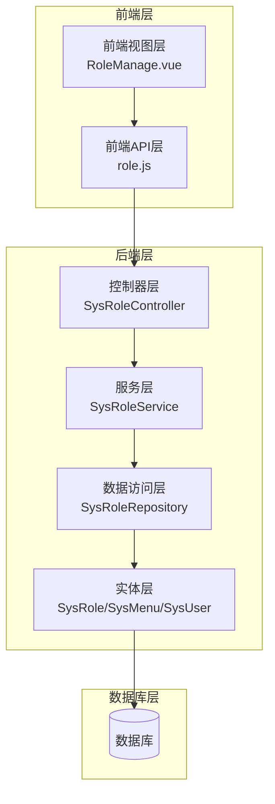
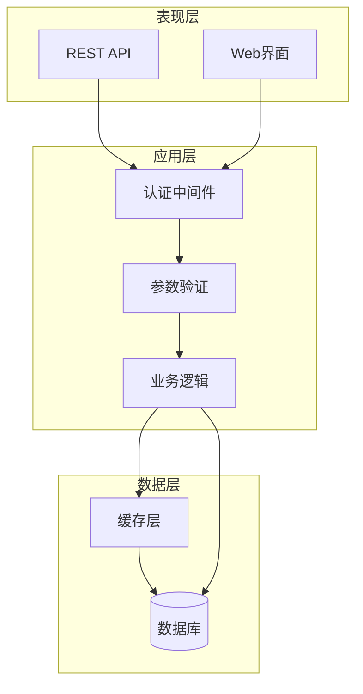
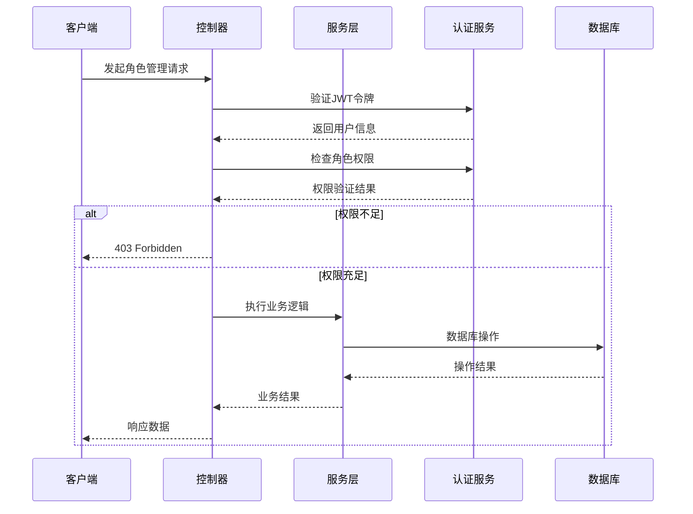
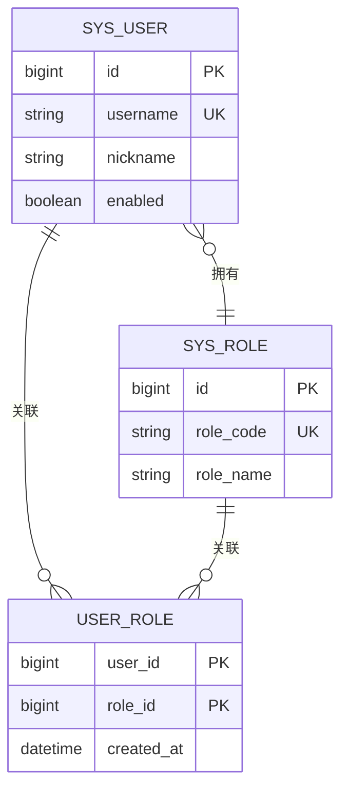
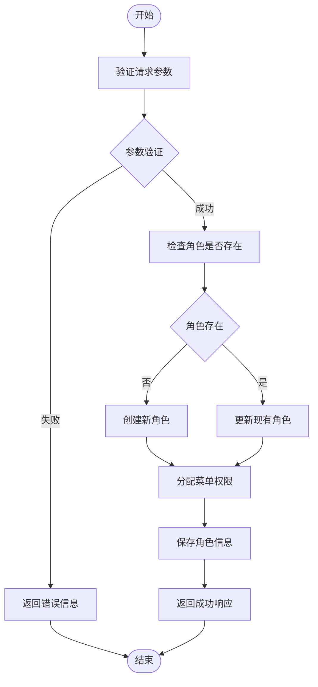
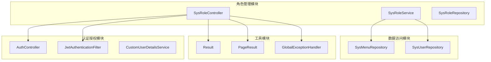
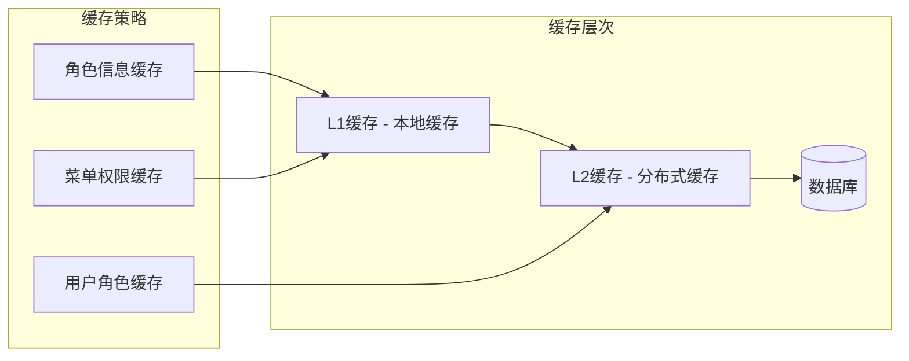

# 角色管理API

<cite>
**本文档引用的文件**
- [SysRoleController.java](file://src/main/java/com/superpower/modules/system/controller/SysRoleController.java)
- [SysRoleService.java](file://src/main/java/com/superpower/modules/system/service/SysRoleService.java)
- [SysRoleRepository.java](file://src/main/java/com/superpower/modules/system/repository/SysRoleRepository.java)
- [SysRole.java](file://src/main/java/com/superpower/modules/system/entity/SysRole.java)
- [SysMenu.java](file://src/main/java/com/superpower/modules/system/entity/SysMenu.java)
- [SysUser.java](file://src/main/java/com/superpower/modules/system/entity/SysUser.java)
- [role.js](file://frontend/src/api/role.js)
- [RoleManage.vue](file://frontend/src/views/system/RoleManage.vue)
</cite>

## 目录
1. [简介](#简介)
2. [项目结构](#项目结构)
3. [核心组件](#核心组件)
4. [架构概览](#架构概览)
5. [详细组件分析](#详细组件分析)
6. [依赖关系分析](#依赖关系分析)
7. [性能考虑](#性能考虑)
8. [故障排除指南](#故障排除指南)
9. [结论](#结论)

## 简介

角色管理模块是系统权限控制的核心组件，负责管理系统中角色的创建、查询、更新和删除等操作。该模块实现了基于角色的访问控制（RBAC）模型，通过角色与用户、菜单的关联关系实现细粒度的权限控制。

本模块提供了完整的企业级角色管理功能，包括：
- 角色基础信息管理
- 角色权限分配
- 菜单权限配置
- 角色状态管理
- 权限验证和继承机制
- 批量操作支持

## 项目结构

角色管理模块采用典型的三层架构设计，包含控制器层、服务层和数据访问层：



**图表来源**
- [SysRoleController.java](file://src/main/java/com/superpower/modules/system/controller/SysRoleController.java)
- [SysRoleService.java](file://src/main/java/com/superpower/modules/system/service/SysRoleService.java)
- [SysRoleRepository.java](file://src/main/java/com/superpower/modules/system/repository/SysRoleRepository.java)
- [SysRole.java](file://src/main/java/com/superpower/modules/system/entity/SysRole.java)

**章节来源**
- [SysRoleController.java](file://src/main/java/com/superpower/modules/system/controller/SysRoleController.java)
- [SysRoleService.java](file://src/main/java/com/superpower/modules/system/service/SysRoleService.java)
- [SysRoleRepository.java](file://src/main/java/com/superpower/modules/system/repository/SysRoleRepository.java)

## 核心组件

### 实体模型

角色管理模块的核心数据模型包括三个主要实体：

```mermaid
erDiagram
SYS_ROLE {
bigint id PK
string role_code UK
string role_name
string remark
integer sort_num
datetime created_at
datetime updated_at
boolean deleted
}
SYS_MENU {
bigint id PK
string menu_name
string menu_code
string url
string method
string perms
integer type
bigint parent_id
integer sort_num
boolean visible
}
SYS_USER {
bigint id PK
string username UK
string nickname
string phone
string email
boolean enabled
datetime created_at
}
SYS_ROLE ||--o{ SYS_USER : "拥有"
SYS_ROLE ||--o{ SYS_MENU : "授权"
```



**图表来源**
- [SysRole.java](file://src/main/java/com/superpower/modules/system/entity/SysRole.java)
- [SysMenu.java](file://src/main/java/com/superpower/modules/system/entity/SysMenu.java)
- [SysUser.java](file://src/main/java/com/superpower/modules/system/entity/SysUser.java)

### 控制器层

SysRoleController作为角色管理的入口点，提供了RESTful API接口：

**章节来源**
- [SysRoleController.java](file://src/main/java/com/superpower/modules/system/controller/SysRoleController.java)

### 服务层

SysRoleService实现了业务逻辑处理，包括：
- 角色数据验证
- 权限检查
- 业务规则执行
- 事务管理

**章节来源**
- [SysRoleService.java](file://src/main/java/com/superpower/modules/system/service/SysRoleService.java)

### 数据访问层

SysRoleRepository提供了数据持久化操作，包括：
- CRUD操作
- 复杂查询
- 分页查询
- 自定义查询条件

**章节来源**
- [SysRoleRepository.java](file://src/main/java/com/superpower/modules/system/repository/SysRoleRepository.java)

## 架构概览

角色管理模块采用分层架构设计，确保了关注点分离和代码的可维护性：



**图表来源**
- [SysRoleController.java](file://src/main/java/com/superpower/modules/system/controller/SysRoleController.java)
- [SysRoleService.java](file://src/main/java/com/superpower/modules/system/service/SysRoleService.java)

## 详细组件分析

### 角色管理API接口规范

#### 获取角色列表

**请求方法**: GET  
**请求地址**: `/api/system/roles`  
**请求参数**: 
- `page` (可选): 页码，默认1
- `size` (可选): 每页条数，默认10
- `roleName` (可选): 角色名称查询条件
- `status` (可选): 角色状态过滤

**响应数据**:
```json
{
  "code": 200,
  "message": "操作成功",
  "data": {
    "records": [
      {
        "id": 1,
        "roleCode": "ADMIN",
        "roleName": "系统管理员",
        "remark": "系统超级管理员",
        "sortNum": 1,
        "createdAt": "2024-01-01T00:00:00Z",
        "updatedAt": "2024-01-01T00:00:00Z"
      }
    ],
    "total": 100,
    "current": 1,
    "size": 10
  }
}
```

#### 获取角色详情

**请求方法**: GET  
**请求地址**: `/api/system/roles/{id}`  
**路径参数**:
- `id`: 角色唯一标识符

**响应数据**:
```json
{
  "code": 200,
  "message": "操作成功",
  "data": {
    "id": 1,
    "roleCode": "ADMIN",
    "roleName": "系统管理员",
    "remark": "系统超级管理员",
    "sortNum": 1,
    "menuIds": [1, 2, 3],
    "createdAt": "2024-01-01T00:00:00Z",
    "updatedAt": "2024-01-01T00:00:00Z"
  }
}
```

#### 创建角色

**请求方法**: POST  
**请求地址**: `/api/system/roles`  
**请求头**: `Content-Type: application/json`  
**请求体**:
```json
{
  "roleCode": "TEST_ROLE",
  "roleName": "测试角色",
  "remark": "测试用途",
  "sortNum": 1,
  "menuIds": [1, 2, 3]
}
```

**响应数据**:
```json
{
  "code": 200,
  "message": "创建成功",
  "data": true
}
```

#### 更新角色

**请求方法**: PUT  
**请求地址**: `/api/system/roles/{id}`  
**路径参数**:
- `id`: 角色唯一标识符
**请求体**:
```json
{
  "id": 1,
  "roleCode": "TEST_ROLE",
  "roleName": "测试角色",
  "remark": "更新后的描述",
  "sortNum": 2,
  "menuIds": [1, 2, 3, 4]
}
```

**响应数据**:
```json
{
  "code": 200,
  "message": "更新成功",
  "data": true
}
```

#### 删除角色

**请求方法**: DELETE  
**请求地址**: `/api/system/roles/{id}`  
**路径参数**:
- `id`: 角色唯一标识符

**响应数据**:
```json
{
  "code": 200,
  "message": "删除成功",
  "data": true
}
```

#### 批量删除角色

**请求方法**: DELETE  
**请求地址**: `/api/system/roles`  
**请求体**:
```json
{
  "ids": [1, 2, 3]
}
```

**响应数据**:
```json
{
  "code": 200,
  "message": "批量删除成功",
  "data": true
}
```

#### 角色状态管理

**启用角色**:
- 请求方法: PUT
- 地址: `/api/system/roles/{id}/enable`

**禁用角色**:
- 请求方法: PUT
- 地址: `/api/system/roles/{id}/disable`

### 权限验证机制

角色管理模块实现了多层权限验证：



**图表来源**
- [SysRoleController.java](file://src/main/java/com/superpower/modules/system/controller/SysRoleController.java)
- [SysRoleService.java](file://src/main/java/com/superpower/modules/system/service/SysRoleService.java)

### 权限继承机制

系统支持基于角色的权限继承，通过以下方式实现：

1. **角色层级结构**: 支持多级角色嵌套
2. **权限合并**: 子角色自动继承父角色权限
3. **权限覆盖**: 子角色可以覆盖父角色的特定权限
4. **动态权限计算**: 运行时计算用户的最终权限集合

### 角色与用户关联关系



**图表来源**
- [SysUser.java](file://src/main/java/com/superpower/modules/system/entity/SysUser.java)
- [SysRole.java](file://src/main/java/com/superpower/modules/system/entity/SysRole.java)

### 角色权限分配流程



**图表来源**
- [SysRoleService.java](file://src/main/java/com/superpower/modules/system/service/SysRoleService.java)

## 依赖关系分析

角色管理模块与其他系统组件的依赖关系如下：



**图表来源**
- [SysRoleController.java](file://src/main/java/com/superpower/modules/system/controller/SysRoleController.java)
- [SysRoleService.java](file://src/main/java/com/superpower/modules/system/service/SysRoleService.java)
- [SysMenuRepository.java](file://src/main/java/com/superpower/modules/system/repository/SysMenuRepository.java)
- [SysUserRepository.java](file://src/main/java/com/superpower/modules/system/repository/SysUserRepository.java)

**章节来源**
- [SysRoleController.java](file://src/main/java/com/superpower/modules/system/controller/SysRoleController.java)
- [SysRoleService.java](file://src/main/java/com/superpower/modules/system/service/SysRoleService.java)

## 性能考虑

### 查询优化

1. **索引优化**: 对常用查询字段建立适当索引
2. **分页查询**: 默认分页大小限制，防止大数据量查询
3. **缓存策略**: 对热点数据进行缓存
4. **懒加载**: 关联数据按需加载

### 并发控制

1. **乐观锁**: 使用版本号防止并发更新冲突
2. **事务管理**: 合理的事务边界设计
3. **连接池**: 数据库连接池配置优化

### 缓存策略



## 故障排除指南

### 常见问题及解决方案

1. **权限不足错误 (403)**:
   - 检查用户是否具有相应角色
   - 验证JWT令牌有效性
   - 确认权限配置正确性

2. **角色重复错误**:
   - 检查角色编码唯一性
   - 验证角色名称唯一性
   - 清理重复数据

3. **关联关系异常**:
   - 检查角色与用户的关联表
   - 验证菜单权限配置
   - 确认外键约束

### 错误码定义

| 错误码 | 描述 | 说明 |
|--------|------|------|
| 200 | 成功 | 操作成功 |
| 400 | 参数错误 | 请求参数不合法 |
| 401 | 未授权 | 用户未登录或令牌无效 |
| 403 | 权限不足 | 用户没有操作权限 |
| 404 | 资源不存在 | 请求的资源不存在 |
| 500 | 服务器内部错误 | 服务器处理异常 |

**章节来源**
- [SysRoleController.java](file://src/main/java/com/superpower/modules/system/controller/SysRoleController.java)

## 结论

角色管理模块通过清晰的分层架构和完善的权限控制机制，为企业级应用提供了强大的角色管理能力。模块具有以下特点：

1. **完整的功能覆盖**: 支持角色的全生命周期管理
2. **灵活的权限控制**: 基于角色的细粒度权限管理
3. **良好的扩展性**: 支持权限继承和动态权限计算
4. **可靠的性能**: 通过缓存和优化策略保证系统性能
5. **完善的错误处理**: 提供详细的错误信息和处理机制

该模块为整个系统的权限管理奠定了坚实的基础，能够满足复杂企业应用场景下的权限控制需求。