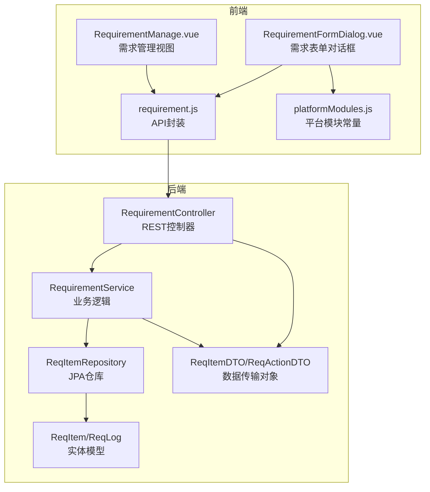
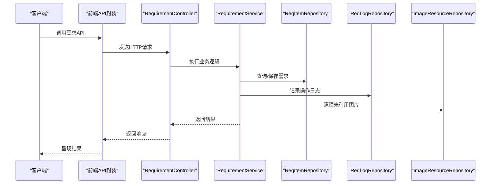
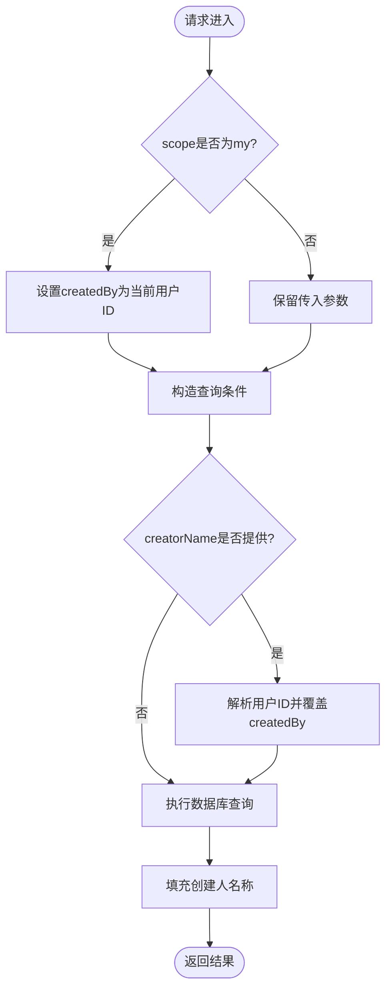
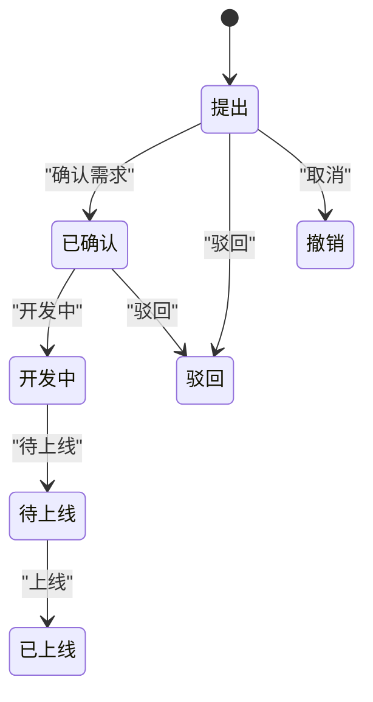
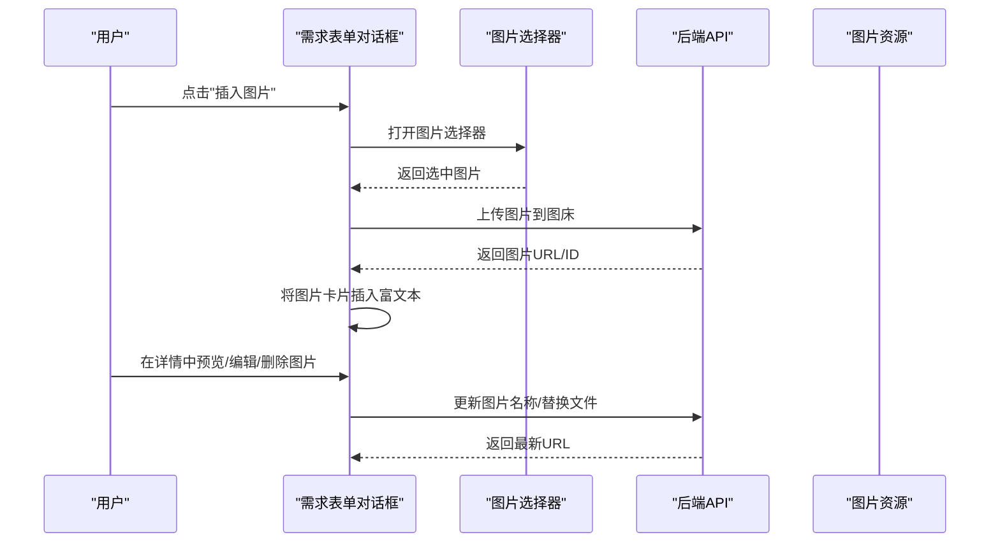
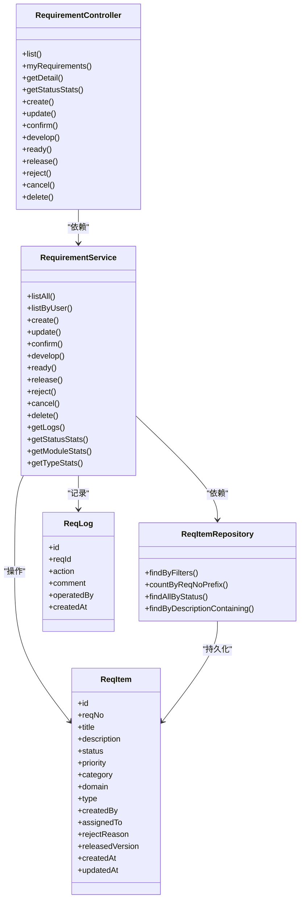

# 需求管理API

<cite>
**本文档引用的文件**
- [RequirementController.java](file://src/main/java/com/superpower/modules/requirement/controller/RequirementController.java)
- [RequirementService.java](file://src/main/java/com/superpower/modules/requirement/service/RequirementService.java)
- [ReqItem.java](file://src/main/java/com/superpower/modules/requirement/entity/ReqItem.java)
- [ReqLog.java](file://src/main/java/com/superpower/modules/requirement/entity/ReqLog.java)
- [ReqItemDTO.java](file://src/main/java/com/superpower/modules/requirement/dto/ReqItemDTO.java)
- [ReqActionDTO.java](file://src/main/java/com/superpower/modules/requirement/dto/ReqActionDTO.java)
- [ReqItemRepository.java](file://src/main/java/com/superpower/modules/requirement/repository/ReqItemRepository.java)
- [requirement.js](file://frontend/src/api/requirement.js)
- [RequirementManage.vue](file://frontend/src/views/requirement/RequirementManage.vue)
- [RequirementFormDialog.vue](file://frontend/src/components/RequirementFormDialog.vue)
- [platformModules.js](file://frontend/src/constants/platformModules.js)
- [20260531_add_requirement_tables.sql](file://db_changes/20260531_add_requirement_tables.sql)
- [application.yml](file://src/main/resources/application.yml)
</cite>

## 目录
1. [简介](#简介)
2. [项目结构](#项目结构)
3. [核心组件](#核心组件)
4. [架构概览](#架构概览)
5. [详细组件分析](#详细组件分析)
6. [依赖关系分析](#依赖关系分析)
7. [性能考虑](#性能考虑)
8. [故障排除指南](#故障排除指南)
9. [结论](#结论)

## 简介
本文件为需求管理功能的完整API接口文档，涵盖需求清单的创建、编辑、删除、查询等CRUD操作，以及需求状态跟踪、审批流程集成、需求图片上传管理、需求与产品数据的关联关系和数据同步机制。系统采用前后端分离架构，后端基于Spring Boot + JPA + SQLite，前端基于Vue 3 + Element Plus。

## 项目结构
需求管理模块位于后端的`com.superpower.modules.requirement`包下，包含控制器、服务层、数据访问层、实体类和DTO对象；前端在`frontend/src`目录下提供API封装、视图组件和对话框组件。

**图表来源**
- [RequirementController.java:21-36](file://src/main/java/com/superpower/modules/requirement/controller/RequirementController.java#L21-L36)
- [RequirementService.java:24-40](file://src/main/java/com/superpower/modules/requirement/service/RequirementService.java#L24-L40)
- [ReqItemRepository.java:12-45](file://src/main/java/com/superpower/modules/requirement/repository/ReqItemRepository.java#L12-L45)
- [requirement.js:1-62](file://frontend/src/api/requirement.js#L1-L62)
- [RequirementManage.vue:166-177](file://frontend/src/views/requirement/RequirementManage.vue#L166-L177)
- [RequirementFormDialog.vue:63-70](file://frontend/src/components/RequirementFormDialog.vue#L63-L70)

**章节来源**
- [RequirementController.java:21-36](file://src/main/java/com/superpower/modules/requirement/controller/RequirementController.java#L21-L36)
- [RequirementService.java:24-40](file://src/main/java/com/superpower/modules/requirement/service/RequirementService.java#L24-L40)
- [ReqItemRepository.java:12-45](file://src/main/java/com/superpower/modules/requirement/repository/ReqItemRepository.java#L12-L45)
- [requirement.js:1-62](file://frontend/src/api/requirement.js#L1-L62)
- [RequirementManage.vue:166-177](file://frontend/src/views/requirement/RequirementManage.vue#L166-L177)
- [RequirementFormDialog.vue:63-70](file://frontend/src/components/RequirementFormDialog.vue#L63-L70)

## 核心组件
- 控制器层：提供REST API接口，处理HTTP请求与响应，调用服务层执行业务逻辑，并记录操作日志。
- 服务层：实现需求生命周期管理、状态流转校验、统计数据聚合、图片引用清理等核心业务。
- 数据访问层：基于JPA Repository进行数据查询与过滤，支持多条件筛选和分页排序。
- 实体模型：定义需求条目和操作日志的数据结构，包含状态、优先级、分类、域、类型等属性。
- 前端API封装：统一管理后端接口调用，提供列表查询、详情获取、状态变更、统计分析等方法。
- 视图与对话框：提供需求管理界面、表单输入、图片插入与编辑、审批流程展示等交互功能。

**章节来源**
- [RequirementController.java:55-238](file://src/main/java/com/superpower/modules/requirement/controller/RequirementController.java#L55-L238)
- [RequirementService.java:42-273](file://src/main/java/com/superpower/modules/requirement/service/RequirementService.java#L42-L273)
- [ReqItem.java:10-59](file://src/main/java/com/superpower/modules/requirement/entity/ReqItem.java#L10-L59)
- [ReqLog.java:10-32](file://src/main/java/com/superpower/modules/requirement/entity/ReqLog.java#L10-L32)
- [requirement.js:3-61](file://frontend/src/api/requirement.js#L3-L61)

## 架构概览
后端采用MVC架构，控制器接收请求，服务层处理业务规则，数据访问层负责持久化；前端通过API封装调用后端接口，实现需求的全生命周期管理。

**图表来源**
- [RequirementController.java:164-237](file://src/main/java/com/superpower/modules/requirement/controller/RequirementController.java#L164-L237)
- [RequirementService.java:83-216](file://src/main/java/com/superpower/modules/requirement/service/RequirementService.java#L83-L216)
- [ReqItemRepository.java:19-39](file://src/main/java/com/superpower/modules/requirement/repository/ReqItemRepository.java#L19-L39)
- [ReqLogRepository.java:1-200](file://src/main/java/com/superpower/modules/requirement/repository/ReqLogRepository.java#L1-L200)

## 详细组件分析

### 需求CRUD接口规范

#### 列表查询
- 接口路径：`GET /api/requirements`
- 功能：支持按状态、创建人、时间范围、模块分类、域、类型、优先级等条件筛选，支持"我的需求"作用域。
- 参数：
  - `status`：需求状态
  - `createdBy`：创建人ID
  - `creatorName`：创建人昵称或用户名（模糊匹配）
  - `scope`：查询范围（my表示当前用户）
  - `startDate`/`endDate`：创建时间范围
  - `category`：模块分类
  - `domain`：需求域
  - `type`：需求类型
  - `priority`：优先级
- 返回：需求列表，包含创建人名称填充。

**图表来源**
- [RequirementController.java:55-82](file://src/main/java/com/superpower/modules/requirement/controller/RequirementController.java#L55-L82)
- [RequirementService.java:42-76](file://src/main/java/com/superpower/modules/requirement/service/RequirementService.java#L42-L76)

**章节来源**
- [RequirementController.java:55-82](file://src/main/java/com/superpower/modules/requirement/controller/RequirementController.java#L55-L82)
- [ReqItemRepository.java:19-36](file://src/main/java/com/superpower/modules/requirement/repository/ReqItemRepository.java#L19-L36)

#### 我的需求
- 接口路径：`GET /api/requirements/my`
- 功能：获取当前登录用户的全部需求列表。
- 权限：认证用户。
- 返回：需求列表。

**章节来源**
- [RequirementController.java:84-87](file://src/main/java/com/superpower/modules/requirement/controller/RequirementController.java#L84-L87)

#### 需求详情
- 接口路径：`GET /api/requirements/{id}`
- 功能：获取需求详情及操作日志，同时返回创建人名称。
- 返回：包含需求对象、日志列表、创建人名称的对象。

**章节来源**
- [RequirementController.java:89-98](file://src/main/java/com/superpower/modules/requirement/controller/RequirementController.java#L89-L98)

#### 统计分析接口
- 状态分布统计：`GET /api/requirements/stats`
- 模块分布统计：`GET /api/requirements/stats-by-module`
- 类型分布统计：`GET /api/requirements/stats-by-type`
- 参数：与列表查询相同的筛选条件。
- 返回：键值对形式的统计结果（状态/模块/类型 -> 数量）。

**章节来源**
- [RequirementController.java:100-146](file://src/main/java/com/superpower/modules/requirement/controller/RequirementController.java#L100-L146)
- [RequirementService.java:224-244](file://src/main/java/com/superpower/modules/requirement/service/RequirementService.java#L224-L244)

#### 创建需求
- 接口路径：`POST /api/requirements`
- 请求体：ReqItemDTO（标题、描述、优先级、分类、域、类型）
- 行为：生成唯一需求编号，初始状态为"提出"，记录创建日志。
- 权限：认证用户。
- 返回：新建的需求对象。

**章节来源**
- [RequirementController.java:164-170](file://src/main/java/com/superpower/modules/requirement/controller/RequirementController.java#L164-L170)
- [RequirementService.java:83-98](file://src/main/java/com/superpower/modules/requirement/service/RequirementService.java#L83-L98)

#### 编辑需求
- 接口路径：`PUT /api/requirements/{id}`
- 请求体：ReqItemDTO
- 行为：仅允许创建人且状态为"提出"时编辑；更新后记录日志。
- 权限：认证用户。
- 返回：更新后的需求数。

**章节来源**
- [RequirementController.java:172-178](file://src/main/java/com/superpower/modules/requirement/controller/RequirementController.java#L172-L178)
- [RequirementService.java:100-117](file://src/main/java/com/superpower/modules/requirement/service/RequirementService.java#L100-L117)

#### 删除需求
- 接口路径：`DELETE /api/requirements/{id}`
- 行为：管理员权限；删除需求及其关联日志；从描述中提取图片ID，若无其他引用则删除物理文件并清理图片资源。
- 权限：ADMIN角色。
- 返回：成功状态。

**章节来源**
- [RequirementController.java:228-237](file://src/main/java/com/superpower/modules/requirement/controller/RequirementController.java#L228-L237)
- [RequirementService.java:194-216](file://src/main/java/com/superpower/modules/requirement/service/RequirementService.java#L194-L216)

### 需求状态流转与审批流程

#### 状态流转接口
- 确认需求：`PUT /api/requirements/{id}/confirm`
- 开发中：`PUT /api/requirements/{id}/develop`
- 待上线：`PUT /api/requirements/{id}/ready`
- 上线：`PUT /api/requirements/{id}/release`
- 驳回：`PUT /api/requirements/{id}/reject`
- 取消：`PUT /api/requirements/{id}/cancel`

#### 审批流程集成
- 需求状态变化会记录到操作日志表，前端可查看审批流程详情。
- 上线操作需要提供版本号，驳回操作需要提供驳回原因。

**图表来源**
- [RequirementService.java:119-192](file://src/main/java/com/superpower/modules/requirement/service/RequirementService.java#L119-L192)
- [RequirementController.java:180-226](file://src/main/java/com/superpower/modules/requirement/controller/RequirementController.java#L180-L226)

**章节来源**
- [RequirementController.java:180-226](file://src/main/java/com/superpower/modules/requirement/controller/RequirementController.java#L180-L226)
- [RequirementService.java:119-192](file://src/main/java/com/superpower/modules/requirement/service/RequirementService.java#L119-L192)

### 需求图片上传管理

#### 图片插入与编辑流程
- 插入图片：点击编辑器工具栏的"插入图片"按钮，弹出图片选择器，选择后插入到富文本编辑器中。
- 截图插入：点击"截图"按钮，启动截图工具，编辑后上传并插入。
- 图片编辑：支持预览、改名、删除、在线编辑等操作。
- 图片存储：图片上传到图床管理模块，需求描述中以HTML卡片形式嵌入，包含图片URL、ID、文件名等信息。

**图表来源**
- [RequirementFormDialog.vue:294-367](file://frontend/src/components/RequirementFormDialog.vue#L294-L367)
- [RequirementManage.vue:471-497](file://frontend/src/views/requirement/RequirementManage.vue#L471-L497)

**章节来源**
- [RequirementFormDialog.vue:34-42](file://frontend/src/components/RequirementFormDialog.vue#L34-L42)
- [RequirementManage.vue:116-146](file://frontend/src/views/requirement/RequirementManage.vue#L116-L146)

### 需求数据属性管理
- 必填字段：标题、所属模块（category）、需求类型（type）
- 可选字段：描述、优先级（高/中/低）、域（domain）、版本号（releasedVersion）、驳回原因（rejectReason）
- 系统字段：需求编号（reqNo）、创建人（createdBy）、分配给（assignedTo）、创建时间（createdAt）、更新时间（updatedAt）

**章节来源**
- [ReqItem.java:15-58](file://src/main/java/com/superpower/modules/requirement/entity/ReqItem.java#L15-L58)
- [ReqItemDTO.java:6-13](file://src/main/java/com/superpower/modules/requirement/dto/ReqItemDTO.java#L6-L13)
- [RequirementFormDialog.vue:4-33](file://frontend/src/components/RequirementFormDialog.vue#L4-L33)

### 需求与产品数据的关联关系
- 模块分类：通过平台模块常量定义，支持两级结构（如"需求管理/需求清单"）。
- 域（Domain）：用于进一步细分需求域，与模块分类配合使用。
- 版本关联：上线操作时绑定版本号，便于追踪需求与版本的对应关系。

**章节来源**
- [platformModules.js:1-29](file://frontend/src/constants/platformModules.js#L1-L29)
- [RequirementService.java:149-161](file://src/main/java/com/superpower/modules/requirement/service/RequirementService.java#L149-L161)

## 依赖关系分析

**图表来源**
- [RequirementController.java:25-36](file://src/main/java/com/superpower/modules/requirement/controller/RequirementController.java#L25-L36)
- [RequirementService.java:27-40](file://src/main/java/com/superpower/modules/requirement/service/RequirementService.java#L27-L40)
- [ReqItemRepository.java:13-45](file://src/main/java/com/superpower/modules/requirement/repository/ReqItemRepository.java#L13-L45)
- [ReqItem.java:10-59](file://src/main/java/com/superpower/modules/requirement/entity/ReqItem.java#L10-L59)
- [ReqLog.java:10-32](file://src/main/java/com/superpower/modules/requirement/entity/ReqLog.java#L10-L32)

**章节来源**
- [RequirementController.java:25-36](file://src/main/java/com/superpower/modules/requirement/controller/RequirementController.java#L25-L36)
- [RequirementService.java:27-40](file://src/main/java/com/superpower/modules/requirement/service/RequirementService.java#L27-L40)
- [ReqItemRepository.java:13-45](file://src/main/java/com/superpower/modules/requirement/repository/ReqItemRepository.java#L13-L45)

## 性能考虑
- 数据库查询：列表查询支持多条件过滤，建议在高频查询字段上建立索引以提升性能。
- 分页与排序：当前实现按创建时间倒序排列，建议在大数据量场景下引入分页参数。
- 图片清理：删除需求时会扫描描述中的图片引用，避免重复遍历所有需求，但仍有优化空间（如缓存引用计数）。
- 前端渲染：统计图表使用ECharts，建议在大量数据时启用懒加载和虚拟滚动。

## 故障排除指南
- 权限错误：删除需求需要ADMIN角色，否则会返回权限不足错误。
- 状态约束：编辑、驳回、取消等操作受状态约束，非预期状态会抛出业务异常。
- 图片引用：删除需求时会自动清理未被其他需求引用的图片文件，确保磁盘空间不被占用。
- 文件大小限制：后端配置了50MB的文件上传限制，超过限制将导致上传失败。

**章节来源**
- [RequirementController.java:228-237](file://src/main/java/com/superpower/modules/requirement/controller/RequirementController.java#L228-L237)
- [RequirementService.java:103-108](file://src/main/java/com/superpower/modules/requirement/service/RequirementService.java#L103-L108)
- [RequirementService.java:166-171](file://src/main/java/com/superpower/modules/requirement/service/RequirementService.java#L166-L171)
- [RequirementService.java:182-187](file://src/main/java/com/superpower/modules/requirement/service/RequirementService.java#L182-L187)
- [application.yml:13-15](file://src/main/resources/application.yml#L13-L15)

## 结论
需求管理API提供了完善的需求全生命周期管理能力，包括CRUD操作、状态流转、统计分析、图片管理与审批流程集成。通过清晰的接口规范和严格的业务约束，系统能够有效支撑需求的规范化管理与追踪。建议在生产环境中进一步优化数据库索引、引入分页机制，并加强前端性能监控与错误上报。