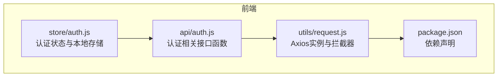
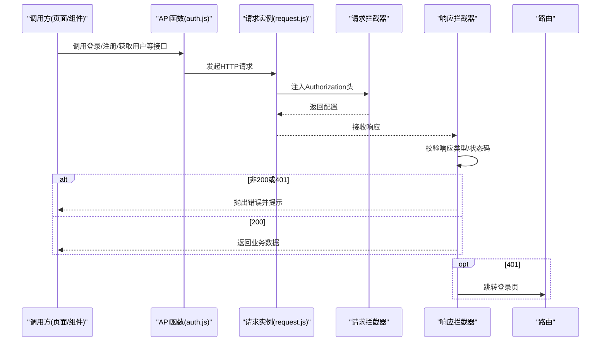
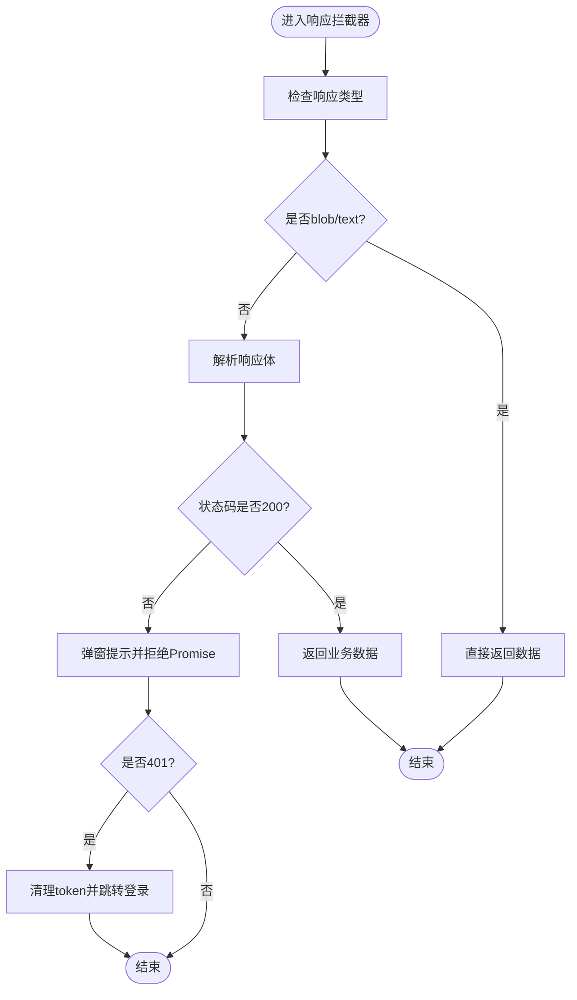
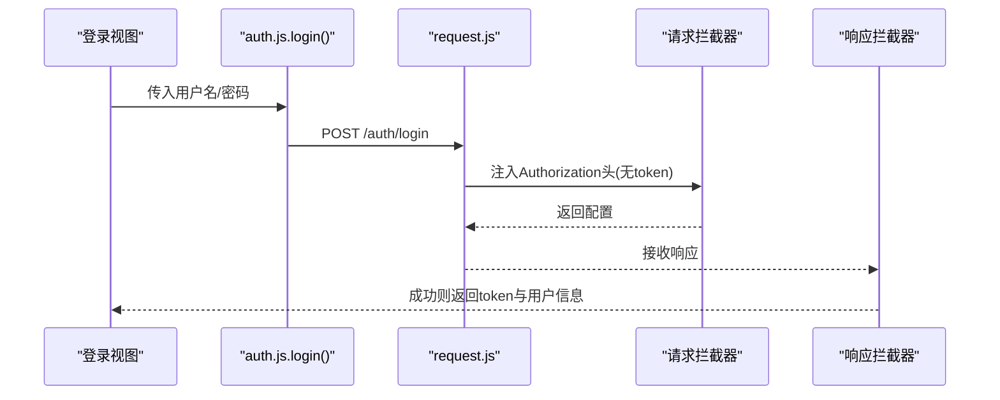
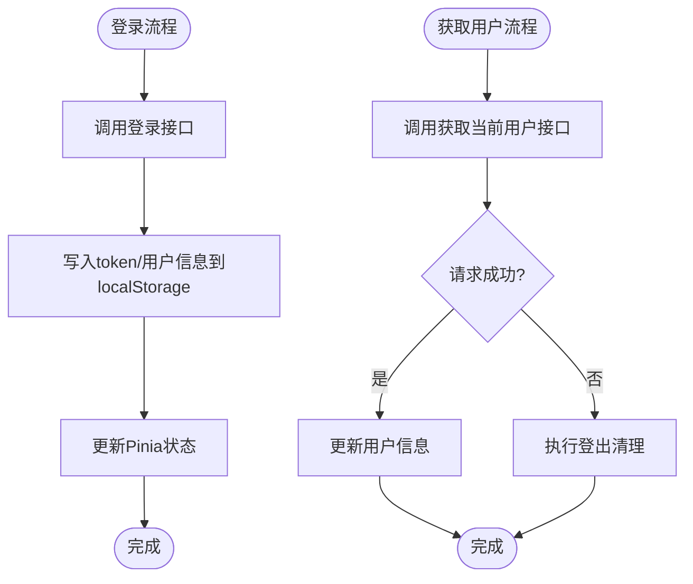
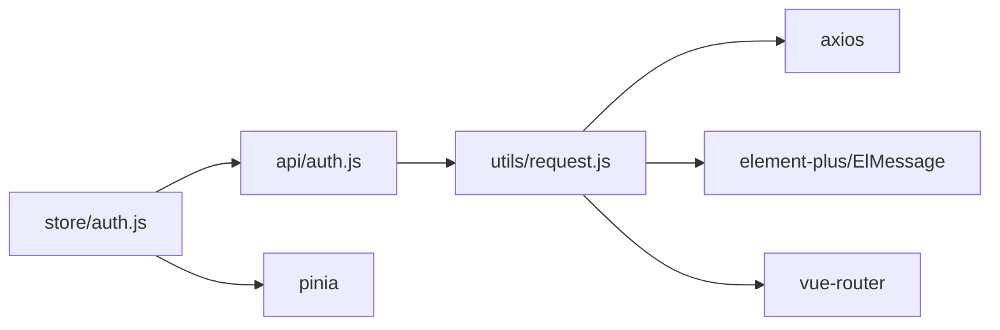

# API接口层

<cite>
**本文引用的文件**
- [frontend/src/utils/request.js](file://frontend/src/utils/request.js)
- [frontend/src/api/auth.js](file://frontend/src/api/auth.js)
- [frontend/src/store/auth.js](file://frontend/src/store/auth.js)
- [frontend/package.json](file://frontend/package.json)
</cite>

## 目录
1. [简介](#简介)
2. [项目结构](#项目结构)
3. [核心组件](#核心组件)
4. [架构总览](#架构总览)
5. [详细组件分析](#详细组件分析)
6. [依赖关系分析](#依赖关系分析)
7. [性能考量](#性能考量)
8. [故障排查指南](#故障排查指南)
9. [结论](#结论)
10. [附录](#附录)

## 简介
本文件聚焦于前端API接口层的设计与实现，系统性阐述RESTful封装策略、HTTP请求配置、响应处理机制、Axios拦截器的使用、错误处理与重试策略、认证token管理、请求缓存与并发控制、最佳实践、参数校验与数据转换方法，并提供接口调用示例与调试技巧，帮助开发者高效完成前后端数据交互。

## 项目结构
前端API接口层主要由以下部分组成：
- 请求封装层：基于 Axios 的统一请求实例与拦截器，负责基础配置、鉴权头注入、响应解包与错误处理。
- 接口适配层：按业务模块划分的API函数集合，如认证、产品、分类等，统一通过请求封装层发起HTTP请求。
- 状态管理层：基于 Pinia 的认证状态存储，负责token与用户信息的持久化与同步。
- 依赖声明：前端依赖中包含 axios、element-plus、vue、vue-router、pinia 等，支撑请求、UI、路由与状态管理。

**图示来源**
- [frontend/src/utils/request.js:1-65](file://frontend/src/utils/request.js#L1-L65)
- [frontend/src/api/auth.js:1-22](file://frontend/src/api/auth.js#L1-L22)
- [frontend/src/store/auth.js:1-46](file://frontend/src/store/auth.js#L1-L46)
- [frontend/package.json:1-28](file://frontend/package.json#L1-L28)

**章节来源**
- [frontend/src/utils/request.js:1-65](file://frontend/src/utils/request.js#L1-L65)
- [frontend/src/api/auth.js:1-22](file://frontend/src/api/auth.js#L1-L22)
- [frontend/src/store/auth.js:1-46](file://frontend/src/store/auth.js#L1-L46)
- [frontend/package.json:1-28](file://frontend/package.json#L1-L28)

## 核心组件
- Axios请求实例与拦截器
  - 基础配置：统一baseURL、超时时间、参数序列化策略（过滤空值、数组展开）。
  - 请求拦截：从localStorage读取token并注入Authorization头。
  - 响应拦截：对二进制/文本类型直接透传；对JSON响应进行状态码校验与消息提示；401自动清理token并跳转登录页；网络异常统一提示并抛出错误。
- 认证接口适配
  - 提供登录、注册、修改密码、修改昵称、获取当前用户等接口函数，统一走Axios实例。
- 认证状态管理
  - 使用Pinia管理token与用户信息，登录成功写入localStorage，登出清理localStorage，提供管理员权限判断。

**章节来源**
- [frontend/src/utils/request.js:5-22](file://frontend/src/utils/request.js#L5-L22)
- [frontend/src/utils/request.js:24-30](file://frontend/src/utils/request.js#L24-L30)
- [frontend/src/utils/request.js:32-62](file://frontend/src/utils/request.js#L32-L62)
- [frontend/src/api/auth.js:3-21](file://frontend/src/api/auth.js#L3-L21)
- [frontend/src/store/auth.js:9-28](file://frontend/src/store/auth.js#L9-L28)

## 架构总览
下图展示了从前端调用到后端响应的关键流程，包括鉴权头注入、响应解包与错误处理。

**图示来源**
- [frontend/src/api/auth.js:3-21](file://frontend/src/api/auth.js#L3-L21)
- [frontend/src/utils/request.js:24-30](file://frontend/src/utils/request.js#L24-L30)
- [frontend/src/utils/request.js:32-62](file://frontend/src/utils/request.js#L32-L62)

## 详细组件分析

### 组件一：Axios请求实例与拦截器
- 设计要点
  - 统一入口：所有HTTP请求通过同一实例发起，便于集中治理。
  - 参数序列化：过滤null/空字符串，数组参数逐项编码，避免无效查询串。
  - 鉴权头注入：从localStorage读取token，统一添加Bearer头。
  - 响应解包：对blob/text类型直接透传；对JSON响应进行状态码校验，非200时弹窗提示并拒绝Promise；401时清理token并跳转登录。
  - 错误处理：优先展示后端返回的消息，兜底为“网络错误”；401/403时提示登录过期并跳转登录。
- 复杂度与性能
  - 序列化复杂度O(n)，n为参数键值对数量；拦截器为O(1)常数开销。
  - 超时60秒，适合中长耗时接口；可根据业务调整。
- 可优化点
  - 缺少重试机制：可引入指数退避与最大重试次数。
  - 缺少请求去重与并发控制：可基于URL+方法+参数构建键值，避免重复请求与竞态。
  - 缺少请求/响应日志：建议在开发环境输出关键字段，便于调试。
  - 缺少缓存策略：可针对GET请求增加内存/磁盘缓存，设置TTL与失效策略。

**图示来源**
- [frontend/src/utils/request.js:32-62](file://frontend/src/utils/request.js#L32-L62)

**章节来源**
- [frontend/src/utils/request.js:5-22](file://frontend/src/utils/request.js#L5-L22)
- [frontend/src/utils/request.js:24-30](file://frontend/src/utils/request.js#L24-L30)
- [frontend/src/utils/request.js:32-62](file://frontend/src/utils/request.js#L32-L62)

### 组件二：认证接口适配层
- 设计要点
  - 按功能拆分：登录、注册、修改密码、修改昵称、获取当前用户。
  - 统一调用：均通过Axios实例发起，复用拦截器能力。
- 典型流程
  - 登录：提交用户名与密码，接收token与用户信息，写入localStorage。
  - 获取当前用户：携带token访问受保护资源。
  - 修改密码/昵称：更新用户资料。
- 最佳实践
  - 对必填参数进行前端校验，减少无效请求。
  - 对敏感操作增加二次确认与加载态提示。

**图示来源**
- [frontend/src/api/auth.js:3-5](file://frontend/src/api/auth.js#L3-L5)
- [frontend/src/utils/request.js:24-30](file://frontend/src/utils/request.js#L24-L30)
- [frontend/src/utils/request.js:32-49](file://frontend/src/utils/request.js#L32-L49)

**章节来源**
- [frontend/src/api/auth.js:3-21](file://frontend/src/api/auth.js#L3-L21)

### 组件三：认证状态管理
- 设计要点
  - 使用Pinia管理token与用户对象，支持响应式更新。
  - 登录成功写入localStorage，确保刷新后仍保持登录态。
  - 获取当前用户失败时自动登出，保证状态一致性。
  - 提供管理员权限判断，便于菜单与按钮级权限控制。
- 并发与一致性
  - 登录与获取用户信息为串行流程，避免竞态。
  - localStorage作为持久化介质，注意跨标签页同步问题（可通过storage事件监听解决）。

**图示来源**
- [frontend/src/store/auth.js:9-18](file://frontend/src/store/auth.js#L9-L18)
- [frontend/src/store/auth.js:21-28](file://frontend/src/store/auth.js#L21-L28)
- [frontend/src/store/auth.js:30-38](file://frontend/src/store/auth.js#L30-L38)

**章节来源**
- [frontend/src/store/auth.js:1-46](file://frontend/src/store/auth.js#L1-L46)

## 依赖关系分析
- 组件耦合
  - API函数依赖请求实例；状态管理依赖API函数；请求实例依赖路由与UI组件用于错误提示与跳转。
- 外部依赖
  - axios：HTTP客户端。
  - element-plus：全局消息提示。
  - vue-router：路由跳转。
  - pinia：状态管理。
- 潜在风险
  - 未引入axios的取消/并发控制库，可能引发竞态与重复请求。
  - 未引入重试库，错误恢复能力有限。

**图示来源**
- [frontend/src/api/auth.js:1-22](file://frontend/src/api/auth.js#L1-L22)
- [frontend/src/utils/request.js:1-65](file://frontend/src/utils/request.js#L1-L65)
- [frontend/src/store/auth.js:1-46](file://frontend/src/store/auth.js#L1-L46)
- [frontend/package.json:11-22](file://frontend/package.json#L11-L22)

**章节来源**
- [frontend/package.json:11-22](file://frontend/package.json#L11-L22)

## 性能考量
- 超时与重试
  - 当前超时60秒，未实现自动重试。建议对弱网场景增加指数退避重试与最大次数限制。
- 并发控制
  - 未实现请求去重与并发上限控制。建议引入请求队列与去重键（URL+方法+参数），避免重复请求。
- 缓存策略
  - 未实现缓存。建议对GET请求增加内存缓存与TTL，热点数据可结合localStorage持久化。
- 日志与可观测性
  - 建议在开发环境输出关键请求/响应字段，便于定位问题。
- UI体验
  - 在长请求场景增加加载态与防抖，提升交互体验。

## 故障排查指南
- 常见问题与定位
  - 401/403：拦截器会清理token并跳转登录页。检查后端签发的token是否正确、是否过期、是否被篡改。
  - 网络错误：检查网络连通性与代理配置；确认baseURL与后端服务一致。
  - 参数为空：参数序列化会过滤空值与空字符串，确认调用侧是否遗漏必填参数。
  - 登录后状态不更新：检查localStorage写入与Pinia状态更新逻辑。
- 调试技巧
  - 在请求拦截器中打印关键头部与URL，快速核对鉴权与路径。
  - 在响应拦截器中打印状态码与消息，定位业务错误。
  - 使用浏览器Network面板观察请求头、响应体与状态码。
  - 在开发环境开启axios日志与Element Plus消息提示，辅助定位。

**章节来源**
- [frontend/src/utils/request.js:41-47](file://frontend/src/utils/request.js#L41-L47)
- [frontend/src/utils/request.js:52-59](file://frontend/src/utils/request.js#L52-L59)
- [frontend/src/store/auth.js:25-27](file://frontend/src/store/auth.js#L25-L27)

## 结论
该API接口层以Axios为核心，通过统一实例与拦截器实现了鉴权、响应解包与错误处理的一致性。认证模块采用Pinia进行状态管理，配合localStorage实现持久化登录。当前实现简洁可靠，具备扩展空间：可在请求层引入重试、去重与缓存，在状态层完善权限与同步策略，并增强可观测性与调试能力，以满足更复杂的业务需求。

## 附录
- 使用示例（路径参考）
  - 登录流程：[frontend/src/api/auth.js:3-5](file://frontend/src/api/auth.js#L3-L5) → [frontend/src/store/auth.js:9-18](file://frontend/src/store/auth.js#L9-L18)
  - 获取当前用户：[frontend/src/api/auth.js:7-9](file://frontend/src/api/auth.js#L7-L9) → [frontend/src/store/auth.js:21-28](file://frontend/src/store/auth.js#L21-L28)
  - 修改密码/昵称：[frontend/src/api/auth.js:15-21](file://frontend/src/api/auth.js#L15-L21)
- 最佳实践清单
  - 参数校验：在调用侧与拦截器侧双重校验必填参数。
  - 数据转换：在响应拦截器中统一转换日期、数值等格式。
  - 错误处理：区分业务错误与网络错误，分别提示与上报。
  - 安全：避免在控制台打印token；后端严格校验签名与权限。
  - 性能：对高频GET请求启用缓存与去重；对长列表分页加载。
  - 可观测性：记录关键请求上下文（traceId、用户id、接口名、耗时）。