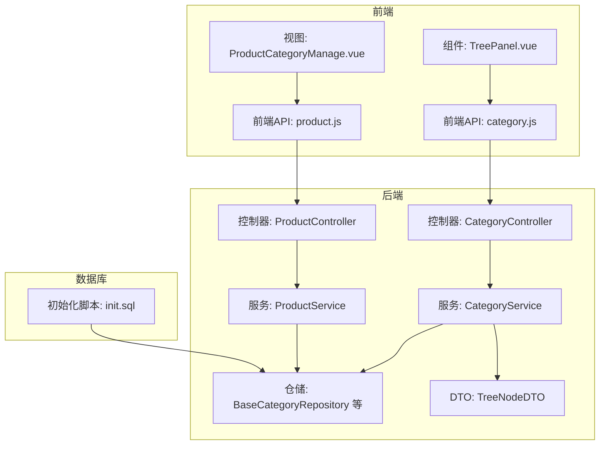
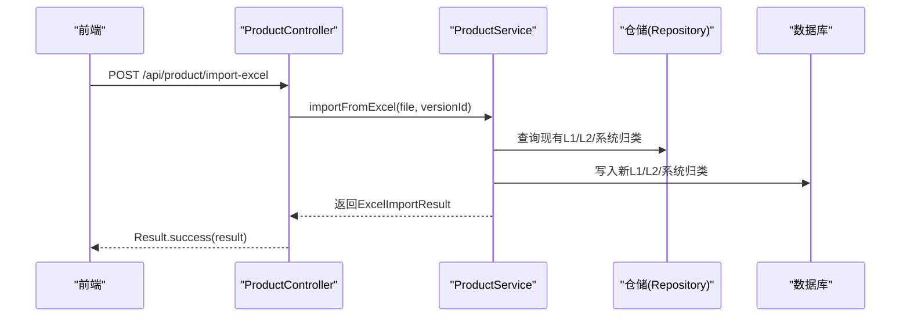
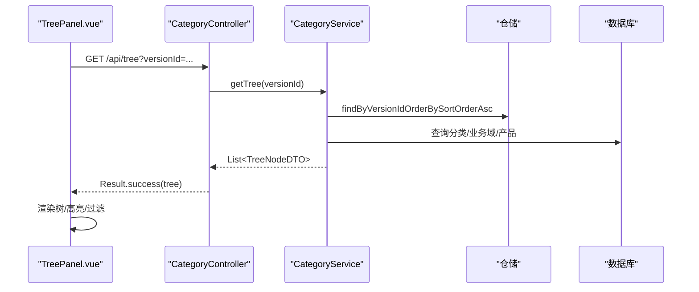
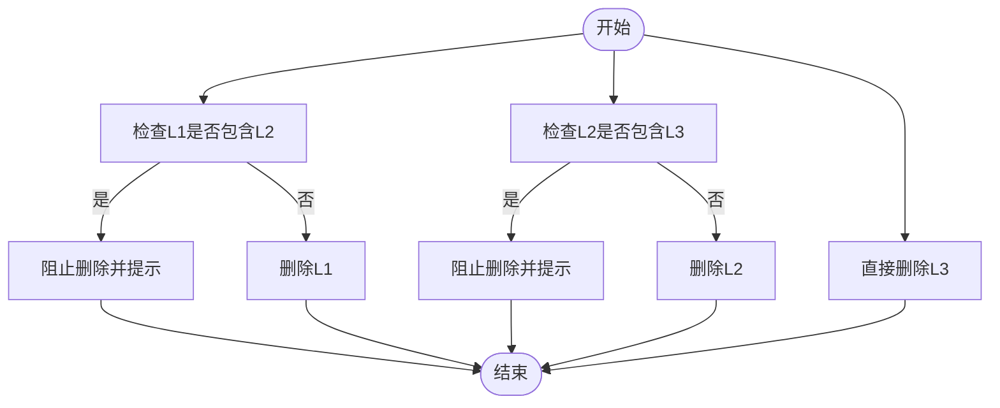
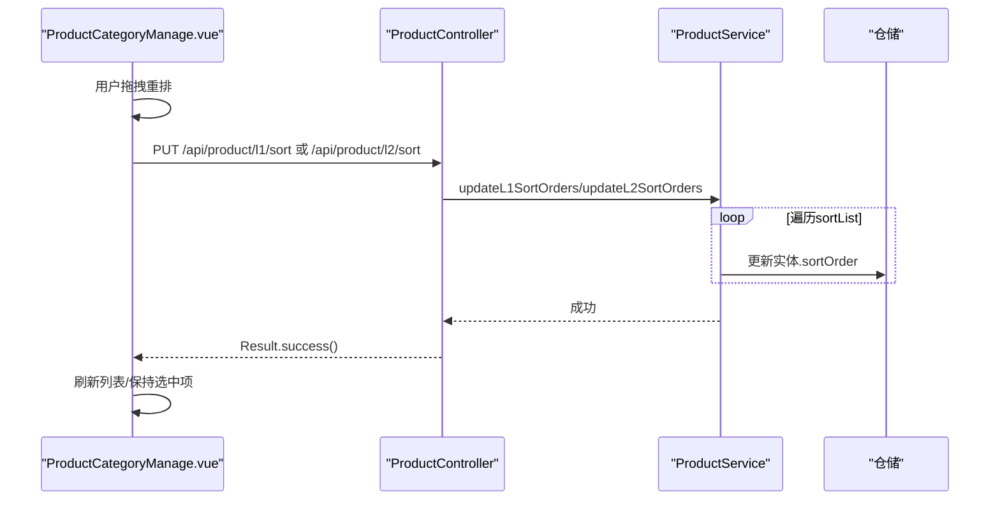
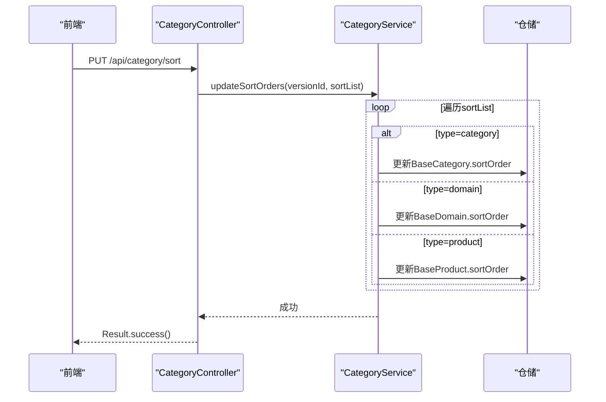
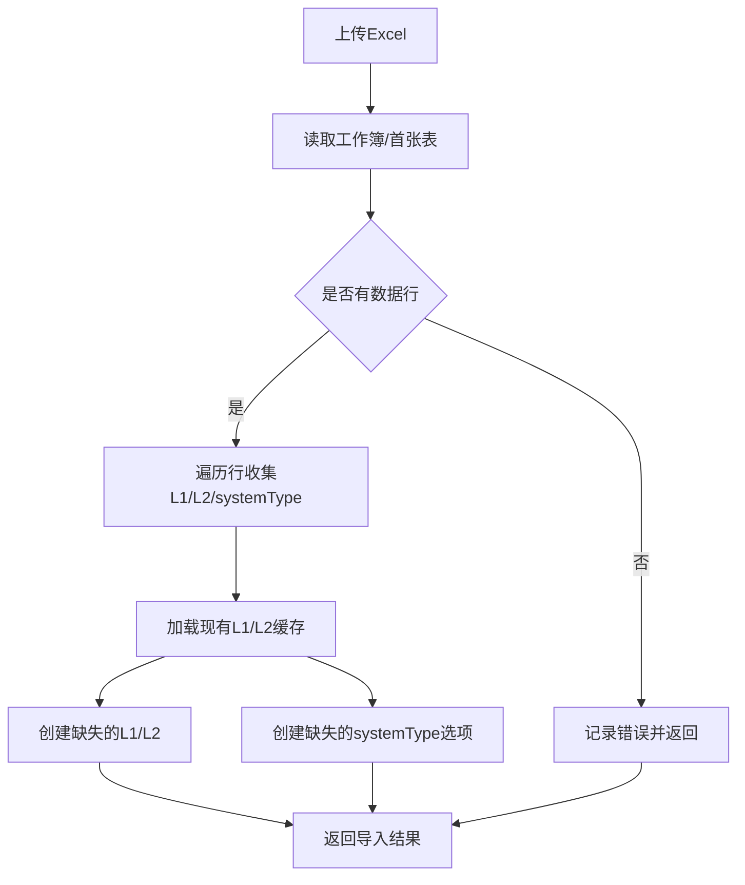
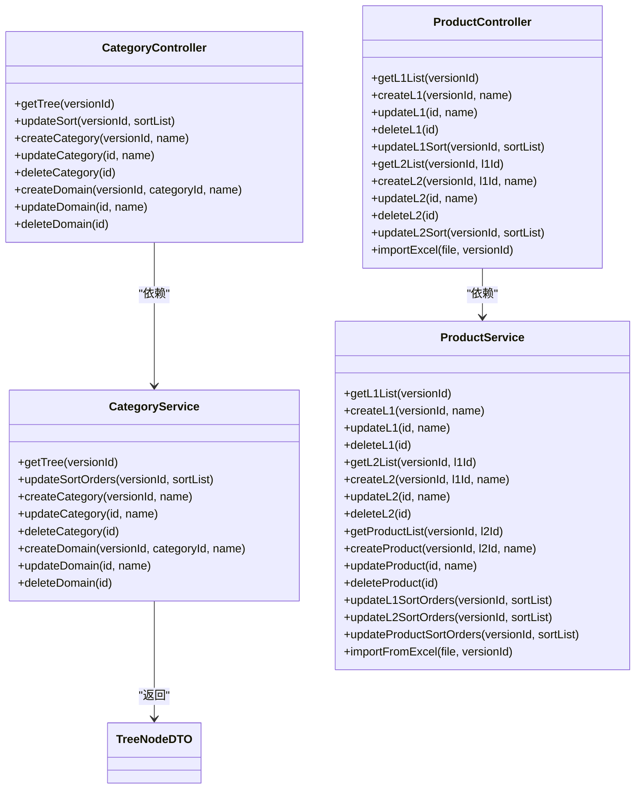

# 产品相关接口

<cite>
**本文引用的文件**
- [CategoryController.java](file://src/main/java/com/superpower/modules/category/controller/CategoryController.java)
- [ProductController.java](file://src/main/java/com/superpower/modules/category/controller/ProductController.java)
- [CategoryService.java](file://src/main/java/com/superpower/modules/category/service/CategoryService.java)
- [ProductService.java](file://src/main/java/com/superpower/modules/category/service/ProductService.java)
- [BaseCategory.java](file://src/main/java/com/superpower/modules/category/entity/BaseCategory.java)
- [BaseDomain.java](file://src/main/java/com/superpower/modules/category/entity/BaseDomain.java)
- [BaseProduct.java](file://src/main/java/com/superpower/modules/category/entity/BaseProduct.java)
- [BaseProductL1.java](file://src/main/java/com/superpower/modules/category/entity/BaseProductL1.java)
- [BaseProductL2.java](file://src/main/java/com/superpower/modules/category/entity/BaseProductL2.java)
- [TreeNodeDTO.java](file://src/main/java/com/superpower/modules/data/dto/TreeNodeDTO.java)
- [category.js](file://frontend/src/api/category.js)
- [product.js](file://frontend/src/api/product.js)
- [ProductCategoryManage.vue](file://frontend/src/views/system/ProductCategoryManage.vue)
- [TreePanel.vue](file://frontend/src/components/TreePanel.vue)
- [init.sql](file://src/main/resources/db/init.sql)
</cite>

## 目录
1. [简介](#简介)
2. [项目结构](#项目结构)
3. [核心组件](#核心组件)
4. [架构总览](#架构总览)
5. [详细组件分析](#详细组件分析)
6. [依赖关系分析](#依赖关系分析)
7. [性能考虑](#性能考虑)
8. [故障排查指南](#故障排查指南)
9. [结论](#结论)
10. [附录](#附录)

## 简介
本技术文档聚焦于产品相关接口，涵盖产品分类管理与产品信息维护两大能力域。系统支持三层产品分类（L1/L2/L3）的增删改查与层级排序，提供分类树构建与渲染、产品数据导入导出与批量操作、以及与前端交互的完整API体系。文档从架构、数据模型、接口定义、调用流程、错误处理与性能优化等维度进行深入解析，并给出使用示例与最佳实践。

## 项目结构
后端采用Spring Boot分层架构，按模块组织控制器、服务与仓储；前端以Vue3 + Element Plus实现管理界面与交互逻辑。数据库初始化脚本定义了基础表结构，产品分类与产品实体分别对应三层分类与产品数据。

图表来源
- [CategoryController.java:1-66](file://src/main/java/com/superpower/modules/category/controller/CategoryController.java#L1-L66)
- [ProductController.java:1-88](file://src/main/java/com/superpower/modules/category/controller/ProductController.java#L1-L88)
- [CategoryService.java:1-273](file://src/main/java/com/superpower/modules/category/service/CategoryService.java#L1-L273)
- [ProductService.java:1-356](file://src/main/java/com/superpower/modules/category/service/ProductService.java#L1-L356)
- [TreeNodeDTO.java:1-16](file://src/main/java/com/superpower/modules/data/dto/TreeNodeDTO.java#L1-L16)
- [category.js:1-34](file://frontend/src/api/category.js#L1-L34)
- [product.js:1-65](file://frontend/src/api/product.js#L1-L65)
- [ProductCategoryManage.vue:1-464](file://frontend/src/views/system/ProductCategoryManage.vue#L1-L464)
- [TreePanel.vue:1-200](file://frontend/src/components/TreePanel.vue#L1-L200)
- [init.sql:1-126](file://src/main/resources/db/init.sql#L1-L126)

章节来源
- [CategoryController.java:1-66](file://src/main/java/com/superpower/modules/category/controller/CategoryController.java#L1-L66)
- [ProductController.java:1-88](file://src/main/java/com/superpower/modules/category/controller/ProductController.java#L1-L88)
- [CategoryService.java:1-273](file://src/main/java/com/superpower/modules/category/service/CategoryService.java#L1-L273)
- [ProductService.java:1-356](file://src/main/java/com/superpower/modules/category/service/ProductService.java#L1-L356)
- [TreeNodeDTO.java:1-16](file://src/main/java/com/superpower/modules/data/dto/TreeNodeDTO.java#L1-L16)
- [category.js:1-34](file://frontend/src/api/category.js#L1-L34)
- [product.js:1-65](file://frontend/src/api/product.js#L1-L65)
- [ProductCategoryManage.vue:1-464](file://frontend/src/views/system/ProductCategoryManage.vue#L1-L464)
- [TreePanel.vue:1-200](file://frontend/src/components/TreePanel.vue#L1-L200)
- [init.sql:1-126](file://src/main/resources/db/init.sql#L1-L126)

## 核心组件
- 分类控制器：提供分类树查询、分类/业务域/产品节点的增删改查与排序更新接口。
- 产品控制器：提供L1/L2/L3层级的产品分类与产品实体的增删改查与排序更新，以及Excel导入接口。
- 分类服务：负责构建分类树、更新排序、创建/更新/删除分类与业务域，并同步数据条目。
- 产品服务：负责L1/L2/L3实体的CRUD、排序更新、跨版本复制、Excel导入与系统归类选项写入。
- 数据传输对象：TreeNodeDTO用于前后端树形结构数据交换。
- 前端API与视图：封装REST调用、实现拖拽重排、弹窗编辑、Excel导入与树形导航。

章节来源
- [CategoryController.java:1-66](file://src/main/java/com/superpower/modules/category/controller/CategoryController.java#L1-L66)
- [ProductController.java:1-88](file://src/main/java/com/superpower/modules/category/controller/ProductController.java#L1-L88)
- [CategoryService.java:1-273](file://src/main/java/com/superpower/modules/category/service/CategoryService.java#L1-L273)
- [ProductService.java:1-356](file://src/main/java/com/superpower/modules/category/service/ProductService.java#L1-L356)
- [TreeNodeDTO.java:1-16](file://src/main/java/com/superpower/modules/data/dto/TreeNodeDTO.java#L1-L16)
- [category.js:1-34](file://frontend/src/api/category.js#L1-L34)
- [product.js:1-65](file://frontend/src/api/product.js#L1-L65)
- [ProductCategoryManage.vue:1-464](file://frontend/src/views/system/ProductCategoryManage.vue#L1-L464)
- [TreePanel.vue:1-200](file://frontend/src/components/TreePanel.vue#L1-L200)

## 架构总览
系统采用经典的MVC分层与DDD仓储模式：
- 控制器层：暴露REST接口，接收请求参数并返回统一结果包装。
- 服务层：编排业务逻辑，执行事务性操作，处理跨实体关联。
- 仓储层：访问数据库，提供实体查询与持久化。
- 前端层：通过API封装进行交互，提供树形导航、表格编辑、拖拽排序与Excel导入。

图表来源
- [ProductController.java:80-86](file://src/main/java/com/superpower/modules/category/controller/ProductController.java#L80-L86)
- [ProductService.java:235-348](file://src/main/java/com/superpower/modules/category/service/ProductService.java#L235-L348)

## 详细组件分析

### 分类树构建与渲染
- 后端通过CategoryService的getTree方法，按版本号查询L1分类、L2业务域与L3产品，组装TreeNodeDTO树形结构。
- 前端TreePanel组件拉取树数据并支持过滤与高亮定位，点击节点触发上层选择事件。

图表来源
- [CategoryController.java:23-26](file://src/main/java/com/superpower/modules/category/controller/CategoryController.java#L23-L26)
- [CategoryService.java:36-78](file://src/main/java/com/superpower/modules/category/service/CategoryService.java#L36-L78)
- [TreePanel.vue:59-67](file://frontend/src/components/TreePanel.vue#L59-L67)

章节来源
- [CategoryController.java:23-26](file://src/main/java/com/superpower/modules/category/controller/CategoryController.java#L23-L26)
- [CategoryService.java:36-78](file://src/main/java/com/superpower/modules/category/service/CategoryService.java#L36-L78)
- [TreePanel.vue:59-67](file://frontend/src/components/TreePanel.vue#L59-L67)

### 分类层级操作（L1/L2/L3）
- L1（统计分类）：支持列表查询、创建、更新、删除与排序更新。
- L2（核心业务方向）：支持按L1筛选的列表查询、创建、更新、删除与排序更新。
- L3（核心业务产品）：支持按L2筛选的产品列表查询、创建、更新、删除与排序更新。
- 删除约束：各层级删除前会检查是否存在下级实体，避免破坏层级完整性。

图表来源
- [ProductService.java:67-114](file://src/main/java/com/superpower/modules/category/service/ProductService.java#L67-L114)

章节来源
- [ProductController.java:24-86](file://src/main/java/com/superpower/modules/category/controller/ProductController.java#L24-L86)
- [ProductService.java:40-185](file://src/main/java/com/superpower/modules/category/service/ProductService.java#L40-L185)

### 排序与层级调整
- 支持对分类、业务域与产品三类节点进行批量排序更新，服务层根据type字段区分类型并更新对应实体的sortOrder。
- 前端通过拖拽改变顺序，生成排序列表并调用PUT接口更新。

图表来源
- [ProductController.java:46-78](file://src/main/java/com/superpower/modules/category/controller/ProductController.java#L46-L78)
- [ProductService.java:154-185](file://src/main/java/com/superpower/modules/category/service/ProductService.java#L154-L185)
- [ProductCategoryManage.vue:257-288](file://frontend/src/views/system/ProductCategoryManage.vue#L257-L288)

章节来源
- [ProductController.java:46-78](file://src/main/java/com/superpower/modules/category/controller/ProductController.java#L46-L78)
- [ProductService.java:154-185](file://src/main/java/com/superpower/modules/category/service/ProductService.java#L154-L185)
- [ProductCategoryManage.vue:257-288](file://frontend/src/views/system/ProductCategoryManage.vue#L257-L288)

### 分类树节点排序（分类/业务域/产品）
- 支持对分类树中的任意节点进行排序更新，服务层根据传入的type字段判断具体类型并更新对应实体的排序字段。

图表来源
- [CategoryController.java:28-32](file://src/main/java/com/superpower/modules/category/controller/CategoryController.java#L28-L32)
- [CategoryService.java:80-103](file://src/main/java/com/superpower/modules/category/service/CategoryService.java#L80-L103)

章节来源
- [CategoryController.java:28-32](file://src/main/java/com/superpower/modules/category/controller/CategoryController.java#L28-L32)
- [CategoryService.java:80-103](file://src/main/java/com/superpower/modules/category/service/CategoryService.java#L80-L103)

### 产品数据导入与批量操作
- Excel导入：读取第一张表，扫描统计分类（L1）、核心业务产品（L2）与系统归类（systemType），去重后批量创建或复用现有实体，同时智能合并系统归类选项。
- 成功行数统计与错误收集，便于前端反馈。

图表来源
- [ProductController.java:80-86](file://src/main/java/com/superpower/modules/category/controller/ProductController.java#L80-L86)
- [ProductService.java:235-348](file://src/main/java/com/superpower/modules/category/service/ProductService.java#L235-L348)

章节来源
- [ProductController.java:80-86](file://src/main/java/com/superpower/modules/category/controller/ProductController.java#L80-L86)
- [ProductService.java:235-348](file://src/main/java/com/superpower/modules/category/service/ProductService.java#L235-L348)
- [ProductCategoryManage.vue:388-413](file://frontend/src/views/system/ProductCategoryManage.vue#L388-L413)

### 图片管理、规格参数与价格信息
- 数据库初始化脚本展示了data_entry表的丰富字段，涵盖产品系统、应用角色、功能说明、状态、版本划分、交付工作量、控标点截图、软著、备注、智能化、年份列等，可作为产品图片、规格参数与价格信息的承载字段。
- 建议在后续扩展中，将图片资源与规格参数映射到data_entry的相应列，或引入独立的图片与规格参数表并通过外键关联。

章节来源
- [init.sql:68-125](file://src/main/resources/db/init.sql#L68-L125)

## 依赖关系分析
- 控制器依赖服务层，服务层依赖仓储层与DTO；前端API封装调用控制器，视图组件依赖API与组件库。
- 分类服务与产品服务均依赖数据条目仓储，用于同步分类变更到通用数据条目结构。

图表来源
- [CategoryController.java:1-66](file://src/main/java/com/superpower/modules/category/controller/CategoryController.java#L1-L66)
- [ProductController.java:1-88](file://src/main/java/com/superpower/modules/category/controller/ProductController.java#L1-L88)
- [CategoryService.java:1-273](file://src/main/java/com/superpower/modules/category/service/CategoryService.java#L1-L273)
- [ProductService.java:1-356](file://src/main/java/com/superpower/modules/category/service/ProductService.java#L1-L356)
- [TreeNodeDTO.java:1-16](file://src/main/java/com/superpower/modules/data/dto/TreeNodeDTO.java#L1-L16)

章节来源
- [CategoryController.java:1-66](file://src/main/java/com/superpower/modules/category/controller/CategoryController.java#L1-L66)
- [ProductController.java:1-88](file://src/main/java/com/superpower/modules/category/controller/ProductController.java#L1-L88)
- [CategoryService.java:1-273](file://src/main/java/com/superpower/modules/category/service/CategoryService.java#L1-L273)
- [ProductService.java:1-356](file://src/main/java/com/superpower/modules/category/service/ProductService.java#L1-L356)
- [TreeNodeDTO.java:1-16](file://src/main/java/com/superpower/modules/data/dto/TreeNodeDTO.java#L1-L16)

## 性能考虑
- 查询优化：树构建与列表查询均按版本号与排序字段进行有序查询，建议在版本号、层级、父节点与排序字段建立索引以提升查询效率。
- 批量更新：排序更新与导入过程涉及多次写入，建议在事务内批量提交，减少往返开销。
- 前端渲染：树节点数量较大时，建议启用虚拟滚动与懒加载，降低DOM压力。
- 文件导入：Excel解析在内存中进行，建议限制文件大小与并发导入数量，避免内存溢出。

## 故障排查指南
- 删除失败：若提示“存在下级实体不可删除”，需先清理下级节点后再试。
- 排序异常：检查sortList中id与sortOrder是否匹配，确保type字段正确。
- 导入错误：查看返回的错误集合，常见问题包括空数据行、重复值、字段为空等。
- 权限与版本：部分操作受版本状态限制，需确保当前版本处于草稿态。

章节来源
- [ProductService.java:67-114](file://src/main/java/com/superpower/modules/category/service/ProductService.java#L67-L114)
- [CategoryService.java:80-103](file://src/main/java/com/superpower/modules/category/service/CategoryService.java#L80-L103)
- [ProductService.java:235-348](file://src/main/java/com/superpower/modules/category/service/ProductService.java#L235-L348)
- [ProductCategoryManage.vue:324-341](file://frontend/src/views/system/ProductCategoryManage.vue#L324-L341)

## 结论
本系统提供了完整的产品分类与产品信息维护能力，覆盖三层分类的全生命周期管理、树形结构渲染、排序调整、Excel导入与批量操作。通过清晰的分层架构与统一的结果封装，前后端协作高效稳定。建议后续结合业务需求扩展图片与规格参数的专用表结构，并持续优化查询与导入性能。

## 附录

### API一览（按模块）

- 分类树与排序
  - GET /api/tree?versionId=... → 获取分类树
  - PUT /api/category/sort → 更新分类/业务域/产品排序
  - POST /api/category → 创建分类
  - PUT /api/category/{id} → 更新分类
  - DELETE /api/category/{id} → 删除分类
  - POST /api/domain → 创建业务域
  - PUT /api/domain/{id} → 更新业务域
  - DELETE /api/domain/{id} → 删除业务域

- 产品层级（L1/L2/L3）
  - GET /api/product/l1/list?versionId=... → L1列表
  - POST /api/product/l1 → 创建L1
  - PUT /api/product/l1/{id} → 更新L1
  - DELETE /api/product/l1/{id} → 删除L1
  - PUT /api/product/l1/sort → 更新L1排序
  - GET /api/product/l2/list?versionId=...&l1Id=... → L2列表
  - POST /api/product/l2 → 创建L2
  - PUT /api/product/l2/{id} → 更新L2
  - DELETE /api/product/l2/{id} → 删除L2
  - PUT /api/product/l2/sort → 更新L2排序
  - POST /api/product/import-excel → Excel导入

章节来源
- [CategoryController.java:23-64](file://src/main/java/com/superpower/modules/category/controller/CategoryController.java#L23-L64)
- [ProductController.java:24-86](file://src/main/java/com/superpower/modules/category/controller/ProductController.java#L24-L86)

### 使用示例与最佳实践
- 拖拽排序：在产品分类管理页，通过拖拽行头的“⠿”图标进行排序，完成后自动调用排序接口并刷新列表。
- Excel导入：在产品分类管理页点击“导入Excel”，选择文件后自动上传并反馈处理结果。
- 树形导航：在树面板中输入关键字进行过滤，点击节点可高亮对应分类/业务域。
- 最佳实践：
  - 版本状态为“已发布”时禁用编辑与删除操作，确保数据一致性。
  - 导入前确保Excel格式规范，避免空行与重复值。
  - 定期备份数据库，导入前做好版本切换与回滚准备。

章节来源
- [ProductCategoryManage.vue:193-288](file://frontend/src/views/system/ProductCategoryManage.vue#L193-L288)
- [ProductCategoryManage.vue:388-413](file://frontend/src/views/system/ProductCategoryManage.vue#L388-L413)
- [TreePanel.vue:55-81](file://frontend/src/components/TreePanel.vue#L55-L81)