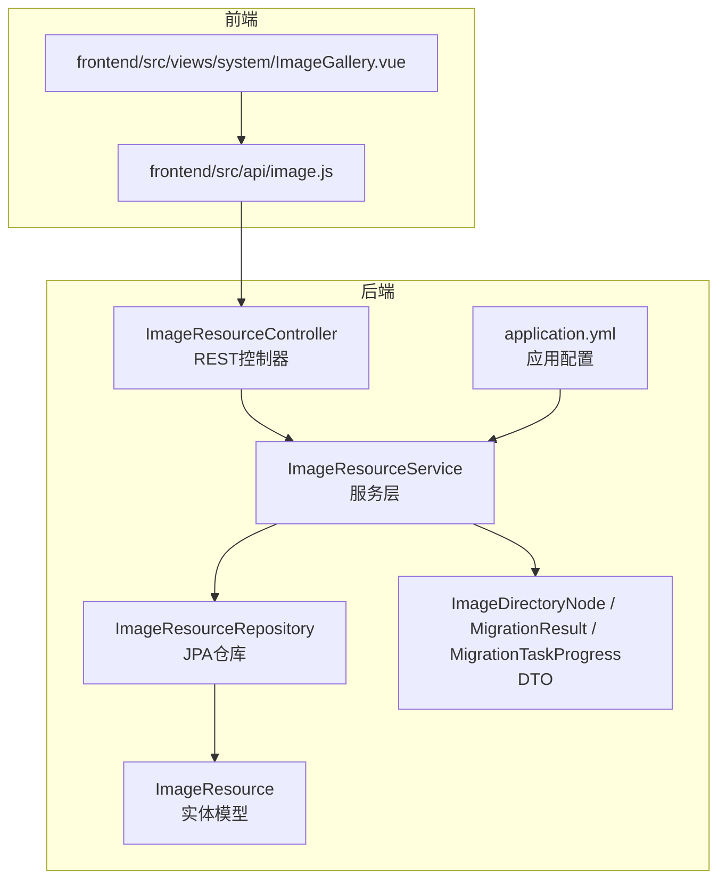
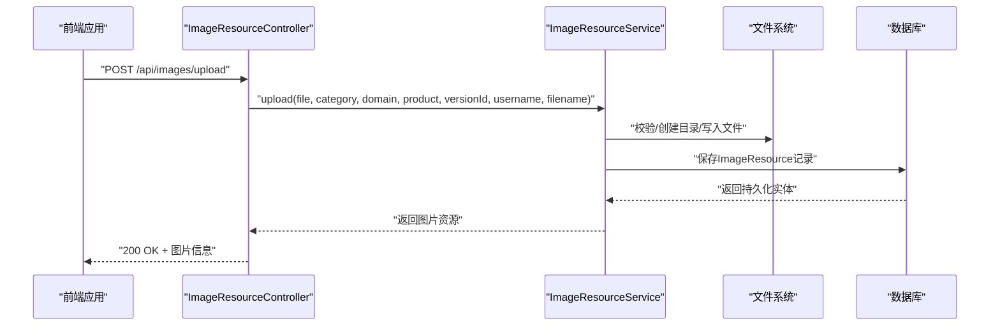
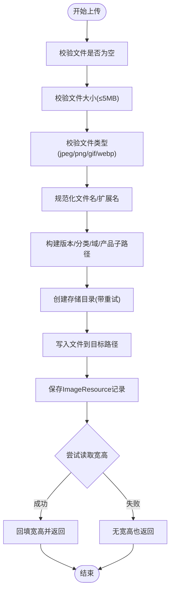
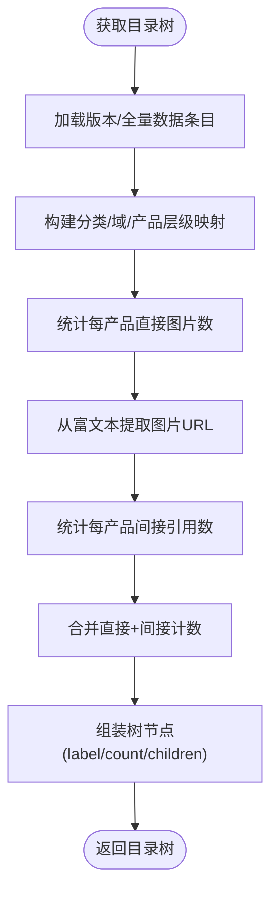
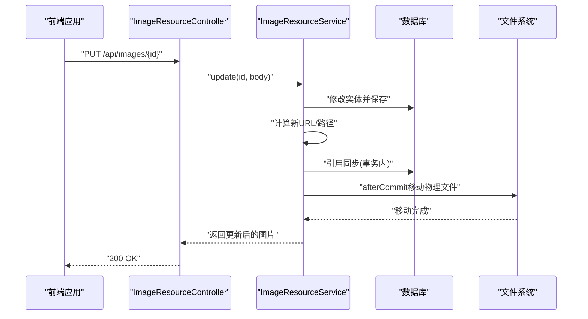
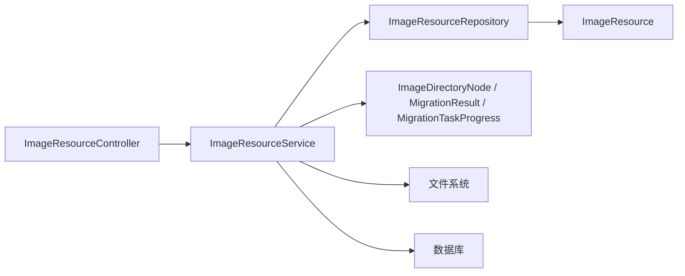

# 图片资源接口

<cite>
**本文档引用的文件**
- [ImageResourceController.java](file://src/main/java/com/superpower/modules/image/controller/ImageResourceController.java)
- [ImageResourceService.java](file://src/main/java/com/superpower/modules/image/service/ImageResourceService.java)
- [ImageResource.java](file://src/main/java/com/superpower/modules/image/entity/ImageResource.java)
- [ImageResourceRepository.java](file://src/main/java/com/superpower/modules/image/repository/ImageResourceRepository.java)
- [ImageDirectoryNode.java](file://src/main/java/com/superpower/modules/image/dto/ImageDirectoryNode.java)
- [MigrationResult.java](file://src/main/java/com/superpower/modules/image/dto/MigrationResult.java)
- [MigrationTaskProgress.java](file://src/main/java/com/superpower/modules/image/dto/MigrationTaskProgress.java)
- [application.yml](file://src/main/resources/application.yml)
- [image.js](file://frontend/src/api/image.js)
- [V1.0.4_add_image_width_height.sql](file://db_changes/V1.0.4_add_image_width_height.sql)
- [V1.0.7_migrate_image_files.sh](file://db_changes/V1.0.7_migrate_image_files.sh)
- [2026-06-11-fix-image-directory-depth.md](file://docs/superpowers/plans/2026-06-11-fix-image-directory-depth.md)
- [DocumentService.java](file://src/main/java/com/superpower/modules/document/service/DocumentService.java)
- [generate_word.py](file://generate_word.py)
- [ImageGallery.vue](file://frontend/src/views/system/ImageGallery.vue)
</cite>

## 目录
1. [简介](#简介)
2. [项目结构](#项目结构)
3. [核心组件](#核心组件)
4. [架构总览](#架构总览)
5. [详细组件分析](#详细组件分析)
6. [依赖分析](#依赖分析)
7. [性能考虑](#性能考虑)
8. [故障排查指南](#故障排查指南)
9. [结论](#结论)
10. [附录](#附录)

## 简介
本技术文档围绕图片资源接口进行深入解析，覆盖图片上传、存储与管理的完整API实现，包括图片文件上传、缩略图生成、图片分类、查询、删除与批量操作、目录结构管理、存储路径配置、访问权限控制、图片预览、格式转换与质量压缩、文件大小限制、格式验证与安全检查等。文档同时提供使用示例与性能优化建议，帮助开发者快速理解并高效集成图片资源能力。

## 项目结构
后端采用Spring Boot + JPA架构，图片模块位于com.superpower.modules.image包下，前端位于frontend/src/api与views目录中。数据库层通过JPA仓库访问image_resource表，应用配置通过application.yml统一管理。

**图表来源**
- [ImageResourceController.java:25-152](file://src/main/java/com/superpower/modules/image/controller/ImageResourceController.java#L25-L152)
- [ImageResourceService.java:42-76](file://src/main/java/com/superpower/modules/image/service/ImageResourceService.java#L42-L76)
- [ImageResourceRepository.java:13-38](file://src/main/java/com/superpower/modules/image/repository/ImageResourceRepository.java#L13-L38)
- [ImageResource.java:10-59](file://src/main/java/com/superpower/modules/image/entity/ImageResource.java#L10-L59)
- [ImageDirectoryNode.java:7-11](file://src/main/java/com/superpower/modules/image/dto/ImageDirectoryNode.java#L7-L11)
- [MigrationResult.java:8-21](file://src/main/java/com/superpower/modules/image/dto/MigrationResult.java#L8-L21)
- [MigrationTaskProgress.java:8-17](file://src/main/java/com/superpower/modules/image/dto/MigrationTaskProgress.java#L8-L17)
- [application.yml:35-40](file://src/main/resources/application.yml#L35-L40)

**章节来源**
- [ImageResourceController.java:25-152](file://src/main/java/com/superpower/modules/image/controller/ImageResourceController.java#L25-L152)
- [application.yml:1-40](file://src/main/resources/application.yml#L1-L40)

## 核心组件
- 控制器层：提供REST接口，负责请求参数接收、鉴权与日志记录，并调用服务层完成业务处理。
- 服务层：实现图片上传、存储路径构建、文件校验、引用同步、重命名与文件替换、树形目录展示、引用查询、外部图片迁移进度跟踪等核心逻辑。
- 数据访问层：基于JPA仓库提供图片资源的查询与删除能力。
- 实体与DTO：定义图片资源字段、树节点结构与迁移结果/进度数据传输对象。
- 前端API：封装上传、查询、删除、重命名、替换文件、引用查询、批量操作等HTTP请求。

**章节来源**
- [ImageResourceController.java:25-152](file://src/main/java/com/superpower/modules/image/controller/ImageResourceController.java#L25-L152)
- [ImageResourceService.java:42-76](file://src/main/java/com/superpower/modules/image/service/ImageResourceService.java#L42-L76)
- [ImageResourceRepository.java:13-38](file://src/main/java/com/superpower/modules/image/repository/ImageResourceRepository.java#L13-L38)
- [ImageResource.java:10-59](file://src/main/java/com/superpower/modules/image/entity/ImageResource.java#L10-L59)
- [ImageDirectoryNode.java:7-11](file://src/main/java/com/superpower/modules/image/dto/ImageDirectoryNode.java#L7-L11)
- [MigrationResult.java:8-21](file://src/main/java/com/superpower/modules/image/dto/MigrationResult.java#L8-L21)
- [MigrationTaskProgress.java:8-17](file://src/main/java/com/superpower/modules/image/dto/MigrationTaskProgress.java#L8-L17)
- [image.js:24-93](file://frontend/src/api/image.js#L24-L93)

## 架构总览
图片资源接口遵循分层架构，前后端通过REST API交互，后端服务层协调JPA仓库与文件系统，确保数据库与物理文件的一致性。

**图表来源**
- [ImageResourceController.java:52-65](file://src/main/java/com/superpower/modules/image/controller/ImageResourceController.java#L52-L65)
- [ImageResourceService.java:78-184](file://src/main/java/com/superpower/modules/image/service/ImageResourceService.java#L78-L184)

**章节来源**
- [ImageResourceController.java:52-65](file://src/main/java/com/superpower/modules/image/controller/ImageResourceController.java#L52-L65)
- [ImageResourceService.java:78-184](file://src/main/java/com/superpower/modules/image/service/ImageResourceService.java#L78-L184)

## 详细组件分析

### 1) 图片上传与存储
- 接口：POST /api/images/upload
- 功能：接收MultipartFile，进行文件大小与类型校验，构建存储路径与URL，写入文件系统，保存数据库记录，并回填图片宽高。
- 关键点：
  - 文件大小限制与类型白名单校验。
  - 存储路径按版本号、分类、域、产品（L3）层级组织。
  - URL前缀区分普通图片与需求图片目录。
  - 写入后尝试读取图片宽高并保存。

**图表来源**
- [ImageResourceService.java:78-184](file://src/main/java/com/superpower/modules/image/service/ImageResourceService.java#L78-L184)

**章节来源**
- [ImageResourceController.java:52-65](file://src/main/java/com/superpower/modules/image/controller/ImageResourceController.java#L52-L65)
- [ImageResourceService.java:78-184](file://src/main/java/com/superpower/modules/image/service/ImageResourceService.java#L78-L184)
- [application.yml:13-15](file://src/main/resources/application.yml#L13-L15)

### 2) 图片分类与目录树
- 接口：GET /api/images/tree
- 功能：根据版本号或全量数据生成图片目录树，统计每个产品下的直接与间接引用数量。
- 关键点：
  - 从基础分类/域/产品数据与图片资源统计构建树结构。
  - 通过富文本描述中的URL匹配间接引用图片。

**图表来源**
- [ImageResourceService.java:484-707](file://src/main/java/com/superpower/modules/image/service/ImageResourceService.java#L484-L707)

**章节来源**
- [ImageResourceController.java:67-71](file://src/main/java/com/superpower/modules/image/controller/ImageResourceController.java#L67-L71)
- [ImageResourceService.java:484-707](file://src/main/java/com/superpower/modules/image/service/ImageResourceService.java#L484-L707)

### 3) 图片查询与过滤
- 接口：GET /api/images
- 功能：支持按分类、域、产品、产品ID、版本号、是否包含引用等条件查询。
- 关键点：
  - 直接查询与引用查询组合，引用查询基于富文本描述中的URL匹配。

**章节来源**
- [ImageResourceController.java:73-82](file://src/main/java/com/superpower/modules/image/controller/ImageResourceController.java#L73-L82)
- [ImageResourceService.java:186-271](file://src/main/java/com/superpower/modules/image/service/ImageResourceService.java#L186-L271)

### 4) 图片删除与批量删除
- 接口：
  - DELETE /api/images/{id}（管理员角色）
  - POST /api/images/batch-delete（管理员角色）
- 功能：删除数据库记录并删除物理文件；批量删除逐项处理。
- 关键点：
  - 删除后尝试删除物理文件，忽略异常避免阻塞。

**章节来源**
- [ImageResourceController.java:84-102](file://src/main/java/com/superpower/modules/image/controller/ImageResourceController.java#L84-L102)
- [ImageResourceService.java:273-292](file://src/main/java/com/superpower/modules/image/service/ImageResourceService.java#L273-L292)

### 5) 图片重命名与文件替换
- 接口：
  - PUT /api/images/{id}（支持修改文件名、分类、域、产品）
  - PUT /api/images/{id}/file（替换文件内容）
- 功能：重命名时同步更新URL与引用中的图片信息；替换文件时保持原路径与URL不变。
- 关键点：
  - 重命名流程分为“实体修改+保存”和“事务提交后的物理文件移动”，确保数据库与文件系统一致性。
  - 引用同步在事务内完成，确保原子性。

**图表来源**
- [ImageResourceController.java:104-119](file://src/main/java/com/superpower/modules/image/controller/ImageResourceController.java#L104-L119)
- [ImageResourceService.java:294-400](file://src/main/java/com/superpower/modules/image/service/ImageResourceService.java#L294-L400)

**章节来源**
- [ImageResourceController.java:104-119](file://src/main/java/com/superpower/modules/image/controller/ImageResourceController.java#L104-L119)
- [ImageResourceService.java:294-400](file://src/main/java/com/superpower/modules/image/service/ImageResourceService.java#L294-L400)

### 6) 外部图片迁移与进度查询
- 接口：
  - POST /api/images/migrate-external-images（管理员角色）
  - GET /api/images/migrate-task/{taskId}
- 功能：启动外部图片迁移任务并查询进度，返回任务状态、成功/失败计数与失败详情。

**章节来源**
- [ImageResourceController.java:121-131](file://src/main/java/com/superpower/modules/image/controller/ImageResourceController.java#L121-L131)
- [MigrationTaskProgress.java:8-17](file://src/main/java/com/superpower/modules/image/dto/MigrationTaskProgress.java#L8-L17)
- [MigrationResult.java:8-21](file://src/main/java/com/superpower/modules/image/dto/MigrationResult.java#L8-L21)

### 7) 引用查询与批量引用查询
- 接口：
  - GET /api/images/{id}/references
  - GET /api/images/{id}/all-references
  - GET /api/images/{id}/req-references
  - POST /api/images/batch-references
- 功能：查询图片在数据条目与需求条目中的引用情况，支持批量查询。

**章节来源**
- [ImageResourceController.java:133-151](file://src/main/java/com/superpower/modules/image/controller/ImageResourceController.java#L133-L151)
- [ImageResourceService.java:731-786](file://src/main/java/com/superpower/modules/image/service/ImageResourceService.java#L731-L786)

### 8) 前端API与使用示例
- 前端封装了上传、查询、删除、重命名、替换文件、引用查询、批量删除、迁移进度查询等方法。
- 使用示例（以函数形式呈现，非具体代码）：
  - 上传：调用uploadImage(file, category, domain, product, versionId, filename)，内部先进行PNG完整性校验再发起上传。
  - 查询树：getImageTree(versionId)。
  - 查询列表：getImages(params)。
  - 删除单张：deleteImage(id)。
  - 批量删除：batchDeleteImages(ids)。
  - 重命名：updateImage(id, { filename })。
  - 替换文件：replaceImageFile(id, file)。
  - 引用查询：getImageReferences(id)、getAllImageReferences(id)、getImageReqReferences(id)。
  - 迁移任务：migrateImages(entryIds)、getMigrationProgress(taskId)。

**章节来源**
- [image.js:24-93](file://frontend/src/api/image.js#L24-L93)
- [ImageGallery.vue:389-416](file://frontend/src/views/system/ImageGallery.vue#L389-L416)

## 依赖分析
- 组件耦合：
  - 控制器依赖服务层；服务层依赖仓库、实体与DTO；仓库依赖实体。
  - 服务层与文件系统、数据库交互，存在跨层依赖但职责清晰。
- 外部依赖：
  - Spring MVC、Spring Security（鉴权）、JPA/Hibernate、SQLite。
  - 前端通过axios封装请求，使用FormData上传文件。

**图表来源**
- [ImageResourceController.java:25-38](file://src/main/java/com/superpower/modules/image/controller/ImageResourceController.java#L25-L38)
- [ImageResourceService.java:42-76](file://src/main/java/com/superpower/modules/image/service/ImageResourceService.java#L42-L76)
- [ImageResourceRepository.java:13-38](file://src/main/java/com/superpower/modules/image/repository/ImageResourceRepository.java#L13-L38)
- [ImageResource.java:10-59](file://src/main/java/com/superpower/modules/image/entity/ImageResource.java#L10-L59)

**章节来源**
- [ImageResourceController.java:25-38](file://src/main/java/com/superpower/modules/image/controller/ImageResourceController.java#L25-L38)
- [ImageResourceService.java:42-76](file://src/main/java/com/superpower/modules/image/service/ImageResourceService.java#L42-L76)
- [ImageResourceRepository.java:13-38](file://src/main/java/com/superpower/modules/image/repository/ImageResourceRepository.java#L13-L38)

## 性能考虑
- 预览性能优化：数据库新增width与height字段，预览时无需下载图片即可获取尺寸，减少网络开销。
- 目录层级修复：通过迁移脚本与服务层逻辑确保目录层级不超过L3，降低文件系统遍历成本。
- 事务与文件系统一致性：重命名流程将物理移动放在事务提交后执行，避免数据库与文件系统不一致带来的回滚成本。
- 建议：
  - 对大文件上传建议在前端做分片或压缩处理（如适用）。
  - 对频繁查询场景可考虑缓存目录树与引用统计结果。
  - 批量操作建议异步化并提供进度查询接口。

**章节来源**
- [V1.0.4_add_image_width_height.sql:1-13](file://db_changes/V1.0.4_add_image_width_height.sql#L1-L13)
- [ImageResourceService.java:294-400](file://src/main/java/com/superpower/modules/image/service/ImageResourceService.java#L294-L400)
- [2026-06-11-fix-image-directory-depth.md:1-51](file://docs/superpowers/plans/2026-06-11-fix-image-directory-depth.md#L1-L51)

## 故障排查指南
- 上传失败：
  - 检查文件是否为空、大小是否超过限制、类型是否在白名单中。
  - 确认存储目录创建是否成功，必要时查看重试机制与线程中断处理。
- 重命名后引用未更新：
  - 确认事务内引用同步是否执行，检查富文本中的图片卡片属性替换逻辑。
- 物理文件移动失败：
  - 查看afterCommit阶段的日志，确认源路径与目标路径是否存在以及权限问题。
- 目录层级异常：
  - 检查产品参数是否为L3值，必要时参考迁移脚本与修复计划。
- 引用查询为空：
  - 确认URL前缀与存储路径一致，检查富文本中是否包含正确的图片URL。

**章节来源**
- [ImageResourceService.java:78-184](file://src/main/java/com/superpower/modules/image/service/ImageResourceService.java#L78-L184)
- [ImageResourceService.java:294-400](file://src/main/java/com/superpower/modules/image/service/ImageResourceService.java#L294-L400)
- [V1.0.7_migrate_image_files.sh:1-29](file://db_changes/V1.0.7_migrate_image_files.sh#L1-L29)
- [2026-06-11-fix-image-directory-depth.md:1-51](file://docs/superpowers/plans/2026-06-11-fix-image-directory-depth.md#L1-L51)

## 结论
图片资源接口通过清晰的分层设计与严格的文件校验、目录管理与引用同步机制，实现了从上传、存储、分类到查询、删除与迁移的完整闭环。结合数据库宽高字段与目录层级修复，显著提升了预览性能与文件系统可维护性。建议在生产环境中配合异步批量操作与进度查询，进一步提升用户体验与系统稳定性。

## 附录

### A. 存储路径与访问权限配置
- 存储路径配置：通过配置项app.image-storage-path指定图片存储根目录，默认为./uploads/images。
- 访问权限控制：删除与批量删除接口要求管理员角色，其他接口默认需要认证。

**章节来源**
- [application.yml:35-40](file://src/main/resources/application.yml#L35-L40)
- [ImageResourceController.java:84-102](file://src/main/java/com/superpower/modules/image/controller/ImageResourceController.java#L84-L102)

### B. 图片预览、格式转换与质量压缩
- 预览：数据库直接提供width与height，前端可直接渲染缩略图。
- 格式转换与质量压缩：文档生成功能包含PNG修复、WebP转PNG、图片压缩等能力，可作为图片处理参考实现。

**章节来源**
- [V1.0.4_add_image_width_height.sql:1-13](file://db_changes/V1.0.4_add_image_width_height.sql#L1-L13)
- [DocumentService.java:815-1004](file://src/main/java/com/superpower/modules/document/service/DocumentService.java#L815-L1004)
- [generate_word.py:162-183](file://generate_word.py#L162-L183)

### C. 目录结构管理与迁移
- 目录结构：按版本号/分类/域/产品(L3)/文件组织，确保层级不超过L3。
- 迁移脚本：提供物理文件迁移与数据库修复脚本，确保历史数据一致性。

**章节来源**
- [2026-06-11-fix-image-directory-depth.md:1-51](file://docs/superpowers/plans/2026-06-11-fix-image-directory-depth.md#L1-L51)
- [V1.0.7_migrate_image_files.sh:1-29](file://db_changes/V1.0.7_migrate_image_files.sh#L1-L29)