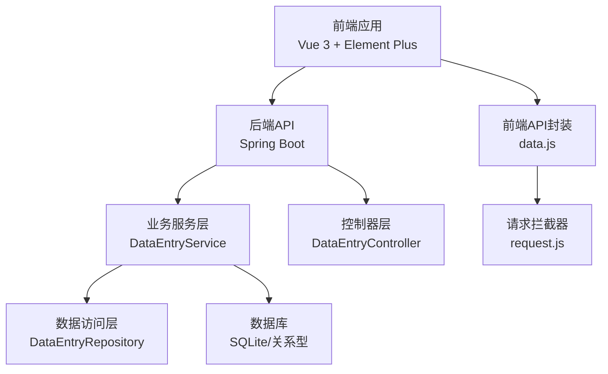
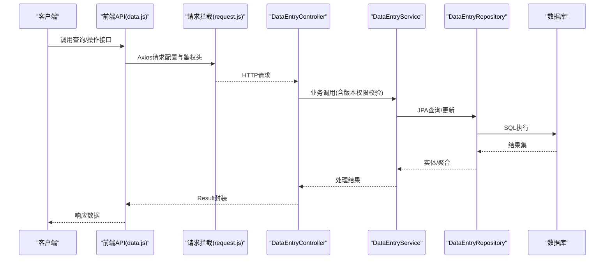
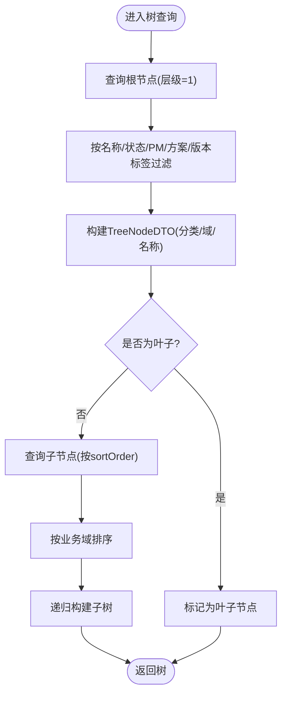
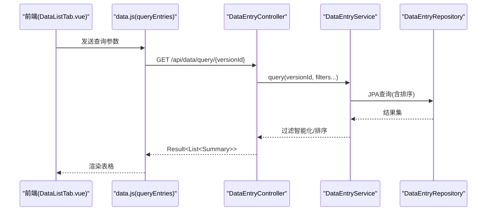
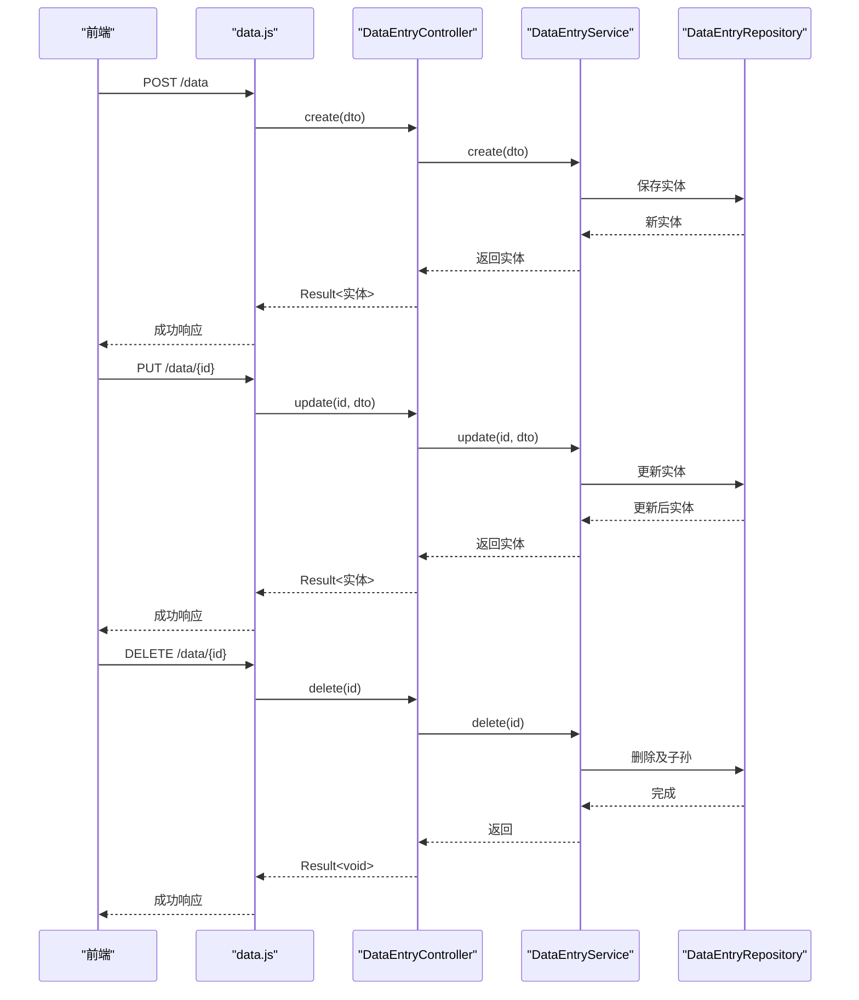
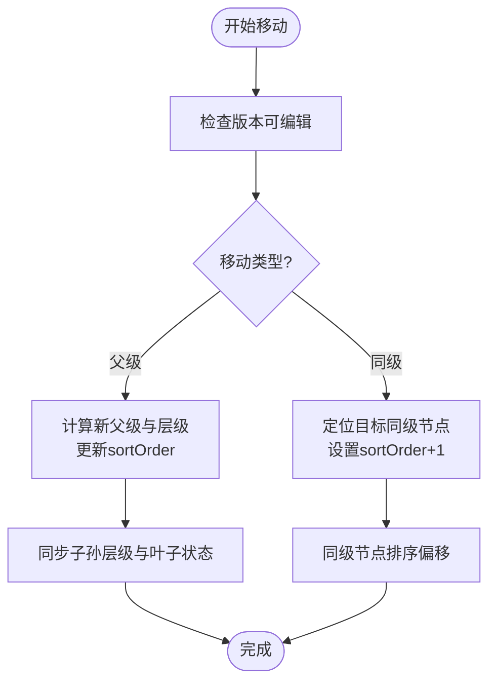
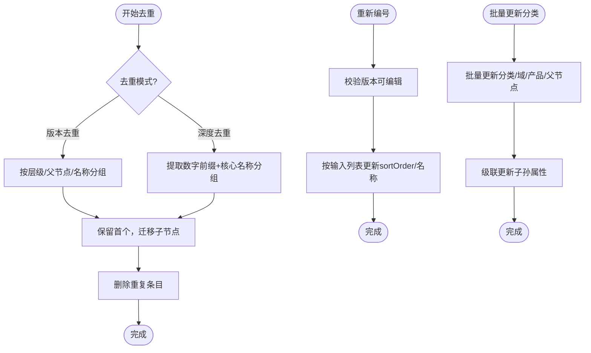
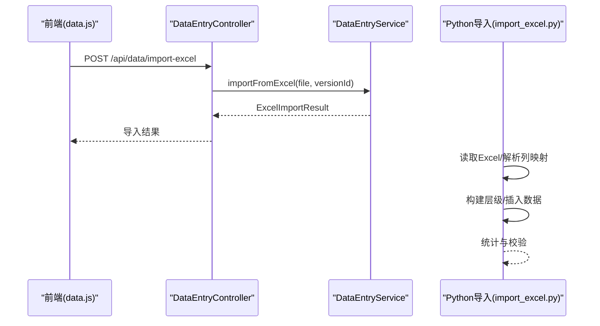
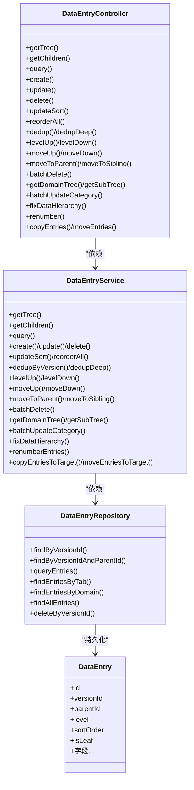

# 数据管理接口

<cite>
**本文档引用的文件**
- [DataEntryController.java](file://src/main/java/com/superpower/modules/data/controller/DataEntryController.java)
- [DataEntryService.java](file://src/main/java/com/superpower/modules/data/service/DataEntryService.java)
- [DataEntry.java](file://src/main/java/com/superpower/modules/data/entity/DataEntry.java)
- [DataEntryDTO.java](file://src/main/java/com/superpower/modules/data/dto/DataEntryDTO.java)
- [DataEntryRepository.java](file://src/main/java/com/superpower/modules/data/repository/DataEntryRepository.java)
- [ExcelImportResult.java](file://src/main/java/com/superpower/modules/data/dto/ExcelImportResult.java)
- [RenumberRequest.java](file://src/main/java/com/superpower/modules/data/dto/RenumberRequest.java)
- [TreeNodeDTO.java](file://src/main/java/com/superpower/modules/data/dto/TreeNodeDTO.java)
- [DataEntrySummaryDTO.java](file://src/main/java/com/superpower/modules/data/dto/DataEntrySummaryDTO.java)
- [data.js](file://frontend/src/api/data.js)
- [DataListTab.vue](file://frontend/src/components/DataListTab.vue)
- [DataWorkbench.vue](file://frontend/src/views/dashboard/DataWorkbench.vue)
- [request.js](file://frontend/src/utils/request.js)
- [import_excel.py](file://import_excel.py)
- [import_hierarchy.py](file://import_hierarchy.py)
</cite>

## 目录
1. [简介](#简介)
2. [项目结构](#项目结构)
3. [核心组件](#核心组件)
4. [架构总览](#架构总览)
5. [详细组件分析](#详细组件分析)
6. [依赖关系分析](#依赖关系分析)
7. [性能考虑](#性能考虑)
8. [故障排除指南](#故障排除指南)
9. [结论](#结论)
10. [附录](#附录)

## 简介
本技术文档面向数据管理接口，系统性阐述产品数据的增删改查、树形结构查询与操作、Excel导入导出、排序与层级调整、移动与复制、去重与重新编号、批量更新、数据预览、搜索过滤与分页查询等完整能力。文档同时提供前后端API调用示例与错误处理策略，帮助开发者快速集成与运维。

## 项目结构
后端采用Spring Boot + JPA架构，前端基于Vue 3 + Element Plus，通过Axios统一请求封装，支持版本隔离、权限控制与操作审计。

图表来源
- [DataEntryController.java:27-45](file://src/main/java/com/superpower/modules/data/controller/DataEntryController.java#L27-L45)
- [DataEntryService.java:44-74](file://src/main/java/com/superpower/modules/data/service/DataEntryService.java#L44-L74)
- [DataEntryRepository.java:11-151](file://src/main/java/com/superpower/modules/data/repository/DataEntryRepository.java#L11-L151)
- [data.js:1-128](file://frontend/src/api/data.js#L1-L128)
- [request.js:5-64](file://frontend/src/utils/request.js#L5-L64)

章节来源
- [DataEntryController.java:27-45](file://src/main/java/com/superpower/modules/data/controller/DataEntryController.java#L27-L45)
- [DataEntryService.java:44-74](file://src/main/java/com/superpower/modules/data/service/DataEntryService.java#L44-L74)
- [DataEntryRepository.java:11-151](file://src/main/java/com/superpower/modules/data/repository/DataEntryRepository.java#L11-L151)
- [data.js:1-128](file://frontend/src/api/data.js#L1-L128)
- [request.js:5-64](file://frontend/src/utils/request.js#L5-L64)

## 核心组件
- 控制器层：提供REST接口，负责参数校验、版本权限检查、日志记录与响应封装。
- 业务服务层：实现复杂业务逻辑，包括树构建、查询过滤、排序、层级调整、移动/复制、去重、重新编号、批量更新等。
- 数据访问层：基于JPA Repository，提供高效的数据查询与聚合。
- 前端API封装：统一HTTP请求、参数序列化、错误处理与鉴权头注入。
- 实体与DTO：定义数据模型与传输对象，确保前后端契约一致。

章节来源
- [DataEntryController.java:27-45](file://src/main/java/com/superpower/modules/data/controller/DataEntryController.java#L27-L45)
- [DataEntryService.java:44-74](file://src/main/java/com/superpower/modules/data/service/DataEntryService.java#L44-L74)
- [DataEntryRepository.java:11-151](file://src/main/java/com/superpower/modules/data/repository/DataEntryRepository.java#L11-L151)
- [DataEntry.java:12-266](file://src/main/java/com/superpower/modules/data/entity/DataEntry.java#L12-L266)
- [DataEntryDTO.java:6-64](file://src/main/java/com/superpower/modules/data/dto/DataEntryDTO.java#L6-L64)
- [data.js:1-128](file://frontend/src/api/data.js#L1-L128)
- [request.js:5-64](file://frontend/src/utils/request.js#L5-L64)

## 架构总览
系统遵循分层架构，前后端分离，通过统一的REST接口进行交互。版本隔离与权限控制贯穿于每个写操作，确保数据一致性与安全性。

图表来源
- [DataEntryController.java:58-131](file://src/main/java/com/superpower/modules/data/controller/DataEntryController.java#L58-L131)
- [DataEntryService.java:204-240](file://src/main/java/com/superpower/modules/data/service/DataEntryService.java#L204-L240)
- [DataEntryRepository.java:22-151](file://src/main/java/com/superpower/modules/data/repository/DataEntryRepository.java#L22-L151)
- [data.js:19-21](file://frontend/src/api/data.js#L19-L21)
- [request.js:24-61](file://frontend/src/utils/request.js#L24-L61)

## 详细组件分析

### 树形结构查询与渲染
- 根节点树：按业务分类排序，支持名称、状态、产品经理、解决方案、版本标签过滤。
- 子节点查询：按父节点与层级过滤，支持名称、状态、产品经理、解决方案、版本标签。
- 领域树：按业务域与业务分类构建子树，支持二级节点下的产品树。
- 子树展示：仅展示下一级节点，用于快速展开/折叠。

图表来源
- [DataEntryService.java:85-138](file://src/main/java/com/superpower/modules/data/service/DataEntryService.java#L85-L138)
- [DataEntryRepository.java:22-54](file://src/main/java/com/superpower/modules/data/repository/DataEntryRepository.java#L22-L54)
- [TreeNodeDTO.java:6-15](file://src/main/java/com/superpower/modules/data/dto/TreeNodeDTO.java#L6-L15)

章节来源
- [DataEntryController.java:58-79](file://src/main/java/com/superpower/modules/data/controller/DataEntryController.java#L58-L79)
- [DataEntryService.java:85-138](file://src/main/java/com/superpower/modules/data/service/DataEntryService.java#L85-L138)
- [DataEntryRepository.java:22-54](file://src/main/java/com/superpower/modules/data/repository/DataEntryRepository.java#L22-L54)
- [TreeNodeDTO.java:6-15](file://src/main/java/com/superpower/modules/data/dto/TreeNodeDTO.java#L6-L15)

### 查询与过滤（搜索、智能过滤、分页）
- 支持多字段过滤：名称模糊匹配、状态集合、产品经理、解决方案、版本划分、业务分类、业务域、层级、智能化标记。
- 智能化过滤：当启用智能化标记时，返回自身标记为智能化的条目及其祖先链路。
- 排序规则：按业务分类排序、业务域排序、层级、父节点、sortOrder。
- 分页：前端通过虚拟滚动与分页组件实现高性能展示。

图表来源
- [DataEntryController.java:115-131](file://src/main/java/com/superpower/modules/data/controller/DataEntryController.java#L115-L131)
- [DataEntryService.java:204-240](file://src/main/java/com/superpower/modules/data/service/DataEntryService.java#L204-L240)
- [DataEntryRepository.java:56-108](file://src/main/java/com/superpower/modules/data/repository/DataEntryRepository.java#L56-L108)
- [DataEntrySummaryDTO.java:65-121](file://src/main/java/com/superpower/modules/data/dto/DataEntrySummaryDTO.java#L65-L121)

章节来源
- [DataEntryController.java:115-131](file://src/main/java/com/superpower/modules/data/controller/DataEntryController.java#L115-L131)
- [DataEntryService.java:204-240](file://src/main/java/com/superpower/modules/data/service/DataEntryService.java#L204-L240)
- [DataEntryRepository.java:56-108](file://src/main/java/com/superpower/modules/data/repository/DataEntryRepository.java#L56-L108)
- [DataEntrySummaryDTO.java:65-121](file://src/main/java/com/superpower/modules/data/dto/DataEntrySummaryDTO.java#L65-L121)
- [DataListTab.vue:1-120](file://frontend/src/components/DataListTab.vue#L1-L120)

### 新增/修改/删除（CRUD）
- 新增：自动分配sortOrder，必要时更新父节点isLeaf。
- 修改：支持字段增量更新，级联更新标签与分类映射。
- 删除：支持单条删除与批量删除，自动收集子孙节点并级联删除。
- 权限控制：写操作前检查版本状态，仅草稿版本允许修改。

图表来源
- [DataEntryController.java:133-166](file://src/main/java/com/superpower/modules/data/controller/DataEntryController.java#L133-L166)
- [DataEntryService.java:287-334](file://src/main/java/com/superpower/modules/data/service/DataEntryService.java#L287-L334)
- [DataEntryRepository.java:14-151](file://src/main/java/com/superpower/modules/data/repository/DataEntryRepository.java#L14-L151)

章节来源
- [DataEntryController.java:133-166](file://src/main/java/com/superpower/modules/data/controller/DataEntryController.java#L133-L166)
- [DataEntryService.java:287-334](file://src/main/java/com/superpower/modules/data/service/DataEntryService.java#L287-L334)
- [DataEntryRepository.java:14-151](file://src/main/java/com/superpower/modules/data/repository/DataEntryRepository.java#L14-L151)

### 排序、层级调整与移动
- 批量排序：接收sortList，逐项更新sortOrder。
- 全量重排序：按名称数字前缀排序，重置sortOrder。
- 层级升级/降级：提升或降低条目层级，保持业务域一致性。
- 上移/下移：同级节点间交换位置。
- 移动到父级/同级：跨层级移动，自动计算新层级与sortOrder，并同步子孙层级。

图表来源
- [DataEntryController.java:168-290](file://src/main/java/com/superpower/modules/data/controller/DataEntryController.java#L168-L290)
- [DataEntryService.java:871-1016](file://src/main/java/com/superpower/modules/data/service/DataEntryService.java#L871-L1016)

章节来源
- [DataEntryController.java:168-290](file://src/main/java/com/superpower/modules/data/controller/DataEntryController.java#L168-L290)
- [DataEntryService.java:871-1016](file://src/main/java/com/superpower/modules/data/service/DataEntryService.java#L871-L1016)

### 去重、重新编号与批量更新
- 去重：
  - 版本去重：按层级、父节点、名称精确去重。
  - 深度去重：按数字前缀+核心名称去重，保留首个，迁移子节点。
- 重新编号：根据输入的编号列表，批量更新sortOrder与名称，支持数字前缀排序。
- 批量修改分类/域/产品/父节点：对多个条目批量更新业务域与层级关系。

图表来源
- [DataEntryController.java:192-344](file://src/main/java/com/superpower/modules/data/controller/DataEntryController.java#L192-L344)
- [DataEntryService.java:800-845](file://src/main/java/com/superpower/modules/data/service/DataEntryService.java#L800-L845)
- [DataEntryService.java:743-768](file://src/main/java/com/superpower/modules/data/service/DataEntryService.java#L743-L768)
- [DataEntryService.java:539-640](file://src/main/java/com/superpower/modules/data/service/DataEntryService.java#L539-L640)

章节来源
- [DataEntryController.java:192-344](file://src/main/java/com/superpower/modules/data/controller/DataEntryController.java#L192-L344)
- [DataEntryService.java:800-845](file://src/main/java/com/superpower/modules/data/service/DataEntryService.java#L800-L845)
- [DataEntryService.java:743-768](file://src/main/java/com/superpower/modules/data/service/DataEntryService.java#L743-L768)
- [DataEntryService.java:539-640](file://src/main/java/com/superpower/modules/data/service/DataEntryService.java#L539-L640)

### 数据导入导出
- Excel导入：
  - 前端：FormData上传，带versionId与文件。
  - 后端：解析Excel列映射，构建L1/L2/L3层级，填充字段，批量插入。
  - 导入脚本：Python脚本直接读取Excel并写入SQLite，便于离线或批处理场景。
- 文档导出：
  - 预览：HTML预览与Word下载两种模式。
  - 批量导出：支持按选中条目或整版本生成Word/Excel文档。

图表来源
- [DataEntryController.java:142-151](file://src/main/java/com/superpower/modules/data/controller/DataEntryController.java#L142-L151)
- [ExcelImportResult.java:8-14](file://src/main/java/com/superpower/modules/data/dto/ExcelImportResult.java#L8-L14)
- [import_excel.py:88-256](file://import_excel.py#L88-L256)

章节来源
- [DataEntryController.java:142-151](file://src/main/java/com/superpower/modules/data/controller/DataEntryController.java#L142-L151)
- [ExcelImportResult.java:8-14](file://src/main/java/com/superpower/modules/data/dto/ExcelImportResult.java#L8-L14)
- [import_excel.py:88-256](file://import_excel.py#L88-L256)

### 数据预览、搜索过滤与分页
- 预览：支持单条与批量预览，HTML模式与Word下载。
- 搜索过滤：名称、状态、产品经理、解决方案、版本划分、业务分类、业务域、层级、智能化。
- 分页与虚拟滚动：前端使用RecycleScroller实现大数据量高效渲染。

章节来源
- [DataEntryController.java:86-113](file://src/main/java/com/superpower/modules/data/controller/DataEntryController.java#L86-L113)
- [DataEntryController.java:115-131](file://src/main/java/com/superpower/modules/data/controller/DataEntryController.java#L115-L131)
- [DataListTab.vue:132-250](file://frontend/src/components/DataListTab.vue#L132-L250)

## 依赖关系分析

图表来源
- [DataEntryController.java:27-45](file://src/main/java/com/superpower/modules/data/controller/DataEntryController.java#L27-L45)
- [DataEntryService.java:44-74](file://src/main/java/com/superpower/modules/data/service/DataEntryService.java#L44-L74)
- [DataEntryRepository.java:11-151](file://src/main/java/com/superpower/modules/data/repository/DataEntryRepository.java#L11-L151)
- [DataEntry.java:12-266](file://src/main/java/com/superpower/modules/data/entity/DataEntry.java#L12-L266)

章节来源
- [DataEntryController.java:27-45](file://src/main/java/com/superpower/modules/data/controller/DataEntryController.java#L27-L45)
- [DataEntryService.java:44-74](file://src/main/java/com/superpower/modules/data/service/DataEntryService.java#L44-L74)
- [DataEntryRepository.java:11-151](file://src/main/java/com/superpower/modules/data/repository/DataEntryRepository.java#L11-L151)
- [DataEntry.java:12-266](file://src/main/java/com/superpower/modules/data/entity/DataEntry.java#L12-L266)

## 性能考虑
- 查询优化：Repository使用索引友好的查询条件（versionId、level、parentId、sortOrder），避免N+1查询。
- 排序与分页：前端虚拟滚动与后端排序组合，减少DOM压力；分页组件按需加载。
- 批量操作：批量删除与批量更新使用批量SQL，减少事务次数。
- 图片与富文本：懒加载与延迟解析，避免大字段阻塞渲染。
- 缓存与一致性：版本状态检查与事务边界保证数据一致性。

## 故障排除指南
- 版本状态错误：已发布版本禁止修改，需切换至草稿版本。
- 权限不足：401/403时自动跳转登录，检查Authorization头。
- 参数缺失：前端表单校验与后端参数校验双重保障，注意必填字段。
- 移动冲突：跨业务域、移动到自身子节点、目标层级不合法会抛出异常。
- 导入失败：检查Excel列映射、版本ID与数据格式，参考导入脚本示例。

章节来源
- [DataEntryController.java:47-51](file://src/main/java/com/superpower/modules/data/controller/DataEntryController.java#L47-L51)
- [request.js:32-61](file://frontend/src/utils/request.js#L32-L61)
- [DataEntryService.java:871-939](file://src/main/java/com/superpower/modules/data/service/DataEntryService.java#L871-L939)

## 结论
本数据管理接口以清晰的分层架构、完善的权限与版本控制、丰富的树形与批量操作能力，满足产品数据的全生命周期管理需求。通过前后端协同与统一的API契约，既保证了易用性，也兼顾了性能与可维护性。

## 附录

### API调用示例（路径与参数）
- 树形查询
  - GET /api/data/tree/{versionId}?name=&status=&productManager=&solution=&versionTag=
  - GET /api/data/children/{versionId}/{parentId}?name=&status=&productManager=&solution=&versionTag=
  - GET /api/data/domain-tree/{versionId}?domainId=&categoryId=
  - GET /api/data/sub-tree/{versionId}/{parentId}
- 列表查询
  - GET /api/data/query/{versionId}?customTabId=&name=&status=&productManager=&solution=&versionTag=&bizCategory=&bizDomain=&level=&intelligent=
- CRUD
  - GET /api/data/{id}
  - POST /api/data
  - PUT /api/data/{id}
  - DELETE /api/data/{id}
- 排序与层级
  - PUT /api/data/sort
  - PUT /api/data/reorder/{versionId}
  - PUT /api/data/{id}/level-up
  - PUT /api/data/{id}/level-down
  - PUT /api/data/{id}/move-up
  - PUT /api/data/{id}/move-down
  - PUT /api/data/{id}/move-to-parent
  - PUT /api/data/{id}/move-to-sibling
- 去重与重编号
  - DELETE /api/data/dedup/{versionId}
  - DELETE /api/data/dedup-deep/{versionId}
  - PUT /api/data/renumber
- 批量操作
  - POST /api/data/batch-delete?versionId=
  - PUT /api/data/batch-category
  - PUT /api/data/fix-hierarchy/{versionId}
  - POST /api/data/entries/copy
  - PUT /api/data/entries/move
- 导入导出
  - POST /api/data/import-excel
  - GET /api/data/{id}/preview?mode=
  - GET /api/data/{id}/preview-download?mode=&includeImages=
  - GET /api/data/preview-batch?entryIds=&mode=

章节来源
- [DataEntryController.java:58-391](file://src/main/java/com/superpower/modules/data/controller/DataEntryController.java#L58-L391)
- [data.js:3-128](file://frontend/src/api/data.js#L3-L128)