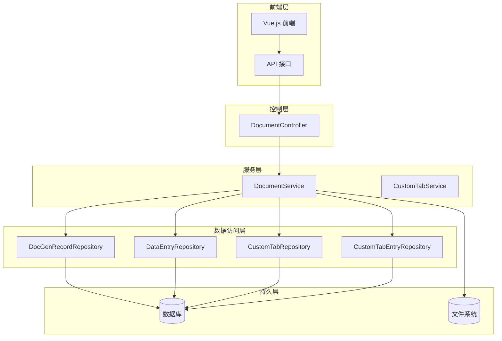
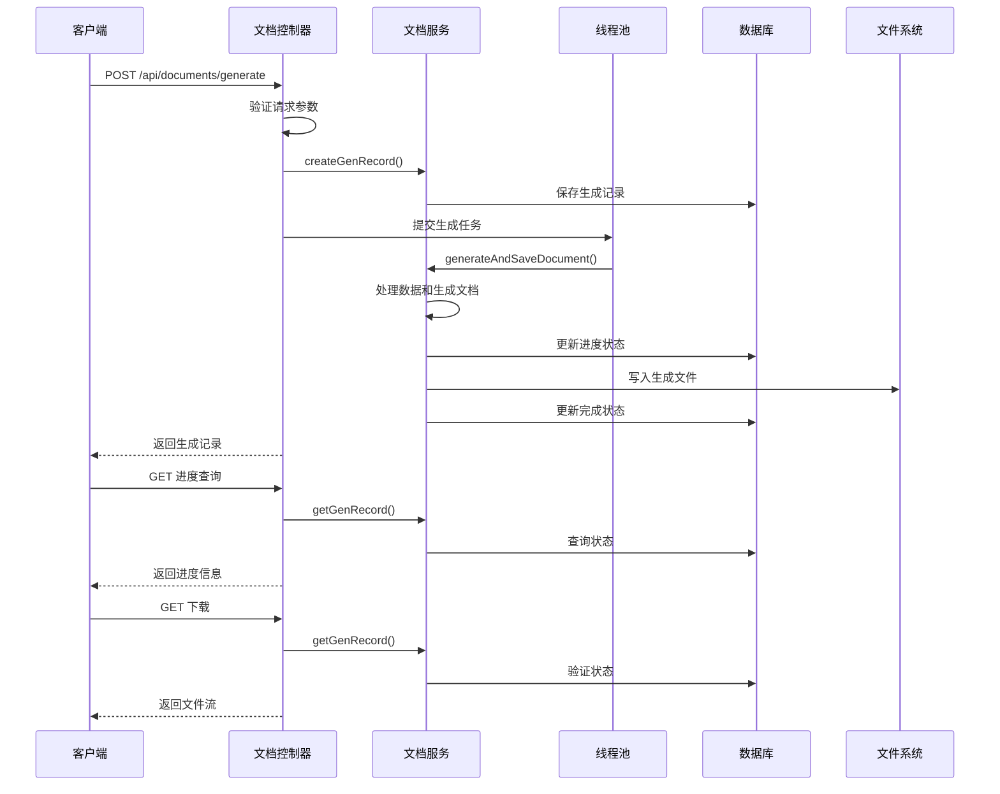
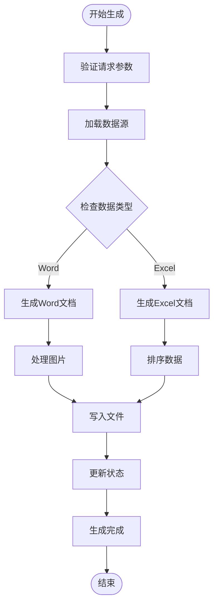
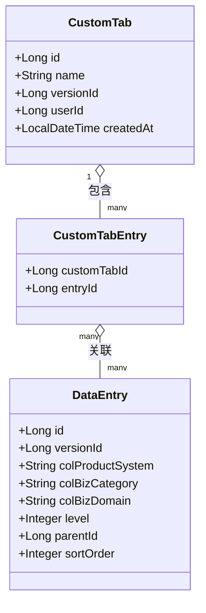
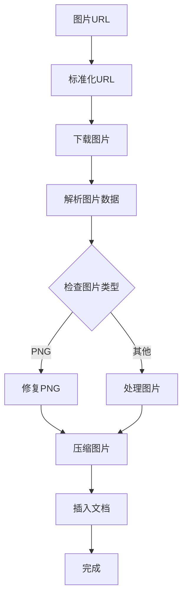
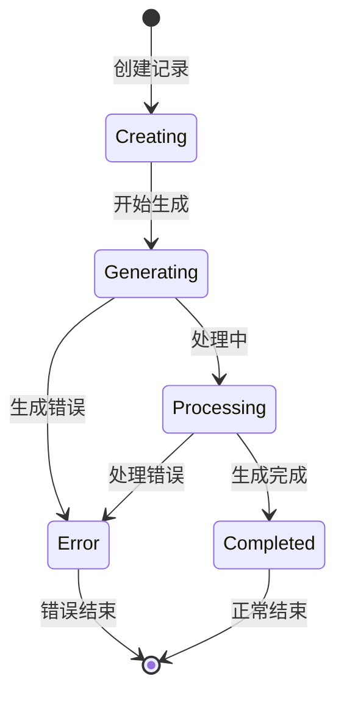
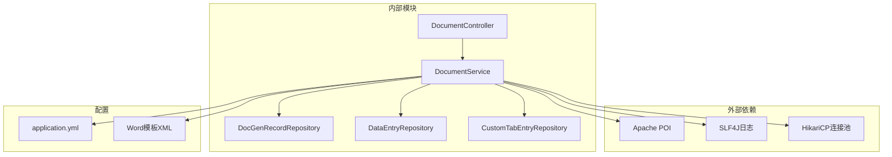
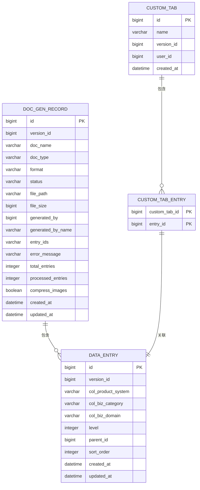
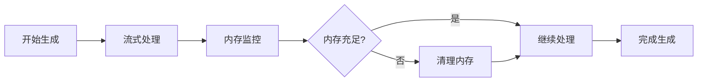

# 文档生成功能接口

<cite>
**本文档引用的文件**
- [DocumentController.java](file://src/main/java/com/superpower/modules/document/controller/DocumentController.java)
- [DocumentService.java](file://src/main/java/com/superpower/modules/document/service/DocumentService.java)
- [DocGenerateRequest.java](file://src/main/java/com/superpower/modules/document/dto/DocGenerateRequest.java)
- [DocGenRecord.java](file://src/main/java/com/superpower/modules/document/entity/DocGenRecord.java)
- [DocGenRecordRepository.java](file://src/main/java/com/superpower/modules/document/repository/DocGenRecordRepository.java)
- [DataEntryRepository.java](file://src/main/java/com/superpower/modules/data/repository/DataEntryRepository.java)
- [CustomTabEntryRepository.java](file://src/main/java/com/superpower/modules/customtab/repository/CustomTabEntryRepository.java)
- [CustomTab.java](file://src/main/java/com/superpower/modules/customtab/entity/CustomTab.java)
- [CustomTabEntry.java](file://src/main/java/com/superpower/modules/customtab/entity/CustomTabEntry.java)
- [styles.xml](file://src/main/resources/templates/word/styles.xml)
- [numbering.xml](file://src/main/resources/templates/word/numbering.xml)
- [application.yml](file://src/main/resources/application.yml)
- [document.js](file://frontend/src/api/document.js)
- [WebMvcConfig.java](file://src/main/java/com/superpower/config/WebMvcConfig.java)
- [VERSION.md](file://VERSION.md)
</cite>

## 目录
1. [简介](#简介)
2. [项目结构](#项目结构)
3. [核心组件](#核心组件)
4. [架构概览](#架构概览)
5. [详细组件分析](#详细组件分析)
6. [依赖关系分析](#依赖关系分析)
7. [性能考虑](#性能考虑)
8. [故障排除指南](#故障排除指南)
9. [结论](#结论)
10. [附录](#附录)

## 简介

文档生成功能接口是一个完整的文档自动化生成系统，支持Word和Excel格式的批量文档处理。该系统提供了基于模板的文档生成、自定义清单管理、实时进度监控和结果下载等功能。系统采用Spring Boot框架构建，使用Apache POI进行文档处理，支持高并发的异步文档生成。

## 项目结构

文档生成功能位于`com.superpower.modules.document`包中，采用经典的三层架构设计：



**图表来源**
- [DocumentController.java:31-51](file://src/main/java/com/superpower/modules/document/controller/DocumentController.java#L31-L51)
- [DocumentService.java:45-89](file://src/main/java/com/superpower/modules/document/service/DocumentService.java#L45-L89)

**章节来源**
- [DocumentController.java:1-163](file://src/main/java/com/superpower/modules/document/controller/DocumentController.java#L1-L163)
- [DocumentService.java:1-1610](file://src/main/java/com/superpower/modules/document/service/DocumentService.java#L1-L1610)

## 核心组件

### 文档控制器 (DocumentController)

文档控制器负责处理HTTP请求和响应，提供RESTful API接口：

- **POST /api/documents/generate** - 提交文档生成任务
- **GET /api/documents/records/{id}/progress** - 查询生成进度
- **GET /api/documents/records** - 获取文档记录列表
- **GET /api/documents/records/{id}/download** - 下载生成的文档
- **DELETE /api/documents/records/{id}** - 删除文档记录

### 文档服务 (DocumentService)

文档服务是核心业务逻辑实现，包含以下主要功能：

- **文档生成引擎** - 支持Word和Excel格式
- **自定义清单管理** - 基于CustomTab的动态数据筛选
- **进度监控** - 实时更新生成进度状态
- **图像处理** - 支持在线图片下载和本地图片处理
- **模板配置** - 自定义样式和编号系统

### 数据模型

系统使用以下核心实体：

- **DocGenRecord** - 文档生成记录
- **DataEntry** - 数据条目实体
- **CustomTab** - 自定义清单配置
- **CustomTabEntry** - 自定义清单条目关联

**章节来源**
- [DocGenerateRequest.java:1-18](file://src/main/java/com/superpower/modules/document/dto/DocGenerateRequest.java#L1-L18)
- [DocGenRecord.java:1-63](file://src/main/java/com/superpower/modules/document/entity/DocGenRecord.java#L1-L63)

## 架构概览

系统采用异步处理架构，确保高并发场景下的稳定性和性能：



**图表来源**
- [DocumentController.java:53-121](file://src/main/java/com/superpower/modules/document/controller/DocumentController.java#L53-L121)
- [DocumentService.java:246-305](file://src/main/java/com/superpower/modules/document/service/DocumentService.java#L246-L305)

## 详细组件分析

### 文档生成API

#### 生成请求参数

| 参数名 | 类型 | 必填 | 描述 | 默认值 |
|--------|------|------|------|--------|
| versionId | Long | 是 | 版本ID | - |
| docName | String | 是 | 文档名称 | - |
| docType | String | 是 | 文档类型 | - |
| format | String | 是 | 输出格式 (word/excel) | - |
| dataScope | String | 否 | 数据范围 | - |
| entryIds | List<Long> | 否 | 指定条目ID列表 | [] |
| customTabId | Long | 否 | 自定义清单ID | null |
| includeImages | Boolean | 否 | 是否包含图片 | true |
| compressImages | Boolean | 否 | 是否压缩图片 | false |

#### 生成流程



**图表来源**
- [DocumentService.java:246-305](file://src/main/java/com/superpower/modules/document/service/DocumentService.java#L246-L305)

**章节来源**
- [DocGenerateRequest.java:7-17](file://src/main/java/com/superpower/modules/document/dto/DocGenerateRequest.java#L7-L17)
- [DocumentController.java:53-121](file://src/main/java/com/superpower/modules/document/controller/DocumentController.java#L53-L121)

### 自定义清单功能

自定义清单功能允许用户创建和管理特定的数据集合用于文档生成：

#### 清单管理流程



**图表来源**
- [CustomTab.java:11-27](file://src/main/java/com/superpower/modules/customtab/entity/CustomTab.java#L11-L27)
- [CustomTabEntry.java:12-20](file://src/main/java/com/superpower/modules/customtab/entity/CustomTabEntry.java#L12-L20)

#### 数据筛选机制

系统支持多种数据筛选方式：

1. **版本级筛选** - 基于版本ID的全量数据
2. **清单级筛选** - 基于CustomTab的特定数据集合
3. **ID列表筛选** - 基于指定ID列表的数据
4. **条件筛选** - 基于业务分类、域、状态等条件

**章节来源**
- [CustomTabEntryRepository.java:14-26](file://src/main/java/com/superpower/modules/customtab/repository/CustomTabEntryRepository.java#L14-L26)
- [DataEntryRepository.java:94-96](file://src/main/java/com/superpower/modules/data/repository/DataEntryRepository.java#L94-L96)

### 图片处理和格式化

#### 图片处理流程



**图表来源**
- [DocumentService.java:761-884](file://src/main/java/com/superpower/modules/document/service/DocumentService.java#L761-L884)

#### 图片压缩策略

系统提供智能的图片压缩功能：

- **尺寸限制** - 限制最大宽度和高度
- **质量压缩** - JPEG压缩到92%质量
- **格式转换** - PNG转JPEG以减小文件大小
- **内存优化** - 使用流式处理避免内存溢出

**章节来源**
- [DocumentService.java:945-1004](file://src/main/java/com/superpower/modules/document/service/DocumentService.java#L945-L1004)

### 进度监控和状态管理

#### 状态管理流程



#### 进度更新机制

系统通过以下方式实现进度监控：

1. **定期更新** - 每处理一定数量的条目更新一次
2. **重试机制** - 更新失败时自动重试
3. **状态同步** - 实时同步生成状态到数据库
4. **超时处理** - 超时自动取消任务

**章节来源**
- [DocumentService.java:188-214](file://src/main/java/com/superpower/modules/document/service/DocumentService.java#L188-L214)
- [DocumentService.java:164-186](file://src/main/java/com/superpower/modules/document/service/DocumentService.java#L164-L186)

## 依赖关系分析

### 组件依赖图



**图表来源**
- [DocumentService.java:13-28](file://src/main/java/com/superpower/modules/document/service/DocumentService.java#L13-L28)
- [application.yml:35-40](file://src/main/resources/application.yml#L35-L40)

### 数据库表关系



**图表来源**
- [DocGenRecord.java:10-62](file://src/main/java/com/superpower/modules/document/entity/DocGenRecord.java#L10-L62)
- [CustomTab.java:11-27](file://src/main/java/com/superpower/modules/customtab/entity/CustomTab.java#L11-L27)
- [CustomTabEntry.java:12-20](file://src/main/java/com/superpower/modules/customtab/entity/CustomTabEntry.java#L12-L20)

**章节来源**
- [DocGenRecordRepository.java:12-18](file://src/main/java/com/superpower/modules/document/repository/DocGenRecordRepository.java#L12-L18)
- [DataEntryRepository.java:12-14](file://src/main/java/com/superpower/modules/data/repository/DataEntryRepository.java#L12-L14)

## 性能考虑

### 并发处理优化

系统采用固定大小的线程池来处理并发文档生成：

- **线程池大小**：3个线程，避免资源竞争
- **守护线程**：每个线程都是守护线程，防止进程阻塞
- **任务隔离**：每个生成任务独立运行，互不影响

### 内存管理



### 缓存策略

- **进度缓存**：使用ConcurrentHashMap缓存最近更新的进度
- **取消标记**：使用ConcurrentHashMap跟踪取消状态
- **重试缓存**：避免重复的数据库操作

**章节来源**
- [DocumentController.java:41-45](file://src/main/java/com/superpower/modules/document/controller/DocumentController.java#L41-L45)
- [DocumentService.java:73-89](file://src/main/java/com/superpower/modules/document/service/DocumentService.java#L73-L89)

## 故障排除指南

### 常见问题及解决方案

#### 1. 文档生成卡住

**症状**：状态一直显示"generating"

**可能原因**：
- 数据库连接池耗尽
- 生成任务被意外取消
- 文件系统权限问题

**解决方案**：
- 检查数据库连接池配置
- 查看日志中的取消标记
- 验证文件存储路径权限

#### 2. 图片加载失败

**症状**：文档中有缺失图片提示

**可能原因**：
- 图片URL不可访问
- 图片格式不支持
- 网络连接超时

**解决方案**：
- 验证图片URL有效性
- 检查图片格式兼容性
- 增加网络超时时间

#### 3. Excel格式错误

**症状**：Excel文件无法打开或格式异常

**可能原因**：
- 单元格格式冲突
- 字符编码问题
- 表格结构损坏

**解决方案**：
- 检查单元格样式配置
- 验证字符编码设置
- 重新生成Excel文件

**章节来源**
- [VERSION.md:70-77](file://VERSION.md#L70-L77)

### 日志分析

系统提供详细的日志记录，包括：

- **生成任务日志**：记录任务提交、开始、完成和错误信息
- **进度更新日志**：记录每批次的处理进度
- **错误日志**：记录具体的异常信息和堆栈跟踪

## 结论

文档生成功能接口提供了一个完整、高效且可扩展的文档自动化解决方案。系统具有以下特点：

1. **高性能**：采用异步处理和线程池优化，支持高并发场景
2. **可扩展**：模块化设计，易于添加新的文档格式和处理逻辑
3. **可靠性**：完善的错误处理和重试机制，确保任务稳定性
4. **易用性**：简洁的API设计，支持多种数据筛选和自定义选项

该系统适用于各种文档生成场景，特别是需要批量处理和自定义数据筛选的企业级应用。

## 附录

### API使用示例

#### 基本文档生成

```javascript
// 生成Word文档
const generateData = {
  versionId: 1,
  docName: "产品清单",
  docType: "feature",
  format: "word",
  includeImages: true,
  compressImages: false
};

await generateDocument(generateData);
```

#### 自定义清单生成

```javascript
// 使用自定义清单生成Excel
const customGenerateData = {
  versionId: 1,
  customTabId: 1,
  docName: "自定义清单",
  docType: "excel",
  format: "excel"
};

await generateDocument(customGenerateData);
```

#### 进度监控

```javascript
// 监控生成进度
const progress = await getDocProgress(recordId);
console.log(`已完成: ${progress.processedEntries}/${progress.totalEntries}`);
```

#### 结果下载

```javascript
// 下载生成的文档
const response = await downloadDocument(recordId);
const blob = new Blob([response.data]);
const url = window.URL.createObjectURL(blob);
const a = document.createElement('a');
a.href = url;
a.download = '文档名称';
a.click();
```

### 配置说明

#### 应用配置

| 配置项 | 默认值 | 描述 |
|--------|--------|------|
| app.doc-storage-path | ./generated-docs | 文档存储路径 |
| app.image-storage-path | ./uploads/images | 图片存储路径 |
| server.port | 8080 | 服务器端口 |
| spring.datasource.hikari.maximum-pool-size | 3 | 数据库连接池大小 |

#### 性能调优建议

1. **线程池调整**：根据服务器资源配置调整线程池大小
2. **数据库优化**：合理配置连接池参数和超时时间
3. **文件系统优化**：确保存储路径有足够的磁盘空间和权限
4. **网络优化**：对于远程图片，考虑增加超时时间和重试次数

**章节来源**
- [application.yml:35-40](file://src/main/resources/application.yml#L35-L40)
- [WebMvcConfig.java:11-21](file://src/main/java/com/superpower/config/WebMvcConfig.java#L11-L21)