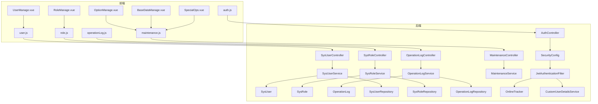
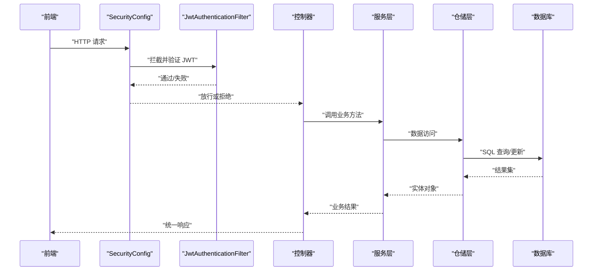
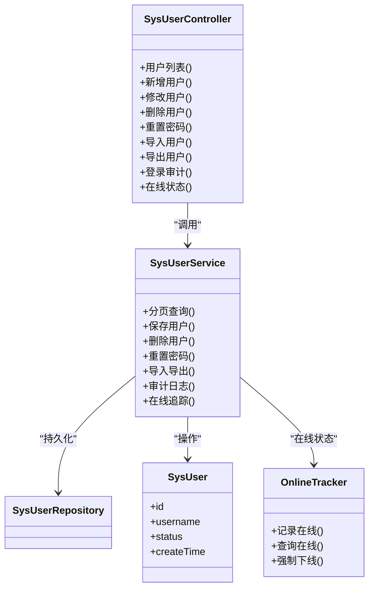
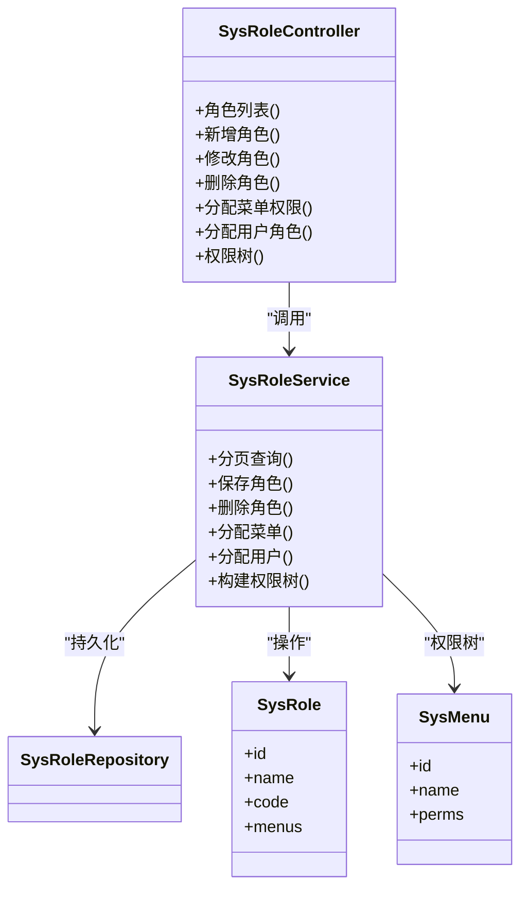
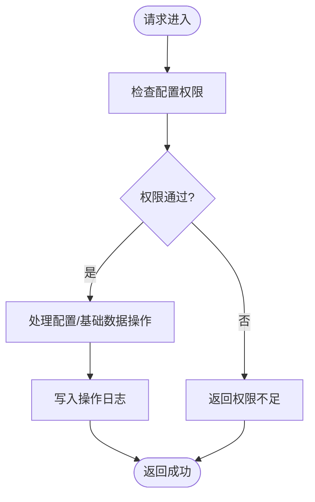
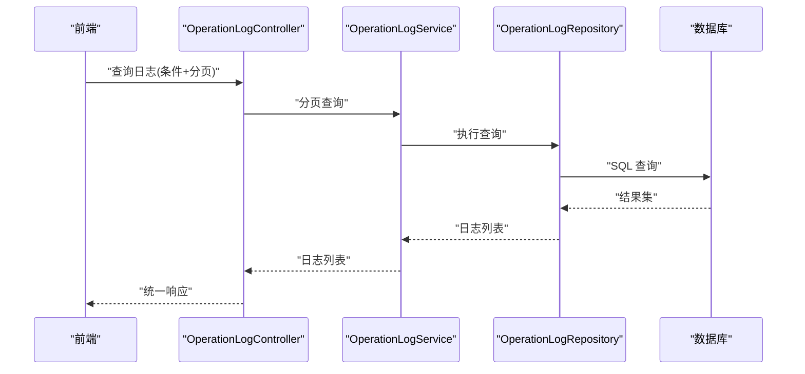
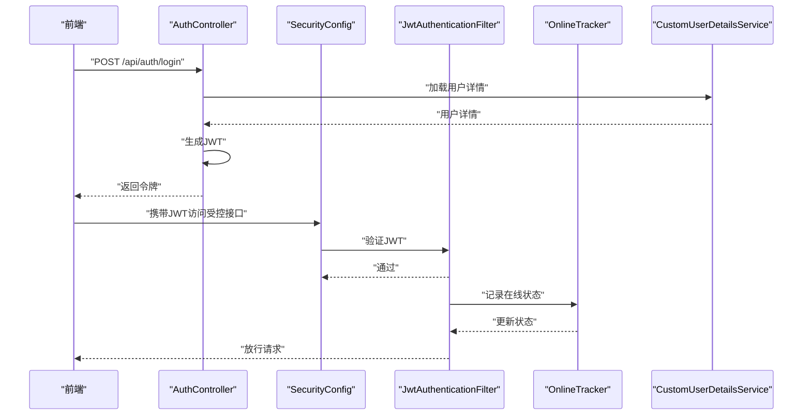
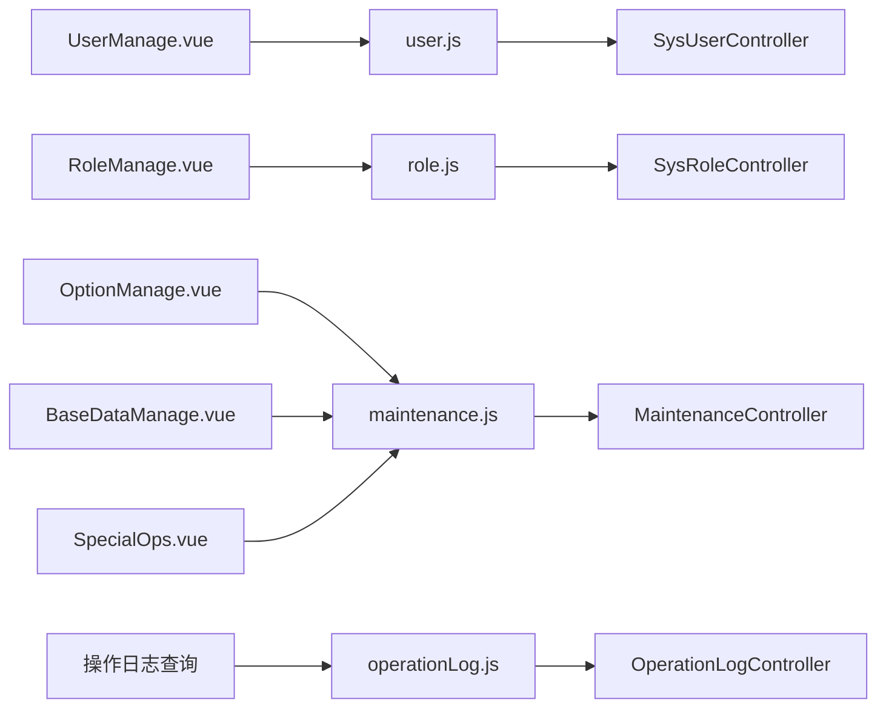
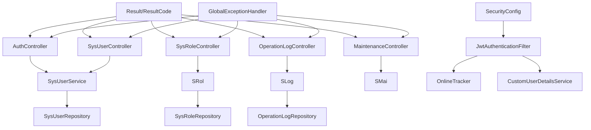

# 系统管理接口

<cite>
**本文档引用的文件**
- [AuthController.java](file://src/main/java/com/superpower/modules/system/controller/AuthController.java)
- [SysUserController.java](file://src/main/java/com/superpower/modules/system/controller/SysUserController.java)
- [SysRoleController.java](file://src/main/java/com/superpower/modules/system/controller/SysRoleController.java)
- [OperationLogController.java](file://src/main/java/com/superpower/modules/system/controller/OperationLogController.java)
- [MaintenanceController.java](file://src/main/java/com/superpower/modules/system/controller/MaintenanceController.java)
- [SysUserService.java](file://src/main/java/com/superpower/modules/system/service/SysUserService.java)
- [SysRoleService.java](file://src/main/java/com/superpower/modules/system/service/SysRoleService.java)
- [OperationLogService.java](file://src/main/java/com/superpower/modules/system/service/OperationLogService.java)
- [MaintenanceService.java](file://src/main/java/com/superpower/modules/system/service/MaintenanceService.java)
- [SysUser.java](file://src/main/java/com/superpower/modules/system/entity/SysUser.java)
- [SysRole.java](file://src/main/java/com/superpower/modules/system/entity/SysRole.java)
- [OperationLog.java](file://src/main/java/com/superpower/modules/system/entity/OperationLog.java)
- [SysUserRepository.java](file://src/main/java/com/superpower/modules/system/repository/SysUserRepository.java)
- [SysRoleRepository.java](file://src/main/java/com/superpower/modules/system/repository/SysRoleRepository.java)
- [OperationLogRepository.java](file://src/main/java/com/superpower/modules/system/repository/OperationLogRepository.java)
- [JwtAuthenticationFilter.java](file://src/main/java/com/superpower/security/JwtAuthenticationFilter.java)
- [OnlineTracker.java](file://src/main/java/com/superpower/security/OnlineTracker.java)
- [CustomUserDetailsService.java](file://src/main/java/com/superpower/security/CustomUserDetailsService.java)
- [SecurityConfig.java](file://src/main/java/com/superpower/config/SecurityConfig.java)
- [AuthUtils.java](file://src/main/java/com/superpower/common/AuthUtils.java)
- [Result.java](file://src/main/java/com/superpower/common/Result.java)
- [ResultCode.java](file://src/main/java/com/superpower/common/ResultCode.java)
- [GlobalExceptionHandler.java](file://src/main/java/com/superpower/common/GlobalExceptionHandler.java)
- [UserManage.vue](file://frontend/src/views/system/UserManage.vue)
- [RoleManage.vue](file://frontend/src/views/system/RoleManage.vue)
- [OptionManage.vue](file://frontend/src/views/system/OptionManage.vue)
- [BaseDataManage.vue](file://frontend/src/views/system/BaseDataManage.vue)
- [SpecialOps.vue](file://frontend/src/views/system/SpecialOps.vue)
- [user.js](file://frontend/src/api/user.js)
- [role.js](file://frontend/src/api/role.js)
- [operationLog.js](file://frontend/src/api/operationLog.js)
- [maintenance.js](file://frontend/src/api/maintenance.js)
- [auth.js](file://frontend/src/api/auth.js)
</cite>

## 目录
1. [简介](#简介)
2. [项目结构](#项目结构)
3. [核心组件](#核心组件)
4. [架构总览](#架构总览)
5. [详细组件分析](#详细组件分析)
6. [依赖关系分析](#依赖关系分析)
7. [性能考虑](#性能考虑)
8. [故障排除指南](#故障排除指南)
9. [结论](#结论)
10. [附录](#附录)

## 简介
本文件面向系统管理接口，围绕用户管理、角色权限与系统配置三大领域，提供后端控制器、服务层、数据模型与前端调用的完整技术文档。内容涵盖：
- 用户 CRUD 操作、在线状态管理与登录审计
- 角色分配与权限控制
- 系统选项配置、基础数据维护与操作日志查询
- 批量操作、数据导出与系统维护工具
- 权限验证与安全控制实现方案

## 项目结构
系统管理模块位于后端 Java 工程的 system 包中，采用典型的分层架构：controller（控制器）、service（服务）、repository（仓储）、entity（实体）与 DTO（数据传输对象）。前端 Vue 组件通过 API 文件进行调用。

**图表来源**
- [SysUserController.java:1-200](file://src/main/java/com/superpower/modules/system/controller/SysUserController.java#L1-L200)
- [SysRoleController.java:1-200](file://src/main/java/com/superpower/modules/system/controller/SysRoleController.java#L1-L200)
- [OperationLogController.java:1-200](file://src/main/java/com/superpower/modules/system/controller/OperationLogController.java#L1-L200)
- [MaintenanceController.java:1-200](file://src/main/java/com/superpower/modules/system/controller/MaintenanceController.java#L1-L200)
- [AuthController.java:1-200](file://src/main/java/com/superpower/modules/system/controller/AuthController.java#L1-L200)
- [SecurityConfig.java:1-200](file://src/main/java/com/superpower/config/SecurityConfig.java#L1-L200)
- [JwtAuthenticationFilter.java:1-200](file://src/main/java/com/superpower/security/JwtAuthenticationFilter.java#L1-L200)
- [OnlineTracker.java:1-200](file://src/main/java/com/superpower/security/OnlineTracker.java#L1-L200)
- [CustomUserDetailsService.java:1-200](file://src/main/java/com/superpower/security/CustomUserDetailsService.java#L1-L200)
- [SysUserService.java:1-200](file://src/main/java/com/superpower/modules/system/service/SysUserService.java#L1-L200)
- [SysRoleService.java:1-200](file://src/main/java/com/superpower/modules/system/service/SysRoleService.java#L1-L200)
- [OperationLogService.java:1-200](file://src/main/java/com/superpower/modules/system/service/OperationLogService.java#L1-L200)
- [MaintenanceService.java:1-200](file://src/main/java/com/superpower/modules/system/service/MaintenanceService.java#L1-L200)
- [SysUser.java:1-200](file://src/main/java/com/superpower/modules/system/entity/SysUser.java#L1-L200)
- [SysRole.java:1-200](file://src/main/java/com/superpower/modules/system/entity/SysRole.java#L1-L200)
- [OperationLog.java:1-200](file://src/main/java/com/superpower/modules/system/entity/OperationLog.java#L1-L200)

**章节来源**
- [SysUserController.java:1-200](file://src/main/java/com/superpower/modules/system/controller/SysUserController.java#L1-L200)
- [SysRoleController.java:1-200](file://src/main/java/com/superpower/modules/system/controller/SysRoleController.java#L1-L200)
- [OperationLogController.java:1-200](file://src/main/java/com/superpower/modules/system/controller/OperationLogController.java#L1-L200)
- [MaintenanceController.java:1-200](file://src/main/java/com/superpower/modules/system/controller/MaintenanceController.java#L1-L200)
- [AuthController.java:1-200](file://src/main/java/com/superpower/modules/system/controller/AuthController.java#L1-L200)

## 核心组件
- 控制器层：负责接收 HTTP 请求、参数校验、调用服务层并返回统一响应格式。
- 服务层：封装业务逻辑，协调仓储与实体，处理事务与异常。
- 数据层：定义实体与仓储接口，提供数据持久化能力。
- 安全层：基于 JWT 的认证过滤器、在线用户跟踪与自定义用户详情服务。
- 前端层：Vue 组件与 API 调用文件，负责界面交互与数据展示。

**章节来源**
- [SysUserService.java:1-200](file://src/main/java/com/superpower/modules/system/service/SysUserService.java#L1-L200)
- [SysRoleService.java:1-200](file://src/main/java/com/superpower/modules/system/service/SysRoleService.java#L1-L200)
- [OperationLogService.java:1-200](file://src/main/java/com/superpower/modules/system/service/OperationLogService.java#L1-L200)
- [MaintenanceService.java:1-200](file://src/main/java/com/superpower/modules/system/service/MaintenanceService.java#L1-L200)
- [JwtAuthenticationFilter.java:1-200](file://src/main/java/com/superpower/security/JwtAuthenticationFilter.java#L1-L200)
- [OnlineTracker.java:1-200](file://src/main/java/com/superpower/security/OnlineTracker.java#L1-L200)
- [CustomUserDetailsService.java:1-200](file://src/main/java/com/superpower/security/CustomUserDetailsService.java#L1-L200)

## 架构总览
系统采用 Spring MVC + Spring Security + JWT 的认证授权模式。请求进入时先经过安全过滤器链，验证 JWT 并建立安全上下文；随后由控制器处理业务请求；服务层协调仓储与实体完成数据操作；最终以统一结果包装返回给前端。

**图表来源**
- [SecurityConfig.java:1-200](file://src/main/java/com/superpower/config/SecurityConfig.java#L1-L200)
- [JwtAuthenticationFilter.java:1-200](file://src/main/java/com/superpower/security/JwtAuthenticationFilter.java#L1-L200)
- [SysUserController.java:1-200](file://src/main/java/com/superpower/modules/system/controller/SysUserController.java#L1-L200)
- [SysUserService.java:1-200](file://src/main/java/com/superpower/modules/system/service/SysUserService.java#L1-L200)
- [SysUserRepository.java:1-200](file://src/main/java/com/superpower/modules/system/repository/SysUserRepository.java#L1-L200)

## 详细组件分析

### 用户管理模块
- 功能范围：用户增删改查、启用禁用、重置密码、批量导入导出、在线状态管理与登录审计。
- 关键接口：
  - 获取用户列表与分页查询
  - 新增/修改用户信息
  - 删除用户
  - 重置用户密码
  - 导入/导出用户数据
  - 查询用户登录审计与在线状态
- 数据模型：SysUser 实体包含用户基本信息、状态、创建时间等字段。
- 安全控制：所有用户相关接口均受 JWT 认证保护，并按角色权限进行访问控制。

**图表来源**
- [SysUserController.java:1-200](file://src/main/java/com/superpower/modules/system/controller/SysUserController.java#L1-L200)
- [SysUserService.java:1-200](file://src/main/java/com/superpower/modules/system/service/SysUserService.java#L1-L200)
- [SysUser.java:1-200](file://src/main/java/com/superpower/modules/system/entity/SysUser.java#L1-L200)
- [SysUserRepository.java:1-200](file://src/main/java/com/superpower/modules/system/repository/SysUserRepository.java#L1-L200)
- [OnlineTracker.java:1-200](file://src/main/java/com/superpower/security/OnlineTracker.java#L1-L200)

**章节来源**
- [SysUserController.java:1-200](file://src/main/java/com/superpower/modules/system/controller/SysUserController.java#L1-L200)
- [SysUserService.java:1-200](file://src/main/java/com/superpower/modules/system/service/SysUserService.java#L1-L200)
- [SysUser.java:1-200](file://src/main/java/com/superpower/modules/system/entity/SysUser.java#L1-L200)
- [SysUserRepository.java:1-200](file://src/main/java/com/superpower/modules/system/repository/SysUserRepository.java#L1-L200)
- [OnlineTracker.java:1-200](file://src/main/java/com/superpower/security/OnlineTracker.java#L1-L200)

### 角色权限模块
- 功能范围：角色 CRUD、角色与菜单权限绑定、用户角色分配、权限树查询。
- 关键接口：
  - 获取角色列表与分页
  - 新增/修改/删除角色
  - 分配角色菜单权限
  - 为用户分配角色
  - 查询权限树
- 数据模型：SysRole 实体与菜单关联，支持多对多关系；SysUser 与 SysRole 通过中间表关联。
- 安全控制：角色相关接口需具备相应权限，且操作行为可被操作日志记录。

**图表来源**
- [SysRoleController.java:1-200](file://src/main/java/com/superpower/modules/system/controller/SysRoleController.java#L1-L200)
- [SysRoleService.java:1-200](file://src/main/java/com/superpower/modules/system/service/SysRoleService.java#L1-L200)
- [SysRole.java:1-200](file://src/main/java/com/superpower/modules/system/entity/SysRole.java#L1-L200)
- [SysRoleRepository.java:1-200](file://src/main/java/com/superpower/modules/system/repository/SysRoleRepository.java#L1-L200)

**章节来源**
- [SysRoleController.java:1-200](file://src/main/java/com/superpower/modules/system/controller/SysRoleController.java#L1-L200)
- [SysRoleService.java:1-200](file://src/main/java/com/superpower/modules/system/service/SysRoleService.java#L1-L200)
- [SysRole.java:1-200](file://src/main/java/com/superpower/modules/system/entity/SysRole.java#L1-L200)
- [SysRoleRepository.java:1-200](file://src/main/java/com/superpower/modules/system/repository/SysRoleRepository.java#L1-L200)

### 系统配置与基础数据模块
- 功能范围：系统选项配置、基础数据维护、版本管理、图片迁移状态查询。
- 关键接口：
  - 配置项增删改查与版本化
  - 基础数据字典维护
  - 版本发布与回滚
  - 图片资源迁移进度查询
- 安全控制：配置类接口通常需要更高权限，变更记录纳入操作日志。

**图表来源**
- [MaintenanceController.java:1-200](file://src/main/java/com/superpower/modules/system/controller/MaintenanceController.java#L1-L200)
- [MaintenanceService.java:1-200](file://src/main/java/com/superpower/modules/system/service/MaintenanceService.java#L1-L200)
- [OperationLogService.java:1-200](file://src/main/java/com/superpower/modules/system/service/OperationLogService.java#L1-L200)

**章节来源**
- [MaintenanceController.java:1-200](file://src/main/java/com/superpower/modules/system/controller/MaintenanceController.java#L1-L200)
- [MaintenanceService.java:1-200](file://src/main/java/com/superpower/modules/system/service/MaintenanceService.java#L1-L200)

### 操作日志模块
- 功能范围：查询操作日志、按时间/用户/操作类型筛选、导出日志。
- 关键接口：
  - 日志列表与分页
  - 条件筛选查询
  - 日志导出
- 数据模型：OperationLog 实体记录操作人、时间、IP、操作类型与结果。
- 安全控制：日志查询通常开放给有审计权限的角色。

**图表来源**
- [OperationLogController.java:1-200](file://src/main/java/com/superpower/modules/system/controller/OperationLogController.java#L1-L200)
- [OperationLogService.java:1-200](file://src/main/java/com/superpower/modules/system/service/OperationLogService.java#L1-L200)
- [OperationLogRepository.java:1-200](file://src/main/java/com/superpower/modules/system/repository/OperationLogRepository.java#L1-L200)
- [OperationLog.java:1-200](file://src/main/java/com/superpower/modules/system/entity/OperationLog.java#L1-L200)

**章节来源**
- [OperationLogController.java:1-200](file://src/main/java/com/superpower/modules/system/controller/OperationLogController.java#L1-L200)
- [OperationLogService.java:1-200](file://src/main/java/com/superpower/modules/system/service/OperationLogService.java#L1-L200)
- [OperationLogRepository.java:1-200](file://src/main/java/com/superpower/modules/system/repository/OperationLogRepository.java#L1-L200)
- [OperationLog.java:1-200](file://src/main/java/com/superpower/modules/system/entity/OperationLog.java#L1-L200)

### 登录认证与安全控制
- 认证流程：前端提交用户名密码，后端验证通过后签发 JWT；后续请求携带 JWT，过滤器验证并建立安全上下文。
- 在线管理：OnlineTracker 跟踪用户在线状态，支持强制下线。
- 权限控制：基于角色的访问控制（RBAC），结合菜单权限与接口权限。

**图表来源**
- [AuthController.java:1-200](file://src/main/java/com/superpower/modules/system/controller/AuthController.java#L1-L200)
- [SecurityConfig.java:1-200](file://src/main/java/com/superpower/config/SecurityConfig.java#L1-L200)
- [JwtAuthenticationFilter.java:1-200](file://src/main/java/com/superpower/security/JwtAuthenticationFilter.java#L1-L200)
- [OnlineTracker.java:1-200](file://src/main/java/com/superpower/security/OnlineTracker.java#L1-L200)
- [CustomUserDetailsService.java:1-200](file://src/main/java/com/superpower/security/CustomUserDetailsService.java#L1-L200)

**章节来源**
- [AuthController.java:1-200](file://src/main/java/com/superpower/modules/system/controller/AuthController.java#L1-L200)
- [SecurityConfig.java:1-200](file://src/main/java/com/superpower/config/SecurityConfig.java#L1-L200)
- [JwtAuthenticationFilter.java:1-200](file://src/main/java/com/superpower/security/JwtAuthenticationFilter.java#L1-L200)
- [OnlineTracker.java:1-200](file://src/main/java/com/superpower/security/OnlineTracker.java#L1-L200)
- [CustomUserDetailsService.java:1-200](file://src/main/java/com/superpower/security/CustomUserDetailsService.java#L1-L200)

### 前端集成与调用示例
- 用户管理：UserManage.vue 通过 user.js 调用用户相关接口，支持分页、搜索、导入导出。
- 角色管理：RoleManage.vue 通过 role.js 调用角色与权限接口。
- 系统配置：OptionManage.vue、BaseDataManage.vue、SpecialOps.vue 通过 maintenance.js 调用配置与维护接口。
- 操作日志：通过 operationLog.js 查询日志并导出。

**图表来源**
- [UserManage.vue:1-200](file://frontend/src/views/system/UserManage.vue#L1-L200)
- [RoleManage.vue:1-200](file://frontend/src/views/system/RoleManage.vue#L1-L200)
- [OptionManage.vue:1-200](file://frontend/src/views/system/OptionManage.vue#L1-L200)
- [BaseDataManage.vue:1-200](file://frontend/src/views/system/BaseDataManage.vue#L1-L200)
- [SpecialOps.vue:1-200](file://frontend/src/views/system/SpecialOps.vue#L1-L200)
- [user.js:1-200](file://frontend/src/api/user.js#L1-L200)
- [role.js:1-200](file://frontend/src/api/role.js#L1-L200)
- [maintenance.js:1-200](file://frontend/src/api/maintenance.js#L1-L200)
- [operationLog.js:1-200](file://frontend/src/api/operationLog.js#L1-L200)

**章节来源**
- [UserManage.vue:1-200](file://frontend/src/views/system/UserManage.vue#L1-L200)
- [RoleManage.vue:1-200](file://frontend/src/views/system/RoleManage.vue#L1-L200)
- [OptionManage.vue:1-200](file://frontend/src/views/system/OptionManage.vue#L1-L200)
- [BaseDataManage.vue:1-200](file://frontend/src/views/system/BaseDataManage.vue#L1-L200)
- [SpecialOps.vue:1-200](file://frontend/src/views/system/SpecialOps.vue#L1-L200)
- [user.js:1-200](file://frontend/src/api/user.js#L1-L200)
- [role.js:1-200](file://frontend/src/api/role.js#L1-L200)
- [maintenance.js:1-200](file://frontend/src/api/maintenance.js#L1-L200)
- [operationLog.js:1-200](file://frontend/src/api/operationLog.js#L1-L200)

## 依赖关系分析
- 控制器依赖服务层，服务层依赖仓储层与实体。
- 安全配置依赖 JWT 过滤器与在线跟踪器。
- 统一响应包装 Result 与错误码 ResultCode 提供一致的返回格式。
- 全局异常处理器 GlobalExceptionHandler 统一捕获并格式化异常。

**图表来源**
- [Result.java:1-200](file://src/main/java/com/superpower/common/Result.java#L1-L200)
- [ResultCode.java:1-200](file://src/main/java/com/superpower/common/ResultCode.java#L1-L200)
- [GlobalExceptionHandler.java:1-200](file://src/main/java/com/superpower/common/GlobalExceptionHandler.java#L1-L200)
- [SecurityConfig.java:1-200](file://src/main/java/com/superpower/config/SecurityConfig.java#L1-L200)
- [JwtAuthenticationFilter.java:1-200](file://src/main/java/com/superpower/security/JwtAuthenticationFilter.java#L1-L200)
- [OnlineTracker.java:1-200](file://src/main/java/com/superpower/security/OnlineTracker.java#L1-L200)
- [CustomUserDetailsService.java:1-200](file://src/main/java/com/superpower/security/CustomUserDetailsService.java#L1-L200)

**章节来源**
- [Result.java:1-200](file://src/main/java/com/superpower/common/Result.java#L1-L200)
- [ResultCode.java:1-200](file://src/main/java/com/superpower/common/ResultCode.java#L1-L200)
- [GlobalExceptionHandler.java:1-200](file://src/main/java/com/superpower/common/GlobalExceptionHandler.java#L1-L200)
- [SecurityConfig.java:1-200](file://src/main/java/com/superpower/config/SecurityConfig.java#L1-L200)
- [JwtAuthenticationFilter.java:1-200](file://src/main/java/com/superpower/security/JwtAuthenticationFilter.java#L1-L200)
- [OnlineTracker.java:1-200](file://src/main/java/com/superpower/security/OnlineTracker.java#L1-L200)
- [CustomUserDetailsService.java:1-200](file://src/main/java/com/superpower/security/CustomUserDetailsService.java#L1-L200)

## 性能考虑
- 分页查询：用户与日志列表默认分页，避免一次性加载大量数据。
- 缓存策略：在线状态与部分静态配置可引入缓存减少数据库压力。
- 批量操作：导入导出与批量删除建议异步执行并提供进度反馈。
- SQL 优化：为高频查询字段建立索引，如用户状态、日志时间、角色编码等。

## 故障排除指南
- 认证失败：检查 JWT 是否过期、签名是否正确、用户是否存在。
- 权限不足：确认用户角色与菜单权限映射是否正确。
- 数据异常：查看全局异常处理器返回的具体错误码与消息，定位具体控制器与服务方法。
- 在线状态异常：检查在线跟踪器的记录与清理逻辑。

**章节来源**
- [GlobalExceptionHandler.java:1-200](file://src/main/java/com/superpower/common/GlobalExceptionHandler.java#L1-L200)
- [JwtAuthenticationFilter.java:1-200](file://src/main/java/com/superpower/security/JwtAuthenticationFilter.java#L1-L200)
- [AuthUtils.java:1-200](file://src/main/java/com/superpower/common/AuthUtils.java#L1-L200)

## 结论
系统管理接口以 RBAC 为核心，结合 JWT 认证与在线状态跟踪，提供了完善的用户、角色、配置与日志管理能力。通过统一的响应格式与异常处理机制，确保了接口的一致性与稳定性。建议在生产环境中进一步完善缓存、异步任务与监控告警体系。

## 附录
- 接口命名规范：统一使用 RESTful 风格，动词在路径中体现动作。
- 错误码规范：使用 ResultCode 中定义的标准错误码，便于前端统一处理。
- 安全最佳实践：敏感操作二次确认、最小权限原则、日志审计全覆盖。