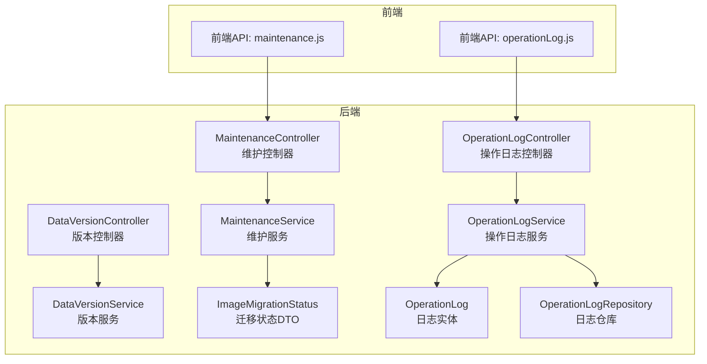
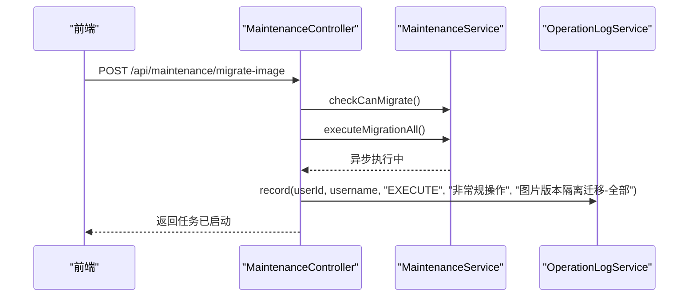
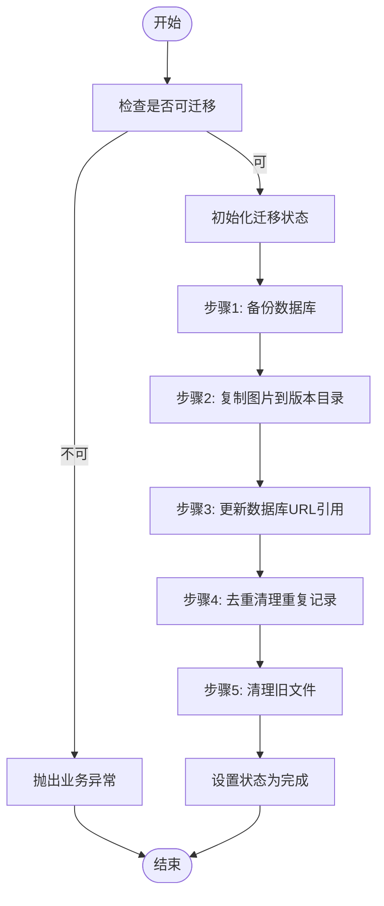
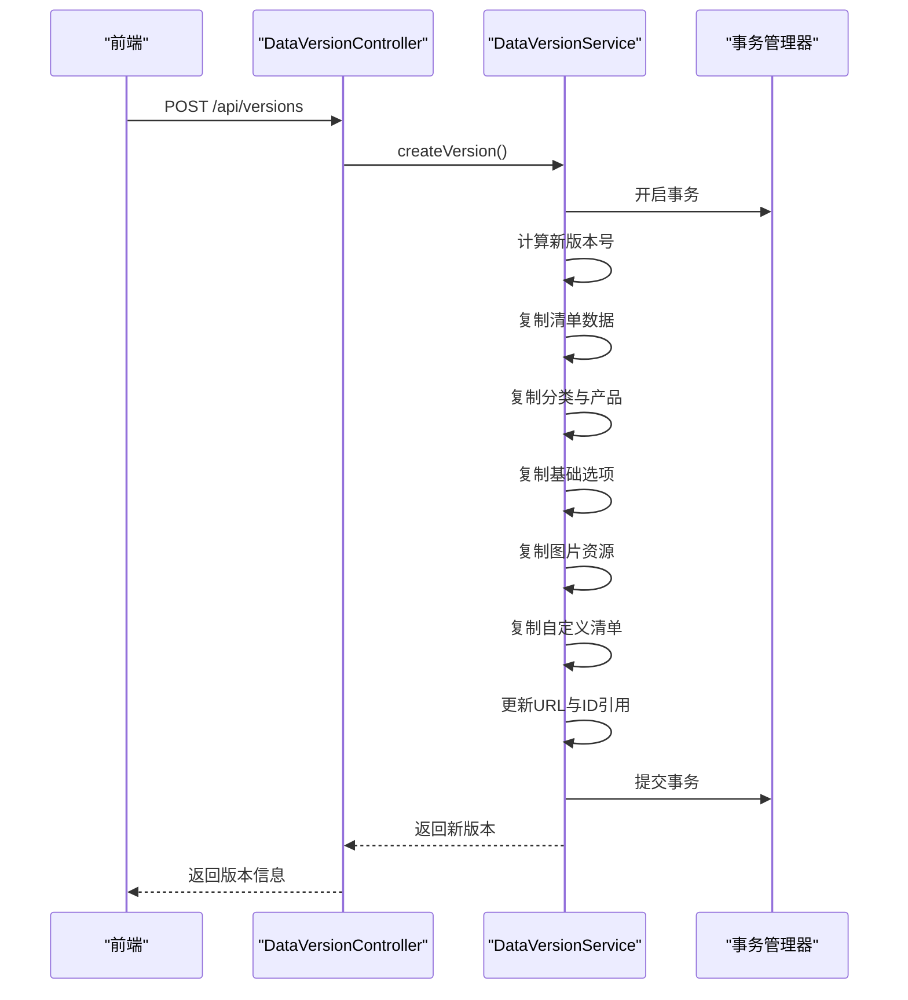
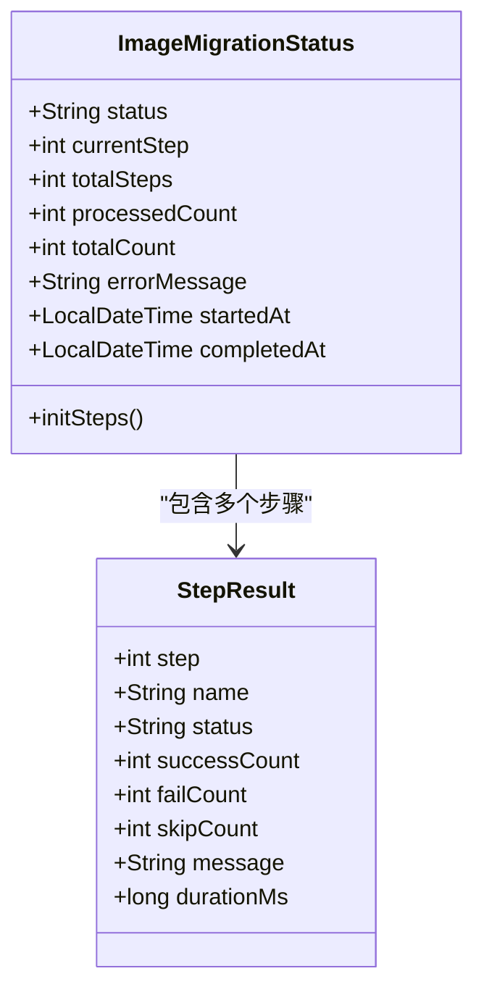
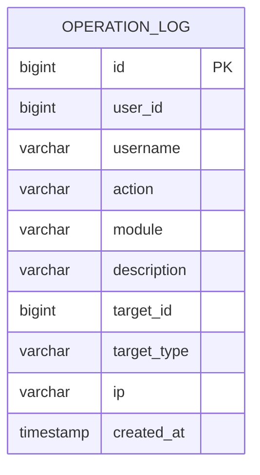
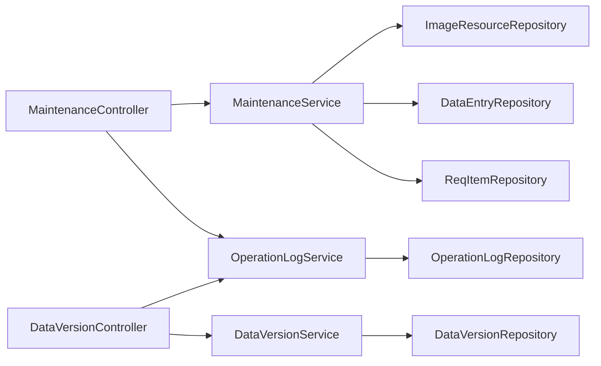

# 系统维护接口

<cite>
**本文档引用的文件**
- [MaintenanceController.java](file://src/main/java/com/superpower/modules/system/controller/MaintenanceController.java)
- [MaintenanceService.java](file://src/main/java/com/superpower/modules/system/service/MaintenanceService.java)
- [OperationLogController.java](file://src/main/java/com/superpower/modules/system/controller/OperationLogController.java)
- [OperationLogService.java](file://src/main/java/com/superpower/modules/system/service/OperationLogService.java)
- [OperationLog.java](file://src/main/java/com/superpower/modules/system/entity/OperationLog.java)
- [OperationLogRepository.java](file://src/main/java/com/superpower/modules/system/repository/OperationLogRepository.java)
- [DataVersionController.java](file://src/main/java/com/superpower/modules/version/controller/DataVersionController.java)
- [DataVersionService.java](file://src/main/java/com/superpower/modules/version/service/DataVersionService.java)
- [ImageMigrationStatus.java](file://src/main/java/com/superpower/modules/system/dto/ImageMigrationStatus.java)
- [maintenance.js](file://frontend/src/api/maintenance.js)
- [operationLog.js](file://frontend/src/api/operationLog.js)
- [V1.0.6_add_last_login_at_and_operation_log.sql](file://db_changes/V1.0.6_add_last_login_at_and_operation_log.sql)
</cite>

## 目录
1. [简介](#简介)
2. [项目结构](#项目结构)
3. [核心组件](#核心组件)
4. [架构概览](#架构概览)
5. [详细组件分析](#详细组件分析)
6. [依赖分析](#依赖分析)
7. [性能考虑](#性能考虑)
8. [故障排除指南](#故障排除指南)
9. [结论](#结论)
10. [附录](#附录)

## 简介
本文件为系统维护接口的完整技术文档，涵盖系统维护、版本管理与操作日志三大核心模块。内容包括：
- 维护任务：数据库维护、数据迁移、系统清理、文件名同步、图片ID修复、SQL执行、产品ID填充
- 版本管理：版本创建、发布、回滚、进度跟踪
- 操作日志：查询、过滤、导出能力
- 健康检查与监控：状态查询、进度跟踪、错误处理
- 维护流程与最佳实践：分步执行、幂等性、回滚策略

## 项目结构
后端采用Spring Boot + JPA架构，前端通过Axios封装HTTP请求。系统维护相关代码主要位于system与version模块，配合operation_log表进行审计追踪。

**图表来源**
- [MaintenanceController.java:18-131](file://src/main/java/com/superpower/modules/system/controller/MaintenanceController.java#L18-L131)
- [MaintenanceService.java:26-909](file://src/main/java/com/superpower/modules/system/service/MaintenanceService.java#L26-L909)
- [OperationLogController.java:11-33](file://src/main/java/com/superpower/modules/system/controller/OperationLogController.java#L11-L33)
- [OperationLogService.java:16-77](file://src/main/java/com/superpower/modules/system/service/OperationLogService.java#L16-L77)
- [DataVersionController.java:19-106](file://src/main/java/com/superpower/modules/version/controller/DataVersionController.java#L19-L106)
- [DataVersionService.java:37-721](file://src/main/java/com/superpower/modules/version/service/DataVersionService.java#L37-L721)
- [ImageMigrationStatus.java:8-49](file://src/main/java/com/superpower/modules/system/dto/ImageMigrationStatus.java#L8-L49)
- [OperationLog.java:7-42](file://src/main/java/com/superpower/modules/system/entity/OperationLog.java#L7-L42)
- [OperationLogRepository.java:9-20](file://src/main/java/com/superpower/modules/system/repository/OperationLogRepository.java#L9-L20)

**章节来源**
- [MaintenanceController.java:18-131](file://src/main/java/com/superpower/modules/system/controller/MaintenanceController.java#L18-L131)
- [DataVersionController.java:19-106](file://src/main/java/com/superpower/modules/version/controller/DataVersionController.java#L19-L106)

## 核心组件
- 维护控制器：提供图片迁移、文件名同步、ID修复、SQL执行、产品ID填充等接口
- 维护服务：实现异步执行、步骤化流程、状态持久化与错误处理
- 版本控制器：提供版本生命周期管理（创建、发布、回滚、删除）
- 版本服务：实现跨模块数据复制、URL与ID映射更新、进度跟踪
- 操作日志控制器与服务：统一记录管理员操作，支持按用户查询与全量查询
- 迁移状态DTO：描述图片迁移的步骤、进度与统计信息
- 日志实体与仓库：持久化操作日志并提供查询接口

**章节来源**
- [MaintenanceService.java:26-909](file://src/main/java/com/superpower/modules/system/service/MaintenanceService.java#L26-L909)
- [DataVersionService.java:37-721](file://src/main/java/com/superpower/modules/version/service/DataVersionService.java#L37-L721)
- [OperationLogService.java:16-77](file://src/main/java/com/superpower/modules/system/service/OperationLogService.java#L16-L77)
- [ImageMigrationStatus.java:8-49](file://src/main/java/com/superpower/modules/system/dto/ImageMigrationStatus.java#L8-L49)

## 架构概览
系统维护接口采用分层架构：
- 控制器层：暴露REST API，校验权限与参数
- 服务层：实现业务逻辑，支持异步与事务
- 数据访问层：JPA仓库访问数据库
- 前端API层：封装HTTP请求，调用后端接口

**图表来源**
- [MaintenanceController.java:33-40](file://src/main/java/com/superpower/modules/system/controller/MaintenanceController.java#L33-L40)
- [MaintenanceService.java:70-78](file://src/main/java/com/superpower/modules/system/service/MaintenanceService.java#L70-L78)
- [OperationLogService.java:27-48](file://src/main/java/com/superpower/modules/system/service/OperationLogService.java#L27-L48)

## 详细组件分析

### 维护接口总览
- 图片版本隔离迁移
  - 全部步骤：POST /api/maintenance/migrate-image
  - 单步执行：POST /api/maintenance/migrate-step/{step}
  - 状态查询：GET /api/maintenance/migration-status
  - 重置状态：POST /api/maintenance/migration-reset
- 文件名同步
  - 启动同步：POST /api/maintenance/sync-filenames
  - 查询状态：GET /api/maintenance/sync-filenames-status
  - 重置状态：POST /api/maintenance/sync-filenames-reset
- 图片卡片ID修复
  - 启动修复：POST /api/maintenance/fix-image-card-ids
  - 查询状态：GET /api/maintenance/fix-image-card-ids-status
  - 重置状态：POST /api/maintenance/fix-image-card-ids-reset
- SQL执行
  - 执行SQL：POST /api/maintenance/execute-sql
- 产品ID填充
  - 填充product_id：POST /api/maintenance/fill-image-product-id

**章节来源**
- [MaintenanceController.java:33-130](file://src/main/java/com/superpower/modules/system/controller/MaintenanceController.java#L33-L130)
- [frontend/src/api/maintenance.js:1-50](file://frontend/src/api/maintenance.js#L1-L50)

### 版本管理接口
- 获取所有版本：GET /api/versions
- 获取已发布版本：GET /api/versions/released
- 创建版本：POST /api/versions
- 获取版本进度：GET /api/versions/progress
- 删除版本：DELETE /api/versions/{id}
- 发布版本：POST /api/versions/{id}/release
- 回滚版本：POST /api/versions/{id}/rollback

**章节来源**
- [DataVersionController.java:36-104](file://src/main/java/com/superpower/modules/version/controller/DataVersionController.java#L36-L104)
- [DataVersionService.java:152-203](file://src/main/java/com/superpower/modules/version/service/DataVersionService.java#L152-L203)

### 操作日志接口
- 用户日志查询：GET /api/operation-logs/user/{userId}
- 全量日志查询：GET /api/operation-logs

**章节来源**
- [OperationLogController.java:21-32](file://src/main/java/com/superpower/modules/system/controller/OperationLogController.java#L21-L32)
- [OperationLogService.java:50-56](file://src/main/java/com/superpower/modules/system/service/OperationLogService.java#L50-L56)

### 维护流程与状态跟踪

#### 图片版本隔离迁移流程

**图表来源**
- [MaintenanceService.java:80-123](file://src/main/java/com/superpower/modules/system/service/MaintenanceService.java#L80-L123)
- [ImageMigrationStatus.java:20-27](file://src/main/java/com/superpower/modules/system/dto/ImageMigrationStatus.java#L20-L27)

#### 版本创建与发布流程

**图表来源**
- [DataVersionController.java:66-72](file://src/main/java/com/superpower/modules/version/controller/DataVersionController.java#L66-L72)
- [DataVersionService.java:152-203](file://src/main/java/com/superpower/modules/version/service/DataVersionService.java#L152-L203)
- [DataVersionService.java:205-474](file://src/main/java/com/superpower/modules/version/service/DataVersionService.java#L205-L474)

### 数据模型与状态结构

#### 迁移状态数据模型

**图表来源**
- [ImageMigrationStatus.java:8-49](file://src/main/java/com/superpower/modules/system/dto/ImageMigrationStatus.java#L8-L49)

#### 操作日志实体

**图表来源**
- [OperationLog.java:7-42](file://src/main/java/com/superpower/modules/system/entity/OperationLog.java#L7-L42)

## 依赖分析
- 控制器依赖服务：维护控制器依赖维护服务与操作日志服务；版本控制器依赖版本服务与操作日志服务
- 服务依赖仓库：维护服务依赖图片、数据条目、需求条目仓库；版本服务依赖版本、各类仓库；操作日志服务依赖操作日志仓库
- 前端依赖：前端通过API模块调用后端接口

**图表来源**
- [MaintenanceController.java:23-31](file://src/main/java/com/superpower/modules/system/controller/MaintenanceController.java#L23-L31)
- [DataVersionController.java:23-34](file://src/main/java/com/superpower/modules/version/controller/DataVersionController.java#L23-L34)
- [OperationLogService.java:21-25](file://src/main/java/com/superpower/modules/system/service/OperationLogService.java#L21-L25)

**章节来源**
- [MaintenanceService.java:44-52](file://src/main/java/com/superpower/modules/system/service/MaintenanceService.java#L44-L52)
- [DataVersionService.java:70-102](file://src/main/java/com/superpower/modules/version/service/DataVersionService.java#L70-L102)

## 性能考虑
- 异步执行：图片迁移、文件名同步、ID修复均使用异步执行，避免阻塞主线程
- 事务边界：版本创建/删除在独立事务中执行，确保一致性
- 进度跟踪：通过内存中的状态对象记录进度，减少数据库写入压力
- I/O优化：批量处理与流式遍历文件，限制单次查询返回行数以保护数据库
- 并发控制：使用synchronized保证状态对象的线程安全

[本节为通用性能建议，不直接分析具体文件]

## 故障排除指南
- 迁移任务冲突
  - 症状：提示“迁移任务正在执行中”
  - 处理：等待当前任务完成或调用重置接口
  - 参考：[MaintenanceService.java:63-68](file://src/main/java/com/superpower/modules/system/service/MaintenanceService.java#L63-L68)
- 步骤依赖失败
  - 症状：某步骤失败导致后续步骤被终止
  - 处理：查看迁移状态中的错误信息，修复问题后重置状态重新执行
  - 参考：[MaintenanceService.java:94-114](file://src/main/java/com/superpower/modules/system/service/MaintenanceService.java#L94-L114)
- SQL执行异常
  - 症状：SQL执行报错或影响行数异常
  - 处理：检查SQL语法与目标表结构，分批执行复杂语句
  - 参考：[MaintenanceService.java:759-800](file://src/main/java/com/superpower/modules/system/service/MaintenanceService.java#L759-L800)
- 日志写入失败
  - 症状：操作日志记录失败但不影响主流程
  - 处理：检查数据库连接与权限，确认operation_log表可用
  - 参考：[OperationLogService.java:45-47](file://src/main/java/com/superpower/modules/system/service/OperationLogService.java#L45-L47)

**章节来源**
- [MaintenanceService.java:63-68](file://src/main/java/com/superpower/modules/system/service/MaintenanceService.java#L63-L68)
- [MaintenanceService.java:94-114](file://src/main/java/com/superpower/modules/system/service/MaintenanceService.java#L94-L114)
- [OperationLogService.java:45-47](file://src/main/java/com/superpower/modules/system/service/OperationLogService.java#L45-L47)

## 结论
本系统维护接口提供了完善的数据库维护、版本管理与操作日志能力。通过分步执行、异步处理与状态跟踪，确保了维护任务的可控性与可观测性。结合操作日志与版本回滚机制，能够有效支撑生产环境的变更与故障恢复。

[本节为总结性内容，不直接分析具体文件]

## 附录

### 数据库初始化与日志表
- 初始化脚本包含sys_user新增字段与operation_log表创建
- 建议在部署时执行该脚本以启用操作日志功能

**章节来源**
- [V1.0.6_add_last_login_at_and_operation_log.sql:1-17](file://db_changes/V1.0.6_add_last_login_at_and_operation_log.sql#L1-L17)

### 接口使用示例（路径参考）
- 图片迁移
  - 启动全部步骤：[POST /api/maintenance/migrate-image:33-40](file://src/main/java/com/superpower/modules/system/controller/MaintenanceController.java#L33-L40)
  - 查询状态：[GET /api/maintenance/migration-status:54-57](file://src/main/java/com/superpower/modules/system/controller/MaintenanceController.java#L54-L57)
- 版本管理
  - 创建版本：[POST /api/versions:66-72](file://src/main/java/com/superpower/modules/version/controller/DataVersionController.java#L66-L72)
  - 发布版本：[POST /api/versions/{id}/release:87-96](file://src/main/java/com/superpower/modules/version/controller/DataVersionController.java#L87-L96)
  - 回滚版本：[POST /api/versions/{id}/rollback:98-104](file://src/main/java/com/superpower/modules/version/controller/DataVersionController.java#L98-L104)
- 操作日志
  - 用户日志：[GET /api/operation-logs/user/{userId}:21-25](file://src/main/java/com/superpower/modules/system/controller/OperationLogController.java#L21-L25)
  - 全量日志：[GET /api/operation-logs:27-31](file://src/main/java/com/superpower/modules/system/controller/OperationLogController.java#L27-L31)