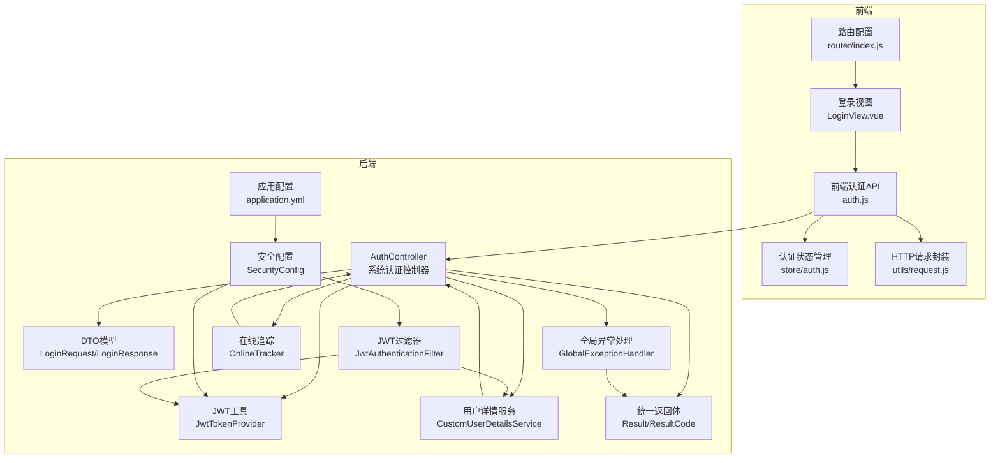
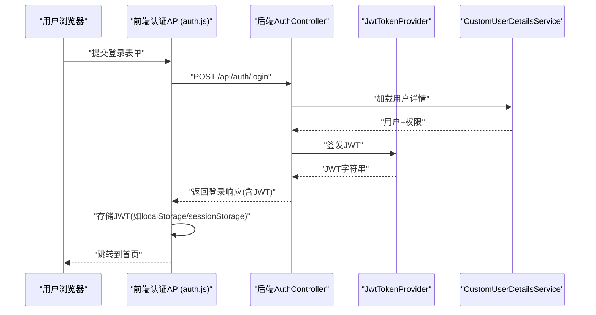
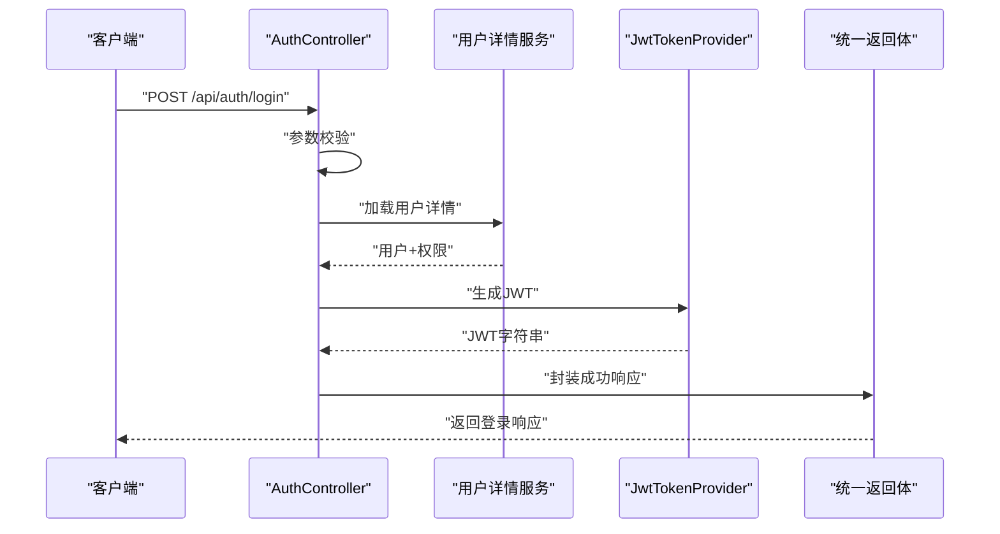
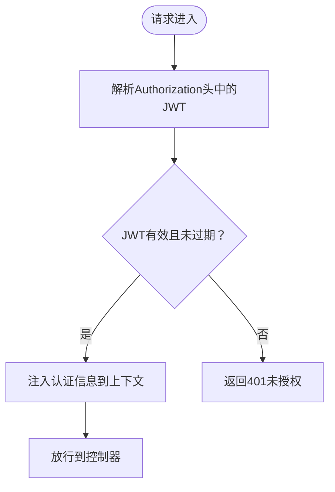
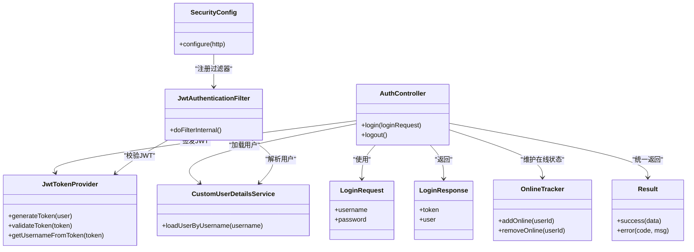

# 认证接口

<cite>
**本文引用的文件**
- [AuthController.java](file://src/main/java/com/superpower/modules/system/controller/AuthController.java)
- [LoginRequest.java](file://src/main/java/com/superpower/modules/system/dto/LoginRequest.java)
- [LoginResponse.java](file://src/main/java/com/superpower/modules/system/dto/LoginResponse.java)
- [JwtTokenProvider.java](file://src/main/java/com/superpower/security/JwtTokenProvider.java)
- [JwtAuthenticationFilter.java](file://src/main/java/com/superpower/security/JwtAuthenticationFilter.java)
- [CustomUserDetailsService.java](file://src/main/java/com/superpower/security/CustomUserDetailsService.java)
- [SecurityConfig.java](file://src/main/java/com/superpower/config/SecurityConfig.java)
- [OnlineTracker.java](file://src/main/java/com/superpower/security/OnlineTracker.java)
- [auth.js](file://frontend/src/api/auth.js)
- [store/auth.js](file://frontend/src/store/auth.js)
- [request.js](file://frontend/src/utils/request.js)
- [LoginView.vue](file://frontend/src/views/login/LoginView.vue)
- [index.js](file://frontend/src/router/index.js)
- [GlobalExceptionHandler.java](file://src/main/java/com/superpower/common/GlobalExceptionHandler.java)
- [Result.java](file://src/main/java/com/superpower/common/Result.java)
- [ResultCode.java](file://src/main/java/com/superpower/common/ResultCode.java)
- [application.yml](file://src/main/resources/application.yml)
</cite>

## 目录
1. [简介](#简介)
2. [项目结构](#项目结构)
3. [核心组件](#核心组件)
4. [架构总览](#架构总览)
5. [详细组件分析](#详细组件分析)
6. [依赖关系分析](#依赖关系分析)
7. [性能考虑](#性能考虑)
8. [故障排除指南](#故障排除指南)
9. [结论](#结论)
10. [附录](#附录)

## 简介
本文件面向认证接口的技术文档，围绕用户登录、登出与令牌（JWT）管理进行系统化说明。内容涵盖：
- 登录请求数据结构、响应格式与错误处理
- JWT 获取、存储与刷新机制
- 会话管理策略、令牌过期处理与自动登出
- 认证状态检查、权限验证与路由守卫实现
- 完整使用示例与常见问题解决方案

## 项目结构
后端采用 Spring Boot 架构，认证相关模块集中在 system 模块与 security 包中；前端通过 API 层与状态管理实现认证流程。

图表来源
- [AuthController.java:1-200](file://src/main/java/com/superpower/modules/system/controller/AuthController.java#L1-L200)
- [JwtTokenProvider.java:1-200](file://src/main/java/com/superpower/security/JwtTokenProvider.java#L1-L200)
- [JwtAuthenticationFilter.java:1-200](file://src/main/java/com/superpower/security/JwtAuthenticationFilter.java#L1-L200)
- [CustomUserDetailsService.java:1-200](file://src/main/java/com/superpower/security/CustomUserDetailsService.java#L1-L200)
- [SecurityConfig.java:1-200](file://src/main/java/com/superpower/config/SecurityConfig.java#L1-L200)
- [OnlineTracker.java:1-200](file://src/main/java/com/superpower/security/OnlineTracker.java#L1-L200)
- [auth.js:1-200](file://frontend/src/api/auth.js#L1-L200)
- [store/auth.js:1-200](file://frontend/src/store/auth.js#L1-L200)
- [request.js:1-200](file://frontend/src/utils/request.js#L1-L200)
- [LoginView.vue:1-200](file://frontend/src/views/login/LoginView.vue#L1-L200)
- [index.js:1-200](file://frontend/src/router/index.js#L1-L200)
- [GlobalExceptionHandler.java:1-200](file://src/main/java/com/superpower/common/GlobalExceptionHandler.java#L1-L200)
- [Result.java:1-200](file://src/main/java/com/superpower/common/Result.java#L1-L200)
- [ResultCode.java:1-200](file://src/main/java/com/superpower/common/ResultCode.java#L1-L200)
- [application.yml:1-200](file://src/main/resources/application.yml#L1-L200)

章节来源
- [AuthController.java:1-200](file://src/main/java/com/superpower/modules/system/controller/AuthController.java#L1-L200)
- [SecurityConfig.java:1-200](file://src/main/java/com/superpower/config/SecurityConfig.java#L1-L200)

## 核心组件
- 后端认证控制器：负责登录、登出等认证入口，生成并下发 JWT。
- DTO 模型：定义登录请求与响应的数据结构。
- JWT 工具：生成、解析与校验 JWT 的核心能力。
- 安全配置与过滤器：拦截请求，校验 JWT 并注入认证信息。
- 用户详情服务：加载用户权限与角色，供鉴权使用。
- 在线追踪：维护在线用户状态，支持强制下线等场景。
- 前端认证 API 与状态管理：封装登录登出、存储令牌、刷新令牌与路由守卫。
- 统一返回体与全局异常处理：标准化错误码与响应结构。

章节来源
- [AuthController.java:1-200](file://src/main/java/com/superpower/modules/system/controller/AuthController.java#L1-L200)
- [LoginRequest.java:1-200](file://src/main/java/com/superpower/modules/system/dto/LoginRequest.java#L1-L200)
- [LoginResponse.java:1-200](file://src/main/java/com/superpower/modules/system/dto/LoginResponse.java#L1-L200)
- [JwtTokenProvider.java:1-200](file://src/main/java/com/superpower/security/JwtTokenProvider.java#L1-L200)
- [JwtAuthenticationFilter.java:1-200](file://src/main/java/com/superpower/security/JwtAuthenticationFilter.java#L1-L200)
- [CustomUserDetailsService.java:1-200](file://src/main/java/com/superpower/security/CustomUserDetailsService.java#L1-L200)
- [OnlineTracker.java:1-200](file://src/main/java/com/superpower/security/OnlineTracker.java#L1-L200)
- [auth.js:1-200](file://frontend/src/api/auth.js#L1-L200)
- [store/auth.js:1-200](file://frontend/src/store/auth.js#L1-L200)
- [GlobalExceptionHandler.java:1-200](file://src/main/java/com/superpower/common/GlobalExceptionHandler.java#L1-L200)
- [Result.java:1-200](file://src/main/java/com/superpower/common/Result.java#L1-L200)
- [ResultCode.java:1-200](file://src/main/java/com/superpower/common/ResultCode.java#L1-L200)

## 架构总览
认证系统遵循“前后端分离 + JWT”的标准模式：
- 前端通过认证 API 发起登录，接收 JWT 并持久化
- 请求携带 JWT 进入后端过滤器链，解析并注入认证上下文
- 控制器根据业务逻辑返回结果
- 登出时清理本地状态，并在必要时使令牌失效或加入黑名单

图表来源
- [auth.js:1-200](file://frontend/src/api/auth.js#L1-L200)
- [AuthController.java:1-200](file://src/main/java/com/superpower/modules/system/controller/AuthController.java#L1-L200)
- [JwtTokenProvider.java:1-200](file://src/main/java/com/superpower/security/JwtTokenProvider.java#L1-L200)
- [CustomUserDetailsService.java:1-200](file://src/main/java/com/superpower/security/CustomUserDetailsService.java#L1-L200)

## 详细组件分析

### 登录接口（POST /api/auth/login）
- 请求体：用户名、密码等字段由登录请求 DTO 定义
- 响应体：包含 JWT 令牌与用户信息的登录响应 DTO
- 处理流程：
  - 校验请求参数
  - 加载用户详情与权限
  - 生成 JWT
  - 返回成功响应
- 错误处理：通过统一返回体与全局异常处理，返回标准化错误码与消息

图表来源
- [AuthController.java:1-200](file://src/main/java/com/superpower/modules/system/controller/AuthController.java#L1-L200)
- [LoginRequest.java:1-200](file://src/main/java/com/superpower/modules/system/dto/LoginRequest.java#L1-L200)
- [LoginResponse.java:1-200](file://src/main/java/com/superpower/modules/system/dto/LoginResponse.java#L1-L200)
- [JwtTokenProvider.java:1-200](file://src/main/java/com/superpower/security/JwtTokenProvider.java#L1-L200)
- [Result.java:1-200](file://src/main/java/com/superpower/common/Result.java#L1-L200)
- [ResultCode.java:1-200](file://src/main/java/com/superpower/common/ResultCode.java#L1-L200)

章节来源
- [AuthController.java:1-200](file://src/main/java/com/superpower/modules/system/controller/AuthController.java#L1-L200)
- [LoginRequest.java:1-200](file://src/main/java/com/superpower/modules/system/dto/LoginRequest.java#L1-L200)
- [LoginResponse.java:1-200](file://src/main/java/com/superpower/modules/system/dto/LoginResponse.java#L1-L200)
- [Result.java:1-200](file://src/main/java/com/superpower/common/Result.java#L1-L200)
- [ResultCode.java:1-200](file://src/main/java/com/superpower/common/ResultCode.java#L1-L200)

### 登出接口（POST /api/auth/logout）
- 功能：清理本地状态，可选地将当前令牌加入黑名单或服务端会话失效
- 前端：清除存储的 JWT，重置认证状态，跳转至登录页
- 后端：可结合在线追踪与黑名单策略实现强制下线

章节来源
- [AuthController.java:1-200](file://src/main/java/com/superpower/modules/system/controller/AuthController.java#L1-L200)
- [store/auth.js:1-200](file://frontend/src/store/auth.js#L1-L200)
- [OnlineTracker.java:1-200](file://src/main/java/com/superpower/security/OnlineTracker.java#L1-L200)

### JWT 令牌管理
- 生成：基于用户身份与权限生成 JWT
- 存储：前端通常存储在 localStorage 或 sessionStorage
- 刷新：建议采用短期访问令牌 + 长期刷新令牌的策略（需后端配合）
- 校验：过滤器在每次请求前解析并校验 JWT，注入认证上下文

图表来源
- [JwtAuthenticationFilter.java:1-200](file://src/main/java/com/superpower/security/JwtAuthenticationFilter.java#L1-L200)
- [JwtTokenProvider.java:1-200](file://src/main/java/com/superpower/security/JwtTokenProvider.java#L1-L200)

章节来源
- [JwtTokenProvider.java:1-200](file://src/main/java/com/superpower/security/JwtTokenProvider.java#L1-L200)
- [JwtAuthenticationFilter.java:1-200](file://src/main/java/com/superpower/security/JwtAuthenticationFilter.java#L1-L200)

### 会话管理与自动登出
- 在线追踪：记录在线用户，支持强制下线等操作
- 令牌过期：过滤器检测过期令牌并拒绝请求
- 自动登出：结合前端定时器与后端策略，在令牌即将过期或服务器端强制失效时触发登出

章节来源
- [OnlineTracker.java:1-200](file://src/main/java/com/superpower/security/OnlineTracker.java#L1-L200)
- [JwtAuthenticationFilter.java:1-200](file://src/main/java/com/superpower/security/JwtAuthenticationFilter.java#L1-L200)

### 权限验证与路由守卫
- 路由守卫：在进入受保护页面前检查认证状态与令牌有效性
- 权限验证：控制器方法上标注所需角色/权限，结合安全配置生效
- 前端：在路由导航守卫中读取存储的认证状态，决定是否放行

章节来源
- [index.js:1-200](file://frontend/src/router/index.js#L1-L200)
- [store/auth.js:1-200](file://frontend/src/store/auth.js#L1-L200)
- [SecurityConfig.java:1-200](file://src/main/java/com/superpower/config/SecurityConfig.java#L1-L200)

## 依赖关系分析

图表来源
- [AuthController.java:1-200](file://src/main/java/com/superpower/modules/system/controller/AuthController.java#L1-L200)
- [LoginRequest.java:1-200](file://src/main/java/com/superpower/modules/system/dto/LoginRequest.java#L1-L200)
- [LoginResponse.java:1-200](file://src/main/java/com/superpower/modules/system/dto/LoginResponse.java#L1-L200)
- [JwtTokenProvider.java:1-200](file://src/main/java/com/superpower/security/JwtTokenProvider.java#L1-L200)
- [JwtAuthenticationFilter.java:1-200](file://src/main/java/com/superpower/security/JwtAuthenticationFilter.java#L1-L200)
- [CustomUserDetailsService.java:1-200](file://src/main/java/com/superpower/security/CustomUserDetailsService.java#L1-L200)
- [SecurityConfig.java:1-200](file://src/main/java/com/superpower/config/SecurityConfig.java#L1-L200)
- [OnlineTracker.java:1-200](file://src/main/java/com/superpower/security/OnlineTracker.java#L1-L200)
- [Result.java:1-200](file://src/main/java/com/superpower/common/Result.java#L1-L200)

章节来源
- [AuthController.java:1-200](file://src/main/java/com/superpower/modules/system/controller/AuthController.java#L1-L200)
- [SecurityConfig.java:1-200](file://src/main/java/com/superpower/config/SecurityConfig.java#L1-L200)

## 性能考虑
- JWT 解析与校验：尽量减少不必要的解析次数，合理设置令牌有效期
- 过滤器链：确保仅对受保护路径启用 JWT 校验，避免对静态资源与公开接口造成额外开销
- 在线追踪：批量维护在线用户状态，避免频繁写入数据库
- 前端缓存：合理缓存用户信息，减少重复请求

## 故障排除指南
- 401 未授权
  - 可能原因：令牌缺失、格式错误、已过期或被篡改
  - 处理建议：重新登录获取新令牌，检查时间同步与签名算法
- 403 禁止访问
  - 可能原因：权限不足或角色不匹配
  - 处理建议：确认用户角色与所需权限，检查控制器级权限注解
- 登录失败
  - 可能原因：用户名或密码错误、账户被锁定
  - 处理建议：提示具体错误信息，限制尝试次数
- 令牌刷新
  - 建议：采用短期访问令牌 + 长期刷新令牌策略，后端提供刷新接口并校验刷新令牌

章节来源
- [GlobalExceptionHandler.java:1-200](file://src/main/java/com/superpower/common/GlobalExceptionHandler.java#L1-L200)
- [ResultCode.java:1-200](file://src/main/java/com/superpower/common/ResultCode.java#L1-L200)
- [JwtAuthenticationFilter.java:1-200](file://src/main/java/com/superpower/security/JwtAuthenticationFilter.java#L1-L200)

## 结论
该认证体系以 JWT 为核心，结合 Spring Security 的过滤器链实现请求级鉴权，前后端协同完成登录、登出与令牌管理。通过统一返回体与全局异常处理，保证了错误的一致性与可诊断性。建议在现有基础上完善刷新令牌机制与更细粒度的权限控制，以满足生产环境的安全与可用性要求。

## 附录

### 使用示例（后端）
- 登录
  - 请求：POST /api/auth/login
  - 成功响应：包含 JWT 与用户信息
- 登出
  - 请求：POST /api/auth/logout
  - 行为：清理本地状态，可选服务端失效

章节来源
- [AuthController.java:1-200](file://src/main/java/com/superpower/modules/system/controller/AuthController.java#L1-L200)
- [LoginRequest.java:1-200](file://src/main/java/com/superpower/modules/system/dto/LoginRequest.java#L1-L200)
- [LoginResponse.java:1-200](file://src/main/java/com/superpower/modules/system/dto/LoginResponse.java#L1-L200)

### 前端集成要点
- 认证 API 封装：在请求拦截器中附加 Authorization 头
- 状态管理：集中存储与更新认证状态
- 路由守卫：在进入受保护页面前检查令牌有效性
- 登录视图：收集用户名与密码，调用认证 API

章节来源
- [auth.js:1-200](file://frontend/src/api/auth.js#L1-L200)
- [store/auth.js:1-200](file://frontend/src/store/auth.js#L1-L200)
- [request.js:1-200](file://frontend/src/utils/request.js#L1-L200)
- [LoginView.vue:1-200](file://frontend/src/views/login/LoginView.vue#L1-L200)
- [index.js:1-200](file://frontend/src/router/index.js#L1-L200)