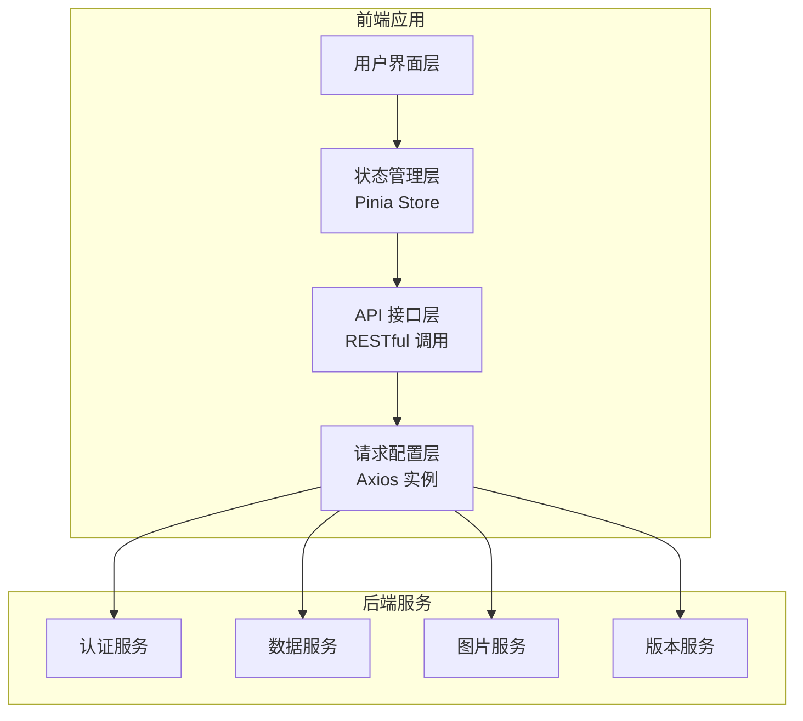
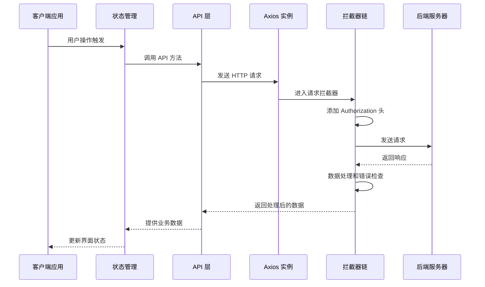
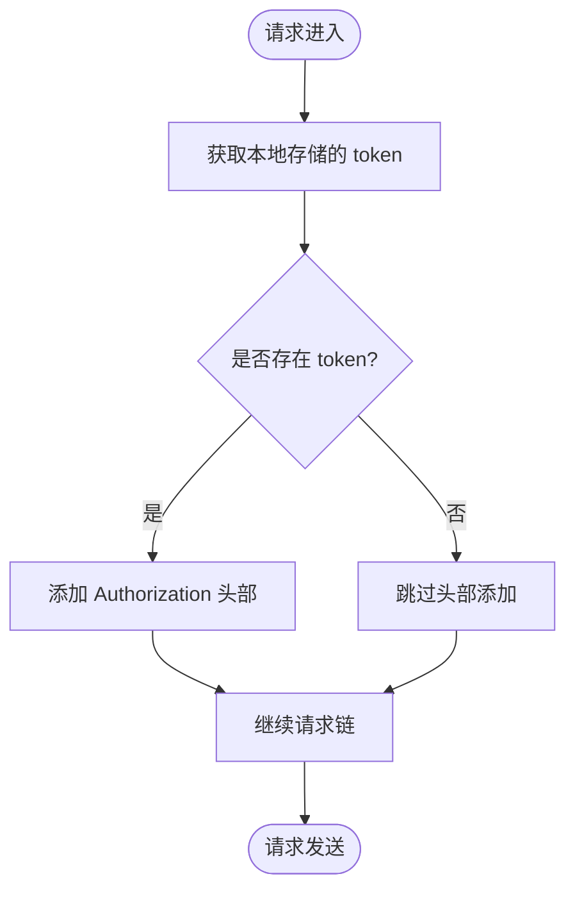
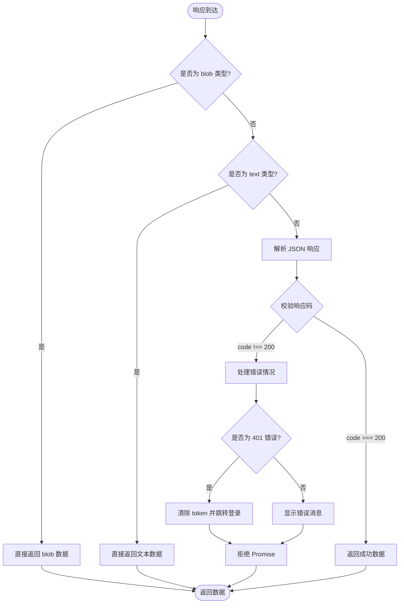
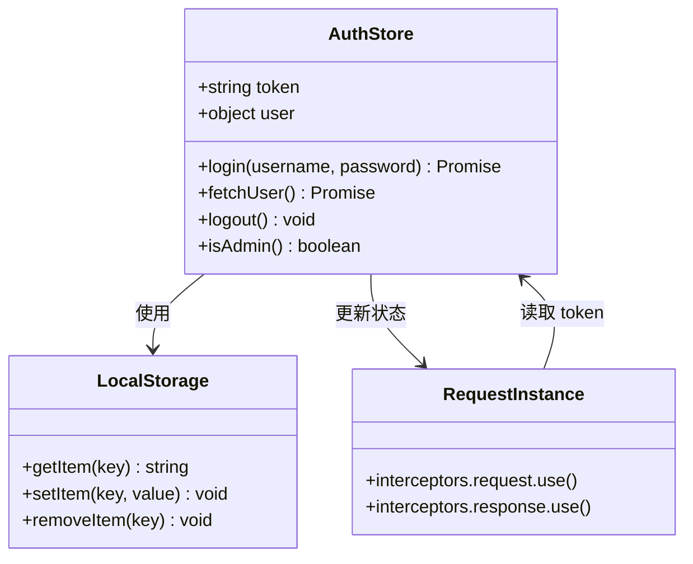
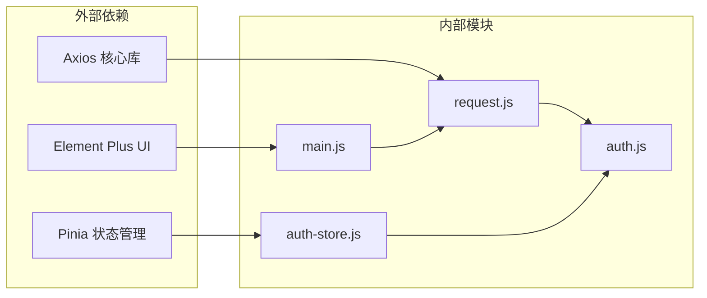

# 请求配置与拦截器

<cite>
**本文档引用的文件**
- [request.js](file://frontend/src/utils/request.js)
- [auth.js](file://frontend/src/api/auth.js)
- [auth-store.js](file://frontend/src/store/auth.js)
- [main.js](file://frontend/src/main.js)
</cite>

## 目录
1. [简介](#简介)
2. [项目结构](#项目结构)
3. [核心组件](#核心组件)
4. [架构概览](#架构概览)
5. [详细组件分析](#详细组件分析)
6. [依赖分析](#依赖分析)
7. [性能考虑](#性能考虑)
8. [故障排除指南](#故障排除指南)
9. [结论](#结论)

## 简介

本文档深入解析了基于 Axios 的请求配置与拦截器系统，涵盖 Axios 实例创建、基础配置、请求拦截器的 token 自动添加与预处理机制、响应拦截器的数据处理与错误统一处理，以及完整的拦截器链执行顺序和最佳实践。通过分析实际代码实现，帮助开发者全面理解整个请求生命周期的处理流程。

## 项目结构

该项目采用前后端分离架构，前端使用 Vue 3 + Pinia + Element Plus 技术栈。请求配置与拦截器位于前端项目的 utils 目录下，通过统一的 Axios 实例封装，为所有 API 调用提供一致的请求和响应处理机制。

**图表来源**
- [request.js:1-65](file://frontend/src/utils/request.js#L1-L65)
- [auth.js:1-22](file://frontend/src/api/auth.js#L1-L22)

**章节来源**
- [request.js:1-65](file://frontend/src/utils/request.js#L1-L65)
- [main.js:1-20](file://frontend/src/main.js#L1-L20)

## 核心组件

### Axios 实例配置

项目创建了一个全局的 Axios 实例，配置了基础 URL、超时时间和参数序列化策略：

- **基础 URL**: `/api` - 统一的 API 前缀
- **超时时间**: 60000ms - 60 秒的请求超时
- **参数序列化**: 自定义序列化器，过滤空值和数组参数

### 拦截器体系

系统实现了完整的请求和响应拦截器链：

- **请求拦截器**: 自动添加 Authorization 头部
- **响应拦截器**: 统一数据处理和错误处理

**章节来源**
- [request.js:5-22](file://frontend/src/utils/request.js#L5-L22)
- [request.js:24-62](file://frontend/src/utils/request.js#L24-L62)

## 架构概览

**图表来源**
- [request.js:24-62](file://frontend/src/utils/request.js#L24-L62)
- [auth.js:3-9](file://frontend/src/api/auth.js#L3-L9)

## 详细组件分析

### 请求拦截器实现

请求拦截器负责在每个请求发送前进行预处理：

**图表来源**
- [request.js:24-30](file://frontend/src/utils/request.js#L24-L30)

**实现特点**:
- 从 localStorage 获取 token
- 自动添加 `Authorization: Bearer ${token}` 头部
- 支持无 token 的匿名请求

**章节来源**
- [request.js:24-30](file://frontend/src/utils/request.js#L24-L30)

### 响应拦截器实现

响应拦截器提供三层处理机制：

**图表来源**
- [request.js:32-62](file://frontend/src/utils/request.js#L32-L62)

**错误处理机制**:
- **401 未授权**: 清除本地 token，跳转到登录页
- **403 禁止访问**: 显示登录过期提示，跳转登录页
- **其他错误**: 显示具体的错误消息

**章节来源**
- [request.js:32-62](file://frontend/src/utils/request.js#L32-L62)

### Token 管理集成

认证状态与 token 管理通过 Pinia store 实现：

**图表来源**
- [auth-store.js:1-46](file://frontend/src/store/auth.js#L1-L46)
- [request.js:24-30](file://frontend/src/utils/request.js#L24-L30)

**章节来源**
- [auth-store.js:1-46](file://frontend/src/store/auth.js#L1-L46)

### API 层集成

各个 API 模块统一使用配置好的 Axios 实例：

**章节来源**
- [auth.js:1-22](file://frontend/src/api/auth.js#L1-L22)
- [data.js:1-128](file://frontend/src/api/data.js#L1-L128)
- [image.js:1-93](file://frontend/src/api/image.js#L1-L93)

## 依赖分析

**图表来源**
- [request.js:1-3](file://frontend/src/utils/request.js#L1-L3)
- [main.js:1-13](file://frontend/src/main.js#L1-L13)

**依赖关系**:
- `request.js` 依赖 axios 核心库
- `auth.js` 依赖 `request.js` 实例
- `auth-store.js` 依赖 `auth.js` 和 `request.js`
- `main.js` 配置应用并注册插件

**章节来源**
- [request.js:1-3](file://frontend/src/utils/request.js#L1-L3)
- [main.js:1-13](file://frontend/src/main.js#L1-L13)

## 性能考虑

### 超时配置
- 默认超时时间为 60 秒，适用于大多数 API 请求
- 特定场景可通过 API 层单独配置更长的超时时间（如文件上传）

### 参数序列化
- 自定义序列化器过滤空值和数组参数
- 避免发送无效的查询参数，减少服务器负载

### 缓存策略
- 响应拦截器支持多种响应类型（blob、text、json）
- 合理使用 responseType 避免不必要的数据转换

## 故障排除指南

### 常见问题及解决方案

**1. 请求超时问题**
- 检查网络连接状态
- 调整超时配置或使用更长的超时时间
- 查看服务器响应时间

**2. 认证失败**
- 确认 token 是否存在且有效
- 检查服务器认证服务状态
- 验证用户凭据正确性

**3. CORS 跨域问题**
- 检查服务器 CORS 配置
- 确认请求头设置正确
- 验证域名和端口配置

**4. 响应数据格式问题**
- 检查 responseType 配置
- 验证服务器返回的数据格式
- 确认响应拦截器处理逻辑

**章节来源**
- [request.js:50-61](file://frontend/src/utils/request.js#L50-L61)

## 结论

该请求配置与拦截器系统提供了完整的 HTTP 通信基础设施，具有以下优势：

1. **统一配置**: 通过单一 Axios 实例管理所有 API 请求
2. **自动认证**: 请求拦截器自动处理 token 添加
3. **错误统一**: 响应拦截器提供一致的错误处理机制
4. **灵活扩展**: 支持自定义拦截器和配置项
5. **类型安全**: TypeScript 支持确保类型安全

建议在实际项目中：
- 根据业务需求调整超时时间和重试策略
- 添加请求去重和缓存机制
- 实现更详细的错误监控和上报
- 考虑添加请求取消和中断机制
- 优化网络状态检测和离线处理