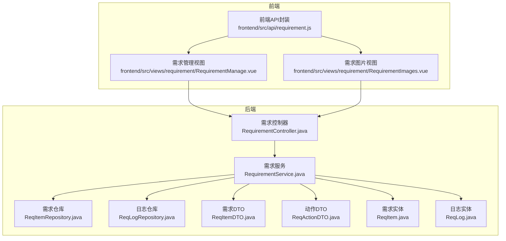
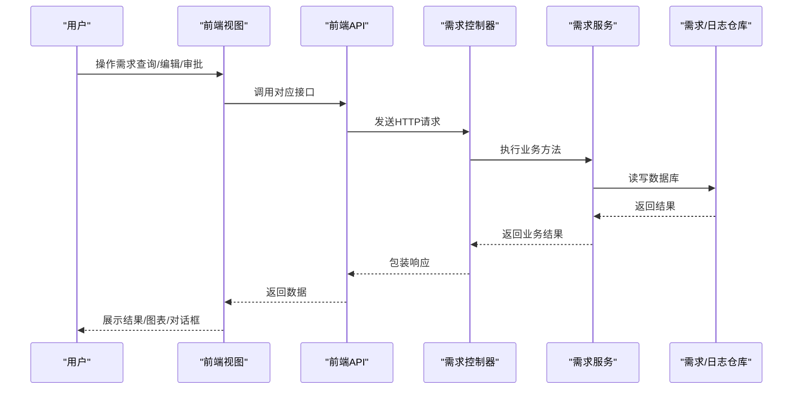
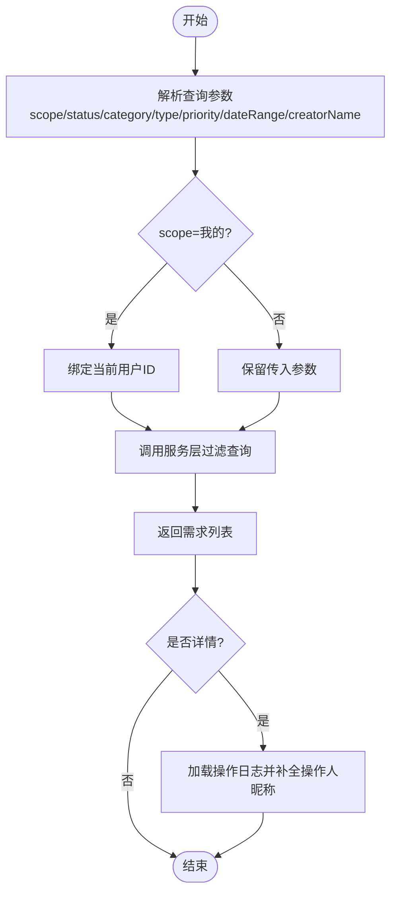
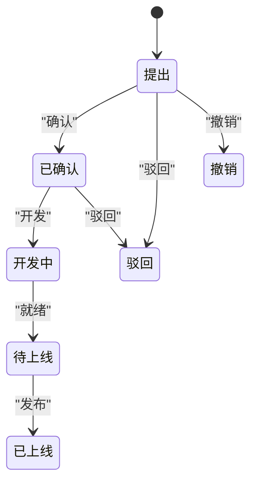
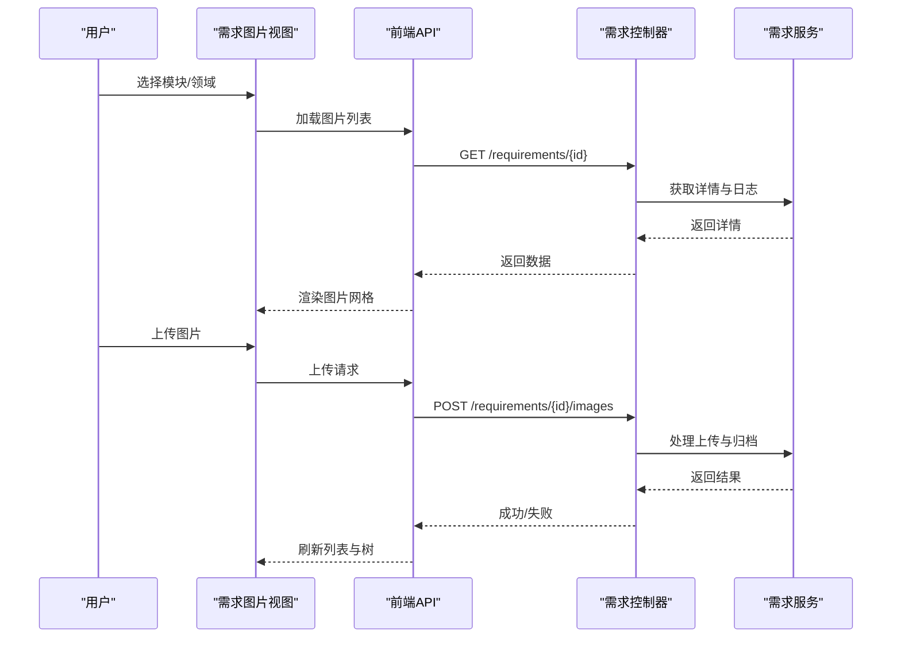
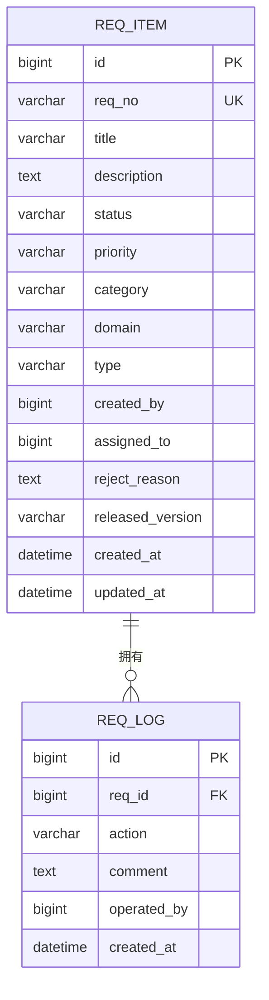
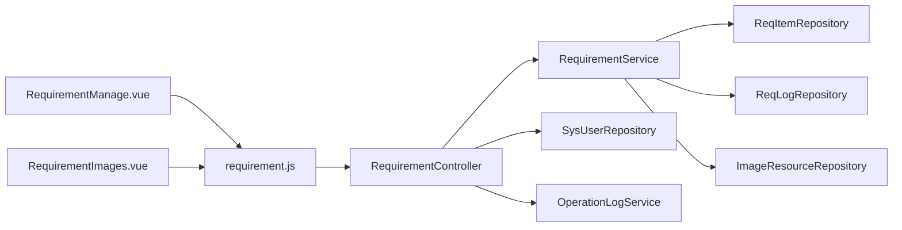

# 需求管理接口

<cite>
**本文档引用的文件**
- [RequirementController.java](file://src/main/java/com/superpower/modules/requirement/controller/RequirementController.java)
- [RequirementService.java](file://src/main/java/com/superpower/modules/requirement/service/RequirementService.java)
- [ReqItem.java](file://src/main/java/com/superpower/modules/requirement/entity/ReqItem.java)
- [ReqItemDTO.java](file://src/main/java/com/superpower/modules/requirement/dto/ReqItemDTO.java)
- [ReqActionDTO.java](file://src/main/java/com/superpower/modules/requirement/dto/ReqActionDTO.java)
- [ReqLog.java](file://src/main/java/com/superpower/modules/requirement/entity/ReqLog.java)
- [ReqItemRepository.java](file://src/main/java/com/superpower/modules/requirement/repository/ReqItemRepository.java)
- [ReqLogRepository.java](file://src/main/java/com/superpower/modules/requirement/repository/ReqLogRepository.java)
- [requirement.js](file://frontend/src/api/requirement.js)
- [RequirementManage.vue](file://frontend/src/views/requirement/RequirementManage.vue)
- [RequirementImages.vue](file://frontend/src/views/requirement/RequirementImages.vue)
</cite>

## 目录
1. [简介](#简介)
2. [项目结构](#项目结构)
3. [核心组件](#核心组件)
4. [架构总览](#架构总览)
5. [详细组件分析](#详细组件分析)
6. [依赖关系分析](#依赖关系分析)
7. [性能考虑](#性能考虑)
8. [故障排除指南](#故障排除指南)
9. [结论](#结论)
10. [附录](#附录)

## 简介
本文件面向需求管理接口的技术文档，围绕需求清单维护、需求图片管理与审批流程展开，覆盖需求项的创建、编辑、删除与查询；需求图片的上传、关联与管理；审批流程的状态流转、节点操作与历史记录查询；以及需求统计、报表生成与导出的实现思路。同时提供需求变更追踪、版本对比与冲突处理的方法建议，并给出完整的使用示例与业务流程指导。

## 项目结构
后端采用Spring Boot分层架构，前端基于Vue 3 + Element Plus构建。需求管理相关的核心文件组织如下：
- 后端模块：modules/requirement（控制器、服务、实体、仓库、DTO）
- 前端模块：views/requirement（需求管理页面、需求图片页面）、api（需求接口封装）

图表来源
- [RequirementController.java:1-239](file://src/main/java/com/superpower/modules/requirement/controller/RequirementController.java#L1-L239)
- [RequirementService.java:1-274](file://src/main/java/com/superpower/modules/requirement/service/RequirementService.java#L1-L274)
- [ReqItemRepository.java](file://src/main/java/com/superpower/modules/requirement/repository/ReqItemRepository.java)
- [ReqLogRepository.java](file://src/main/java/com/superpower/modules/requirement/repository/ReqLogRepository.java)
- [ReqItemDTO.java:1-14](file://src/main/java/com/superpower/modules/requirement/dto/ReqItemDTO.java#L1-L14)
- [ReqActionDTO.java](file://src/main/java/com/superpower/modules/requirement/dto/ReqActionDTO.java)
- [ReqItem.java:1-60](file://src/main/java/com/superpower/modules/requirement/entity/ReqItem.java#L1-L60)
- [ReqLog.java](file://src/main/java/com/superpower/modules/requirement/entity/ReqLog.java)
- [requirement.js:1-62](file://frontend/src/api/requirement.js#L1-L62)
- [RequirementManage.vue:1-595](file://frontend/src/views/requirement/RequirementManage.vue#L1-L595)
- [RequirementImages.vue:1-330](file://frontend/src/views/requirement/RequirementImages.vue#L1-L330)

章节来源
- [RequirementController.java:1-239](file://src/main/java/com/superpower/modules/requirement/controller/RequirementController.java#L1-L239)
- [RequirementService.java:1-274](file://src/main/java/com/superpower/modules/requirement/service/RequirementService.java#L1-L274)
- [RequirementManage.vue:1-595](file://frontend/src/views/requirement/RequirementManage.vue#L1-L595)
- [RequirementImages.vue:1-330](file://frontend/src/views/requirement/RequirementImages.vue#L1-L330)
- [requirement.js:1-62](file://frontend/src/api/requirement.js#L1-L62)

## 核心组件
- 需求控制器：提供REST接口，负责请求参数解析、鉴权与调用服务层，记录操作日志。
- 需求服务：实现业务逻辑，包括需求生命周期管理、状态校验、统计计算、日志记录与图片引用清理。
- 需求实体与DTO：定义需求数据模型与传输对象，支持前后端数据交换。
- 需求仓库：访问数据库，提供查询与过滤能力。
- 前端API封装与视图：提供用户交互界面，封装HTTP请求并展示统计图表与审批历史。

章节来源
- [RequirementController.java:21-36](file://src/main/java/com/superpower/modules/requirement/controller/RequirementController.java#L21-L36)
- [RequirementService.java:24-40](file://src/main/java/com/superpower/modules/requirement/service/RequirementService.java#L24-L40)
- [ReqItem.java:7-60](file://src/main/java/com/superpower/modules/requirement/entity/ReqItem.java#L7-L60)
- [ReqItemDTO.java:1-14](file://src/main/java/com/superpower/modules/requirement/dto/ReqItemDTO.java#L1-L14)
- [ReqActionDTO.java](file://src/main/java/com/superpower/modules/requirement/dto/ReqActionDTO.java)
- [ReqItemRepository.java](file://src/main/java/com/superpower/modules/requirement/repository/ReqItemRepository.java)
- [ReqLogRepository.java](file://src/main/java/com/superpower/modules/requirement/repository/ReqLogRepository.java)
- [requirement.js:1-62](file://frontend/src/api/requirement.js#L1-L62)
- [RequirementManage.vue:166-522](file://frontend/src/views/requirement/RequirementManage.vue#L166-L522)
- [RequirementImages.vue:80-292](file://frontend/src/views/requirement/RequirementImages.vue#L80-L292)

## 架构总览
需求管理接口遵循经典的MVC分层：
- 控制器层：接收HTTP请求，进行参数校验与权限控制，调用服务层。
- 服务层：实现业务规则与状态机，持久化变更并记录日志。
- 数据访问层：通过仓库接口访问数据库，支持复杂查询与过滤。
- 前端层：通过API封装调用后端接口，渲染表格、图表与对话框。

图表来源
- [RequirementController.java:55-237](file://src/main/java/com/superpower/modules/requirement/controller/RequirementController.java#L55-L237)
- [RequirementService.java:83-272](file://src/main/java/com/superpower/modules/requirement/service/RequirementService.java#L83-L272)
- [ReqItemRepository.java](file://src/main/java/com/superpower/modules/requirement/repository/ReqItemRepository.java)
- [ReqLogRepository.java](file://src/main/java/com/superpower/modules/requirement/repository/ReqLogRepository.java)
- [requirement.js:3-61](file://frontend/src/api/requirement.js#L3-L61)
- [RequirementManage.vue:263-440](file://frontend/src/views/requirement/RequirementManage.vue#L263-L440)

## 详细组件分析

### 需求清单维护
- 查询接口
  - 支持按状态、创建人、范围（我的/全部）、时间范围、模块、领域、类型、优先级等条件过滤。
  - “我的”范围自动绑定当前登录用户ID。
  - 支持根据昵称/用户名模糊匹配创建人。
- 列表与详情
  - 列表返回需求列表并填充创建人昵称。
  - 详情接口返回需求项与操作日志，并补充创建人昵称。
- 创建、编辑、删除
  - 创建：自动生成需求编号，初始状态为“提出”，记录创建日志。
  - 编辑：仅允许创建人且状态为“提出”时修改。
  - 删除：管理员权限；删除时扫描描述中的图片引用，若无其他引用则删除物理文件与记录。
- 统计与报表
  - 提供按状态、模块、类型的统计接口，前端以柱状图展示。

图表来源
- [RequirementController.java:55-82](file://src/main/java/com/superpower/modules/requirement/controller/RequirementController.java#L55-L82)
- [RequirementController.java:89-98](file://src/main/java/com/superpower/modules/requirement/controller/RequirementController.java#L89-L98)
- [RequirementService.java:42-61](file://src/main/java/com/superpower/modules/requirement/service/RequirementService.java#L42-L61)
- [RequirementService.java:218-222](file://src/main/java/com/superpower/modules/requirement/service/RequirementService.java#L218-L222)

章节来源
- [RequirementController.java:55-130](file://src/main/java/com/superpower/modules/requirement/controller/RequirementController.java#L55-L130)
- [RequirementService.java:42-61](file://src/main/java/com/superpower/modules/requirement/service/RequirementService.java#L42-L61)
- [RequirementService.java:218-222](file://src/main/java/com/superpower/modules/requirement/service/RequirementService.java#L218-L222)

### 审批流程与状态管理
- 状态机
  - 提出 → 已确认 → 开发中 → 待上线 → 已上线；支持驳回与撤销。
- 节点操作
  - 确认、开发、就绪、发布、驳回、撤销均通过独立PUT接口触发。
  - 发布需提供版本号；驳回需提供原因；其他节点可附带备注。
- 历史记录
  - 每次状态变更记录到日志表，包含操作人、动作、备注等。
  - 前端详情页与“审批流”弹窗展示完整历史。

图表来源
- [RequirementService.java:119-192](file://src/main/java/com/superpower/modules/requirement/service/RequirementService.java#L119-L192)
- [RequirementController.java:180-226](file://src/main/java/com/superpower/modules/requirement/controller/RequirementController.java#L180-L226)

章节来源
- [RequirementService.java:119-192](file://src/main/java/com/superpower/modules/requirement/service/RequirementService.java#L119-L192)
- [RequirementController.java:180-226](file://src/main/java/com/superpower/modules/requirement/controller/RequirementController.java#L180-L226)
- [RequirementManage.vue:458-463](file://frontend/src/views/requirement/RequirementManage.vue#L458-L463)

### 需求图片管理
- 图片上传
  - 前端选择文件后弹出输入框命名，调用后端上传接口，自动归档至“需求管理”模块与所选领域。
  - 支持单张与批量上传，批量场景统计成功/失败数量。
- 图片浏览与操作
  - 左侧树形目录按模块/子域聚合显示图片数量；右侧网格展示缩略图、名称、大小与操作按钮。
  - 支持预览、复制URL、编辑名称、查看引用、删除与批量删除。
- 引用与删除策略
  - 删除前检查是否被需求描述引用，若有引用则禁止删除并提示。
  - 图片树与列表刷新后同步更新。

图表来源
- [RequirementImages.vue:151-205](file://frontend/src/views/requirement/RequirementImages.vue#L151-L205)
- [RequirementImages.vue:237-252](file://frontend/src/views/requirement/RequirementImages.vue#L237-L252)
- [RequirementManage.vue:465-497](file://frontend/src/views/requirement/RequirementManage.vue#L465-L497)

章节来源
- [RequirementImages.vue:151-205](file://frontend/src/views/requirement/RequirementImages.vue#L151-L205)
- [RequirementImages.vue:237-252](file://frontend/src/views/requirement/RequirementImages.vue#L237-L252)
- [RequirementManage.vue:465-497](file://frontend/src/views/requirement/RequirementManage.vue#L465-L497)

### 数据模型与关系

图表来源
- [ReqItem.java:10-59](file://src/main/java/com/superpower/modules/requirement/entity/ReqItem.java#L10-L59)
- [ReqLog.java](file://src/main/java/com/superpower/modules/requirement/entity/ReqLog.java)

章节来源
- [ReqItem.java:10-59](file://src/main/java/com/superpower/modules/requirement/entity/ReqItem.java#L10-L59)
- [ReqLog.java](file://src/main/java/com/superpower/modules/requirement/entity/ReqLog.java)

### API定义与调用示例
- 查询需求列表
  - 方法：GET /api/requirements
  - 参数：status、createdBy、creatorName、scope=my|all、startDate、endDate、category、domain、type、priority
  - 示例：[requirement.js:3-5](file://frontend/src/api/requirement.js#L3-L5)
- 我的需求
  - 方法：GET /api/requirements/my
  - 示例：[requirement.js:7-9](file://frontend/src/api/requirement.js#L7-L9)
- 需求详情
  - 方法：GET /api/requirements/{id}
  - 示例：[requirement.js:11-13](file://frontend/src/api/requirement.js#L11-L13)
- 统计接口
  - 方法：GET /api/requirements/stats | /stats-by-module | /stats-by-type
  - 示例：[requirement.js:15-25](file://frontend/src/api/requirement.js#L15-L25)
- 创建需求
  - 方法：POST /api/requirements
  - 示例：[requirement.js:27-29](file://frontend/src/api/requirement.js#L27-L29)
- 更新需求
  - 方法：PUT /api/requirements/{id}
  - 示例：[requirement.js:31-33](file://frontend/src/api/requirement.js#L31-L33)
- 审批节点
  - 方法：PUT /api/requirements/{id}/confirm|develop|ready|release|reject|cancel
  - 示例：[requirement.js:35-57](file://frontend/src/api/requirement.js#L35-L57)
- 删除需求
  - 方法：DELETE /api/requirements/{id}
  - 示例：[requirement.js:59-61](file://frontend/src/api/requirement.js#L59-L61)

章节来源
- [RequirementController.java:55-237](file://src/main/java/com/superpower/modules/requirement/controller/RequirementController.java#L55-L237)
- [requirement.js:1-62](file://frontend/src/api/requirement.js#L1-L62)

## 依赖关系分析
- 控制器依赖服务层与系统用户/操作日志服务，用于鉴权与审计。
- 服务层依赖仓库层与图片资源仓库，实现需求与日志的持久化及图片引用清理。
- 前端API封装统一调用控制器接口，视图组件负责交互与展示。

图表来源
- [RequirementController.java:25-36](file://src/main/java/com/superpower/modules/requirement/controller/RequirementController.java#L25-L36)
- [RequirementService.java:27-40](file://src/main/java/com/superpower/modules/requirement/service/RequirementService.java#L27-L40)
- [requirement.js:1-62](file://frontend/src/api/requirement.js#L1-L62)
- [RequirementManage.vue:174-177](file://frontend/src/views/requirement/RequirementManage.vue#L174-L177)
- [RequirementImages.vue:82-85](file://frontend/src/views/requirement/RequirementImages.vue#L82-L85)

章节来源
- [RequirementController.java:25-36](file://src/main/java/com/superpower/modules/requirement/controller/RequirementController.java#L25-L36)
- [RequirementService.java:27-40](file://src/main/java/com/superpower/modules/requirement/service/RequirementService.java#L27-L40)
- [RequirementManage.vue:174-177](file://frontend/src/views/requirement/RequirementManage.vue#L174-L177)
- [RequirementImages.vue:82-85](file://frontend/src/views/requirement/RequirementImages.vue#L82-L85)

## 性能考虑
- 查询优化
  - 使用日期范围边界处理，避免跨日导致的时间截断问题。
  - 列表查询支持多条件组合过滤，建议在数据库层面建立索引以提升性能。
- 日志与统计
  - 统计接口基于内存分组，数据量大时建议引入数据库聚合查询或缓存中间结果。
- 前端渲染
  - 图表初始化与事件绑定集中在mounted阶段，resize时统一处理，避免重复实例化。
- 图片管理
  - 批量上传统计成功/失败数量，减少多次网络往返；删除前检查引用，避免无效IO。

## 故障排除指南
- 权限错误
  - 删除需求需要管理员角色，否则会返回鉴权异常。
- 状态约束
  - 非法状态变更会抛出业务异常，如“只有‘提出’状态的需求可以编辑”、“当前状态不允许驳回”等。
- 必填字段
  - 发布需提供版本号，驳回需提供原因，否则抛出业务异常。
- 图片引用
  - 若图片被需求描述引用，删除会被拒绝；可通过“引用需求”功能查看具体引用列表。

章节来源
- [RequirementController.java:228-237](file://src/main/java/com/superpower/modules/requirement/controller/RequirementController.java#L228-L237)
- [RequirementService.java:103-108](file://src/main/java/com/superpower/modules/requirement/service/RequirementService.java#L103-L108)
- [RequirementService.java:163-171](file://src/main/java/com/superpower/modules/requirement/service/RequirementService.java#L163-L171)
- [RequirementService.java:194-216](file://src/main/java/com/superpower/modules/requirement/service/RequirementService.java#L194-L216)
- [RequirementImages.vue:237-252](file://frontend/src/views/requirement/RequirementImages.vue#L237-L252)

## 结论
需求管理接口提供了完善的需求生命周期管理、审批流程与图片管理能力。通过清晰的分层架构与严格的业务约束，确保了数据一致性与可追溯性。前端以可视化方式呈现统计与审批历史，提升了用户体验。后续可在统计查询与图片引用清理方面进一步优化性能与扩展性。

## 附录
- 使用示例与业务流程指导
  - 新建需求：进入需求管理页面，点击“提交需求”，填写标题、描述、优先级、模块、领域、类型，提交后状态为“提出”。
  - 审批流程：管理员依次执行“确认→开发→就绪→发布”，发布时选择版本号；若不满足要求可“驳回”并填写原因；需求提出人可在“提出”状态下“撤销”。
  - 图片管理：在“需求图片”页面选择模块/子域，上传图片并命名；在需求详情描述中插入图片卡片，支持预览与删除（仅“提出”状态下）。
  - 统计与报表：通过状态、模块、类型三个维度的统计接口生成柱状图，支持点击筛选与导出（前端可结合ECharts导出图片）。