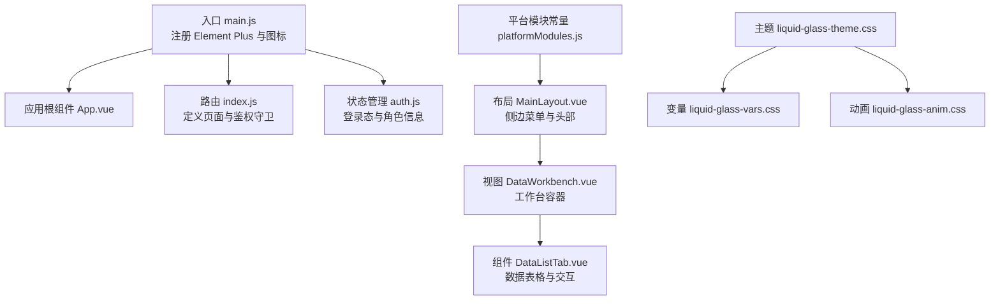
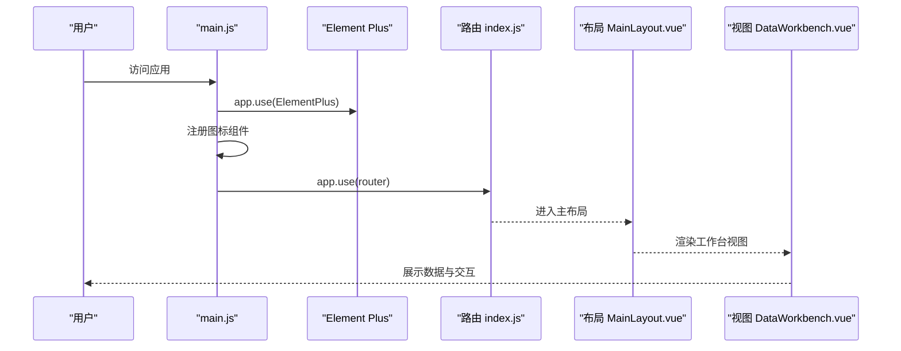
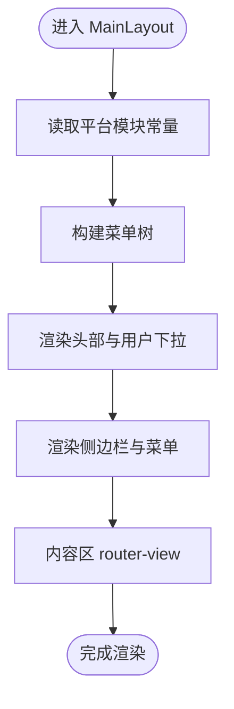
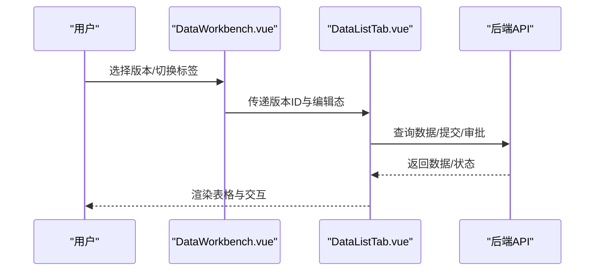
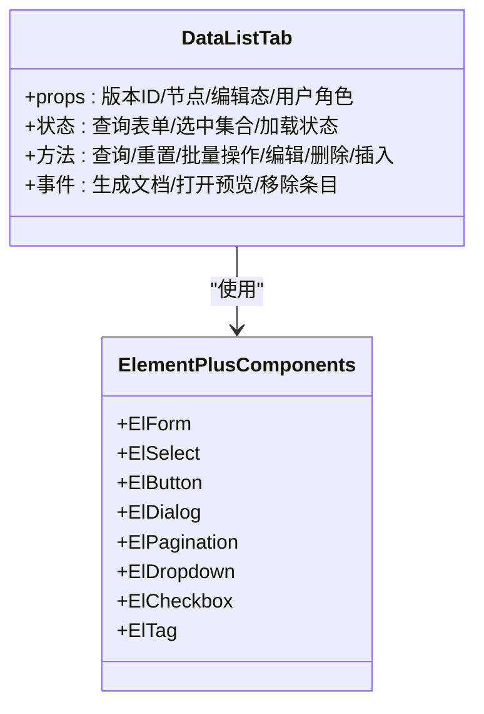
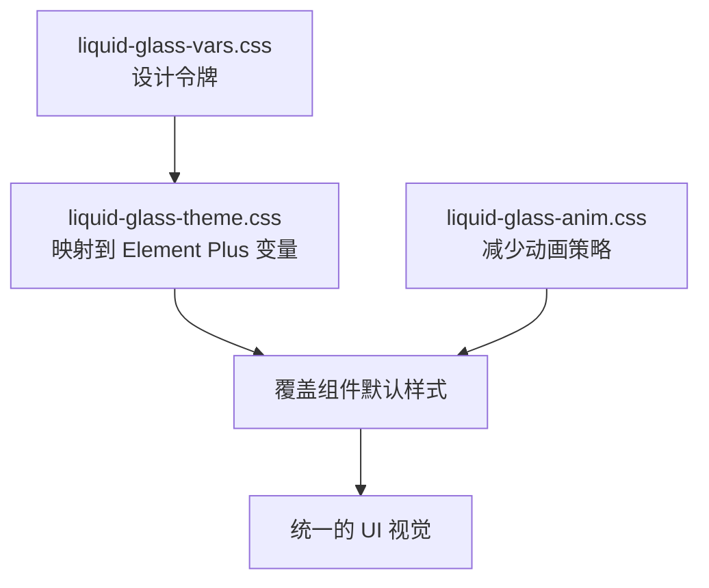
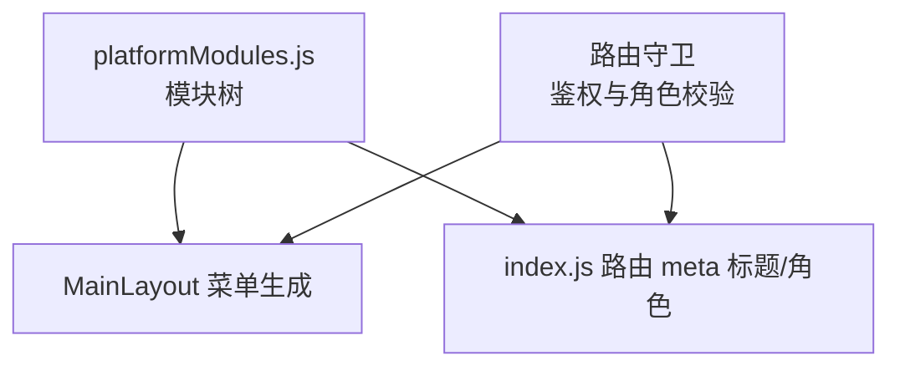
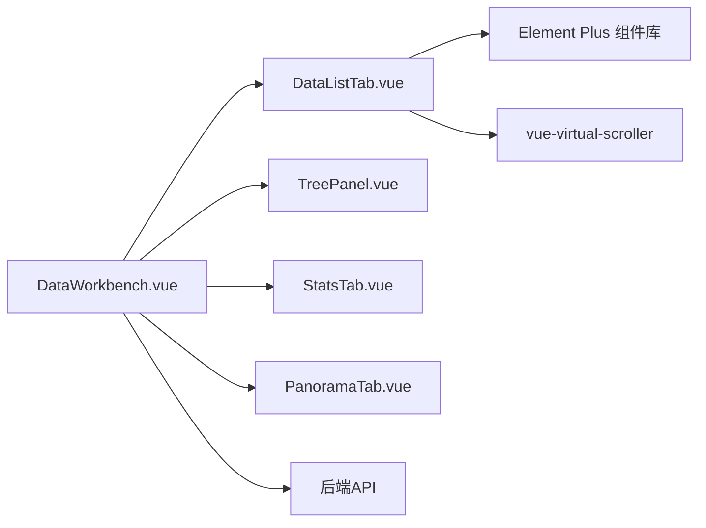

# UI框架集成

<cite>
**本文引用的文件**
- [package.json](file://frontend/package.json)
- [vite.config.js](file://frontend/vite.config.js)
- [main.js](file://frontend/src/main.js)
- [App.vue](file://frontend/src/App.vue)
- [platformModules.js](file://frontend/src/constants/platformModules.js)
- [liquid-glass-theme.css](file://frontend/src/styles/liquid-glass-theme.css)
- [liquid-glass-vars.css](file://frontend/src/styles/liquid-glass-vars.css)
- [liquid-glass-anim.css](file://frontend/src/styles/liquid-glass-anim.css)
- [DataListTab.vue](file://frontend/src/components/DataListTab.vue)
- [MainLayout.vue](file://frontend/src/layout/MainLayout.vue)
- [DataWorkbench.vue](file://frontend/src/views/dashboard/DataWorkbench.vue)
- [index.js](file://frontend/src/router/index.js)
- [auth.js](file://frontend/src/store/auth.js)
</cite>

## 目录
1. [简介](#简介)
2. [项目结构](#项目结构)
3. [核心组件](#核心组件)
4. [架构总览](#架构总览)
5. [详细组件分析](#详细组件分析)
6. [依赖关系分析](#依赖关系分析)
7. [性能考量](#性能考量)
8. [故障排查指南](#故障排查指南)
9. [结论](#结论)
10. [附录](#附录)

## 简介
本文件面向UI框架集成与前端工程化落地，围绕Element Plus组件库在本项目中的使用方式、主题定制与样式覆盖策略进行系统性梳理；深入解析Liquid Glass主题的设计理念、CSS变量体系与动画策略；说明平台模块常量的定义与使用、组件库的按需引入与性能优化路径；并给出UI组件自定义样式、主题切换机制与响应式设计实践，以及UI开发最佳实践与设计系统规范建议。

## 项目结构
前端采用Vue 3 + Vite + Element Plus + Pinia + Vue Router的现代栈。入口在main.js中注册Element Plus与全局样式，并挂载应用；页面布局由MainLayout统一承载，业务视图以路由分发；主题系统通过Liquid Glass主题CSS文件与CSS变量实现统一风格与可扩展性。

**图表来源**
- [main.js:1-20](file://frontend/src/main.js#L1-L20)
- [App.vue:1-22](file://frontend/src/App.vue#L1-L22)
- [index.js:1-129](file://frontend/src/router/index.js#L1-L129)
- [auth.js:1-46](file://frontend/src/store/auth.js#L1-L46)
- [MainLayout.vue:1-423](file://frontend/src/layout/MainLayout.vue#L1-L423)
- [DataWorkbench.vue:1-800](file://frontend/src/views/dashboard/DataWorkbench.vue#L1-L800)
- [DataListTab.vue:1-800](file://frontend/src/components/DataListTab.vue#L1-L800)
- [liquid-glass-theme.css:1-236](file://frontend/src/styles/liquid-glass-theme.css#L1-L236)
- [liquid-glass-vars.css:1-48](file://frontend/src/styles/liquid-glass-vars.css#L1-L48)
- [liquid-glass-anim.css:1-5](file://frontend/src/styles/liquid-glass-anim.css#L1-L5)
- [platformModules.js:1-29](file://frontend/src/constants/platformModules.js#L1-L29)

**章节来源**
- [main.js:1-20](file://frontend/src/main.js#L1-L20)
- [vite.config.js:1-20](file://frontend/vite.config.js#L1-L20)
- [App.vue:1-22](file://frontend/src/App.vue#L1-L22)
- [index.js:1-129](file://frontend/src/router/index.js#L1-L129)
- [auth.js:1-46](file://frontend/src/store/auth.js#L1-L46)

## 核心组件
- Element Plus集成与按需引入
  - 在入口main.js中一次性引入Element Plus与全局样式，并通过循环注册Element Plus图标组件，便于模板中直接使用图标。
  - 项目未使用按需导入插件，而是整体引入Element Plus样式，简化构建配置，适合中大型项目快速落地。
- 主题系统
  - 通过liquid-glass-theme.css集中覆盖Element Plus默认变量，映射到liquid-glass-vars.css中的设计令牌，形成统一的视觉语言。
  - 动画策略遵循“减少动画”原则，在prefers-reduced-motion媒体查询下降低过渡时长，提升可访问性。
- 平台模块常量
  - platformModules.js定义了平台模块树形结构，用于侧边菜单与权限控制，支撑多层级导航与动态路由生成。

**章节来源**
- [main.js:1-20](file://frontend/src/main.js#L1-L20)
- [liquid-glass-theme.css:1-236](file://frontend/src/styles/liquid-glass-theme.css#L1-L236)
- [liquid-glass-vars.css:1-48](file://frontend/src/styles/liquid-glass-vars.css#L1-L48)
- [liquid-glass-anim.css:1-5](file://frontend/src/styles/liquid-glass-anim.css#L1-L5)
- [platformModules.js:1-29](file://frontend/src/constants/platformModules.js#L1-L29)

## 架构总览
从入口到页面渲染的关键流程如下：

**图表来源**
- [main.js:1-20](file://frontend/src/main.js#L1-L20)
- [index.js:1-129](file://frontend/src/router/index.js#L1-L129)
- [MainLayout.vue:1-423](file://frontend/src/layout/MainLayout.vue#L1-L423)
- [DataWorkbench.vue:1-800](file://frontend/src/views/dashboard/DataWorkbench.vue#L1-L800)

## 详细组件分析

### 布局与导航组件（MainLayout）
- 职责
  - 提供统一侧边栏、顶部导航与内容区布局。
  - 使用Element Plus的菜单组件，结合平台模块常量生成菜单项，支持折叠与路由跳转。
- 设计要点
  - 通过CSS变量控制背景、文字与边框颜色，确保与主题一致。
  - 头部右侧提供用户下拉菜单，支持修改昵称与密码、退出登录等操作。
- 交互细节
  - 侧边栏折叠逻辑与菜单项高亮联动，保持用户体验一致性。

**图表来源**
- [MainLayout.vue:1-423](file://frontend/src/layout/MainLayout.vue#L1-L423)
- [platformModules.js:1-29](file://frontend/src/constants/platformModules.js#L1-L29)

**章节来源**
- [MainLayout.vue:1-423](file://frontend/src/layout/MainLayout.vue#L1-L423)
- [platformModules.js:1-29](file://frontend/src/constants/platformModules.js#L1-L29)

### 工作台视图（DataWorkbench）
- 职责
  - 承载版本选择、标签页切换、树形导航与数据清单展示。
  - 支持自定义清单、文档生成、预览与审批流程联动。
- 关键流程
  - 版本选择后加载自定义清单，根据激活标签页动态渲染对应DataListTab实例。
  - 文档生成采用轮询进度，结合消息提示与分页展示生成记录。

**图表来源**
- [DataWorkbench.vue:1-800](file://frontend/src/views/dashboard/DataWorkbench.vue#L1-L800)
- [DataListTab.vue:1-800](file://frontend/src/components/DataListTab.vue#L1-L800)

**章节来源**
- [DataWorkbench.vue:1-800](file://frontend/src/views/dashboard/DataWorkbench.vue#L1-L800)
- [DataListTab.vue:1-800](file://frontend/src/components/DataListTab.vue#L1-L800)

### 数据清单组件（DataListTab）
- 职责
  - 提供查询表单、批量操作、虚拟滚动表格、上下文菜单与对话框等完整数据管理能力。
- 主要特性
  - 使用RecycleScroller实现大数据量虚拟滚动，提升渲染性能。
  - 集成Element Plus大量表单控件（表单、选择器、按钮、标签、对话框、分页、下拉菜单等），统一风格与交互。
  - 支持树形展开/折叠、全选/反选、批量审批、版本划分、图片插入与预览等复杂交互。

**图表来源**
- [DataListTab.vue:1-800](file://frontend/src/components/DataListTab.vue#L1-L800)

**章节来源**
- [DataListTab.vue:1-800](file://frontend/src/components/DataListTab.vue#L1-L800)

### 主题系统与样式覆盖（Liquid Glass）
- 设计理念
  - 以“玻璃拟态”为核心风格，强调卡片化、柔和阴影与低对比度色彩，提升信息密度与可读性。
- CSS变量系统
  - liquid-glass-vars.css定义设计令牌（背景、边框、文本、阴影、圆角、字体、过渡等），liquid-glass-theme.css将这些令牌映射到Element Plus的CSS变量，实现全局覆盖。
- 动画策略
  - liquid-glass-anim.css在减少动画模式下降低过渡时长，兼顾可访问性与性能。
- 样式覆盖实践
  - 对常用组件（按钮、输入框、对话框、表格、标签、分页、下拉菜单等）进行细粒度覆盖，确保视觉一致性与品牌调性。

**图表来源**
- [liquid-glass-vars.css:1-48](file://frontend/src/styles/liquid-glass-vars.css#L1-L48)
- [liquid-glass-theme.css:1-236](file://frontend/src/styles/liquid-glass-theme.css#L1-L236)
- [liquid-glass-anim.css:1-5](file://frontend/src/styles/liquid-glass-anim.css#L1-L5)

**章节来源**
- [liquid-glass-vars.css:1-48](file://frontend/src/styles/liquid-glass-vars.css#L1-L48)
- [liquid-glass-theme.css:1-236](file://frontend/src/styles/liquid-glass-theme.css#L1-L236)
- [liquid-glass-anim.css:1-5](file://frontend/src/styles/liquid-glass-anim.css#L1-L5)

### 平台模块常量与路由集成
- 平台模块常量platformModules.js提供模块树，用于：
  - 侧边菜单的动态生成与权限控制。
  - 路由meta信息的标题与角色校验。
- 路由守卫
  - 未登录跳转登录页；带角色限制的路由需匹配角色码，否则回退至工作台。

**图表来源**
- [platformModules.js:1-29](file://frontend/src/constants/platformModules.js#L1-L29)
- [index.js:1-129](file://frontend/src/router/index.js#L1-L129)
- [MainLayout.vue:1-423](file://frontend/src/layout/MainLayout.vue#L1-L423)

**章节来源**
- [platformModules.js:1-29](file://frontend/src/constants/platformModules.js#L1-L29)
- [index.js:1-129](file://frontend/src/router/index.js#L1-L129)
- [MainLayout.vue:1-423](file://frontend/src/layout/MainLayout.vue#L1-L423)

## 依赖关系分析
- 组件耦合
  - DataWorkbench作为容器，聚合多个子组件（TreePanel、StatsTab、DataListTab、PanoramaTab），通过标签页与属性传递实现解耦。
  - DataListTab内部高度复用Element Plus组件，通过事件与属性与父组件通信。
- 外部依赖
  - Element Plus提供UI基础能力；vue-virtual-scroller用于高性能虚拟列表；Pinia提供状态管理；Vue Router负责页面导航。
- 潜在风险
  - 当前未启用按需导入，整体引入Element Plus样式会增加首屏体积；建议在后续阶段引入按需导入以进一步优化。

**图表来源**
- [DataWorkbench.vue:1-800](file://frontend/src/views/dashboard/DataWorkbench.vue#L1-L800)
- [DataListTab.vue:1-800](file://frontend/src/components/DataListTab.vue#L1-L800)

**章节来源**
- [DataWorkbench.vue:1-800](file://frontend/src/views/dashboard/DataWorkbench.vue#L1-L800)
- [DataListTab.vue:1-800](file://frontend/src/components/DataListTab.vue#L1-L800)

## 性能考量
- 虚拟滚动
  - DataListTab使用RecycleScroller对表格进行虚拟滚动，显著降低DOM节点数量，提升大数据场景下的渲染性能。
- 样式体积
  - 当前整体引入Element Plus样式，建议在后续阶段引入按需导入插件，仅打包使用到的组件样式，减少首屏体积。
- 动画与可访问性
  - 减少动画策略已在CSS层面实现，避免不必要的重绘与回流，同时提升可访问性体验。
- 构建与代理
  - Vite配置了本地开发代理，便于前后端联调；生产构建可结合CDN与缓存策略进一步优化加载速度。

**章节来源**
- [DataListTab.vue:1-800](file://frontend/src/components/DataListTab.vue#L1-L800)
- [vite.config.js:1-20](file://frontend/vite.config.js#L1-L20)
- [liquid-glass-anim.css:1-5](file://frontend/src/styles/liquid-glass-anim.css#L1-L5)

## 故障排查指南
- 登录态与路由守卫
  - 若出现无法进入受保护页面，检查localStorage中的token与roleCode是否正确；路由守卫会拦截未登录或角色不符的请求。
- 图标未显示
  - 确认main.js中是否正确注册Element Plus图标组件；模板中使用图标组件时需确保组件名与注册一致。
- 表格性能问题
  - 大数据量场景下优先使用虚拟滚动；避免在渲染函数中执行重型计算；合理拆分组件与懒加载。
- 主题不生效
  - 确认liquid-glass-theme.css已正确引入且优先级高于Element Plus默认样式；检查CSS变量拼写与作用域。
- 文档生成卡顿或超时
  - 查看DataWorkbench中的轮询逻辑与进度提示；若长时间停留在100%，检查后端任务状态与超时阈值。

**章节来源**
- [index.js:1-129](file://frontend/src/router/index.js#L1-L129)
- [main.js:1-20](file://frontend/src/main.js#L1-L20)
- [DataWorkbench.vue:1-800](file://frontend/src/views/dashboard/DataWorkbench.vue#L1-L800)
- [liquid-glass-theme.css:1-236](file://frontend/src/styles/liquid-glass-theme.css#L1-L236)

## 结论
本项目以Element Plus为基础，结合Liquid Glass主题系统实现了统一、可扩展的UI风格；通过平台模块常量与路由守卫保障导航与权限的一致性；借助虚拟滚动与动画策略在性能与体验之间取得平衡。建议在后续迭代中引入按需导入与更细粒度的主题变量拆分，持续优化首屏体积与主题可维护性。

## 附录
- 最佳实践清单
  - 统一使用CSS变量与主题文件，避免内联样式的散落。
  - 对高频交互组件（表格、表单、弹窗）进行封装，统一行为与样式。
  - 为复杂组件提供明确的属性与事件契约，降低耦合度。
  - 在开发阶段开启严格模式与类型检查，提升代码质量。
- 设计系统规范建议
  - 将设计令牌（色板、字号、间距、圆角、阴影、动效）沉淀为共享规范文档，约束团队协作。
  - 为常用组件提供“默认态/悬停态/禁用态”的视觉规范与交互反馈。
  - 建立主题切换（明/暗）的变量映射方案，预留扩展空间。