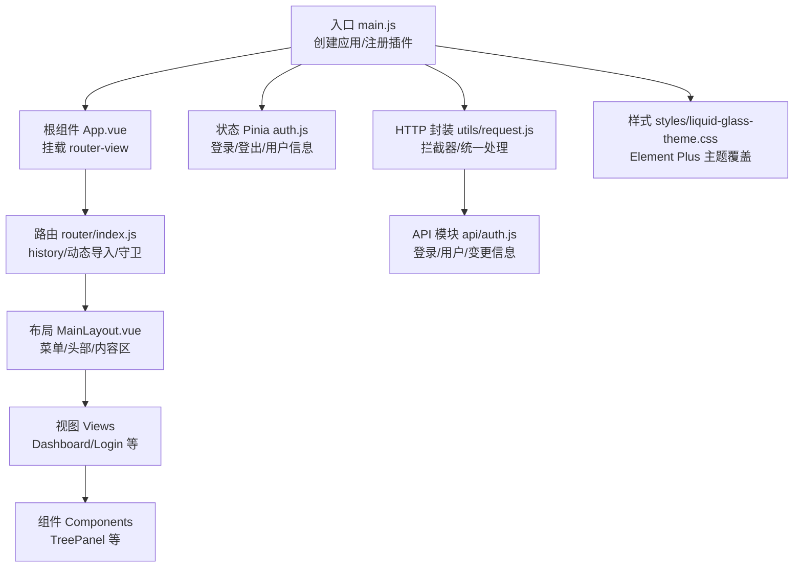
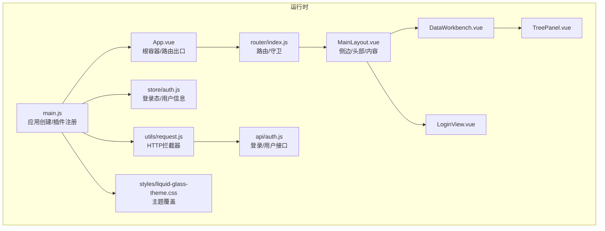
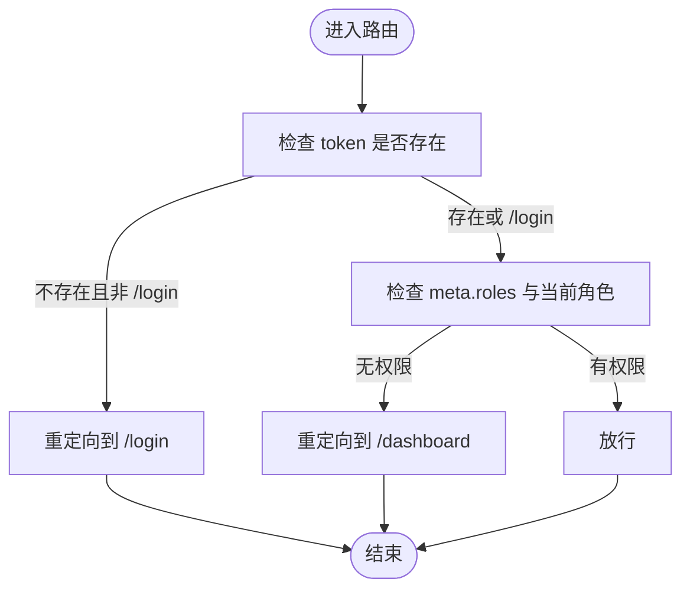
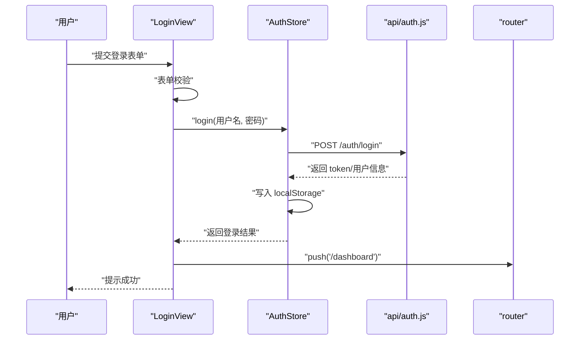
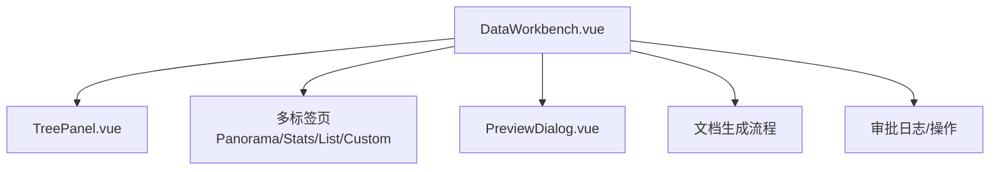
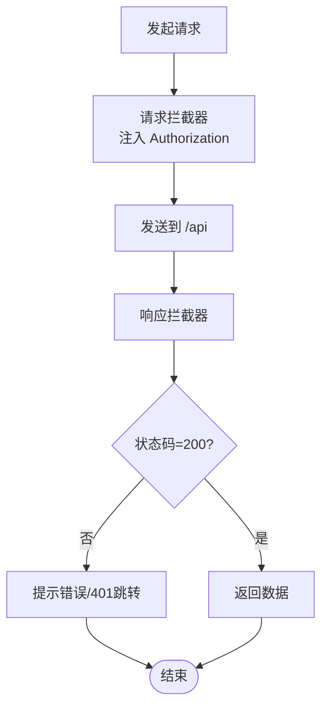
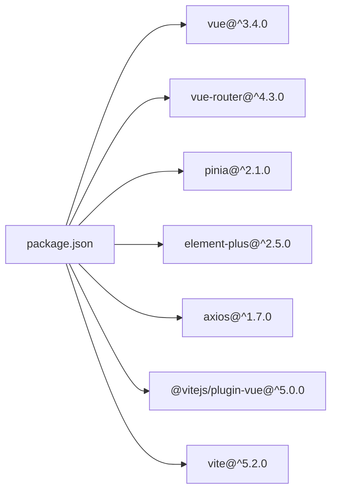

# Vue应用结构

<cite>
**本文引用的文件**
- [frontend/src/main.js](file://frontend/src/main.js)
- [frontend/src/App.vue](file://frontend/src/App.vue)
- [frontend/vite.config.js](file://frontend/vite.config.js)
- [frontend/package.json](file://frontend/package.json)
- [frontend/src/router/index.js](file://frontend/src/router/index.js)
- [frontend/src/layout/MainLayout.vue](file://frontend/src/layout/MainLayout.vue)
- [frontend/src/store/auth.js](file://frontend/src/store/auth.js)
- [frontend/src/views/login/LoginView.vue](file://frontend/src/views/login/LoginView.vue)
- [frontend/src/views/dashboard/DataWorkbench.vue](file://frontend/src/views/dashboard/DataWorkbench.vue)
- [frontend/src/components/TreePanel.vue](file://frontend/src/components/TreePanel.vue)
- [frontend/src/api/auth.js](file://frontend/src/api/auth.js)
- [frontend/src/utils/request.js](file://frontend/src/utils/request.js)
- [frontend/src/constants/platformModules.js](file://frontend/src/constants/platformModules.js)
- [frontend/src/styles/liquid-glass-theme.css](file://frontend/src/styles/liquid-glass-theme.css)
</cite>

## 目录
1. [引言](#引言)
2. [项目结构](#项目结构)
3. [核心组件](#核心组件)
4. [架构总览](#架构总览)
5. [组件详解](#组件详解)
6. [依赖关系分析](#依赖关系分析)
7. [性能与优化](#性能与优化)
8. [故障排查指南](#故障排查指南)
9. [结论](#结论)
10. [附录](#附录)

## 引言
本文件面向Vue 3前端应用，围绕应用入口配置、根组件设计、路由配置与鉴权、Vite构建与开发服务器、插件与全局配置、组件树结构与生命周期、以及性能优化策略进行系统化技术文档整理。文档同时提供基于仓库源码的可视化图示与最佳实践建议，帮助开发者快速理解并高效扩展整体架构。

## 项目结构
前端采用典型的单页应用（SPA）组织方式：入口文件负责应用实例创建与插件注册；路由模块统一管理页面路径与权限守卫；布局组件承载侧边菜单与主内容区；Pinia状态管理用于登录态与用户信息；Element Plus提供UI能力与主题覆盖；Vite作为构建与开发工具链。

图表来源
- [frontend/src/main.js:1-20](file://frontend/src/main.js#L1-L20)
- [frontend/src/App.vue:1-22](file://frontend/src/App.vue#L1-L22)
- [frontend/src/router/index.js:1-129](file://frontend/src/router/index.js#L1-L129)
- [frontend/src/layout/MainLayout.vue:1-423](file://frontend/src/layout/MainLayout.vue#L1-L423)
- [frontend/src/store/auth.js:1-46](file://frontend/src/store/auth.js#L1-L46)
- [frontend/src/utils/request.js:1-65](file://frontend/src/utils/request.js#L1-L65)
- [frontend/src/api/auth.js:1-22](file://frontend/src/api/auth.js#L1-L22)
- [frontend/src/styles/liquid-glass-theme.css:1-236](file://frontend/src/styles/liquid-glass-theme.css#L1-L236)

章节来源
- [frontend/src/main.js:1-20](file://frontend/src/main.js#L1-L20)
- [frontend/src/App.vue:1-22](file://frontend/src/App.vue#L1-L22)
- [frontend/src/router/index.js:1-129](file://frontend/src/router/index.js#L1-L129)

## 核心组件
- 应用入口与插件注册
  - 创建Vue应用实例，按序注册Element Plus、路由、状态管理与图标组件，最后挂载到DOM。
  - 参考路径：[frontend/src/main.js:1-20](file://frontend/src/main.js#L1-L20)
- 根组件
  - 提供顶层容器与router-view占位，内联基础样式提升渲染性能。
  - 参考路径：[frontend/src/App.vue:1-22](file://frontend/src/App.vue#L1-L22)
- 路由系统
  - 基于history模式，使用动态导入实现懒加载；在全局前置守卫中校验token与角色权限。
  - 参考路径：[frontend/src/router/index.js:1-129](file://frontend/src/router/index.js#L1-L129)
- 布局组件
  - 左侧菜单（含折叠）、顶部标题与用户下拉、内容区嵌套router-view；提供快速需求表单弹窗与密码/昵称修改对话框。
  - 参考路径：[frontend/src/layout/MainLayout.vue:1-423](file://frontend/src/layout/MainLayout.vue#L1-L423)
- 鉴权与状态
  - 使用Pinia定义认证store，封装登录、获取当前用户、登出与管理员判断；持久化存储token与用户信息。
  - 参考路径：[frontend/src/store/auth.js:1-46](file://frontend/src/store/auth.js#L1-L46)
- 登录视图
  - 表单校验、登录/注册流程、版本号展示；调用auth API并跳转至仪表盘。
  - 参考路径：[frontend/src/views/login/LoginView.vue:1-209](file://frontend/src/views/login/LoginView.vue#L1-L209)
- 数据工作台
  - 版本选择、多标签清单、树形导航联动、预览与审批流程、文档生成与进度轮询等。
  - 参考路径：[frontend/src/views/dashboard/DataWorkbench.vue:1-1144](file://frontend/src/views/dashboard/DataWorkbench.vue#L1-L1144)
- 树形面板
  - 分类树懒加载、过滤、高亮同步与节点点击事件向上抛出。
  - 参考路径：[frontend/src/components/TreePanel.vue:1-200](file://frontend/src/components/TreePanel.vue#L1-L200)
- HTTP封装
  - Axios实例配置baseURL、超时、序列化参数；请求头注入Authorization；响应拦截统一错误处理与401跳转。
  - 参考路径：[frontend/src/utils/request.js:1-65](file://frontend/src/utils/request.js#L1-L65)
- API模块
  - 对auth相关接口进行薄封装，便于统一调用。
  - 参考路径：[frontend/src/api/auth.js:1-22](file://frontend/src/api/auth.js#L1-L22)
- 主题样式
  - Element Plus变量映射与组件样式覆盖，统一视觉风格。
  - 参考路径：[frontend/src/styles/liquid-glass-theme.css:1-236](file://frontend/src/styles/liquid-glass-theme.css#L1-L236)

章节来源
- [frontend/src/main.js:1-20](file://frontend/src/main.js#L1-L20)
- [frontend/src/App.vue:1-22](file://frontend/src/App.vue#L1-L22)
- [frontend/src/router/index.js:1-129](file://frontend/src/router/index.js#L1-L129)
- [frontend/src/layout/MainLayout.vue:1-423](file://frontend/src/layout/MainLayout.vue#L1-L423)
- [frontend/src/store/auth.js:1-46](file://frontend/src/store/auth.js#L1-L46)
- [frontend/src/views/login/LoginView.vue:1-209](file://frontend/src/views/login/LoginView.vue#L1-L209)
- [frontend/src/views/dashboard/DataWorkbench.vue:1-1144](file://frontend/src/views/dashboard/DataWorkbench.vue#L1-L1144)
- [frontend/src/components/TreePanel.vue:1-200](file://frontend/src/components/TreePanel.vue#L1-L200)
- [frontend/src/utils/request.js:1-65](file://frontend/src/utils/request.js#L1-L65)
- [frontend/src/api/auth.js:1-22](file://frontend/src/api/auth.js#L1-L22)
- [frontend/src/styles/liquid-glass-theme.css:1-236](file://frontend/src/styles/liquid-glass-theme.css#L1-L236)

## 架构总览
应用采用“入口 -> 根组件 -> 路由 -> 布局/视图 -> 组件”的分层结构，配合Pinia进行跨组件状态共享，Axios统一处理HTTP请求与错误，Element Plus提供UI与主题体系。

图表来源
- [frontend/src/main.js:1-20](file://frontend/src/main.js#L1-L20)
- [frontend/src/App.vue:1-22](file://frontend/src/App.vue#L1-L22)
- [frontend/src/router/index.js:1-129](file://frontend/src/router/index.js#L1-L129)
- [frontend/src/layout/MainLayout.vue:1-423](file://frontend/src/layout/MainLayout.vue#L1-L423)
- [frontend/src/views/login/LoginView.vue:1-209](file://frontend/src/views/login/LoginView.vue#L1-L209)
- [frontend/src/views/dashboard/DataWorkbench.vue:1-1144](file://frontend/src/views/dashboard/DataWorkbench.vue#L1-L1144)
- [frontend/src/components/TreePanel.vue:1-200](file://frontend/src/components/TreePanel.vue#L1-L200)
- [frontend/src/store/auth.js:1-46](file://frontend/src/store/auth.js#L1-L46)
- [frontend/src/utils/request.js:1-65](file://frontend/src/utils/request.js#L1-L65)
- [frontend/src/api/auth.js:1-22](file://frontend/src/api/auth.js#L1-L22)
- [frontend/src/styles/liquid-glass-theme.css:1-236](file://frontend/src/styles/liquid-glass-theme.css#L1-L236)

## 组件详解

### 应用初始化与插件注册
- 初始化流程
  - 创建应用实例，安装Element Plus、路由、Pinia。
  - 批量注册Element Plus图标组件，避免逐个引入。
  - 挂载到#app。
- 关键点
  - 插件顺序影响全局行为，建议保持现有顺序。
  - 图标批量注册提升开发效率与一致性。
- 参考路径
  - [frontend/src/main.js:1-20](file://frontend/src/main.js#L1-L20)

章节来源
- [frontend/src/main.js:1-20](file://frontend/src/main.js#L1-L20)

### 根组件与视图容器
- 设计要点
  - 根组件仅保留router-view，降低复杂度，便于路由切换。
  - 内联基础样式减少首屏抖动与重绘。
- 参考路径
  - [frontend/src/App.vue:1-22](file://frontend/src/App.vue#L1-L22)

章节来源
- [frontend/src/App.vue:1-22](file://frontend/src/App.vue#L1-L22)

### 路由配置与权限守卫
- 路由结构
  - 登录页与主布局嵌套路由，子路由覆盖仪表盘、需求管理、系统管理、图床管理等。
  - 子路由meta字段用于标题与角色控制。
- 权限守卫
  - 读取localStorage中的token与角色，未登录或越权则重定向至登录或仪表盘。
- 参考路径
  - [frontend/src/router/index.js:1-129](file://frontend/src/router/index.js#L1-L129)

图表来源
- [frontend/src/router/index.js:111-126](file://frontend/src/router/index.js#L111-L126)

章节来源
- [frontend/src/router/index.js:1-129](file://frontend/src/router/index.js#L1-L129)

### 布局组件与交互
- 功能概览
  - 侧边菜单支持折叠与router集成；顶部显示当前页面标题与用户操作。
  - 提供快速需求表单弹窗与密码/昵称修改对话框。
- 生命周期与状态
  - 使用组合式API管理本地状态与计算属性，通过provide/inject传递刷新键。
- 参考路径
  - [frontend/src/layout/MainLayout.vue:1-423](file://frontend/src/layout/MainLayout.vue#L1-L423)

章节来源
- [frontend/src/layout/MainLayout.vue:1-423](file://frontend/src/layout/MainLayout.vue#L1-L423)

### 登录视图与鉴权流程
- 流程说明
  - 输入校验 -> 调用登录接口 -> 成功后写入localStorage -> 跳转仪表盘。
  - 注册流程与版本号获取。
- 错误处理
  - 表单校验失败直接返回；接口异常统一提示。
- 参考路径
  - [frontend/src/views/login/LoginView.vue:1-209](file://frontend/src/views/login/LoginView.vue#L1-L209)
  - [frontend/src/store/auth.js:1-46](file://frontend/src/store/auth.js#L1-L46)
  - [frontend/src/api/auth.js:1-22](file://frontend/src/api/auth.js#L1-L22)

图表来源
- [frontend/src/views/login/LoginView.vue:88-100](file://frontend/src/views/login/LoginView.vue#L88-L100)
- [frontend/src/store/auth.js:9-18](file://frontend/src/store/auth.js#L9-L18)
- [frontend/src/api/auth.js:3-5](file://frontend/src/api/auth.js#L3-L5)
- [frontend/src/router/index.js:106-109](file://frontend/src/router/index.js#L106-L109)

章节来源
- [frontend/src/views/login/LoginView.vue:1-209](file://frontend/src/views/login/LoginView.vue#L1-L209)
- [frontend/src/store/auth.js:1-46](file://frontend/src/store/auth.js#L1-L46)
- [frontend/src/api/auth.js:1-22](file://frontend/src/api/auth.js#L1-L22)

### 数据工作台与组件树
- 结构组成
  - 版本选择 -> 多标签页（全景图/统计/数据清单/自定义清单） -> 树形导航联动 -> 预览与审批 -> 文档生成。
- 关键交互
  - 树形面板高亮同步、标签页切换触发刷新、全局预览消息处理、文档生成进度轮询。
- 参考路径
  - [frontend/src/views/dashboard/DataWorkbench.vue:1-1144](file://frontend/src/views/dashboard/DataWorkbench.vue#L1-L1144)
  - [frontend/src/components/TreePanel.vue:1-200](file://frontend/src/components/TreePanel.vue#L1-L200)

图表来源
- [frontend/src/views/dashboard/DataWorkbench.vue:1-1144](file://frontend/src/views/dashboard/DataWorkbench.vue#L1-L1144)
- [frontend/src/components/TreePanel.vue:1-200](file://frontend/src/components/TreePanel.vue#L1-L200)

章节来源
- [frontend/src/views/dashboard/DataWorkbench.vue:1-1144](file://frontend/src/views/dashboard/DataWorkbench.vue#L1-L1144)
- [frontend/src/components/TreePanel.vue:1-200](file://frontend/src/components/TreePanel.vue#L1-L200)

### HTTP封装与错误处理
- 配置要点
  - baseURL指向/api，统一超时与参数序列化。
  - 请求拦截器自动附加Authorization头。
  - 响应拦截器统一处理业务错误与401/403跳转。
- 参考路径
  - [frontend/src/utils/request.js:1-65](file://frontend/src/utils/request.js#L1-L65)

图表来源
- [frontend/src/utils/request.js:24-62](file://frontend/src/utils/request.js#L24-L62)

章节来源
- [frontend/src/utils/request.js:1-65](file://frontend/src/utils/request.js#L1-L65)

### 主题与样式体系
- 主题覆盖
  - 将Element Plus颜色、字体、阴影等变量映射到自定义CSS变量，统一卡片、按钮、表格、菜单等组件样式。
- 参考路径
  - [frontend/src/styles/liquid-glass-theme.css:1-236](file://frontend/src/styles/liquid-glass-theme.css#L1-L236)

章节来源
- [frontend/src/styles/liquid-glass-theme.css:1-236](file://frontend/src/styles/liquid-glass-theme.css#L1-L236)

## 依赖关系分析
- 模块耦合
  - main.js集中注册插件，降低各模块间直接耦合。
  - 路由与布局解耦，通过router-view实现视图切换。
  - API与HTTP封装分离，便于替换与测试。
- 外部依赖
  - Vue 3、Vue Router、Pinia、Element Plus、Axios、Vite。
- 参考路径
  - [frontend/package.json:1-28](file://frontend/package.json#L1-L28)

图表来源
- [frontend/package.json:11-26](file://frontend/package.json#L11-L26)

章节来源
- [frontend/package.json:1-28](file://frontend/package.json#L1-L28)

## 性能与优化
- 渲染优化
  - 根组件内联基础样式，减少首屏闪烁。
  - 利用will-change/transform提升动画性能。
  - 参考路径：[frontend/src/App.vue:10-21](file://frontend/src/App.vue#L10-L21)
- 路由懒加载
  - 路由组件使用动态导入，按需加载，降低首屏包体。
  - 参考路径：[frontend/src/router/index.js:3-104](file://frontend/src/router/index.js#L3-L104)
- 组件懒加载
  - 布局与视图均采用动态导入，结合浏览器缓存提升二次打开速度。
  - 参考路径：[frontend/src/layout/MainLayout.vue:11-120](file://frontend/src/layout/MainLayout.vue#L11-L120)
- 网络优化
  - Axios统一超时与参数序列化，避免无效请求。
  - 参考路径：[frontend/src/utils/request.js:5-22](file://frontend/src/utils/request.js#L5-L22)
- 开发体验
  - Vite目标ES2020，端口5173，代理/api到后端服务。
  - 参考路径：[frontend/vite.config.js:1-20](file://frontend/vite.config.js#L1-L20)

章节来源
- [frontend/src/App.vue:10-21](file://frontend/src/App.vue#L10-L21)
- [frontend/src/router/index.js:3-104](file://frontend/src/router/index.js#L3-L104)
- [frontend/src/layout/MainLayout.vue:11-120](file://frontend/src/layout/MainLayout.vue#L11-L120)
- [frontend/src/utils/request.js:5-22](file://frontend/src/utils/request.js#L5-L22)
- [frontend/vite.config.js:1-20](file://frontend/vite.config.js#L1-L20)

## 故障排查指南
- 登录后被重定向到登录页
  - 检查localStorage中token是否存在；确认后端是否正确颁发token。
  - 参考路径：[frontend/src/router/index.js:111-126](file://frontend/src/router/index.js#L111-L126)
- 401/403错误频繁出现
  - 检查请求拦截器是否正确注入Authorization头；确认响应拦截器对401/403的处理逻辑。
  - 参考路径：[frontend/src/utils/request.js:24-62](file://frontend/src/utils/request.js#L24-L62)
- 文档生成长时间卡住
  - 检查进度轮询定时器与超时阈值；确认后端生成任务状态。
  - 参考路径：[frontend/src/views/dashboard/DataWorkbench.vue:407-448](file://frontend/src/views/dashboard/DataWorkbench.vue#L407-L448)
- 树形导航无法高亮
  - 检查节点映射与高亮键同步逻辑；确认父子节点层级查找。
  - 参考路径：[frontend/src/components/TreePanel.vue:69-81](file://frontend/src/components/TreePanel.vue#L69-L81)

章节来源
- [frontend/src/router/index.js:111-126](file://frontend/src/router/index.js#L111-L126)
- [frontend/src/utils/request.js:24-62](file://frontend/src/utils/request.js#L24-L62)
- [frontend/src/views/dashboard/DataWorkbench.vue:407-448](file://frontend/src/views/dashboard/DataWorkbench.vue#L407-L448)
- [frontend/src/components/TreePanel.vue:69-81](file://frontend/src/components/TreePanel.vue#L69-L81)

## 结论
该Vue 3应用以清晰的分层结构与模块化设计实现了从入口初始化、路由与鉴权、布局与视图、组件与状态、到HTTP与样式的完整闭环。通过动态导入、拦截器与主题覆盖等手段，在保证开发体验的同时兼顾了性能与可维护性。建议后续在路由权限细化、组件拆分与测试覆盖方面持续演进。

## 附录
- 平台模块常量
  - 定义模块与子模块的层级关系，便于菜单生成与权限控制。
  - 参考路径：[frontend/src/constants/platformModules.js:1-29](file://frontend/src/constants/platformModules.js#L1-L29)

章节来源
- [frontend/src/constants/platformModules.js:1-29](file://frontend/src/constants/platformModules.js#L1-L29)