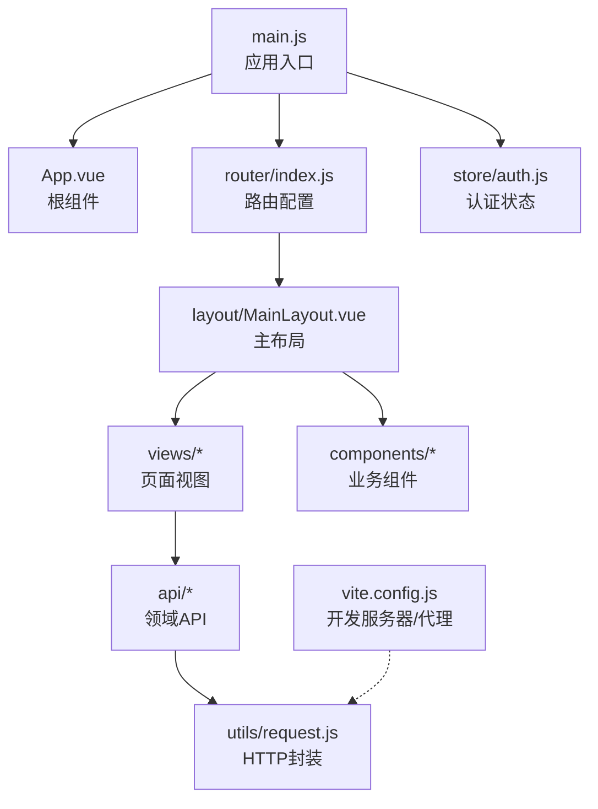
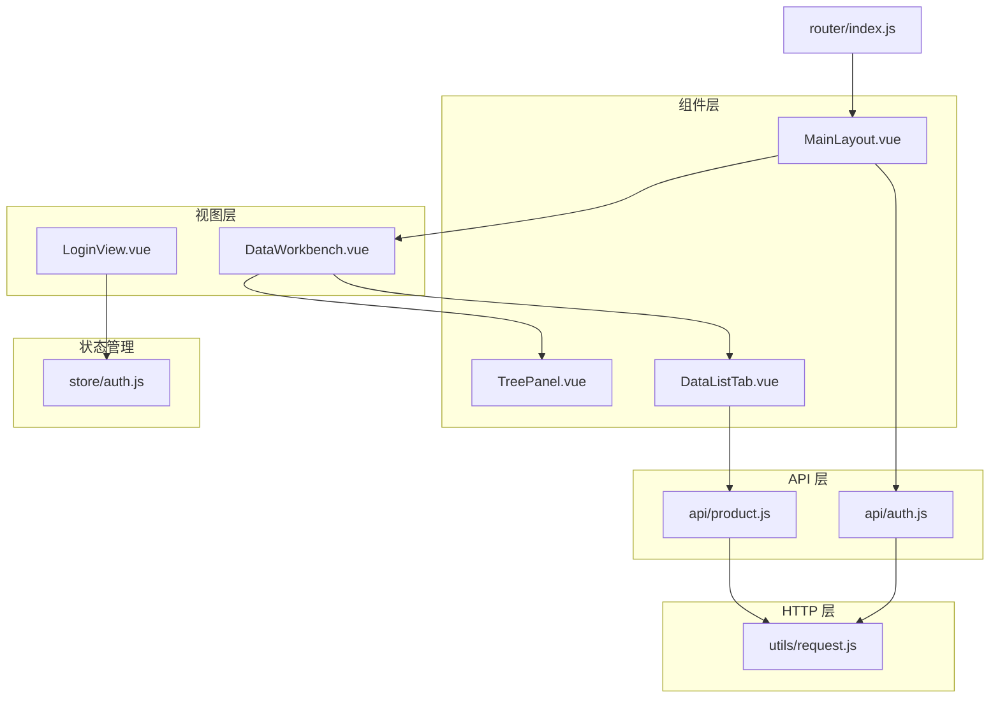
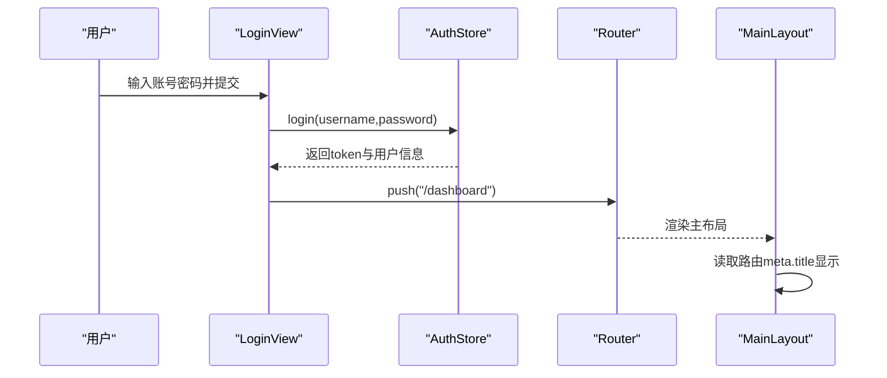
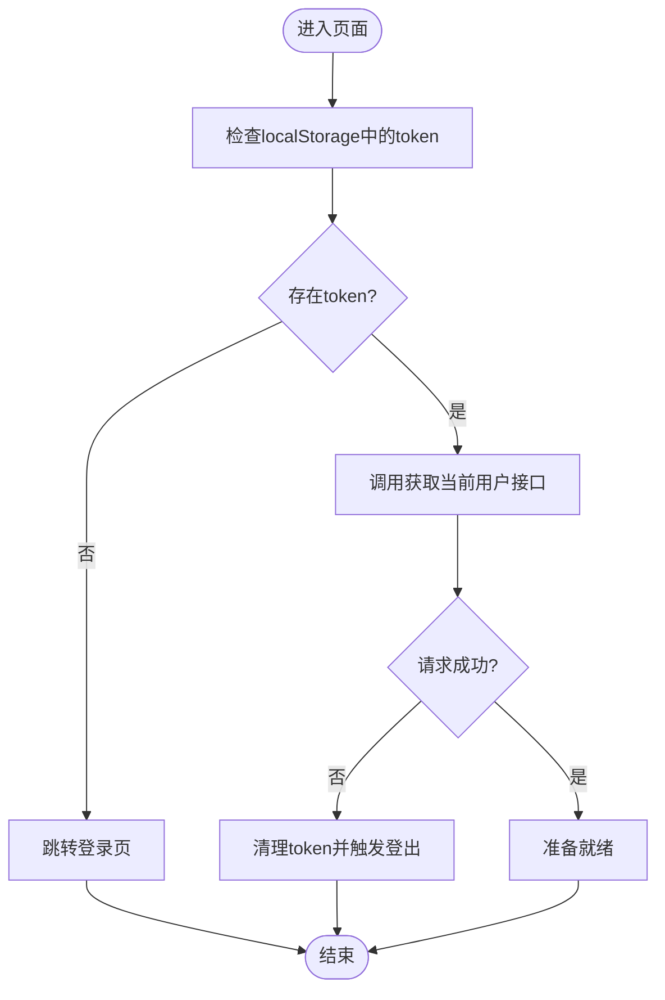
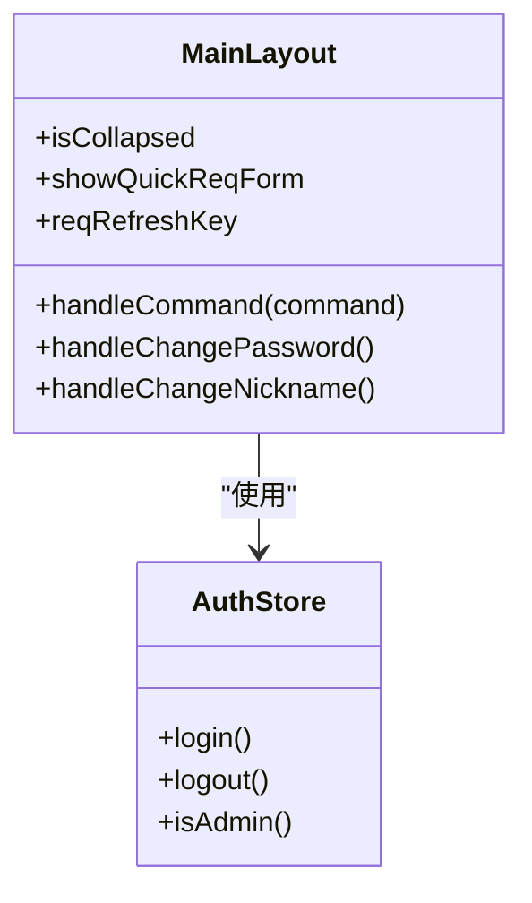
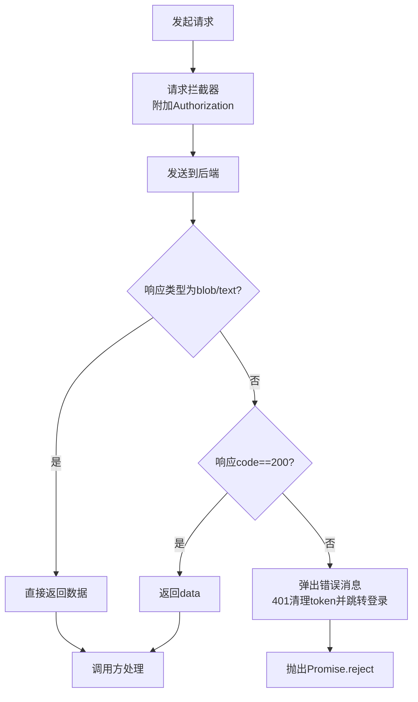
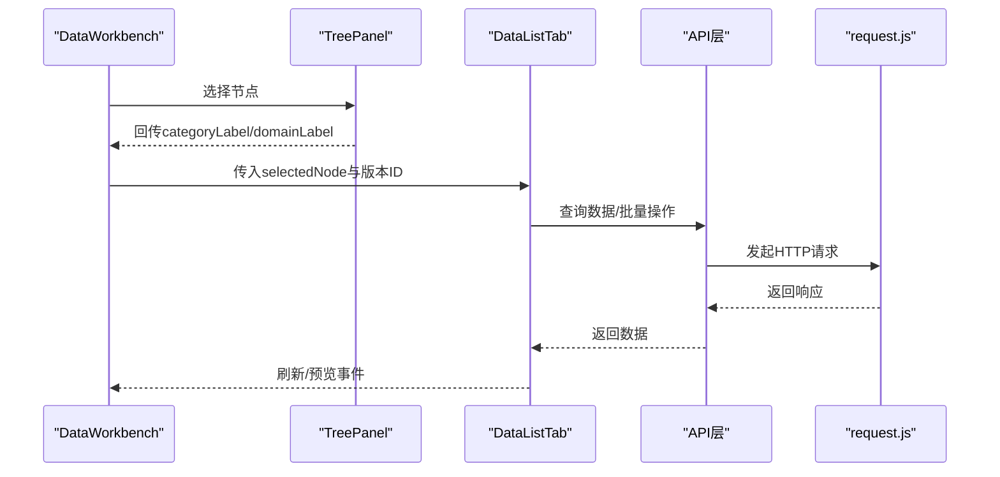
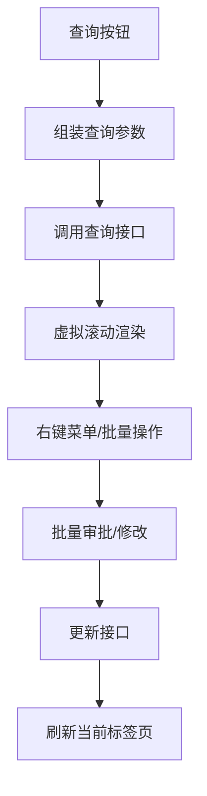
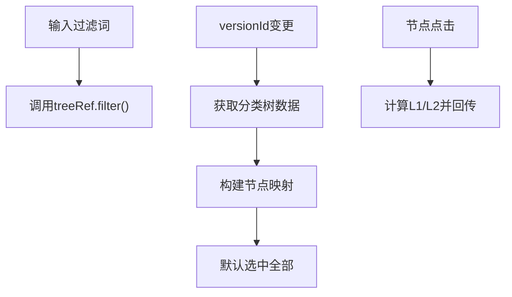
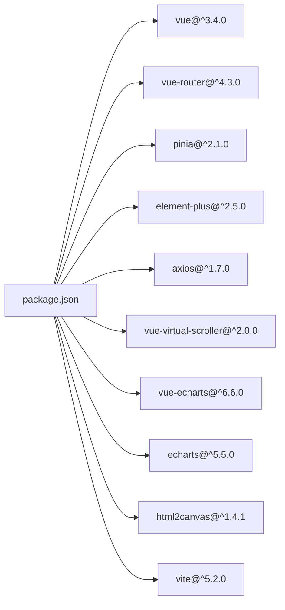

# 前端架构设计

<cite>
**本文档引用的文件**
- [frontend/src/main.js](file://frontend/src/main.js)
- [frontend/src/App.vue](file://frontend/src/App.vue)
- [frontend/src/router/index.js](file://frontend/src/router/index.js)
- [frontend/src/store/auth.js](file://frontend/src/store/auth.js)
- [frontend/package.json](file://frontend/package.json)
- [frontend/src/layout/MainLayout.vue](file://frontend/src/layout/MainLayout.vue)
- [frontend/src/utils/request.js](file://frontend/src/utils/request.js)
- [frontend/src/views/dashboard/DataWorkbench.vue](file://frontend/src/views/dashboard/DataWorkbench.vue)
- [frontend/src/views/login/LoginView.vue](file://frontend/src/views/login/LoginView.vue)
- [frontend/vite.config.js](file://frontend/vite.config.js)
- [frontend/src/components/DataListTab.vue](file://frontend/src/components/DataListTab.vue)
- [frontend/src/components/TreePanel.vue](file://frontend/src/components/TreePanel.vue)
- [frontend/src/api/auth.js](file://frontend/src/api/auth.js)
- [frontend/src/api/product.js](file://frontend/src/api/product.js)
- [frontend/src/constants/platformModules.js](file://frontend/src/constants/platformModules.js)
</cite>

## 目录
1. [引言](#引言)
2. [项目结构](#项目结构)
3. [核心组件](#核心组件)
4. [架构总览](#架构总览)
5. [详细组件分析](#详细组件分析)
6. [依赖关系分析](#依赖关系分析)
7. [性能考虑](#性能考虑)
8. [故障排查指南](#故障排查指南)
9. [结论](#结论)
10. [附录](#附录)

## 引言
本文件面向产品清单管理系统前端团队，系统性梳理基于 Vue 3 的前端架构设计与实现细节，覆盖组件化开发模式、路由配置与鉴权、状态管理、Element Plus UI 框架使用、布局与业务组件封装、API 封装策略、错误处理与用户体验优化等主题。文档旨在为前端开发者提供从架构到落地的完整指南。

## 项目结构
前端采用典型的单页应用（SPA）组织方式，核心目录与职责如下：
- src/main.js：应用入口，初始化 Vue 实例、挂载 Element Plus、路由与 Pinia 状态管理，并全局注册图标组件。
- src/App.vue：根组件，承载路由出口。
- src/router/index.js：集中式路由配置，包含登录页、主布局与各业务视图，以及全局前置守卫。
- src/store/auth.js：基于 Pinia 的认证状态仓库，负责登录、登出、用户信息拉取与管理员判定。
- src/layout/MainLayout.vue：主布局组件，包含侧边菜单、顶部导航、内容区与通用对话框。
- src/utils/request.js：Axios 封装，统一设置基础路径、请求头、响应拦截与错误处理。
- src/views/*：页面视图，如登录、工作台、需求管理、系统管理等。
- src/components/*：通用业务组件，如树形面板、数据清单标签页、全景图、统计视图等。
- src/api/*：按领域拆分的 API 层，统一通过 request.js 发起请求。
- vite.config.js：开发服务器与代理配置，本地联调后端。

图表来源
- [frontend/src/main.js:1-20](file://frontend/src/main.js#L1-L20)
- [frontend/src/App.vue:1-22](file://frontend/src/App.vue#L1-L22)
- [frontend/src/router/index.js:1-129](file://frontend/src/router/index.js#L1-L129)
- [frontend/src/store/auth.js:1-46](file://frontend/src/store/auth.js#L1-L46)
- [frontend/src/layout/MainLayout.vue:1-423](file://frontend/src/layout/MainLayout.vue#L1-L423)
- [frontend/src/utils/request.js:1-65](file://frontend/src/utils/request.js#L1-L65)
- [frontend/vite.config.js:1-20](file://frontend/vite.config.js#L1-L20)

章节来源
- [frontend/src/main.js:1-20](file://frontend/src/main.js#L1-L20)
- [frontend/src/App.vue:1-22](file://frontend/src/App.vue#L1-L22)
- [frontend/src/router/index.js:1-129](file://frontend/src/router/index.js#L1-L129)
- [frontend/src/store/auth.js:1-46](file://frontend/src/store/auth.js#L1-L46)
- [frontend/src/layout/MainLayout.vue:1-423](file://frontend/src/layout/MainLayout.vue#L1-L423)
- [frontend/src/utils/request.js:1-65](file://frontend/src/utils/request.js#L1-L65)
- [frontend/vite.config.js:1-20](file://frontend/vite.config.js#L1-L20)

## 核心组件
- 应用入口与插件
  - 初始化 Vue 应用实例，注册 Element Plus、路由、Pinia。
  - 全局注册 Element Plus 图标组件，便于模板中直接使用。
- 路由与鉴权
  - 定义登录页与主布局下的多级子路由；通过 beforeEach 守卫校验 token 与角色权限。
- 认证状态管理
  - 使用 Pinia Store 管理 token、用户信息与管理员标识；提供登录、获取用户、登出与角色判断方法。
- 主布局
  - 提供侧边菜单、顶部标题与用户下拉菜单；支持快速需求表单弹窗与修改密码/昵称对话框。
- 请求封装
  - Axios 实例配置基础路径、超时与参数序列化；请求头自动注入 Authorization；统一响应拦截与错误处理。
- 视图与组件
  - 工作台视图承载版本选择、自定义清单、树形导航与数据清单标签页；数据清单组件实现虚拟滚动、批量操作、审批流程与图片插入等复杂交互。

章节来源
- [frontend/src/main.js:1-20](file://frontend/src/main.js#L1-L20)
- [frontend/src/router/index.js:111-126](file://frontend/src/router/index.js#L111-L126)
- [frontend/src/store/auth.js:5-44](file://frontend/src/store/auth.js#L5-L44)
- [frontend/src/layout/MainLayout.vue:158-272](file://frontend/src/layout/MainLayout.vue#L158-L272)
- [frontend/src/utils/request.js:5-62](file://frontend/src/utils/request.js#L5-L62)
- [frontend/src/views/dashboard/DataWorkbench.vue:1-165](file://frontend/src/views/dashboard/DataWorkbench.vue#L1-L165)

## 架构总览
系统采用“视图层-组件层-API 层-HTTP 层”的分层架构，配合 Element Plus 提供的 UI 组件库与 Pinia 进行状态管理，路由负责页面级导航与鉴权控制。

图表来源
- [frontend/src/views/login/LoginView.vue:1-209](file://frontend/src/views/login/LoginView.vue#L1-L209)
- [frontend/src/views/dashboard/DataWorkbench.vue:1-165](file://frontend/src/views/dashboard/DataWorkbench.vue#L1-L165)
- [frontend/src/layout/MainLayout.vue:1-423](file://frontend/src/layout/MainLayout.vue#L1-L423)
- [frontend/src/components/TreePanel.vue:1-200](file://frontend/src/components/TreePanel.vue#L1-L200)
- [frontend/src/components/DataListTab.vue:1-800](file://frontend/src/components/DataListTab.vue#L1-L800)
- [frontend/src/store/auth.js:1-46](file://frontend/src/store/auth.js#L1-L46)
- [frontend/src/api/auth.js:1-22](file://frontend/src/api/auth.js#L1-L22)
- [frontend/src/api/product.js:1-65](file://frontend/src/api/product.js#L1-L65)
- [frontend/src/utils/request.js:1-65](file://frontend/src/utils/request.js#L1-L65)
- [frontend/src/router/index.js:1-129](file://frontend/src/router/index.js#L1-L129)

## 详细组件分析

### 路由与鉴权流程
- 登录页：表单校验、调用认证 Store 执行登录，成功后跳转工作台。
- 主布局：根据路由 meta.title 动态显示头部标题；根据角色渲染菜单项。
- 全局守卫：未登录访问受保护路由重定向至登录；若携带角色限制且不满足则跳转工作台。

图表来源
- [frontend/src/views/login/LoginView.vue:88-100](file://frontend/src/views/login/LoginView.vue#L88-L100)
- [frontend/src/store/auth.js:9-18](file://frontend/src/store/auth.js#L9-L18)
- [frontend/src/router/index.js:111-126](file://frontend/src/router/index.js#L111-L126)
- [frontend/src/layout/MainLayout.vue:99-100](file://frontend/src/layout/MainLayout.vue#L99-L100)

章节来源
- [frontend/src/views/login/LoginView.vue:88-100](file://frontend/src/views/login/LoginView.vue#L88-L100)
- [frontend/src/router/index.js:111-126](file://frontend/src/router/index.js#L111-L126)
- [frontend/src/layout/MainLayout.vue:99-100](file://frontend/src/layout/MainLayout.vue#L99-L100)

### 认证状态管理（Pinia）
- 数据模型：token、user。
- 方法：login（调用后端登录接口，持久化 token 与用户信息）、fetchUser（获取当前用户信息，异常时触发登出）、logout（清理 token 与用户信息）、isAdmin（基于本地存储的角色码判断）。

图表来源
- [frontend/src/store/auth.js:21-28](file://frontend/src/store/auth.js#L21-L28)

章节来源
- [frontend/src/store/auth.js:5-44](file://frontend/src/store/auth.js#L5-L44)

### 主布局组件（MainLayout）
- 侧边菜单：支持折叠、动态菜单项与权限控制；顶部标题随路由 meta.title 变化。
- 用户下拉：提供修改密码、修改昵称与退出登录；退出后清空本地存储并跳转登录。
- 快速需求表单：通过 provide/inject 传递刷新键，确保打开/关闭后触发相关刷新。

图表来源
- [frontend/src/layout/MainLayout.vue:158-272](file://frontend/src/layout/MainLayout.vue#L158-L272)
- [frontend/src/store/auth.js:30-38](file://frontend/src/store/auth.js#L30-L38)

章节来源
- [frontend/src/layout/MainLayout.vue:1-423](file://frontend/src/layout/MainLayout.vue#L1-L423)
- [frontend/src/store/auth.js:1-46](file://frontend/src/store/auth.js#L1-L46)

### HTTP 请求封装（Axios）
- 基础配置：baseURL 指向 /api；超时 60 秒；参数序列化过滤空值与空数组。
- 请求拦截：自动附加 Authorization: Bearer token。
- 响应拦截：统一处理非 200 错误与 401/403 场景，弹出消息并跳转登录。

图表来源
- [frontend/src/utils/request.js:5-62](file://frontend/src/utils/request.js#L5-L62)

章节来源
- [frontend/src/utils/request.js:1-65](file://frontend/src/utils/request.js#L1-L65)

### 工作台视图（DataWorkbench）
- 版本选择：支持草稿/已发布版本切换；已发版版本禁用编辑。
- 多标签页：产品全景图、统计视图、数据清单与若干自定义清单；支持重命名、删除与刷新。
- 树形导航：TreePanel 提供业务分类/领域的层级筛选与高亮同步。
- 文档生成：支持 Word/Excel 输出、筛选范围、生成记录管理与进度轮询。
- 预览与审批：PreviewDialog 与审批日志联动；支持提交、撤销、通过、驳回等操作。

图表来源
- [frontend/src/views/dashboard/DataWorkbench.vue:522-628](file://frontend/src/views/dashboard/DataWorkbench.vue#L522-L628)
- [frontend/src/components/TreePanel.vue:133-142](file://frontend/src/components/TreePanel.vue#L133-L142)
- [frontend/src/components/DataListTab.vue:609-767](file://frontend/src/components/DataListTab.vue#L609-L767)
- [frontend/src/utils/request.js:1-65](file://frontend/src/utils/request.js#L1-L65)

章节来源
- [frontend/src/views/dashboard/DataWorkbench.vue:1-165](file://frontend/src/views/dashboard/DataWorkbench.vue#L1-L165)
- [frontend/src/components/TreePanel.vue:1-200](file://frontend/src/components/TreePanel.vue#L1-L200)
- [frontend/src/components/DataListTab.vue:1-800](file://frontend/src/components/DataListTab.vue#L1-L800)

### 数据清单组件（DataListTab）
- 查询与筛选：名称、状态、产品经理、解决方案、版本划分、智能化等多维筛选。
- 表格工具栏：批量提交/通过/驳回、批量修改、编码重排序、插入待生成清单等。
- 虚拟滚动：RecycleScroller 提升大数据量表格的渲染性能。
- 审批与上下文菜单：支持审批日志查看、右键复制/剪切/粘贴、升降级、移动等。
- 编辑器：富文本编辑与图片插入，支持图片选择器与预览。

图表来源
- [frontend/src/components/DataListTab.vue:3-34](file://frontend/src/components/DataListTab.vue#L3-L34)
- [frontend/src/components/DataListTab.vue:132-249](file://frontend/src/components/DataListTab.vue#L132-L249)
- [frontend/src/components/DataListTab.vue:565-605](file://frontend/src/components/DataListTab.vue#L565-L605)

章节来源
- [frontend/src/components/DataListTab.vue:1-800](file://frontend/src/components/DataListTab.vue#L1-L800)

### 树形面板组件（TreePanel）
- 分类/领域树：默认展开、支持搜索过滤；点击节点回传 L1/L2 标签用于数据筛选。
- 高亮同步：通过 highlightNode 接收外部高亮节点，自动定位到对应节点。

图表来源
- [frontend/src/components/TreePanel.vue:55-81](file://frontend/src/components/TreePanel.vue#L55-L81)
- [frontend/src/components/TreePanel.vue:133-142](file://frontend/src/components/TreePanel.vue#L133-L142)

章节来源
- [frontend/src/components/TreePanel.vue:1-200](file://frontend/src/components/TreePanel.vue#L1-L200)

### 平台模块常量（platformModules）
- 定义平台模块树结构，用于菜单渲染与权限控制的数据源。

章节来源
- [frontend/src/constants/platformModules.js:1-29](file://frontend/src/constants/platformModules.js#L1-L29)

## 依赖关系分析
- 开发与运行时依赖
  - Vue 3、Vue Router、Pinia、Element Plus、Axios、vue-virtual-scroller、vue-echarts、ECharts、html2canvas。
- 构建与开发
  - Vite 插件、ES2020 目标、开发服务器与 /api 代理至后端 8080 端口。

图表来源
- [frontend/package.json:11-22](file://frontend/package.json#L11-L22)

章节来源
- [frontend/package.json:1-28](file://frontend/package.json#L1-28)

## 性能考虑
- 虚拟滚动：在数据清单组件中使用 RecycleScroller，显著降低大列表渲染开销。
- 按需加载：路由采用异步组件，减少首屏包体。
- 本地缓存：认证信息与用户信息持久化于 localStorage，避免重复请求。
- 代理与超时：开发环境配置代理与较长超时，提升联调稳定性。
- 优化建议
  - 对高频筛选字段增加防抖；
  - 对图片资源引入懒加载与压缩；
  - 对长列表分页或增量加载；
  - 对审批日志与生成记录进行分页展示。

## 故障排查指南
- 登录失败或 401
  - 检查请求拦截器是否正确附加 Authorization；
  - 确认后端返回 code 与 message 字段；
  - 若出现 401/403，确认是否被重定向至登录页。
- 菜单权限不生效
  - 检查路由 meta.roles 与本地存储 roleCode 是否匹配；
  - 确认 isAdmin() 返回值与菜单渲染逻辑。
- 数据不刷新
  - 检查 DataWorkbench 中刷新触发键（如 listRefreshTrigger、customTabRefresh）是否更新；
  - 确认 DataListTab 的 refreshTrigger props 是否传递。
- 文档生成卡住
  - 关注轮询定时器与进度状态，必要时强制刷新；
  - 检查后端生成任务状态与超时阈值。

章节来源
- [frontend/src/utils/request.js:32-62](file://frontend/src/utils/request.js#L32-L62)
- [frontend/src/router/index.js:120-123](file://frontend/src/router/index.js#L120-L123)
- [frontend/src/views/dashboard/DataWorkbench.vue:407-454](file://frontend/src/views/dashboard/DataWorkbench.vue#L407-L454)
- [frontend/src/components/DataListTab.vue:609-767](file://frontend/src/components/DataListTab.vue#L609-L767)

## 结论
本项目以 Vue 3 为核心，结合 Element Plus 与 Pinia，构建了清晰的分层架构与可扩展的组件体系。通过统一的 API 封装与路由鉴权策略，实现了良好的用户体验与开发效率。后续可在性能优化、错误监控与测试覆盖方面持续增强。

## 附录
- 开发与构建
  - 启动命令：dev/build/preview；
  - 本地代理：/api → http://localhost:8080；
  - ES2020 目标与 Vite 插件配置。
- 最佳实践
  - 组件职责单一、事件通过 emits 明确传递；
  - API 层统一通过 request.js，避免分散的 axios 实例；
  - 路由 meta 语义化，配合守卫实现细粒度权限控制；
  - 对复杂交互（如虚拟滚动、审批流程）进行模块化拆分与单元测试覆盖。

章节来源
- [frontend/vite.config.js:1-20](file://frontend/vite.config.js#L1-L20)
- [frontend/package.json:6-10](file://frontend/package.json#L6-L10)