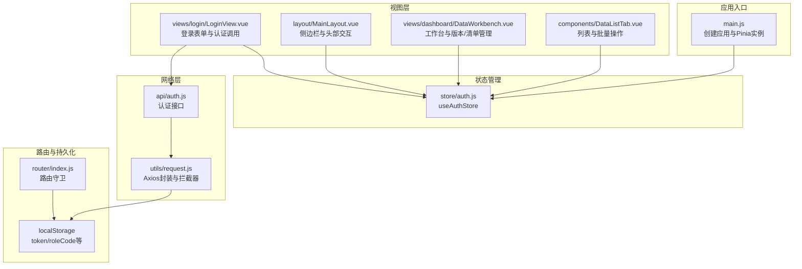
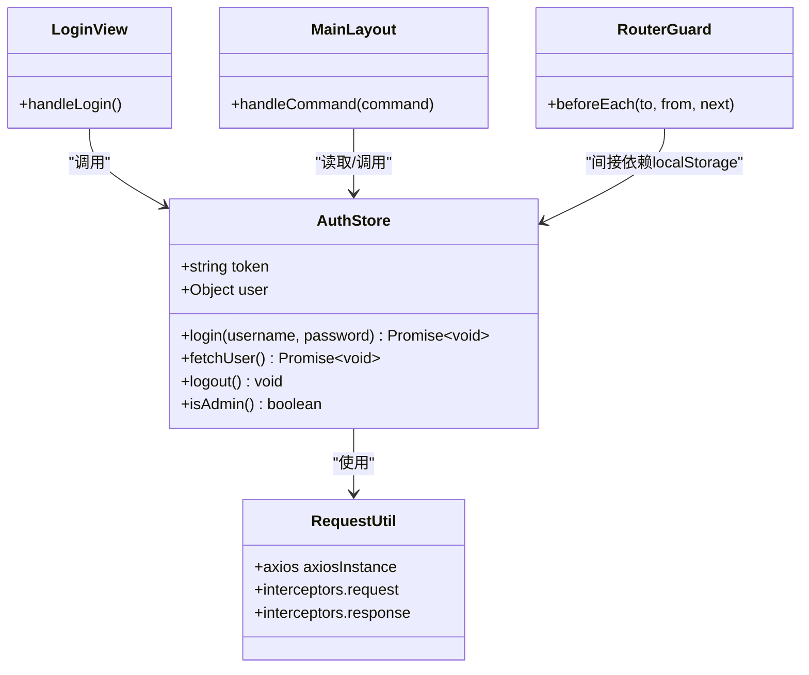
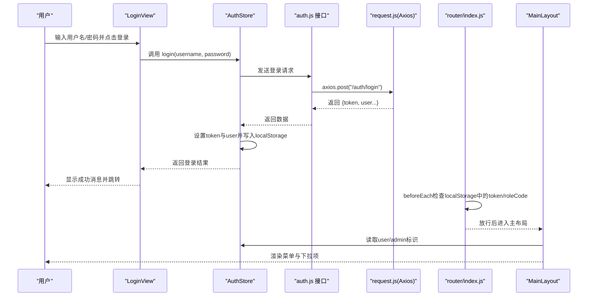
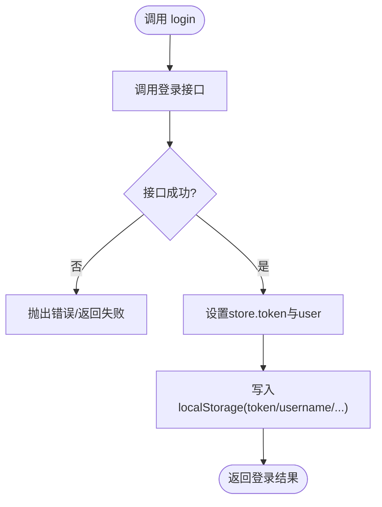
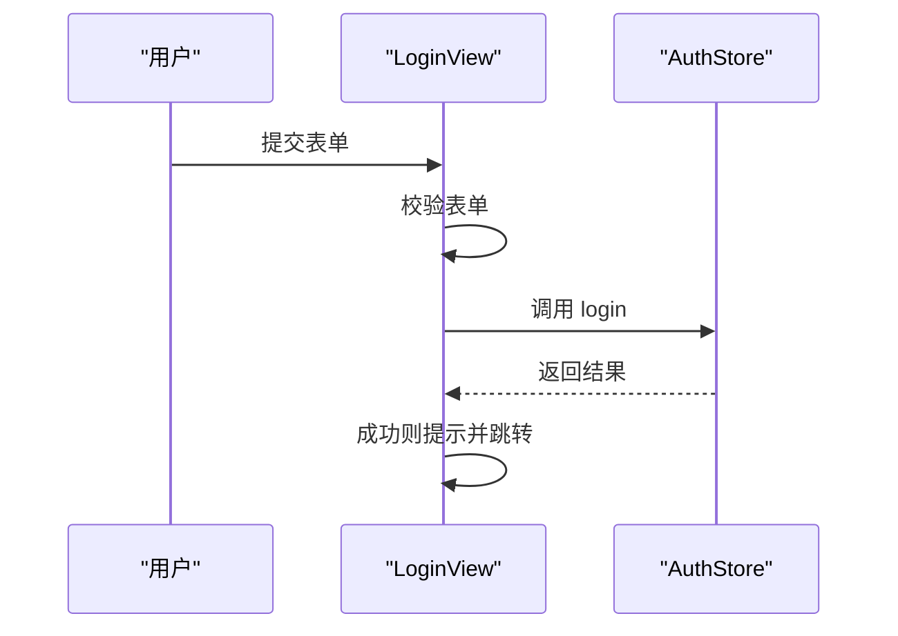
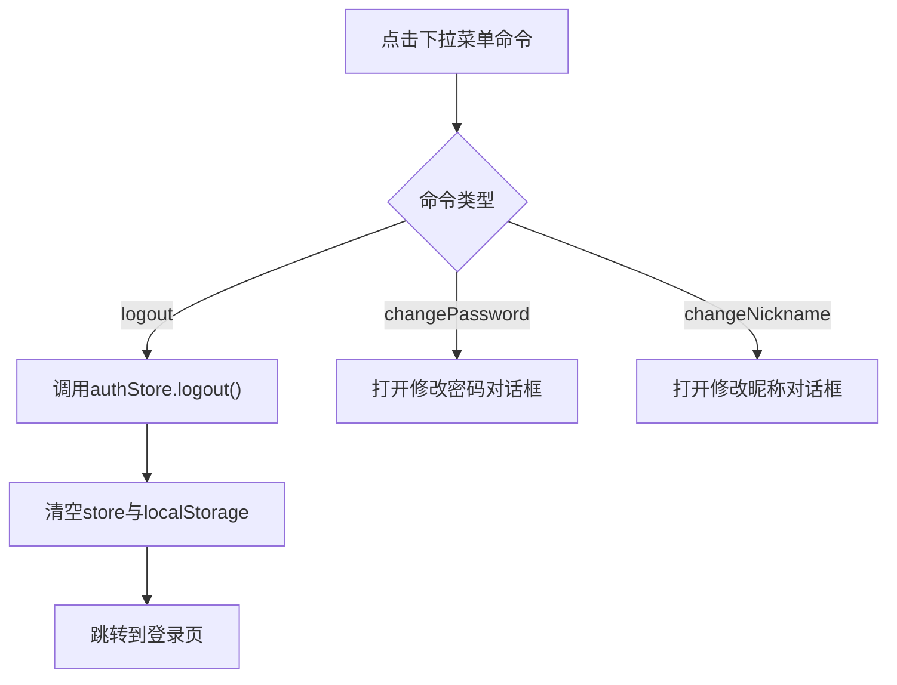
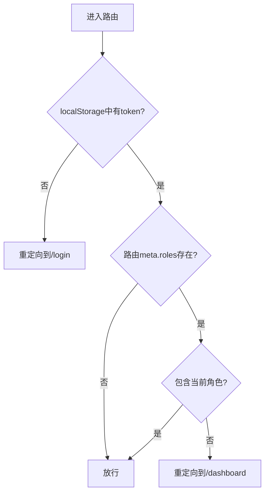
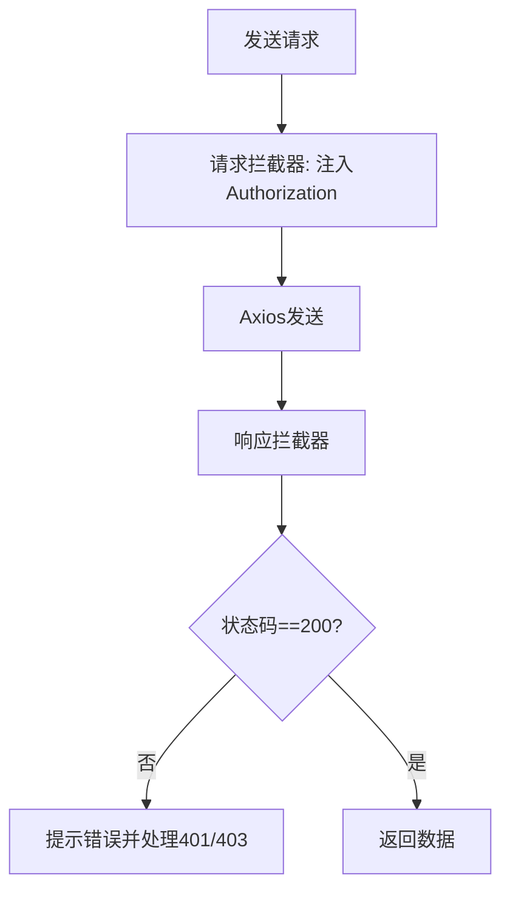
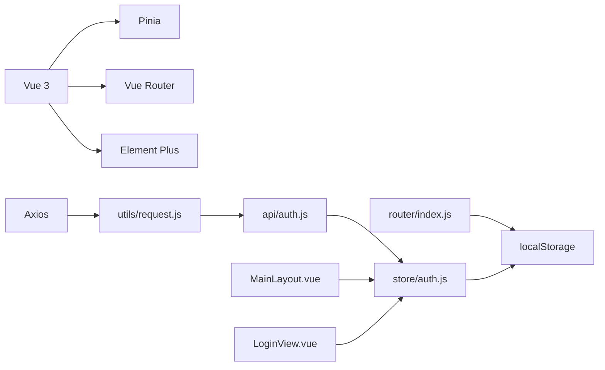

# 状态管理

<cite>
**本文引用的文件**
- [frontend/src/store/auth.js](file://frontend/src/store/auth.js)
- [frontend/src/main.js](file://frontend/src/main.js)
- [frontend/src/App.vue](file://frontend/src/App.vue)
- [frontend/src/views/login/LoginView.vue](file://frontend/src/views/login/LoginView.vue)
- [frontend/src/api/auth.js](file://frontend/src/api/auth.js)
- [frontend/src/utils/request.js](file://frontend/src/utils/request.js)
- [frontend/src/router/index.js](file://frontend/src/router/index.js)
- [frontend/src/layout/MainLayout.vue](file://frontend/src/layout/MainLayout.vue)
- [frontend/package.json](file://frontend/package.json)
- [frontend/vite.config.js](file://frontend/vite.config.js)
- [frontend/src/api/product.js](file://frontend/src/api/product.js)
- [frontend/src/views/dashboard/DataWorkbench.vue](file://frontend/src/views/dashboard/DataWorkbench.vue)
- [frontend/src/components/DataListTab.vue](file://frontend/src/components/DataListTab.vue)
</cite>

## 目录
1. [引言](#引言)
2. [项目结构](#项目结构)
3. [核心组件](#核心组件)
4. [架构总览](#架构总览)
5. [详细组件分析](#详细组件分析)
6. [依赖分析](#依赖分析)
7. [性能考虑](#性能考虑)
8. [故障排查指南](#故障排查指南)
9. [结论](#结论)
10. [附录](#附录)

## 引言
本文件围绕前端状态管理进行系统性技术文档整理，重点覆盖以下方面：
- Pinia 状态管理库的使用与 store 模块设计
- 用户认证状态管理、全局状态共享与组件间数据同步机制
- 状态变更触发方式、异步操作处理与状态订阅模式
- 状态持久化策略与最佳实践、性能优化与调试技巧
- 实际示例与常见问题解决方案

本项目采用 Vue 3 + Pinia + Vue Router + Element Plus 技术栈，认证状态通过本地存储持久化，并结合 Axios 请求拦截器统一注入鉴权头，路由守卫基于本地存储令牌与角色信息进行访问控制。

## 项目结构
前端项目位于 frontend 目录，关键状态管理相关文件分布如下：
- 应用入口与状态库初始化：main.js
- 认证状态 store：store/auth.js
- 登录视图与认证流程：views/login/LoginView.vue
- API 层与认证接口：api/auth.js
- HTTP 请求封装与拦截器：utils/request.js
- 路由与路由守卫：router/index.js
- 主布局与菜单、下拉菜单等交互：layout/MainLayout.vue
- 版本与数据清单工作台：views/dashboard/DataWorkbench.vue
- 列表组件与批量操作：components/DataListTab.vue
- 依赖与开发服务器配置：package.json、vite.config.js

图表来源
- [frontend/src/main.js:1-20](file://frontend/src/main.js#L1-L20)
- [frontend/src/store/auth.js:1-46](file://frontend/src/store/auth.js#L1-L46)
- [frontend/src/views/login/LoginView.vue:1-209](file://frontend/src/views/login/LoginView.vue#L1-L209)
- [frontend/src/layout/MainLayout.vue:1-423](file://frontend/src/layout/MainLayout.vue#L1-L423)
- [frontend/src/views/dashboard/DataWorkbench.vue:1-1144](file://frontend/src/views/dashboard/DataWorkbench.vue#L1-L1144)
- [frontend/src/components/DataListTab.vue:1-3221](file://frontend/src/components/DataListTab.vue#L1-L3221)
- [frontend/src/api/auth.js:1-22](file://frontend/src/api/auth.js#L1-L22)
- [frontend/src/utils/request.js:1-65](file://frontend/src/utils/request.js#L1-L65)
- [frontend/src/router/index.js:1-129](file://frontend/src/router/index.js#L1-L129)

章节来源
- [frontend/src/main.js:1-20](file://frontend/src/main.js#L1-L20)
- [frontend/src/store/auth.js:1-46](file://frontend/src/store/auth.js#L1-L46)
- [frontend/src/views/login/LoginView.vue:1-209](file://frontend/src/views/login/LoginView.vue#L1-L209)
- [frontend/src/layout/MainLayout.vue:1-423](file://frontend/src/layout/MainLayout.vue#L1-L423)
- [frontend/src/views/dashboard/DataWorkbench.vue:1-1144](file://frontend/src/views/dashboard/DataWorkbench.vue#L1-L1144)
- [frontend/src/components/DataListTab.vue:1-3221](file://frontend/src/components/DataListTab.vue#L1-L3221)
- [frontend/src/api/auth.js:1-22](file://frontend/src/api/auth.js#L1-L22)
- [frontend/src/utils/request.js:1-65](file://frontend/src/utils/request.js#L1-L65)
- [frontend/src/router/index.js:1-129](file://frontend/src/router/index.js#L1-L129)

## 核心组件
本项目的状态管理以 Pinia 的组合式 Store 为核心，认证状态集中在 useAuthStore 中，包含以下关键能力：
- 状态字段：token、user
- 行为方法：login、fetchUser、logout、isAdmin
- 数据持久化：登录后将 token 与用户关键信息写入 localStorage；登出或获取当前用户失败时清理 localStorage
- 认证流程：登录成功后设置 token 并持久化；请求拦截器自动携带 Authorization 头；响应拦截器处理 401/403 并跳转登录

图表来源
- [frontend/src/store/auth.js:1-46](file://frontend/src/store/auth.js#L1-L46)
- [frontend/src/utils/request.js:1-65](file://frontend/src/utils/request.js#L1-L65)
- [frontend/src/router/index.js:1-129](file://frontend/src/router/index.js#L1-L129)
- [frontend/src/views/login/LoginView.vue:1-209](file://frontend/src/views/login/LoginView.vue#L1-L209)
- [frontend/src/layout/MainLayout.vue:1-423](file://frontend/src/layout/MainLayout.vue#L1-L423)

章节来源
- [frontend/src/store/auth.js:1-46](file://frontend/src/store/auth.js#L1-L46)
- [frontend/src/utils/request.js:1-65](file://frontend/src/utils/request.js#L1-L65)
- [frontend/src/router/index.js:1-129](file://frontend/src/router/index.js#L1-L129)
- [frontend/src/views/login/LoginView.vue:1-209](file://frontend/src/views/login/LoginView.vue#L1-L209)
- [frontend/src/layout/MainLayout.vue:1-423](file://frontend/src/layout/MainLayout.vue#L1-L423)

## 架构总览
整体状态流从用户交互开始，贯穿到 API 请求与路由守卫，形成闭环：
- 用户在登录页输入凭据，调用 useAuthStore.login，成功后将 token 写入 localStorage
- 请求拦截器自动为后续请求附加 Authorization 头
- 路由守卫根据 localStorage 中的 token 和角色决定是否放行
- 主布局根据认证状态渲染菜单与下拉项，支持退出登录
- 工作台与列表组件通过 API 层与服务端交互，组件内部通过本地响应式数据与刷新触发实现状态同步

图表来源
- [frontend/src/views/login/LoginView.vue:88-100](file://frontend/src/views/login/LoginView.vue#L88-L100)
- [frontend/src/store/auth.js:9-19](file://frontend/src/store/auth.js#L9-L19)
- [frontend/src/api/auth.js:1-22](file://frontend/src/api/auth.js#L1-L22)
- [frontend/src/utils/request.js:24-30](file://frontend/src/utils/request.js#L24-L30)
- [frontend/src/router/index.js:111-126](file://frontend/src/router/index.js#L111-L126)
- [frontend/src/layout/MainLayout.vue:196-208](file://frontend/src/layout/MainLayout.vue#L196-L208)

## 详细组件分析

### 认证状态模块（useAuthStore）
- 设计要点
  - 使用组合式 Store 定义 token 与 user 两个响应式状态
  - login 将服务端返回的 token 与用户信息写入 localStorage，并设置 store 状态
  - fetchUser 在页面初始化或需要刷新用户信息时调用，异常时触发 logout 清理
  - logout 清空 store 与 localStorage 中的认证信息
  - isAdmin 基于 localStorage 的 roleCode 判断管理员身份
- 状态持久化
  - token、username、userId、roleCode、nickname 通过 localStorage 持久化
  - 优点：刷新页面后仍可保持登录态；缺点：需注意跨标签页一致性与安全风险
- 异步与错误处理
  - login/loginApi 返回 Promise，调用方负责 UI 反馈
  - fetchUser 包含 try/catch，失败即执行 logout，避免脏数据
- 订阅与使用
  - LoginView 与 MainLayout 直接使用 useAuthStore，实现状态共享与组件间同步

图表来源
- [frontend/src/store/auth.js:9-19](file://frontend/src/store/auth.js#L9-L19)
- [frontend/src/api/auth.js:1-22](file://frontend/src/api/auth.js#L1-L22)

章节来源
- [frontend/src/store/auth.js:1-46](file://frontend/src/store/auth.js#L1-L46)
- [frontend/src/api/auth.js:1-22](file://frontend/src/api/auth.js#L1-L22)

### 登录视图（LoginView）
- 触发方式
  - 用户输入完成后按回车或点击登录按钮，调用 formRef.validate 校验
  - 验证通过后调用 authStore.login，成功后提示并跳转至仪表盘
- 状态订阅
  - 直接读取 authStore 的 token/user 进行界面逻辑判断（如跳转）
- 错误处理
  - try/catch 捕获登录异常，finally 关闭 loading
- 与路由的关系
  - 登录成功后由路由守卫保证后续访问受控

图表来源
- [frontend/src/views/login/LoginView.vue:88-100](file://frontend/src/views/login/LoginView.vue#L88-L100)
- [frontend/src/store/auth.js:9-19](file://frontend/src/store/auth.js#L9-L19)

章节来源
- [frontend/src/views/login/LoginView.vue:1-209](file://frontend/src/views/login/LoginView.vue#L1-L209)
- [frontend/src/store/auth.js:1-46](file://frontend/src/store/auth.js#L1-L46)

### 主布局（MainLayout）
- 全局状态共享
  - 读取 authStore.user.nickname 与 isAdmin 判断菜单显示与权限项
  - 下拉菜单命令处理：退出登录、修改密码、修改昵称
- 组件间数据同步
  - 通过 authStore.logout 后，MainLayout 与子组件共享的用户信息自动更新
  - 修改昵称后同步更新 localStorage 与本地响应式变量
- 与认证状态的耦合
  - 菜单项与路由元信息 roles 结合，最终由路由守卫生效

图表来源
- [frontend/src/layout/MainLayout.vue:196-208](file://frontend/src/layout/MainLayout.vue#L196-L208)
- [frontend/src/store/auth.js:30-38](file://frontend/src/store/auth.js#L30-L38)

章节来源
- [frontend/src/layout/MainLayout.vue:1-423](file://frontend/src/layout/MainLayout.vue#L1-L423)
- [frontend/src/store/auth.js:1-46](file://frontend/src/store/auth.js#L1-L46)

### 路由守卫（router/index.js）
- 访问控制
  - 未登录且访问非登录页时重定向到登录
  - 若路由 meta.roles 存在，校验 localStorage 中的 roleCode 是否包含
- 与状态管理的衔接
  - 路由守卫不直接依赖 Pinia，而是依赖 localStorage 中的 token 与角色
  - 与 useAuthStore 的关系：登录成功后写入 localStorage，守卫据此放行

图表来源
- [frontend/src/router/index.js:111-126](file://frontend/src/router/index.js#L111-L126)

章节来源
- [frontend/src/router/index.js:1-129](file://frontend/src/router/index.js#L1-L129)

### HTTP 请求封装（utils/request.js）
- 请求拦截器
  - 从 localStorage 读取 token 并设置 Authorization: Bearer
- 响应拦截器
  - 统一处理非 200 状态码与业务错误，401/403 清理 token 并跳转登录
  - 对 blob/text 响应类型透传原始数据
- 与认证状态的联动
  - 通过拦截器自动注入 token，避免各组件重复处理

图表来源
- [frontend/src/utils/request.js:24-62](file://frontend/src/utils/request.js#L24-L62)

章节来源
- [frontend/src/utils/request.js:1-65](file://frontend/src/utils/request.js#L1-L65)

### 工作台与列表（DataWorkbench / DataListTab）
- 状态共享
  - 工作台通过 API 获取版本列表、自定义清单等，组件内部维护本地响应式状态
  - 列表组件支持批量操作、虚拟滚动、树形展开/折叠等，通过 props 与事件与父组件通信
- 刷新与同步
  - 通过刷新触发器（如 refreshTrigger）驱动子组件重新加载数据
  - 批量操作后触发对应刷新，确保 UI 与服务端一致
- 与认证状态的协作
  - 通过 localStorage 读取当前用户角色与 ID，控制编辑/操作按钮可见性

章节来源
- [frontend/src/views/dashboard/DataWorkbench.vue:1-1144](file://frontend/src/views/dashboard/DataWorkbench.vue#L1-L1144)
- [frontend/src/components/DataListTab.vue:1-3221](file://frontend/src/components/DataListTab.vue#L1-L3221)

## 依赖分析
- 核心依赖
  - Vue 3、Pinia、Vue Router、Element Plus、Axios
- 开发与构建
  - Vite 作为开发服务器与打包工具，配置了代理到后端服务
- 状态管理依赖链
  - LoginView -> useAuthStore -> api/auth.js -> utils/request.js -> localStorage
  - MainLayout -> useAuthStore -> localStorage
  - router/index.js -> localStorage

图表来源
- [frontend/package.json:11-27](file://frontend/package.json#L11-L27)
- [frontend/vite.config.js:1-20](file://frontend/vite.config.js#L1-L20)
- [frontend/src/store/auth.js:1-46](file://frontend/src/store/auth.js#L1-L46)
- [frontend/src/api/auth.js:1-22](file://frontend/src/api/auth.js#L1-L22)
- [frontend/src/utils/request.js:1-65](file://frontend/src/utils/request.js#L1-L65)
- [frontend/src/router/index.js:1-129](file://frontend/src/router/index.js#L1-L129)
- [frontend/src/layout/MainLayout.vue:1-423](file://frontend/src/layout/MainLayout.vue#L1-L423)
- [frontend/src/views/login/LoginView.vue:1-209](file://frontend/src/views/login/LoginView.vue#L1-L209)

章节来源
- [frontend/package.json:1-28](file://frontend/package.json#L1-L28)
- [frontend/vite.config.js:1-20](file://frontend/vite.config.js#L1-L20)

## 性能考虑
- 响应式与渲染
  - 使用组合式 API 的 ref/reactive，避免不必要的深层响应式开销
  - 列表组件采用虚拟滚动（RecycleScroller），减少 DOM 数量
- 网络与缓存
  - 请求拦截器统一注入 token，减少重复逻辑
  - 对于大文件/二进制响应，直接透传，避免额外序列化
- 路由守卫
  - 仅做轻量判断（读取 localStorage），避免复杂计算
- 状态持久化
  - localStorage 写入在登录成功后一次性完成，避免频繁 IO

## 故障排查指南
- 登录后无法访问受控页面
  - 检查 localStorage 中是否存在 token 与 roleCode
  - 确认 router.beforeEach 是否正确读取并匹配角色
- 401/403 异常
  - 查看响应拦截器是否被触发并清理了 token
  - 确认请求头 Authorization 是否正确设置
- 退出登录后状态未更新
  - 确认 authStore.logout 是否被调用
  - 检查 localStorage 是否被清理
- 页面刷新后丢失登录态
  - 确认登录流程是否将 token 与用户信息写入 localStorage
  - 检查浏览器隐私模式或第三方 Cookie 策略影响

章节来源
- [frontend/src/router/index.js:111-126](file://frontend/src/router/index.js#L111-L126)
- [frontend/src/utils/request.js:32-62](file://frontend/src/utils/request.js#L32-L62)
- [frontend/src/store/auth.js:30-38](file://frontend/src/store/auth.js#L30-L38)

## 结论
本项目采用 Pinia 组合式 Store 管理认证状态，结合 localStorage 实现简单可靠的持久化；通过 Axios 拦截器与路由守卫形成完整的鉴权闭环。组件层通过 props 与事件实现状态共享与同步，配合虚拟滚动与本地刷新触发器提升交互性能。建议在生产环境中进一步强化 token 安全存储与跨标签页一致性，并对关键状态增加细粒度的订阅与日志追踪。

## 附录
- 实际示例路径
  - 登录流程：[frontend/src/views/login/LoginView.vue:88-100](file://frontend/src/views/login/LoginView.vue#L88-L100)
  - 认证状态定义：[frontend/src/store/auth.js:5-45](file://frontend/src/store/auth.js#L5-L45)
  - 请求拦截与响应处理：[frontend/src/utils/request.js:24-62](file://frontend/src/utils/request.js#L24-L62)
  - 路由守卫：[frontend/src/router/index.js:111-126](file://frontend/src/router/index.js#L111-L126)
  - 主布局菜单与下拉：[frontend/src/layout/MainLayout.vue:196-208](file://frontend/src/layout/MainLayout.vue#L196-L208)
  - 工作台与列表组件：[frontend/src/views/dashboard/DataWorkbench.vue:1-1144](file://frontend/src/views/dashboard/DataWorkbench.vue#L1-L1144)、[frontend/src/components/DataListTab.vue:1-3221](file://frontend/src/components/DataListTab.vue#L1-L3221)
- 最佳实践
  - 将 token 与用户关键信息写入 localStorage，便于刷新后恢复
  - 在响应拦截器中统一处理 401/403，避免分散处理
  - 使用路由守卫进行轻量级访问控制，避免在组件内重复判断
  - 对长列表使用虚拟滚动，对频繁刷新的场景使用局部刷新触发器
- 性能优化
  - 减少深层响应式对象的使用，优先使用浅层 ref
  - 合理拆分组件，避免单组件状态过大
  - 对网络请求进行必要的节流与去抖
- 调试技巧
  - 在浏览器开发者工具中观察 localStorage 的 token 与角色变化
  - 在 Network 面板检查 Authorization 头是否正确
  - 在 Console 中观察路由守卫与拦截器的日志输出