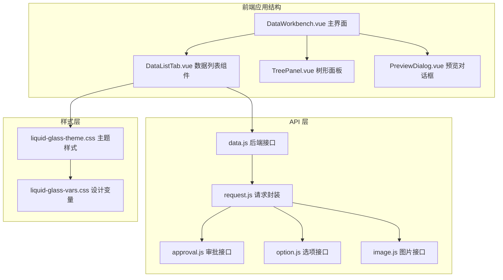
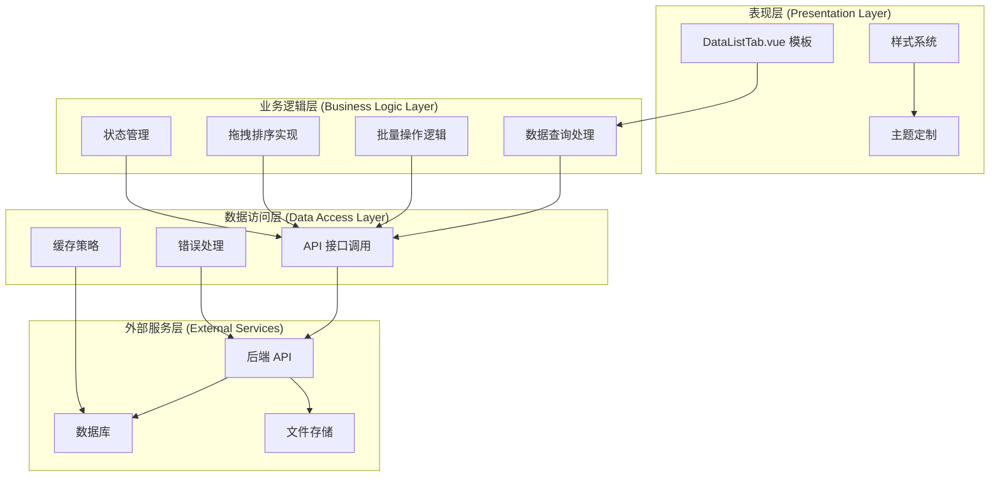
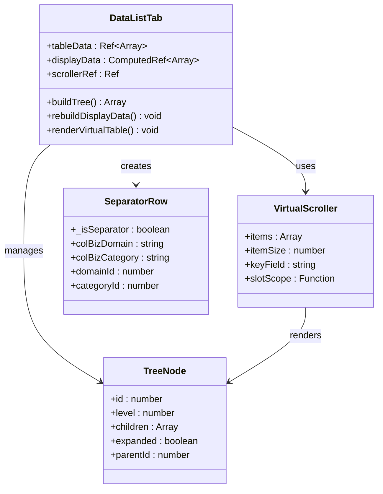
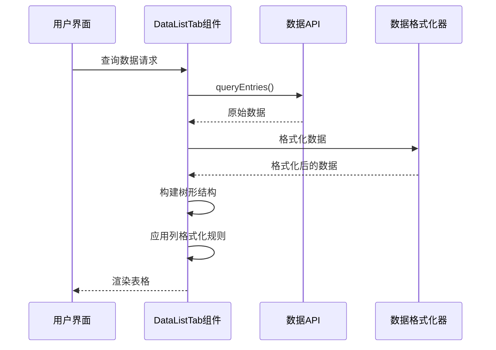
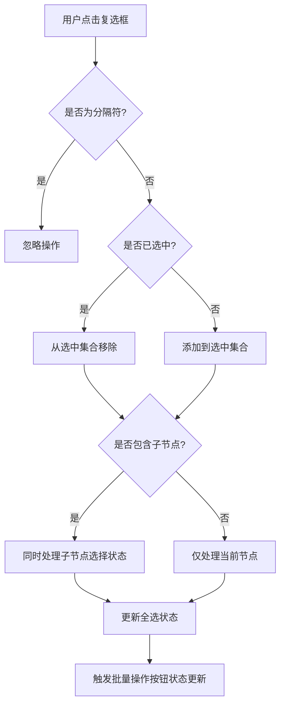
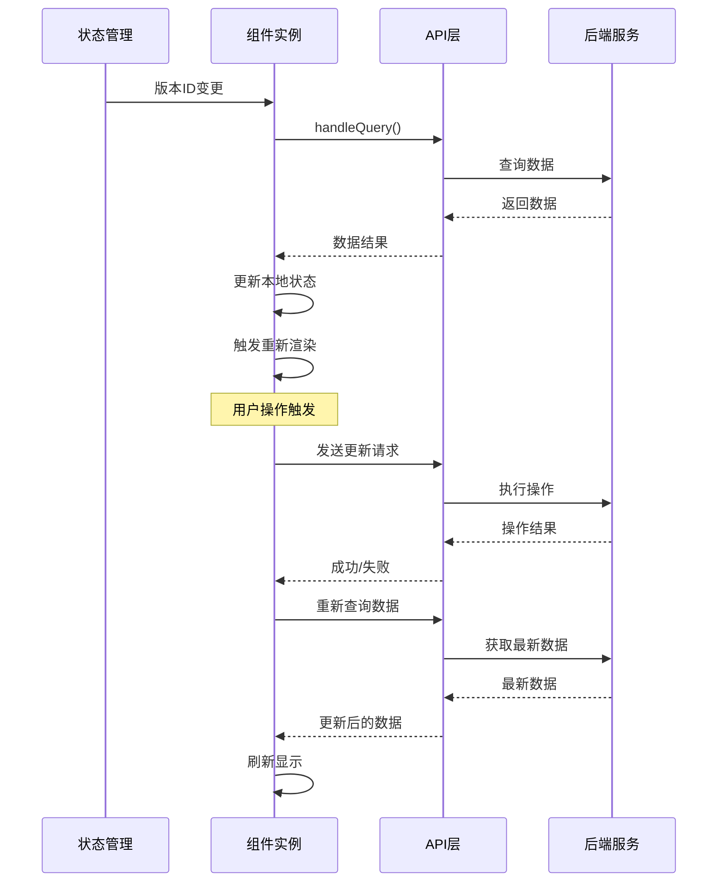
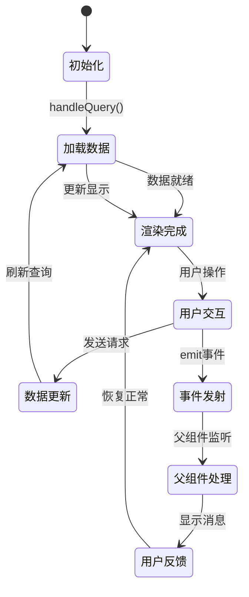
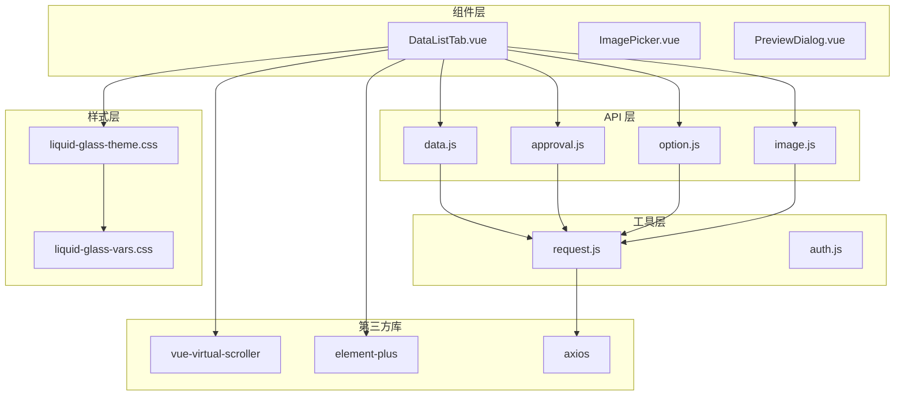

# DataListTab 数据列表组件

<cite>
**本文档引用的文件**
- [DataListTab.vue](file://frontend/src/components/DataListTab.vue)
- [data.js](file://frontend/src/api/data.js)
- [request.js](file://frontend/src/utils/request.js)
- [option.js](file://frontend/src/api/option.js)
- [approval.js](file://frontend/src/api/approval.js)
- [image.js](file://frontend/src/api/image.js)
- [liquid-glass-theme.css](file://frontend/src/styles/liquid-glass-theme.css)
- [liquid-glass-vars.css](file://frontend/src/styles/liquid-glass-vars.css)
- [DataWorkbench.vue](file://frontend/src/views/dashboard/DataWorkbench.vue)
</cite>

## 目录
1. [简介](#简介)
2. [项目结构](#项目结构)
3. [核心组件](#核心组件)
4. [架构概览](#架构概览)
5. [详细组件分析](#详细组件分析)
6. [依赖关系分析](#依赖关系分析)
7. [性能考虑](#性能考虑)
8. [故障排除指南](#故障排除指南)
9. [结论](#结论)
10. [附录](#附录)

## 简介

DataListTab 是一个功能强大的数据列表组件，专为产品管理系统设计。该组件提供了完整的数据展示、交互和管理功能，支持树形结构显示、批量操作、实时更新和丰富的用户体验。

该组件采用现代化的前端技术栈构建，基于 Vue 3 Composition API 开发，集成了 Element Plus 组件库和虚拟滚动技术，能够高效处理大量数据的展示和交互。

## 项目结构

DataListTab 组件位于前端项目的组件目录中，与相关的 API 接口、样式文件和主应用页面共同构成了完整的数据工作台系统。



**图表来源**
- [DataWorkbench.vue:86-97](file://frontend/src/views/dashboard/DataWorkbench.vue#L86-L97)
- [DataListTab.vue:609-631](file://frontend/src/components/DataListTab.vue#L609-L631)

**章节来源**
- [DataWorkbench.vue:86-134](file://frontend/src/views/dashboard/DataWorkbench.vue#L86-L134)
- [DataListTab.vue:609-631](file://frontend/src/components/DataListTab.vue#L609-L631)

## 核心组件

DataListTab 组件的核心功能围绕以下几个关键方面构建：

### 数据展示架构
- **虚拟滚动渲染**：使用 vue-virtual-scroller 实现高性能的虚拟滚动，支持数万条数据的流畅展示
- **树形结构显示**：支持多级产品/系统层次结构的展开/折叠显示
- **分组显示**：按业务域进行数据分组，每个分组包含分隔符行

### 交互功能体系
- **行选择机制**：支持单行、多行和全选操作，包含父子节点联动选择
- **拖拽排序**：实现复杂的拖拽排序功能，支持同级排序、父子嵌套和兄弟节点移动
- **批量操作**：提供批量审批、批量修改、批量删除等高级操作

### 数据绑定策略
- **实时数据同步**：通过轮询和事件驱动实现数据的实时更新
- **缓存管理**：智能缓存策略减少重复请求，提升响应速度
- **状态管理**：使用 Vue 3 响应式系统管理复杂的状态变化

**章节来源**
- [DataListTab.vue:132-149](file://frontend/src/components/DataListTab.vue#L132-L149)
- [DataListTab.vue:769-804](file://frontend/src/components/DataListTab.vue#L769-L804)
- [DataListTab.vue:2620-2665](file://frontend/src/components/DataListTab.vue#L2620-L2665)

## 架构概览

DataListTab 采用了分层架构设计，确保了代码的可维护性和扩展性。



**图表来源**
- [DataListTab.vue:609-631](file://frontend/src/components/DataListTab.vue#L609-L631)
- [data.js:1-128](file://frontend/src/api/data.js#L1-L128)

**章节来源**
- [DataListTab.vue:609-631](file://frontend/src/components/DataListTab.vue#L609-L631)
- [data.js:1-128](file://frontend/src/api/data.js#L1-L128)

## 详细组件分析

### 表格渲染系统

DataListTab 的表格渲染采用了高度优化的虚拟滚动技术，能够处理大规模数据集的高效展示。



**图表来源**
- [DataListTab.vue:697-804](file://frontend/src/components/DataListTab.vue#L697-L804)
- [DataListTab.vue:2676-2697](file://frontend/src/components/DataListTab.vue#L2676-L2697)

#### 虚拟滚动实现
组件使用 RecycleScroller 实现虚拟滚动，通过以下关键配置实现高性能渲染：

- **固定行高**：每行固定高度 36px，确保滚动计算的准确性
- **动态键值**：使用 `id` 字段作为唯一标识，保证渲染元素的稳定性
- **增量渲染**：只渲染可视区域内的元素，大幅减少 DOM 操作

#### 树形结构渲染
树形结构通过递归遍历实现，支持复杂的层级关系展示：

- **分组显示**：按业务域分组，每个分组顶部显示分隔符
- **展开控制**：支持全局展开/折叠和单节点展开控制
- **层级缩进**：根据节点层级动态计算缩进距离

**章节来源**
- [DataListTab.vue:132-149](file://frontend/src/components/DataListTab.vue#L132-L149)
- [DataListTab.vue:769-804](file://frontend/src/components/DataListTab.vue#L769-L804)
- [DataListTab.vue:2676-2697](file://frontend/src/components/DataListTab.vue#L2676-L2697)

### 列定义和数据格式化

组件的列定义采用了灵活的设计模式，支持动态列配置和数据格式化。



**图表来源**
- [DataListTab.vue:2620-2665](file://frontend/src/components/DataListTab.vue#L2620-L2665)
- [data.js:19-21](file://frontend/src/api/data.js#L19-L21)

#### 列配置系统
组件支持多种列类型的灵活配置：

- **基础信息列**：产品名称、状态、产品经理等基本信息
- **版本划分列**：支持 A-曜系列、B-远系列、C-驰系列的多版本管理
- **操作列**：提供丰富的操作按钮和功能状态显示
- **智能化标识**：支持 AI 智能化产品的特殊标识和提示

#### 数据格式化机制
- **状态标签**：根据状态值自动映射到相应的标签类型
- **层级标签**：根据节点层级显示不同的标签样式
- **版本标识**：支持版本系列和最小集的视觉区分
- **智能提示**：为智能化产品提供详细的提示信息

**章节来源**
- [DataListTab.vue:1956-1985](file://frontend/src/components/DataListTab.vue#L1956-L1985)
- [DataListTab.vue:2045-2076](file://frontend/src/components/DataListTab.vue#L2045-L2076)

### 交互功能详解

DataListTab 提供了丰富的交互功能，满足复杂的数据管理需求。

#### 行选择机制


**图表来源**
- [DataListTab.vue:2179-2190](file://frontend/src/components/DataListTab.vue#L2179-L2190)
- [DataListTab.vue:2215-2233](file://frontend/src/components/DataListTab.vue#L2215-L2233)

#### 拖拽排序实现
拖拽排序是 DataListTab 最复杂的功能之一，实现了多种排序模式：

- **同级排序**：在同一业务域内进行排序
- **父子嵌套**：支持将节点拖拽到其他节点下成为子节点
- **兄弟节点移动**：支持在同级节点间移动位置
- **排序结束处理**：支持在列表末尾进行排序

#### 批量操作功能
组件提供了全面的批量操作能力：

- **批量审批**：支持批量提交、批量通过、批量驳回
- **批量修改**：支持批量修改状态、解决方案、产品经理等
- **批量删除**：安全的批量删除操作，包含确认对话框
- **批量分类修改**：支持批量修改业务分类和业务域

**章节来源**
- [DataListTab.vue:806-961](file://frontend/src/components/DataListTab.vue#L806-L961)
- [DataListTab.vue:1659-1734](file://frontend/src/components/DataListTab.vue#L1659-L1734)

### 数据绑定策略

DataListTab 采用了多层次的数据绑定策略，确保数据的一致性和实时性。



**图表来源**
- [DataListTab.vue:2825-2832](file://frontend/src/components/DataListTab.vue#L2825-L2832)
- [DataListTab.vue:2620-2665](file://frontend/src/components/DataListTab.vue#L2620-L2665)

#### 与后端 API 对接
组件通过统一的 API 封装层与后端服务通信：

- **查询接口**：支持多条件组合查询，包括名称、状态、产品经理等
- **增删改查**：提供完整的 CRUD 操作接口
- **批量操作**：支持批量删除、批量更新等高级操作
- **排序操作**：支持拖拽排序和重新排序功能

#### 数据刷新机制
- **手动刷新**：用户主动触发的刷新操作
- **自动刷新**：通过轮询机制实现数据的定期更新
- **事件驱动**：通过事件监听实现响应式数据更新
- **缓存策略**：智能缓存减少不必要的网络请求

**章节来源**
- [DataListTab.vue:2620-2665](file://frontend/src/components/DataListTab.vue#L2620-L2665)
- [data.js:19-49](file://frontend/src/api/data.js#L19-L49)

### 性能优化措施

DataListTab 在多个层面实现了性能优化，确保在大数据量下的流畅体验。

#### 虚拟滚动优化
- **固定行高**：每行固定高度 36px，确保滚动性能
- **增量渲染**：只渲染可视区域内的元素
- **DOM 复用**：通过 key 值确保元素的正确复用
- **滚动优化**：使用 CSS transform 进行滚动定位

#### 内存管理
- **垃圾回收**：及时清理拖拽过程中的临时元素
- **事件解绑**：组件卸载时自动清理事件监听器
- **状态清理**：组件销毁时清理所有响应式状态
- **内存泄漏防护**：防止拖拽过程中的内存泄漏

#### 计算优化
- **计算属性缓存**：使用 computed 属性缓存复杂计算结果
- **响应式优化**：合理使用 ref 和 reactive，避免过度响应
- **渲染优化**：通过 v-show 和 v-if 控制渲染时机
- **事件节流**：对高频事件进行节流处理

**章节来源**
- [DataListTab.vue:132-149](file://frontend/src/components/DataListTab.vue#L132-L149)
- [DataListTab.vue:2843-2855](file://frontend/src/components/DataListTab.vue#L2843-L2855)

### 可配置性设计

DataListTab 提供了丰富的可配置选项，满足不同场景的使用需求。

#### 列配置
- **动态列显示**：根据权限和角色动态显示不同的列
- **列宽调整**：支持列宽的手动调整和记忆
- **列排序**：支持列级别的排序功能
- **列隐藏**：提供列的显示/隐藏控制

#### 布局调整
- **侧边栏折叠**：支持树形导航的折叠/展开
- **工具栏定制**：根据使用场景定制工具栏按钮
- **分页配置**：支持分页大小和页码的配置
- **搜索条件**：提供灵活的搜索条件配置

#### 主题定制
- **CSS 变量**：使用 CSS 变量实现主题的统一管理
- **颜色系统**：支持主色调、辅助色的定制
- **字体系统**：支持字体族和字号的配置
- **间距系统**：提供一致的间距和边距规范

**章节来源**
- [DataListTab.vue:2909-3200](file://frontend/src/components/DataListTab.vue#L2909-L3200)
- [liquid-glass-theme.css:1-236](file://frontend/src/styles/liquid-glass-theme.css#L1-L236)

### 事件处理机制

DataListTab 建立了完善的事件处理机制，支持组件间的通信和用户交互。



**图表来源**
- [DataListTab.vue:631](file://frontend/src/components/DataListTab.vue#L631)
- [DataListTab.vue:2620-2665](file://frontend/src/components/DataListTab.vue#L2620-L2665)

#### 事件定义
- **数据操作事件**：insert-to-list、remove-from-list、generate-doc
- **状态变更事件**：preview-reload、open-preview
- **用户交互事件**：批量操作、行选择、排序变更

#### 错误状态管理
- **统一错误处理**：通过拦截器统一处理 API 错误
- **用户友好提示**：提供清晰的错误信息和解决方案
- **状态恢复**：错误发生后的状态恢复和数据回滚
- **日志记录**：详细的错误日志便于问题排查

**章节来源**
- [DataListTab.vue:631](file://frontend/src/components/DataListTab.vue#L631)
- [request.js:32-62](file://frontend/src/utils/request.js#L32-L62)

### 用户反馈优化

组件注重用户体验，在多个方面进行了反馈优化。

#### 实时反馈
- **加载状态**：数据加载时显示加载指示器
- **操作反馈**：操作成功/失败时显示相应提示
- **进度显示**：长时间操作显示进度条
- **状态指示**：通过颜色和图标反映数据状态

#### 交互优化
- **悬停效果**：提供丰富的鼠标悬停反馈
- **动画过渡**：使用平滑的动画效果改善用户体验
- **键盘导航**：支持键盘快捷键操作
- **触摸支持**：优化移动端触摸操作体验

**章节来源**
- [DataListTab.vue:111-118](file://frontend/src/components/DataListTab.vue#L111-L118)
- [DataListTab.vue:2967-2971](file://frontend/src/components/DataListTab.vue#L2967-L2971)

## 依赖关系分析

DataListTab 组件的依赖关系体现了清晰的分层架构设计。



**图表来源**
- [DataListTab.vue:611-621](file://frontend/src/components/DataListTab.vue#L611-L621)
- [data.js:1-128](file://frontend/src/api/data.js#L1-L128)

### 直接依赖
- **vue-virtual-scroller**：提供虚拟滚动功能
- **element-plus**：提供 UI 组件和交互功能
- **axios**：提供 HTTP 请求功能
- **vue**：提供响应式数据绑定和组件系统

### 间接依赖
- **Element Plus Icons**：提供图标资源
- **Vue Router**：提供路由导航功能
- **Element Plus Message**：提供消息提示功能

**章节来源**
- [DataListTab.vue:611-621](file://frontend/src/components/DataListTab.vue#L611-L621)
- [data.js:1-128](file://frontend/src/api/data.js#L1-L128)

## 性能考虑

DataListTab 在性能优化方面采取了多项措施，确保在各种使用场景下的最佳性能表现。

### 渲染性能优化
- **虚拟滚动**：使用 RecycleScroller 实现百万级数据的流畅滚动
- **懒加载**：子节点采用懒加载策略，减少初始渲染压力
- **增量更新**：只更新发生变化的数据，避免全量重渲染
- **防抖处理**：对高频操作进行防抖处理，减少不必要的计算

### 内存管理
- **组件卸载清理**：确保组件销毁时清理所有事件监听器
- **状态重置**：组件重新挂载时重置所有状态
- **垃圾回收**：及时释放不再使用的对象引用
- **内存监控**：提供内存使用情况的监控和警告

### 网络性能
- **请求合并**：将多个相关的请求合并为一次请求
- **缓存策略**：实现智能缓存，减少重复请求
- **超时处理**：合理的超时设置和重试机制
- **并发控制**：限制同时进行的请求数量

## 故障排除指南

### 常见问题及解决方案

#### 数据加载失败
**症状**：数据列表显示空白或加载失败
**可能原因**：
- 网络连接异常
- 后端服务不可用
- 权限不足
- 版本ID无效

**解决步骤**：
1. 检查网络连接状态
2. 验证后端服务运行状态
3. 确认用户权限和版本访问权限
4. 验证传入的版本ID是否有效

#### 拖拽排序异常
**症状**：拖拽操作无法正常工作或出现异常行为
**可能原因**：
- 拖拽事件处理冲突
- DOM 结构异常
- 数据状态不一致
- 浏览器兼容性问题

**解决步骤**：
1. 检查浏览器控制台是否有 JavaScript 错误
2. 验证 DOM 结构是否符合预期
3. 确认数据状态在拖拽过程中保持一致
4. 测试不同浏览器的兼容性

#### 性能问题
**症状**：页面卡顿或响应缓慢
**可能原因**：
- 数据量过大
- 渲染优化不足
- 内存泄漏
- 事件监听器过多

**解决步骤**：
1. 分析数据量和渲染复杂度
2. 检查虚拟滚动配置
3. 使用浏览器性能分析工具
4. 清理不必要的事件监听器

**章节来源**
- [request.js:32-62](file://frontend/src/utils/request.js#L32-L62)
- [DataListTab.vue:806-961](file://frontend/src/components/DataListTab.vue#L806-L961)

## 结论

DataListTab 数据列表组件是一个功能完整、性能优异、易于扩展的数据管理组件。它通过虚拟滚动技术、智能缓存策略和丰富的交互功能，为用户提供了一流的数据展示和操作体验。

该组件的主要优势包括：

1. **高性能渲染**：虚拟滚动技术确保了大规模数据的流畅展示
2. **丰富的交互功能**：支持复杂的树形结构、批量操作和拖拽排序
3. **灵活的配置选项**：支持多种配置和主题定制
4. **完善的错误处理**：提供了全面的错误处理和用户反馈机制
5. **良好的可维护性**：清晰的代码结构和分层架构设计

通过合理使用和扩展，DataListTab 可以满足各种复杂的数据管理场景需求，为产品管理系统提供强大的数据支撑。

## 附录

### 使用示例

#### 基础使用
```vue
<DataListTab
  :version-id="versionId"
  :selected-node="selectedNode"
  :is-editing="isEditing"
  :user-role="userRole"
  @insert-to-list="handleInsertToList"
  @remove-from-list="handleRemoveFromList"
  @generate-doc="handleGenerateDoc"
/>
```

#### 扩展方法
- **自定义列**：通过插槽机制添加自定义列内容
- **事件监听**：监听组件发出的各种事件进行业务处理
- **状态管理**：通过 props 和 emits 与父组件进行状态同步

#### 集成指南
1. 在主界面中引入 DataListTab 组件
2. 配置必要的 props 参数
3. 处理组件发出的事件
4. 实现相关的业务逻辑处理

**章节来源**
- [DataWorkbench.vue:86-134](file://frontend/src/views/dashboard/DataWorkbench.vue#L86-L134)
- [DataListTab.vue:622-631](file://frontend/src/components/DataListTab.vue#L622-L631)