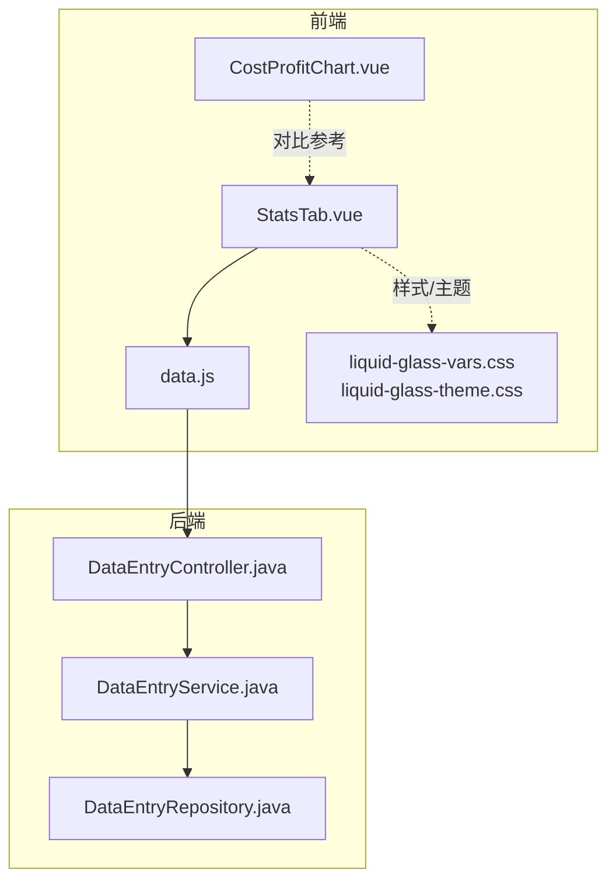
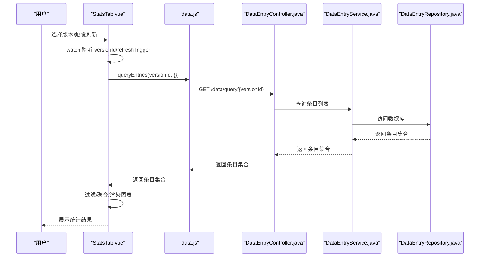
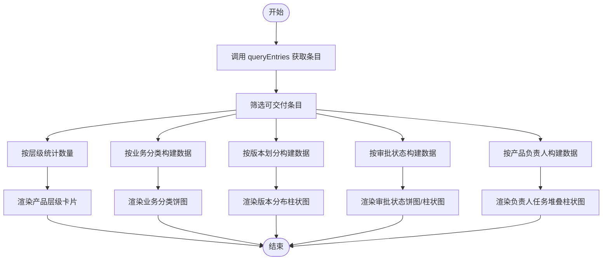
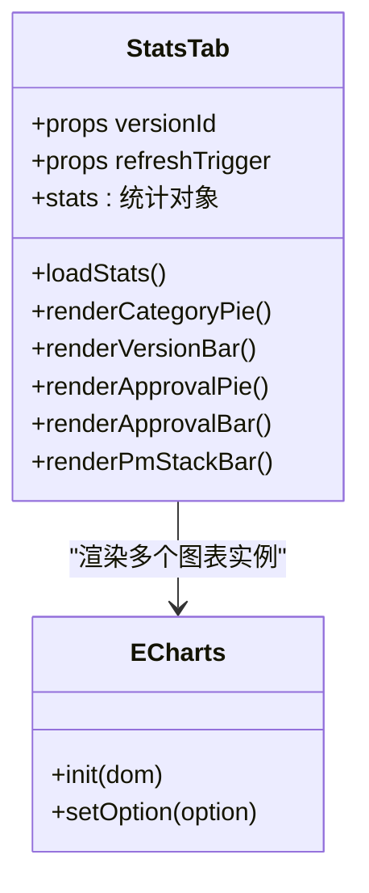
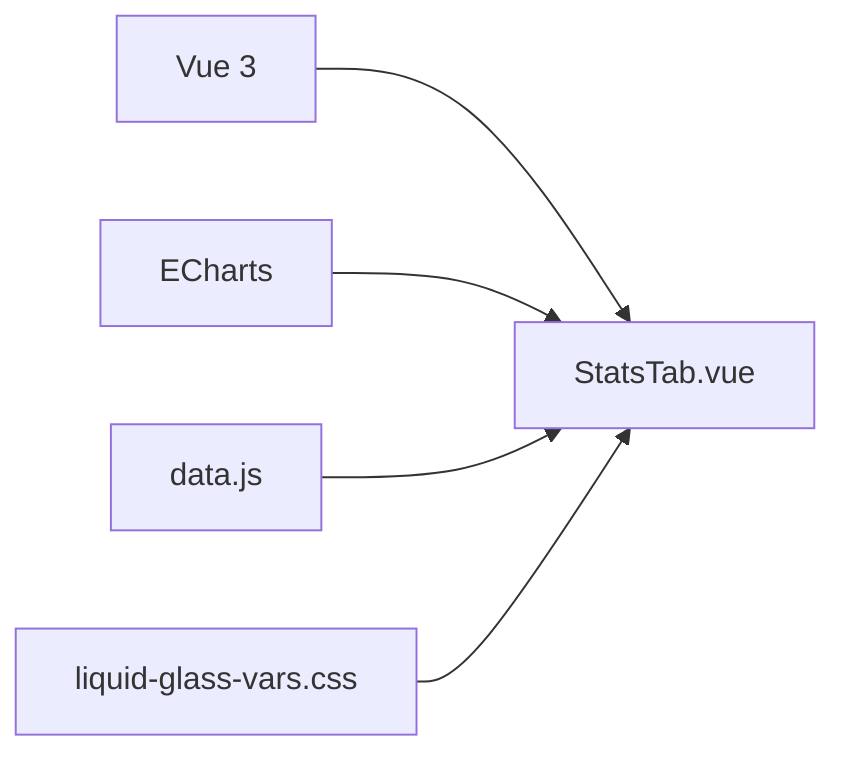

# StatsTab 统计分析组件

<cite>
**本文档引用的文件**
- [StatsTab.vue](file://frontend/src/components/StatsTab.vue)
- [data.js](file://frontend/src/api/data.js)
- [2026-05-27-liquid-glass-redesign.md](file://docs/superpowers/plans/2026-05-27-liquid-glass-redesign.md)
- [charts.csv](file://.opencode/skills/ui-ux-pro-max/data/charts.csv)
- [styles.csv](file://.opencode/skills/ui-ux-pro-max/data/styles.csv)
- [ux-guidelines.csv](file://.opencode/skills/ui-ux-pro-max/data/ux-guidelines.csv)
- [html-tailwind.csv](file://.opencode/skills/ui-ux-pro-max/data/stacks/html-tailwind.csv)
- [CostProfitChart.vue](file://frontend/src/components/CostProfitChart.vue)
- [init.sql](file://src/main/resources/db/init.sql)
</cite>

## 目录
1. [简介](#简介)
2. [项目结构](#项目结构)
3. [核心组件](#核心组件)
4. [架构总览](#架构总览)
5. [详细组件分析](#详细组件分析)
6. [依赖关系分析](#依赖关系分析)
7. [性能考虑](#性能考虑)
8. [故障排查指南](#故障排查指南)
9. [结论](#结论)
10. [附录](#附录)

## 简介
StatsTab 是一个基于 Vue 3 + ECharts 的统计分析组件，负责在指定版本维度下展示产品层级数据的多维统计视图。组件通过请求后端数据接口获取条目集合，进行过滤与聚合，生成多个图表（饼图、柱状图、堆叠柱状图）以直观呈现可交付功能的审批状态分布、产品功能维护任务分布、业务分类与版本分布等关键指标。同时，组件内置响应式布局与主题变量，确保在不同设备与主题下保持一致的视觉与交互体验。

## 项目结构
StatsTab 组件位于前端组件目录，配合统一的 API 层与主题样式系统工作：
- 组件：frontend/src/components/StatsTab.vue
- 数据接口：frontend/src/api/data.js
- 主题与样式参考：frontend/src/styles/*.css
- 设计规范与图表选型参考：docs/superpowers/plans/2026-05-27-liquid-glass-redesign.md、.opencode/skills/ui-ux-pro-max/data/charts.csv、styles.csv、ux-guidelines.csv、html-tailwind.csv
- 示例对比组件：frontend/src/components/CostProfitChart.vue
- 后端数据模型参考：src/main/resources/db/init.sql

**图表来源**
- [StatsTab.vue:1-343](file://frontend/src/components/StatsTab.vue#L1-L343)
- [data.js:1-128](file://frontend/src/api/data.js#L1-L128)

**章节来源**
- [StatsTab.vue:1-48](file://frontend/src/components/StatsTab.vue#L1-L48)
- [data.js:19-21](file://frontend/src/api/data.js#L19-L21)

## 核心组件
- 组件职责
  - 接收版本标识与刷新触发器作为属性，监听变化并重新加载数据。
  - 调用数据接口获取条目列表，按层级与字段进行过滤与聚合。
  - 使用 ECharts 渲染多种图表，包括可交付功能审批完成度饼图、审批状态柱状图、产品功能维护任务堆叠柱状图、业务分类与版本分布图。
  - 提供响应式布局与主题变量，适配不同屏幕尺寸与主题风格。

- 关键实现点
  - 数据加载与聚合：根据 level 字段区分 L3/L4/L5/L6 层级，统计各类别数量；根据审批状态与产品负责人进行分组统计。
  - 图表渲染：封装独立渲染函数，初始化实例并设置选项，支持空态与动态尺寸检测。
  - 响应式与主题：使用 CSS 变量与 scoped 样式，结合设计规范中的配色与排版建议。

**章节来源**
- [StatsTab.vue:50-124](file://frontend/src/components/StatsTab.vue#L50-L124)
- [StatsTab.vue:126-282](file://frontend/src/components/StatsTab.vue#L126-L282)

## 架构总览
组件采用“组件驱动 + API 调用 + ECharts 渲染”的三层架构：
- 视图层：StatsTab.vue 负责模板与样式，组织图表容器与标题。
- 逻辑层：组件内部函数负责数据获取、聚合与图表渲染。
- 数据层：通过 data.js 封装的请求方法调用后端接口，返回条目数据。

**图表来源**
- [StatsTab.vue:75-124](file://frontend/src/components/StatsTab.vue#L75-L124)
- [data.js:19-21](file://frontend/src/api/data.js#L19-L21)

## 详细组件分析

### 数据流与统计逻辑
- 数据来源
  - 通过 queryEntries(versionId, {}) 获取当前版本下的所有条目。
  - 以“可交付”状态作为筛选条件，限定后续统计范围。
- 统计指标
  - 产品总数、模块总数、功能总数、子功能总数：按层级 level 进行计数。
  - 业务分类分布：按 colBizCategory 聚合，生成饼图数据。
  - 版本分布：按 colVersionDivision 的分组值进行计数，生成柱状图数据。
  - 审批状态分布：按 approvalStatus 聚合，生成饼图与柱状图。
  - 产品负责人任务分布：按 colProductManager 分组，统计各审批状态的数量，生成堆叠柱状图。

**图表来源**
- [StatsTab.vue:75-124](file://frontend/src/components/StatsTab.vue#L75-L124)
- [StatsTab.vue:126-282](file://frontend/src/components/StatsTab.vue#L126-L282)

**章节来源**
- [StatsTab.vue:75-124](file://frontend/src/components/StatsTab.vue#L75-L124)

### 图表类型与配置
- 图表类型选择
  - 饼图：用于部分到整体的比例展示（业务分类、审批完成度）。
  - 柱状图：用于类别对比与数值展示（版本分布、审批状态）。
  - 堆叠柱状图：用于多维度分组（产品负责人任务分布）。
- ECharts 配置要点
  - 尺寸与网格：设置 grid、xAxis/yAxis、barWidth、label 显示。
  - 颜色体系：为不同状态/分类配置固定颜色，保证跨图表一致性。
  - 交互：启用 tooltip、emphasis、legend，提升可读性与可用性。
  - 空态处理：当无数据时显示占位项，避免渲染异常。

**图表来源**
- [StatsTab.vue:126-282](file://frontend/src/components/StatsTab.vue#L126-L282)

**章节来源**
- [StatsTab.vue:126-282](file://frontend/src/components/StatsTab.vue#L126-L282)

### 数据源管理与缓存策略
- 实时数据更新
  - 通过 watch 监听 versionId 与 refreshTrigger，触发重新加载。
  - 在容器尚未渲染完成时，使用 nextTick 回退重试，确保 ECharts 初始化成功。
- 历史数据对比
  - 当前实现聚焦于单版本数据的统计与展示，未直接提供跨版本对比逻辑。
- 缓存策略
  - 组件未实现本地缓存；建议在 API 层或服务层引入缓存与去重机制，减少重复请求。

**章节来源**
- [StatsTab.vue:284-286](file://frontend/src/components/StatsTab.vue#L284-L286)

### 图表配置系统
- 颜色主题
  - 使用 ECharts series.itemStyle 与 color 配置颜色，确保与设计规范一致。
  - 可参考“液体玻璃”主题的配色建议，统一主色与强调色。
- 字体设置
  - 标题与标签使用 CSS 变量，确保在不同主题下保持一致的字体族与字号。
- 尺寸调整
  - 通过 grid、barWidth、label 配置实现紧凑布局与清晰标注。
- 响应式布局
  - 使用 Flex 布局与 gap 控制卡片间距，结合 CSS 变量实现主题化外观。

**章节来源**
- [StatsTab.vue:289-342](file://frontend/src/components/StatsTab.vue#L289-L342)
- [2026-05-27-liquid-glass-redesign.md:1191-1216](file://docs/superpowers/plans/2026-05-27-liquid-glass-redesign.md#L1191-L1216)

### 性能优化方案
- 大数据量处理
  - ECharts 默认具备较好的渲染性能；可通过减少 series 数量、合并小类、延迟渲染等方式进一步优化。
- 图表渲染优化
  - 避免频繁 setOption，尽量批量更新；在容器尺寸未就绪时延迟初始化。
- 内存使用控制
  - 在组件卸载时销毁 ECharts 实例，释放 DOM 引用；避免重复初始化导致的内存泄漏。

**章节来源**
- [StatsTab.vue:64-73](file://frontend/src/components/StatsTab.vue#L64-L73)

### 可访问性设计与国际化支持
- 可访问性
  - 使用语义化标题与标签，确保屏幕阅读器可识别图表内容。
  - 提供高对比度与合适的字号，满足 WCAG 要求。
- 国际化
  - 标签文本与格式化字符串可本地化，建议在 i18n 系统中集中管理。
  - 图表提示框的格式化函数可注入语言参数，实现多语言提示。

**章节来源**
- [ux-guidelines.csv:66-73](file://.opencode/skills/ui-ux-pro-max/data/ux-guidelines.csv#L66-L73)
- [styles.csv:9-18](file://.opencode/skills/ui-ux-pro-max/data/styles.csv#L9-L18)

### 配置示例与扩展方法
- 配置示例
  - 版本维度：通过 props.versionId 指定版本 ID。
  - 刷新触发：通过 props.refreshTrigger 触发重新加载。
  - 图表颜色：在渲染函数中为每个 series 指定颜色，保持一致性。
- 扩展方法
  - 新增图表：仿照现有渲染函数，新增独立渲染方法，并在模板中添加容器。
  - 数据维度：可在聚合阶段加入更多字段分组，如按负责人、时间区间等。
  - 交互增强：为图表添加点击钻取、缩放、导出等功能。

**章节来源**
- [StatsTab.vue:55-56](file://frontend/src/components/StatsTab.vue#L55-L56)
- [StatsTab.vue:126-282](file://frontend/src/components/StatsTab.vue#L126-L282)

## 依赖关系分析
- 组件依赖
  - Vue 3 响应式系统：ref、watch、onMounted、nextTick。
  - ECharts：图表渲染与交互。
  - data.js：统一的 API 请求封装。
- 外部依赖
  - Element Plus（由主题样式推断）：可能用于基础 UI 组件。
- 潜在循环依赖
  - 组件与 API 层之间为单向依赖，无循环风险。

**图表来源**
- [StatsTab.vue:50-56](file://frontend/src/components/StatsTab.vue#L50-L56)
- [data.js:1-128](file://frontend/src/api/data.js#L1-L128)

**章节来源**
- [StatsTab.vue:50-56](file://frontend/src/components/StatsTab.vue#L50-L56)
- [data.js:1-128](file://frontend/src/api/data.js#L1-L128)

## 性能考虑
- 渲染性能
  - 合理设置图表尺寸与标签密度，避免过度拥挤。
  - 使用 ECharts 的大数据优化选项（如大数据模式）。
- 网络性能
  - 对查询接口进行必要的分页与过滤，减少一次性传输大量数据。
- 内存管理
  - 在组件卸载时销毁 ECharts 实例，防止内存泄漏。

## 故障排查指南
- 图表不显示或空白
  - 检查容器尺寸是否为 0，必要时使用 nextTick 重试初始化。
  - 确认 ECharts 实例未被重复初始化。
- 数据为空
  - 确认版本 ID 正确且该版本存在可交付条目。
  - 检查后端接口返回结构与字段映射。
- 颜色与主题不一致
  - 校验 CSS 变量与 ECharts 颜色配置，确保与设计规范一致。

**章节来源**
- [StatsTab.vue:126-132](file://frontend/src/components/StatsTab.vue#L126-L132)
- [StatsTab.vue:195-201](file://frontend/src/components/StatsTab.vue#L195-L201)

## 结论
StatsTab 组件通过清晰的数据流与模块化的图表渲染，实现了对产品层级数据的多维统计展示。其响应式布局与主题变量使组件在不同环境下保持一致的视觉体验。未来可在缓存策略、跨版本对比、交互增强与国际化方面进一步完善，以满足更复杂的业务需求。

## 附录
- 设计与图表选型参考
  - 最佳图表类型与颜色建议：参见 charts.csv。
  - 数据密集型仪表盘设计要点：参见 styles.csv。
  - 可访问性与响应式设计指南：参见 ux-guidelines.csv、html-tailwind.csv。
- 示例对比组件
  - 成本利润图表组件可作为复杂图表的参考实现：参见 CostProfitChart.vue。
- 后端数据模型参考
  - 数据模型字段与含义可辅助理解字段来源与聚合逻辑：参见 init.sql。

**章节来源**
- [.opencode/skills/ui-ux-pro-max/data/charts.csv:1-18](file://.opencode/skills/ui-ux-pro-max/data/charts.csv#L1-L18)
- [.opencode/skills/ui-ux-pro-max/data/styles.csv:29-29](file://.opencode/skills/ui-ux-pro-max/data/styles.csv#L29-L29)
- [.opencode/skills/ui-ux-pro-max/data/ux-guidelines.csv:66-73](file://.opencode/skills/ui-ux-pro-max/data/ux-guidelines.csv#L66-L73)
- [.opencode/skills/ui-ux-pro-max/data/stacks/html-tailwind.csv:31-35](file://.opencode/skills/ui-ux-pro-max/data/stacks/html-tailwind.csv#L31-L35)
- [CostProfitChart.vue:266-343](file://frontend/src/components/CostProfitChart.vue#L266-L343)
- [init.sql:108-125](file://src/main/resources/db/init.sql#L108-L125)