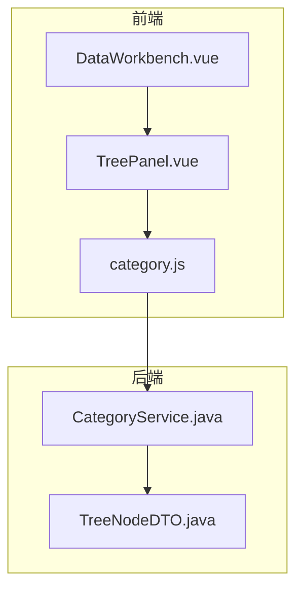
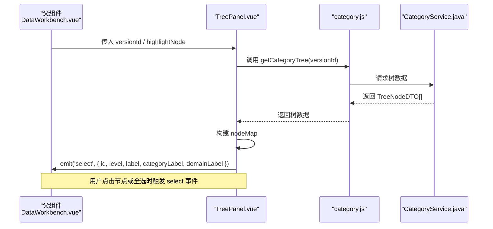
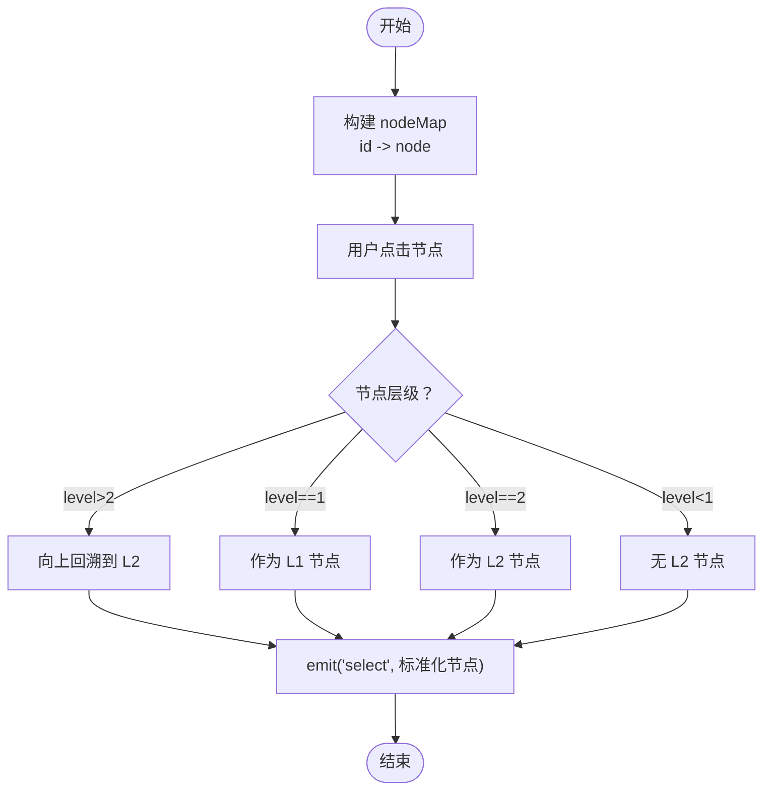
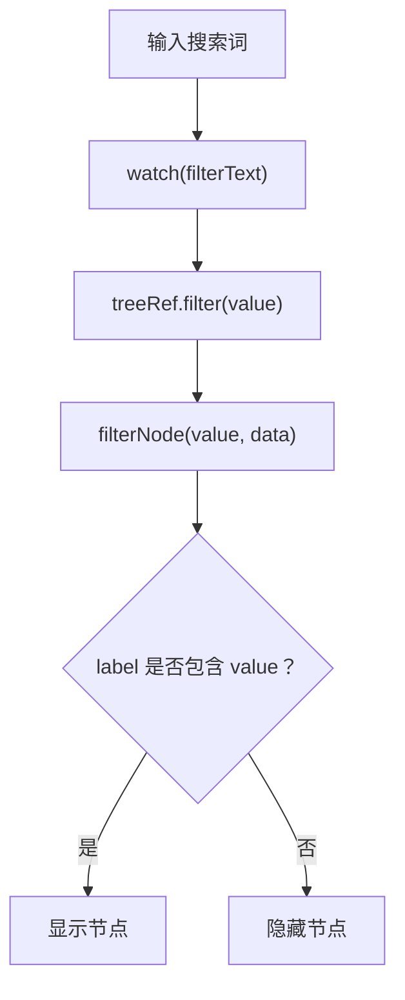
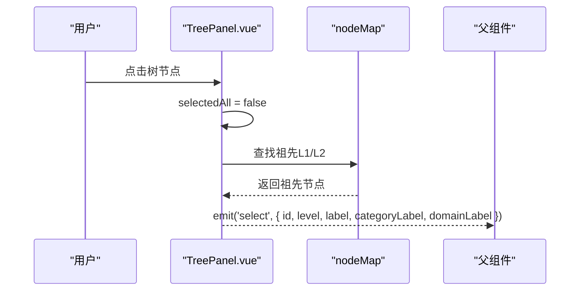
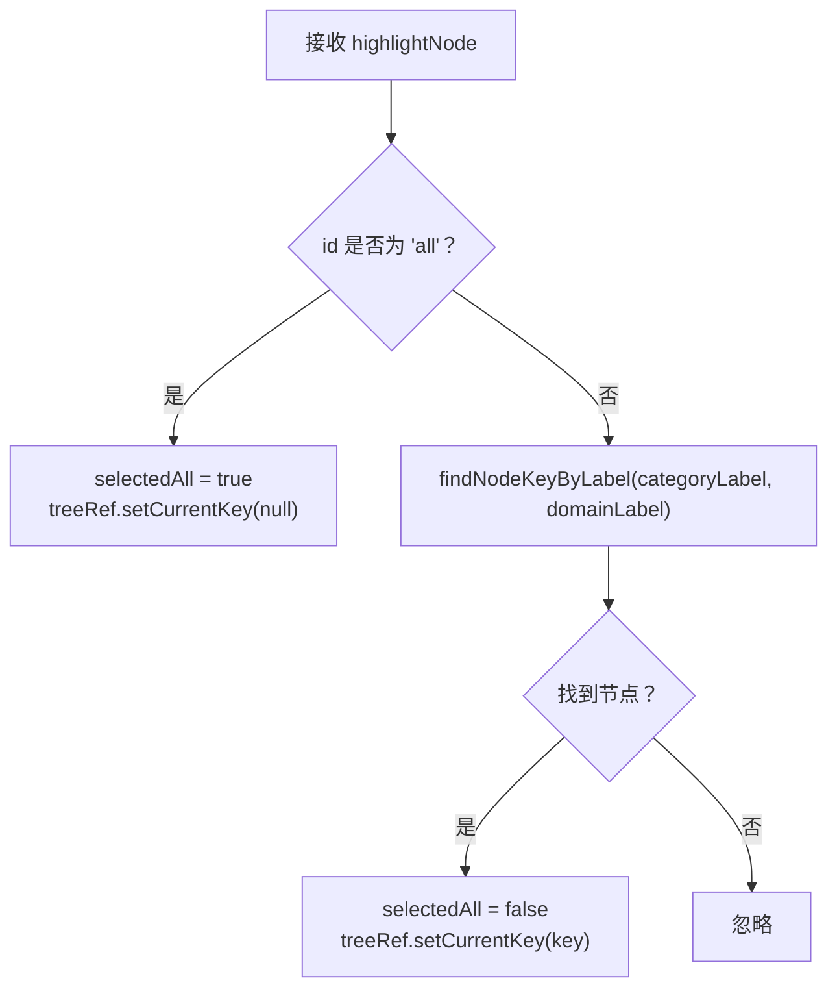
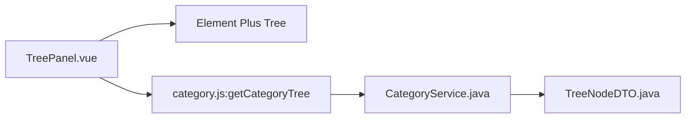

# TreePanel 树形面板组件

<cite>
**本文档引用的文件**
- [TreePanel.vue](file://frontend/src/components/TreePanel.vue)
- [category.js](file://frontend/src/api/category.js)
- [DataWorkbench.vue](file://frontend/src/views/dashboard/DataWorkbench.vue)
- [TreeNodeDTO.java](file://src/main/java/com/superpower/modules/data/dto/TreeNodeDTO.java)
- [CategoryService.java](file://src/main/java/com/superpower/modules/category/service/CategoryService.java)
- [2026-05-26-static-tree-design.md](file://docs/superpowers/specs/2026-05-26-static-tree-design.md)
- [2026-05-29-unify-category-datasource.md](file://docs/superpowers/plans/2026-05-29-unify-category-datasource.md)
</cite>

## 目录
1. [简介](#简介)
2. [项目结构](#项目结构)
3. [核心组件](#核心组件)
4. [架构总览](#架构总览)
5. [详细组件分析](#详细组件分析)
6. [依赖分析](#依赖分析)
7. [性能考虑](#性能考虑)
8. [故障排除指南](#故障排除指南)
9. [结论](#结论)
10. [附录](#附录)

## 简介
TreePanel 是一个基于 Vue 3 Composition API 和 Element Plus Tree 组件封装的树形面板组件，用于在工作台中进行分类/业务域的层级导航与筛选。其核心能力包括：
- 分类搜索过滤：通过输入框实时过滤节点
- 节点点击选择：支持点击任意层级节点并向上回溯到分类/域级别
- 高亮显示：根据父组件传入的高亮节点自动定位当前选中项
- 全选功能：一键清空选择，等价于“全部”状态
- 响应式设计：通过 versionId 切换版本树，通过 highlightNode 实现跨组件联动

组件对外仅暴露两个 props（versionId、highlightNode）与一个事件（select），便于在父组件中统一管理状态与行为。

## 项目结构
TreePanel 组件位于前端组件目录，配合 API 层与后端服务共同完成树形数据的获取与渲染。关键文件与职责如下：
- 组件层：frontend/src/components/TreePanel.vue
- API 层：frontend/src/api/category.js（封装树接口）
- 视图层：frontend/src/views/dashboard/DataWorkbench.vue（使用 TreePanel 并处理选择事件）
- 数据模型：src/main/java/com/superpower/modules/data/dto/TreeNodeDTO.java（树节点数据结构）
- 服务层：src/main/java/com/superpower/modules/category/service/CategoryService.java（树数据构造）

**图表来源**
- [TreePanel.vue:1-200](file://frontend/src/components/TreePanel.vue#L1-L200)
- [category.js:1-33](file://frontend/src/api/category.js#L1-L33)
- [DataWorkbench.vue:60-110](file://frontend/src/views/dashboard/DataWorkbench.vue#L60-L110)
- [CategoryService.java:36-46](file://src/main/java/com/superpower/modules/category/service/CategoryService.java#L36-L46)
- [TreeNodeDTO.java:1-15](file://src/main/java/com/superpower/modules/data/dto/TreeNodeDTO.java#L1-L15)

**章节来源**
- [TreePanel.vue:1-200](file://frontend/src/components/TreePanel.vue#L1-L200)
- [category.js:1-33](file://frontend/src/api/category.js#L1-L33)
- [DataWorkbench.vue:60-110](file://frontend/src/views/dashboard/DataWorkbench.vue#L60-L110)
- [CategoryService.java:36-46](file://src/main/java/com/superpower/modules/category/service/CategoryService.java#L36-L46)
- [TreeNodeDTO.java:1-15](file://src/main/java/com/superpower/modules/data/dto/TreeNodeDTO.java#L1-L15)

## 核心组件
- 组件名称：TreePanel
- 组件类型：Vue 单文件组件（Composition API）
- 主要职责：
  - 加载指定版本的树形数据
  - 构建节点映射表以支持快速查找
  - 提供搜索过滤、节点点击选择、全选与高亮显示
  - 将选择结果以标准化结构向上抛出

- 对外接口
  - Props
    - versionId：Number | String，版本标识，驱动树数据加载与刷新
    - highlightNode：Object，高亮节点对象，包含 id、categoryLabel、domainLabel 等字段
  - Emits
    - select：当用户选择节点或触发全选时，向父组件传递标准化的节点信息

- 内部状态
  - treeData：树形数据数组
  - nodeMap：节点映射表（id -> node），用于快速定位与祖先查找
  - selectedAll：是否处于“全部”状态
  - filterText：搜索关键词
  - treeRef：Element Plus Tree 组件实例引用

**章节来源**
- [TreePanel.vue:38-67](file://frontend/src/components/TreePanel.vue#L38-L67)
- [TreePanel.vue:108-117](file://frontend/src/components/TreePanel.vue#L108-L117)
- [TreePanel.vue:133-142](file://frontend/src/components/TreePanel.vue#L133-L142)

## 架构总览
TreePanel 的数据流自上而下为：父组件传入 versionId 与 highlightNode，组件内部通过 API 获取树数据并构建 nodeMap；用户交互触发事件，组件将标准化后的节点信息向上抛出，供父组件消费。

**图表来源**
- [TreePanel.vue:59-67](file://frontend/src/components/TreePanel.vue#L59-L67)
- [TreePanel.vue:133-142](file://frontend/src/components/TreePanel.vue#L133-L142)
- [category.js:3-5](file://frontend/src/api/category.js#L3-L5)
- [CategoryService.java:36-46](file://src/main/java/com/superpower/modules/category/service/CategoryService.java#L36-L46)

## 详细组件分析

### 数据结构设计
- 树节点数据模型
  - TreeNodeDTO 字段：id、parentId、level、label、sortOrder、isLeaf、children
  - 组件约定：props.treeProps 映射 children、label、isLeaf；node-key 为 id
- 节点映射机制
  - buildNodeMap：递归遍历树，建立 id 到节点的映射，便于快速查找与祖先回溯
- 层级关系处理
  - findAncestor：从当前节点沿 parentId 向上回溯，直到目标层级（1 或 2）
  - findNodeKeyByLabel：根据分类/域标签在 nodeMap 中查找对应节点 id

**图表来源**
- [TreePanel.vue:101-106](file://frontend/src/components/TreePanel.vue#L101-L106)
- [TreePanel.vue:120-131](file://frontend/src/components/TreePanel.vue#L120-L131)
- [TreePanel.vue:133-142](file://frontend/src/components/TreePanel.vue#L133-L142)

**章节来源**
- [TreeNodeDTO.java:1-15](file://src/main/java/com/superpower/modules/data/dto/TreeNodeDTO.java#L1-L15)
- [TreePanel.vue:50-53](file://frontend/src/components/TreePanel.vue#L50-L53)
- [TreePanel.vue:101-106](file://frontend/src/components/TreePanel.vue#L101-L106)
- [TreePanel.vue:120-131](file://frontend/src/components/TreePanel.vue#L120-L131)

### 核心功能详解

#### 分类搜索过滤
- 输入框绑定 filterText，watch 监听变化后调用 Element Plus Tree 的 filter 方法
- filterNode 实现按节点 label 包含匹配的过滤逻辑

**图表来源**
- [TreePanel.vue:55-57](file://frontend/src/components/TreePanel.vue#L55-L57)
- [TreePanel.vue:114-117](file://frontend/src/components/TreePanel.vue#L114-L117)

**章节来源**
- [TreePanel.vue:55-57](file://frontend/src/components/TreePanel.vue#L55-L57)
- [TreePanel.vue:114-117](file://frontend/src/components/TreePanel.vue#L114-L117)

#### 节点点击选择
- onNodeClick：将当前节点标准化为包含 id、level、label，并补充 categoryLabel 与 domainLabel
- 若点击节点层级大于 2，则通过 findAncestor 回溯到 L2；若等于 1 则直接使用该节点作为 L1

**图表来源**
- [TreePanel.vue:133-142](file://frontend/src/components/TreePanel.vue#L133-L142)
- [TreePanel.vue:120-131](file://frontend/src/components/TreePanel.vue#L120-L131)

**章节来源**
- [TreePanel.vue:133-142](file://frontend/src/components/TreePanel.vue#L133-L142)
- [TreePanel.vue:120-131](file://frontend/src/components/TreePanel.vue#L120-L131)

#### 高亮显示
- highlightNode 由父组件传入，组件根据 id 或标签匹配定位到具体节点
- 当 id 为 'all' 时，表示“全部”，清除当前高亮
- 否则通过 findNodeKeyByLabel 在 nodeMap 中查找对应 id 并设置当前高亮

**图表来源**
- [TreePanel.vue:69-81](file://frontend/src/components/TreePanel.vue#L69-L81)
- [TreePanel.vue:83-99](file://frontend/src/components/TreePanel.vue#L83-L99)

**章节来源**
- [TreePanel.vue:69-81](file://frontend/src/components/TreePanel.vue#L69-L81)
- [TreePanel.vue:83-99](file://frontend/src/components/TreePanel.vue#L83-L99)

#### 全选功能
- selectAll：将 selectedAll 设为 true，清空当前高亮，并发出 { id: 'all', level: 0, label: '全部' } 的选择事件
- 适用于“全部”筛选场景，便于父组件统一处理

**章节来源**
- [TreePanel.vue:108-112](file://frontend/src/components/TreePanel.vue#L108-L112)

### 响应式设计模式
- versionId 变更：触发树数据重新加载，重建 nodeMap，并自动进入“全部”状态
- highlightNode 变更：在 post 阶段执行，确保 DOM 已更新后再进行高亮定位
- filterText 变更：立即触发过滤，无需等待

**章节来源**
- [TreePanel.vue:59-67](file://frontend/src/components/TreePanel.vue#L59-L67)
- [TreePanel.vue:69-81](file://frontend/src/components/TreePanel.vue#L69-L81)
- [TreePanel.vue:55-57](file://frontend/src/components/TreePanel.vue#L55-L57)

### 事件发射机制与父组件数据传递
- TreePanel 仅通过 select 事件向上抛出标准化节点信息
- 父组件 DataWorkbench 在使用 TreePanel 时绑定 @select="onTreeSelect"，并在内部维护 selectedNode、activeTab 等状态
- 典型流程：用户点击节点 → TreePanel 发出 select 事件 → 父组件更新状态并触发列表刷新

**章节来源**
- [TreePanel.vue:46-46](file://frontend/src/components/TreePanel.vue#L46-L46)
- [DataWorkbench.vue:82-82](file://frontend/src/views/dashboard/DataWorkbench.vue#L82-L82)

### 样式定制、主题适配与可访问性
- 主题变量
  - 使用 CSS 变量（如 --si-text-secondary、--si-primary-soft 等）实现主题适配
  - 树节点内容、高亮态、悬停态均通过 :deep 作用域选择器覆盖 Element Plus 默认样式
- 可访问性
  - 使用 Element Plus Tree 的 highlight-current 与 setCurrentKey 实现键盘焦点与视觉高亮
  - 搜索框具备 clearable 与 prefix-icon，提升可用性
- 定制建议
  - 如需调整字体、间距、颜色，优先修改 CSS 变量定义
  - 如需扩展节点模板，可在具名插槽中自定义渲染

**章节来源**
- [TreePanel.vue:145-199](file://frontend/src/components/TreePanel.vue#L145-L199)

## 依赖分析
- 组件依赖
  - Element Plus Tree：提供树形渲染、过滤、高亮与节点点击事件
  - getCategoryTree API：从后端获取树数据
- 数据依赖
  - TreeNodeDTO：树节点标准数据结构
  - CategoryService：后端服务负责组装树数据（包含 level、parentId、label 等）

**图表来源**
- [TreePanel.vue:20-34](file://frontend/src/components/TreePanel.vue#L20-L34)
- [category.js:3-5](file://frontend/src/api/category.js#L3-L5)
- [CategoryService.java:36-46](file://src/main/java/com/superpower/modules/category/service/CategoryService.java#L36-L46)
- [TreeNodeDTO.java:1-15](file://src/main/java/com/superpower/modules/data/dto/TreeNodeDTO.java#L1-L15)

**章节来源**
- [TreePanel.vue:20-34](file://frontend/src/components/TreePanel.vue#L20-L34)
- [category.js:1-33](file://frontend/src/api/category.js#L1-L33)
- [CategoryService.java:36-46](file://src/main/java/com/superpower/modules/category/service/CategoryService.java#L36-L46)
- [TreeNodeDTO.java:1-15](file://src/main/java/com/superpower/modules/data/dto/TreeNodeDTO.java#L1-L15)

## 性能考虑
- 节点映射：buildNodeMap 为 O(N) 遍历，适合中大型树；建议避免频繁重建 nodeMap
- 过滤性能：filterNode 为字符串包含匹配，复杂度 O(N)；建议控制节点数量或增加索引策略
- 高亮定位：findNodeKeyByLabel 为线性扫描，建议在高频场景下缓存标签到 id 的映射
- 渲染优化：Element Plus Tree 默认开启虚拟滚动（取决于数据规模），可通过 props 控制展开策略减少初始渲染压力

[本节为通用性能建议，不直接分析具体文件]

## 故障排除指南
- 无法加载树数据
  - 检查 versionId 是否有效，确认 getCategoryTree 接口返回值结构与 TreeNodeDTO 一致
  - 确认后端 CategoryService 正确装配 level、parentId、label 等字段
- 高亮不生效
  - 确认 highlightNode 的 id 或标签与 nodeMap 中的节点匹配
  - 若传入 id 为 'all'，组件会清空高亮；需传入具体节点或使用 categoryLabel/domainLabel 定位
- 搜索无效
  - 确认 filterText 已绑定且 watch 生效
  - 确认 filterNode 的匹配逻辑满足预期（当前为 label 包含匹配）
- 父组件未收到 select 事件
  - 确认父组件正确绑定 @select 并实现处理逻辑
  - 确认 TreePanel 的 emit('select') 调用路径正确

**章节来源**
- [TreePanel.vue:59-67](file://frontend/src/components/TreePanel.vue#L59-L67)
- [TreePanel.vue:69-81](file://frontend/src/components/TreePanel.vue#L69-L81)
- [TreePanel.vue:114-117](file://frontend/src/components/TreePanel.vue#L114-L117)
- [TreePanel.vue:133-142](file://frontend/src/components/TreePanel.vue#L133-L142)

## 结论
TreePanel 通过简洁的 props 与事件设计，实现了版本化的树形导航与高亮联动，结合 Element Plus Tree 的强大能力，提供了良好的用户体验与可扩展性。其数据结构与算法设计清晰，易于维护与演进。建议在后续迭代中关注大数据量场景下的性能优化与可访问性增强。

[本节为总结性内容，不直接分析具体文件]

## 附录

### 使用示例与最佳实践
- 基本使用
  - 在父组件中传入 versionId，并绑定 @select 事件
  - 通过 highlightNode 实现跨组件高亮联动
- 最佳实践
  - 将 select 事件的处理集中在父组件，统一管理 selectedNode 与页面状态
  - 在高亮场景中，优先使用 { categoryLabel, domainLabel } 精确定位节点
  - 对于大量节点的场景，建议限制默认展开层级或采用懒加载策略

**章节来源**
- [DataWorkbench.vue:82-82](file://frontend/src/views/dashboard/DataWorkbench.vue#L82-L82)
- [TreePanel.vue:69-81](file://frontend/src/components/TreePanel.vue#L69-L81)

### 接口与数据规范
- 接口
  - GET /tree?versionId=X：返回 TreeNodeDTO 数组
- 数据模型
  - TreeNodeDTO：包含 id、parentId、level、label、sortOrder、isLeaf、children

**章节来源**
- [2026-05-26-static-tree-design.md:54-77](file://docs/superpowers/specs/2026-05-26-static-tree-design.md#L54-L77)
- [TreeNodeDTO.java:1-15](file://src/main/java/com/superpower/modules/data/dto/TreeNodeDTO.java#L1-L15)
- [category.js:3-5](file://frontend/src/api/category.js#L3-L5)