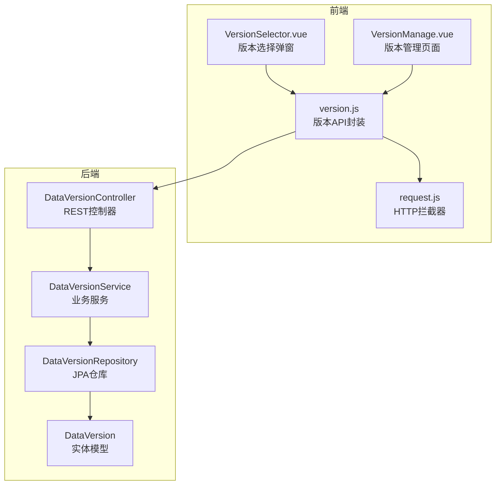
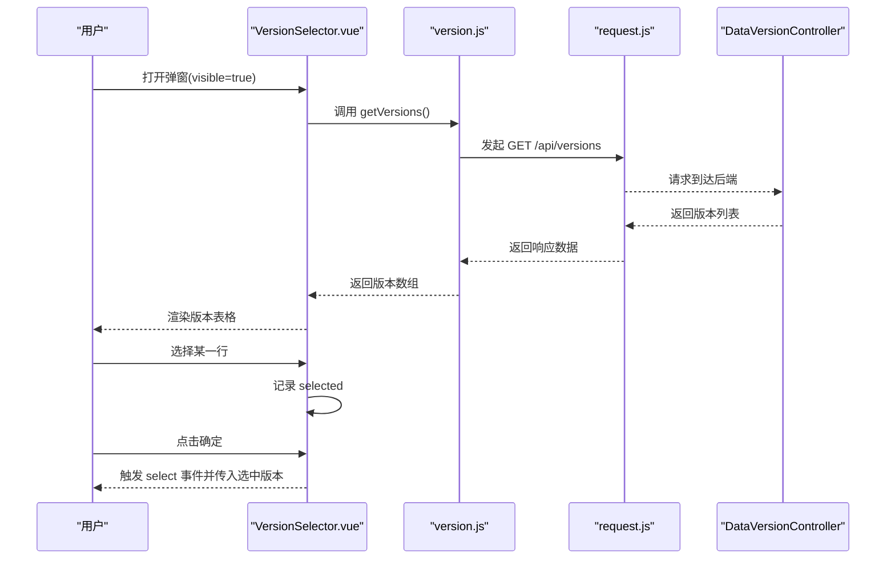
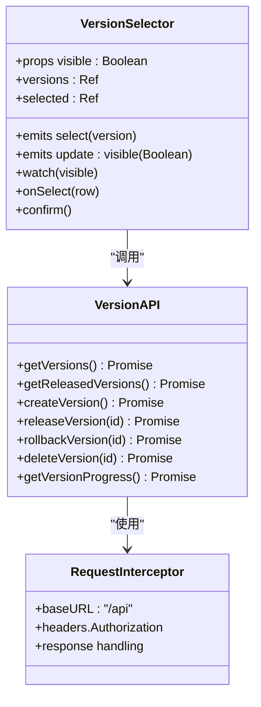
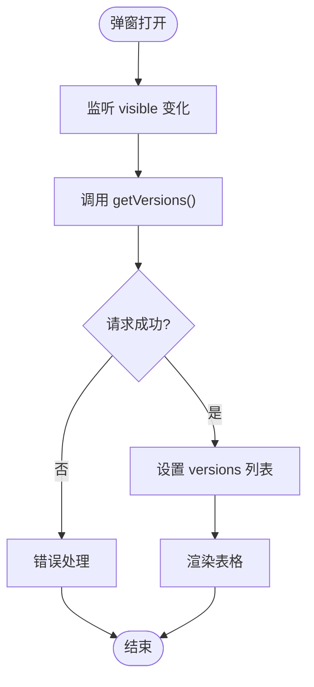
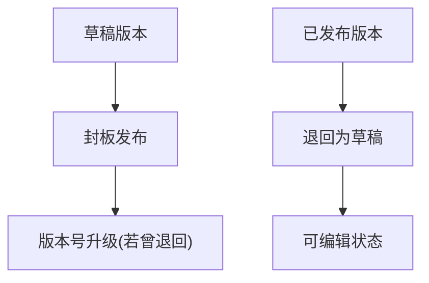
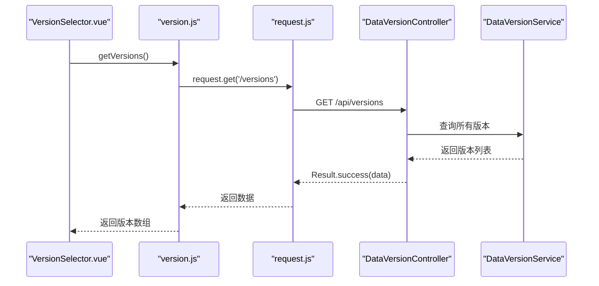
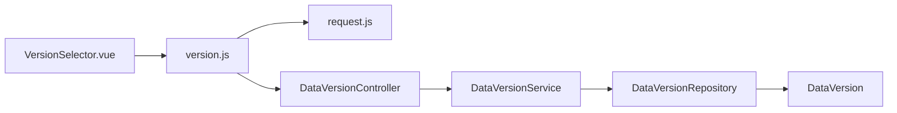

# VersionSelector 版本选择器组件

<cite>
**本文档引用的文件**
- [frontend/src/components/VersionSelector.vue](file://frontend/src/components/VersionSelector.vue)
- [frontend/src/api/version.js](file://frontend/src/api/version.js)
- [frontend/src/utils/request.js](file://frontend/src/utils/request.js)
- [src/main/java/com/superpower/modules/version/controller/DataVersionController.java](file://src/main/java/com/superpower/modules/version/controller/DataVersionController.java)
- [src/main/java/com/superpower/modules/version/service/DataVersionService.java](file://src/main/java/com/superpower/modules/version/service/DataVersionService.java)
- [src/main/java/com/superpower/modules/version/entity/DataVersion.java](file://src/main/java/com/superpower/modules/version/entity/DataVersion.java)
- [src/main/java/com/superpower/modules/version/repository/DataVersionRepository.java](file://src/main/java/com/superpower/modules/version/repository/DataVersionRepository.java)
- [frontend/src/views/system/VersionManage.vue](file://frontend/src/views/system/VersionManage.vue)
</cite>

## 目录
1. [简介](#简介)
2. [项目结构](#项目结构)
3. [核心组件](#核心组件)
4. [架构总览](#架构总览)
5. [详细组件分析](#详细组件分析)
6. [依赖关系分析](#依赖关系分析)
7. [性能考虑](#性能考虑)
8. [故障排除指南](#故障排除指南)
9. [结论](#结论)
10. [附录](#附录)

## 简介
VersionSelector 是一个基于 Element Plus 的 Vue 组件，用于在弹窗中展示系统中的版本列表，并允许用户选择某个版本。组件通过调用后端版本查询接口获取版本数据，在用户确认后向父组件发出选中事件，便于上层业务根据所选版本执行后续操作（如切换当前版本、刷新数据等）。该组件具备以下特性：
- 动态加载版本列表：在弹窗打开时触发版本数据拉取
- 状态化管理：使用响应式 ref 维护版本列表与当前选中项
- 事件驱动：对外暴露 select 事件以通知父组件版本变更
- 与后端 API 解耦：通过统一的 API 模块进行网络请求

## 项目结构
VersionSelector 组件位于前端组件目录，配合 API 层与后端控制器共同完成版本选择功能。后端采用 Spring Boot 提供 REST 接口，服务层负责版本生命周期管理（创建、发布、回滚、删除等），并支持异步进度上报。

**图表来源**
- [frontend/src/components/VersionSelector.vue:1-56](file://frontend/src/components/VersionSelector.vue#L1-L56)
- [frontend/src/api/version.js:1-34](file://frontend/src/api/version.js#L1-L34)
- [frontend/src/utils/request.js:1-65](file://frontend/src/utils/request.js#L1-L65)
- [src/main/java/com/superpower/modules/version/controller/DataVersionController.java:1-106](file://src/main/java/com/superpower/modules/version/controller/DataVersionController.java#L1-L106)
- [src/main/java/com/superpower/modules/version/service/DataVersionService.java:1-721](file://src/main/java/com/superpower/modules/version/service/DataVersionService.java#L1-L721)
- [src/main/java/com/superpower/modules/version/repository/DataVersionRepository.java:1-20](file://src/main/java/com/superpower/modules/version/repository/DataVersionRepository.java#L1-L20)
- [src/main/java/com/superpower/modules/version/entity/DataVersion.java:1-36](file://src/main/java/com/superpower/modules/version/entity/DataVersion.java#L1-L36)

**章节来源**
- [frontend/src/components/VersionSelector.vue:1-56](file://frontend/src/components/VersionSelector.vue#L1-L56)
- [frontend/src/api/version.js:1-34](file://frontend/src/api/version.js#L1-L34)
- [frontend/src/utils/request.js:1-65](file://frontend/src/utils/request.js#L1-L65)
- [src/main/java/com/superpower/modules/version/controller/DataVersionController.java:1-106](file://src/main/java/com/superpower/modules/version/controller/DataVersionController.java#L1-L106)
- [src/main/java/com/superpower/modules/version/service/DataVersionService.java:1-721](file://src/main/java/com/superpower/modules/version/service/DataVersionService.java#L1-L721)
- [src/main/java/com/superpower/modules/version/repository/DataVersionRepository.java:1-20](file://src/main/java/com/superpower/modules/version/repository/DataVersionRepository.java#L1-L20)
- [src/main/java/com/superpower/modules/version/entity/DataVersion.java:1-36](file://src/main/java/com/superpower/modules/version/entity/DataVersion.java#L1-L36)

## 核心组件
VersionSelector 组件的核心职责是：
- 在可见性变化时动态加载版本列表
- 支持表格行选择并触发确认事件
- 将用户选择的版本传递给父组件

其关键实现要点：
- 使用 watch 监听 visible 属性变化，打开时拉取版本数据
- 使用 el-dialog 包裹，支持外部控制显示隐藏
- 使用 el-table 渲染版本列表，包含版本号、状态、发布时间、创建时间
- 通过 select 事件向外广播选中结果

**章节来源**
- [frontend/src/components/VersionSelector.vue:29-56](file://frontend/src/components/VersionSelector.vue#L29-L56)

## 架构总览
VersionSelector 与后端交互遵循前后端分离架构：
- 前端通过 API 模块封装 HTTP 请求，统一设置 baseURL、超时与认证头
- 后端提供版本查询接口，返回版本列表（含状态、发布时间、创建时间等字段）
- 组件仅负责 UI 表现与事件分发，不直接操作数据持久层

**图表来源**
- [frontend/src/components/VersionSelector.vue:39-54](file://frontend/src/components/VersionSelector.vue#L39-L54)
- [frontend/src/api/version.js:7-9](file://frontend/src/api/version.js#L7-L9)
- [frontend/src/utils/request.js:5-30](file://frontend/src/utils/request.js#L5-L30)
- [src/main/java/com/superpower/modules/version/controller/DataVersionController.java:36-59](file://src/main/java/com/superpower/modules/version/controller/DataVersionController.java#L36-L59)

## 详细组件分析

### 组件类图

**图表来源**
- [frontend/src/components/VersionSelector.vue:29-56](file://frontend/src/components/VersionSelector.vue#L29-L56)
- [frontend/src/api/version.js:1-34](file://frontend/src/api/version.js#L1-L34)
- [frontend/src/utils/request.js:1-65](file://frontend/src/utils/request.js#L1-L65)

**章节来源**
- [frontend/src/components/VersionSelector.vue:29-56](file://frontend/src/components/VersionSelector.vue#L29-L56)
- [frontend/src/api/version.js:1-34](file://frontend/src/api/version.js#L1-L34)
- [frontend/src/utils/request.js:1-65](file://frontend/src/utils/request.js#L1-L65)

### 版本数据获取与缓存机制
- 动态加载：组件通过 watch 监听 visible 变化，当弹窗打开时才发起请求获取版本列表，避免不必要的网络开销
- 缓存策略：当前实现未在组件内引入本地缓存；每次打开弹窗都会重新拉取最新版本列表
- 数据绑定：使用 ref 维护版本列表与选中项，确保响应式更新

**图表来源**
- [frontend/src/components/VersionSelector.vue:39-44](file://frontend/src/components/VersionSelector.vue#L39-L44)
- [frontend/src/api/version.js:7-9](file://frontend/src/api/version.js#L7-L9)
- [frontend/src/utils/request.js:32-62](file://frontend/src/utils/request.js#L32-L62)

**章节来源**
- [frontend/src/components/VersionSelector.vue:39-44](file://frontend/src/components/VersionSelector.vue#L39-L44)
- [frontend/src/api/version.js:7-9](file://frontend/src/api/version.js#L7-L9)
- [frontend/src/utils/request.js:32-62](file://frontend/src/utils/request.js#L32-L62)

### 版本切换业务逻辑
- 草稿版本与正式版本：
  - 草稿版本：可编辑，支持封板发布
  - 正式版本：已发布，支持退回为草稿版本
- 版本激活流程：
  - 封板发布：将草稿版本状态置为已发布，并记录发布时间与发布人
  - 回退：将已发布版本退回为草稿版本，同时递增退回次数
- 数据同步机制：
  - 服务层在创建新版本时会复制清单数据、分类、产品、基础选项、图片资源、自定义清单等，并同步图片 URL 引用与 ID 映射
  - 删除版本时按顺序清理自定义清单、清单数据、分类、产品、基础选项、图片资源、文档生成记录与版本记录，并在事务完成后删除物理文件

**图表来源**
- [src/main/java/com/superpower/modules/version/service/DataVersionService.java:647-689](file://src/main/java/com/superpower/modules/version/service/DataVersionService.java#L647-L689)
- [src/main/java/com/superpower/modules/version/service/DataVersionService.java:152-203](file://src/main/java/com/superpower/modules/version/service/DataVersionService.java#L152-L203)

**章节来源**
- [src/main/java/com/superpower/modules/version/service/DataVersionService.java:647-689](file://src/main/java/com/superpower/modules/version/service/DataVersionService.java#L647-L689)
- [src/main/java/com/superpower/modules/version/service/DataVersionService.java:152-203](file://src/main/java/com/superpower/modules/version/service/DataVersionService.java#L152-L203)

### 状态管理模式
- 当前选中版本维护：组件内部使用 ref(selected) 记录用户在表格中选择的行
- 版本变更事件通知：点击确定按钮时，组件通过 select 事件将选中版本对象传递给父组件
- 数据绑定策略：版本列表通过 ref(versions) 绑定，表格高亮当前行，提升交互体验

**章节来源**
- [frontend/src/components/VersionSelector.vue:36-54](file://frontend/src/components/VersionSelector.vue#L36-L54)

### 与后端 API 的交互
- 版本查询接口：GET /api/versions 返回版本列表（包含 id、versionNo、status、releasedAt、releasedBy、rollbackCount、createdAt、updatedAt 等字段）
- 版本状态检查：GET /api/versions/progress 返回版本操作进度（用于版本管理页面的轮询）
- 其他相关接口：POST /api/versions、POST /api/versions/{id}/release、POST /api/versions/{id}/rollback、DELETE /api/versions/{id}

**图表来源**
- [frontend/src/api/version.js:7-9](file://frontend/src/api/version.js#L7-L9)
- [frontend/src/utils/request.js:5-30](file://frontend/src/utils/request.js#L5-L30)
- [src/main/java/com/superpower/modules/version/controller/DataVersionController.java:36-59](file://src/main/java/com/superpower/modules/version/controller/DataVersionController.java#L36-L59)

**章节来源**
- [frontend/src/api/version.js:1-34](file://frontend/src/api/version.js#L1-L34)
- [src/main/java/com/superpower/modules/version/controller/DataVersionController.java:36-59](file://src/main/java/com/superpower/modules/version/controller/DataVersionController.java#L36-L59)

### 错误处理与加载状态管理
- 错误处理：
  - HTTP 拦截器对非 200 响应统一弹出错误消息，并在 401/403 时跳转至登录页
  - 组件层面在确认选择时校验是否已选中版本，未选中则不触发事件
- 加载状态管理：
  - 组件未内置加载指示器；可在父组件中结合 Element Plus 的 Loading 或 Skeleton 进行增强
  - 建议在弹窗打开时增加加载态，提升用户体验

**章节来源**
- [frontend/src/utils/request.js:32-62](file://frontend/src/utils/request.js#L32-L62)
- [frontend/src/components/VersionSelector.vue:50-54](file://frontend/src/components/VersionSelector.vue#L50-L54)

### 用户体验优化建议
- 在弹窗打开时显示加载指示器
- 对空状态进行友好提示
- 支持键盘导航与快捷键（如 Enter 确认、Esc 取消）
- 增加搜索或筛选能力以便快速定位目标版本

## 依赖关系分析
- 组件依赖：
  - API 模块：封装版本相关请求方法
  - HTTP 拦截器：统一处理请求头与响应错误
- 后端依赖：
  - 控制器：提供版本查询与状态变更接口
  - 服务层：实现版本生命周期与数据同步
  - 仓库层：提供 JPA 查询能力
  - 实体模型：描述版本表结构与默认值

**图表来源**
- [frontend/src/components/VersionSelector.vue:30-31](file://frontend/src/components/VersionSelector.vue#L30-L31)
- [frontend/src/api/version.js:1](file://frontend/src/api/version.js#L1)
- [frontend/src/utils/request.js:1](file://frontend/src/utils/request.js#L1)
- [src/main/java/com/superpower/modules/version/controller/DataVersionController.java:20-34](file://src/main/java/com/superpower/modules/version/controller/DataVersionController.java#L20-L34)
- [src/main/java/com/superpower/modules/version/service/DataVersionService.java:37-102](file://src/main/java/com/superpower/modules/version/service/DataVersionService.java#L37-L102)
- [src/main/java/com/superpower/modules/version/repository/DataVersionRepository.java:9-19](file://src/main/java/com/superpower/modules/version/repository/DataVersionRepository.java#L9-L19)
- [src/main/java/com/superpower/modules/version/entity/DataVersion.java:7-35](file://src/main/java/com/superpower/modules/version/entity/DataVersion.java#L7-L35)

**章节来源**
- [frontend/src/components/VersionSelector.vue:30-31](file://frontend/src/components/VersionSelector.vue#L30-L31)
- [frontend/src/api/version.js:1](file://frontend/src/api/version.js#L1)
- [frontend/src/utils/request.js:1](file://frontend/src/utils/request.js#L1)
- [src/main/java/com/superpower/modules/version/controller/DataVersionController.java:20-34](file://src/main/java/com/superpower/modules/version/controller/DataVersionController.java#L20-L34)
- [src/main/java/com/superpower/modules/version/service/DataVersionService.java:37-102](file://src/main/java/com/superpower/modules/version/service/DataVersionService.java#L37-L102)
- [src/main/java/com/superpower/modules/version/repository/DataVersionRepository.java:9-19](file://src/main/java/com/superpower/modules/version/repository/DataVersionRepository.java#L9-L19)
- [src/main/java/com/superpower/modules/version/entity/DataVersion.java:7-35](file://src/main/java/com/superpower/modules/version/entity/DataVersion.java#L7-L35)

## 性能考虑
- 网络请求优化：
  - 在弹窗关闭时停止未完成的请求，避免资源浪费
  - 合理设置超时时间，防止长时间阻塞 UI
- 数据渲染优化：
  - 对于大量版本数据，建议启用虚拟滚动或分页
  - 避免在渲染过程中进行复杂计算，将格式化逻辑移至数据层
- 服务端异步任务：
  - 创建/删除版本为耗时操作，服务端采用单线程执行器串行处理，避免并发冲突
  - 前端通过轮询 /versions/progress 获取进度，避免长连接占用

[本节为通用性能建议，无需特定文件引用]

## 故障排除指南
- 无法获取版本列表：
  - 检查 /api/versions 接口是否可达，确认 baseURL 与认证头是否正确
  - 查看浏览器网络面板与后端日志，定位 401/403 或其他异常
- 选择版本无效：
  - 确认组件已正确监听 visible 并在打开时拉取数据
  - 检查父组件是否正确接收 select 事件并处理选中版本
- 登录状态失效：
  - HTTP 拦截器会在 401/403 时清除 token 并跳转登录页，需重新登录后重试

**章节来源**
- [frontend/src/utils/request.js:32-62](file://frontend/src/utils/request.js#L32-L62)
- [frontend/src/components/VersionSelector.vue:39-54](file://frontend/src/components/VersionSelector.vue#L39-L54)

## 结论
VersionSelector 组件以简洁的方式实现了版本选择功能，通过与后端 API 的清晰分工，保证了前后端解耦与可维护性。组件当前未内置缓存与加载态，建议在父组件中补充加载指示与错误提示，以进一步提升用户体验。后端服务层提供了完善的版本生命周期管理与数据同步机制，适合在复杂场景下扩展更多版本操作与状态监控。

[本节为总结性内容，无需特定文件引用]

## 附录

### API 定义概览
- 查询版本列表：GET /api/versions
- 查询已发布版本：GET /api/versions/released
- 创建版本：POST /api/versions
- 获取版本进度：GET /api/versions/progress
- 删除版本：DELETE /api/versions/{id}
- 发布版本：POST /api/versions/{id}/release
- 回滚版本：POST /api/versions/{id}/rollback

**章节来源**
- [frontend/src/api/version.js:3-33](file://frontend/src/api/version.js#L3-L33)

### 数据模型概览
- 版本实体包含：id、versionNo、status、releasedAt、releasedBy、createdAt、updatedAt、rollbackCount
- 默认状态为草稿，创建时自动设置 createdAt 与 updatedAt

**章节来源**
- [src/main/java/com/superpower/modules/version/entity/DataVersion.java:10-35](file://src/main/java/com/superpower/modules/version/entity/DataVersion.java#L10-L35)

### 集成示例与自定义配置
- 基本用法：
  - 在父组件中引入 VersionSelector，绑定 visible 与 select 事件
  - 在 visible 为 true 时触发版本列表加载
- 自定义配置建议：
  - 增加 loading 状态与空状态提示
  - 支持多选或筛选以适应大规模版本管理
  - 将版本状态与图标映射抽象为常量，便于统一风格

[本节为概念性指导，无需特定文件引用]