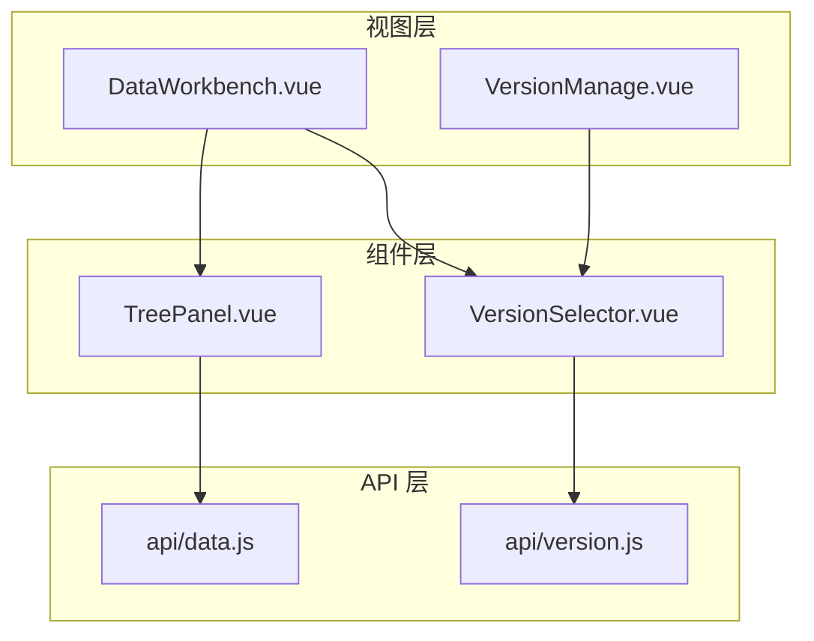
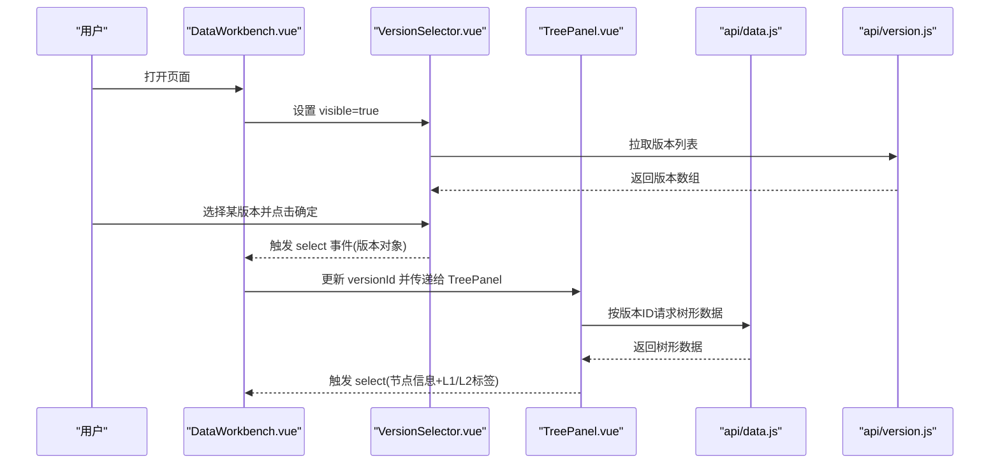
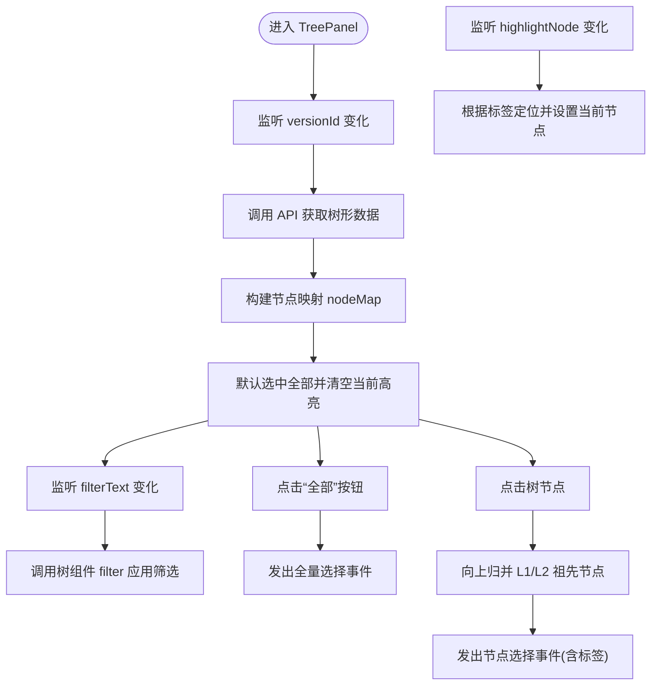
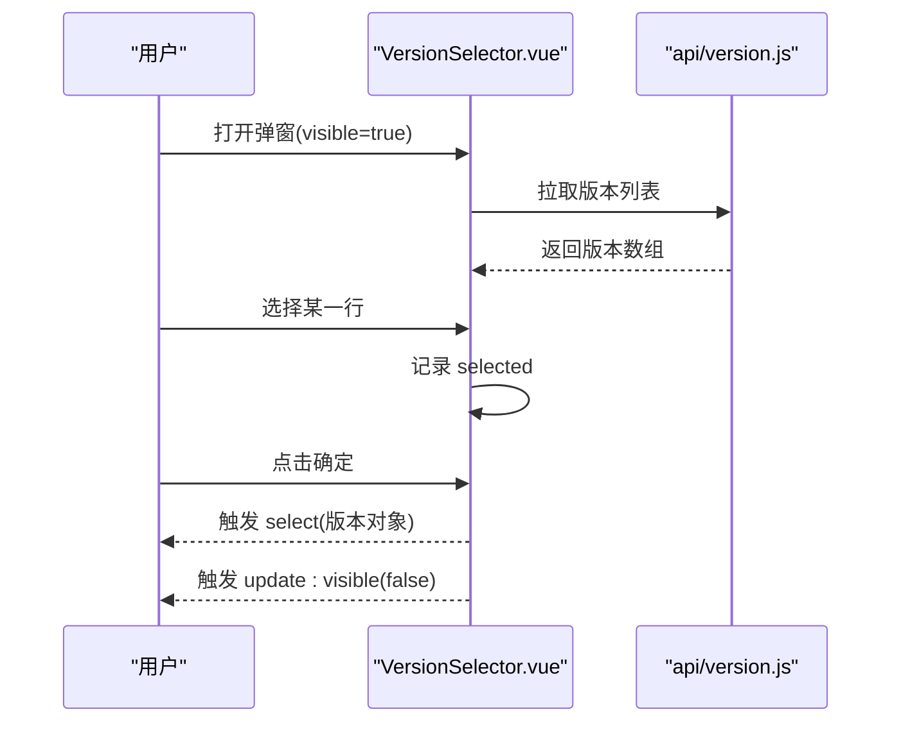
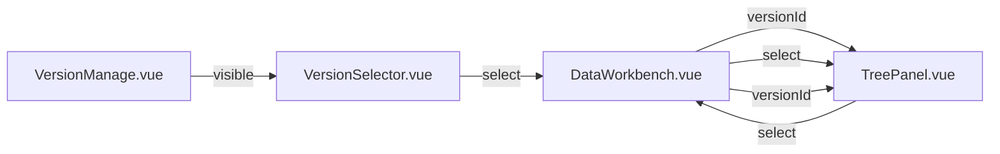
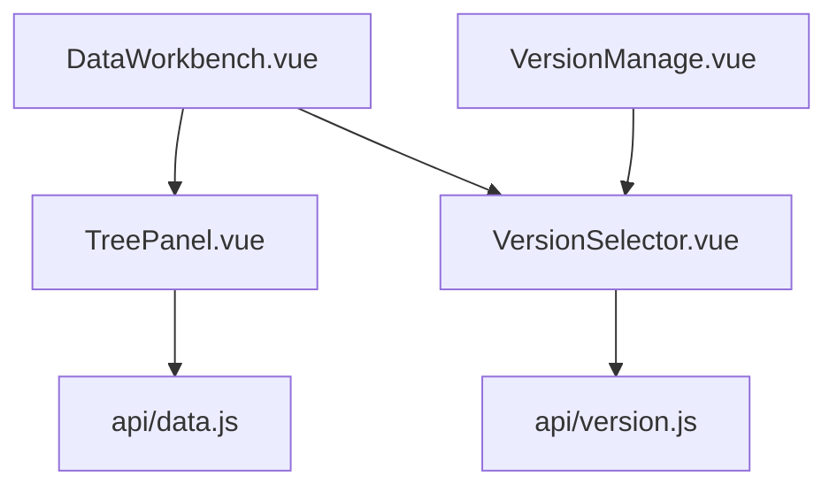

# 业务组件设计

<cite>
**本文引用的文件**
- [frontend/src/components/TreePanel.vue](file://frontend/src/components/TreePanel.vue)
- [frontend/src/components/VersionSelector.vue](file://frontend/src/components/VersionSelector.vue)
- [frontend/src/api/data.js](file://frontend/src/api/data.js)
- [frontend/src/api/version.js](file://frontend/src/api/version.js)
- [frontend/src/views/dashboard/DataWorkbench.vue](file://frontend/src/views/dashboard/DataWorkbench.vue)
- [frontend/src/views/system/VersionManage.vue](file://frontend/src/views/system/VersionManage.vue)
</cite>

## 目录
1. [引言](#引言)
2. [项目结构](#项目结构)
3. [核心组件](#核心组件)
4. [架构总览](#架构总览)
5. [组件详解](#组件详解)
6. [依赖关系分析](#依赖关系分析)
7. [性能考量](#性能考量)
8. [故障排查指南](#故障排查指南)
9. [结论](#结论)
10. [附录](#附录)

## 引言
本技术文档围绕业务组件设计，聚焦两个关键组件：TreePanel 树形面板与 VersionSelector 版本选择器。文档从数据结构设计、节点展开折叠机制、交互行为与状态管理入手，逐步深入到版本切换逻辑与数据绑定策略，并总结通用设计模式、数据流管理与事件处理机制。同时覆盖组件可配置性、国际化支持与无障碍访问优化建议，以及单元测试策略、性能监控方法与调试技巧。

## 项目结构
前端采用 Vue 3 单页应用结构，业务组件位于 components 目录，API 封装在 api 目录，页面视图位于 views 目录。TreePanel 与 VersionSelector 分别承担“树形导航”和“版本选择”的职责，二者通过事件与属性进行松耦合协作。

图表来源
- [frontend/src/views/dashboard/DataWorkbench.vue](file://frontend/src/views/dashboard/DataWorkbench.vue)
- [frontend/src/views/system/VersionManage.vue](file://frontend/src/views/system/VersionManage.vue)
- [frontend/src/components/TreePanel.vue](file://frontend/src/components/TreePanel.vue)
- [frontend/src/components/VersionSelector.vue](file://frontend/src/components/VersionSelector.vue)
- [frontend/src/api/data.js](file://frontend/src/api/data.js)
- [frontend/src/api/version.js](file://frontend/src/api/version.js)

章节来源
- [frontend/src/views/dashboard/DataWorkbench.vue](file://frontend/src/views/dashboard/DataWorkbench.vue)
- [frontend/src/views/system/VersionManage.vue](file://frontend/src/views/system/VersionManage.vue)
- [frontend/src/components/TreePanel.vue](file://frontend/src/components/TreePanel.vue)
- [frontend/src/components/VersionSelector.vue](file://frontend/src/components/VersionSelector.vue)
- [frontend/src/api/data.js](file://frontend/src/api/data.js)
- [frontend/src/api/version.js](file://frontend/src/api/version.js)

## 核心组件
- TreePanel 树形面板：负责按版本加载树形数据、支持过滤、高亮当前选中节点、向上归并 L1/L2 标签并发出选择事件。
- VersionSelector 版本选择器：弹窗展示版本列表，支持筛选与确认，向父组件回传所选版本。

章节来源
- [frontend/src/components/TreePanel.vue](file://frontend/src/components/TreePanel.vue)
- [frontend/src/components/VersionSelector.vue](file://frontend/src/components/VersionSelector.vue)

## 架构总览
TreePanel 与 VersionSelector 的协作流程如下：父页面（如 DataWorkbench）维护当前版本状态，将版本 ID 传递给 TreePanel；当用户在 TreePanel 中点击节点或点击“全部”，会向上抛出选择事件；VersionSelector 在可见状态下拉取版本列表，用户确认后回传所选版本，父页面据此更新 TreePanel 的版本参数，从而驱动树形数据刷新。

图表来源
- [frontend/src/views/dashboard/DataWorkbench.vue](file://frontend/src/views/dashboard/DataWorkbench.vue)
- [frontend/src/components/VersionSelector.vue](file://frontend/src/components/VersionSelector.vue)
- [frontend/src/components/TreePanel.vue](file://frontend/src/components/TreePanel.vue)
- [frontend/src/api/data.js](file://frontend/src/api/data.js)
- [frontend/src/api/version.js](file://frontend/src/api/version.js)

## 组件详解

### TreePanel 树形面板
- 数据结构设计
  - 树节点属性：id、label、children、isLeaf、level、parentId 等，用于渲染与父子关系判断。
  - 节点映射表 nodeMap：以 id 为键，缓存所有节点，便于快速定位与祖先查找。
- 节点展开折叠机制
  - 默认展开全部；支持输入框过滤，调用树组件内置 filter 方法实现动态筛选。
- 交互行为
  - “全部”按钮：清空当前高亮，发出全量选择事件。
  - 节点点击：根据点击节点的层级向上归并 L1/L2 标签，发出带上下文标签的选择事件。
  - 高亮同步：接收外部 highlightNode，支持按类别/领域标签定位并设置当前节点。
- 状态管理与数据绑定
  - 使用响应式 ref 管理 treeData、nodeMap、filterText、selectedAll 等状态。
  - 通过 watch 监听 versionId 变化，触发数据拉取与重置；监听 highlightNode 变化，驱动高亮同步。
- 事件处理
  - 向父组件发出 select 事件，携带节点基础信息与 L1/L2 标签，便于上层业务使用。

图表来源
- [frontend/src/components/TreePanel.vue](file://frontend/src/components/TreePanel.vue)
- [frontend/src/api/data.js](file://frontend/src/api/data.js)

章节来源
- [frontend/src/components/TreePanel.vue](file://frontend/src/components/TreePanel.vue)
- [frontend/src/api/data.js](file://frontend/src/api/data.js)

### VersionSelector 版本选择器
- 状态管理
  - visible 控制弹窗显示；内部维护 versions 列表与 selected 当前选中项。
- 版本切换逻辑
  - 监听 visible，打开时拉取版本列表；选择行后记录 selected；点击确定时校验并发出 select 事件。
- 数据绑定策略
  - 使用 v-model:visible 与 update:visible 实现双向绑定；表格列包含版本号、状态、发布时间、创建时间等字段。
- 事件处理
  - update:visible 用于控制弹窗显隐；select 用于回传所选版本对象。

图表来源
- [frontend/src/components/VersionSelector.vue](file://frontend/src/components/VersionSelector.vue)
- [frontend/src/api/version.js](file://frontend/src/api/version.js)

章节来源
- [frontend/src/components/VersionSelector.vue](file://frontend/src/components/VersionSelector.vue)
- [frontend/src/api/version.js](file://frontend/src/api/version.js)

### 组件协作与数据流
- DataWorkbench 作为容器，持有当前版本 selectedVersion，将其传入 TreePanel 的 versionId；同时接收 TreePanel 的 select 事件，用于更新查询条件或高亮状态。
- VersionManage 页面通过 VersionSelector 选择版本，再由父级逻辑更新 DataWorkbench 的版本状态，形成闭环。

图表来源
- [frontend/src/views/dashboard/DataWorkbench.vue](file://frontend/src/views/dashboard/DataWorkbench.vue)
- [frontend/src/views/system/VersionManage.vue](file://frontend/src/views/system/VersionManage.vue)
- [frontend/src/components/TreePanel.vue](file://frontend/src/components/TreePanel.vue)
- [frontend/src/components/VersionSelector.vue](file://frontend/src/components/VersionSelector.vue)

章节来源
- [frontend/src/views/dashboard/DataWorkbench.vue](file://frontend/src/views/dashboard/DataWorkbench.vue)
- [frontend/src/views/system/VersionManage.vue](file://frontend/src/views/system/VersionManage.vue)
- [frontend/src/components/TreePanel.vue](file://frontend/src/components/TreePanel.vue)
- [frontend/src/components/VersionSelector.vue](file://frontend/src/components/VersionSelector.vue)

## 依赖关系分析
- 组件对 API 的依赖
  - TreePanel 依赖 data.js 的 getCategoryTree 接口获取树形数据；使用树组件的 filter 能力实现本地筛选。
  - VersionSelector 依赖 version.js 的 getVersions 接口获取版本列表。
- 组件间依赖
  - DataWorkbench 与 VersionManage 作为容器，分别持有并传递版本状态；TreePanel 与 VersionSelector 通过事件解耦。
- 外部依赖
  - Element Plus 的 el-tree、el-dialog、el-table、el-tag、el-button 等组件库元素。

图表来源
- [frontend/src/components/TreePanel.vue](file://frontend/src/components/TreePanel.vue)
- [frontend/src/components/VersionSelector.vue](file://frontend/src/components/VersionSelector.vue)
- [frontend/src/api/data.js](file://frontend/src/api/data.js)
- [frontend/src/api/version.js](file://frontend/src/api/version.js)
- [frontend/src/views/dashboard/DataWorkbench.vue](file://frontend/src/views/dashboard/DataWorkbench.vue)
- [frontend/src/views/system/VersionManage.vue](file://frontend/src/views/system/VersionManage.vue)

章节来源
- [frontend/src/components/TreePanel.vue](file://frontend/src/components/TreePanel.vue)
- [frontend/src/components/VersionSelector.vue](file://frontend/src/components/VersionSelector.vue)
- [frontend/src/api/data.js](file://frontend/src/api/data.js)
- [frontend/src/api/version.js](file://frontend/src/api/version.js)
- [frontend/src/views/dashboard/DataWorkbench.vue](file://frontend/src/views/dashboard/DataWorkbench.vue)
- [frontend/src/views/system/VersionManage.vue](file://frontend/src/views/system/VersionManage.vue)

## 性能考量
- 树节点映射与祖先查找
  - nodeMap 以 O(1) 时间复杂度定位节点；祖先查找使用 Set 防止环路，避免重复遍历。
- 过滤性能
  - 本地 filterNode 基于字符串包含匹配，适合中小规模树；大规模树建议服务端分页或懒加载。
- 渲染优化
  - 树节点内容使用 scoped 样式减少样式污染；Element Plus 的虚拟滚动能力可用于超大列表场景。
- 请求节流
  - 版本切换频繁时，可在父组件层增加防抖或去抖策略，避免短时间内多次请求。
- 内存占用
  - nodeMap 与 treeData 保持与版本一致的生命周期，切换版本时及时清理，防止内存泄漏。

## 故障排查指南
- 树节点无法高亮
  - 检查 highlightNode 的类别/领域标签是否与节点 label 匹配；确认 nodeMap 是否已构建完成。
- 节点点击未归并 L1/L2
  - 确认节点 level 字段正确；检查祖先查找逻辑是否命中目标层级。
- 过滤无效
  - 确认 filterText 已绑定；检查 filterNode 的匹配逻辑与节点 label 类型。
- 版本选择无响应
  - 确认 visible 与 update:visible 的双向绑定；检查 confirm 流程中的 selected 校验。
- API 请求失败
  - 检查网络与跨域配置；确认接口路径与返回格式；在父组件捕获错误并提示。

章节来源
- [frontend/src/components/TreePanel.vue](file://frontend/src/components/TreePanel.vue)
- [frontend/src/components/VersionSelector.vue](file://frontend/src/components/VersionSelector.vue)
- [frontend/src/api/data.js](file://frontend/src/api/data.js)
- [frontend/src/api/version.js](file://frontend/src/api/version.js)

## 结论
TreePanel 与 VersionSelector 通过清晰的属性与事件边界实现了低耦合协作：前者专注树形数据与交互，后者专注版本选择。结合统一的 API 抽象与父组件状态管理，二者共同支撑了业务的版本化数据浏览与操作需求。建议后续在大数据量场景下引入懒加载与服务端筛选，在国际化与无障碍方面完善文案与键盘导航支持。

## 附录
- 可配置性设计
  - TreePanel 支持通过 props 传入 versionId 与 highlightNode；可通过事件扩展更多交互（如双击、右键菜单）。
  - VersionSelector 支持通过 visible 控制显隐；可扩展排序、筛选与批量操作。
- 国际化支持
  - 文案（如“全部”、“搜索分类/领域”）建议抽取为 i18n 键值；标签与状态文案需适配多语言。
- 无障碍访问优化
  - 为树节点添加 aria-label；为按钮与表格提供键盘可达性；为弹窗提供焦点管理与 ESC 关闭。
- 单元测试策略
  - TreePanel：模拟 API 返回、断言节点映射构建、筛选与高亮同步、事件发射参数。
  - VersionSelector：模拟版本列表、断言选中逻辑与确认流程。
- 性能监控方法
  - 监控树渲染耗时、API 响应时间与版本切换延迟；对大数据量场景做分页与缓存策略。
- 调试技巧
  - 使用浏览器开发者工具观察响应式状态变化；在 watch 回调中打印关键变量；利用 Vue DevTools 定位组件状态与事件流向。