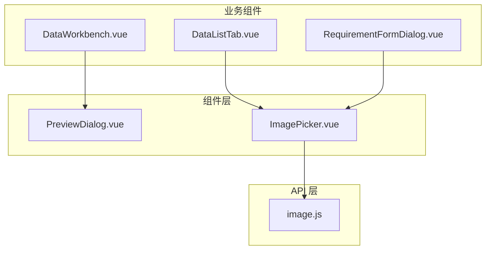
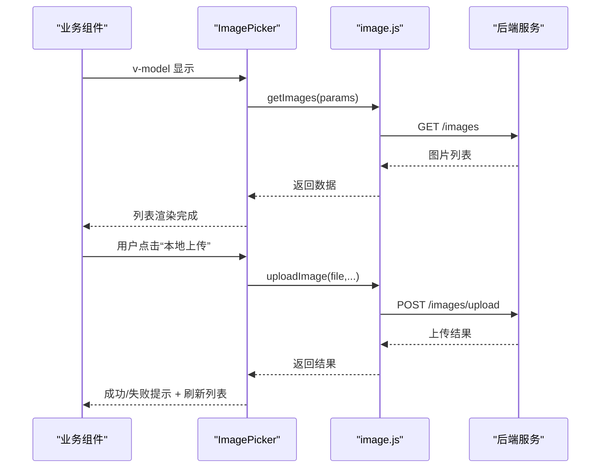
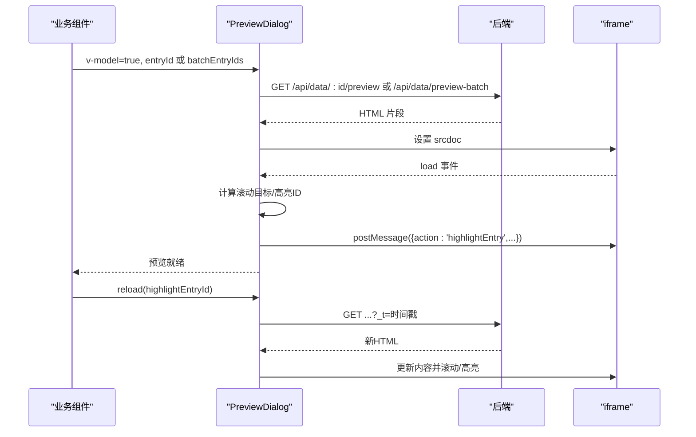
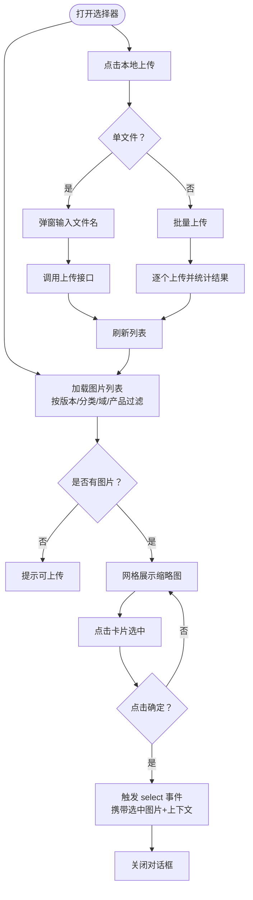
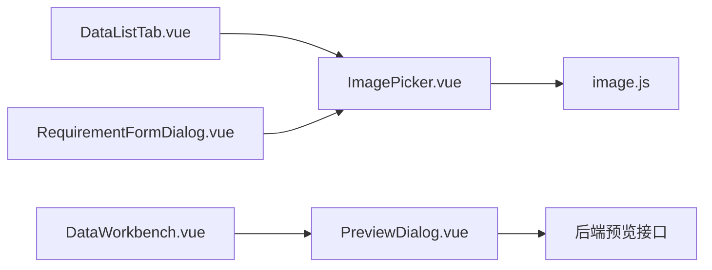

# 工具组件设计

<cite>
**本文引用的文件**
- [PreviewDialog.vue](file://frontend/src/components/PreviewDialog.vue)
- [ImagePicker.vue](file://frontend/src/components/ImagePicker.vue)
- [image.js](file://frontend/src/api/image.js)
- [DataListTab.vue](file://frontend/src/components/DataListTab.vue)
- [RequirementFormDialog.vue](file://frontend/src/components/RequirementFormDialog.vue)
- [DataWorkbench.vue](file://frontend/src/views/dashboard/DataWorkbench.vue)
</cite>

## 目录
1. [简介](#简介)
2. [项目结构](#项目结构)
3. [核心组件](#核心组件)
4. [架构总览](#架构总览)
5. [详细组件分析](#详细组件分析)
6. [依赖关系分析](#依赖关系分析)
7. [性能考量](#性能考量)
8. [故障排查指南](#故障排查指南)
9. [结论](#结论)
10. [附录](#附录)

## 简介
本文件聚焦于前端工具组件的设计与实现，重点解析以下两个组件：
- PreviewDialog 预览对话框：负责以模态框形式展示产品条目的预览内容，支持“功能说明/招标参数”两种模式切换，并提供下载 Word 文档的能力；具备 iframe 内容加载状态管理、滚动位置与高亮同步、消息通信等交互细节。
- ImagePicker 图片选择器：提供图片浏览、筛选、单选、本地上传与批量上传能力；支持按版本、分类、域、产品维度过滤图片资源；封装了上传校验、错误提示与刷新逻辑。

同时，文档给出通用抽象设计、复用性与扩展性建议，以及配置参数、事件回调与错误处理策略，并说明与业务组件的协作模式与数据传递方式。

## 项目结构
工具组件位于前端 src/components 目录下，分别承担独立的 UI 与交互职责；与之配套的 API 层在 src/api 下，统一通过 request 封装进行网络请求；业务组件在各页面与对话框中以 v-model 双向绑定控制显示隐藏，并通过事件回调完成数据回传。

**图表来源**
- [PreviewDialog.vue:1-190](file://frontend/src/components/PreviewDialog.vue#L1-L190)
- [ImagePicker.vue:1-178](file://frontend/src/components/ImagePicker.vue#L1-L178)
- [image.js:1-93](file://frontend/src/api/image.js#L1-L93)
- [DataListTab.vue:500-520](file://frontend/src/components/DataListTab.vue#L500-L520)
- [RequirementFormDialog.vue:40-60](file://frontend/src/components/RequirementFormDialog.vue#L40-L60)
- [DataWorkbench.vue:140-155](file://frontend/src/views/dashboard/DataWorkbench.vue#L140-L155)

**章节来源**
- [PreviewDialog.vue:1-190](file://frontend/src/components/PreviewDialog.vue#L1-L190)
- [ImagePicker.vue:1-178](file://frontend/src/components/ImagePicker.vue#L1-L178)
- [image.js:1-93](file://frontend/src/api/image.js#L1-L93)
- [DataListTab.vue:500-520](file://frontend/src/components/DataListTab.vue#L500-L520)
- [RequirementFormDialog.vue:40-60](file://frontend/src/components/RequirementFormDialog.vue#L40-L60)
- [DataWorkbench.vue:140-155](file://frontend/src/views/dashboard/DataWorkbench.vue#L140-L155)

## 核心组件
- PreviewDialog：基于 Element Plus 的对话框，内部通过 iframe 渲染服务端返回的 HTML 片段，支持两种预览模式、加载与下载状态遮罩、滚动位置与高亮同步、消息通信与重新加载能力。
- ImagePicker：基于 Element Plus 的对话框，提供图片网格展示、搜索过滤、单选、本地上传（含单文件与多文件）、上传校验与错误提示、确认回调。

**章节来源**
- [PreviewDialog.vue:1-190](file://frontend/src/components/PreviewDialog.vue#L1-L190)
- [ImagePicker.vue:1-178](file://frontend/src/components/ImagePicker.vue#L1-L178)

## 架构总览
工具组件与业务组件之间采用“属性驱动 + 事件回调”的解耦模式：
- 业务组件通过 v-model 控制组件显隐；
- 组件通过 emit 回传用户操作结果（如选择图片、关闭、预览消息）；
- 组件内部通过 props 接收上下文参数（如 entryId、batchEntryIds、版本号、默认分类/域/产品等）；
- 组件与后端 API 通过统一的 request 封装进行交互。

**图表来源**
- [ImagePicker.vue:65-96](file://frontend/src/components/ImagePicker.vue#L65-L96)
- [image.js:24-46](file://frontend/src/api/image.js#L24-L46)

## 详细组件分析

### PreviewDialog 预览对话框
- 模态框管理
  - 通过 v-model 控制显示隐藏；监听外部 modelValue 变化触发预览加载；关闭时重置状态。
  - 支持点击遮罩关闭（close-on-click-modal）。
- 内容渲染机制
  - 使用 iframe 嵌入服务端返回的 HTML 片段（srcdoc），避免与主应用样式冲突。
  - 加载阶段显示“加载中”遮罩；下载阶段显示“生成文档中”遮罩。
  - 通过 window.postMessage 与 iframe 内容通信，支持高亮指定条目。
- 交互体验设计
  - 提供“功能说明/招标参数”双模式切换，切换时记录当前可视区域标题，重新加载后自动滚动到相近位置，保证阅读连贯性。
  - 对外暴露 reload 与 notifyUpdate 能力，供业务侧在数据更新后刷新或通知 iframe 内容高亮。
  - 监听 window message，透传 iframe 内的消息给业务侧，便于联动处理。

**图表来源**
- [PreviewDialog.vue:82-107](file://frontend/src/components/PreviewDialog.vue#L82-L107)
- [PreviewDialog.vue:144-168](file://frontend/src/components/PreviewDialog.vue#L144-L168)
- [PreviewDialog.vue:175-186](file://frontend/src/components/PreviewDialog.vue#L175-L186)

**章节来源**
- [PreviewDialog.vue:1-190](file://frontend/src/components/PreviewDialog.vue#L1-L190)

### ImagePicker 图片选择器
- 文件上传处理
  - 单文件上传：弹出输入框提示用户输入图片名称，调用上传接口并提示成功/失败。
  - 多文件上传：逐个尝试上传，统计成功/失败数量，统一提示。
  - 上传前对 PNG 文件进行完整性校验（头部与尾部标记），确保文件有效。
- 图片预览功能
  - 通过 getImages 获取图片列表，支持按版本、产品 ID 或分类/域/产品维度过滤。
  - 列表以网格卡片形式展示缩略图与文件名，选中态高亮。
- 选择策略
  - 单选：点击卡片即选中；确认按钮启用条件为存在选中项。
  - 回调携带额外上下文信息（如待定分类/域/产品），便于业务侧落库时补充元数据。

**图表来源**
- [ImagePicker.vue:79-96](file://frontend/src/components/ImagePicker.vue#L79-L96)
- [ImagePicker.vue:119-162](file://frontend/src/components/ImagePicker.vue#L119-L162)
- [image.js:24-38](file://frontend/src/api/image.js#L24-L38)

**章节来源**
- [ImagePicker.vue:1-178](file://frontend/src/components/ImagePicker.vue#L1-L178)
- [image.js:1-93](file://frontend/src/api/image.js#L1-L93)

### 通用抽象设计、复用性与扩展性
- 抽象设计
  - 将“模态框 + 内容区 + 底部操作区”的结构抽象为通用容器，预览与图片选择器分别实现各自内容区与行为。
  - 通过 props 传递上下文参数，通过 emits 透传关键事件，降低业务侧耦合度。
- 复用性
  - PreviewDialog 与 ImagePicker 均支持 v-model 控制显隐，可在不同业务场景复用。
  - ImagePicker 的过滤参数（版本、分类、域、产品、产品ID）可灵活组合，适配多模块图片管理。
- 扩展性
  - 预览模式可通过新增枚举值扩展（如“技术参数”），并在组件内路由到对应后端接口。
  - 图片选择器可扩展“删除/替换/移动”等操作，结合后端接口完善能力。

## 依赖关系分析
- 组件与 API 的依赖
  - ImagePicker 依赖 image.js 的 getImages、uploadImage 等方法。
  - PreviewDialog 依赖后端提供的预览接口（单条与批量），并通过 window.postMessage 与 iframe 内容通信。
- 组件与业务组件的依赖
  - DataListTab 与 RequirementFormDialog 在编辑场景中唤起 ImagePicker 并接收 select 回调插入/替换图片。
  - DataWorkbench 作为全局预览入口，通过 ref 调用 PreviewDialog 的 reload 与 notifyUpdate。

**图表来源**
- [DataListTab.vue:500-520](file://frontend/src/components/DataListTab.vue#L500-L520)
- [RequirementFormDialog.vue:40-60](file://frontend/src/components/RequirementFormDialog.vue#L40-L60)
- [DataWorkbench.vue:140-155](file://frontend/src/views/dashboard/DataWorkbench.vue#L140-L155)
- [ImagePicker.vue:32-35](file://frontend/src/components/ImagePicker.vue#L32-L35)
- [image.js:1-93](file://frontend/src/api/image.js#L1-L93)
- [PreviewDialog.vue:96-113](file://frontend/src/components/PreviewDialog.vue#L96-L113)

**章节来源**
- [DataListTab.vue:500-520](file://frontend/src/components/DataListTab.vue#L500-L520)
- [RequirementFormDialog.vue:40-60](file://frontend/src/components/RequirementFormDialog.vue#L40-L60)
- [DataWorkbench.vue:140-155](file://frontend/src/views/dashboard/DataWorkbench.vue#L140-L155)
- [ImagePicker.vue:32-35](file://frontend/src/components/ImagePicker.vue#L32-L35)
- [image.js:1-93](file://frontend/src/api/image.js#L1-L93)
- [PreviewDialog.vue:96-113](file://frontend/src/components/PreviewDialog.vue#L96-L113)

## 性能考量
- 预览加载
  - 使用 iframe 嵌入 HTML，避免与主应用样式冲突；首次加载显示遮罩，提升感知速度。
  - 模式切换时通过时间戳参数强制刷新，避免浏览器缓存导致的视觉不一致。
- 图片选择
  - 列表懒加载（打开时才拉取），支持关键词搜索减少渲染压力。
  - 上传采用分步处理（逐个上传），避免阻塞 UI；成功/失败统计提示，提升反馈效率。
- 网络与安全
  - 上传接口设置超时时间，防止长时间占用；PNG 文件完整性校验降低无效资源入库风险。

## 故障排查指南
- 预览对话框
  - 若预览空白：检查后端接口是否返回 HTML；确认 iframe load 事件是否触发；查看遮罩是否持续显示。
  - 滚动/高亮异常：确认 iframe 内容是否包含 .content 容器与 h3[id] 标题；检查消息通信是否被拦截。
  - 下载失败：确认 access_token 是否有效；检查后端下载接口权限与路径。
- 图片选择器
  - 无法加载图片：检查过滤参数（版本/分类/域/产品/产品ID）是否正确；确认 getImages 请求是否成功。
  - 上传失败：检查文件类型与大小限制；查看 PNG 校验报错信息；关注后端返回的错误消息。
  - 选择无效：确认 confirmSelect 触发时存在选中项；检查业务侧是否正确接收 select 事件。

**章节来源**
- [PreviewDialog.vue:144-168](file://frontend/src/components/PreviewDialog.vue#L144-L168)
- [PreviewDialog.vue:175-186](file://frontend/src/components/PreviewDialog.vue#L175-L186)
- [ImagePicker.vue:119-162](file://frontend/src/components/ImagePicker.vue#L119-L162)
- [image.js:6-22](file://frontend/src/api/image.js#L6-L22)

## 结论
PreviewDialog 与 ImagePicker 通过清晰的职责划分与标准化的事件/参数接口，实现了高复用与强扩展性的工具组件设计。前者专注于预览与交互体验，后者专注于图片资源的检索与上传。两者均与业务组件松耦合，便于在多场景下快速集成与定制。

## 附录

### 配置参数与事件回调清单
- PreviewDialog
  - 参数
    - entryId：数字，单条预览的条目 ID
    - batchEntryIds：数组，批量预览的条目 ID 列表
    - modelValue：布尔，控制显示隐藏
  - 事件
    - update:modelValue：用于双向绑定
    - preview-message：从 iframe 接收到的消息
  - 暴露方法
    - reload(highlightEntryId?)：刷新预览内容，可选高亮条目
    - notifyUpdate(data)：向 iframe 发送消息
- ImagePicker
  - 参数
    - modelValue：布尔，控制显示隐藏
    - defaultCategory/defaultDomain/defaultProduct：字符串，初始过滤条件
    - defaultProductId：数字，优先按产品 ID 过滤
    - fixedCategory：字符串，固定分类（上传时使用）
    - versionId：数字，按版本过滤
  - 事件
    - update:modelValue：用于双向绑定
    - select：选中图片后的回调
    - close：对话框关闭回调
  - 暴露方法
    - 无

**章节来源**
- [PreviewDialog.vue:34-51](file://frontend/src/components/PreviewDialog.vue#L34-L51)
- [PreviewDialog.vue:188-188](file://frontend/src/components/PreviewDialog.vue#L188-L188)
- [ImagePicker.vue:37-46](file://frontend/src/components/ImagePicker.vue#L37-L46)
- [ImagePicker.vue:46-46](file://frontend/src/components/ImagePicker.vue#L46-L46)

### 与业务组件的协作模式与数据传递
- DataListTab
  - 唤起 ImagePicker 时传入默认分类/域/产品与版本号；接收 select 回调后插入或替换图片卡片。
- RequirementFormDialog
  - 唤起 ImagePicker 时固定分类为“需求管理”，接收回调后插入富文本或附件。
- DataWorkbench
  - 作为全局预览入口，通过 ref 调用 PreviewDialog 的 reload 与 notifyUpdate，在数据变更后刷新预览并高亮对应条目。

**章节来源**
- [DataListTab.vue:500-520](file://frontend/src/components/DataListTab.vue#L500-L520)
- [RequirementFormDialog.vue:40-60](file://frontend/src/components/RequirementFormDialog.vue#L40-L60)
- [DataWorkbench.vue:140-155](file://frontend/src/views/dashboard/DataWorkbench.vue#L140-L155)