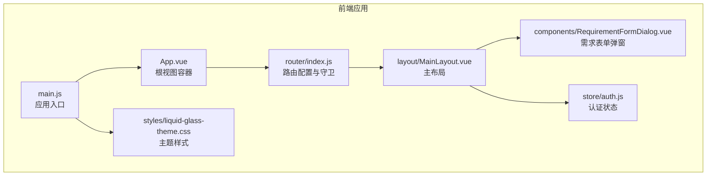
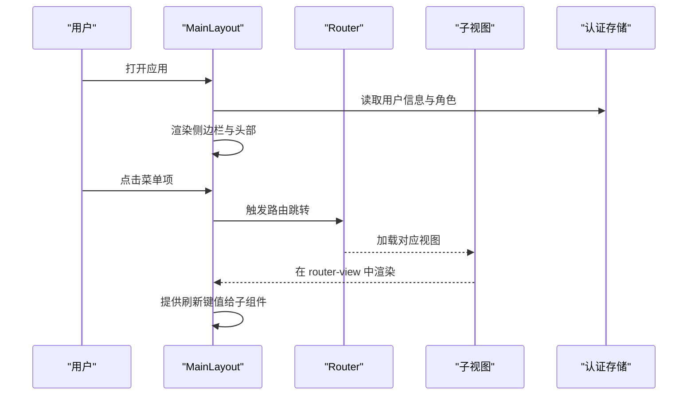
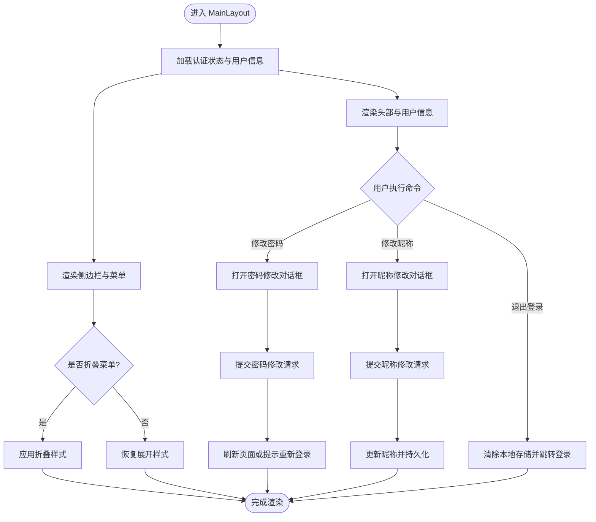
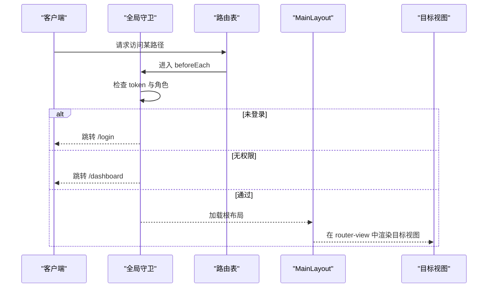
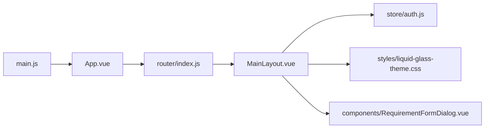

# 布局组件设计

<cite>
**本文引用的文件**
- [MainLayout.vue](file://frontend/src/layout/MainLayout.vue)
- [App.vue](file://frontend/src/App.vue)
- [main.js](file://frontend/src/main.js)
- [router/index.js](file://frontend/src/router/index.js)
- [store/auth.js](file://frontend/src/store/auth.js)
- [styles/liquid-glass-theme.css](file://frontend/src/styles/liquid-glass-theme.css)
- [components/RequirementFormDialog.vue](file://frontend/src/components/RequirementFormDialog.vue)
</cite>

## 目录
1. [引言](#引言)
2. [项目结构](#项目结构)
3. [核心组件](#核心组件)
4. [架构总览](#架构总览)
5. [详细组件分析](#详细组件分析)
6. [依赖关系分析](#依赖关系分析)
7. [性能考量](#性能考量)
8. [故障排查指南](#故障排查指南)
9. [结论](#结论)
10. [附录](#附录)

## 引言
本文件围绕前端布局组件设计进行系统化技术文档整理，重点剖析 MainLayout 主布局组件的整体架构理念、组件结构与布局策略，详解其职责分工、路由嵌套机制与页面容器设计，并覆盖响应式适配、主题切换机制与导航结构设计。同时提供扩展方法、自定义配置选项与最佳实践指南，解释布局组件与业务组件的集成方式与数据流向。

## 项目结构
前端采用 Vue 3 + Vue Router + Pinia + Element Plus 技术栈，布局层位于 layout 目录，路由在 router 目录统一管理，全局样式通过 Liquid Glass 主题进行统一风格约束。

**图表来源**
- [App.vue:1-22](file://frontend/src/App.vue#L1-L22)
- [main.js:1-20](file://frontend/src/main.js#L1-L20)
- [router/index.js:1-129](file://frontend/src/router/index.js#L1-L129)
- [MainLayout.vue:1-423](file://frontend/src/layout/MainLayout.vue#L1-L423)
- [styles/liquid-glass-theme.css:1-236](file://frontend/src/styles/liquid-glass-theme.css#L1-L236)
- [store/auth.js:1-46](file://frontend/src/store/auth.js#L1-L46)
- [components/RequirementFormDialog.vue:1-455](file://frontend/src/components/RequirementFormDialog.vue#L1-L455)

**章节来源**
- [main.js:1-20](file://frontend/src/main.js#L1-L20)
- [router/index.js:1-129](file://frontend/src/router/index.js#L1-L129)
- [App.vue:1-22](file://frontend/src/App.vue#L1-L22)

## 核心组件
- MainLayout 主布局：负责侧边栏导航、头部信息、内容区渲染与用户交互（如修改密码、修改昵称、退出登录），并提供需求快速录入弹窗。
- 路由系统：以 MainLayout 为根布局，内部嵌套路由视图，实现页面容器与内容区的解耦。
- 认证存储：提供登录态、用户信息与管理员权限判断能力，驱动导航菜单的可见性与页面访问控制。
- 主题系统：通过 Liquid Glass 主题覆盖 Element Plus 的变量，统一颜色、阴影、圆角等视觉规范。
- 需求表单弹窗：作为布局内的对话框组件，承载需求录入与富文本描述编辑能力。

**章节来源**
- [MainLayout.vue:1-423](file://frontend/src/layout/MainLayout.vue#L1-L423)
- [router/index.js:1-129](file://frontend/src/router/index.js#L1-L129)
- [store/auth.js:1-46](file://frontend/src/store/auth.js#L1-L46)
- [styles/liquid-glass-theme.css:1-236](file://frontend/src/styles/liquid-glass-theme.css#L1-L236)
- [components/RequirementFormDialog.vue:1-455](file://frontend/src/components/RequirementFormDialog.vue#L1-L455)

## 架构总览
MainLayout 作为根布局，承担以下职责：
- 导航与菜单：基于 Element Plus Menu 组件构建，支持折叠、子菜单与图标。
- 页面容器：使用 router-view 渲染子路由视图，形成“布局 + 内容”的双层结构。
- 用户交互：提供快捷需求录入、用户下拉菜单、修改密码与昵称、退出登录。
- 状态共享：通过 provide/inject 向子组件传递刷新键值，用于触发列表刷新等场景。
- 权限控制：根据认证存储的管理员标识动态显示系统管理相关菜单项。

**图表来源**
- [MainLayout.vue:158-272](file://frontend/src/layout/MainLayout.vue#L158-L272)
- [router/index.js:111-126](file://frontend/src/router/index.js#L111-L126)
- [store/auth.js:40-42](file://frontend/src/store/auth.js#L40-L42)

## 详细组件分析

### MainLayout 主布局组件
- 结构设计
  - 外层容器采用 Flex 布局，左侧为固定宽度侧边栏，右侧为主内容区。
  - 侧边栏包含 Logo 区域与可折叠菜单；内容区包含头部标题与用户信息，以及 router-view 容器。
- 菜单与导航
  - 使用 Element Plus Menu 实现，支持默认激活项、折叠状态、图标与文字组合。
  - 子菜单按模块分组，支持多级展开；部分菜单项仅管理员可见。
- 页面容器
  - 通过 router-view 渲染当前路由对应的视图，实现布局与内容的解耦。
- 用户交互
  - 快捷需求录入：点击按钮打开需求表单弹窗，并通过 provide/inject 传递刷新键值。
  - 用户下拉菜单：支持修改密码、修改昵称与退出登录；退出后清除本地存储并跳转登录页。
- 主题与样式
  - 通过 CSS 变量与 Liquid Glass 主题统一风格，侧边栏、头部、菜单项的颜色与尺寸均来自主题变量。
- 响应式适配
  - 侧边栏宽度与 Logo 文字在折叠状态下有过渡动画；菜单项在折叠时隐藏文字，保留图标。
- 数据流
  - 认证状态来自 Pinia Store；菜单项与页面标题来自路由 meta 字段；用户昵称来自本地存储或认证存储。

**图表来源**
- [MainLayout.vue:158-272](file://frontend/src/layout/MainLayout.vue#L158-L272)
- [store/auth.js:30-38](file://frontend/src/store/auth.js#L30-L38)

**章节来源**
- [MainLayout.vue:1-423](file://frontend/src/layout/MainLayout.vue#L1-L423)
- [store/auth.js:1-46](file://frontend/src/store/auth.js#L1-L46)

### 路由嵌套与页面容器
- 根路由指向 MainLayout，并设置重定向到工作台；其 children 定义了所有业务视图的路由。
- 路由元信息 meta 中包含页面标题与角色限制，用于头部标题展示与访问控制。
- beforeEach 全局前置守卫检查登录态与角色权限，未登录自动跳转登录页，无权限则回退到工作台。

**图表来源**
- [router/index.js:111-126](file://frontend/src/router/index.js#L111-L126)
- [router/index.js:3-104](file://frontend/src/router/index.js#L3-L104)

**章节来源**
- [router/index.js:1-129](file://frontend/src/router/index.js#L1-L129)

### 主题切换机制与样式体系
- 主题文件通过 CSS 变量映射 Element Plus 的颜色、字体、阴影与圆角等变量，实现统一风格。
- 布局组件的侧边栏背景、头部背景、菜单项颜色与悬停效果均依赖主题变量，便于整体切换。
- 建议新增主题时集中修改主题变量文件，避免分散覆盖。

**章节来源**
- [styles/liquid-glass-theme.css:1-236](file://frontend/src/styles/liquid-glass-theme.css#L1-L236)
- [MainLayout.vue:274-422](file://frontend/src/layout/MainLayout.vue#L274-L422)

### 导航结构设计
- 一级导航：产品清单、需求管理、图床管理、版本管理（管理员）、系统管理（管理员）。
- 二级导航：需求管理包含需求清单与需求图片；系统管理包含用户管理、权限套餐管理、基础数据维护（多子项）、非常规操作（管理员）。
- 菜单项与路由路径一一对应，配合 Element Plus 的 router 模式，点击即跳转。

**章节来源**
- [MainLayout.vue:11-95](file://frontend/src/layout/MainLayout.vue#L11-L95)
- [router/index.js:13-102](file://frontend/src/router/index.js#L13-L102)

### 响应式适配
- 侧边栏宽度与 Logo 文字在折叠状态下有平滑过渡；菜单项在折叠时仅显示图标，提升空间利用率。
- 头部标题随路由 meta 动态变化，体现当前页面语义。
- 建议在更小屏设备上结合媒体查询进一步优化菜单密度与行高。

**章节来源**
- [MainLayout.vue:281-328](file://frontend/src/layout/MainLayout.vue#L281-L328)
- [router/index.js:18-101](file://frontend/src/router/index.js#L18-L101)

### 扩展方法与自定义配置
- 新增菜单项：在 MainLayout 的菜单结构中添加 el-menu-item 或 el-sub-menu，并确保路由表存在对应路径。
- 自定义页面标题：在路由 meta 中设置 title，即可在头部显示。
- 权限控制：在路由 meta 中添加 roles 数组，结合全局守卫与认证存储的 isAdmin 方法实现访问控制。
- 对话框联动：通过 provide/inject 将刷新键值注入子组件，实现列表刷新等场景。
- 主题扩展：在主题变量文件中新增或调整变量，即可影响布局与业务组件的视觉表现。

**章节来源**
- [MainLayout.vue:176-194](file://frontend/src/layout/MainLayout.vue#L176-L194)
- [router/index.js:111-126](file://frontend/src/router/index.js#L111-L126)
- [store/auth.js:40-42](file://frontend/src/store/auth.js#L40-L42)
- [styles/liquid-glass-theme.css:5-47](file://frontend/src/styles/liquid-glass-theme.css#L5-L47)

### 最佳实践指南
- 路由与菜单一致性：菜单项与路由路径保持一致，避免出现“菜单可用但路由缺失”的问题。
- 权限最小化：仅在需要的菜单与页面上使用角色判断，避免过度耦合。
- 样式集中管理：主题变量集中于主题文件，避免在组件内硬编码颜色与尺寸。
- 交互一致性：对话框与表单校验、提交流程保持统一的提示与错误处理。
- 性能优化：避免在布局中进行重型计算，将逻辑下沉至工具函数或 Store。

**章节来源**
- [router/index.js:111-126](file://frontend/src/router/index.js#L111-L126)
- [MainLayout.vue:196-271](file://frontend/src/layout/MainLayout.vue#L196-L271)
- [styles/liquid-glass-theme.css:1-236](file://frontend/src/styles/liquid-glass-theme.css#L1-L236)

## 依赖关系分析
- 应用入口 main.js 注册 Element Plus、路由与 Pinia，挂载根组件 App.vue。
- App.vue 作为根容器，内部使用 router-view 渲染当前路由。
- 路由系统以 MainLayout 为根布局，children 中定义各业务视图路由。
- MainLayout 依赖认证存储进行权限判断与用户信息展示，依赖主题样式统一外观。
- 需求表单弹窗作为布局内的独立组件，通过 v-model 与事件与布局交互。

**图表来源**
- [main.js:1-20](file://frontend/src/main.js#L1-L20)
- [App.vue:1-22](file://frontend/src/App.vue#L1-L22)
- [router/index.js:1-129](file://frontend/src/router/index.js#L1-L129)
- [MainLayout.vue:1-423](file://frontend/src/layout/MainLayout.vue#L1-L423)
- [store/auth.js:1-46](file://frontend/src/store/auth.js#L1-L46)
- [styles/liquid-glass-theme.css:1-236](file://frontend/src/styles/liquid-glass-theme.css#L1-L236)
- [components/RequirementFormDialog.vue:1-455](file://frontend/src/components/RequirementFormDialog.vue#L1-L455)

**章节来源**
- [main.js:1-20](file://frontend/src/main.js#L1-L20)
- [router/index.js:1-129](file://frontend/src/router/index.js#L1-L129)
- [MainLayout.vue:1-423](file://frontend/src/layout/MainLayout.vue#L1-L423)

## 性能考量
- 布局渲染：侧边栏折叠与头部标题更新均为轻量 DOM 操作，性能开销较小。
- 路由切换：通过 router-view 渲染视图，建议在视图组件中使用 keep-alive 缓存不常变动的页面。
- 主题切换：CSS 变量切换即时生效，避免重绘与回流，性能友好。
- 表单与对话框：密码与昵称修改表单在提交前进行校验，避免无效请求；需求表单弹窗在关闭时清理内容，减少内存占用。

[本节为通用性能建议，无需特定文件引用]

## 故障排查指南
- 登录态异常
  - 现象：访问受保护页面被重定向到登录页。
  - 排查：检查本地存储中的 token 是否存在；确认全局守卫逻辑是否正确拦截。
- 权限不足
  - 现象：访问管理员页面返回工作台。
  - 排查：确认本地存储中的角色码与路由 meta.roles 是否匹配。
- 菜单不可见
  - 现象：系统管理菜单不显示。
  - 排查：确认认证存储的 isAdmin 返回值与本地存储的角色码。
- 对话框无法关闭或内容未清空
  - 现象：修改密码/昵称后对话框仍显示或内容未清空。
  - 排查：确认 v-model 绑定与关闭回调逻辑；检查表单 ref 校验与 finally 分支。

**章节来源**
- [router/index.js:111-126](file://frontend/src/router/index.js#L111-L126)
- [store/auth.js:30-42](file://frontend/src/store/auth.js#L30-L42)
- [MainLayout.vue:196-271](file://frontend/src/layout/MainLayout.vue#L196-L271)

## 结论
MainLayout 通过清晰的职责划分与路由嵌套机制，实现了布局与内容的解耦；结合认证存储与主题系统，提供了良好的权限控制与视觉一致性。通过 provide/inject 与对话框组件的协作，提升了用户体验与交互效率。建议在后续迭代中持续优化响应式细节、统一交互行为，并保持主题与路由的一致性。

[本节为总结性内容，无需特定文件引用]

## 附录
- 术语
  - 布局：指 MainLayout 主布局组件，负责导航、头部与内容容器。
  - 路由嵌套：指根布局与子视图之间的父子关系，通过 router-view 渲染。
  - 主题变量：指 CSS 变量，用于统一 Element Plus 组件的视觉风格。
- 参考路径
  - [MainLayout.vue](file://frontend/src/layout/MainLayout.vue)
  - [router/index.js](file://frontend/src/router/index.js)
  - [store/auth.js](file://frontend/src/store/auth.js)
  - [styles/liquid-glass-theme.css](file://frontend/src/styles/liquid-glass-theme.css)
  - [components/RequirementFormDialog.vue](file://frontend/src/components/RequirementFormDialog.vue)

[本节为参考信息，无需特定文件引用]