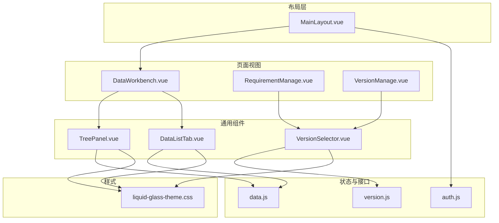
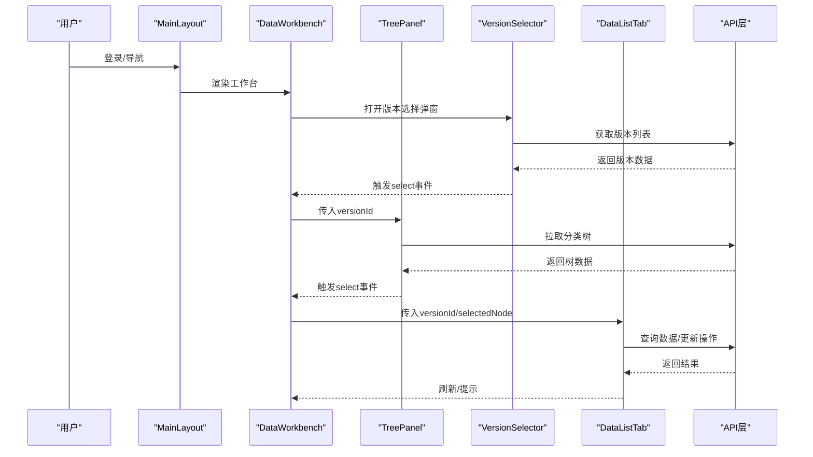
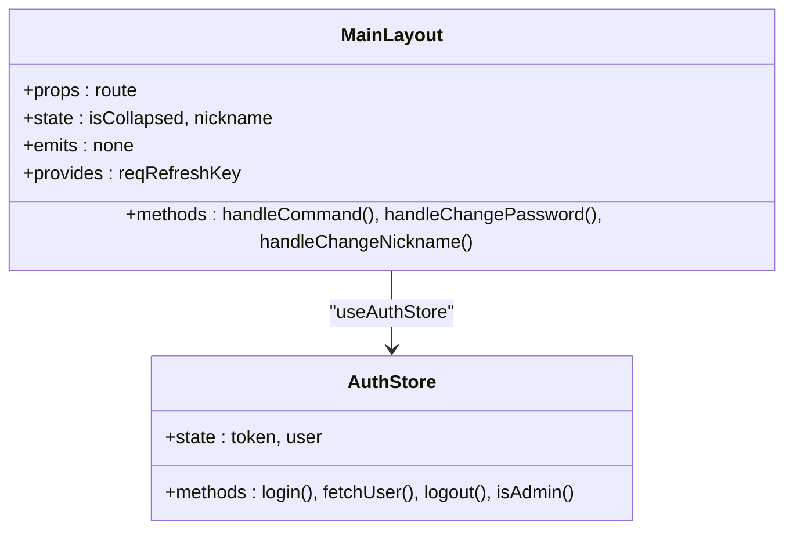
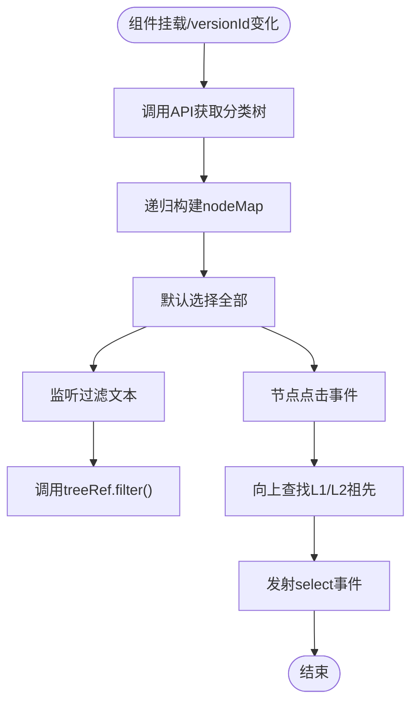
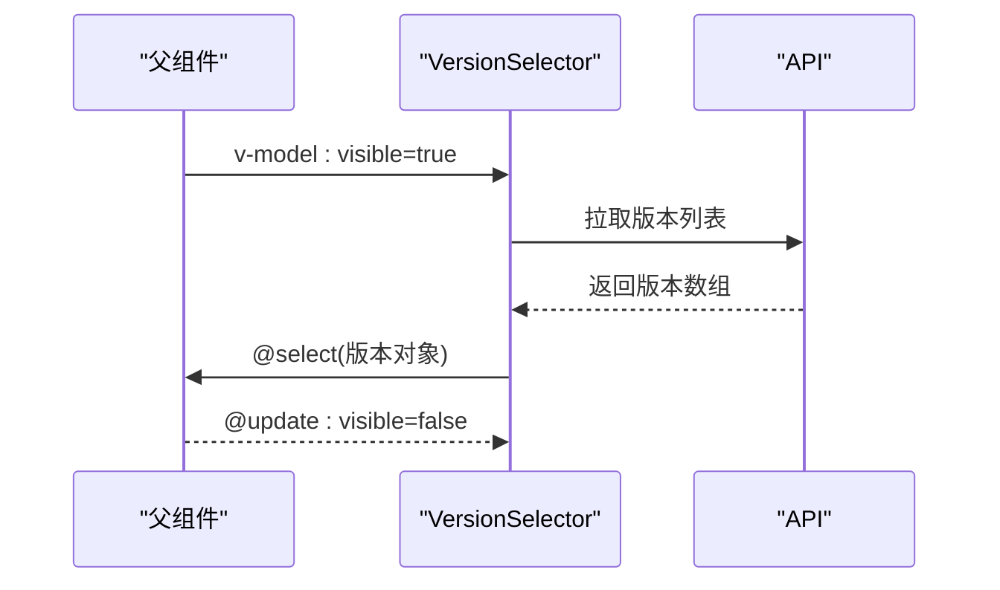
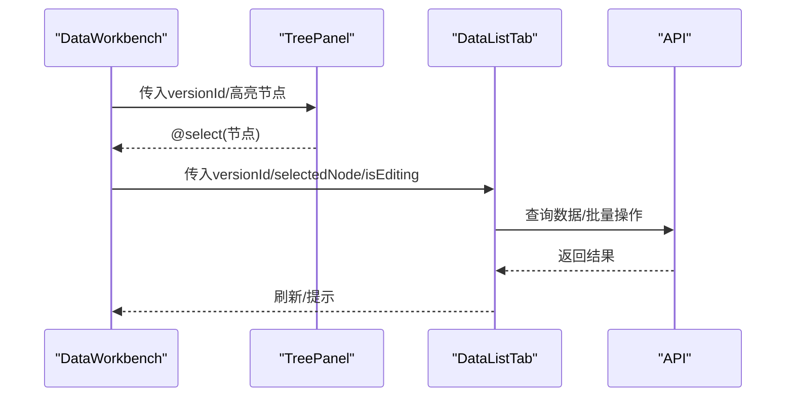
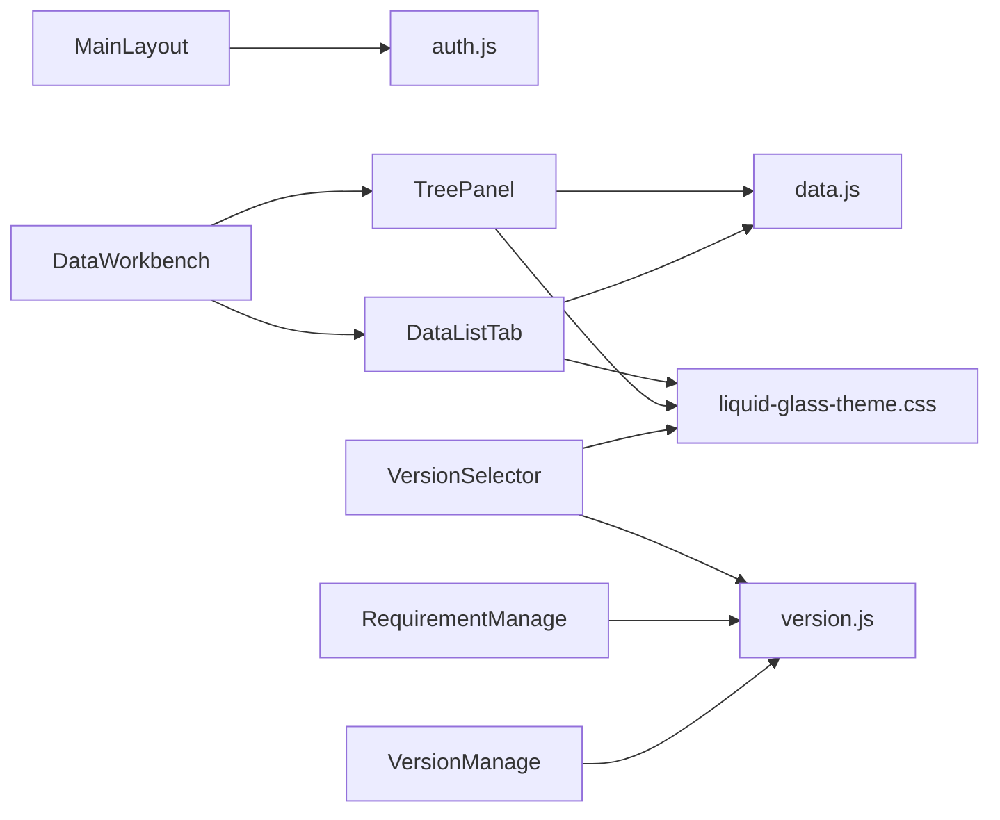

# 组件架构设计

<cite>
**本文档引用的文件**
- [MainLayout.vue](file://frontend/src/layout/MainLayout.vue)
- [TreePanel.vue](file://frontend/src/components/TreePanel.vue)
- [VersionSelector.vue](file://frontend/src/components/VersionSelector.vue)
- [DataListTab.vue](file://frontend/src/components/DataListTab.vue)
- [DataWorkbench.vue](file://frontend/src/views/dashboard/DataWorkbench.vue)
- [RequirementManage.vue](file://frontend/src/views/requirement/RequirementManage.vue)
- [VersionManage.vue](file://frontend/src/views/system/VersionManage.vue)
- [auth.js](file://frontend/src/store/auth.js)
- [version.js](file://frontend/src/api/version.js)
- [data.js](file://frontend/src/api/data.js)
- [liquid-glass-theme.css](file://frontend/src/styles/liquid-glass-theme.css)
- [platformModules.js](file://frontend/src/constants/platformModules.js)
</cite>

## 目录
1. [引言](#引言)
2. [项目结构](#项目结构)
3. [核心组件](#核心组件)
4. [架构总览](#架构总览)
5. [详细组件分析](#详细组件分析)
6. [依赖关系分析](#依赖关系分析)
7. [性能考虑](#性能考虑)
8. [故障排查指南](#故障排查指南)
9. [结论](#结论)
10. [附录](#附录)

## 引言
本技术文档围绕组件架构设计展开，重点阐述Vue组件的设计原则、命名规范与组织结构；深入解析布局组件MainLayout的设计理念、TreePanel树形面板组件的实现细节以及VersionSelector版本选择器的功能特性；说明组件间通信机制、props传递策略与事件处理模式；并总结组件复用性设计、样式封装方法与响应式设计实践，最后提供组件开发最佳实践与性能优化建议。

## 项目结构
前端采用基于功能域的分层组织方式：
- layout：全局布局组件（MainLayout）
- components：通用业务组件（TreePanel、VersionSelector、DataListTab等）
- views：页面级视图（工作台、需求管理、版本管理等）
- api：接口封装（version、data等）
- store：状态管理（auth）
- styles：主题样式（liquid-glass系列）
- constants：常量配置（平台模块）

**图表来源**
- [MainLayout.vue:1-423](file://frontend/src/layout/MainLayout.vue#L1-L423)
- [TreePanel.vue:1-200](file://frontend/src/components/TreePanel.vue#L1-L200)
- [VersionSelector.vue:1-56](file://frontend/src/components/VersionSelector.vue#L1-L56)
- [DataListTab.vue:1-800](file://frontend/src/components/DataListTab.vue#L1-L800)
- [DataWorkbench.vue:1-800](file://frontend/src/views/dashboard/DataWorkbench.vue#L1-L800)
- [RequirementManage.vue:1-595](file://frontend/src/views/requirement/RequirementManage.vue#L1-L595)
- [VersionManage.vue:1-259](file://frontend/src/views/system/VersionManage.vue#L1-L259)
- [auth.js:1-46](file://frontend/src/store/auth.js#L1-L46)
- [version.js:1-34](file://frontend/src/api/version.js#L1-L34)
- [data.js:1-128](file://frontend/src/api/data.js#L1-L128)
- [liquid-glass-theme.css:1-236](file://frontend/src/styles/liquid-glass-theme.css#L1-L236)

**章节来源**
- [MainLayout.vue:1-423](file://frontend/src/layout/MainLayout.vue#L1-L423)
- [DataWorkbench.vue:1-800](file://frontend/src/views/dashboard/DataWorkbench.vue#L1-L800)

## 核心组件
- 布局组件MainLayout：提供统一侧边栏菜单、头部区域、内容区与对话框容器，负责用户上下文交互与全局状态注入。
- 树形面板TreePanel：基于Element Plus Tree实现的层级导航，支持过滤、点击选择与高亮同步。
- 版本选择器VersionSelector：弹窗表格展示版本列表，支持选择与回调通知。
- 数据清单DataListTab：复杂业务组件，包含查询表单、工具栏、虚拟滚动表格、批量操作、审批流程集成等。

**章节来源**
- [MainLayout.vue:1-423](file://frontend/src/layout/MainLayout.vue#L1-L423)
- [TreePanel.vue:1-200](file://frontend/src/components/TreePanel.vue#L1-L200)
- [VersionSelector.vue:1-56](file://frontend/src/components/VersionSelector.vue#L1-L56)
- [DataListTab.vue:1-800](file://frontend/src/components/DataListTab.vue#L1-L800)

## 架构总览
组件间通信采用props向下传递、events向上传递的单向数据流模式，并结合provide/inject实现跨层级共享状态（如需求表单刷新键）。API层通过封装请求工具与后端服务对接，状态层由Pinia提供认证状态管理。

**图表来源**
- [MainLayout.vue:158-272](file://frontend/src/layout/MainLayout.vue#L158-L272)
- [DataWorkbench.vue:507-532](file://frontend/src/views/dashboard/DataWorkbench.vue#L507-L532)
- [TreePanel.vue:38-143](file://frontend/src/components/TreePanel.vue#L38-L143)
- [VersionSelector.vue:29-55](file://frontend/src/components/VersionSelector.vue#L29-L55)
- [data.js:7-9](file://frontend/src/api/data.js#L7-L9)
- [version.js:7-9](file://frontend/src/api/version.js#L7-L9)

## 详细组件分析

### 布局组件MainLayout设计理念
- 结构化布局：侧边栏（折叠/展开）、顶部导航、主内容区、路由视图插槽。
- 动态菜单：根据路由路径与权限动态渲染菜单项与子菜单。
- 用户交互：顶部下拉菜单提供修改密码、修改昵称与退出登录。
- 状态注入：通过provide注入“需求表单刷新键”，供RequirementManage订阅刷新。
- 主题适配：使用CSS变量与Element Plus主题覆盖，统一视觉风格。

**图表来源**
- [MainLayout.vue:158-272](file://frontend/src/layout/MainLayout.vue#L158-L272)
- [auth.js:1-46](file://frontend/src/store/auth.js#L1-L46)

**章节来源**
- [MainLayout.vue:1-423](file://frontend/src/layout/MainLayout.vue#L1-L423)
- [auth.js:1-46](file://frontend/src/store/auth.js#L1-L46)

### TreePanel树形面板实现细节
- 数据源：通过props.versionId触发watch，调用API拉取分类树并构建nodeMap用于快速查找。
- 过滤逻辑：watch过滤文本，调用Element Plus Tree的filter方法实时过滤节点。
- 选中策略：提供“全部”快捷选择；点击节点向上查找L1/L2父节点，组装categoryLabel/domainLabel返回。
- 高亮同步：watch props.highlightNode，支持按分类/领域标签定位并设置当前选中节点。
- 性能要点：buildNodeMap递归构建映射；filterNode按label包含匹配；setCurrentKey避免重复设置。

**图表来源**
- [TreePanel.vue:38-143](file://frontend/src/components/TreePanel.vue#L38-L143)

**章节来源**
- [TreePanel.vue:1-200](file://frontend/src/components/TreePanel.vue#L1-L200)
- [data.js:7-9](file://frontend/src/api/data.js#L7-L9)

### VersionSelector版本选择器功能特性
- 对话框展示：基于Element Plus Dialog，宽度固定，禁止点击遮罩关闭。
- 数据加载：watch props.visible，打开时拉取版本列表。
- 选择回调：点击行触发onSelect，confirm时发射select事件携带所选版本。
- 双向绑定：支持v-model控制visible，update:visible用于外部控制显示。

**图表来源**
- [VersionSelector.vue:29-55](file://frontend/src/components/VersionSelector.vue#L29-L55)
- [version.js:7-9](file://frontend/src/api/version.js#L7-L9)

**章节来源**
- [VersionSelector.vue:1-56](file://frontend/src/components/VersionSelector.vue#L1-L56)
- [version.js:1-34](file://frontend/src/api/version.js#L1-L34)

### DataListTab组件复杂业务流程
- 查询与筛选：内置查询表单，支持名称、状态、产品经理、解决方案、版本划分、智能化等多维筛选。
- 工具栏与批量操作：支持展开/折叠、批量提交/通过/驳回、批量修改状态/方案/负责人/分类/版本划分、编码重排序等。
- 虚拟滚动：使用RecycleScroller实现大数据量表格的高性能渲染。
- 审批集成：内嵌审批日志查看、审批操作（提交/撤销/通过/驳回），并支持审批记录弹窗。
- 对话框与弹层：包含编辑对话框、图片选择器、预览对话框、文档生成对话框等。
- 上下文菜单：右键菜单支持复制/剪切/粘贴、升级/降级、上下移动等。
- 与TreePanel联动：通过selectedNode与treeHighlight实现树面板高亮同步与导航跳转。

**图表来源**
- [DataWorkbench.vue:76-98](file://frontend/src/views/dashboard/DataWorkbench.vue#L76-L98)
- [TreePanel.vue:133-142](file://frontend/src/components/TreePanel.vue#L133-L142)
- [DataListTab.vue:610-767](file://frontend/src/components/DataListTab.vue#L610-L767)

**章节来源**
- [DataListTab.vue:1-800](file://frontend/src/components/DataListTab.vue#L1-L800)
- [DataWorkbench.vue:1-800](file://frontend/src/views/dashboard/DataWorkbench.vue#L1-L800)

## 依赖关系分析
- 组件耦合与内聚：TreePanel与DataListTab通过props与事件解耦；MainLayout作为顶层容器聚合多个子组件。
- 外部依赖：Element Plus组件库、Element Icons、ECharts（RequirementManage中的统计图表）、vue-virtual-scroller（DataListTab）。
- 接口契约：version.js与data.js提供稳定的API封装，组件通过明确的参数与返回值与后端交互。
- 状态契约：auth.js提供认证状态与权限判断，MainLayout与各页面共享使用。

**图表来源**
- [MainLayout.vue:158-170](file://frontend/src/layout/MainLayout.vue#L158-L170)
- [DataWorkbench.vue:315-331](file://frontend/src/views/dashboard/DataWorkbench.vue#L315-L331)
- [TreePanel.vue:38-46](file://frontend/src/components/TreePanel.vue#L38-L46)
- [DataListTab.vue:610-621](file://frontend/src/components/DataListTab.vue#L610-L621)
- [VersionSelector.vue:29-34](file://frontend/src/components/VersionSelector.vue#L29-L34)
- [RequirementManage.vue:166-177](file://frontend/src/views/requirement/RequirementManage.vue#L166-L177)
- [VersionManage.vue:82-86](file://frontend/src/views/system/VersionManage.vue#L82-L86)
- [auth.js:1-46](file://frontend/src/store/auth.js#L1-L46)
- [version.js:1-34](file://frontend/src/api/version.js#L1-L34)
- [data.js:1-128](file://frontend/src/api/data.js#L1-L128)
- [liquid-glass-theme.css:1-236](file://frontend/src/styles/liquid-glass-theme.css#L1-L236)

**章节来源**
- [platformModules.js:1-29](file://frontend/src/constants/platformModules.js#L1-L29)

## 性能考虑
- 虚拟滚动：DataListTab使用RecycleScroller按item-size=36进行虚拟渲染，适合大列表场景。
- 懒加载与防抖：TreePanel过滤使用watch即时响应；版本选择器仅在visible为true时加载数据。
- 状态缓存：TreePanel构建nodeMap减少重复遍历；DataWorkbench中tabs切换时通过refreshTrigger触发局部刷新。
- 图表性能：RequirementManage中的ECharts实例在组件卸载时dispose，避免内存泄漏。
- 样式优化：统一主题变量与Element Plus覆盖，减少重复样式计算。

[本节为通用指导，无需特定文件引用]

## 故障排查指南
- 版本选择器无法加载：检查visible是否正确传递；确认API返回格式与字段一致。
- 树面板无数据或高亮无效：确认versionId是否有效；检查nodeMap构建与findNodeKeyByLabel逻辑。
- 数据清单空白或卡顿：检查queryEntries参数与后端分页；确认虚拟滚动配置与displayData重建逻辑。
- 审批操作失败：检查审批接口返回消息；确认权限与状态流转。
- 主题样式异常：核对liquid-glass-theme.css是否正确引入；检查CSS变量覆盖顺序。

**章节来源**
- [VersionSelector.vue:39-44](file://frontend/src/components/VersionSelector.vue#L39-L44)
- [TreePanel.vue:69-81](file://frontend/src/components/TreePanel.vue#L69-L81)
- [DataListTab.vue:685-767](file://frontend/src/components/DataListTab.vue#L685-L767)
- [RequirementManage.vue:508-521](file://frontend/src/views/requirement/RequirementManage.vue#L508-L521)
- [liquid-glass-theme.css:1-236](file://frontend/src/styles/liquid-glass-theme.css#L1-L236)

## 结论
本项目采用清晰的分层与组件化架构：布局层统一风格与交互，通用组件承担具体业务能力，页面视图组合组件完成复杂流程。通过props/events与provide/inject实现松耦合通信，配合API封装与Pinia状态管理，形成稳定可扩展的前端体系。TreePanel与DataListTab体现了复杂业务组件的设计范式，VersionSelector展示了轻量组件的职责边界。整体具备良好的复用性、可维护性与可扩展性。

[本节为总结性内容，无需特定文件引用]

## 附录
- 设计原则
  - 单一职责：每个组件聚焦一个核心功能。
  - 明确边界：通过props与events清晰界定组件间接口。
  - 可测试性：将副作用（API调用）集中在组件外层，便于mock与测试。
- 命名规范
  - 组件文件：帕斯卡命名（如MainLayout.vue、TreePanel.vue）。
  - Props：camelCase，布尔默认值显式声明。
  - Emits：语义化事件名（如select、update:visible）。
- 样式封装
  - 使用CSS变量统一主题色与间距。
  - 通过scoped样式与深度选择器限定作用域。
  - 与Element Plus主题覆盖保持一致的视觉语言。
- 响应式设计
  - 布局自适应：MainLayout支持侧边栏折叠与内容区滚动。
  - 表格自适应：DataListTab使用相对宽度与flex布局。
  - 对话框自适应：版本选择器与编辑对话框设置合理宽度与最大宽度。

[本节为通用指导，无需特定文件引用]