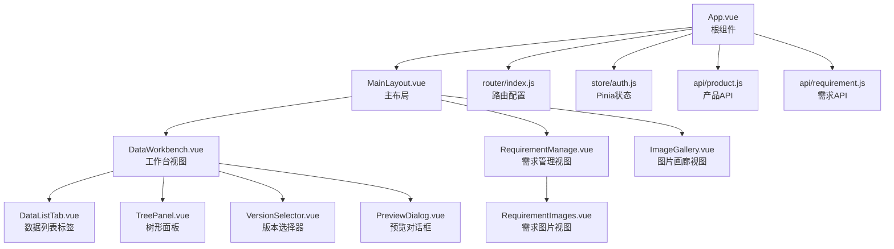
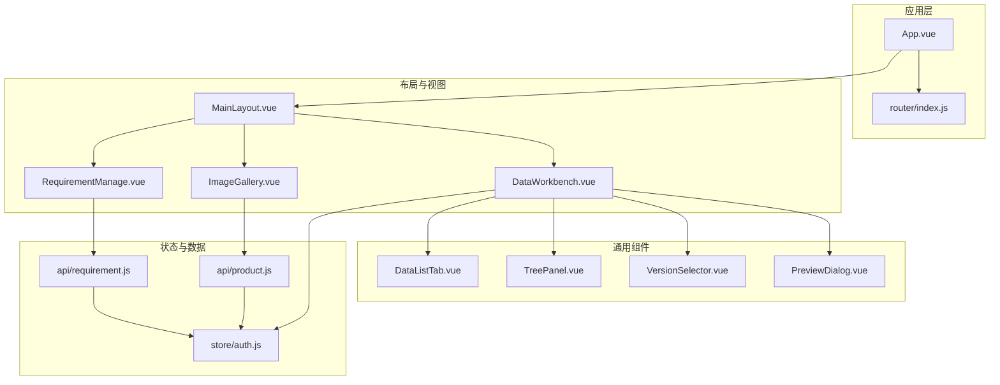
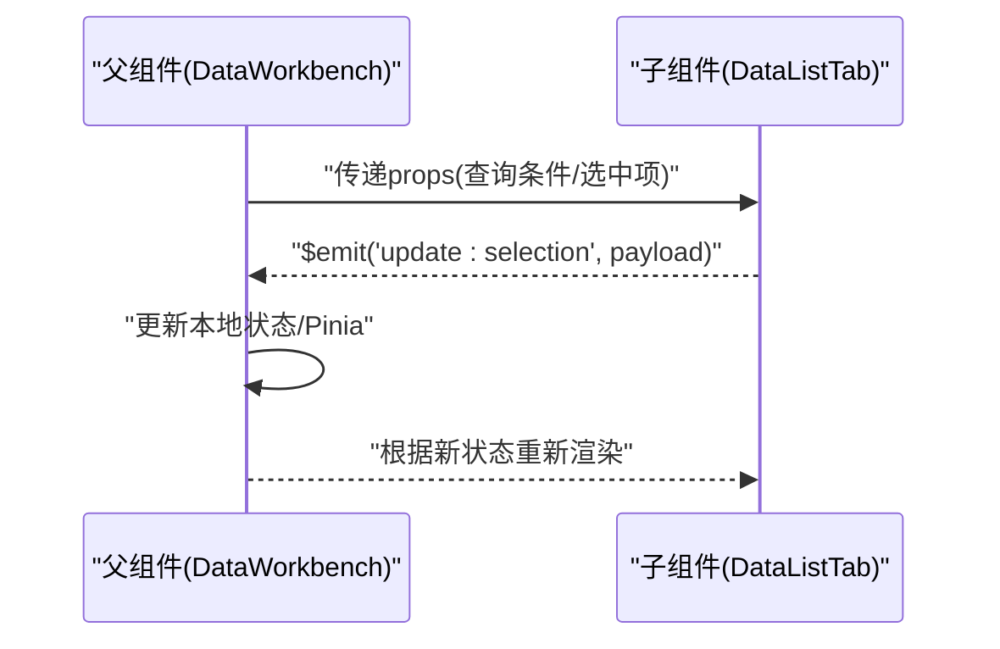
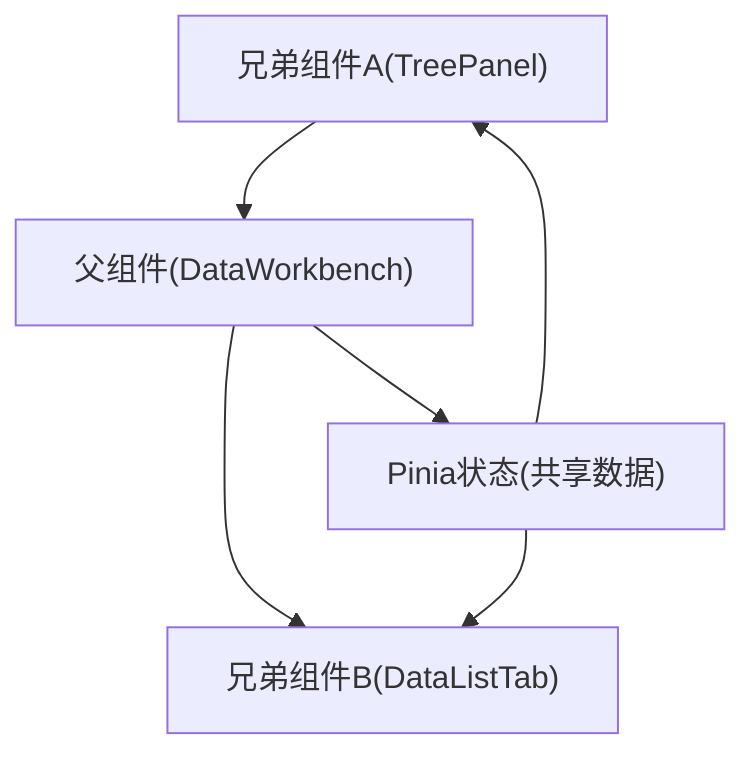
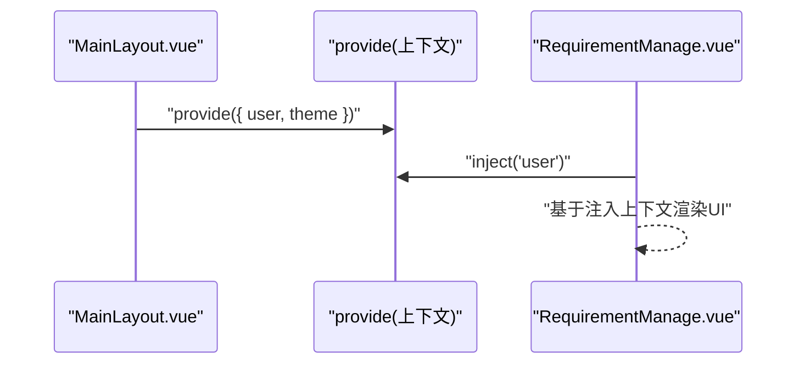
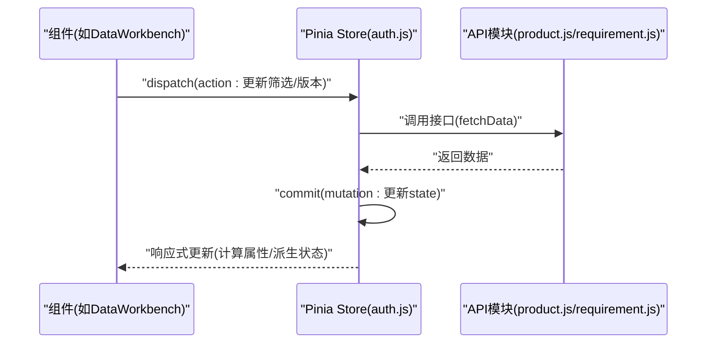
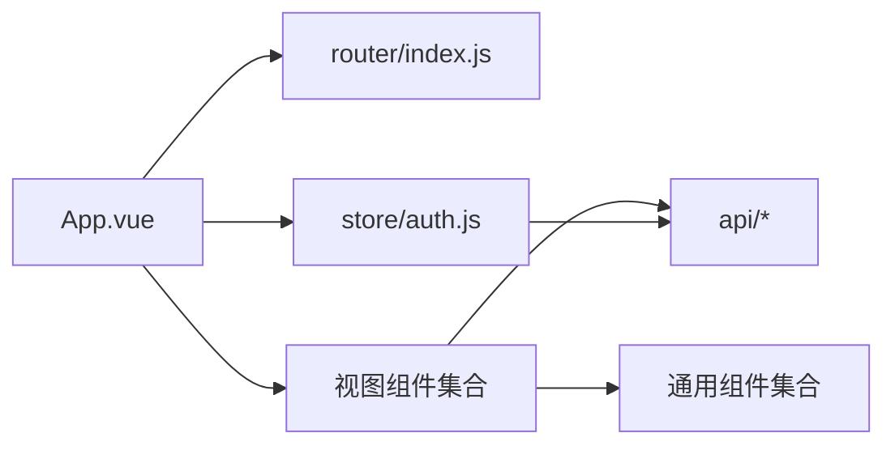

# 组件通信机制

<cite>
**本文档引用的文件**
- [App.vue](file://frontend/src/App.vue)
- [main.js](file://frontend/src/main.js)
- [MainLayout.vue](file://frontend/src/layout/MainLayout.vue)
- [DataWorkbench.vue](file://frontend/src/views/dashboard/DataWorkbench.vue)
- [DataListTab.vue](file://frontend/src/components/DataListTab.vue)
- [TreePanel.vue](file://frontend/src/components/TreePanel.vue)
- [VersionSelector.vue](file://frontend/src/components/VersionSelector.vue)
- [PreviewDialog.vue](file://frontend/src/components/PreviewDialog.vue)
- [RequirementManage.vue](file://frontend/src/views/requirement/RequirementManage.vue)
- [RequirementImages.vue](file://frontend/src/views/requirement/RequirementImages.vue)
- [ImageGallery.vue](file://frontend/src/views/system/ImageGallery.vue)
- [auth.js](file://frontend/src/store/auth.js)
- [index.js](file://frontend/src/router/index.js)
- [product.js](file://frontend/src/api/product.js)
- [requirement.js](file://frontend/src/api/requirement.js)
</cite>

## 目录
1. [引言](#引言)
2. [项目结构](#项目结构)
3. [核心组件](#核心组件)
4. [架构总览](#架构总览)
5. [详细组件分析](#详细组件分析)
6. [依赖关系分析](#依赖关系分析)
7. [性能考虑](#性能考虑)
8. [故障排查指南](#故障排查指南)
9. [结论](#结论)
10. [附录](#附录)

## 引言
本文件系统性梳理前端Vue项目中的组件通信机制，覆盖父子通信、兄弟通信与跨层级通信，深入解析props传递策略、事件发射机制以及provide/inject依赖注入模式，并结合Pinia状态管理在组件通信中的应用，说明状态同步机制与数据流管理。同时提供最佳实践、性能优化技巧、常见问题解决方案、调试方法、监控策略与测试验证手段，帮助开发者在复杂业务场景中构建可维护、高性能的组件通信体系。

## 项目结构
前端采用Vue 3 + Vite + Pinia + Vue Router的现代单页应用架构。组件主要分布在以下位置：
- 布局层：MainLayout.vue
- 视图层：各页面视图组件（如DataWorkbench.vue、RequirementManage.vue等）
- 通用组件：DataListTab.vue、TreePanel.vue、VersionSelector.vue、PreviewDialog.vue等
- 状态管理：store目录下的auth.js等模块
- 路由配置：router/index.js
- API封装：api目录下的product.js、requirement.js等

图表来源
- [App.vue:1-200](file://frontend/src/App.vue#L1-L200)
- [MainLayout.vue:1-200](file://frontend/src/layout/MainLayout.vue#L1-L200)
- [DataWorkbench.vue:1-200](file://frontend/src/views/dashboard/DataWorkbench.vue#L1-L200)
- [DataListTab.vue:1-200](file://frontend/src/components/DataListTab.vue#L1-L200)
- [TreePanel.vue:1-200](file://frontend/src/components/TreePanel.vue#L1-L200)
- [VersionSelector.vue:1-200](file://frontend/src/components/VersionSelector.vue#L1-L200)
- [PreviewDialog.vue:1-200](file://frontend/src/components/PreviewDialog.vue#L1-L200)
- [RequirementManage.vue:1-200](file://frontend/src/views/requirement/RequirementManage.vue#L1-L200)
- [RequirementImages.vue:1-200](file://frontend/src/views/requirement/RequirementImages.vue#L1-L200)
- [ImageGallery.vue:1-200](file://frontend/src/views/system/ImageGallery.vue#L1-L200)
- [index.js:1-200](file://frontend/src/router/index.js#L1-L200)
- [auth.js:1-200](file://frontend/src/store/auth.js#L1-L200)
- [product.js:1-200](file://frontend/src/api/product.js#L1-L200)
- [requirement.js:1-200](file://frontend/src/api/requirement.js#L1-L200)

章节来源
- [App.vue:1-200](file://frontend/src/App.vue#L1-L200)
- [main.js:1-200](file://frontend/src/main.js#L1-L200)
- [index.js:1-200](file://frontend/src/router/index.js#L1-L200)

## 核心组件
本节聚焦于组件通信的关键参与者及其职责：
- 根组件App.vue：应用入口，承载全局状态与路由挂载点
- 主布局MainLayout.vue：承载导航、侧边栏与内容区，是多数视图的容器
- 工作台DataWorkbench.vue：聚合多个功能组件，承担跨组件协调职责
- 通用组件：DataListTab、TreePanel、VersionSelector、PreviewDialog等，负责具体业务展示与交互
- 视图组件：RequirementManage、RequirementImages、ImageGallery等，承载业务页面逻辑
- Pinia状态：auth.js提供认证相关状态与派生计算
- 路由：index.js定义页面级导航与参数传递
- API层：product.js、requirement.js封装后端接口调用

章节来源
- [App.vue:1-200](file://frontend/src/App.vue#L1-L200)
- [MainLayout.vue:1-200](file://frontend/src/layout/MainLayout.vue#L1-L200)
- [DataWorkbench.vue:1-200](file://frontend/src/views/dashboard/DataWorkbench.vue#L1-L200)
- [auth.js:1-200](file://frontend/src/store/auth.js#L1-L200)
- [index.js:1-200](file://frontend/src/router/index.js#L1-L200)

## 架构总览
下图展示了组件通信的整体架构：根组件通过路由驱动视图切换；视图组件通过props接收来自父级或状态管理的数据；子组件通过事件向上冒泡；跨层级通过provide/inject共享上下文；Pinia提供集中式状态管理与响应式数据流。

图表来源
- [App.vue:1-200](file://frontend/src/App.vue#L1-L200)
- [MainLayout.vue:1-200](file://frontend/src/layout/MainLayout.vue#L1-L200)
- [DataWorkbench.vue:1-200](file://frontend/src/views/dashboard/DataWorkbench.vue#L1-L200)
- [auth.js:1-200](file://frontend/src/store/auth.js#L1-L200)
- [index.js:1-200](file://frontend/src/router/index.js#L1-L200)
- [product.js:1-200](file://frontend/src/api/product.js#L1-L200)
- [requirement.js:1-200](file://frontend/src/api/requirement.js#L1-L200)

## 详细组件分析

### 父子组件通信（Props与事件）
- 传递策略
  - 父传子：通过props向下传递只读数据，避免直接修改父状态
  - 子传父：通过$emit触发自定义事件，父组件监听并更新状态
  - 双向绑定：对表单类输入建议使用v-model或显式prop+事件模式
- 典型场景
  - DataWorkbench作为容器，向DataListTab、TreePanel、VersionSelector等子组件传递查询条件、选中项、版本信息等
  - 子组件通过事件通知父组件更新筛选器、刷新列表或打开弹窗
- 最佳实践
  - 明确props类型与默认值，使用严格模式校验
  - 将复杂对象以不可变方式传递，必要时深拷贝
  - 使用事件命名规范，避免命名冲突

图表来源
- [DataWorkbench.vue:1-200](file://frontend/src/views/dashboard/DataWorkbench.vue#L1-L200)
- [DataListTab.vue:1-200](file://frontend/src/components/DataListTab.vue#L1-L200)

章节来源
- [DataWorkbench.vue:1-200](file://frontend/src/views/dashboard/DataWorkbench.vue#L1-L200)
- [DataListTab.vue:1-200](file://frontend/src/components/DataListTab.vue#L1-L200)

### 兄弟组件通信（同级协作）
- 传递策略
  - 通过共同父组件中转：兄弟A通过父组件事件，父组件再向兄弟B发送props
  - 通过共享状态：将共享数据放入Pinia，兄弟组件各自订阅
- 典型场景
  - TreePanel的节点选择变化需要同步到DataListTab的筛选器
  - VersionSelector的版本切换影响PreviewDialog的预览内容
- 最佳实践
  - 避免兄弟间直接耦合，优先通过父组件或状态中心协调
  - 对频繁变更的状态使用防抖/节流

图表来源
- [TreePanel.vue:1-200](file://frontend/src/components/TreePanel.vue#L1-L200)
- [DataListTab.vue:1-200](file://frontend/src/components/DataListTab.vue#L1-L200)
- [DataWorkbench.vue:1-200](file://frontend/src/views/dashboard/DataWorkbench.vue#L1-L200)
- [auth.js:1-200](file://frontend/src/store/auth.js#L1-L200)

章节来源
- [TreePanel.vue:1-200](file://frontend/src/components/TreePanel.vue#L1-L200)
- [DataListTab.vue:1-200](file://frontend/src/components/DataListTab.vue#L1-L200)
- [DataWorkbench.vue:1-200](file://frontend/src/views/dashboard/DataWorkbench.vue#L1-L200)

### 跨层级组件通信（Provide/Inject）
- 应用场景
  - 在MainLayout中provide全局上下文（如当前用户、主题设置、语言环境），深层视图如RequirementManage、ImageGallery按需inject使用
  - 将API实例或工具函数注入到多处组件，减少重复导入
- 最佳实践
  - provide/inject仅用于跨层级共享“弱依赖”，避免形成隐式耦合
  - 对inject的值提供默认回退，确保在未注入时也能正常运行
  - 控制注入粒度，避免一次性注入过多无关数据

图表来源
- [MainLayout.vue:1-200](file://frontend/src/layout/MainLayout.vue#L1-L200)
- [RequirementManage.vue:1-200](file://frontend/src/views/requirement/RequirementManage.vue#L1-L200)

章节来源
- [MainLayout.vue:1-200](file://frontend/src/layout/MainLayout.vue#L1-L200)
- [RequirementManage.vue:1-200](file://frontend/src/views/requirement/RequirementManage.vue#L1-L200)

### Pinia状态管理在组件通信中的应用
- 状态同步机制
  - 将共享状态（如登录态、当前版本、筛选条件）集中存放在Pinia Store
  - 组件通过mapState/mapGetters/mapActions访问与更新状态，保证多处使用的一致性
  - 订阅store变化，自动触发相关组件的响应式更新
- 数据流管理
  - 单向数据流：视图触发action -> 修改state -> 派生计算/计算属性驱动UI
  - 异步流程：通过action封装API调用，统一处理loading、错误与成功回调
- 典型用法
  - 认证状态：auth.js提供用户信息与登录登出逻辑
  - 版本选择：VersionSelector与Pinia联动，其他组件通过store读取当前版本
  - 列表筛选：DataWorkbench将筛选条件写入store，DataListTab监听并刷新数据

图表来源
- [auth.js:1-200](file://frontend/src/store/auth.js#L1-L200)
- [DataWorkbench.vue:1-200](file://frontend/src/views/dashboard/DataWorkbench.vue#L1-L200)
- [product.js:1-200](file://frontend/src/api/product.js#L1-L200)
- [requirement.js:1-200](file://frontend/src/api/requirement.js#L1-L200)

章节来源
- [auth.js:1-200](file://frontend/src/store/auth.js#L1-L200)
- [DataWorkbench.vue:1-200](file://frontend/src/views/dashboard/DataWorkbench.vue#L1-L200)
- [product.js:1-200](file://frontend/src/api/product.js#L1-L200)
- [requirement.js:1-200](file://frontend/src/api/requirement.js#L1-L200)

### 组件通信的调试方法、监控策略与测试验证
- 调试方法
  - 使用Vue DevTools观察组件树、props、事件与Pinia状态变化
  - 在关键事件与状态变更处添加日志，记录数据流向
  - 对复杂流程绘制时序图，定位事件传播路径
- 监控策略
  - 为高频事件与API调用埋点，统计调用次数与耗时
  - 监控Pinia状态变更频率，识别不必要的重渲染
- 测试验证
  - 单元测试：针对事件发射与props接收进行断言
  - 集成测试：模拟父子/兄弟组件协作，验证数据一致性
  - 端到端测试：覆盖路由切换与状态持久化场景

## 依赖关系分析
- 组件依赖
  - DataWorkbench依赖DataListTab、TreePanel、VersionSelector、PreviewDialog等子组件
  - 视图组件依赖布局组件与通用组件
- 外部依赖
  - Vue Router负责页面级导航与参数传递
  - Pinia提供集中式状态管理
  - API模块封装HTTP请求，供视图与组件使用

图表来源
- [App.vue:1-200](file://frontend/src/App.vue#L1-L200)
- [index.js:1-200](file://frontend/src/router/index.js#L1-L200)
- [auth.js:1-200](file://frontend/src/store/auth.js#L1-L200)
- [product.js:1-200](file://frontend/src/api/product.js#L1-L200)
- [requirement.js:1-200](file://frontend/src/api/requirement.js#L1-L200)

章节来源
- [App.vue:1-200](file://frontend/src/App.vue#L1-L200)
- [index.js:1-200](file://frontend/src/router/index.js#L1-L200)
- [auth.js:1-200](file://frontend/src/store/auth.js#L1-L200)

## 性能考虑
- 渲染优化
  - 合理拆分组件，避免不必要的整体重渲染
  - 使用key确保列表正确复用，减少DOM操作
  - 对大列表使用虚拟滚动或分页
- 状态更新
  - 将复杂计算放入computed或getter，避免在模板中执行重型逻辑
  - 批量更新状态，减少多次渲染
- 事件与API
  - 对高频事件使用防抖/节流
  - 合理缓存API结果，避免重复请求
- 资源加载
  - 按需加载非关键组件与路由懒加载
  - 图片与资源使用懒加载与CDN

## 故障排查指南
- 常见问题
  - props类型不匹配导致渲染异常：检查类型声明与默认值
  - 事件未触发或未被监听：确认事件名大小写与监听器绑定
  - 状态不同步：检查是否通过Pinia统一更新，避免直接修改state
  - 注入值为空：确认provide调用位置与inject使用时机
- 排查步骤
  - 使用控制台输出关键数据快照
  - 逐步缩小范围，先验证事件链路，再检查状态更新
  - 对比预期与实际行为，绘制流程图定位偏差

## 结论
本项目通过清晰的组件分层与Pinia状态管理，实现了父子、兄弟与跨层级的高效通信。遵循单向数据流与事件驱动原则，配合provide/inject与路由参数，能够支撑复杂的业务场景。建议持续完善调试与监控体系，强化单元与集成测试，确保在功能扩展过程中保持通信机制的稳定性与可维护性。

## 附录
- 最佳实践清单
  - 明确组件边界，避免过度耦合
  - 优先使用Pinia管理共享状态
  - 事件命名规范化，便于追踪
  - 提供默认值与类型校验
  - 对高频操作进行性能优化
- 推荐工具
  - Vue DevTools、Pinia Devtools
  - 性能分析工具（如Lighthouse、浏览器性能面板）
  - 日志与埋点系统