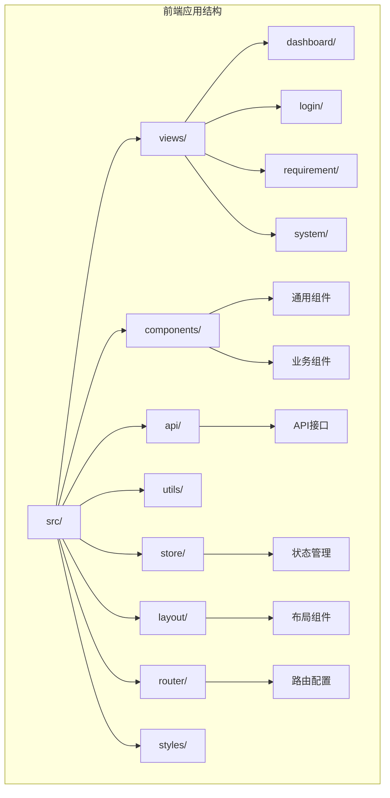
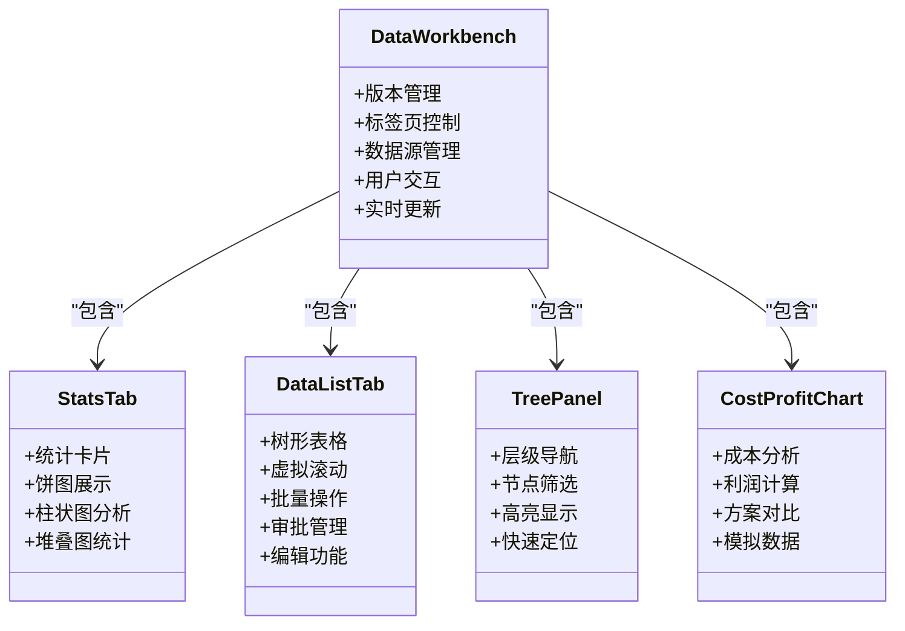
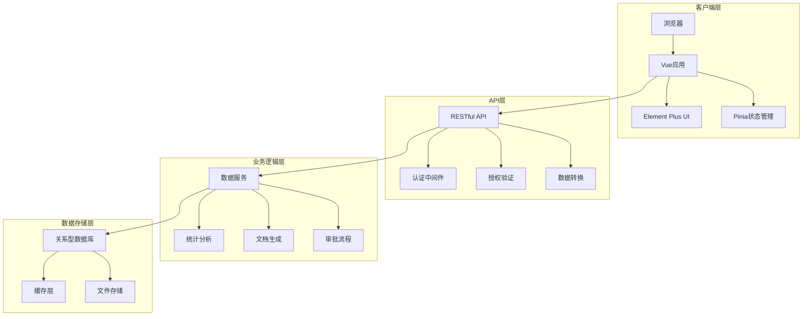
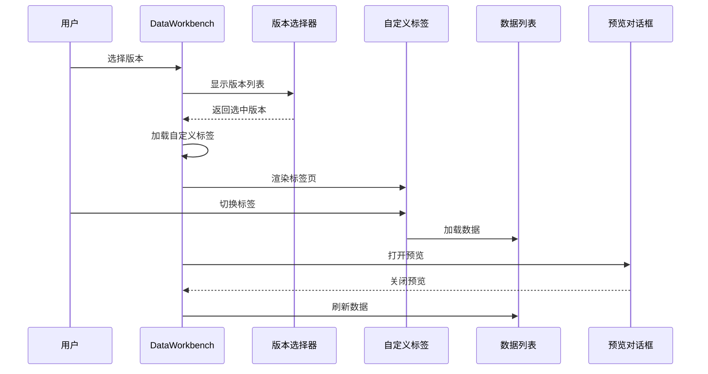
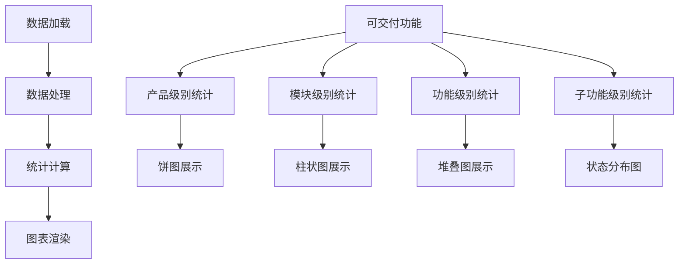
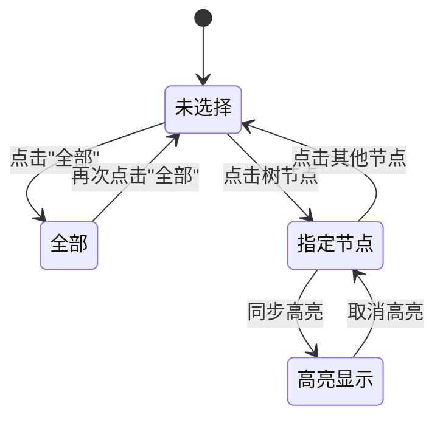
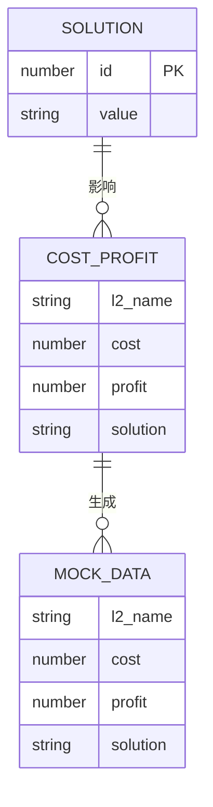
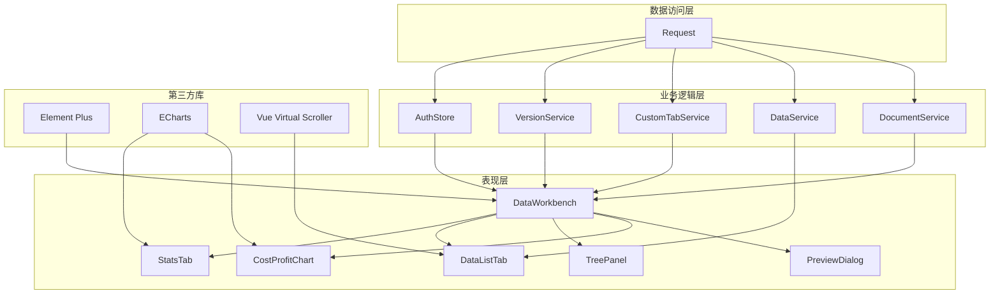
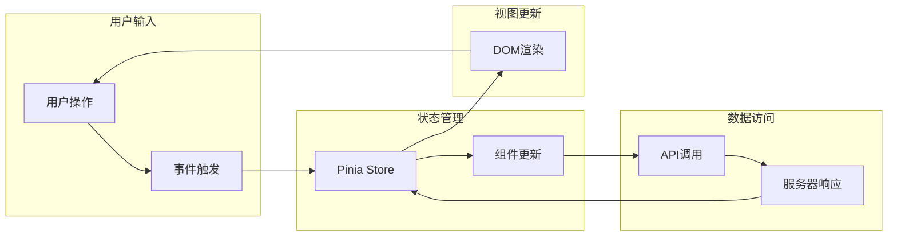

# 仪表板页面

<cite>
**本文档引用的文件**
- [DataWorkbench.vue](file://frontend/src/views/dashboard/DataWorkbench.vue)
- [StatsTab.vue](file://frontend/src/components/StatsTab.vue)
- [DataListTab.vue](file://frontend/src/components/DataListTab.vue)
- [TreePanel.vue](file://frontend/src/components/TreePanel.vue)
- [CostProfitChart.vue](file://frontend/src/components/CostProfitChart.vue)
- [data.js](file://frontend/src/api/data.js)
- [version.js](file://frontend/src/api/version.js)
- [customTab.js](file://frontend/src/api/customTab.js)
- [document.js](file://frontend/src/api/document.js)
- [option.js](file://frontend/src/api/option.js)
- [request.js](file://frontend/src/utils/request.js)
- [router/index.js](file://frontend/src/router/index.js)
- [main.js](file://frontend/src/main.js)
- [MainLayout.vue](file://frontend/src/layout/MainLayout.vue)
- [liquid-glass-theme.css](file://frontend/src/styles/liquid-glass-theme.css)
- [auth.js](file://frontend/src/store/auth.js)
</cite>

## 目录
1. [简介](#简介)
2. [项目结构](#项目结构)
3. [核心组件](#核心组件)
4. [架构概览](#架构概览)
5. [详细组件分析](#详细组件分析)
6. [依赖关系分析](#依赖关系分析)
7. [性能考虑](#性能考虑)
8. [故障排除指南](#故障排除指南)
9. [结论](#结论)
10. [附录](#附录)

## 简介

DataWorkbench仪表板是基于Vue 3 + Element Plus构建的企业级数据可视化工作台，旨在为用户提供全面的产品清单管理和数据分析能力。该系统采用现代化的前端技术栈，结合响应式设计理念，为企业决策者和业务分析师提供直观、高效的数据展示界面。

### 设计理念

系统遵循"以数据为中心"的设计原则，通过多层次的数据可视化组件和灵活的交互模式，实现从宏观统计到微观详情的全方位数据洞察。核心设计亮点包括：

- **模块化架构**：采用组件化设计，每个功能模块独立封装，便于维护和扩展
- **响应式布局**：适配不同屏幕尺寸，确保在各种设备上的良好体验
- **实时数据更新**：通过轮询机制和事件驱动实现数据的实时同步
- **用户友好界面**：简洁直观的操作界面，降低用户学习成本

### 核心功能特性

- 多版本数据管理与切换
- 自定义清单创建与维护
- 实时统计数据展示
- 丰富的数据可视化图表
- 审批流程管理
- 文档生成功能
- 智能化数据标注

## 项目结构

前端项目采用标准的Vue 3单页应用架构，主要目录结构如下：

**图表来源**
- [main.js:1-20](file://frontend/src/main.js#L1-L20)
- [router/index.js:1-129](file://frontend/src/router/index.js#L1-L129)

### 文件组织策略

项目采用按功能域分层的组织方式：

- **views/**: 页面级组件，负责页面布局和业务逻辑协调
- **components/**: 可复用的UI组件，按功能分类组织
- **api/**: 数据访问层，封装所有HTTP请求
- **utils/**: 工具函数和辅助类
- **store/**: Pinia状态管理
- **layout/**: 布局组件
- **styles/**: 样式文件和主题配置

**章节来源**
- [main.js:1-20](file://frontend/src/main.js#L1-L20)
- [router/index.js:1-129](file://frontend/src/router/index.js#L1-L129)

## 核心组件

DataWorkbench仪表板由多个核心组件协同工作，形成完整的数据展示生态系统。以下是主要组件的功能概述：

### 主要组件架构

**图表来源**
- [DataWorkbench.vue:1-1144](file://frontend/src/views/dashboard/DataWorkbench.vue#L1-L1144)
- [StatsTab.vue:1-343](file://frontend/src/components/StatsTab.vue#L1-L343)
- [DataListTab.vue:1-800](file://frontend/src/components/DataListTab.vue#L1-L800)
- [TreePanel.vue:1-200](file://frontend/src/components/TreePanel.vue#L1-L200)
- [CostProfitChart.vue:1-344](file://frontend/src/components/CostProfitChart.vue#L1-L344)

### 组件间协作关系

各组件通过props和events进行通信，形成松耦合的架构设计：

- **DataWorkbench** 作为根组件，负责全局状态管理和组件协调
- **StatsTab** 提供静态统计信息，不依赖外部数据源
- **DataListTab** 负责动态数据展示和用户交互
- **TreePanel** 提供导航和筛选功能
- **CostProfitChart** 展示成本利润分析

**章节来源**
- [DataWorkbench.vue:315-800](file://frontend/src/views/dashboard/DataWorkbench.vue#L315-L800)
- [StatsTab.vue:50-287](file://frontend/src/components/StatsTab.vue#L50-L287)

## 架构概览

DataWorkbench采用前后端分离的微服务架构，通过RESTful API进行数据交互。系统架构分为四个主要层次：

### 整体架构设计

**图表来源**
- [request.js:1-65](file://frontend/src/utils/request.js#L1-L65)
- [data.js:1-128](file://frontend/src/api/data.js#L1-L128)
- [version.js:1-34](file://frontend/src/api/version.js#L1-L34)

### 技术栈选择

系统采用现代前端技术栈，确保良好的开发体验和运行性能：

- **Vue 3**: 最新的Vue.js版本，提供更好的性能和开发体验
- **Element Plus**: 企业级UI组件库，提供丰富的交互组件
- **Pinia**: Vue官方推荐的状态管理库
- **Axios**: 强大的HTTP客户端库
- **ECharts**: 专业的数据可视化图表库
- **Vue Virtual Scroller**: 高性能虚拟滚动解决方案

**章节来源**
- [main.js:1-20](file://frontend/src/main.js#L1-L20)
- [liquid-glass-theme.css:1-236](file://frontend/src/styles/liquid-glass-theme.css#L1-L236)

## 详细组件分析

### DataWorkbench主面板组件

DataWorkbench是仪表板的核心组件，负责协调各个子组件的工作。该组件实现了复杂的业务逻辑和用户交互功能。

#### 核心功能实现

**图表来源**
- [DataWorkbench.vue:456-520](file://frontend/src/views/dashboard/DataWorkbench.vue#L456-L520)
- [DataWorkbench.vue:630-638](file://frontend/src/views/dashboard/DataWorkbench.vue#L630-L638)

#### 版本管理系统

DataWorkbench实现了完整的版本管理功能，支持多版本数据的并行管理和切换：

- **版本选择**: 用户可以选择不同的版本进行查看和编辑
- **版本状态**: 支持草稿和已发布两种状态
- **版本切换**: 实现平滑的版本切换体验
- **数据隔离**: 不同版本的数据相互隔离

#### 自定义清单功能

系统支持用户创建和管理自定义清单，提供灵活的数据组织方式：

- **清单创建**: 支持基于条件筛选创建清单
- **清单管理**: 用户可以重命名、删除自定义清单
- **数据关联**: 清单与具体的产品数据建立关联关系
- **权限控制**: 不同用户对清单具有不同的操作权限

**章节来源**
- [DataWorkbench.vue:1-165](file://frontend/src/views/dashboard/DataWorkbench.vue#L1-L165)
- [DataWorkbench.vue:640-741](file://frontend/src/views/dashboard/DataWorkbench.vue#L640-L741)

### 统计视图组件

StatsTab组件提供了全面的数据统计分析功能，通过多种图表形式展示关键指标。

#### 统计指标体系

组件实现了多层次的统计分析：

- **产品统计**: 统计产品、模块、功能等各级别的数量
- **审批状态**: 展示不同审批状态的数量分布
- **业务分类**: 分析各业务分类的产品分布
- **版本划分**: 统计各版本系列的产品数量

#### 图表实现细节

**图表来源**
- [StatsTab.vue:75-124](file://frontend/src/components/StatsTab.vue#L75-L124)
- [StatsTab.vue:126-282](file://frontend/src/components/StatsTab.vue#L126-L282)

#### 图表交互设计

每个图表都具备完善的交互功能：

- **鼠标悬停**: 显示详细的数值信息
- **点击操作**: 支持图表间的联动操作
- **响应式调整**: 自动适应容器尺寸变化
- **加载状态**: 显示数据加载过程中的占位符

**章节来源**
- [StatsTab.vue:1-343](file://frontend/src/components/StatsTab.vue#L1-L343)

### 数据列表组件

DataListTab是仪表板中最复杂的功能组件，实现了类似Excel的表格功能，支持大量数据的高效展示和操作。

#### 虚拟滚动实现

为处理大量数据，组件采用了Vue Virtual Scroller实现虚拟滚动：

- **高性能渲染**: 只渲染可视区域内的数据行
- **内存优化**: 避免一次性加载所有数据
- **流畅滚动**: 提供接近原生应用的滚动体验
- **智能缓存**: 缓存已渲染的DOM元素

#### 批量操作功能

组件支持多种批量操作，提高用户工作效率：

- **批量选择**: 支持多行数据的选择和操作
- **批量审批**: 支持批量提交、通过、驳回等操作
- **批量修改**: 支持批量修改状态、解决方案等属性
- **批量删除**: 支持批量删除数据记录

#### 审批流程集成

系统深度集成了审批流程管理：

- **状态显示**: 在表格中直接显示审批状态
- **快捷操作**: 支持一键审批操作
- **日志追踪**: 记录每次审批操作的详细信息
- **权限控制**: 不同角色具有不同的审批权限

**章节来源**
- [DataListTab.vue:1-800](file://frontend/src/components/DataListTab.vue#L1-L800)

### 树形导航组件

TreePanel组件提供了层级化的数据导航功能，帮助用户快速定位到目标数据。

#### 导航功能实现

**图表来源**
- [TreePanel.vue:108-142](file://frontend/src/components/TreePanel.vue#L108-L142)
- [TreePanel.vue:69-81](file://frontend/src/components/TreePanel.vue#L69-L81)

#### 搜索过滤功能

组件支持实时搜索和过滤：

- **文本搜索**: 支持按节点名称进行搜索
- **实时过滤**: 输入时自动过滤显示结果
- **高亮匹配**: 匹配的文本进行高亮显示
- **模糊匹配**: 支持部分匹配和模糊搜索

#### 高亮同步机制

当用户在其他组件中选择特定数据时，TreePanel会自动高亮显示对应的节点：

- **位置同步**: 自动滚动到目标节点位置
- **视觉反馈**: 通过颜色和样式变化标识当前节点
- **路径高亮**: 高亮显示从根节点到目标节点的完整路径

**章节来源**
- [TreePanel.vue:1-200](file://frontend/src/components/TreePanel.vue#L1-L200)

### 成本利润分析组件

CostProfitChart组件专门用于展示产品的成本和利润分析，虽然当前使用模拟数据，但已为真实数据集成做好了准备。

#### 数据模型设计

**图表来源**
- [CostProfitChart.vue:68-89](file://frontend/src/components/CostProfitChart.vue#L68-L89)
- [CostProfitChart.vue:206-214](file://frontend/src/components/CostProfitChart.vue#L206-L214)

#### 图表交互设计

组件提供了完整的交互体验：

- **展开/收起**: 支持图表的展开和收起操作
- **方案切换**: 支持不同方案的成本利润对比
- **数据刷新**: 支持手动刷新和自动更新
- **响应式布局**: 自适应不同屏幕尺寸

#### 模拟数据生成

为了演示目的，组件实现了智能的模拟数据生成：

- **随机成本**: 基于平均值生成合理的成本数据
- **利润计算**: 根据成本和利润率计算利润
- **数据分布**: 模拟真实的成本利润分布特征
- **格式化显示**: 支持金额的千分位和单位显示

**章节来源**
- [CostProfitChart.vue:1-344](file://frontend/src/components/CostProfitChart.vue#L1-L344)

## 依赖关系分析

DataWorkbench仪表板的依赖关系体现了清晰的分层架构设计，各层之间职责明确，耦合度低。

### 组件依赖图

**图表来源**
- [DataWorkbench.vue:315-331](file://frontend/src/views/dashboard/DataWorkbench.vue#L315-L331)
- [DataListTab.vue:610-621](file://frontend/src/components/DataListTab.vue#L610-L621)

### 数据流分析

系统采用单向数据流的设计模式，确保数据的一致性和可预测性：

**图表来源**
- [auth.js:1-46](file://frontend/src/store/auth.js#L1-L46)
- [request.js:24-62](file://frontend/src/utils/request.js#L24-L62)

### 性能依赖关系

系统在性能方面做了充分的优化考虑：

- **懒加载**: 路由级别的代码分割
- **组件缓存**: Vue的keep-alive缓存机制
- **虚拟滚动**: 大数据量场景下的性能优化
- **请求去重**: 防止重复请求相同数据

**章节来源**
- [DataWorkbench.vue:315-500](file://frontend/src/views/dashboard/DataWorkbench.vue#L315-L500)
- [DataListTab.vue:682-684](file://frontend/src/components/DataListTab.vue#L682-L684)

## 性能考虑

DataWorkbench在设计时充分考虑了性能优化，采用多种策略确保在大数据量场景下的流畅体验。

### 前端性能优化

#### 虚拟滚动技术

DataListTab组件采用Vue Virtual Scroller实现虚拟滚动，有效解决大数据量渲染问题：

- **只渲染可见区域**: 减少DOM节点数量，提升渲染性能
- **智能缓存机制**: 缓存已渲染的元素，避免重复创建
- **内存管理**: 自动清理不可见区域的元素，控制内存使用
- **滚动优化**: 平滑的滚动体验，无卡顿现象

#### 组件懒加载

系统采用路由级别的懒加载策略：

- **按需加载**: 只在访问相应页面时才加载组件代码
- **代码分割**: 将大文件拆分成多个小文件，减少首屏加载时间
- **缓存策略**: 利用浏览器缓存机制，重复访问更快

#### 请求优化

API层实现了多项请求优化策略：

- **请求去重**: 相同请求在执行期间会被合并
- **超时控制**: 合理设置请求超时时间，避免长时间阻塞
- **错误重试**: 对临时性错误进行自动重试
- **批量请求**: 支持多个请求的批量处理

### 后端性能优化

#### 数据库优化

系统采用多种数据库优化策略：

- **索引优化**: 为常用查询字段建立合适的索引
- **查询优化**: 使用高效的SQL查询语句
- **连接池**: 管理数据库连接，避免频繁创建销毁
- **缓存策略**: 使用Redis等缓存技术提升查询速度

#### 缓存机制

系统实现了多层缓存机制：

- **浏览器缓存**: 利用HTTP缓存头控制资源缓存
- **应用缓存**: 在应用层缓存热点数据
- **数据库缓存**: 使用数据库自身的查询缓存
- **CDN加速**: 静态资源通过CDN分发

### 监控和诊断

系统内置了性能监控和诊断功能：

- **性能指标收集**: 收集关键性能指标数据
- **错误监控**: 自动捕获和报告运行时错误
- **用户行为分析**: 分析用户操作行为，优化用户体验
- **性能告警**: 当性能指标异常时及时告警

## 故障排除指南

DataWorkbench提供了完善的错误处理和故障排除机制，帮助用户快速定位和解决问题。

### 常见问题及解决方案

#### 登录认证问题

**问题描述**: 用户无法登录或登录后立即跳转到登录页

**可能原因**:
- Token过期或无效
- 网络连接问题
- 服务器认证服务异常

**解决方案**:
1. 检查网络连接是否正常
2. 清除浏览器缓存和Cookie
3. 重新登录系统
4. 检查服务器认证服务状态

#### 数据加载失败

**问题描述**: 页面数据无法加载或加载缓慢

**可能原因**:
- API接口响应超时
- 数据库查询性能问题
- 网络传输中断

**解决方案**:
1. 检查API接口状态
2. 查看浏览器开发者工具的Network面板
3. 重启相关服务进程
4. 清理缓存数据

#### 图表渲染异常

**问题描述**: ECharts图表无法正常显示或显示异常

**可能原因**:
- 容器尺寸未正确设置
- 数据格式不符合要求
- 图表实例未正确初始化

**解决方案**:
1. 确保图表容器有明确的宽高
2. 检查数据格式和结构
3. 重新初始化图表实例
4. 查看浏览器控制台错误信息

### 调试工具和技巧

#### 浏览器开发者工具

利用浏览器内置的开发者工具进行调试：

- **Elements面板**: 检查DOM结构和样式
- **Console面板**: 查看JavaScript错误和警告
- **Network面板**: 监控网络请求和响应
- **Performance面板**: 分析页面性能瓶颈

#### 日志记录

系统实现了多层次的日志记录：

- **用户操作日志**: 记录用户的重要操作
- **系统运行日志**: 记录系统运行状态
- **错误日志**: 记录系统错误和异常
- **性能日志**: 记录性能相关指标

#### 错误恢复机制

系统具备自动错误恢复能力：

- **自动重试**: 对临时性错误进行自动重试
- **降级处理**: 在部分功能异常时提供降级方案
- **状态恢复**: 在错误恢复后自动恢复到正常状态
- **用户提示**: 及时向用户反馈错误信息和处理建议

**章节来源**
- [request.js:51-62](file://frontend/src/utils/request.js#L51-L62)
- [DataWorkbench.vue:436-439](file://frontend/src/views/dashboard/DataWorkbench.vue#L436-L439)

## 结论

DataWorkbench仪表板是一个功能完整、设计精良的企业级数据可视化平台。通过模块化的设计、响应式的布局和丰富的交互功能，为用户提供了优秀的数据展示和分析体验。

### 技术优势

- **架构清晰**: 采用分层架构，职责明确，易于维护和扩展
- **性能优秀**: 通过虚拟滚动、懒加载等技术确保大数据量场景下的流畅体验
- **用户体验**: 简洁直观的界面设计，符合用户的操作习惯
- **功能丰富**: 涵盖数据展示、分析、编辑、审批等完整业务流程

### 发展前景

随着业务的发展和技术的进步，DataWorkbench将继续演进：

- **AI集成**: 集成更多人工智能功能，提供智能化的数据分析
- **移动端适配**: 进一步优化移动端体验，支持移动办公
- **实时协作**: 支持多用户实时协作和数据共享
- **扩展生态**: 提供开放的API和插件机制，支持第三方扩展

该系统为企业数字化转型提供了强有力的技术支撑，是现代企业数据管理的理想选择。

## 附录

### API接口规范

系统提供了完整的API接口文档，支持RESTful风格的HTTP请求。

#### 数据操作接口

| 接口 | 方法 | 描述 | 参数 |
|------|------|------|------|
| `/data/tree/:versionId` | GET | 获取树形结构数据 | versionId: 版本ID |
| `/data/query/:versionId` | GET | 查询数据列表 | versionId: 版本ID, 其他查询参数 |
| `/data` | POST | 创建数据记录 | JSON格式的数据对象 |
| `/data/:id` | PUT | 更新数据记录 | id: 数据ID, JSON格式更新内容 |
| `/data/:id` | DELETE | 删除数据记录 | id: 数据ID |

#### 版本管理接口

| 接口 | 方法 | 描述 | 参数 |
|------|------|------|------|
| `/versions` | GET | 获取版本列表 | 无 |
| `/versions` | POST | 创建新版本 | JSON格式的版本信息 |
| `/versions/:id/release` | POST | 发布版本 | id: 版本ID |
| `/versions/:id/rollback` | POST | 回滚版本 | id: 版本ID |

#### 自定义清单接口

| 接口 | 方法 | 描述 | 参数 |
|------|------|------|------|
| `/custom-tab/:versionId` | GET | 获取清单列表 | versionId: 版本ID |
| `/custom-tab` | POST | 创建清单 | JSON格式的清单信息 |
| `/custom-tab/:id` | PUT | 重命名清单 | id: 清单ID, name: 新名称 |
| `/custom-tab/:id` | DELETE | 删除清单 | id: 清单ID |

### 配置选项

系统支持多种配置选项，满足不同环境和需求：

#### 主题配置

- **颜色主题**: 支持深色和浅色主题切换
- **字体大小**: 可调节字体大小适应不同用户需求
- **布局模式**: 支持左右布局和上下布局
- **动画效果**: 可开启或关闭过渡动画效果

#### 功能配置

- **数据刷新**: 设置自动刷新间隔时间
- **显示选项**: 控制各种数据显示和隐藏
- **权限控制**: 配置不同角色的功能权限
- **通知设置**: 配置系统通知和提醒方式

#### 性能配置

- **缓存策略**: 配置数据缓存和存储策略
- **并发限制**: 控制同时进行的请求数量
- **超时设置**: 配置请求超时和重试机制
- **日志级别**: 控制日志记录的详细程度

### 最佳实践

#### 开发规范

- **组件命名**: 使用语义化的组件名称，遵循PascalCase命名约定
- **状态管理**: 使用Pinia进行状态管理，保持状态的单一事实来源
- **API调用**: 统一通过API层进行数据访问，避免直接调用后端接口
- **错误处理**: 实现统一的错误处理机制，提供友好的错误提示

#### 性能优化

- **代码分割**: 使用路由级别的代码分割，减少首屏加载时间
- **懒加载**: 对不常用的组件和资源采用懒加载策略
- **缓存策略**: 合理使用浏览器缓存和应用缓存
- **虚拟滚动**: 对大数据量列表使用虚拟滚动技术

#### 用户体验

- **响应式设计**: 确保在各种设备和屏幕尺寸下都有良好的体验
- **加载状态**: 为耗时操作提供明确的加载状态提示
- **错误恢复**: 提供错误恢复机制，让用户能够从错误中快速恢复
- **帮助文档**: 提供完善的帮助文档和用户指导

#### 安全考虑

- **身份认证**: 实现安全的身份认证和授权机制
- **数据验证**: 对用户输入进行严格的验证和过滤
- **权限控制**: 实施细粒度的权限控制，防止越权操作
- **安全审计**: 记录重要的安全相关操作，便于审计和追踪