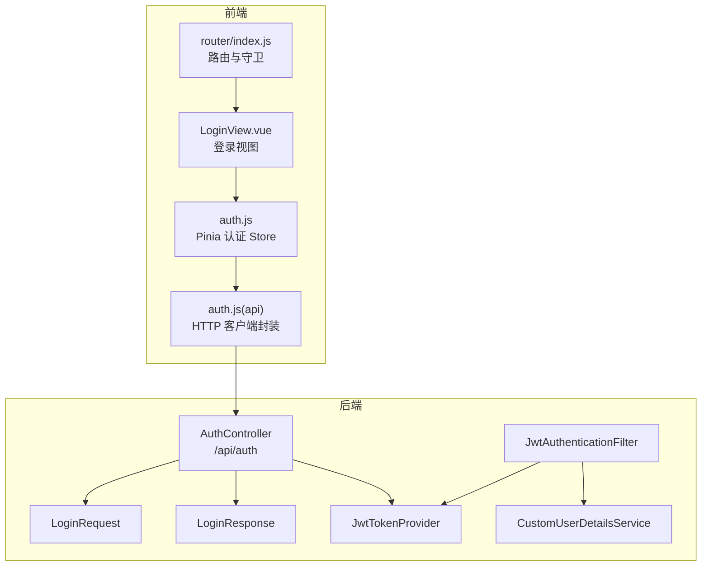
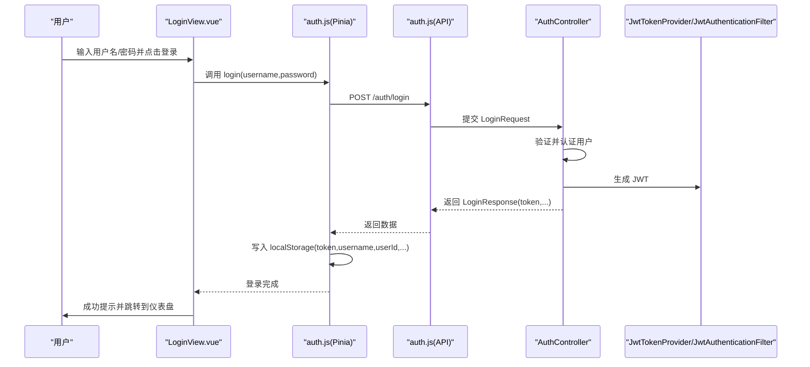
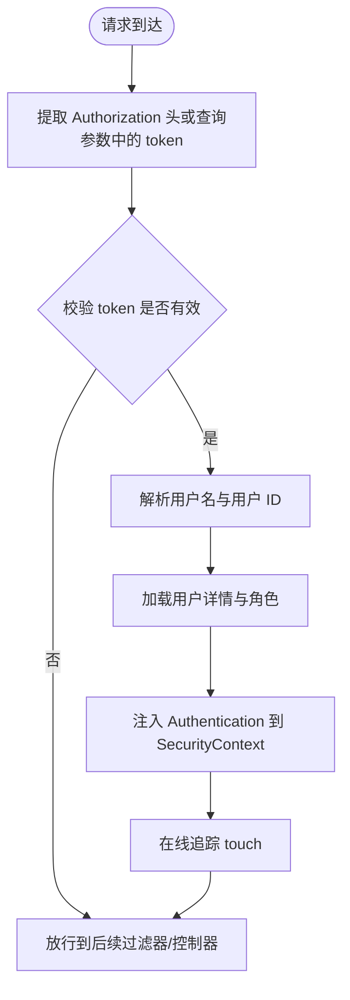
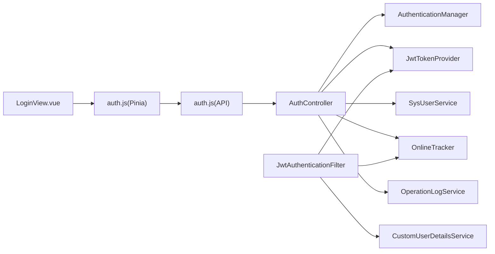

# 登录页面

<cite>
**本文引用的文件**
- [frontend/src/views/login/LoginView.vue](file://frontend/src/views/login/LoginView.vue)
- [frontend/src/store/auth.js](file://frontend/src/store/auth.js)
- [frontend/src/api/auth.js](file://frontend/src/api/auth.js)
- [frontend/src/router/index.js](file://frontend/src/router/index.js)
- [src/main/java/com/superpower/modules/system/controller/AuthController.java](file://src/main/java/com/superpower/modules/system/controller/AuthController.java)
- [src/main/java/com/superpower/modules/system/dto/LoginRequest.java](file://src/main/java/com/superpower/modules/system/dto/LoginRequest.java)
- [src/main/java/com/superpower/modules/system/dto/LoginResponse.java](file://src/main/java/com/superpower/modules/system/dto/LoginResponse.java)
- [src/main/java/com/superpower/security/JwtAuthenticationFilter.java](file://src/main/java/com/superpower/security/JwtAuthenticationFilter.java)
- [src/main/java/com/superpower/security/JwtTokenProvider.java](file://src/main/java/com/superpower/security/JwtTokenProvider.java)
- [src/main/java/com/superpower/security/CustomUserDetailsService.java](file://src/main/java/com/superpower/security/CustomUserDetailsService.java)
</cite>

## 目录
1. [简介](#简介)
2. [项目结构](#项目结构)
3. [核心组件](#核心组件)
4. [架构总览](#架构总览)
5. [详细组件分析](#详细组件分析)
6. [依赖分析](#依赖分析)
7. [性能考虑](#性能考虑)
8. [故障排查指南](#故障排查指南)
9. [结论](#结论)
10. [附录](#附录)

## 简介
本技术文档围绕登录页面展开，系统性解析前端 LoginView 登录组件的设计与实现、表单验证逻辑、用户认证流程以及后端 JWT 集成与会话管理。文档同时覆盖 UI 设计与移动端适配建议、安全防护措施、扩展指南与最佳实践，帮助开发者构建稳定可靠的用户认证界面。

## 项目结构
登录相关代码横跨前端与后端：
- 前端：登录视图、认证状态存储、API 封装、路由守卫
- 后端：认证控制器、请求/响应 DTO、JWT 提供者、过滤器与用户详情服务

图表来源
- [frontend/src/views/login/LoginView.vue:1-209](file://frontend/src/views/login/LoginView.vue#L1-L209)
- [frontend/src/store/auth.js:1-46](file://frontend/src/store/auth.js#L1-L46)
- [frontend/src/api/auth.js:1-22](file://frontend/src/api/auth.js#L1-L22)
- [frontend/src/router/index.js:1-129](file://frontend/src/router/index.js#L1-L129)
- [src/main/java/com/superpower/modules/system/controller/AuthController.java:1-98](file://src/main/java/com/superpower/modules/system/controller/AuthController.java#L1-L98)
- [src/main/java/com/superpower/modules/system/dto/LoginRequest.java:1-14](file://src/main/java/com/superpower/modules/system/dto/LoginRequest.java#L1-L14)
- [src/main/java/com/superpower/modules/system/dto/LoginResponse.java:1-16](file://src/main/java/com/superpower/modules/system/dto/LoginResponse.java#L1-L16)
- [src/main/java/com/superpower/security/JwtAuthenticationFilter.java:1-62](file://src/main/java/com/superpower/security/JwtAuthenticationFilter.java#L1-L62)
- [src/main/java/com/superpower/security/JwtTokenProvider.java:1-66](file://src/main/java/com/superpower/security/JwtTokenProvider.java#L1-L66)
- [src/main/java/com/superpower/security/CustomUserDetailsService.java:1-38](file://src/main/java/com/superpower/security/CustomUserDetailsService.java#L1-L38)

章节来源
- [frontend/src/views/login/LoginView.vue:1-209](file://frontend/src/views/login/LoginView.vue#L1-L209)
- [frontend/src/store/auth.js:1-46](file://frontend/src/store/auth.js#L1-L46)
- [frontend/src/api/auth.js:1-22](file://frontend/src/api/auth.js#L1-L22)
- [frontend/src/router/index.js:1-129](file://frontend/src/router/index.js#L1-L129)
- [src/main/java/com/superpower/modules/system/controller/AuthController.java:1-98](file://src/main/java/com/superpower/modules/system/controller/AuthController.java#L1-L98)
- [src/main/java/com/superpower/modules/system/dto/LoginRequest.java:1-14](file://src/main/java/com/superpower/modules/system/dto/LoginRequest.java#L1-L14)
- [src/main/java/com/superpower/modules/system/dto/LoginResponse.java:1-16](file://src/main/java/com/superpower/modules/system/dto/LoginResponse.java#L1-L16)
- [src/main/java/com/superpower/security/JwtAuthenticationFilter.java:1-62](file://src/main/java/com/superpower/security/JwtAuthenticationFilter.java#L1-L62)
- [src/main/java/com/superpower/security/JwtTokenProvider.java:1-66](file://src/main/java/com/superpower/security/JwtTokenProvider.java#L1-L66)
- [src/main/java/com/superpower/security/CustomUserDetailsService.java:1-38](file://src/main/java/com/superpower/security/CustomUserDetailsService.java#L1-L38)

## 核心组件
- 登录视图（LoginView）：负责渲染登录表单、注册对话框、表单校验与提交、消息提示与路由跳转。
- 认证 Store（Pinia）：封装登录、获取当前用户、登出等动作，并持久化 token 与用户信息到本地存储。
- 认证 API：封装 /auth/login、/auth/me、/auth/register 等接口调用。
- 路由守卫：在进入受保护路由前检查 token 与角色权限，未登录自动跳转至登录页。
- 后端认证控制器：接收登录请求，执行认证，签发 JWT，记录在线状态与操作日志。
- JWT 过滤器与提供者：从请求中提取并校验 JWT，解析用户身份与角色，注入 Spring Security 上下文。
- 用户详情服务：加载用户信息与角色授权，支持禁用态校验。

章节来源
- [frontend/src/views/login/LoginView.vue:49-148](file://frontend/src/views/login/LoginView.vue#L49-L148)
- [frontend/src/store/auth.js:5-45](file://frontend/src/store/auth.js#L5-L45)
- [frontend/src/api/auth.js:1-22](file://frontend/src/api/auth.js#L1-L22)
- [frontend/src/router/index.js:111-126](file://frontend/src/router/index.js#L111-L126)
- [src/main/java/com/superpower/modules/system/controller/AuthController.java:44-66](file://src/main/java/com/superpower/modules/system/controller/AuthController.java#L44-L66)
- [src/main/java/com/superpower/security/JwtAuthenticationFilter.java:32-48](file://src/main/java/com/superpower/security/JwtAuthenticationFilter.java#L32-L48)
- [src/main/java/com/superpower/security/JwtTokenProvider.java:25-64](file://src/main/java/com/superpower/security/JwtTokenProvider.java#L25-L64)
- [src/main/java/com/superpower/security/CustomUserDetailsService.java:23-36](file://src/main/java/com/superpower/security/CustomUserDetailsService.java#L23-L36)

## 架构总览
登录认证采用前后端分离模式，前端通过 Pinia Store 发起登录请求，后端使用 Spring Security + JWT 实现无状态认证。JWT 在请求头中携带，过滤器负责解析与注入认证上下文；路由守卫基于本地存储的 token 与角色控制访问。

图表来源
- [frontend/src/views/login/LoginView.vue:88-100](file://frontend/src/views/login/LoginView.vue#L88-L100)
- [frontend/src/store/auth.js:9-19](file://frontend/src/store/auth.js#L9-L19)
- [frontend/src/api/auth.js:3-5](file://frontend/src/api/auth.js#L3-L5)
- [src/main/java/com/superpower/modules/system/controller/AuthController.java:44-60](file://src/main/java/com/superpower/modules/system/controller/AuthController.java#L44-L60)
- [src/main/java/com/superpower/security/JwtTokenProvider.java:25-35](file://src/main/java/com/superpower/security/JwtTokenProvider.java#L25-L35)

## 详细组件分析

### 登录视图（LoginView）
- 表单字段与验证
  - 用户名：必填
  - 密码：必填
  - 注册表单：用户名（3-50字符）、密码（≥6字符）、确认密码一致性校验、姓名必填
- 交互行为
  - 回车键在用户名后聚焦密码，在密码回车触发登录
  - 登录按钮加载态与成功消息提示
  - 打开注册对话框时重置表单并关闭后恢复初始值
- UI 与样式
  - 卡片式布局、深色主题变量、阴影与圆角
  - 版本号显示于标题右侧
- 错误处理
  - 表单校验失败直接阻断登录
  - 异常捕获与加载态收尾

章节来源
- [frontend/src/views/login/LoginView.vue:74-82](file://frontend/src/views/login/LoginView.vue#L74-L82)
- [frontend/src/views/login/LoginView.vue:107-126](file://frontend/src/views/login/LoginView.vue#L107-L126)
- [frontend/src/views/login/LoginView.vue:84-100](file://frontend/src/views/login/LoginView.vue#L84-L100)
- [frontend/src/views/login/LoginView.vue:128-147](file://frontend/src/views/login/LoginView.vue#L128-L147)
- [frontend/src/views/login/LoginView.vue:150-209](file://frontend/src/views/login/LoginView.vue#L150-L209)

### 认证 Store（Pinia）
- 职责
  - 登录：调用后端接口，写入 token 与用户信息到 localStorage
  - 获取当前用户：调用 /auth/me 并缓存到 store
  - 登出：清理 token 与用户信息
  - 角色判断：基于本地存储的角色编码判断是否管理员
- 数据持久化
  - token、username、userId、roleCode、nickname

章节来源
- [frontend/src/store/auth.js:5-45](file://frontend/src/store/auth.js#L5-L45)

### 认证 API 封装
- 接口定义
  - POST /auth/login：用户名+密码登录
  - GET /auth/me：获取当前用户
  - POST /auth/register：注册（用户名、密码、昵称）
  - PUT /auth/password：修改密码
  - PUT /auth/nickname：修改昵称
- 使用方式
  - 在组件与 Store 中统一通过封装函数发起请求

章节来源
- [frontend/src/api/auth.js:1-22](file://frontend/src/api/auth.js#L1-L22)

### 路由守卫（登录拦截与角色控制）
- 登录拦截
  - 访问非登录路径且无 token 时，重定向至 /login
- 角色控制
  - 若目标路由声明了所需角色（如 ADMIN），而本地存储的角色不满足，则返回仪表盘
- 作用范围
  - 全局前置守卫，影响所有受保护子路由

章节来源
- [frontend/src/router/index.js:111-126](file://frontend/src/router/index.js#L111-L126)

### 后端认证控制器（/api/auth）
- 登录流程
  - 使用 AuthenticationManager 执行用户名/密码认证
  - 查询用户并生成 JWT，更新最近登录时间，标记在线，记录操作日志
  - 返回包含 token 与用户信息的响应
- 其他接口
  - GET /auth/me：返回当前用户
  - POST /auth/register：注册校验与创建用户
  - PUT /auth/password：修改密码
  - PUT /auth/nickname：修改昵称

章节来源
- [src/main/java/com/superpower/modules/system/controller/AuthController.java:44-66](file://src/main/java/com/superpower/modules/system/controller/AuthController.java#L44-L66)
- [src/main/java/com/superpower/modules/system/controller/AuthController.java:68-96](file://src/main/java/com/superpower/modules/system/controller/AuthController.java#L68-L96)

### 请求/响应 DTO
- LoginRequest：用户名与密码的非空校验
- LoginResponse：token、用户名、用户 ID、昵称、角色编码与角色名称

章节来源
- [src/main/java/com/superpower/modules/system/dto/LoginRequest.java:1-14](file://src/main/java/com/superpower/modules/system/dto/LoginRequest.java#L1-L14)
- [src/main/java/com/superpower/modules/system/dto/LoginResponse.java:1-16](file://src/main/java/com/superpower/modules/system/dto/LoginResponse.java#L1-L16)

### JWT 集成与会话管理
- JWT 过滤器
  - 从 Authorization 头或查询参数提取 token
  - 校验 token 有效性，解析用户名与用户 ID
  - 加载用户详情，注入 Spring Security 上下文，触达在线追踪
- JWT 提供者
  - 生成 token（包含用户名、用户 ID、角色编码、签发时间与过期时间）
  - 解析 claims、校验 token
- 用户详情服务
  - 依据数据库中的用户与角色构建 UserDetails，支持禁用态

图表来源
- [src/main/java/com/superpower/security/JwtAuthenticationFilter.java:32-48](file://src/main/java/com/superpower/security/JwtAuthenticationFilter.java#L32-L48)
- [src/main/java/com/superpower/security/JwtTokenProvider.java:37-64](file://src/main/java/com/superpower/security/JwtTokenProvider.java#L37-L64)
- [src/main/java/com/superpower/security/CustomUserDetailsService.java:23-36](file://src/main/java/com/superpower/security/CustomUserDetailsService.java#L23-L36)

章节来源
- [src/main/java/com/superpower/security/JwtAuthenticationFilter.java:1-62](file://src/main/java/com/superpower/security/JwtAuthenticationFilter.java#L1-L62)
- [src/main/java/com/superpower/security/JwtTokenProvider.java:1-66](file://src/main/java/com/superpower/security/JwtTokenProvider.java#L1-L66)
- [src/main/java/com/superpower/security/CustomUserDetailsService.java:1-38](file://src/main/java/com/superpower/security/CustomUserDetailsService.java#L1-L38)

## 依赖分析
- 前端
  - LoginView 依赖 Pinia Store 与 Element Plus 组件库
  - Store 依赖 API 封装与浏览器本地存储
  - 路由守卫依赖本地存储的 token 与角色信息
- 后端
  - AuthController 依赖 AuthenticationManager、JwtTokenProvider、SysUserService、OnlineTracker、OperationLogService
  - JwtAuthenticationFilter 依赖 JwtTokenProvider、CustomUserDetailsService、OnlineTracker
  - JwtTokenProvider 依赖配置项（密钥与过期时间）
  - CustomUserDetailsService 依赖用户仓库

图表来源
- [frontend/src/views/login/LoginView.vue:1-209](file://frontend/src/views/login/LoginView.vue#L1-L209)
- [frontend/src/store/auth.js:1-46](file://frontend/src/store/auth.js#L1-L46)
- [frontend/src/api/auth.js:1-22](file://frontend/src/api/auth.js#L1-L22)
- [frontend/src/router/index.js:1-129](file://frontend/src/router/index.js#L1-L129)
- [src/main/java/com/superpower/modules/system/controller/AuthController.java:1-98](file://src/main/java/com/superpower/modules/system/controller/AuthController.java#L1-L98)
- [src/main/java/com/superpower/security/JwtAuthenticationFilter.java:1-62](file://src/main/java/com/superpower/security/JwtAuthenticationFilter.java#L1-L62)
- [src/main/java/com/superpower/security/JwtTokenProvider.java:1-66](file://src/main/java/com/superpower/security/JwtTokenProvider.java#L1-L66)
- [src/main/java/com/superpower/security/CustomUserDetailsService.java:1-38](file://src/main/java/com/superpower/security/CustomUserDetailsService.java#L1-L38)

章节来源
- [frontend/src/views/login/LoginView.vue:49-56](file://frontend/src/views/login/LoginView.vue#L49-L56)
- [frontend/src/store/auth.js:3](file://frontend/src/store/auth.js#L3)
- [frontend/src/router/index.js:111-126](file://frontend/src/router/index.js#L111-L126)
- [src/main/java/com/superpower/modules/system/controller/AuthController.java:32-42](file://src/main/java/com/superpower/modules/system/controller/AuthController.java#L32-L42)
- [src/main/java/com/superpower/security/JwtAuthenticationFilter.java:24-30](file://src/main/java/com/superpower/security/JwtAuthenticationFilter.java#L24-L30)
- [src/main/java/com/superpower/security/JwtTokenProvider.java:18-23](file://src/main/java/com/superpower/security/JwtTokenProvider.java#L18-L23)
- [src/main/java/com/superpower/security/CustomUserDetailsService.java:19-21](file://src/main/java/com/superpower/security/CustomUserDetailsService.java#L19-L21)

## 性能考虑
- 前端
  - 表单校验在提交前进行，减少无效网络请求
  - 登录与注册按钮加载态避免重复提交
  - 仅在登录成功后进行路由跳转，降低异常分支开销
- 后端
  - JWT 无状态，避免服务器端会话存储带来的内存压力
  - 认证成功后快速生成 token 并返回，减少 IO 开销
  - 在线追踪与操作日志异步化可进一步优化吞吐

## 故障排查指南
- 登录失败
  - 检查前端表单校验是否通过
  - 查看后端认证控制器返回的错误信息（用户名/密码为空、认证失败）
  - 确认 JWT 密钥与过期时间配置正确
- token 无效或过期
  - 核对请求头 Authorization 是否携带 Bearer token
  - 检查 JwtTokenProvider 的密钥与过期时间配置
  - 确认过滤器是否正确提取 token
- 权限不足
  - 检查路由 meta.roles 与本地存储的 roleCode 是否匹配
  - 确认用户角色在数据库中已正确设置
- 注册失败
  - 校验用户名、密码、昵称是否符合后端注册接口的校验规则

章节来源
- [frontend/src/views/login/LoginView.vue:88-100](file://frontend/src/views/login/LoginView.vue#L88-L100)
- [src/main/java/com/superpower/modules/system/controller/AuthController.java:44-60](file://src/main/java/com/superpower/modules/system/controller/AuthController.java#L44-L60)
- [src/main/java/com/superpower/security/JwtTokenProvider.java:57-64](file://src/main/java/com/superpower/security/JwtTokenProvider.java#L57-L64)
- [frontend/src/router/index.js:120-123](file://frontend/src/router/index.js#L120-L123)

## 结论
该登录页面采用前后端分离与 JWT 无状态认证方案，前端通过 Pinia Store 管理认证状态，后端通过 Spring Security 与自定义过滤器实现统一鉴权入口。整体设计清晰、职责明确，具备良好的可扩展性与安全性基础。建议在生产环境中结合 HTTPS、CSP、XSS/CSRF 防护与速率限制等安全策略进一步加固。

## 附录

### 登录表单字段与验证规则
- 登录表单
  - 用户名：必填
  - 密码：必填
- 注册表单
  - 用户名：必填，长度 3-50
  - 密码：必填，长度 ≥6
  - 确认密码：必填，需与密码一致
  - 昵称：必填

章节来源
- [frontend/src/views/login/LoginView.vue:79-82](file://frontend/src/views/login/LoginView.vue#L79-L82)
- [frontend/src/views/login/LoginView.vue:113-126](file://frontend/src/views/login/LoginView.vue#L113-L126)

### JWT 认证流程要点
- 生成：包含用户名、用户 ID、角色编码、签发时间与过期时间
- 校验：解析签名与有效期，异常即视为无效
- 注入：成功后注入 Spring Security 上下文，便于后续授权与在线追踪

章节来源
- [src/main/java/com/superpower/security/JwtTokenProvider.java:25-35](file://src/main/java/com/superpower/security/JwtTokenProvider.java#L25-L35)
- [src/main/java/com/superpower/security/JwtTokenProvider.java:57-64](file://src/main/java/com/superpower/security/JwtTokenProvider.java#L57-L64)
- [src/main/java/com/superpower/security/JwtAuthenticationFilter.java:40-46](file://src/main/java/com/superpower/security/JwtAuthenticationFilter.java#L40-L46)

### UI 设计与移动端适配建议
- 布局
  - 居中卡片容器，统一圆角与阴影，提升可读性
  - 标题与版本号分列，避免遮挡
- 交互
  - 支持回车键快速切换焦点与提交
  - 成功/失败消息提示，增强反馈
- 移动端
  - 适当增大触摸目标尺寸
  - 保证表单字段间距与可点击区域
  - 在窄屏下优先展示必要字段，隐藏次要信息

章节来源
- [frontend/src/views/login/LoginView.vue:150-209](file://frontend/src/views/login/LoginView.vue#L150-L209)

### 安全最佳实践
- 传输层
  - 强制使用 HTTPS，防止明文传输
- 存储层
  - 仅在本地存储 token 与必要用户信息，避免敏感数据
  - 登出时彻底清除本地存储
- 认证层
  - 合理设置 JWT 过期时间，启用刷新令牌策略
  - 对登录接口增加速率限制与防暴力破解
- 授权层
  - 路由守卫与后端接口权限双重校验
  - 角色变更后及时更新本地存储并刷新页面

章节来源
- [frontend/src/store/auth.js:30-38](file://frontend/src/store/auth.js#L30-L38)
- [frontend/src/router/index.js:111-126](file://frontend/src/router/index.js#L111-L126)
- [src/main/java/com/superpower/security/JwtTokenProvider.java:18-23](file://src/main/java/com/superpower/security/JwtTokenProvider.java#L18-L23)