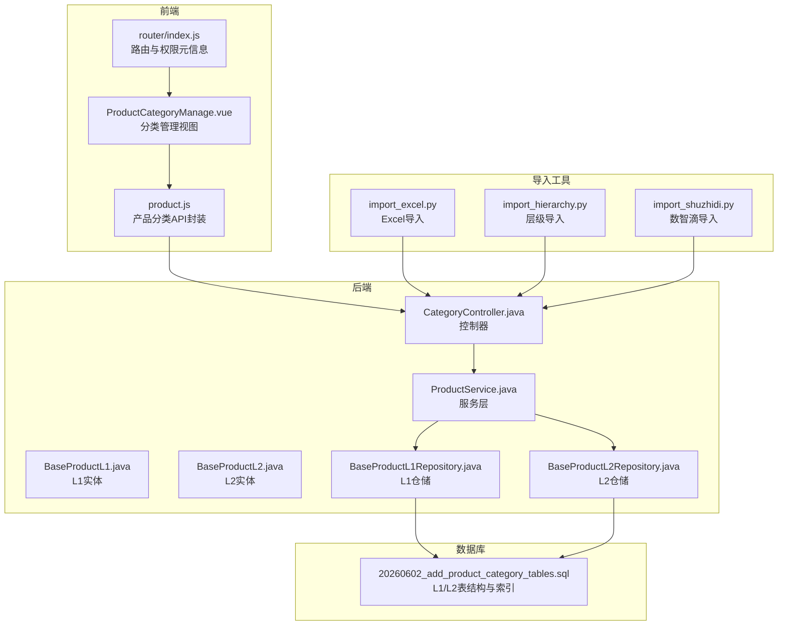
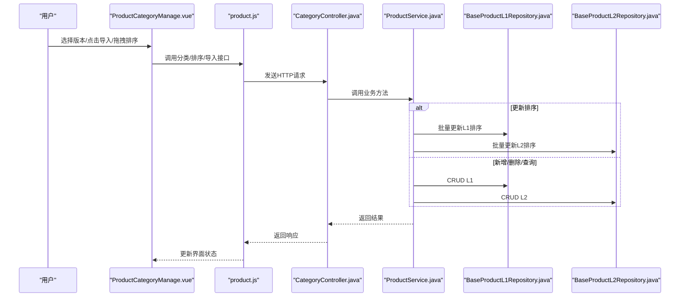
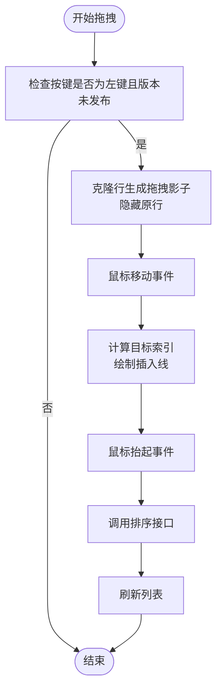
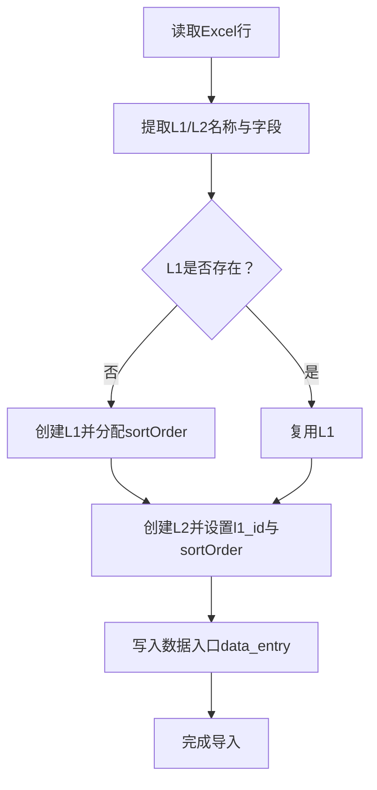
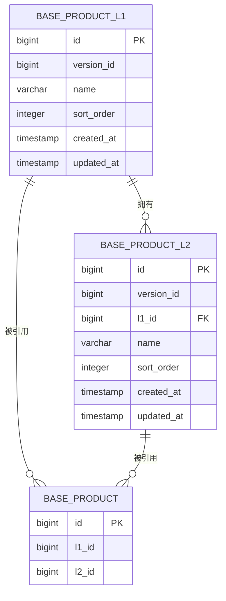
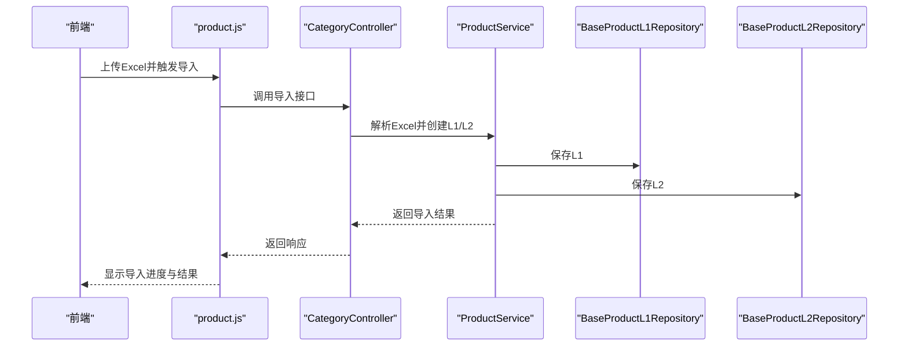
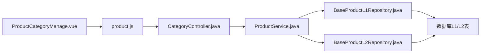

# 产品分类管理

<cite>
**本文引用的文件**
- [ProductCategoryManage.vue](file://frontend/src/views/system/ProductCategoryManage.vue)
- [product.js](file://frontend/src/api/product.js)
- [router/index.js](file://frontend/src/router/index.js)
- [ProductService.java](file://src/main/java/com/superpower/modules/category/service/ProductService.java)
- [CategoryController.java](file://src/main/java/com/superpower/modules/category/controller/CategoryController.java)
- [BaseProductL1.java](file://src/main/java/com/superpower/modules/category/entity/BaseProductL1.java)
- [BaseProductL2.java](file://src/main/java/com/superpower/modules/category/entity/BaseProductL2.java)
- [BaseProductL1Repository.java](file://src/main/java/com/superpower/modules/category/repository/BaseProductL1Repository.java)
- [BaseProductL2Repository.java](file://src/main/java/com/superpower/modules/category/repository/BaseProductL2Repository.java)
- [20260602_add_product_category_tables.sql](file://db_changes/20260602_add_product_category_tables.sql)
- [import_excel.py](file://import_excel.py)
- [import_hierarchy.py](file://import_hierarchy.py)
- [import_shuzhidi.py](file://import_shuzhidi.py)
</cite>

## 目录
1. [简介](#简介)
2. [项目结构](#项目结构)
3. [核心组件](#核心组件)
4. [架构总览](#架构总览)
5. [详细组件分析](#详细组件分析)
6. [依赖分析](#依赖分析)
7. [性能考虑](#性能考虑)
8. [故障排查指南](#故障排查指南)
9. [结论](#结论)
10. [附录](#附录)

## 简介
本技术文档围绕“产品分类管理”页面展开，聚焦两级产品分类（L1 统计分类、L2 核心业务产品）的维护与管理，覆盖以下主题：
- 拖拽排序的实现原理（鼠标事件、拖拽图标交互、排序算法）
- Excel 导入的数据处理流程（文件校验、数据解析、批量写入）
- 版本控制对分类管理的影响
- 权限控制机制
- L1 与 L2 的父子关系管理
- 完整的 API 接口说明、数据模型定义与错误处理策略

## 项目结构
前端采用 Vue3 + Element Plus 构建，后端基于 Spring Boot，数据库变更脚本位于 db_changes 目录，导入工具位于仓库根目录。

**图表来源**
- [ProductCategoryManage.vue:1-226](file://frontend/src/views/system/ProductCategoryManage.vue#L1-L226)
- [product.js:1-48](file://frontend/src/api/product.js#L1-L48)
- [router/index.js:46-81](file://frontend/src/router/index.js#L46-L81)
- [CategoryController.java](file://src/main/java/com/superpower/modules/category/controller/CategoryController.java)
- [ProductService.java:140-323](file://src/main/java/com/superpower/modules/category/service/ProductService.java#L140-L323)
- [BaseProductL1.java](file://src/main/java/com/superpower/modules/category/entity/BaseProductL1.java)
- [BaseProductL2.java](file://src/main/java/com/superpower/modules/category/entity/BaseProductL2.java)
- [BaseProductL1Repository.java](file://src/main/java/com/superpower/modules/category/repository/BaseProductL1Repository.java)
- [BaseProductL2Repository.java](file://src/main/java/com/superpower/modules/category/repository/BaseProductL2Repository.java)
- [20260602_add_product_category_tables.sql:1-37](file://db_changes/20260602_add_product_category_tables.sql#L1-L37)
- [import_excel.py:142-177](file://import_excel.py#L142-L177)
- [import_hierarchy.py:42-84](file://import_hierarchy.py#L42-L84)
- [import_shuzhidi.py:112-134](file://import_shuzhidi.py#L112-L134)

**章节来源**
- [ProductCategoryManage.vue:1-226](file://frontend/src/views/system/ProductCategoryManage.vue#L1-L226)
- [product.js:1-48](file://frontend/src/api/product.js#L1-L48)
- [router/index.js:46-81](file://frontend/src/router/index.js#L46-L81)
- [20260602_add_product_category_tables.sql:1-37](file://db_changes/20260602_add_product_category_tables.sql#L1-L37)

## 核心组件
- 前端视图组件：负责展示 L1/L2 分类树、表格、Excel 导入按钮、拖拽排序交互与版本状态控制。
- 前端 API 封装：提供 L1/L2 列表查询、新增、更新、删除、排序等接口调用方法。
- 后端控制器：接收前端请求，委派给服务层处理业务逻辑。
- 服务层：实现 L1/L2 的增删改查、排序更新、Excel 导入解析与持久化。
- 实体与仓储：映射 L1/L2 表结构，提供按版本与排序查询能力。
- 数据库脚本：定义 L1/L2 表结构、索引及产品表关联字段。
- 导入工具：提供 Excel 与层级导入脚本，支持批量写入数据入口。

**章节来源**
- [ProductCategoryManage.vue:1-226](file://frontend/src/views/system/ProductCategoryManage.vue#L1-L226)
- [product.js:1-48](file://frontend/src/api/product.js#L1-L48)
- [CategoryController.java](file://src/main/java/com/superpower/modules/category/controller/CategoryController.java)
- [ProductService.java:140-323](file://src/main/java/com/superpower/modules/category/service/ProductService.java#L140-L323)
- [BaseProductL1.java](file://src/main/java/com/superpower/modules/category/entity/BaseProductL1.java)
- [BaseProductL2.java](file://src/main/java/com/superpower/modules/category/entity/BaseProductL2.java)
- [BaseProductL1Repository.java](file://src/main/java/com/superpower/modules/category/repository/BaseProductL1Repository.java)
- [BaseProductL2Repository.java](file://src/main/java/com/superpower/modules/category/repository/BaseProductL2Repository.java)
- [20260602_add_product_category_tables.sql:1-37](file://db_changes/20260602_add_product_category_tables.sql#L1-L37)
- [import_excel.py:142-177](file://import_excel.py#L142-L177)
- [import_hierarchy.py:42-84](file://import_hierarchy.py#L42-L84)
- [import_shuzhidi.py:112-134](file://import_shuzhidi.py#L112-L134)

## 架构总览
前后端通过 REST 接口通信，前端负责用户交互与展示，后端负责业务规则与数据持久化。版本控制贯穿分类管理，所有分类均绑定到当前版本；当版本发布后，禁止编辑与排序操作。Excel 导入通过后端统一入口进行解析与落库。

**图表来源**
- [ProductCategoryManage.vue:1-226](file://frontend/src/views/system/ProductCategoryManage.vue#L1-L226)
- [product.js:1-48](file://frontend/src/api/product.js#L1-L48)
- [CategoryController.java](file://src/main/java/com/superpower/modules/category/controller/CategoryController.java)
- [ProductService.java:140-323](file://src/main/java/com/superpower/modules/category/service/ProductService.java#L140-L323)
- [BaseProductL1Repository.java](file://src/main/java/com/superpower/modules/category/repository/BaseProductL1Repository.java)
- [BaseProductL2Repository.java](file://src/main/java/com/superpower/modules/category/repository/BaseProductL2Repository.java)

## 详细组件分析

### 前端：ProductCategoryManage.vue
- 功能要点
  - Excel 导入：禁用已发布版本；选择文件后触发导入流程。
  - L1/L2 展示：根据选中的 L1 加载其对应的 L2 子节点。
  - 拖拽排序：仅允许左键拖拽；拖拽时生成半透明占位元素并绘制插入线；移动过程中计算目标索引；松开后调用排序接口并刷新列表。
  - 版本状态：根据版本状态禁用编辑与排序；加载草稿或最新版本。
- 关键交互
  - 鼠标按下：阻止默认行为，克隆当前行作为拖拽影子，隐藏原行，计算偏移量。
  - 鼠标移动：实时更新影子 top 坐标；遍历所有行计算目标索引；高亮插入线。
  - 鼠标抬起：移除影子与事件监听，调用排序接口，刷新 L1 或 L1+L2 列表。
- 错误处理
  - 导入按钮在版本已发布时禁用。
  - 拖拽排序在版本已发布时直接返回。
  - 异常提示通过消息组件反馈。

**图表来源**
- [ProductCategoryManage.vue:193-226](file://frontend/src/views/system/ProductCategoryManage.vue#L193-L226)

**章节来源**
- [ProductCategoryManage.vue:1-226](file://frontend/src/views/system/ProductCategoryManage.vue#L1-L226)

### 前端：product.js（API 封装）
- L1 接口
  - 获取列表：GET /product/l1/list?versionId
  - 新增：POST /product/l1（参数：name，查询参数：versionId）
  - 更新：PUT /product/l1/{id}（参数：name）
  - 删除：DELETE /product/l1/{id}
  - 排序：PUT /product/l1/sort（请求体：sortList，查询参数：versionId）
- L2 接口
  - 获取列表：GET /product/l2/list?versionId&l1Id
  - 新增：POST /product/l2（参数：name，查询参数：versionId&l1Id）
  - 更新：PUT /product/l2/{id}（参数：name）
  - 删除：DELETE /product/l2/{id}
  - 排序：PUT /product/l2/sort（请求体：sortList，查询参数：versionId）

**章节来源**
- [product.js:1-48](file://frontend/src/api/product.js#L1-L48)

### 后端：CategoryController.java
- 控制器职责
  - 对接前端 product.js 的 REST 接口，转发到服务层。
  - 提供 L1/L2 的增删改查与排序接口。
- 认证与权限
  - 路由配置中包含角色元信息，用于前端菜单与页面访问控制。

**章节来源**
- [CategoryController.java](file://src/main/java/com/superpower/modules/category/controller/CategoryController.java)
- [router/index.js:46-81](file://frontend/src/router/index.js#L46-L81)

### 后端：ProductService.java（排序与导入）
- 排序更新
  - 批量更新 L1 排序：遍历 sortList，设置 sortOrder 并保存。
  - 批量更新 L2 排序：同上。
- Excel 导入（核心流程）
  - 解析 Excel 行，提取 L1/L2 名称与字段映射。
  - 若 L1 不存在则创建，并分配排序序号。
  - 若 L2 不存在则创建，设置父 L1 的外键与排序序号。
  - 写入数据入口（data_entry），支持后续版本化与树形结构构建。

**图表来源**
- [ProductService.java:287-323](file://src/main/java/com/superpower/modules/category/service/ProductService.java#L287-L323)
- [import_excel.py:142-177](file://import_excel.py#L142-L177)

**章节来源**
- [ProductService.java:140-323](file://src/main/java/com/superpower/modules/category/service/ProductService.java#L140-L323)
- [import_excel.py:142-177](file://import_excel.py#L142-L177)

### 数据模型与数据库
- L1 实体：包含版本标识、名称、排序序号等字段。
- L2 实体：包含版本标识、L1 外键、名称、排序序号等字段。
- 表结构与索引
  - base_product_l1：主键、版本索引、排序联合索引。
  - base_product_l2：主键、版本索引、L1 外键索引、排序联合索引。
  - 产品表扩展：新增 l1_id 与 l2_id 字段，建立与两级分类的关联。

**图表来源**
- [20260602_add_product_category_tables.sql:1-37](file://db_changes/20260602_add_product_category_tables.sql#L1-L37)
- [BaseProductL1.java](file://src/main/java/com/superpower/modules/category/entity/BaseProductL1.java)
- [BaseProductL2.java](file://src/main/java/com/superpower/modules/category/entity/BaseProductL2.java)

**章节来源**
- [20260602_add_product_category_tables.sql:1-37](file://db_changes/20260602_add_product_category_tables.sql#L1-L37)
- [BaseProductL1.java](file://src/main/java/com/superpower/modules/category/entity/BaseProductL1.java)
- [BaseProductL2.java](file://src/main/java/com/superpower/modules/category/entity/BaseProductL2.java)

### Excel 导入流程详解
- 文件验证
  - 前端限制文件类型为 .xlsx/.xls。
  - 后端统一通过数据入口接口进行解析与入库。
- 数据解析
  - 读取每行数据，提取 L1/L2 名称与字段映射。
  - 生成唯一键（如 L1 名称）以避免重复创建。
- 批量写入
  - 先写入 L1，再写入 L2，并设置父级关系与排序序号。
  - 使用事务保证一致性（服务层标注事务注解）。

**图表来源**
- [ProductService.java:287-323](file://src/main/java/com/superpower/modules/category/service/ProductService.java#L287-L323)
- [product.js:1-48](file://frontend/src/api/product.js#L1-L48)
- [CategoryController.java](file://src/main/java/com/superpower/modules/category/controller/CategoryController.java)

**章节来源**
- [import_excel.py:142-177](file://import_excel.py#L142-L177)
- [import_hierarchy.py:42-84](file://import_hierarchy.py#L42-L84)
- [import_shuzhidi.py:112-134](file://import_shuzhidi.py#L112-L134)

### 版本控制与权限控制
- 版本控制
  - 所有分类操作均绑定到当前版本；导入与排序接口均携带 versionId。
  - 当版本状态为已发布时，前端禁用导入与排序按钮，防止破坏历史数据。
- 权限控制
  - 路由元信息包含角色要求（如 ADMIN），用于页面访问控制。

**章节来源**
- [ProductCategoryManage.vue:1-226](file://frontend/src/views/system/ProductCategoryManage.vue#L1-L226)
- [router/index.js:46-81](file://frontend/src/router/index.js#L46-L81)

### L1 与 L2 的父子关系管理
- 外键约束：L2 表包含 L1 外键，确保父子关系一致。
- 查询优化：按版本与排序序号建立复合索引，提升查询效率。
- 业务一致性：导入时先创建 L1，再创建 L2 并设置 l1_id，保证树形结构正确性。

**章节来源**
- [20260602_add_product_category_tables.sql:1-37](file://db_changes/20260602_add_product_category_tables.sql#L1-L37)
- [ProductService.java:287-323](file://src/main/java/com/superpower/modules/category/service/ProductService.java#L287-L323)

## 依赖分析
- 前端依赖
  - ProductCategoryManage.vue 依赖 product.js 提供的 REST 接口。
  - 路由配置决定页面访问权限与菜单项。
- 后端依赖
  - CategoryController 依赖 ProductService。
  - ProductService 依赖 L1/L2 仓储层，进行数据持久化。
- 数据库依赖
  - L1/L2 表结构与索引支撑查询与排序性能。
- 导入工具依赖
  - 通过统一数据入口接口写入数据，便于版本化与一致性控制。

**图表来源**
- [ProductCategoryManage.vue:1-226](file://frontend/src/views/system/ProductCategoryManage.vue#L1-L226)
- [product.js:1-48](file://frontend/src/api/product.js#L1-L48)
- [CategoryController.java](file://src/main/java/com/superpower/modules/category/controller/CategoryController.java)
- [ProductService.java:140-323](file://src/main/java/com/superpower/modules/category/service/ProductService.java#L140-L323)
- [BaseProductL1Repository.java](file://src/main/java/com/superpower/modules/category/repository/BaseProductL1Repository.java)
- [BaseProductL2Repository.java](file://src/main/java/com/superpower/modules/category/repository/BaseProductL2Repository.java)

**章节来源**
- [ProductCategoryManage.vue:1-226](file://frontend/src/views/system/ProductCategoryManage.vue#L1-L226)
- [product.js:1-48](file://frontend/src/api/product.js#L1-L48)
- [CategoryController.java](file://src/main/java/com/superpower/modules/category/controller/CategoryController.java)
- [ProductService.java:140-323](file://src/main/java/com/superpower/modules/category/service/ProductService.java#L140-L323)
- [BaseProductL1Repository.java](file://src/main/java/com/superpower/modules/category/repository/BaseProductL1Repository.java)
- [BaseProductL2Repository.java](file://src/main/java/com/superpower/modules/category/repository/BaseProductL2Repository.java)

## 性能考虑
- 索引优化：L1/L2 表按版本与排序建立索引，减少排序与分页查询成本。
- 批量写入：导入时按 L1/L2 顺序写入，避免重复查询与并发冲突。
- 前端渲染：拖拽排序仅更新本地列表与后端排序，避免全量刷新。
- 事务边界：排序与导入在服务层使用事务，保证一致性与回滚能力。

## 故障排查指南
- 导入失败
  - 检查 Excel 字段映射是否正确，确认 L1/L2 名称唯一性。
  - 查看后端日志与响应消息，定位具体失败行。
- 排序异常
  - 确认 sortList 结构与排序序号连续且无重复。
  - 检查版本状态是否为草稿。
- 权限问题
  - 确认登录用户具备 ADMIN 角色，路由元信息中包含角色要求。
- L1/L2 关系错误
  - 核对 L2 的 l1_id 是否指向存在的 L1，检查导入顺序与唯一键。

**章节来源**
- [ProductCategoryManage.vue:1-226](file://frontend/src/views/system/ProductCategoryManage.vue#L1-L226)
- [product.js:1-48](file://frontend/src/api/product.js#L1-L48)
- [ProductService.java:140-323](file://src/main/java/com/superpower/modules/category/service/ProductService.java#L140-L323)

## 结论
本方案通过清晰的前后端分工、完善的版本控制与权限控制、稳健的 Excel 导入与排序机制，实现了两级产品分类的高效管理。数据库层面的索引与外键设计保障了查询与关系一致性，服务层的事务与批量写入提升了可靠性与性能。建议在生产环境中持续监控导入与排序的执行日志，确保版本状态与数据一致性。

## 附录
- API 接口清单（摘要）
  - L1
    - GET /product/l1/list?versionId
    - POST /product/l1（name，versionId）
    - PUT /product/l1/{id}（name）
    - DELETE /product/l1/{id}
    - PUT /product/l1/sort（sortList，versionId）
  - L2
    - GET /product/l2/list?versionId&l1Id
    - POST /product/l2（name，versionId&l1Id）
    - PUT /product/l2/{id}（name）
    - DELETE /product/l2/{id}
    - PUT /product/l2/sort（sortList，versionId）
- 数据模型字段
  - L1：id、versionId、name、sortOrder、时间戳
  - L2：id、versionId、l1Id、name、sortOrder、时间戳
  - 产品表扩展：l1Id、l2Id