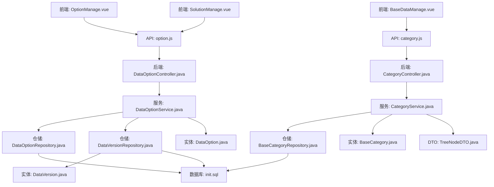
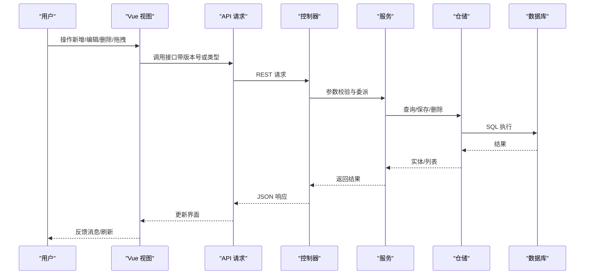
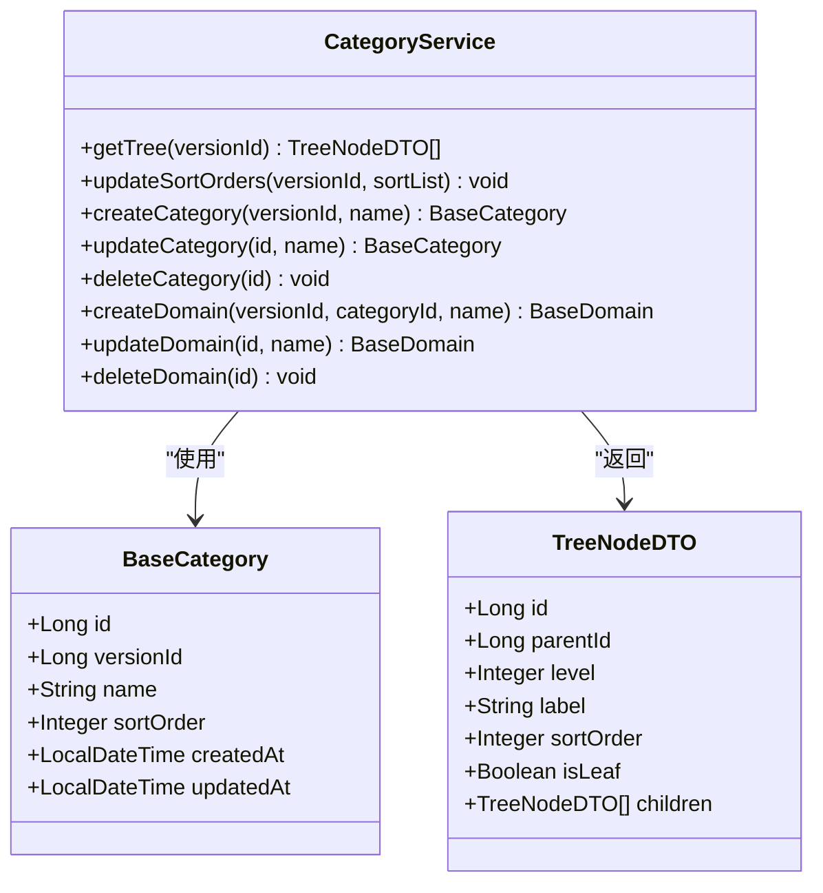
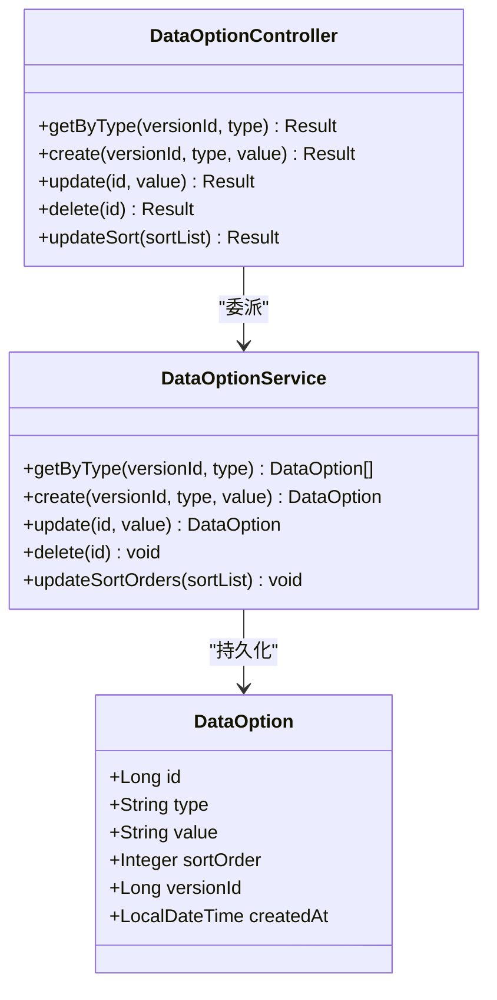
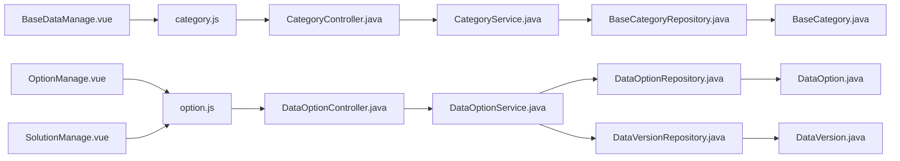

# 基础数据管理

<cite>
**本文引用的文件**
- [BaseDataManage.vue](file://frontend/src/views/system/BaseDataManage.vue)
- [OptionManage.vue](file://frontend/src/views/system/OptionManage.vue)
- [SolutionManage.vue](file://frontend/src/views/system/SolutionManage.vue)
- [category.js](file://frontend/src/api/category.js)
- [option.js](file://frontend/src/api/option.js)
- [CategoryController.java](file://src/main/java/com/superpower/modules/category/controller/CategoryController.java)
- [DataOptionController.java](file://src/main/java/com/superpower/modules/option/controller/DataOptionController.java)
- [CategoryService.java](file://src/main/java/com/superpower/modules/category/service/CategoryService.java)
- [DataOptionService.java](file://src/main/java/com/superpower/modules/option/service/DataOptionService.java)
- [BaseCategory.java](file://src/main/java/com/superpower/modules/category/entity/BaseCategory.java)
- [DataOption.java](file://src/main/java/com/superpower/modules/option/entity/DataOption.java)
- [TreeNodeDTO.java](file://src/main/java/com/superpower/modules/data/dto/TreeNodeDTO.java)
- [DataVersion.java](file://src/main/java/com/superpower/modules/version/entity/DataVersion.java)
- [init.sql](file://src/main/resources/db/init.sql)
- [BaseCategoryRepository.java](file://src/main/java/com/superpower/modules/category/repository/BaseCategoryRepository.java)
- [DataOptionRepository.java](file://src/main/java/com/superpower/modules/option/repository/DataOptionRepository.java)
- [DataVersionRepository.java](file://src/main/java/com/superpower/modules/version/repository/DataVersionRepository.java)
</cite>

## 目录
1. [简介](#简介)
2. [项目结构](#项目结构)
3. [核心组件](#核心组件)
4. [架构总览](#架构总览)
5. [详细组件分析](#详细组件分析)
6. [依赖分析](#依赖分析)
7. [性能考虑](#性能考虑)
8. [故障排查指南](#故障排查指南)
9. [结论](#结论)
10. [附录](#附录)

## 简介
本技术文档围绕“基础数据管理”页面展开，覆盖三类核心能力：基础数据维护（业务分类与业务域的层级结构）、选项管理（按类型分组的可排序选项清单）、解决方案管理（解决方案模板的增删改查）。文档从前端视图到后端控制器、服务层、实体与仓储，逐层剖析实现细节，并给出数据验证规则、批量排序与版本控制策略、以及数据同步机制的说明。

## 项目结构
前端采用 Vue 3 组合式 API，后端为 Spring Boot + JPA。页面通过统一请求工具调用 REST 接口，控制器将请求委派给服务层，服务层操作实体与仓储，最终持久化至数据库。

图表来源
- [BaseDataManage.vue:112-364](file://frontend/src/views/system/BaseDataManage.vue#L112-L364)
- [OptionManage.vue:36-176](file://frontend/src/views/system/OptionManage.vue#L36-L176)
- [SolutionManage.vue:31-81](file://frontend/src/views/system/SolutionManage.vue#L31-L81)
- [category.js:1-34](file://frontend/src/api/category.js#L1-L34)
- [option.js:1-22](file://frontend/src/api/option.js#L1-L22)
- [CategoryController.java:13-66](file://src/main/java/com/superpower/modules/category/controller/CategoryController.java#L13-L66)
- [DataOptionController.java:11-49](file://src/main/java/com/superpower/modules/option/controller/DataOptionController.java#L11-L49)
- [CategoryService.java:18-273](file://src/main/java/com/superpower/modules/category/service/CategoryService.java#L18-L273)
- [DataOptionService.java:14-93](file://src/main/java/com/superpower/modules/option/service/DataOptionService.java#L14-L93)
- [BaseCategoryRepository.java:12-21](file://src/main/java/com/superpower/modules/category/repository/BaseCategoryRepository.java#L12-L21)
- [DataOptionRepository.java:9-15](file://src/main/java/com/superpower/modules/option/repository/DataOptionRepository.java#L9-L15)
- [DataVersionRepository.java:9-20](file://src/main/java/com/superpower/modules/version/repository/DataVersionRepository.java#L9-L20)
- [BaseCategory.java:7-30](file://src/main/java/com/superpower/modules/category/entity/BaseCategory.java#L7-L30)
- [DataOption.java:7-30](file://src/main/java/com/superpower/modules/option/entity/DataOption.java#L7-L30)
- [TreeNodeDTO.java:6-16](file://src/main/java/com/superpower/modules/data/dto/TreeNodeDTO.java#L6-L16)
- [DataVersion.java:7-36](file://src/main/java/com/superpower/modules/version/entity/DataVersion.java#L7-L36)
- [init.sql:44-126](file://src/main/resources/db/init.sql#L44-L126)

章节来源
- [BaseDataManage.vue:1-400](file://frontend/src/views/system/BaseDataManage.vue#L1-L400)
- [OptionManage.vue:1-217](file://frontend/src/views/system/OptionManage.vue#L1-L217)
- [SolutionManage.vue:1-88](file://frontend/src/views/system/SolutionManage.vue#L1-L88)
- [category.js:1-34](file://frontend/src/api/category.js#L1-L34)
- [option.js:1-22](file://frontend/src/api/option.js#L1-L22)
- [CategoryController.java:13-66](file://src/main/java/com/superpower/modules/category/controller/CategoryController.java#L13-L66)
- [DataOptionController.java:11-49](file://src/main/java/com/superpower/modules/option/controller/DataOptionController.java#L11-L49)
- [CategoryService.java:18-273](file://src/main/java/com/superpower/modules/category/service/CategoryService.java#L18-L273)
- [DataOptionService.java:14-93](file://src/main/java/com/superpower/modules/option/service/DataOptionService.java#L14-L93)
- [BaseCategoryRepository.java:12-21](file://src/main/java/com/superpower/modules/category/repository/BaseCategoryRepository.java#L12-L21)
- [DataOptionRepository.java:9-15](file://src/main/java/com/superpower/modules/option/repository/DataOptionRepository.java#L9-L15)
- [DataVersionRepository.java:9-20](file://src/main/java/com/superpower/modules/version/repository/DataVersionRepository.java#L9-L20)
- [BaseCategory.java:7-30](file://src/main/java/com/superpower/modules/category/entity/BaseCategory.java#L7-L30)
- [DataOption.java:7-30](file://src/main/java/com/superpower/modules/option/entity/DataOption.java#L7-L30)
- [TreeNodeDTO.java:6-16](file://src/main/java/com/superpower/modules/data/dto/TreeNodeDTO.java#L6-L16)
- [DataVersion.java:7-36](file://src/main/java/com/superpower/modules/version/entity/DataVersion.java#L7-L36)
- [init.sql:44-126](file://src/main/resources/db/init.sql#L44-L126)

## 核心组件
- 基础数据维护（业务分类 L1 与业务域 L2）
  - 前端：双表联动展示，支持拖拽重排、新增/编辑/删除、版本状态控制。
  - 后端：树形结构查询、排序更新、分类与域的增删改。
- 选项管理（按 type 分组的可排序选项）
  - 前端：单表列表，拖拽重排、新增/编辑/删除。
  - 后端：按版本与类型查询、创建/更新/删除、排序更新。
- 解决方案管理（解决方案模板）
  - 前端：单表列表，使用“solution”类型进行增删改查。
  - 后端：与选项管理共享同一控制器与服务，按类型隔离。

章节来源
- [BaseDataManage.vue:112-364](file://frontend/src/views/system/BaseDataManage.vue#L112-L364)
- [OptionManage.vue:36-176](file://frontend/src/views/system/OptionManage.vue#L36-L176)
- [SolutionManage.vue:31-81](file://frontend/src/views/system/SolutionManage.vue#L31-L81)
- [CategoryController.java:23-64](file://src/main/java/com/superpower/modules/category/controller/CategoryController.java#L23-L64)
- [DataOptionController.java:21-47](file://src/main/java/com/superpower/modules/option/controller/DataOptionController.java#L21-L47)

## 架构总览
前后端交互遵循“视图层 → API 层 → 控制器 → 服务 → 仓储 → 数据库”的分层架构。版本控制贯穿选项与基础数据，确保只有草稿版本允许修改。

图表来源
- [BaseDataManage.vue:134-364](file://frontend/src/views/system/BaseDataManage.vue#L134-L364)
- [OptionManage.vue:57-176](file://frontend/src/views/system/OptionManage.vue#L57-L176)
- [SolutionManage.vue:42-81](file://frontend/src/views/system/SolutionManage.vue#L42-L81)
- [CategoryController.java:23-64](file://src/main/java/com/superpower/modules/category/controller/CategoryController.java#L23-L64)
- [DataOptionController.java:21-47](file://src/main/java/com/superpower/modules/option/controller/DataOptionController.java#L21-L47)
- [CategoryService.java:80-273](file://src/main/java/com/superpower/modules/category/service/CategoryService.java#L80-L273)
- [DataOptionService.java:26-93](file://src/main/java/com/superpower/modules/option/service/DataOptionService.java#L26-L93)

## 详细组件分析

### 基础数据维护（业务分类与业务域）
- 分类体系与层级结构
  - L1：业务分类（一级），对应实体与仓储。
  - L2：业务域（二级），绑定到 L1 并可进一步扩展为 L3（产品分类）。
  - 树形结构由服务层组装，包含 level、parentId、sortOrder、isLeaf 等字段。
- 数据完整性约束
  - 删除 L1 前需检查是否存在 L2；删除 L2 前需检查是否存在子级数据条目。
  - 名称变更会同步影响数据条目中的对应列（如业务分类、产品系统等）。
- 版本控制与同步
  - 新增 L1/L2 时，同时写入数据条目表，保证基础数据与数据条目一致。
  - 排序更新支持跨层级（category/domain/product），并校验实体存在性。
- 前端交互
  - 支持拖拽重排，实时更新排序并调用后端排序接口。
  - 新增/编辑/删除按钮受版本状态限制（已发版禁用）。

图表来源
- [BaseCategory.java:7-30](file://src/main/java/com/superpower/modules/category/entity/BaseCategory.java#L7-L30)
- [TreeNodeDTO.java:6-16](file://src/main/java/com/superpower/modules/data/dto/TreeNodeDTO.java#L6-L16)
- [CategoryService.java:36-231](file://src/main/java/com/superpower/modules/category/service/CategoryService.java#L36-L231)

章节来源
- [BaseDataManage.vue:134-364](file://frontend/src/views/system/BaseDataManage.vue#L134-L364)
- [CategoryController.java:23-64](file://src/main/java/com/superpower/modules/category/controller/CategoryController.java#L23-L64)
- [CategoryService.java:36-231](file://src/main/java/com/superpower/modules/category/service/CategoryService.java#L36-L231)
- [BaseCategoryRepository.java:12-21](file://src/main/java/com/superpower/modules/category/repository/BaseCategoryRepository.java#L12-L21)
- [init.sql:68-126](file://src/main/resources/db/init.sql#L68-L126)

### 选项管理（按类型分组的可排序选项）
- 配置功能
  - 按版本与类型（如 status、solution 等）加载选项列表。
  - 支持新增、编辑、删除与拖拽排序。
- 数据模型
  - 选项实体包含 type、value、sortOrder、versionId 等字段。
  - 通过仓储按 type+version 排序查询。
- 版本控制
  - 写操作前检查版本状态，仅草稿版本允许修改。
  - 排序更新同样受版本状态保护。

图表来源
- [DataOption.java:7-30](file://src/main/java/com/superpower/modules/option/entity/DataOption.java#L7-L30)
- [DataOptionService.java:26-93](file://src/main/java/com/superpower/modules/option/service/DataOptionService.java#L26-L93)
- [DataOptionController.java:21-47](file://src/main/java/com/superpower/modules/option/controller/DataOptionController.java#L21-L47)

章节来源
- [OptionManage.vue:57-176](file://frontend/src/views/system/OptionManage.vue#L57-L176)
- [DataOptionController.java:21-47](file://src/main/java/com/superpower/modules/option/controller/DataOptionController.java#L21-L47)
- [DataOptionService.java:26-93](file://src/main/java/com/superpower/modules/option/service/DataOptionService.java#L26-L93)
- [DataOptionRepository.java:9-15](file://src/main/java/com/superpower/modules/option/repository/DataOptionRepository.java#L9-L15)
- [DataVersionRepository.java:9-20](file://src/main/java/com/superpower/modules/version/repository/DataVersionRepository.java#L9-L20)

### 解决方案管理（解决方案模板）
- 功能说明
  - 使用“solution”类型进行选项维护，支持新增、编辑、删除。
  - 页面逻辑与通用选项管理一致，复用相同 API 与服务。
- 数据一致性
  - 通过版本控制保障数据安全，避免对已发版版本进行修改。

章节来源
- [SolutionManage.vue:42-81](file://frontend/src/views/system/SolutionManage.vue#L42-L81)
- [DataOptionController.java:21-47](file://src/main/java/com/superpower/modules/option/controller/DataOptionController.java#L21-L47)
- [DataOptionService.java:26-93](file://src/main/java/com/superpower/modules/option/service/DataOptionService.java#L26-L93)

## 依赖分析
- 前端依赖
  - BaseDataManage.vue 依赖 category.js 提供树形查询与排序更新。
  - OptionManage.vue 与 SolutionManage.vue 依赖 option.js 提供按版本与类型查询及 CRUD。
- 后端依赖
  - CategoryController 依赖 CategoryService；DataOptionController 依赖 DataOptionService。
  - 服务层依赖对应的仓储与版本仓储，确保版本状态校验。
- 数据库依赖
  - 基础数据与选项分别映射到 base_category 与 sys_option 表，版本信息存储于 data_version。

图表来源
- [BaseDataManage.vue:112-116](file://frontend/src/views/system/BaseDataManage.vue#L112-L116)
- [OptionManage.vue:39-40](file://frontend/src/views/system/OptionManage.vue#L39-L40)
- [SolutionManage.vue:33](file://frontend/src/views/system/SolutionManage.vue#L33)
- [CategoryController.java:19-21](file://src/main/java/com/superpower/modules/category/controller/CategoryController.java#L19-L21)
- [DataOptionController.java:17-19](file://src/main/java/com/superpower/modules/option/controller/DataOptionController.java#L17-L19)
- [CategoryService.java:26-34](file://src/main/java/com/superpower/modules/category/service/CategoryService.java#L26-L34)
- [DataOptionService.java:20-24](file://src/main/java/com/superpower/modules/option/service/DataOptionService.java#L20-L24)

章节来源
- [BaseCategoryRepository.java:12-21](file://src/main/java/com/superpower/modules/category/repository/BaseCategoryRepository.java#L12-L21)
- [DataOptionRepository.java:9-15](file://src/main/java/com/superpower/modules/option/repository/DataOptionRepository.java#L9-L15)
- [DataVersionRepository.java:9-20](file://src/main/java/com/superpower/modules/version/repository/DataVersionRepository.java#L9-L20)

## 性能考虑
- 排序更新
  - 前端拖拽触发排序更新，批量提交排序列表，减少多次往返。
  - 后端按类型区分处理，避免不必要的条件判断。
- 查询优化
  - 服务层按版本与层级排序查询，索引建议：version_id + sort_order。
- 版本控制
  - 读取版本时优先草稿，若无草稿则回退到最新版本，降低并发冲突概率。

## 故障排查指南
- 已发版版本禁止修改
  - 现象：新增/编辑/删除/排序按钮禁用或接口报错。
  - 处理：切换到草稿版本后再操作。
- 删除失败
  - 基础数据：L1 下仍有 L2 或 L2 下仍有子级数据条目时无法删除。
  - 选项：被业务引用或版本状态不正确。
- 名称变更未同步
  - 确认服务层是否正确更新数据条目中的对应列（如业务分类、产品系统）。
- 排序异常
  - 检查前端排序列表是否包含正确的 type 与 id；后端是否抛出“不存在”异常。

章节来源
- [DataOptionService.java:59-65](file://src/main/java/com/superpower/modules/option/service/DataOptionService.java#L59-L65)
- [CategoryService.java:154-164](file://src/main/java/com/superpower/modules/category/service/CategoryService.java#L154-L164)
- [CategoryService.java:220-231](file://src/main/java/com/superpower/modules/category/service/CategoryService.java#L220-L231)

## 结论
基础数据管理页面以“版本控制 + 分层架构 + 明确的数据约束”为核心设计原则，实现了业务分类与业务域的层级维护、选项的类型化配置与解决方案模板的统一管理。通过拖拽排序与批量更新，提升了操作效率；通过版本状态校验与实体存在性检查，保障了数据一致性与安全性。

## 附录

### 数据验证规则
- 必填校验
  - 新增/编辑时名称/值不能为空。
- 版本状态
  - 仅草稿版本允许写操作；已发版版本禁止修改。
- 实体存在性
  - 排序更新与删除前需校验实体是否存在。

章节来源
- [OptionManage.vue:82-97](file://frontend/src/views/system/OptionManage.vue#L82-L97)
- [SolutionManage.vue:60-78](file://frontend/src/views/system/SolutionManage.vue#L60-L78)
- [DataOptionService.java:43-57](file://src/main/java/com/superpower/modules/option/service/DataOptionService.java#L43-L57)

### 批量操作与数据同步机制
- 批量排序
  - 前端收集当前列表顺序，生成排序列表一次性提交；后端按类型更新对应实体的排序字段。
- 数据同步
  - 新增/更新 L1/L2 时同步写入数据条目表，保持基础数据与条目字段一致。
- 版本复制
  - 支持从源版本复制基础数据与选项到目标版本，保留排序与映射关系。

章节来源
- [BaseDataManage.vue:238-250](file://frontend/src/views/system/BaseDataManage.vue#L238-L250)
- [OptionManage.vue:99-106](file://frontend/src/views/system/OptionManage.vue#L99-L106)
- [CategoryService.java:116-152](file://src/main/java/com/superpower/modules/category/service/CategoryService.java#L116-L152)
- [CategoryService.java:243-271](file://src/main/java/com/superpower/modules/category/service/CategoryService.java#L243-L271)
- [DataOptionService.java:80-91](file://src/main/java/com/superpower/modules/option/service/DataOptionService.java#L80-L91)