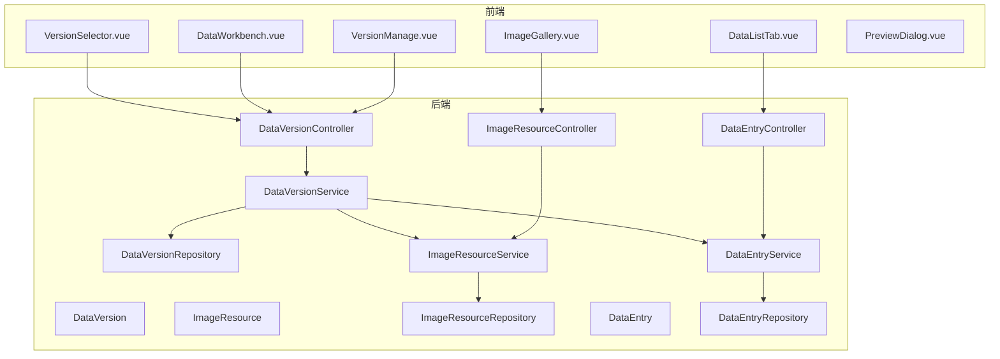
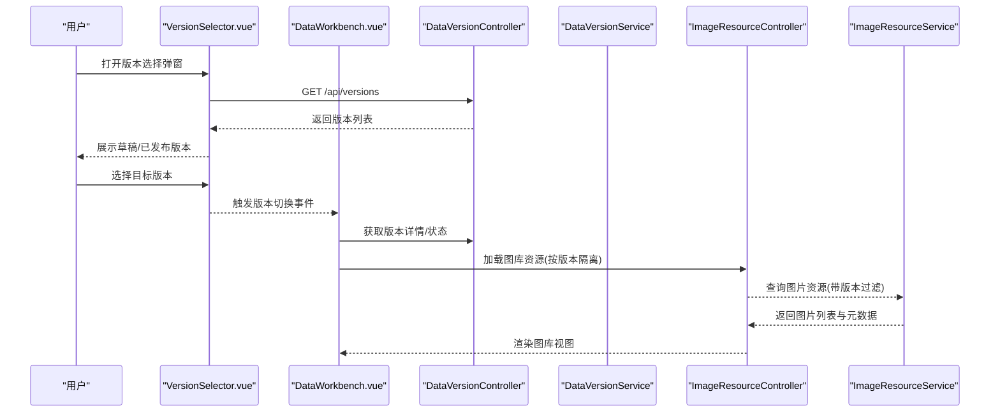
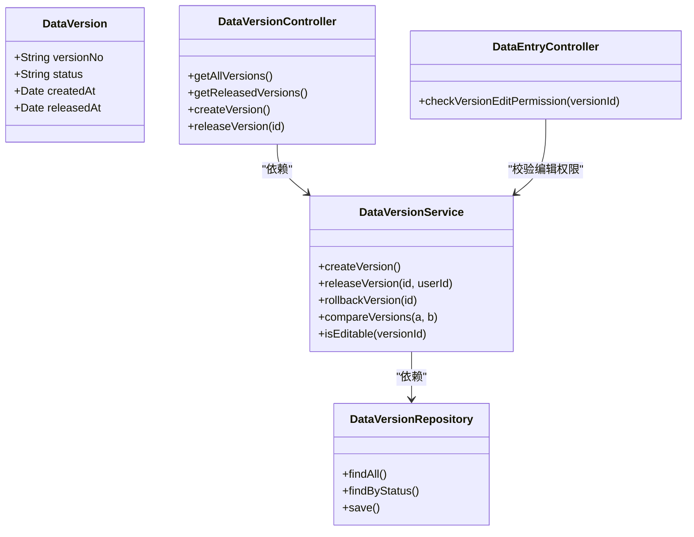
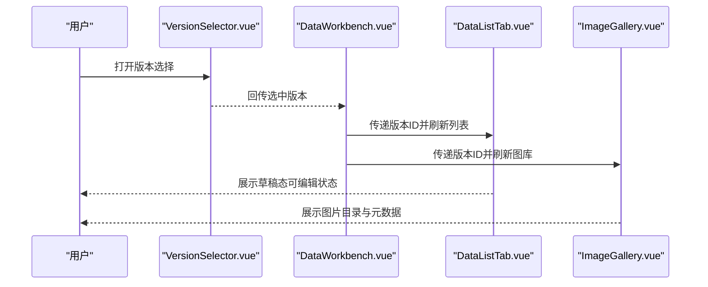
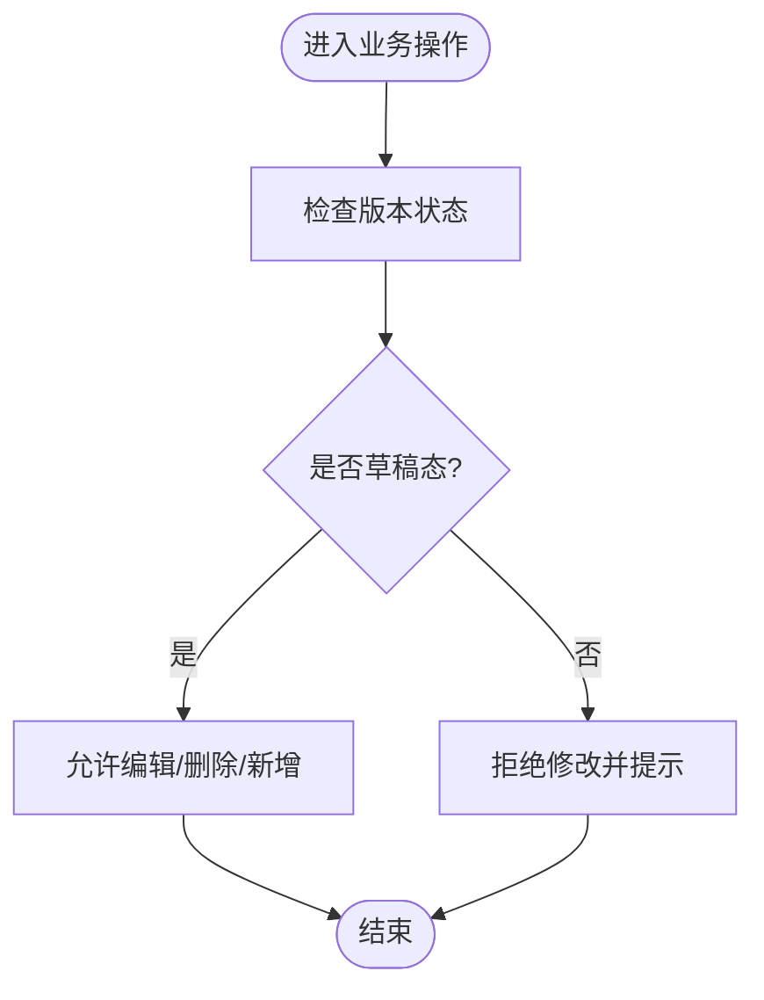
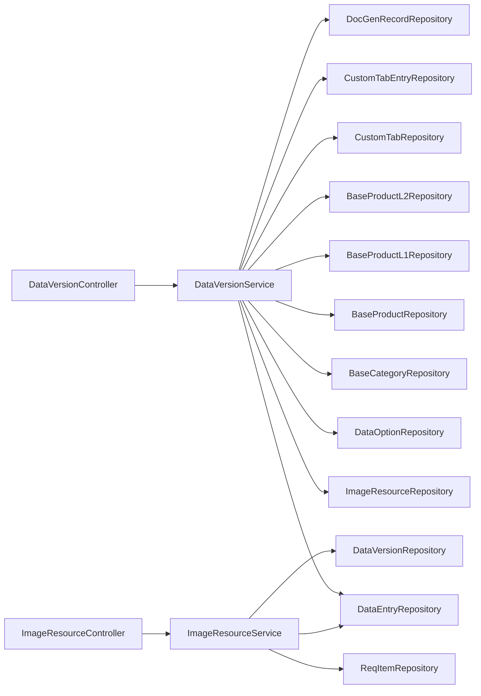

# 版本与图库管理

<cite>
**本文引用的文件**
- [DataVersionController.java](file://src/main/java/com/superpower/modules/version/controller/DataVersionController.java)
- [DataVersionService.java](file://src/main/java/com/superpower/modules/version/service/DataVersionService.java)
- [DataVersion.java](file://src/main/java/com/superpower/modules/version/entity/DataVersion.java)
- [DataVersionRepository.java](file://src/main/java/com/superpower/modules/version/repository/DataVersionRepository.java)
- [ImageResourceController.java](file://src/main/java/com/superpower/modules/image/controller/ImageResourceController.java)
- [ImageResourceService.java](file://src/main/java/com/superpower/modules/image/service/ImageResourceService.java)
- [ImageResource.java](file://src/main/java/com/superpower/modules/image/entity/ImageResource.java)
- [ImageResourceRepository.java](file://src/main/java/com/superpower/modules/image/repository/ImageResourceRepository.java)
- [DataEntryController.java](file://src/main/java/com/superpower/modules/data/controller/DataEntryController.java)
- [DataEntryService.java](file://src/main/java/com/superpower/modules/data/service/DataEntryService.java)
- [DataEntry.java](file://src/main/java/com/superpower/modules/data/entity/DataEntry.java)
- [DataEntryRepository.java](file://src/main/java/com/superpower/modules/data/repository/DataEntryRepository.java)
- [VersionManage.vue](file://frontend/src/views/system/VersionManage.vue)
- [ImageGallery.vue](file://frontend/src/views/system/ImageGallery.vue)
- [VersionSelector.vue](file://frontend/src/components/VersionSelector.vue)
- [DataWorkbench.vue](file://frontend/src/views/dashboard/DataWorkbench.vue)
- [DataListTab.vue](file://frontend/src/components/DataListTab.vue)
- [PreviewDialog.vue](file://frontend/src/components/PreviewDialog.vue)
- [RequirementManage.vue](file://frontend/src/views/requirement/RequirementManage.vue)
- [operationLogService.java](file://src/main/java/com/superpower/modules/system/service/OperationLogService.java)
- [SysUserService.java](file://src/main/java/com/superpower/modules/system/service/SysUserService.java)
- [SysUserRepository.java](file://src/main/java/com/superpower/modules/system/repository/SysUserRepository.java)
- [DataOptionService.java](file://src/main/java/com/superpower/modules/option/service/DataOptionService.java)
- [BaseCategoryRepository.java](file://src/main/java/com/superpower/modules/category/repository/BaseCategoryRepository.java)
- [BaseProductRepository.java](file://src/main/java/com/superpower/modules/category/repository/BaseProductRepository.java)
- [BaseProductL1Repository.java](file://src/main/java/com/superpower/modules/category/repository/BaseProductL1Repository.java)
- [BaseProductL2Repository.java](file://src/main/java/com/superpower/modules/category/repository/BaseProductL2Repository.java)
- [CustomTabRepository.java](file://src/main/java/com/superpower/modules/customtab/repository/CustomTabRepository.java)
- [CustomTabEntryRepository.java](file://src/main/java/com/superpower/modules/customtab/repository/CustomTabEntryRepository.java)
- [DocGenRecordRepository.java](file://src/main/java/com/superpower/modules/document/repository/DocGenRecordRepository.java)
- [ReqItemRepository.java](file://src/main/java/com/superpower/modules/requirement/repository/ReqItemRepository.java)
- [PlatformTransactionManager.java](file://src/main/java/com/superpower/common/PlatformTransactionManager.java)
</cite>

## 目录
1. [引言](#引言)
2. [项目结构](#项目结构)
3. [核心组件](#核心组件)
4. [架构总览](#架构总览)
5. [详细组件分析](#详细组件分析)
6. [依赖关系分析](#依赖关系分析)
7. [性能考虑](#性能考虑)
8. [故障排查指南](#故障排查指南)
9. [结论](#结论)
10. [附录](#附录)

## 引言
本技术文档聚焦“版本与图库管理”页面的功能实现，围绕数据版本管理（版本创建、发布、回滚、版本比较）与图片资源管理（上传、分类、批量操作、元数据管理、预览与一致性保障）进行系统性梳理。文档从前后端架构、核心实体与服务、API 调用流程、状态控制与权限约束、到性能与一致性保障策略进行全面阐述，并提供可视化图示帮助读者快速理解。

## 项目结构
- 后端采用 Spring Boot 分层架构：controller -> service -> repository -> entity，版本与图库相关能力分别位于 version 与 image 模块。
- 前端使用 Vue3 + Element Plus，版本选择器、工作台、列表与图库视图通过组件化组织，配合 API 层完成交互。
- 数据一致性通过事务管理器与服务内自调用实现，确保跨表更新原子性。

图表来源
- [DataVersionController.java:1-120](file://src/main/java/com/superpower/modules/version/controller/DataVersionController.java#L1-L120)
- [DataVersionService.java:1-120](file://src/main/java/com/superpower/modules/version/service/DataVersionService.java#L1-L120)
- [DataVersion.java:1-200](file://src/main/java/com/superpower/modules/version/entity/DataVersion.java#L1-L200)
- [DataVersionRepository.java:1-200](file://src/main/java/com/superpower/modules/version/repository/DataVersionRepository.java#L1-L200)
- [ImageResourceController.java:1-120](file://src/main/java/com/superpower/modules/image/controller/ImageResourceController.java#L1-L120)
- [ImageResourceService.java:1-120](file://src/main/java/com/superpower/modules/image/service/ImageResourceService.java#L1-L120)
- [ImageResource.java:1-200](file://src/main/java/com/superpower/modules/image/entity/ImageResource.java#L1-L200)
- [ImageResourceRepository.java:1-200](file://src/main/java/com/superpower/modules/image/repository/ImageResourceRepository.java#L1-L200)
- [DataEntryController.java:1-120](file://src/main/java/com/superpower/modules/data/controller/DataEntryController.java#L1-L120)
- [DataEntryService.java:1-120](file://src/main/java/com/superpower/modules/data/service/DataEntryService.java#L1-L120)
- [DataEntry.java:1-200](file://src/main/java/com/superpower/modules/data/entity/DataEntry.java#L1-L200)
- [DataEntryRepository.java:1-200](file://src/main/java/com/superpower/modules/data/repository/DataEntryRepository.java#L1-L200)

章节来源
- [DataVersionController.java:1-120](file://src/main/java/com/superpower/modules/version/controller/DataVersionController.java#L1-L120)
- [ImageResourceController.java:1-120](file://src/main/java/com/superpower/modules/image/controller/ImageResourceController.java#L1-L120)
- [DataEntryController.java:1-120](file://src/main/java/com/superpower/modules/data/controller/DataEntryController.java#L1-L120)

## 核心组件
- 版本控制器与服务：提供版本全生命周期管理接口，封装发布、回滚与比较逻辑。
- 图片资源控制器与服务：提供图片上传、分类、目录树、批量操作与元数据管理。
- 数据条目控制器与服务：承载版本状态对业务功能的访问控制，确保仅在草稿态可编辑。
- 前端版本选择器与工作台：统一入口选择当前版本，驱动后续列表与图库操作。
- 预览与文档生成：支持 Word 下载与图片预览，提升版本评审效率。

章节来源
- [DataVersionController.java:1-120](file://src/main/java/com/superpower/modules/version/controller/DataVersionController.java#L1-L120)
- [DataVersionService.java:1-120](file://src/main/java/com/superpower/modules/version/service/DataVersionService.java#L1-L120)
- [ImageResourceController.java:1-120](file://src/main/java/com/superpower/modules/image/controller/ImageResourceController.java#L1-L120)
- [ImageResourceService.java:1-120](file://src/main/java/com/superpower/modules/image/service/ImageResourceService.java#L1-L120)
- [DataEntryController.java:1-120](file://src/main/java/com/superpower/modules/data/controller/DataEntryController.java#L1-L120)
- [VersionSelector.vue:1-55](file://frontend/src/components/VersionSelector.vue#L1-L55)
- [DataWorkbench.vue:1-120](file://frontend/src/views/dashboard/DataWorkbench.vue#L1-L120)
- [PreviewDialog.vue:1-60](file://frontend/src/components/PreviewDialog.vue#L1-L60)

## 架构总览
版本与图库管理由“前端视图 + 控制器 + 服务 + 仓储 + 实体”构成，版本状态贯穿业务访问控制；图片资源与版本解耦但通过服务层进行关联与一致性保障。

图表来源
- [VersionSelector.vue:1-55](file://frontend/src/components/VersionSelector.vue#L1-L55)
- [DataWorkbench.vue:1-120](file://frontend/src/views/dashboard/DataWorkbench.vue#L1-L120)
- [DataVersionController.java:1-120](file://src/main/java/com/superpower/modules/version/controller/DataVersionController.java#L1-L120)
- [DataVersionService.java:1-120](file://src/main/java/com/superpower/modules/version/service/DataVersionService.java#L1-L120)
- [ImageResourceController.java:1-120](file://src/main/java/com/superpower/modules/image/controller/ImageResourceController.java#L1-L120)
- [ImageResourceService.java:1-120](file://src/main/java/com/superpower/modules/image/service/ImageResourceService.java#L1-L120)

## 详细组件分析

### 版本管理模块
- 版本实体与仓储：定义版本编号、状态、发布时间等字段，仓储负责持久化与查询。
- 版本控制器：提供查询全部、查询已发布、创建、发布等接口。
- 版本服务：封装版本业务规则，如草稿态可编辑、已发布不可修改；发布时写入发布人与时间；回滚与比较通过服务内部方法实现。
- 访问控制：数据条目控制器在修改前校验版本是否可编辑，未通过则抛出异常阻止变更。

图表来源
- [DataVersion.java:1-200](file://src/main/java/com/superpower/modules/version/entity/DataVersion.java#L1-L200)
- [DataVersionRepository.java:1-200](file://src/main/java/com/superpower/modules/version/repository/DataVersionRepository.java#L1-L200)
- [DataVersionService.java:1-120](file://src/main/java/com/superpower/modules/version/service/DataVersionService.java#L1-L120)
- [DataVersionController.java:1-120](file://src/main/java/com/superpower/modules/version/controller/DataVersionController.java#L1-L120)
- [DataEntryController.java:1-120](file://src/main/java/com/superpower/modules/data/controller/DataEntryController.java#L1-L120)

章节来源
- [DataVersionController.java:1-120](file://src/main/java/com/superpower/modules/version/controller/DataVersionController.java#L1-L120)
- [DataVersionService.java:1-120](file://src/main/java/com/superpower/modules/version/service/DataVersionService.java#L1-L120)
- [DataEntryController.java:1-120](file://src/main/java/com/superpower/modules/data/controller/DataEntryController.java#L1-L120)

### 图片资源管理模块
- 图片实体与仓储：包含文件名、路径、分类、域、尺寸等元数据，仓储负责目录树与批量操作。
- 图片控制器：提供目录树、分页查询、批量删除、重命名、迁移等接口。
- 图片服务：跨表同步（与数据条目、需求项、版本等），事务保障一致性；支持目录深度修复、文件名同步等迁移任务。
- 元数据管理：图片分类、域、尺寸、归属产品等信息用于检索与展示。
- 预览与下载：前端提供图片预览对话框与 Word 文档生成预览下载。

```mermaid
classDiagram
class ImageResource {
+String filename
+String category
+String domain
+Integer width
+Integer height
+Long productId
}
class ImageResourceRepository {
+findDirectoryTree()
+batchDelete()
+rename()
+migrateFiles()
}
class ImageResourceService {
+listByPage()
+batchDelete()
+rename()
+syncFilenameAcrossRefs()
+migrateDirectoryDepth()
}
class ImageResourceController {
+getDirectoryTree()
+batchDelete()
+rename()
+migrate()
}
ImageResourceController --> ImageResourceService : "依赖"
ImageResourceService --> ImageResourceRepository : "依赖"
```

图表来源
- [ImageResource.java:1-200](file://src/main/java/com/superpower/modules/image/entity/ImageResource.java#L1-L200)
- [ImageResourceRepository.java:1-200](file://src/main/java/com/superpower/modules/image/repository/ImageResourceRepository.java#L1-L200)
- [ImageResourceService.java:1-120](file://src/main/java/com/superpower/modules/image/service/ImageResourceService.java#L1-L120)
- [ImageResourceController.java:1-120](file://src/main/java/com/superpower/modules/image/controller/ImageResourceController.java#L1-L120)

章节来源
- [ImageResourceController.java:1-120](file://src/main/java/com/superpower/modules/image/controller/ImageResourceController.java#L1-L120)
- [ImageResourceService.java:1-120](file://src/main/java/com/superpower/modules/image/service/ImageResourceService.java#L1-L120)

### 前端视图与交互
- 版本选择器：弹窗展示版本列表，草稿/已发布标签区分，支持确认选择。
- 工作台：顶部显示当前版本信息，左侧树面板，右侧列表与自定义清单，草稿态启用编辑。
- 列表与图库：列表支持版本筛选、状态筛选、产品经理/解决方案筛选、版本划分勾选；图库支持目录树浏览与批量操作。
- 预览：支持功能说明与招标参数两种模式，Word 下载与图片预览。

图表来源
- [VersionSelector.vue:1-55](file://frontend/src/components/VersionSelector.vue#L1-L55)
- [DataWorkbench.vue:1-120](file://frontend/src/views/dashboard/DataWorkbench.vue#L1-L120)
- [DataListTab.vue:322-500](file://frontend/src/components/DataListTab.vue#L322-L500)
- [ImageGallery.vue:1-200](file://frontend/src/views/system/ImageGallery.vue#L1-L200)

章节来源
- [VersionSelector.vue:1-55](file://frontend/src/components/VersionSelector.vue#L1-L55)
- [DataWorkbench.vue:1-120](file://frontend/src/views/dashboard/DataWorkbench.vue#L1-L120)
- [DataListTab.vue:322-500](file://frontend/src/components/DataListTab.vue#L322-L500)

### 版本状态对功能访问的控制机制
- 草稿态（draft）允许编辑、新增、删除、版本划分等操作；已发布（released）禁止修改。
- 数据条目控制器在执行变更前调用版本服务检查可编辑性，未通过则拒绝请求。
- 前端根据版本状态动态禁用编辑按钮与输入控件，避免无效提交。

图表来源
- [DataEntryController.java:1-120](file://src/main/java/com/superpower/modules/data/controller/DataEntryController.java#L1-L120)
- [DataVersionService.java:1-120](file://src/main/java/com/superpower/modules/version/service/DataVersionService.java#L1-L120)

章节来源
- [DataEntryController.java:1-120](file://src/main/java/com/superpower/modules/data/controller/DataEntryController.java#L1-L120)

### 图片资源的元数据管理与批量操作
- 元数据：文件名、分类、域、尺寸、归属产品等，用于检索与展示。
- 批量操作：批量删除、批量重命名、批量迁移目录，服务层保证跨表引用同步。
- 目录树：按分类/域组织，支持层级浏览与筛选。

章节来源
- [ImageResource.java:1-200](file://src/main/java/com/superpower/modules/image/entity/ImageResource.java#L1-L200)
- [ImageResourceService.java:1-120](file://src/main/java/com/superpower/modules/image/service/ImageResourceService.java#L1-L120)

### 版本切换时的数据一致性保证
- 事务管理：版本服务构造复杂事务，确保跨表更新原子性（版本、条目、选项、分类、产品、自定义清单、文档生成记录等）。
- 自调用与循环代理：服务内部自调用以触发事务切面，避免同类方法直接调用导致事务失效。
- 平台事务管理器：统一事务传播与回滚策略。

章节来源
- [DataVersionService.java:1-120](file://src/main/java/com/superpower/modules/version/service/DataVersionService.java#L1-L120)
- [PlatformTransactionManager.java:1-200](file://src/main/java/com/superpower/common/PlatformTransactionManager.java#L1-L200)

### 版本历史追踪与版本比较
- 历史追踪：版本实体包含创建与发布时间，结合操作日志服务记录关键动作。
- 版本比较：服务层提供比较方法，对比两个版本的差异（条目、选项、分类、产品等维度）。

章节来源
- [DataVersion.java:1-200](file://src/main/java/com/superpower/modules/version/entity/DataVersion.java#L1-L200)
- [DataVersionService.java:1-120](file://src/main/java/com/superpower/modules/version/service/DataVersionService.java#L1-L120)
- [operationLogService.java:1-200](file://src/main/java/com/superpower/modules/system/service/OperationLogService.java#L1-L200)

### 图片预览与批量处理
- 图片预览：RequirementManage.vue 提供图片预览对话框，支持大图查看。
- 预览下载：PreviewDialog.vue 支持 Word 文档生成与下载。
- 批量处理：ImageResourceController 提供批量删除、重命名、迁移等接口，服务层保证一致性。

章节来源
- [RequirementManage.vue:140-164](file://frontend/src/views/requirement/RequirementManage.vue#L140-L164)
- [PreviewDialog.vue:1-60](file://frontend/src/components/PreviewDialog.vue#L1-L60)
- [ImageResourceController.java:1-120](file://src/main/java/com/superpower/modules/image/controller/ImageResourceController.java#L1-L120)

## 依赖关系分析
- 版本服务依赖多个仓储与服务：数据条目、图片资源、分类、产品、选项、自定义清单、文档生成记录等，确保版本切换时多表一致性。
- 图片服务依赖数据条目、需求项、版本仓储，保障文件名与引用同步。
- 前端组件通过 API 与后端控制器交互，版本状态驱动 UI 行为。

图表来源
- [DataVersionService.java:70-120](file://src/main/java/com/superpower/modules/version/service/DataVersionService.java#L70-L120)
- [ImageResourceService.java:60-120](file://src/main/java/com/superpower/modules/image/service/ImageResourceService.java#L60-L120)

章节来源
- [DataVersionService.java:70-120](file://src/main/java/com/superpower/modules/version/service/DataVersionService.java#L70-L120)
- [ImageResourceService.java:60-120](file://src/main/java/com/superpower/modules/image/service/ImageResourceService.java#L60-L120)

## 性能考虑
- 分页与懒加载：图片列表与数据条目均采用分页查询，减少一次性传输量。
- 目录树优化：按需加载子节点，避免深层递归带来的性能问题。
- 批量操作批量化：批量删除与重命名走单次事务，减少往返次数。
- 前端缓存：版本选择器与工作台结果在可见期间缓存，降低重复请求。

## 故障排查指南
- 版本不可编辑：若提示“已发布版本不可修改”，请切换至草稿态或创建新版本后再操作。
- 图片批量失败：检查是否存在被引用的图片，服务层会同步校验引用完整性；必要时先清理引用再执行批量操作。
- 目录迁移异常：确认目录深度修复脚本与迁移任务进度，确保文件路径与数据库一致。
- 预览空白：检查图片 URL 与存储路径配置，确认浏览器允许跨域访问静态资源。

章节来源
- [DataEntryController.java:1-120](file://src/main/java/com/superpower/modules/data/controller/DataEntryController.java#L1-L120)
- [ImageResourceService.java:1-120](file://src/main/java/com/superpower/modules/image/service/ImageResourceService.java#L1-L120)

## 结论
版本与图库管理通过清晰的前后端分工与严格的版本状态控制，实现了稳定的版本生命周期管理与图片资源治理。服务层的事务封装与跨表同步保障了数据一致性，前端的交互设计提升了版本评审与图片管理效率。建议在生产环境中持续完善版本比较与历史追踪能力，并加强批量操作的可观测性与回滚策略。

## 附录
- 用户与角色：SysUserService/SysUserRepository 提供用户与角色信息，用于权限判断与操作审计。
- 操作日志：OperationLogService 记录关键动作，便于审计与问题定位。

章节来源
- [SysUserService.java:1-200](file://src/main/java/com/superpower/modules/system/service/SysUserService.java#L1-L200)
- [SysUserRepository.java:1-200](file://src/main/java/com/superpower/modules/system/repository/SysUserRepository.java#L1-L200)
- [operationLogService.java:1-200](file://src/main/java/com/superpower/modules/system/service/OperationLogService.java#L1-L200)