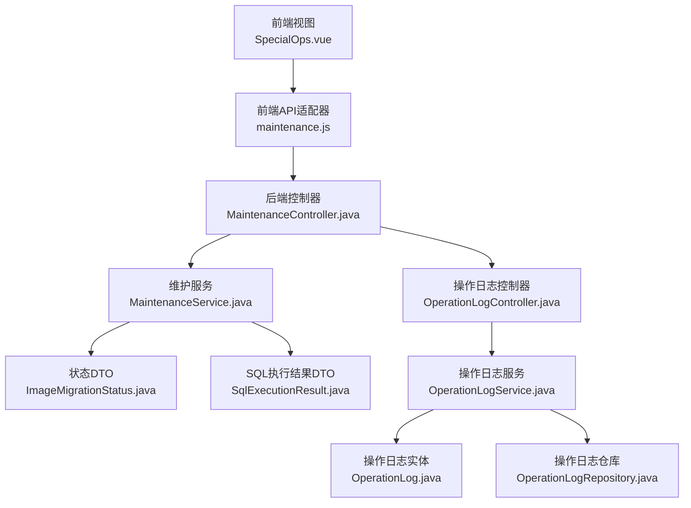
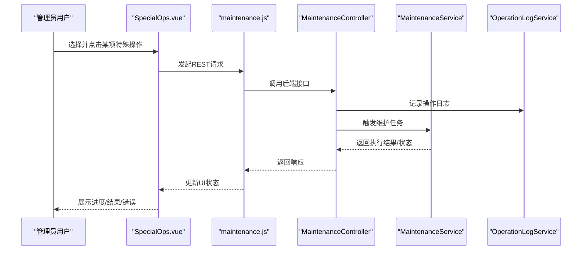
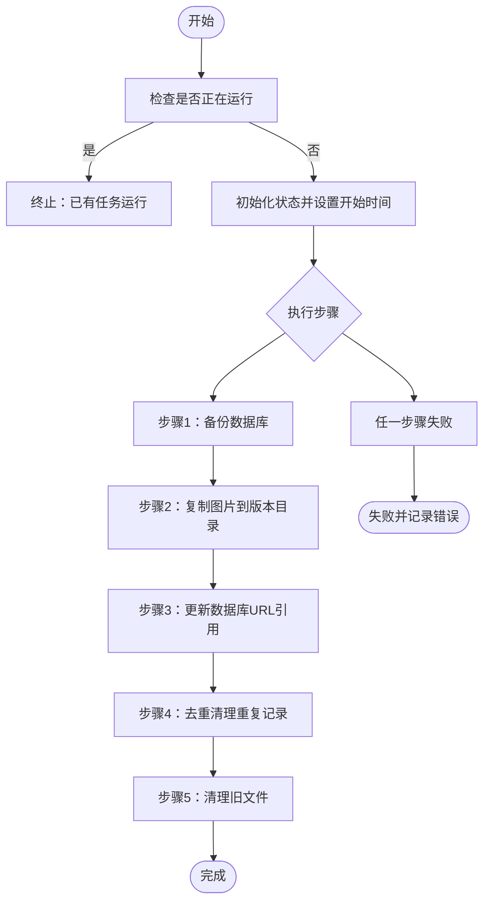
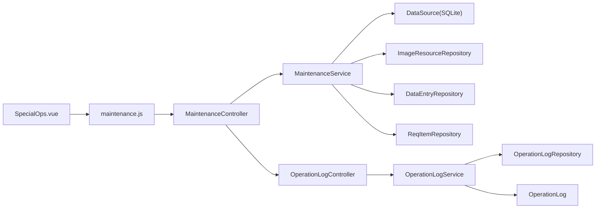

# 特殊操作页面

<cite>
**本文档引用的文件**
- [SpecialOps.vue](file://frontend/src/views/system/SpecialOps.vue)
- [maintenance.js](file://frontend/src/api/maintenance.js)
- [MaintenanceController.java](file://src/main/java/com/superpower/modules/system/controller/MaintenanceController.java)
- [MaintenanceService.java](file://src/main/java/com/superpower/modules/system/service/MaintenanceService.java)
- [ImageMigrationStatus.java](file://src/main/java/com/superpower/modules/system/dto/ImageMigrationStatus.java)
- [SqlExecutionResult.java](file://src/main/java/com/superpower/modules/system/dto/SqlExecutionResult.java)
- [OperationLogService.java](file://src/main/java/com/superpower/modules/system/service/OperationLogService.java)
- [OperationLog.java](file://src/main/java/com/superpower/modules/system/entity/OperationLog.java)
- [OperationLogController.java](file://src/main/java/com/superpower/modules/system/controller/OperationLogController.java)
- [OperationLogRepository.java](file://src/main/java/com/superpower/modules/system/repository/OperationLogRepository.java)
- [AuthUtils.java](file://src/main/java/com/superpower/common/AuthUtils.java)
- [version.js](file://frontend/src/api/version.js)
- [init.sql](file://src/main/resources/db/init.sql)
</cite>

## 目录
1. [简介](#简介)
2. [项目结构](#项目结构)
3. [核心组件](#核心组件)
4. [架构总览](#架构总览)
5. [详细组件分析](#详细组件分析)
6. [依赖关系分析](#依赖关系分析)
7. [性能考虑](#性能考虑)
8. [故障排除指南](#故障排除指南)
9. [结论](#结论)
10. [附录](#附录)

## 简介
本文件面向系统管理员与运维工程师，全面解析“特殊操作页面”的实现机制与使用规范。该页面提供系统级维护、数据修复与批量处理能力，覆盖图片版本隔离迁移、文件名同步、图片引用ID修复、填充图片product_id、版本相关操作以及SQL脚本执行等高风险功能。文档将从架构、安全控制、执行流程、风险控制与回滚机制、备份建议、检查清单与异常处理等方面进行深入说明，并提供可视化图示帮助理解。

## 项目结构
前端采用Vue 3 + Element Plus，后端基于Spring Boot + Spring Security + JPA。特殊操作页面位于前端路由系统中，通过API适配器调用后端控制器，控制器委托维护服务执行具体任务，并记录操作日志。

图表来源
- [SpecialOps.vue:1-784](file://frontend/src/views/system/SpecialOps.vue#L1-L784)
- [maintenance.js:1-50](file://frontend/src/api/maintenance.js#L1-L50)
- [MaintenanceController.java:1-131](file://src/main/java/com/superpower/modules/system/controller/MaintenanceController.java#L1-L131)
- [MaintenanceService.java:1-909](file://src/main/java/com/superpower/modules/system/service/MaintenanceService.java#L1-L909)
- [ImageMigrationStatus.java:1-49](file://src/main/java/com/superpower/modules/system/dto/ImageMigrationStatus.java#L1-L49)
- [SqlExecutionResult.java:1-52](file://src/main/java/com/superpower/modules/system/dto/SqlExecutionResult.java#L1-L52)
- [OperationLogController.java:1-32](file://src/main/java/com/superpower/modules/system/controller/OperationLogController.java#L1-L32)
- [OperationLogService.java:1-77](file://src/main/java/com/superpower/modules/system/service/OperationLogService.java#L1-L77)
- [OperationLog.java:1-42](file://src/main/java/com/superpower/modules/system/entity/OperationLog.java#L1-L42)
- [OperationLogRepository.java:1-20](file://src/main/java/com/superpower/modules/system/repository/OperationLogRepository.java#L1-L20)

章节来源
- [SpecialOps.vue:1-784](file://frontend/src/views/system/SpecialOps.vue#L1-L784)
- [maintenance.js:1-50](file://frontend/src/api/maintenance.js#L1-L50)
- [MaintenanceController.java:1-131](file://src/main/java/com/superpower/modules/system/controller/MaintenanceController.java#L1-L131)

## 核心组件
- 前端视图组件：负责UI交互、状态展示、轮询刷新与用户确认。
- 前端API适配器：封装REST请求，统一错误提示。
- 后端控制器：鉴权与参数校验，触发维护服务并记录操作日志。
- 维护服务：实现具体维护逻辑（异步执行、事务控制、状态持久化）。
- DTO：用于前后端传递状态与SQL执行结果。
- 操作日志：记录管理员执行的特殊操作，支持审计与追踪。

章节来源
- [SpecialOps.vue:254-728](file://frontend/src/views/system/SpecialOps.vue#L254-L728)
- [maintenance.js:1-50](file://frontend/src/api/maintenance.js#L1-L50)
- [MaintenanceController.java:18-131](file://src/main/java/com/superpower/modules/system/controller/MaintenanceController.java#L18-L131)
- [MaintenanceService.java:26-52](file://src/main/java/com/superpower/modules/system/service/MaintenanceService.java#L26-L52)
- [ImageMigrationStatus.java:8-49](file://src/main/java/com/superpower/modules/system/dto/ImageMigrationStatus.java#L8-L49)
- [SqlExecutionResult.java:6-52](file://src/main/java/com/superpower/modules/system/dto/SqlExecutionResult.java#L6-L52)
- [OperationLogService.java:16-77](file://src/main/java/com/superpower/modules/system/service/OperationLogService.java#L16-L77)

## 架构总览
特殊操作页面遵循“前端-控制器-服务-数据层”的分层架构，配合Spring Security进行权限控制，通过操作日志实现审计追踪。

图表来源
- [SpecialOps.vue:343-401](file://frontend/src/views/system/SpecialOps.vue#L343-L401)
- [maintenance.js:3-49](file://frontend/src/api/maintenance.js#L3-L49)
- [MaintenanceController.java:33-130](file://src/main/java/com/superpower/modules/system/controller/MaintenanceController.java#L33-L130)
- [OperationLogService.java:27-48](file://src/main/java/com/superpower/modules/system/service/OperationLogService.java#L27-L48)

## 详细组件分析

### 图片版本隔离迁移（一键/分步）
- 功能用途：将图片从旧存储结构迁移到按版本隔离的新目录，同时更新数据库URL引用，清理重复记录与旧文件。
- 使用场景：版本隔离策略变更、图片存储重构、历史数据迁移。
- 执行流程：
  1) 一键模式：按步骤1-5顺序执行，若前一步骤未完成则中断。
  2) 分步模式：允许逐步骤执行，每步完成后方可执行下一步。
  3) 异步执行：使用@Async保证不阻塞HTTP线程。
  4) 状态持久化：通过ImageMigrationStatus跟踪每个步骤的进度与结果。
- 风险控制：
  - 步骤间依赖检查：前一步未完成则拒绝执行后续步骤。
  - 失败回滚：失败时记录错误信息，状态置为FAILED。
  - 数据库备份：步骤1执行SQLite BACKUP并VACUUM压缩。
  - 文件去重：步骤4删除重复记录，避免冗余。
- 回滚机制：当前实现未提供自动回滚，但具备备份与去重能力，建议结合数据库备份进行人工回滚。

图表来源
- [MaintenanceService.java:80-123](file://src/main/java/com/superpower/modules/system/service/MaintenanceService.java#L80-L123)
- [MaintenanceService.java:171-197](file://src/main/java/com/superpower/modules/system/service/MaintenanceService.java#L171-L197)
- [MaintenanceService.java:199-240](file://src/main/java/com/superpower/modules/system/service/MaintenanceService.java#L199-L240)
- [MaintenanceService.java:292-407](file://src/main/java/com/superpower/modules/system/service/MaintenanceService.java#L292-L407)
- [MaintenanceService.java:409-433](file://src/main/java/com/superpower/modules/system/service/MaintenanceService.java#L409-L433)
- [MaintenanceService.java:435-471](file://src/main/java/com/superpower/modules/system/service/MaintenanceService.java#L435-L471)

章节来源
- [SpecialOps.vue:343-401](file://frontend/src/views/system/SpecialOps.vue#L343-L401)
- [MaintenanceController.java:33-57](file://src/main/java/com/superpower/modules/system/controller/MaintenanceController.java#L33-L57)
- [MaintenanceService.java:54-123](file://src/main/java/com/superpower/modules/system/service/MaintenanceService.java#L54-L123)
- [ImageMigrationStatus.java:20-27](file://src/main/java/com/superpower/modules/system/dto/ImageMigrationStatus.java#L20-L27)

### 文件名同步（同步图片文件名）
- 功能用途：将图片物理文件名同步为显示名，确保文件名与图片标题一致，提升预览与Word生成体验。
- 使用场景：图片命名不规范、文件名与显示名不一致导致预览异常。
- 执行流程：
  - 遍历所有图片资源，计算期望存储名（基于显示名与原扩展名），移动文件并更新URL。
  - 同步引用：扫描data_entry中包含旧URL的字段，替换为新URL。
- 风险控制：
  - 跳过策略：当目标文件已存在或源文件缺失时跳过，避免覆盖与丢失。
  - 异常捕获：单条记录失败不影响整体流程。
- 回滚机制：当前未提供自动回滚，建议在执行前备份图片目录。

章节来源
- [SpecialOps.vue:436-484](file://frontend/src/views/system/SpecialOps.vue#L436-L484)
- [MaintenanceController.java:67-79](file://src/main/java/com/superpower/modules/system/controller/MaintenanceController.java#L67-L79)
- [MaintenanceService.java:477-587](file://src/main/java/com/superpower/modules/system/service/MaintenanceService.java#L477-L587)

### 修复图片引用ID（修复图片卡片ID）
- 功能用途：修复DataEntry中图片卡片的data-id，使其指向正确的image_resource记录，解决版本隔离迁移后历史数据引用失效问题。
- 使用场景：版本隔离迁移后，图片卡片引用ID与实际记录不一致。
- 执行流程：
  - 收集现有ID与versionId+storedName映射。
  - 扫描DataEntry描述字段中的data-id，尝试从data-url推导新ID并替换。
- 风险控制：
  - 仅对包含data-id的记录进行处理，避免误改。
  - 单条记录失败不影响整体流程。
- 回滚机制：当前未提供自动回滚，建议在执行前备份相关表。

章节来源
- [SpecialOps.vue:511-559](file://frontend/src/views/system/SpecialOps.vue#L511-L559)
- [MaintenanceController.java:89-109](file://src/main/java/com/superpower/modules/system/controller/MaintenanceController.java#L89-L109)
- [MaintenanceService.java:626-755](file://src/main/java/com/superpower/modules/system/service/MaintenanceService.java#L626-L755)

### 填充图片product_id
- 功能用途：扫描image_resource记录，根据product字段名称匹配L3级data_entry ID，填充product_id字段（已存在则跳过）。
- 使用场景：需要建立图片与产品层级的关联关系。
- 执行流程：
  - 统计总数、已填充、已有product_id、未匹配数量。
- 风险控制：
  - 跳过已有product_id记录，避免重复填充。
- 回滚机制：当前未提供自动回滚，建议在执行前备份image_resource。

章节来源
- [SpecialOps.vue:647-665](file://frontend/src/views/system/SpecialOps.vue#L647-L665)
- [MaintenanceController.java:123-129](file://src/main/java/com/superpower/modules/system/controller/MaintenanceController.java#L123-L129)
- [MaintenanceService.java:757-800](file://src/main/java/com/superpower/modules/system/service/MaintenanceService.java#L757-L800)

### 版本相关操作
- 导入Excel：将本地Excel数据导入到选定的编辑中版本，自动匹配分类与域。
- 迁移图片：将版本中引用的外部图片迁移到系统统一管理的图片目录。
- 修复层级：扫描并修复版本中数据节点的层级关系、父节点关联等异常数据。
- 使用场景：版本数据治理、图片集中管理、数据一致性修复。
- 安全控制：仅对状态为“编辑中”的版本开放操作。

章节来源
- [SpecialOps.vue:568-642](file://frontend/src/views/system/SpecialOps.vue#L568-L642)
- [version.js:7-9](file://frontend/src/api/version.js#L7-L9)

### SQL脚本执行
- 功能用途：直接执行数据库变更SQL，支持多语句（以分号分隔），返回每条语句的执行结果。
- 使用场景：紧急修复、批量更新、临时数据调整。
- 安全控制：
  - 必须提供SQL内容，否则抛出业务异常。
  - 每条语句独立执行，限制查询返回行数（MAX_QUERY_ROWS）。
- 风险控制：
  - 严格限制查询返回行数，防止大结果集拖垮系统。
  - 失败时返回错误信息，便于定位问题。
- 回滚机制：当前未提供自动回滚，建议在执行前备份数据库。

章节来源
- [SpecialOps.vue:690-714](file://frontend/src/views/system/SpecialOps.vue#L690-L714)
- [MaintenanceController.java:111-121](file://src/main/java/com/superpower/modules/system/controller/MaintenanceController.java#L111-L121)
- [MaintenanceService.java:757-800](file://src/main/java/com/superpower/modules/system/service/MaintenanceService.java#L757-L800)
- [SqlExecutionResult.java:17-50](file://src/main/java/com/superpower/modules/system/dto/SqlExecutionResult.java#L17-L50)

## 依赖关系分析
- 前端依赖后端API，后端控制器依赖维护服务与操作日志服务。
- 维护服务依赖数据源（SQLite）、图片资源仓库、数据条目仓库与需求条目仓库。
- 操作日志服务通过仓库持久化日志，支持按用户或全局查询。

图表来源
- [SpecialOps.vue:254-261](file://frontend/src/views/system/SpecialOps.vue#L254-L261)
- [maintenance.js:1-50](file://frontend/src/api/maintenance.js#L1-L50)
- [MaintenanceController.java:23-31](file://src/main/java/com/superpower/modules/system/controller/MaintenanceController.java#L23-L31)
- [MaintenanceService.java:44-52](file://src/main/java/com/superpower/modules/system/service/MaintenanceService.java#L44-L52)
- [OperationLogController.java:15-19](file://src/main/java/com/superpower/modules/system/controller/OperationLogController.java#L15-L19)
- [OperationLogService.java:21-25](file://src/main/java/com/superpower/modules/system/service/OperationLogService.java#L21-L25)
- [OperationLogRepository.java:9-19](file://src/main/java/com/superpower/modules/system/repository/OperationLogRepository.java#L9-L19)

章节来源
- [MaintenanceService.java:26-52](file://src/main/java/com/superpower/modules/system/service/MaintenanceService.java#L26-L52)
- [OperationLogService.java:16-77](file://src/main/java/com/superpower/modules/system/service/OperationLogService.java#L16-L77)

## 性能考虑
- 异步执行：迁移与修复任务均使用@Async，避免阻塞主线程。
- 分步处理：通过进度计数与分批更新，降低单次事务压力。
- 查询限制：SQL执行限制查询返回行数，防止大结果集影响性能。
- 文件I/O优化：复制与移动文件时进行存在性检查与跳过策略，减少无效IO。

## 故障排除指南
- 常见问题
  - 任务已在运行：前端/后端均提供检查，避免并发执行。
  - 步骤依赖失败：前一步未完成会导致后续步骤被拒绝。
  - 文件移动失败：源文件不存在或目标文件已存在时会跳过。
  - SQL执行失败：返回具体错误信息，需检查语句合法性。
- 排查步骤
  - 查看前端状态面板与消息提示。
  - 检查后端日志与数据库状态。
  - 通过操作日志接口查询管理员操作记录。
- 恢复建议
  - 数据库备份：执行前务必备份数据库。
  - 文件备份：执行文件名同步与迁移前备份图片目录。
  - 人工回滚：根据备份进行回滚，必要时联系技术支持。

章节来源
- [MaintenanceController.java:63-68](file://src/main/java/com/superpower/modules/system/controller/MaintenanceController.java#L63-L68)
- [MaintenanceService.java:171-197](file://src/main/java/com/superpower/modules/system/service/MaintenanceService.java#L171-L197)
- [OperationLogController.java:21-31](file://src/main/java/com/superpower/modules/system/controller/OperationLogController.java#L21-L31)

## 结论
特殊操作页面提供了系统级维护与修复能力，通过严格的权限控制、状态管理与操作日志实现了可审计、可追踪的运维流程。建议在执行任何高风险操作前，制定详细的备份与回滚计划，并在低峰期执行，确保系统稳定与数据安全。

## 附录

### 安全控制机制
- 权限验证：所有特殊操作接口均要求ADMIN角色。
- 用户识别：通过认证上下文获取用户ID与用户名。
- 操作日志：记录操作者、模块、动作与描述，支持审计与追踪。

章节来源
- [MaintenanceController.java:20-21](file://src/main/java/com/superpower/modules/system/controller/MaintenanceController.java#L20-L21)
- [MaintenanceController.java:34-130](file://src/main/java/com/superpower/modules/system/controller/MaintenanceController.java#L34-L130)
- [AuthUtils.java:12-27](file://src/main/java/com/superpower/common/AuthUtils.java#L12-L27)
- [OperationLogService.java:27-48](file://src/main/java/com/superpower/modules/system/service/OperationLogService.java#L27-L48)

### 执行流程与状态模型
- 状态DTO：包含总步骤数、当前步骤、进度计数、各步骤结果与错误信息。
- 前端轮询：定时拉取后端状态，实时更新UI。
- 失败处理：失败时记录错误信息，停止后续步骤。

章节来源
- [ImageMigrationStatus.java:8-49](file://src/main/java/com/superpower/modules/system/dto/ImageMigrationStatus.java#L8-L49)
- [SpecialOps.vue:329-401](file://frontend/src/views/system/SpecialOps.vue#L329-L401)

### 数据库初始化与表结构
- 初始化脚本包含系统用户、角色、菜单、数据版本、数据条目等核心表定义，为特殊操作提供基础数据支撑。

章节来源
- [init.sql:1-126](file://src/main/resources/db/init.sql#L1-L126)